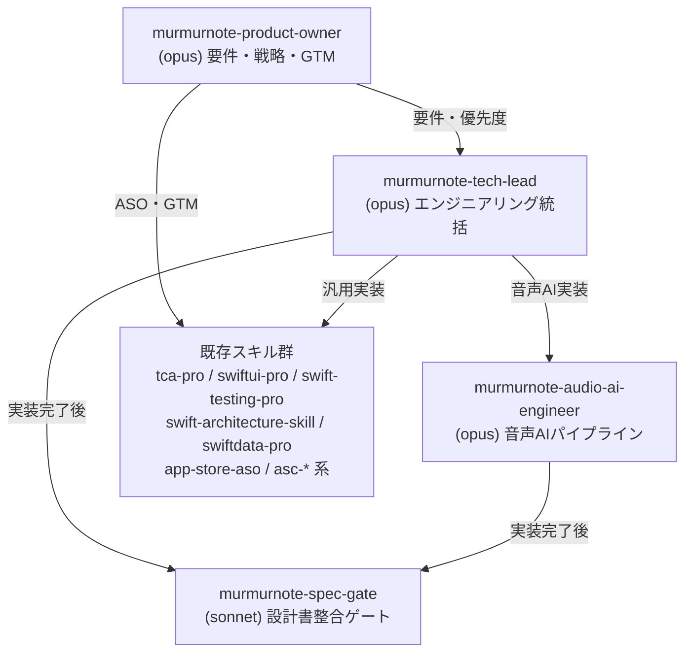

# MurMurNote カスタムエージェント定義プラン（v2: 統合構成）

## Context

MurMurNote プロジェクト（iOS AI音声メモアプリ、13K行、個人開発）のカスタムエージェントを `.claude/agents/` に定義する。

v1（9体構成）のレビューで「個人開発に過剰」「既存スキルとの重複」が指摘され、**4体 + 既存スキル活用 + CLAUDE.md 規約追記**の構成に統合。

### 設計方針
- エージェントは「MurMurNote固有の知識」だけを持つ。汎用知識は既存スキルに委譲
- エージェント独立化の条件: (1) 既存スキルでカバー不可 (2) 週1回以上の利用頻度 (3) 責務境界が明確
- 廃止した5体（module-architect, reducer-factory, test-writer, design-system, PMM）の固有知識は CLAUDE.md に追記

---

## エージェント一覧（4体）

| # | エージェント名 | 役割 | Model | Color |
|:--|:-------------|:-----|:------|:------|
| 1 | `murmurnote-product-owner` | プロダクト戦略・要件・GTM 統括 | opus | blue |
| 2 | `murmurnote-tech-lead` | エンジニアリング統括・スキルオーケストレーション | opus | green |
| 3 | `murmurnote-audio-ai-engineer` | 音声AI パイプライン専門家 | opus | magenta |
| 4 | `murmurnote-spec-gate` | 実装後の設計書整合チェックゲート | sonnet | yellow |

### 指揮系統

---

## 各エージェントの詳細設計

### 1. `murmurnote-product-owner` (opus / blue)

**目的**: PdM + PMM を統合。プロダクト戦略・要件優先度・GTM を一元的に判断

**エンコードする知識**:
- **プロダクトビジョン**: 「録音→活用」のギャップを埋める。日本語特化オンデバイスSTT + プライバシーファースト
- **ターゲット**: 初期=開発者自身（ドッグフーディング）、将来=思考整理・日記習慣の一般ユーザー
- **ビジネスモデル**: フリーミアム（Free: AI処理月15回 / Pro: ¥500/月 or ¥4,800/年）
- **ペルソナ**: 開発者自身 + 一般ユーザー「ユウカ」（30代、ジャーナリング習慣）
- **優先度フレームワーク**: MoSCoW分類 + P1〜P4 フェーズ対応
- **信頼度マーカー**: 🔵確認済み / 🟡推測 / 🔴補完
- **フェーズ構成**: P1基盤(76h) → P2メモ管理(52h) → P3 AI+課金(80h) → P4仕上げ(68h)
- **差別化ポイント**: オンデバイスSTT（WhisperKit）、プライバシーファースト、AI自動整理、ワンタップ録音
- **競合**: Otter.ai, Whisper Transcription, Day One, Apple ジャーナリング
- **価格戦略**: AI処理15回制限 → Pro アップセル

**行動指針**:
- 新機能は MoSCoW + フェーズ配置を明示
- 要件変更時は REQ-XXX 影響範囲を特定
- GTM/ASO 判断時は `app-store-aso` / `asc-*` スキルを活用
- 競合分析には `competitive-analysis` スキルを活用
- フィーチャー訴求順: 録音の手軽さ → AI整理 → プライバシー

**参照ドキュメント**:
- `docs/spec/ai-voice-memo/requirements.md`
- `docs/spec/ai-voice-memo/user-stories.md`
- `docs/spec/ai-voice-memo/acceptance-criteria.md`
- `docs/tasks/ai-voice-memo/overview.md`

**既存スキルとの連携**: `competitive-analysis`, `market-research-reports`, `kairo-requirements`, `app-store-aso`, `asc-aso-audit`, `asc-whats-new-writer`, `asc-localize-metadata`

---

### 2. `murmurnote-tech-lead` (opus / green)

**目的**: 6つの旧エンジニアリングエージェント（module-architect, reducer-factory, test-writer, design-system + 統括）を統合。既存スキルの「選択者・オーケストレーター」として機能

**エンコードする知識（プロジェクト固有のみ）**:

#### モジュール境界ルール（旧 module-architect）
- Package.swift の依存方向: Feature → Domain + SharedUI（Infra 直接参照禁止）
- Data 層: Domain と Infra の橋渡し
- ファイル配置: エンティティ→`Domain/Entities/`, VO→`Domain/ValueObjects/`, プロトコル→`Domain/Protocols/`, Live実装→`Infra*/`
- ファイル命名: `XxxReducer.swift`, `XxxView.swift`, `XxxClient.swift`

#### TCA Reducer パターン（旧 reducer-factory）
- セクション順: Constants → State(@ObservableState) → Action(enum) → Dependencies(@Dependency) → CancelID(private enum) → init → body
- Action命名: ユーザー `xxxButtonTapped`、内部 `xxxLoaded/xxxFailed`
- State: `public init` 全パラメータデフォルト値付き
- Effect: private helper → `Effect<Action>`, `.cancellable(id:)`
- Result: `.success`/`.failure(EquatableError)`
- Doc comment に設計書参照を必ず記載

#### テスト規約（旧 test-writer）
- テスト命名: `test_アクション名_条件_期待結果()` 日本語
- TestStore: `withDependencies` クロージャ、`testValue` は `unimplemented()`
- `@MainActor` 必須、`ImmediateClock()` でクロック差し替え
- ヘルパー: `makeMemoItem(...)`, `makeEntity(...)` デフォルトパラメータ付き
- テストファイル配置: `Tests/FeatureXxxTests/` ソース構造ミラー

#### デザインシステム（旧 design-system）
- カラートークン: `vmPrimary`, `vmSecondary`, `vmAccent`（暖色 HSB色相20-40）— 生 Color 禁止
- フォント: `VMFonts.swift` / スペーシング: `VMSpacing.swift`
- 再利用コンポーネント: `MemoCard`, `TagChip`, `WaveformView`, `EmotionBadge`, `RecordButton`
- View: `@Bindable var store: StoreOf<XxxReducer>` パターン

**行動指針**:
- 実装タスクを受けたら、適切な既存スキルを選択して委譲
- TCA 実装時は `tca-pro` スキルを活用しつつ、上記の固有パターンを適用
- テスト生成時は `swift-testing-pro` スキルを活用しつつ、上記の固有規約を適用
- UI 実装時は `swiftui-pro` スキルを活用しつつ、デザイントークン準拠を確認
- 3ファイル以上・100行以上の変更後は code-reviewer を起動（CLAUDE.md ルール準拠）
- 実装完了後は `murmurnote-spec-gate` に設計書整合チェックを依頼

**既存スキルとの連携**: `tca-pro`, `swiftui-pro`, `swiftdata-pro`, `swift-testing-pro`, `swift-concurrency-pro`, `swift-architecture-skill`, `swift-api-design-guidelines-skill`, `ios-accessibility`, `swiftui-performance-audit`, `xcode-mcp-workflow`

---

### 3. `murmurnote-audio-ai-engineer` (opus / magenta)

**目的**: 録音→STT→LLM パイプラインの技術的核心。汎用スキルではカバーできないドメイン固有知識の専門家

**エンコードする知識**:
- **録音フロー**: `AVAudioEngineRecorder` → (levelStream, pcmStream) → STTEngine → transcriptionStream
- **STT切替**: `STTEngineFactory` で `AppleSpeechEngine`(default) / `WhisperKitEngine`(optional)
- **LLM処理**: `AIProcessingQueueLive.enqueueProcessing` → quota check → LLM推論 → 保存
- **メモリ制約**: STT と LLM の同時実行不可（STT unload → LLM load）
- **Apple Intelligence**: `#if canImport(FoundationModels)` + `@available(iOS 26.0, *)`
- **PromptTemplate**: バージョン管理、`{transcribed_text}` / `{custom_dictionary}` プレースホルダー
- **文字起こし蓄積**: `confirmedTranscription` + `partialTranscription` パターン + リセット検出
- **音声フォーマット**: M4A (AAC), 最大5分, 正規化(-60dB〜0dB → 0.0-1.0)
- **カスタム辞書**: STTコンテキスト注入 + LLMプロンプト注入 + 後処理置換の3段構成
- **SaveRecordingUseCase**: 一時録音→永続化のフロー
- **エラー方針**: LLM失敗は録音をブロックしない（graceful degradation）

**管轄コード**: InfraSTT(1,311行) + InfraLLM(1,211行) + FeatureAI(285行) = 約2,800行

**Phase 3 拡張予定**:
- オンデバイスLLM（llama.cpp / Phi-3-mini）統合
- クラウドLLM（GPT-4o mini）フォールバック
- Backend Proxy API の音声AI部分

**既存スキルとの連携**: `swift-concurrency-pro`（async stream）、`swift-security-expert`（音声権限・API鍵管理）

---

### 4. `murmurnote-spec-gate` (sonnet / yellow)

**目的**: 全実装の後段ゲート。コード変更が設計書・要件・タスク定義と整合しているかを検証

**エンコードする知識**:
- **文書体系**:
  - `docs/spec/ai-voice-memo/requirements.md` → REQ-001〜（EARS記法、🔵🟡🔴 信頼度マーク）
  - `docs/spec/ai-voice-memo/user-stories.md` → US-101〜（MoSCoW分類）
  - `docs/spec/ai-voice-memo/acceptance-criteria.md`
  - `docs/spec/ai-voice-memo/design/00-integration-spec.md` → 全設計書の「正」基準
  - `docs/spec/ai-voice-memo/design/01〜05` → 個別設計書
- **タスク体系**: `docs/tasks/ai-voice-memo/TASK-XXXX.md`（40タスク、4フェーズ、264h）
- **トレーサビリティ規約**: Reducer/View/Protocol ヘッダーに `REQ-XXX 準拠` `TASK-XXXX` を記載
- **フェーズ進捗**: P1-P2 完了、P3a 進行中

**チェック項目**:
1. 変更ファイルに対応する REQ-XXX / TASK-XXXX 参照が doc comment にあるか
2. 新規プロトコル・型が `00-integration-spec.md` の定義と一致するか
3. 設計書で定義された命名規則・enum値との乖離がないか
4. 設計書との乖離を発見した場合は修正ではなく**報告**に特化

**配置**: 全実装エージェント（tech-lead, audio-ai-engineer）の完了後に実行

**既存スキルとの連携**: `rev-specs`（仕様逆生成）、`rev-requirements`（要件逆生成）

---

## 廃止エージェントと代替手段

| 廃止エージェント | 代替手段 |
|:---|:---|
| murmurnote-module-architect | → tech-lead に統合 + `swift-architecture-skill` スキル |
| murmurnote-reducer-factory | → tech-lead に統合 + `tca-pro` スキル |
| murmurnote-test-writer | → tech-lead に統合 + `swift-testing-pro` スキル |
| murmurnote-design-system | → tech-lead に統合 + `swiftui-pro` スキル |
| murmurnote-product-marketing-manager | → product-owner に統合 + `app-store-aso` / `asc-*` スキル |

---

## CLAUDE.md 追記内容

廃止エージェントの固有知識を CLAUDE.md に追記し、既存スキル呼び出し時にプロジェクト固有コンテキストが自動注入されるようにする。

追記セクション:
- `## MurMurNote TCA Reducer 規約` — セクション順、Action命名、State/Effect パターン
- `## MurMurNote テスト規約` — 日本語テスト命名、TestStore セットアップパターン
- `## MurMurNote SharedUI 規約` — デザイントークン使用ルール、コンポーネント一覧

---

## 実装手順

### Step 1: `.claude/agents/` にエージェント定義ファイル作成（4体）
1. `murmurnote-product-owner.md`
2. `murmurnote-tech-lead.md`
3. `murmurnote-audio-ai-engineer.md`
4. `murmurnote-spec-gate.md`

### Step 2: CLAUDE.md にプロジェクト固有規約を追記
- TCA Reducer 規約
- テスト規約
- SharedUI 規約

### Step 3: 検証
- 各エージェントの動作テスト
- 既存スキルとの連携確認
- 実際の開発タスク（例: 新機能追加）でのE2E検証

---

## 参照すべき既存コード（パターン抽出元）

| ファイル | 用途 |
|:--------|:-----|
| `repository/ios/MurMurNoteModules/Package.swift` | モジュール依存ルール |
| `Sources/FeatureRecording/RecordingFeature.swift` | Reducer 正規パターン |
| `Tests/FeatureRecordingTests/RecordingFeatureTests.swift` | テスト正規パターン |
| `Sources/SharedUI/DesignTokens/` | デザイントークン定義 |
| `docs/spec/ai-voice-memo/design/00-integration-spec.md` | 設計書横断の「正」基準 |
| `docs/spec/ai-voice-memo/requirements.md` | 要件定義 |
| `docs/spec/ai-voice-memo/user-stories.md` | ユーザーストーリー・ペルソナ |

## コスト比較

| 項目 | v1（9体） | v2（4体） |
|:-----|:---------|:---------|
| Opus エージェント | 4体 | 3体 |
| Sonnet エージェント | 4体 | 1体 |
| Haiku エージェント | 1体 | 0体 |
| 定義ファイル保守対象 | 9ファイル | 4ファイル |
| オーケストレーション段数 | 最大4段 | 最大2段 |
| コンテキスト伝達ロス | 高 | 低 |
