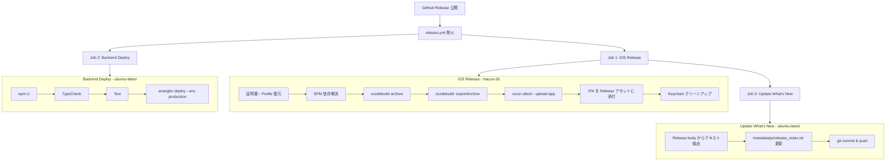

# CI/CD リリースフロー運用ドキュメント

Soyoka プロジェクトの CI/CD パイプラインの全体像、リリース手順、構築時の知見をまとめる。

---

## 1. 概要

GitHub Release の公開をトリガーに、以下の3つの処理が全自動で実行される:

1. **iOS ビルド → App Store Connect アップロード**: xcodebuild で Archive → IPA 生成 → `xcrun altool` で App Store Connect にアップロード
2. **Backend デプロイ**: TypeCheck + Test → Cloudflare Workers（production 環境）にデプロイ
3. **What's New テキスト生成**: Release body から App Store 用「新機能」テキストを抽出し、リポジトリにコミット

技術選定として Fastlane を使わず、`xcodebuild` + `xcrun altool` の直接呼び出しを採用した。依存が少なくデバッグしやすい。

### パイプライン全体図



---

## 2. リリース手順（開発者が行う操作）

開発者が行う操作は以下の4ステップのみ。それ以降は全自動。

### Step 1: development ブランチで開発

```bash
git checkout development
# ... 機能開発・バグ修正 ...
git push origin development
```

### Step 2: main にマージ（PR 経由）

```bash
gh pr create --base main --head development --title "Release v1.x.x"
# レビュー後にマージ
```

### Step 3: GitHub で Release を作成

1. GitHub リポジトリの **Releases** ページを開く
2. **「Create a new release」** をクリック
3. タグを入力（例: `v1.0.0`）、ターゲットブランチに `main` を選択
4. **「Generate release notes」** ボタンをクリック（PR ラベルに応じて自動分類される）
5. 必要に応じてリリースノートを編集
6. **「Publish release」** をクリック

### Step 4: 全自動（待つだけ）

Release の公開により `release.yml` が発火し、iOS ビルド / Backend デプロイ / What's New 更新が並行実行される。

進捗は GitHub Actions のワークフロー実行画面で確認可能:
```
https://github.com/<owner>/<repo>/actions/workflows/release.yml
```

---

## 3. CI/CD パイプラインの詳細

### 3.1 ワークフロー構成

| ファイル | 役割 |
|:--------|:-----|
| `.github/workflows/release.yml` | メインワークフロー（3ジョブ） |
| `.github/release.yml` | リリースノート自動分類（PR ラベル → カテゴリ） |
| `repository/ios/ExportOptions.plist` | IPA エクスポート設定（手動署名） |

### 3.2 Job 1: iOS Release

| 項目 | 値 |
|:----|:--|
| ランナー | `macos-26` |
| タイムアウト | 30分 |
| 所要時間（実測） | 約4分 |
| 権限 | `contents: write`（IPA アセットアップロード用） |

**処理フロー:**

1. **証明書・Provisioning Profile の復元**: GitHub Secrets から Base64 デコードし、一時 Keychain にインポート
2. **App Store Connect API Key の配置**: `.p8` ファイルを `~/.private_keys/` に復元
3. **SPM 依存解決**: `xcodebuild -resolvePackageDependencies`
4. **Archive**: 自動署名（`DEVELOPMENT_TEAM` のみ指定）+ API Key 認証で Provisioning Updates を許可
5. **Export IPA**: `ExportOptions.plist` に基づき手動署名で IPA 生成
6. **App Store Connect アップロード**: `xcrun altool --upload-app`
7. **Release アセットに IPA 添付**: `gh release upload` でビルド成果物を保存
8. **クリーンアップ**: 一時 Keychain・証明書・API Key を削除（`always()` で失敗時も実行）

### 3.3 Job 2: Backend Deploy

| 項目 | 値 |
|:----|:--|
| ランナー | `ubuntu-latest` |
| タイムアウト | 10分 |
| 所要時間（実測） | 約30秒 |

**処理フロー:**

1. Node.js 20 セットアップ + `npm ci`
2. `npm run typecheck`（型チェック）
3. `npm run test`（テスト実行）
4. `npx wrangler deploy --env production`（Cloudflare Workers にデプロイ）

Job 1（iOS）と並行実行される。Backend のデプロイが iOS のアップロードに依存しないため。

### 3.4 Job 3: Update What's New

| 項目 | 値 |
|:----|:--|
| ランナー | `ubuntu-latest` |
| タイムアウト | 5分 |
| 所要時間（実測） | 約10秒 |
| 依存 | `ios-release`（App Store アップロード完了後に実行） |
| 権限 | `contents: write`（コミット・プッシュ用） |

**処理フロー:**

1. Release body（リリースノート）を環境変数から取得
2. Markdown 記法を除去し、4000文字以内に切り詰め
3. `metadata/ja/release_notes.txt` に書き出し
4. 変更があればコミット & プッシュ（`github-actions[bot]` ユーザー名で）

---

## 4. 構築時に遭遇した問題と解決策（知見）

CI/CD パイプラインの構築中に遭遇した11の問題とその解決策を記録する。同種のパイプラインを構築する際の参考になる。

| # | 問題 | 原因 | 解決策 |
|:--|:-----|:-----|:-------|
| 1 | xcbeautify で Archive エラーが隠蔽される | `\| xcbeautify \|\| true` のパイプがエラーを握りつぶし、Archive 失敗なのに成功扱いになる | パイプを削除し、xcodebuild の出力をそのまま使用 |
| 2 | `wrangler deploy --env production` が失敗 | `wrangler.toml` に `[env.production]` セクションが未定義で、D1/KV バインディングも存在しない | `[env.production]` セクションを追加し、D1 データベースと KV ネームスペースのバインディングを定義 |
| 3 | Swift マクロ（TCA 等）が CI でブロックされる | macOS ランナーではマクロの自動有効化が無効化されており、ビルド時にマクロ実行がブロックされる | `xcodebuild` に `-skipMacroValidation -skipPackagePluginValidation` フラグを追加 |
| 4 | `SpeechAnalyzer` フレームワークが見つからない | `macos-15` ランナーには Xcode 16.4 しかインストールされておらず、iOS 26 の新 API（SpeechAnalyzer）が利用不可 | ランナーを `macos-26` に変更し、Xcode 26.3 を使用 |
| 5 | exportArchive で「Failed to Use Accounts」エラー | 自動署名（Cloud signing）が CI 環境の API Key 権限では動作しない | `ExportOptions.plist` で `signingStyle: manual` を指定し、`provisioningProfiles` マッピングを追加 |
| 6 | `PROVISIONING_PROFILE_SPECIFIER` が SPM パッケージに適用される | `xcodebuild` の build setting として渡した `PROVISIONING_PROFILE_SPECIFIER` が、アプリターゲットだけでなく全ターゲット（SPM パッケージ含む）に伝播する | Archive では自動署名（`DEVELOPMENT_TEAM` のみ指定）とし、Export のみ `ExportOptions.plist` で手動署名に切り替える |
| 7 | IPA の Release アセットアップロードで 403 エラー | `GITHUB_TOKEN` にデフォルトでは `contents: write` 権限がない | ジョブに `permissions: contents: write` を追加 |
| 8 | App Store Connect アップロードで Validation failed | `Info.plist` に `UISupportedInterfaceOrientations` が未設定で、App Store の Validation ルールに抵触 | 4方向の画面回転設定（Portrait, LandscapeLeft, LandscapeRight, PortraitUpsideDown）を `Info.plist` に追加 |
| 9 | Missing Document Configuration 警告 | `CFBundleDocumentTypes` を宣言しているが、`LSSupportsOpeningDocumentsInPlace` が未設定 | `Info.plist` に `LSSupportsOpeningDocumentsInPlace = YES` を追加 |
| 10 | Cloudflare API トークン認証失敗 | Cloudflare には「アカウント API トークン」と「ユーザープロフィール API トークン」の2種類があり、間違った方を使用していた | [dash.cloudflare.com/profile/api-tokens](https://dash.cloudflare.com/profile/api-tokens) からユーザープロフィール API トークンを作成（「Cloudflare Workers を編集する」テンプレート使用） |
| 11 | App Store Connect に `app.soyoka` が登録できない | Bundle ID `app.soyoka` が他のデベロッパーに先に取得されている | `app.soyoka.ios` に変更。正式な `app.soyoka` は Apple Developer Support に問い合わせて取り戻し可能（ドメイン `soyoka.app` の所有証明が必要） |

### 特に重要な知見

**問題 #1（xcbeautify のエラー隠蔽）** は最も発見が遅れた問題。CI のログ上では成功しているように見えるため、Export ステップで初めてエラーに気づく。CI パイプラインでは出力整形ツールのパイプは避けるか、`set -o pipefail` を確実に設定すべき。

**問題 #5 + #6（署名方式の組み合わせ）** は iOS CI/CD 特有の罠。Archive と Export で異なる署名方式を使い分ける必要がある点は、ドキュメントが少なく試行錯誤が必要だった。詳細は次セクション「署名方式の設計判断」を参照。

---

## 5. 署名方式の設計判断

iOS のコード署名は CI/CD で最も複雑な部分。本プロジェクトでは Archive と Export で異なる署名方式を採用している。

### 最終的な構成

| フェーズ | 署名方式 | 設定方法 |
|:--------|:--------|:--------|
| **Archive** | 自動署名（Automatic） | `CODE_SIGN_STYLE` 未指定 + `DEVELOPMENT_TEAM` のみ指定。API Key 認証で `-allowProvisioningUpdates` を付与 |
| **Export** | 手動署名（Manual） | `ExportOptions.plist` で `signingStyle: manual` + `provisioningProfiles` マッピングを指定 |

### ExportOptions.plist の内容

```xml
<?xml version="1.0" encoding="UTF-8"?>
<!DOCTYPE plist PUBLIC "-//Apple//DTD PLIST 1.0//EN"
  "http://www.apple.com/DTDs/PropertyList-1.0.dtd">
<plist version="1.0">
<dict>
    <key>method</key>
    <string>app-store-connect</string>
    <key>signingStyle</key>
    <string>manual</string>
    <key>teamID</key>
    <string>BUX437B476</string>
    <key>provisioningProfiles</key>
    <dict>
        <key>app.soyoka.ios</key>
        <string>Soyoka AppStore</string>
    </dict>
    <key>uploadSymbols</key>
    <true/>
</dict>
</plist>
```

### なぜこの組み合わせか

1. **Archive で自動署名にする理由**: `CODE_SIGN_STYLE=Manual` + `PROVISIONING_PROFILE_SPECIFIER` を xcodebuild の build setting として渡すと、アプリターゲットだけでなく SPM パッケージの全ターゲットにも伝播する。SPM パッケージには Provisioning Profile が不要なのでエラーになる。自動署名なら `DEVELOPMENT_TEAM` だけで済み、SPM パッケージへの影響がない。

2. **Export で手動署名にする理由**: 自動署名（Cloud signing）は CI 環境の API Key 権限では「Failed to Use Accounts」エラーが発生する。手動署名で明示的に Provisioning Profile を指定することで回避。

3. **API Key 認証を Archive に付与する理由**: `-allowProvisioningUpdates` + `-authenticationKeyPath` により、Archive 時に必要な Provisioning Profile の自動ダウンロード・更新が可能になる。

---

## 6. このフローによる改善点

CI/CD パイプライン導入前後の比較:

| 項目 | 導入前（手動） | 導入後（自動） |
|:----|:-------------|:-------------|
| リリース操作 | Xcode Archive → Export → altool 手動実行 | GitHub「Create a new release」ボタン1つ |
| 所要時間 | 30分以上（手動操作 + 待ち時間） | 約4分（iOS）、自動で完了 |
| 署名ミスのリスク | Profile 選択ミス、証明書期限切れ見落とし | ExportOptions.plist で固定、再現性あり |
| Backend 同期 | iOS リリース後に手動で wrangler deploy | リリースに連動して自動デプロイ |
| リリースノート | 手動で変更点を列挙 | PR ラベルから自動生成 |
| What's New | App Store Connect で手動入力 | Release body から自動抽出 |
| ビルド成果物の保存 | ローカルに残るのみ | GitHub Release アセットとして IPA を保存 |
| 月額コスト | $0（人件費は別） | 約 $0（GitHub Free プランの無料枠内） |

### コスト詳細

| ジョブ | ランナー | 所要時間 | 分数消費（macOS は10倍換算） |
|:------|:--------|:--------|:--------------------------|
| ios-release | macOS | 約4分 | 40分 |
| backend-deploy | Linux | 約30秒 | 0.5分 |
| update-whats-new | Linux | 約10秒 | 0.2分 |

月2回リリースの場合、約81分/月の消費。GitHub Free プランの2,000分/月の枠に十分収まる。

---

## 7. 環境情報

| 項目 | 値 |
|:----|:--|
| GitHub Actions ランナー（iOS） | `macos-26` |
| GitHub Actions ランナー（Backend/What's New） | `ubuntu-latest` |
| Xcode | 26.3 |
| Swift | 6.2 |
| Node.js | 20 |
| Cloudflare Workers 環境 | production（`api.soyoka.app`） |
| Bundle ID | `app.soyoka.ios` |
| Apple Developer Team ID | `BUX437B476` |

### GitHub Secrets（8つ）

| Secret 名 | 用途 |
|:----------|:-----|
| `CERTIFICATES_P12_BASE64` | iOS コード署名証明書 |
| `CERTIFICATES_P12_PASSWORD` | p12 パスワード |
| `PROVISIONING_PROFILE_BASE64` | App Store Distribution Profile |
| `ASC_KEY_ID` | App Store Connect API Key ID |
| `ASC_ISSUER_ID` | App Store Connect Issuer ID |
| `ASC_API_KEY_BASE64` | App Store Connect API Key (.p8) |
| `APPLE_TEAM_ID` | Apple Developer Team ID |
| `CLOUDFLARE_API_TOKEN` | Cloudflare Workers API トークン |

セットアップ手順の詳細は `docs/setup/apple-developer-cicd-setup.md` を参照。

---

## 8. 関連ドキュメント

| ドキュメント | パス |
|:-----------|:----|
| セットアップ手順（証明書・Secrets 登録） | `docs/setup/apple-developer-cicd-setup.md` |
| CI/CD パイプライン設計書 | `docs/superpowers/specs/2026-03-30-cicd-pipeline-design.md` |
| CI/CD 実装計画 | `docs/superpowers/plans/2026-03-30-cicd-pipeline.md` |
| 強制アップデート運用手順 | `repository/backend/docs/force-update-operations.md` |
| ワークフロー定義 | `.github/workflows/release.yml` |
| リリースノート分類設定 | `.github/release.yml` |
| IPA エクスポート設定 | `repository/ios/ExportOptions.plist` |
