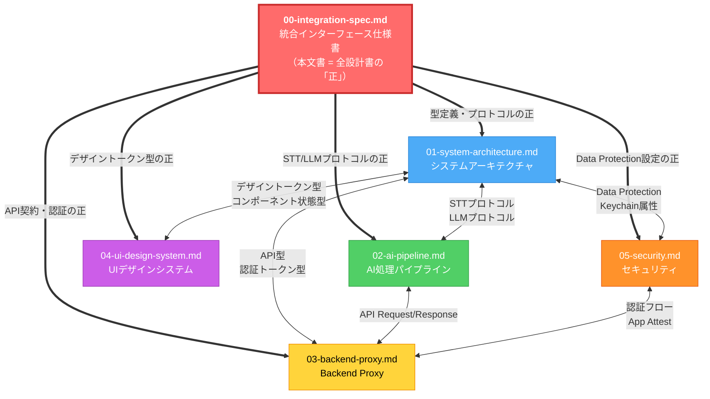
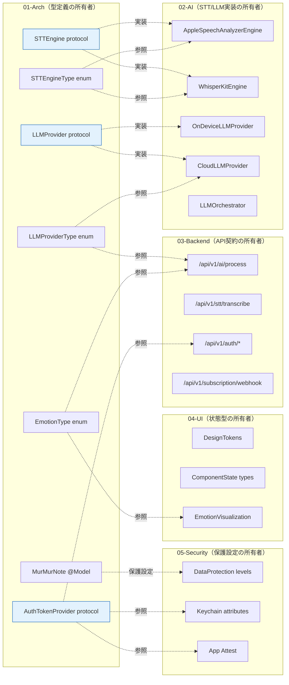
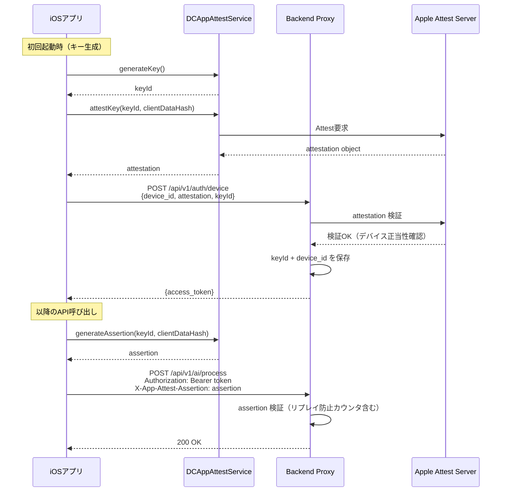

# 統合インターフェース仕様書

> **文書ID**: INT-SPEC-001
> **バージョン**: 1.0
> **作成日**: 2026-03-16
> **ステータス**: 承認待ち（全設計書修正の「正」基準）
> **適用範囲**: 01〜05 全設計書間のインターフェース契約
> **優先度**: 全設計書に対して本文書が優先する

---

## 目次

1. [本文書の位置づけ](#1-本文書の位置づけ)
2. [設計書間の接合点マップ](#2-設計書間の接合点マップ)
3. [統一プロトコル定義](#3-統一プロトコル定義)
4. [設計書間の契約マトリクス](#4-設計書間の契約マトリクス)
5. [Critical 8件の統一修正方針](#5-critical-8件の統一修正方針)
6. [High件の統一修正方針](#6-high件の統一修正方針)
7. [iOS対応バージョン戦略](#7-ios対応バージョン戦略)
8. [データ保護レベル統一方針](#8-データ保護レベル統一方針)
9. [命名規則統一](#9-命名規則統一)
10. [付録: 全設計書修正チェックリスト](#10-付録-全設計書修正チェックリスト)

---

## 1. 本文書の位置づけ

### 1.1 目的

5つの設計書を別々の専門家が並列作成した結果、設計書間の契約（インターフェース定義・プロトコル・命名規則・データ保護レベル）に不整合が発生した。本文書は全設計書横断の「正」の基準を定義し、各設計書が準拠すべき統一仕様を規定する。

### 1.2 適用範囲

| 文書ID | 文書名 | 略称 |
|:-------|:-------|:-----|
| ARCH-DOC-001 | システムアーキテクチャ設計書 | **01-Arch** |
| DES-002 | 音声AI処理パイプライン設計書 | **02-AI** |
| DES-003 | Backend Proxy設計書 | **03-Backend** |
| DESIGN-004 | UIデザインシステム設計書 | **04-UI** |
| SEC-DESIGN-001 | セキュリティ設計書 | **05-Security** |

### 1.3 参照関係図



### 1.4 不整合の全体サマリ

Codexレビューにより検出された不整合は以下の通り。

| 重要度 | 件数 | 主な領域 |
|:-------|:-----|:---------|
| **Critical** | 8件 | STT契約不整合、AACチャンク結合破綻、LLM判定自己矛盾、Apple Intelligence API乖離、課金なりすまし、Webhook冪等性不足、デバイス認証偽装、App Attest未導入 |
| **High** | 6件 | 感情カテゴリ不一致、Data Protection設定不統一、Keychain属性不統一、API感情レスポンス形式不統一、STTEngineType enum値不統一、LLMProviderType定義不統一 |

---

## 2. 設計書間の接合点マップ

### 2.1 接合点の全体図



---

## 3. 統一プロトコル定義

本セクションで定義する型・プロトコルが全設計書の「正」である。各設計書はこれらの定義に合致するよう修正すること。

### 3.1 STTEngineProtocol（統一版）

**不整合の概要**: 01-Archは `AsyncStream` ベースの `STTEngine` を定義。02-AIは `callbacks`（`onPartialResult` / `onFinalResult`）ベースの `STTEngine` を定義。enum値も `appleSpeech` vs `appleSpeechAnalyzer` で不一致。

**統一方針**: `AsyncStream` ベースに統一する。TCAのEffect型との親和性が高く、01-Archの設計原則（Protocol-Oriented + TCA）と整合するため。

```swift
// ============================================================
// Domain/Protocols/STTEngineProtocol.swift
// 【正】全設計書はこの定義に準拠すること
// ============================================================

import AVFoundation

/// STTエンジンの識別子（統一enum）
/// - `.speechAnalyzer`: iOS 26+ Apple SpeechAnalyzer
/// - `.whisperKit`: iOS 17+ WhisperKit (whisper.cpp Swift wrapper)
/// - `.cloudSTT`: Pro限定クラウドSTT
enum STTEngineType: String, Codable, Sendable {
    case speechAnalyzer = "speech_analyzer"   // ← 旧 appleSpeech / appleSpeechAnalyzer を統一
    case whisperKit     = "whisper_kit"       // ← 旧 whisperOnDevice / whisperCpp を統一
    case cloudSTT       = "cloud_stt"         // Pro限定（REQ-018）
}

/// STT認識結果（統一型）
struct TranscriptionResult: Sendable, Equatable {
    let text: String
    let confidence: Double          // 0.0 - 1.0（Float → Double に統一）
    let isFinal: Bool
    let language: String
    let segments: [TranscriptionSegment]
}

struct TranscriptionSegment: Sendable, Equatable {
    let text: String
    let startTime: TimeInterval
    let endTime: TimeInterval
    let confidence: Double          // Float → Double に統一
}

/// STTエンジンの抽象化プロトコル（統一版）
/// 【正】AsyncStream ベース。callbacks 方式は使用しない。
protocol STTEngineProtocol: Sendable {
    /// エンジンの識別子
    var engineType: STTEngineType { get }

    /// リアルタイム文字起こしのストリーミング開始
    /// - Parameter audioStream: PCM 16kHz Mono の音声バッファストリーム
    /// - Returns: 認識結果のAsyncStream（部分結果 + 最終結果）
    func startTranscription(
        audioStream: AsyncStream<AVAudioPCMBuffer>,
        language: String
    ) -> AsyncStream<TranscriptionResult>

    /// 文字起こしの停止・確定
    func finishTranscription() async throws -> TranscriptionResult

    /// エンジンの利用可否チェック（デバイス性能・権限・言語パック）
    func isAvailable() async -> Bool

    /// 対応言語一覧
    var supportedLanguages: [String] { get }

    /// カスタム辞書の設定（REQ-025）
    func setCustomDictionary(_ dictionary: [String: String]) async
}
```

### 3.2 LLMProviderProtocol（統一版）

**不整合の概要**: 01-Archは個別メソッド（`generateSummary`, `extractTags`, `analyzeEmotion`）を持つ `LLMProvider` を定義。02-AIは統合リクエスト（`process(_ request: LLMRequest)`）を持つ `LLMProvider` を定義。オンデバイスでの感情分析対応可否も矛盾。

**統一方針**: 統合リクエスト方式に統一する。クラウドLLMでは1回のAPI呼び出しで3タスクを同時処理する設計（コスト効率）であり、プロトコルもそれに合わせる。ただし、オンデバイスでは感情分析を「省略可能」とし、`supportedTasks` で明示する。

```swift
// ============================================================
// Domain/Protocols/LLMProviderProtocol.swift
// 【正】全設計書はこの定義に準拠すること
// ============================================================

/// LLMプロバイダの識別子（統一enum）
enum LLMProviderType: String, Codable, Sendable {
    case onDeviceAppleIntelligence = "on_device_apple_intelligence"
    case onDeviceLlamaCpp          = "on_device_llama_cpp"     // フォールバック用
    case cloudGPT4oMini            = "cloud_gpt4o_mini"
    case cloudClaude               = "cloud_claude"            // 将来拡張用
}

/// LLM処理タスクの種別
enum LLMTask: String, CaseIterable, Sendable {
    case summarize         // 要約（REQ-003）
    case tagging           // タグ付け（REQ-004）
    case sentimentAnalysis // 感情分析（REQ-005）← 旧 sentiment / emotionAnalysis を統一
}

/// LLM処理リクエスト（統一型）
struct LLMRequest: Sendable {
    let text: String
    let tasks: Set<LLMTask>
    let language: String
    let maxTokens: Int
}

/// LLM処理レスポンス（統一型）
struct LLMResponse: Sendable, Codable {
    let summary: LLMSummaryResult?
    let tags: [LLMTagResult]?
    let sentiment: LLMSentimentResult?
    let processingTimeMs: Int
    let provider: String
}

struct LLMSummaryResult: Sendable, Codable {
    let title: String            // 20文字以内
    let brief: String            // 1-2行の要約
    let keyPoints: [String]      // 最大5つ
}

struct LLMTagResult: Sendable, Codable {
    let label: String            // タグラベル（15文字以内）
    let confidence: Double       // 0.0 - 1.0
}

/// 感情分析結果（統一型）
/// 【正】8カテゴリ方式に統一。03-Backendの positive/negative/neutral 方式は廃止。
struct LLMSentimentResult: Sendable, Codable {
    let primary: EmotionCategory
    let scores: [EmotionCategory: Double]    // 合計 1.0
    let evidence: [SentimentEvidence]        // 最大3件
}

struct SentimentEvidence: Sendable, Codable {
    let text: String
    let emotion: EmotionCategory
}

/// 感情カテゴリ（統一enum, 8段階）
/// 【正】全設計書でこのenumを使用すること
enum EmotionCategory: String, Codable, CaseIterable, Sendable {
    case joy           = "joy"           // 喜び
    case calm          = "calm"          // 安心
    case anticipation  = "anticipation"  // 期待
    case sadness       = "sadness"       // 悲しみ
    case anxiety       = "anxiety"       // 不安
    case anger         = "anger"         // 怒り
    case surprise      = "surprise"      // 驚き
    case neutral       = "neutral"       // 中立
}

/// LLMプロバイダ共通プロトコル（統一版）
protocol LLMProviderProtocol: Sendable {
    /// プロバイダの識別子
    var providerType: LLMProviderType { get }

    /// オンデバイス実行かどうか
    var isOnDevice: Bool { get }

    /// 対応可能なタスク一覧
    /// 【重要】オンデバイスでは [.summarize, .tagging] のみ。
    /// 感情分析はクラウドLLMでのみ実行可能。
    var supportedTasks: Set<LLMTask> { get }

    /// 入力テキストの最大トークン数
    var maxInputTokens: Int { get }

    /// 統合LLM処理の実行
    func process(_ request: LLMRequest) async throws -> LLMResponse

    /// プロバイダの利用可否チェック
    func isAvailable() async -> Bool
}
```

### 3.3 AuthTokenProvider（統一版）

**不整合の概要**: 03-Backendはデバイストークン/JWT方式を定義。05-SecurityはHMAC-SHA256署名付きデバイストークンを定義。App Attestは05-Securityの脅威分析で言及されるが、実装設計が存在しない。

**統一方針**: App Attest を必須として導入し、デバイストークン・JWT・App Attestの統一インターフェースを定義する。

```swift
// ============================================================
// Domain/Protocols/AuthTokenProvider.swift
// 【正】全設計書はこの定義に準拠すること
// ============================================================

/// 認証方式の種別
enum AuthMethod: String, Codable, Sendable {
    case device      // デバイストークン（MVP）
    case apple       // Sign In with Apple（P4）
}

/// 認証トークンのペイロード（JWT Claimsに対応）
struct AuthTokenPayload: Sendable, Codable {
    let sub: String              // ユーザーID (usr_xxx)
    let iss: String              // "murmurnote-proxy"
    let aud: String              // "murmurnote-ios"
    let iat: TimeInterval        // 発行日時
    let exp: TimeInterval        // 有効期限
    let plan: SubscriptionPlan
    let authMethod: AuthMethod
    let deviceId: String
}

/// サブスクリプションプラン（統一enum）
enum SubscriptionPlan: String, Codable, Sendable {
    case free = "free"
    case pro  = "pro"
}

/// 認証トークン管理の統一プロトコル
/// Keychain保存、トークンリフレッシュ、App Attestを統合
protocol AuthTokenProviderProtocol: Sendable {
    /// 現在のアクセストークンを取得（有効期限チェック込み）
    func getAccessToken() async throws -> String

    /// トークンのリフレッシュ
    func refreshToken() async throws -> String

    /// サインイン（Apple Sign In or デバイストークン）
    func signIn(method: AuthMethod) async throws -> AuthTokenPayload

    /// サインアウト（Keychainからトークン削除）
    func signOut() async throws

    /// 現在のユーザー情報を取得
    func currentUser() async -> AuthTokenPayload?

    /// App Attest のアサーション生成
    /// 【Critical #8 対応】全APIリクエストにApp Attestアサーションを付加
    func generateAppAttestAssertion(for requestData: Data) async throws -> Data

    /// App Attest キーの初期登録
    func registerAppAttestKey() async throws
}

/// Keychain保存属性（統一版）
/// 【正】05-Securityの定義を正とし、01-Archの kSecAttrAccessibleAfterFirstUnlock を修正
enum KeychainItemType: Sendable {
    case accessToken
    case refreshToken
    case appleUserID
    case subscriptionCache
    case appAttestKeyID

    var accessibility: CFString {
        switch self {
        case .appleUserID:
            // ロック解除時のみアクセス可能（最高セキュリティ）
            return kSecAttrAccessibleWhenUnlockedThisDeviceOnly
        case .accessToken, .refreshToken, .subscriptionCache, .appAttestKeyID:
            // 初回ロック解除後はアクセス可能（バックグラウンド処理対応）
            return kSecAttrAccessibleAfterFirstUnlockThisDeviceOnly
        }
    }
}
```

### 3.4 全設計書で参照すべき型定義一覧

| 型名 | 定義場所 | 参照設計書 | 備考 |
|:-----|:---------|:-----------|:-----|
| `STTEngineType` | Domain | 01, 02 | `.speechAnalyzer` / `.whisperKit` / `.cloudSTT` |
| `STTEngineProtocol` | Domain | 01, 02 | AsyncStreamベース |
| `TranscriptionResult` | Domain | 01, 02, 03 | confidence は `Double` 型 |
| `LLMProviderType` | Domain | 01, 02, 03 | 4種類（Apple Intelligence / llama.cpp / GPT / Claude） |
| `LLMProviderProtocol` | Domain | 01, 02 | 統合リクエスト方式 |
| `LLMTask` | Domain | 01, 02, 03 | `.summarize` / `.tagging` / `.sentimentAnalysis` |
| `LLMRequest` / `LLMResponse` | Domain | 01, 02, 03 | 統一リクエスト/レスポンス型 |
| `EmotionCategory` | Domain | 01, 02, 03, 04 | 8カテゴリ方式（positive/negative 廃止） |
| `LLMSentimentResult` | Domain | 01, 02, 03, 04 | 8カテゴリスコア + evidence |
| `AuthTokenProviderProtocol` | Domain | 01, 03, 05 | JWT + App Attest |
| `AuthMethod` | Domain | 01, 03, 05 | `.device` / `.apple` |
| `SubscriptionPlan` | Domain | 01, 02, 03 | `.free` / `.pro` |
| `KeychainItemType` | Domain | 01, 05 | アクセシビリティ属性統一 |

---

## 4. 設計書間の契約マトリクス

### 4.1 01-Arch ↔ 02-AI: STTプロトコル・LLMプロトコル

| 接合点 | 01-Archの現状 | 02-AIの現状 | 不整合 | 正とする仕様 |
|:-------|:-------------|:------------|:-------|:-------------|
| STTプロトコルI/F | `AsyncStream<AudioBuffer>` → `AsyncStream<TranscriptionResult>` | `onPartialResult` / `onFinalResult` callbacks | **Critical #1** | AsyncStream方式（セクション3.1） |
| STTEngineType enum | `.appleSpeech` / `.whisperOnDevice` / `.whisperCloud` | `.appleSpeechAnalyzer` / `.whisperCpp` / `.cloudSTT` | **Critical #1** | `.speechAnalyzer` / `.whisperKit` / `.cloudSTT`（セクション3.1） |
| LLMプロトコルI/F | 個別メソッド（`generateSummary`, `extractTags`, `analyzeEmotion`） | 統合メソッド（`process(_ request:)`） | **High** | 統合メソッド方式（セクション3.2） |
| LLMProviderType enum | `.onDevice` / `.cloudClaude` / `.cloudGPT` | `.onDeviceCoreML` / `.cloudGPT4oMini` | **High** | 4種類に拡張（セクション3.2） |
| 感情分析オンデバイス対応 | `LLMProvider.analyzeEmotion()` を全プロバイダに要求 | オンデバイスは `.summarize` `.tagging` のみ対応。感情分析は非対応 | **Critical #3** | オンデバイスでは感情分析を省略。`supportedTasks` で明示 |
| TranscriptionResult.confidence | `Double` | `Float` | **High** | `Double` に統一 |

### 4.2 01-Arch ↔ 03-Backend: API Request/Response型・認証トークン型

| 接合点 | 01-Archの現状 | 03-Backendの現状 | 不整合 | 正とする仕様 |
|:-------|:-------------|:----------------|:-------|:-------------|
| 感情分析レスポンス形式 | `EmotionType` (8カテゴリ: joy/sadness/anger/fear/surprise/disgust/calm/neutral) | `sentiment.overall`: "positive"/"negative"/"neutral"/"mixed" + `score`: -1〜1 | **High** | 8カテゴリ方式（`EmotionCategory`）に統一。positive/negative方式を廃止 |
| 感情カテゴリ定義 | `fear` / `disgust` を含む8種 | `anxiety` / `anticipation` を含む8種（02-AIと同一） | **High** | 02-AI/03-Backendの8種に統一（セクション3.2の `EmotionCategory`） |
| 認証トークンKeychain属性 | `kSecAttrAccessibleAfterFirstUnlock` | `Authorization: Bearer <jwt_or_device_token>` | **High** | `kSecAttrAccessibleAfterFirstUnlockThisDeviceOnly`（`ThisDeviceOnly` 必須） |
| App Attest | 未記載 | 未記載 | **Critical #7, #8** | App Attest必須（セクション3.3） |
| 課金検証時appAccountToken | 未記載 | 未記載 | **Critical #5** | `appAccountToken` による購入者紐付け必須（セクション5.5） |

### 4.3 01-Arch ↔ 04-UI: デザイントークン型・コンポーネント状態型

| 接合点 | 01-Archの現状 | 04-UIの現状 | 不整合 | 正とする仕様 |
|:-------|:-------------|:------------|:-------|:-------------|
| テーマ型 | `ThemeType: system/light/dark/journal` | 4テーマ定義（System/Light/Dark/Journal） | 整合 | 整合済み。変更不要 |
| 感情カラーマッピング | `EmotionType` (fear/disgust含む) | 8色定義（anxiety/anticipation含む） | **High** | 04-UIの8カテゴリに合わせ01-Archの `EmotionType` を `EmotionCategory` に置換 |
| 録音状態型 | `RecordingStatus: recording/paused/completed/failed` | 録音UIの状態定義 | 整合 | 整合済み。変更不要 |

### 4.4 01-Arch ↔ 05-Security: Data Protection設定・Keychain属性

| 接合点 | 01-Archの現状 | 05-Securityの現状 | 不整合 | 正とする仕様 |
|:-------|:-------------|:-----------------|:-------|:-------------|
| 全データファイルの保護レベル | `NSFileProtectionCompleteUntilFirstUserAuthentication` | `NSFileProtectionCompleteUntilFirstUserAuthentication` | 整合（ただし不十分） | 録音中一時ファイルと確定済みデータで分離（セクション8） |
| Keychain属性 | `kSecAttrAccessibleAfterFirstUnlock` | `kSecAttrAccessibleAfterFirstUnlockThisDeviceOnly` | **High** | `ThisDeviceOnly` 必須（セクション8.3） |
| iCloudバックアップ除外対象 | Documents/Audio, Documents/Models, SwiftDataストア | Documents/Recordings, Application Support/SecureStore | **High** | 統一ディレクトリ名を規定（セクション8.2） |
| App Attest | 未記載 | 脅威分析で言及（S-1対策）。実装設計なし | **Critical #8** | App Attest実装設計を追加（セクション5.8） |

### 4.5 02-AI ↔ 03-Backend: API Request/Response型

| 接合点 | 02-AIの現状 | 03-Backendの現状 | 不整合 | 正とする仕様 |
|:-------|:------------|:----------------|:-------|:-------------|
| AI処理エンドポイントパス | `/api/v1/analyze` | `/api/v1/ai/process` | **High** | `/api/v1/ai/process` に統一 |
| 感情分析レスポンス構造 | `sentiment.primary` + `sentiment.scores` (8カテゴリ) | `sentiment.overall` + `sentiment.score` (-1〜1) | **Critical** | 8カテゴリ方式（セクション3.2）に統一 |

---

## 5. Critical 8件の統一修正方針

### 5.1 Critical #1: Arch↔AI STT契約不整合

**問題**: 01-ArchのSTTプロトコルはAsyncStreamベース。02-AIのSTTプロトコルはcallbacksベース。enum値も `appleSpeech` vs `appleSpeechAnalyzer` で不一致。

**正しい仕様（統一方針）**:

- AsyncStreamベースに統一（セクション3.1 `STTEngineProtocol` が正）
- enum値: `.speechAnalyzer` / `.whisperKit` / `.cloudSTT`

**影響を受ける設計書と修正箇所**:

| 設計書 | 修正箇所 | 修正内容 |
|:-------|:---------|:---------|
| **01-Arch** | セクション7.4 `STTEngine` protocol | `audioStream: AsyncStream<AudioBuffer>` → `AsyncStream<AVAudioPCMBuffer>` に型修正 |
| **01-Arch** | セクション5.2 `STTEngineType` enum | `.appleSpeech` → `.speechAnalyzer`、`.whisperOnDevice` → `.whisperKit` |
| **02-AI** | セクション2.1 `STTEngine` protocol | callbacks方式を全面削除。AsyncStream方式に書き換え |
| **02-AI** | セクション2.2, 2.3 各エンジン実装 | `startStreaming(onPartialResult:onFinalResult:)` → `startTranscription(audioStream:language:) -> AsyncStream<TranscriptionResult>` |
| **02-AI** | セクション2.1 `STTEngineType` enum | `.appleSpeechAnalyzer` → `.speechAnalyzer`、`.whisperCpp` → `.whisperKit` |

**修正担当**: 01-Arch担当（型定義修正）、02-AI担当（プロトコル実装修正）

---

### 5.2 Critical #2: AACチャンク単純バイト連結でクラッシュ復旧破綻

**問題**: 01-Archの `TemporaryRecordingStore.finalizeRecording()` は複数のAACチャンクファイルを単純に `Data.append()` で連結している。AACはコンテナ形式（ADTS/MP4）であり、単純なバイト連結では有効な音声ファイルにならない。クラッシュ復旧時に破損ファイルが生成される。

**正しい仕様（統一方針）**:

```swift
/// 【正】AVAssetExportSession を使用した正しいチャンク結合
/// 単純な Data.append() によるAAC連結は禁止
func finalizeRecording(recordingID: UUID) async throws -> URL {
    let chunkURLs = try FileManager.default
        .contentsOfDirectory(at: tempDirectory, includingPropertiesForKeys: nil)
        .filter { $0.lastPathComponent.hasPrefix(recordingID.uuidString) }
        .sorted { $0.lastPathComponent < $1.lastPathComponent }

    // AVMutableComposition で複数チャンクを正しく結合
    let composition = AVMutableComposition()
    guard let track = composition.addMutableTrack(
        withMediaType: .audio,
        preferredTrackID: kCMPersistentTrackID_Invalid
    ) else {
        throw RecordingError.compositionFailed
    }

    var currentTime = CMTime.zero
    for chunkURL in chunkURLs {
        let asset = AVURLAsset(url: chunkURL)
        let duration = try await asset.load(.duration)
        guard let audioTrack = try await asset.loadTracks(withMediaType: .audio).first else {
            continue
        }
        try track.insertTimeRange(
            CMTimeRange(start: .zero, duration: duration),
            of: audioTrack,
            at: currentTime
        )
        currentTime = CMTimeAdd(currentTime, duration)
    }

    // AVAssetExportSession で正しいAACファイルを出力
    let outputURL = tempDirectory.appendingPathComponent("\(recordingID.uuidString)_final.m4a")
    guard let exportSession = AVAssetExportSession(
        asset: composition,
        presetName: AVAssetExportPresetAppleM4A
    ) else {
        throw RecordingError.exportFailed
    }
    exportSession.outputURL = outputURL
    exportSession.outputFileType = .m4a

    await exportSession.export()

    guard exportSession.status == .completed else {
        throw RecordingError.exportFailed
    }

    // 一時チャンクファイルの削除
    for chunkURL in chunkURLs {
        try? FileManager.default.removeItem(at: chunkURL)
    }

    return outputURL
}
```

**影響を受ける設計書と修正箇所**:

| 設計書 | 修正箇所 | 修正内容 |
|:-------|:---------|:---------|
| **01-Arch** | セクション6.4 `TemporaryRecordingStore.finalizeRecording()` | `Data.append()` 方式を `AVAssetExportSession` 方式に全面置換 |
| **01-Arch** | セクション6.1 ディレクトリ構成 | チャンクファイルの拡張子を `.aac` → `.m4a` に変更（AACコンテナとして正しい拡張子） |

**修正担当**: 01-Arch担当

---

### 5.3 Critical #3: LLM判定ロジック自己矛盾（オンデバイス経路が死んでいる）

**問題**: 02-AIの `LLMOrchestrator.determineTasks()` は常に `Set(LLMTask.allCases)` を返す（感情分析を含む）。一方、オンデバイスLLMの `supportedTasks` は `[.summarize, .tagging]` のみ。結果として、`selectProvider()` でオンデバイスが選択される条件 `tasks.isSubset(of: onDeviceProvider.supportedTasks)` が常に `false` になり、オンデバイスLLM経路が事実上死んでいる。

**正しい仕様（統一方針）**:

```swift
/// 【正】タスク判定ロジック
/// オンデバイス対応デバイスでは、要約+タグのみをオンデバイスで処理し、
/// 感情分析はクラウドで別途処理する（または省略する）
private func determineTasks(
    text: String,
    plan: SubscriptionPlan,
    isOnDeviceCapable: Bool,
    isNetworkAvailable: Bool
) -> (onDeviceTasks: Set<LLMTask>, cloudTasks: Set<LLMTask>) {

    let allTasks: Set<LLMTask> = [.summarize, .tagging, .sentimentAnalysis]
    let onDeviceSupportedTasks: Set<LLMTask> = [.summarize, .tagging]

    // ケース1: クラウド利用可能 → 全タスクをクラウドで一括処理
    if isNetworkAvailable && (plan == .pro || text.count > 500 || !isOnDeviceCapable) {
        return (onDeviceTasks: [], cloudTasks: allTasks)
    }

    // ケース2: オンデバイス対応 + オフライン → 要約+タグのみ処理、感情分析は省略
    if isOnDeviceCapable && !isNetworkAvailable {
        return (onDeviceTasks: onDeviceSupportedTasks, cloudTasks: [])
    }

    // ケース3: オンデバイス対応 + オンライン + 短文 → 要約+タグはオンデバイス、感情分析はクラウド
    if isOnDeviceCapable && isNetworkAvailable && text.count <= 500 {
        return (onDeviceTasks: onDeviceSupportedTasks, cloudTasks: [.sentimentAnalysis])
    }

    // デフォルト: クラウドで全処理
    return (onDeviceTasks: [], cloudTasks: allTasks)
}
```

**影響を受ける設計書と修正箇所**:

| 設計書 | 修正箇所 | 修正内容 |
|:-------|:---------|:---------|
| **02-AI** | セクション3.5 `LLMOrchestrator.determineTasks()` | 上記のタスク分割ロジックに置換 |
| **02-AI** | セクション3.5 `LLMOrchestrator.processText()` | オンデバイス + クラウドの2段階処理に対応 |
| **02-AI** | セクション3.4 判定フローチャート | 感情分析の分離処理パスを追加 |
| **01-Arch** | セクション4.3 LLMハイブリッド処理フロー | 感情分析の分離パスを反映 |

**修正担当**: 02-AI担当（ロジック修正）、01-Arch担当（フロー図修正）

---

### 5.4 Critical #4: Apple Intelligence Core ML前提が公開APIと乖離

**問題**: 02-AIはオンデバイスLLMとして「Apple Intelligence Foundation Model（Core ML経由）」を採用し、`LanguageModelSession(model: .system)` でApple標準モデルを使用する設計。しかし、Apple Intelligence の Foundation Model は 2026年3月時点で `@Generable` マクロ経由の構造化出力にのみ対応しており、自由なプロンプト実行（`session.respond(to: prompt)`）はサードパーティアプリには公開されていない。

**正しい仕様（統一方針）**:

- **一次候補**: Apple Intelligence の `@Generable` マクロ対応（iOS 26+）
  - 構造化出力（要約結果の型定義）には対応可能
  - ただしプロンプトの自由度が低く、カスタム感情分析等には不向き
- **二次候補（推奨）**: llama.cpp / MLX Swift による小規模LLM実行
  - Phi-3-mini（3.8B, Q4量子化）をCore ML変換して使用
  - 自由なプロンプト実行が可能
- **フォールバック**: クラウドLLM（GPT-4o mini）

```swift
/// 【正】オンデバイスLLMの選択戦略
enum OnDeviceLLMStrategy {
    /// iOS 26+: Apple Intelligence @Generable マクロ
    /// 構造化出力のみ（要約タイトル・キーポイント抽出）
    case appleIntelligenceGenerable

    /// iOS 17+: llama.cpp / MLX Swift
    /// Phi-3-mini Q4_K_M (約2.5GB)
    /// 自由なプロンプト実行が可能
    case llamaCpp

    /// オンデバイスLLM非対応端末
    /// クラウドLLMにフォールバック
    case cloudFallback
}

/// 【正】デバイス能力に基づくLLM戦略選択
func selectOnDeviceStrategy() -> OnDeviceLLMStrategy {
    // iOS 26+ かつ Apple Intelligence 対応端末
    if #available(iOS 26, *), AppleIntelligenceAvailability.isSupported {
        return .appleIntelligenceGenerable
    }
    // A16+ かつ 6GB+ → llama.cpp
    if DeviceCapabilityChecker.shared.supportsOnDeviceLLM {
        return .llamaCpp
    }
    // 非対応端末
    return .cloudFallback
}
```

**影響を受ける設計書と修正箇所**:

| 設計書 | 修正箇所 | 修正内容 |
|:-------|:---------|:---------|
| **02-AI** | セクション3.2 オンデバイスLLM | 「Apple Intelligence Foundation Model」→「llama.cpp (Phi-3-mini) を一次候補、Apple Intelligence @Generable を補助候補」に修正 |
| **02-AI** | セクション3.2.3 `OnDeviceLLMProvider` 実装 | `LanguageModelSession` → `LlamaContext`（llama.cpp Swift binding）に修正 |
| **02-AI** | セクション3.2.1 モデル選定表 | Apple Intelligence を「補助候補」に格下げし、Phi-3-mini を一次候補に |
| **01-Arch** | セクション8.1 技術スタック | 「Core ML / llama.cpp」→「llama.cpp (Phi-3-mini)」に明確化 |

**修正担当**: 02-AI担当

---

### 5.5 Critical #5: 課金権限なりすまし（appAccountToken紐付けなし）

**問題**: 03-Backendの課金検証設計では、StoreKit 2の `Product.purchase()` 結果をサーバーに送信して検証する設計だが、購入トランザクションと認証済みユーザーの紐付けに `appAccountToken` を使用していない。攻撃者が他人のトランザクションJWSを傍受・再利用して、自身のアカウントをPro化するなりすまし攻撃が可能。

**正しい仕様（統一方針）**:

```swift
/// 【正】購入時に appAccountToken でユーザーIDを紐付ける
/// StoreKit 2 の purchase(options:) に appAccountToken を渡す
func purchaseSubscription(product: Product, userId: String) async throws -> Transaction {
    // ユーザーIDからUUIDを生成（決定論的）
    let accountToken = UUID(
        uuidString: userId.sha256().prefix(32)
            .inserting("-", at: [8, 12, 16, 20])
    )!

    let result = try await product.purchase(
        options: [
            .appAccountToken(accountToken)  // ← これが必須
        ]
    )

    switch result {
    case .success(let verification):
        let transaction = try checkVerified(verification)
        // サーバーに送信して検証
        try await verifyWithServer(transaction: transaction, expectedUserId: userId)
        return transaction
    case .userCancelled, .pending:
        throw PurchaseError.notCompleted
    @unknown default:
        throw PurchaseError.unknown
    }
}
```

```typescript
// 【正】Backend Proxy側: appAccountToken の検証
async function verifySubscription(
  transactionJWS: string,
  requestingUserId: string,
  env: Env
): Promise<SubscriptionStatus> {
  const payload = await verifyJWS(transactionJWS, env);

  // ★ appAccountToken がリクエストユーザーと一致することを検証
  const expectedToken = generateAccountToken(requestingUserId);
  if (payload.appAccountToken !== expectedToken) {
    throw new Error('SUBSCRIPTION_USER_MISMATCH: appAccountToken does not match requesting user');
  }

  // 以降の検証処理...
}
```

**影響を受ける設計書と修正箇所**:

| 設計書 | 修正箇所 | 修正内容 |
|:-------|:---------|:---------|
| **03-Backend** | セクション5.2 購読検証フロー | `appAccountToken` の生成・検証ロジックを追加 |
| **03-Backend** | セクション5.3 Webhook処理 | `appAccountToken` によるユーザー照合を追加 |
| **01-Arch** | セクション8.1 StoreKit 2 | `purchase(options: [.appAccountToken()])` を明記 |

**修正担当**: 03-Backend担当（サーバー側検証）、01-Arch担当（クライアント側購入処理）

---

### 5.6 Critical #6: Webhook冪等性キー不十分（notificationUUID必須）

**問題**: 03-Backendの `webhook_events` テーブルは `original_transaction_id` でインデックスを張っているが、同一トランザクションに対して複数回通知が来る場合の冪等性を保証する `notificationUUID` が欠落している。App Store Server Notificationsは同じイベントを複数回送信する可能性があり、冪等性キーなしでは購読状態の二重更新やデータ不整合が発生する。

**正しい仕様（統一方針）**:

```sql
-- 【正】webhook_events テーブル（修正版）
CREATE TABLE webhook_events (
    id TEXT PRIMARY KEY,
    notification_uuid TEXT NOT NULL UNIQUE,      -- ★ Apple発行のnotificationUUID（冪等性キー）
    notification_type TEXT NOT NULL,
    subtype TEXT,
    original_transaction_id TEXT NOT NULL,
    signed_date TEXT NOT NULL,                   -- 通知の署名日時
    processed_at TEXT NOT NULL,
    created_at TEXT NOT NULL
);

CREATE UNIQUE INDEX idx_webhook_notification_uuid ON webhook_events(notification_uuid);
CREATE INDEX idx_webhook_events_transaction ON webhook_events(original_transaction_id);
```

```typescript
// 【正】Webhook処理の冪等性保証
async function handleAppStoreWebhook(c: Context): Promise<Response> {
  const signedPayload = await c.req.json();
  const payload = await verifyAppStoreNotification(signedPayload, c.env);

  // ★ notificationUUID による冪等性チェック
  const notificationUUID = payload.notificationUUID;
  const existing = await c.env.DB.prepare(
    'SELECT id FROM webhook_events WHERE notification_uuid = ?'
  ).bind(notificationUUID).first();

  if (existing) {
    // 既に処理済み → 200 OK を返して終了（冪等性保証）
    return c.json({ status: 'already_processed' }, 200);
  }

  // 通知処理を実行...
  await processNotification(payload, c.env);

  // 処理記録を保存
  await c.env.DB.prepare(
    'INSERT INTO webhook_events (id, notification_uuid, notification_type, subtype, original_transaction_id, signed_date, processed_at, created_at) VALUES (?, ?, ?, ?, ?, ?, ?, ?)'
  ).bind(
    generateId('evt'),
    notificationUUID,
    payload.notificationType,
    payload.subtype,
    payload.data.originalTransactionId,
    payload.signedDate,
    new Date().toISOString(),
    new Date().toISOString()
  ).run();

  return c.json({ status: 'processed' }, 200);
}
```

**影響を受ける設計書と修正箇所**:

| 設計書 | 修正箇所 | 修正内容 |
|:-------|:---------|:---------|
| **03-Backend** | セクション8.3 `webhook_events` テーブル | `notification_uuid` カラム追加、UNIQUE制約追加 |
| **03-Backend** | セクション5.3 Webhook処理フロー | 冪等性チェックロジック追加 |
| **03-Backend** | セクション8.4 ER図 | `webhook_events` の `notification_uuid` フィールド追加 |

**修正担当**: 03-Backend担当

---

### 5.7 Critical #7: デバイス認証偽装耐性なし（App Attest必須）

**問題**: 03-Backendの「デバイストークン認証（MVP）」は `UIDevice.current.identifierForVendor` を `device_id` として送信し、サーバー側で新規ユーザーを生成する。この `device_id` は攻撃者が自由に偽造可能であり、大量の偽アカウント作成（無料枠の不正利用）が可能。05-Securityの脅威分析（S-1: デバイストークン偽造）で指摘されているが、実装設計が存在しない。

**正しい仕様（統一方針）**:

App Attest を導入し、デバイスの正当性を保証する。



**影響を受ける設計書と修正箇所**:

| 設計書 | 修正箇所 | 修正内容 |
|:-------|:---------|:---------|
| **03-Backend** | セクション4.4 デバイストークン認証 | App Attest による attestation 検証を追加 |
| **03-Backend** | セクション4.5 認証ミドルウェア | assertion 検証ミドルウェアを追加 |
| **03-Backend** | セクション8.3 D1テーブル設計 | `users` テーブルに `attest_key_id`, `attest_receipt` カラム追加 |
| **05-Security** | セクション4.2 デバイストークン認証 | App Attest実装設計を追加 |
| **01-Arch** | セクション3.2 InfraNetwork モジュール | App Attest クライアント実装を追加 |

**修正担当**: 03-Backend担当（サーバー側）、05-Security担当（設計追加）、01-Arch担当（クライアント側）

---

### 5.8 Critical #8: App Attest未導入

**問題**: 05-Securityの脅威モデルで「S-1: デバイストークンの偽造によるBackend Proxyへの不正アクセス」を高リスクとして特定しているが、対策として「UUIDv4 + HMAC-SHA256署名」のみを記載。Apple推奨の App Attest（DCAppAttestService）が設計に含まれていない。

**正しい仕様（統一方針）**: Critical #7 と統合。App Attest の導入を必須とする。

**App Attest 実装設計（05-Security に追加すべき内容）**:

```swift
// ============================================================
// InfraNetwork/AppAttest/AppAttestManager.swift
// 【正】App Attest の統一実装
// ============================================================

import DeviceCheck

final class AppAttestManager: Sendable {
    private let service = DCAppAttestService.shared

    /// App Attest の利用可否
    var isSupported: Bool {
        service.isSupported
    }

    /// キーの生成と登録（初回起動時に1回）
    func generateAndAttestKey() async throws -> (keyId: String, attestation: Data) {
        // 1. キー生成
        let keyId = try await service.generateKey()

        // 2. サーバーからチャレンジ取得
        let challenge = try await fetchChallenge()
        let clientDataHash = Data(SHA256.hash(data: challenge))

        // 3. Attestation 生成
        let attestation = try await service.attestKey(keyId, clientDataHash: clientDataHash)

        // 4. Keychainにキー IDを保存
        try SecureKeychain.save(key: .appAttestKeyID, data: Data(keyId.utf8))

        return (keyId, attestation)
    }

    /// APIリクエスト用のAssertion生成
    func generateAssertion(for requestBody: Data) async throws -> Data {
        guard let keyIdData = SecureKeychain.load(key: .appAttestKeyID),
              let keyId = String(data: keyIdData, encoding: .utf8) else {
            throw AppAttestError.keyNotFound
        }

        let clientDataHash = Data(SHA256.hash(data: requestBody))
        return try await service.generateAssertion(keyId, clientDataHash: clientDataHash)
    }
}
```

**影響を受ける設計書と修正箇所**:

| 設計書 | 修正箇所 | 修正内容 |
|:-------|:---------|:---------|
| **05-Security** | セクション1.4 S-1対策 | 「HMAC-SHA256署名」→「App Attest + HMAC-SHA256署名」 |
| **05-Security** | セクション4 認証・認可設計 | App Attest実装セクション新設 |
| **03-Backend** | セクション4 認証・認可設計 | attestation/assertion検証エンドポイント追加 |
| **01-Arch** | セクション3.2 モジュール一覧 | InfraNetworkに `AppAttestManager` 追加 |

**修正担当**: 05-Security担当（設計策定）、03-Backend担当（サーバー側検証）、01-Arch担当（モジュール追加）

---

## 6. High件の統一修正方針

### 6.1 High: 感情カテゴリ定義の不一致

**問題**: 01-Archの `EmotionType` は `fear`/`disgust` を含む。02-AI/04-UIは `anxiety`/`anticipation` を含む。03-Backendは `positive`/`negative`/`neutral`/`mixed` の4値方式。3つの異なる感情体系が混在。

**統一方針**: 02-AI/04-UIの8カテゴリに統一（セクション3.2の `EmotionCategory`）。

| 設計書 | 修正箇所 | 修正内容 |
|:-------|:---------|:---------|
| **01-Arch** | セクション5.2 `EmotionType` enum | `EmotionCategory` に改名。`fear`→`anxiety`, `disgust`→削除, `anticipation` 追加 |
| **03-Backend** | セクション3.4.1 レスポンスJSON | `sentiment.overall` / `sentiment.score` を廃止。8カテゴリ `scores` + `primary` + `evidence` に置換 |
| **03-Backend** | セクション3.4.1 レスポンスJSON Schema | `EmotionCategory` の8値enumに修正 |

**修正担当**: 01-Arch担当、03-Backend担当

### 6.2 High: Data Protection設定の不統一

**問題**: 01-Archと05-Securityで全データに一律 `NSFileProtectionCompleteUntilFirstUserAuthentication` を適用。しかし、録音中一時ファイル（バックグラウンド書き込み必要）と確定済みデータ（閲覧のみ）では保護レベルを分けるべき。

**統一方針**: セクション8で詳述。

### 6.3 High: Keychain属性の不統一

**問題**: 01-Archは `kSecAttrAccessibleAfterFirstUnlock` を使用。05-Securityは `kSecAttrAccessibleAfterFirstUnlockThisDeviceOnly` を使用。`ThisDeviceOnly` の有無が不一致。

**統一方針**: `ThisDeviceOnly` を必須とする。端末移行時にトークンが引き継がれないことは認証の再登録で対処可能であり、セキュリティを優先する。

| 設計書 | 修正箇所 | 修正内容 |
|:-------|:---------|:---------|
| **01-Arch** | セクション7.3 `KeychainTokenStore` | `kSecAttrAccessibleAfterFirstUnlock` → `kSecAttrAccessibleAfterFirstUnlockThisDeviceOnly` |

**修正担当**: 01-Arch担当

### 6.4 High: APIエンドポイントパスの不一致

**問題**: 02-AIの `CloudLLMProvider` は `/api/v1/analyze` にリクエスト。03-Backendは `/api/v1/ai/process` を定義。

**統一方針**: `/api/v1/ai/process` に統一（03-Backendが正）。

| 設計書 | 修正箇所 | 修正内容 |
|:-------|:---------|:---------|
| **02-AI** | セクション3.3.5 `CloudLLMProvider.process()` | URL パスを `/api/v1/analyze` → `/api/v1/ai/process` に修正 |

**修正担当**: 02-AI担当

### 6.5 High: LLMProviderType定義の不統一

**問題**: 01-Archは `onDevice`/`cloudClaude`/`cloudGPT`。02-AIは `onDeviceCoreML`/`cloudGPT4oMini`。

**統一方針**: セクション3.2の4種類（`onDeviceAppleIntelligence`/`onDeviceLlamaCpp`/`cloudGPT4oMini`/`cloudClaude`）に統一。

| 設計書 | 修正箇所 | 修正内容 |
|:-------|:---------|:---------|
| **01-Arch** | セクション5.2 `LLMProviderType` | 4種類enumに置換 |
| **02-AI** | セクション3.1 `LLMProviderType` | 4種類enumに置換 |

**修正担当**: 01-Arch担当、02-AI担当

### 6.6 High: iCloudバックアップ除外ディレクトリ名の不一致

**問題**: 01-Archは `Documents/Audio/` + `Documents/Models/`。05-Securityは `Documents/Recordings/` + `Application Support/SecureStore/`。

**統一方針**: 以下の統一ディレクトリ構成を正とする。

```
App Sandbox/
├── Documents/
│   └── Audio/                      # 音声ファイル（iCloudバックアップ除外）
├── Library/
│   ├── Application Support/
│   │   └── SecureStore/            # SwiftDataストア（iCloudバックアップ除外）
│   └── Caches/
│       ├── STTCache/
│       ├── ThumbnailCache/
│       └── Models/                 # MLモデル（Cachesに移動: 再ダウンロード可能なため）
└── tmp/
    └── Recording/                  # 録音中一時ファイル
```

| 設計書 | 修正箇所 | 修正内容 |
|:-------|:---------|:---------|
| **01-Arch** | セクション6.1 | `Documents/Models/` → `Library/Caches/Models/` に移動 |
| **05-Security** | セクション2.4 | `Documents/Recordings/` → `Documents/Audio/` に統一 |

**修正担当**: 01-Arch担当、05-Security担当

---

## 7. iOS対応バージョン戦略

### 7.1 統一方針

| 項目 | 方針 |
|:-----|:-----|
| **最低対応バージョン** | **iOS 17.0**（SwiftData利用可能ライン） |
| **推奨バージョン** | **iOS 18.0+**（パフォーマンス最適化の恩恵） |
| **先進機能対応** | **iOS 26+**（SpeechAnalyzer, Apple Intelligence @Generable） |

### 7.2 バージョン別機能マトリクス

```mermaid
gantt
    title iOS バージョン別機能対応
    dateFormat X
    axisFormat %s

    section STT
    WhisperKit (全バージョン)        :active, 17, 26
    Apple SpeechAnalyzer            :crit, 26, 27

    section LLM
    llama.cpp (Phi-3-mini)          :active, 17, 26
    Apple Intelligence @Generable   :crit, 26, 27

    section 基盤
    SwiftData                       :active, 17, 27
    StoreKit 2                      :active, 17, 27
    App Attest                      :active, 17, 27
```



### 7.3 条件分岐の統一パターン

```swift
/// 【正】iOS バージョン分岐の統一パターン
/// 全設計書でこのパターンを使用すること

// STTエンジン選択
func selectSTTEngine() -> any STTEngineProtocol {
    if #available(iOS 26, *), SpeechAnalyzerEngine.isSupported {
        return SpeechAnalyzerEngine()
    } else {
        return WhisperKitEngine()
    }
}

// オンデバイスLLM選択
func selectOnDeviceLLM() -> any LLMProviderProtocol {
    if #available(iOS 26, *), AppleIntelligenceAvailability.isSupported {
        return AppleIntelligenceProvider()  // @Generable 対応
    } else if DeviceCapabilityChecker.shared.supportsOnDeviceLLM {
        return LlamaCppProvider()           // Phi-3-mini Q4
    } else {
        return CloudLLMProvider()           // フォールバック
    }
}
```

### 7.4 各設計書への影響

| 設計書 | 現状 | 修正 |
|:-------|:-----|:-----|
| **01-Arch** | `platforms: [.iOS(.v17)]` | 変更不要 |
| **02-AI** | iOS 26+でSpeechAnalyzer分岐 | `#available(iOS 26, *)` パターンを統一 |
| **03-Backend** | バージョン記載なし | クライアント `X-App-Version` / `X-OS-Version` ヘッダーでバージョン判定可能であることを明記 |
| **05-Security** | App Attest は iOS 14+ 対応だが記載なし | iOS 17+ での App Attest 利用を明記 |

---

## 8. データ保護レベル統一方針

### 8.1 保護レベルの分離

**統一方針**: データのライフサイクルに応じて保護レベルを分離する。

| データ種別 | ファイル保護レベル | 根拠 |
|:-----------|:------------------|:-----|
| 録音中一時ファイル（`tmp/Recording/`） | `NSFileProtectionCompleteUntilFirstUserAuthentication` | バックグラウンド録音（EC-003）対応。端末ロック中も書き込み継続が必要 |
| 確定済み音声ファイル（`Documents/Audio/`） | `NSFileProtectionComplete` | 録音完了後は閲覧のみ。端末ロック時のアクセス不要。最高保護 |
| 確定済みテキストデータ（SwiftData） | `NSFileProtectionComplete` | 文字起こし・要約・感情分析結果。端末ロック時のアクセス不要 |
| MLモデルファイル（`Library/Caches/Models/`） | `NSFileProtectionCompleteUntilFirstUserAuthentication` | バックグラウンドでのモデル事前ロードに対応 |

### 8.2 iCloudバックアップ除外の統一

| ディレクトリ | 除外 | 根拠 |
|:-------------|:-----|:-----|
| `Documents/Audio/` | 除外する | 音声データはプライバシーデータ |
| `Library/Application Support/SecureStore/` | 除外する | 文字起こし・AI処理結果を含む |
| `Library/Caches/Models/` | 除外する（iOS標準で除外） | Cachesは自動除外 |
| `tmp/Recording/` | 除外する（iOS標準で除外） | tmpは自動除外 |
| `Library/Preferences/` (UserDefaults) | 除外しない | テーマ・言語等の設定のみ |

### 8.3 Keychain属性の統一

| データ項目 | Keychainキー | 統一アクセシビリティ |
|:-----------|:-------------|:--------------------|
| アクセストークン | `access_token` | `kSecAttrAccessibleAfterFirstUnlockThisDeviceOnly` |
| リフレッシュトークン | `refresh_token` | `kSecAttrAccessibleAfterFirstUnlockThisDeviceOnly` |
| Apple Sign Inユーザー識別子 | `apple_user_id` | `kSecAttrAccessibleWhenUnlockedThisDeviceOnly` |
| サブスクリプション検証キャッシュ | `subscription_cache` | `kSecAttrAccessibleAfterFirstUnlockThisDeviceOnly` |
| App AttestキーID | `app_attest_key_id` | `kSecAttrAccessibleAfterFirstUnlockThisDeviceOnly` |

**重要**: 全項目で `ThisDeviceOnly` を必須とする。01-Archの `kSecAttrAccessibleAfterFirstUnlock`（`ThisDeviceOnly` なし）は修正すること。

### 8.4 01-Arch / 05-Security 間の統一確認表

| 項目 | 01-Archの記載 | 05-Securityの記載 | 統一方針 |
|:-----|:-------------|:-----------------|:---------|
| 全データ保護 | `CompleteUntilFirstUserAuthentication` | `CompleteUntilFirstUserAuthentication` | 確定済みデータは `Complete` に引き上げ |
| Keychain属性 | `AfterFirstUnlock` | `AfterFirstUnlockThisDeviceOnly` | **05-Securityが正**。`ThisDeviceOnly` 必須 |
| 音声ファイルディレクトリ | `Documents/Audio/` | `Documents/Recordings/` | `Documents/Audio/` に統一 |
| SwiftDataストアディレクトリ | `Library/Application Support/default.store/` | `Library/Application Support/SecureStore/` | `SecureStore/` に統一（意図が明確） |

---

## 9. 命名規則統一

### 9.1 モジュール名

| モジュール | 命名規則 | 例 |
|:-----------|:---------|:---|
| Feature Module | `Feature` + 機能名（PascalCase） | `FeatureRecording`, `FeatureMemo`, `FeatureAI` |
| Domain Module | `Domain` | `Domain` |
| Data Module | `Data` | `Data` |
| Infrastructure Module | `Infra` + 技術領域（PascalCase） | `InfraSTT`, `InfraLLM`, `InfraStorage`, `InfraNetwork` |
| Shared Module | `Shared` + 種別（PascalCase） | `SharedUI`, `SharedUtil` |

### 9.2 プロトコル名

| 種別 | 命名規則 | 例 |
|:-----|:---------|:---|
| エンジン抽象化 | 機能名 + `Protocol` | `STTEngineProtocol`, `LLMProviderProtocol` |
| リポジトリ | 機能名 + `Repository` | `MemoRepository`, `TagRepository` |
| サービス | 機能名 + `Service` | `AudioRecordingService` |
| ファクトリ | 機能名 + `Factory` | `LLMProviderFactory` |

**注意**: 01-Archでは `STTEngine`（Protocol サフィックスなし）、本文書では `STTEngineProtocol`（サフィックスあり）。**本文書の `Protocol` サフィックスあり版を正とする**。Swift の命名慣習では、プロトコルに `-able`/`-ible` や `Protocol` サフィックスを付けることで実装クラスとの区別を明確にする。

### 9.3 enum値

| enum | 命名規則 | 正しい値 | 誤りの例 |
|:-----|:---------|:---------|:---------|
| `STTEngineType` | camelCase、技術名を明確に | `.speechAnalyzer`, `.whisperKit` | `.appleSpeech`, `.whisperCpp`, `.appleSpeechAnalyzer` |
| `LLMProviderType` | camelCase、実行場所+技術名 | `.onDeviceLlamaCpp`, `.cloudGPT4oMini` | `.onDevice`, `.cloudGPT`, `.onDeviceCoreML` |
| `EmotionCategory` | camelCase、英語感情名 | `.joy`, `.calm`, `.anxiety` | `.fear`, `.disgust`（廃止） |
| `LLMTask` | camelCase、動詞形 | `.summarize`, `.tagging`, `.sentimentAnalysis` | `.sentiment`, `.emotionAnalysis` |
| `AuthMethod` | camelCase | `.device`, `.apple` | `.deviceToken`, `.appleSignIn` |
| `SubscriptionPlan` | camelCase | `.free`, `.pro` | `.freePlan`, `.proPlan` |

### 9.4 API エンドポイント命名

| 規則 | 例 |
|:-----|:---|
| REST形式: `/api/v{N}/{resource}/{action}` | `/api/v1/ai/process` |
| リソース名はkebab-case | `/api/v1/auth/token/refresh` |
| 動詞はPOSTメソッドで表現 | `POST /api/v1/ai/process`（`/api/v1/analyze` は廃止） |

---

## 10. 付録: 全設計書修正チェックリスト

### 10.1 01-Arch（システムアーキテクチャ設計書）

| # | 修正項目 | セクション | 重要度 | 対応Critical/High |
|:--|:---------|:-----------|:-------|:-----------------|
| A1 | `STTEngine` → `STTEngineProtocol`（プロトコル名統一） | 7.4 | High | Critical #1 |
| A2 | `STTEngineType`: `.appleSpeech`→`.speechAnalyzer`, `.whisperOnDevice`→`.whisperKit` | 5.2 | Critical | Critical #1 |
| A3 | `AudioBuffer` → `AVAudioPCMBuffer`（型修正） | 7.4 | Critical | Critical #1 |
| A4 | `TemporaryRecordingStore.finalizeRecording()` をAVAssetExportSession方式に置換 | 6.4 | Critical | Critical #2 |
| A5 | `EmotionType` → `EmotionCategory`（fear/disgust → anxiety/anticipation） | 5.2 | High | High #6.1 |
| A6 | `LLMProvider` → `LLMProviderProtocol`（プロトコル名統一）、個別メソッド→統合メソッド | 7.4 | High | High #6.5 |
| A7 | `LLMProviderType` を4種類に拡張 | 5.2 | High | High #6.5 |
| A8 | Keychain: `kSecAttrAccessibleAfterFirstUnlock` → `ThisDeviceOnly` 追加 | 7.3 | High | High #6.3 |
| A9 | `Documents/Models/` → `Library/Caches/Models/` | 6.1 | High | High #6.6 |
| A10 | InfraNetworkに `AppAttestManager` 追加 | 3.2 | Critical | Critical #7, #8 |
| A11 | StoreKit 2購入時に `appAccountToken` 追加 | 8.1 | Critical | Critical #5 |
| A12 | 確定済みデータの保護レベルを `NSFileProtectionComplete` に引き上げ | 7.2 | High | High #6.2 |

### 10.2 02-AI（音声AI処理パイプライン設計書）

| # | 修正項目 | セクション | 重要度 | 対応Critical/High |
|:--|:---------|:-----------|:-------|:-----------------|
| B1 | `STTEngine` プロトコルをAsyncStream方式に全面書き換え | 2.1 | Critical | Critical #1 |
| B2 | `STTEngineType`: `.appleSpeechAnalyzer`→`.speechAnalyzer`, `.whisperCpp`→`.whisperKit` | 2.1 | Critical | Critical #1 |
| B3 | 各エンジン実装（`AppleSpeechAnalyzerEngine`, `WhisperKitEngine`）をAsyncStream I/Fに修正 | 2.2, 2.3 | Critical | Critical #1 |
| B4 | `LLMOrchestrator.determineTasks()` のタスク分割ロジック修正 | 3.5 | Critical | Critical #3 |
| B5 | オンデバイスLLM: Apple Intelligence → llama.cpp (Phi-3-mini) に変更 | 3.2 | Critical | Critical #4 |
| B6 | `CloudLLMProvider` のURL: `/api/v1/analyze` → `/api/v1/ai/process` | 3.3.5 | High | High #6.4 |
| B7 | `LLMProviderType` を4種類に統一 | 3.1 | High | High #6.5 |
| B8 | `STTResult.confidence` の型: `Float` → `Double` | 2.1 | High | - |

### 10.3 03-Backend（Backend Proxy設計書）

| # | 修正項目 | セクション | 重要度 | 対応Critical/High |
|:--|:---------|:-----------|:-------|:-----------------|
| C1 | 課金検証に `appAccountToken` 紐付け追加 | 5.2, 5.3 | Critical | Critical #5 |
| C2 | `webhook_events` に `notification_uuid` UNIQUE追加 + 冪等性チェック | 5.3, 8.3 | Critical | Critical #6 |
| C3 | デバイス認証にApp Attest attestation/assertion検証追加 | 4.4, 4.5 | Critical | Critical #7 |
| C4 | `users` テーブルに `attest_key_id`, `attest_receipt` 追加 | 8.3 | Critical | Critical #7 |
| C5 | 感情分析レスポンス: positive/negative方式 → 8カテゴリ方式 | 3.4.1 | High | High #6.1 |
| C6 | レスポンスJSON Schemaを `EmotionCategory` 8値enum対応に修正 | 3.4.1 | High | High #6.1 |

### 10.4 04-UI（UIデザインシステム設計書）

| # | 修正項目 | セクション | 重要度 | 対応Critical/High |
|:--|:---------|:-----------|:-------|:-----------------|
| D1 | 感情カテゴリ定義が `EmotionCategory` と一致していることを確認（整合済みの見込み） | 感情カラー | 確認 | - |

### 10.5 05-Security（セキュリティ設計書）

| # | 修正項目 | セクション | 重要度 | 対応Critical/High |
|:--|:---------|:-----------|:-------|:-----------------|
| E1 | App Attest 実装設計セクション新設 | 4（新規追加） | Critical | Critical #7, #8 |
| E2 | S-1対策: 「HMAC-SHA256」→「App Attest + HMAC-SHA256」 | 1.4 | Critical | Critical #8 |
| E3 | 音声ファイルディレクトリ名: `Documents/Recordings/` → `Documents/Audio/` | 2.4 | High | High #6.6 |
| E4 | 確定済みデータの保護レベルを `NSFileProtectionComplete` に引き上げ | 2.2 | High | High #6.2 |

---

## 付録A: 用語統一表

| 旧表記（設計書内で混在） | 統一後 | 備考 |
|:------------------------|:-------|:-----|
| `appleSpeech` | `speechAnalyzer` | STTEngineType enum値 |
| `appleSpeechAnalyzer` | `speechAnalyzer` | 同上 |
| `whisperOnDevice` | `whisperKit` | STTEngineType enum値 |
| `whisperCpp` | `whisperKit` | 同上（WhisperKit採用のため） |
| `onDevice` / `onDeviceCoreML` | `onDeviceAppleIntelligence` or `onDeviceLlamaCpp` | LLMProviderType |
| `cloudGPT` / `cloudGPT4oMini` | `cloudGPT4oMini` | LLMProviderType |
| `emotionAnalysis` / `sentiment` | `sentimentAnalysis` | LLMTask enum値 |
| `EmotionType` | `EmotionCategory` | 感情分類enum |
| `fear` / `disgust` | `anxiety` / `anticipation` | 感情カテゴリ値 |
| `positive` / `negative` / `mixed` | 廃止（8カテゴリ方式に統一） | 感情レスポンス形式 |
| `STTEngine` | `STTEngineProtocol` | プロトコル名 |
| `LLMProvider` | `LLMProviderProtocol` | プロトコル名 |
| `kSecAttrAccessibleAfterFirstUnlock` | `kSecAttrAccessibleAfterFirstUnlockThisDeviceOnly` | Keychain属性 |

## 付録B: 修正担当割り当て

| 担当 | 対応設計書 | Critical修正 | High修正 |
|:-----|:-----------|:-------------|:---------|
| **01-Arch担当** | 01-system-architecture.md | #1(型定義), #2(AAC結合), #5(appAccountToken), #7/#8(AppAttest追加) | #6.1, #6.3, #6.5, #6.6 |
| **02-AI担当** | 02-ai-pipeline.md | #1(AsyncStream化), #3(タスク分割), #4(llama.cpp変更) | #6.4, #6.5 |
| **03-Backend担当** | 03-backend-proxy.md | #5(appAccountToken), #6(notificationUUID), #7(AppAttest検証) | #6.1 |
| **04-UI担当** | 04-ui-design-system.md | なし | 確認のみ |
| **05-Security担当** | 05-security.md | #7/#8(AppAttest設計) | #6.2, #6.6 |
