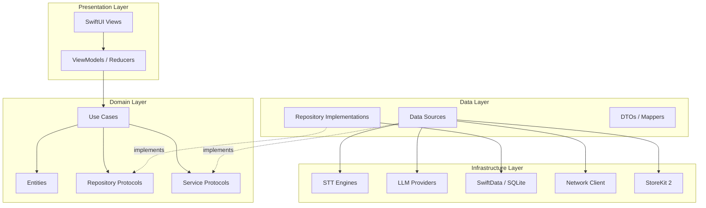
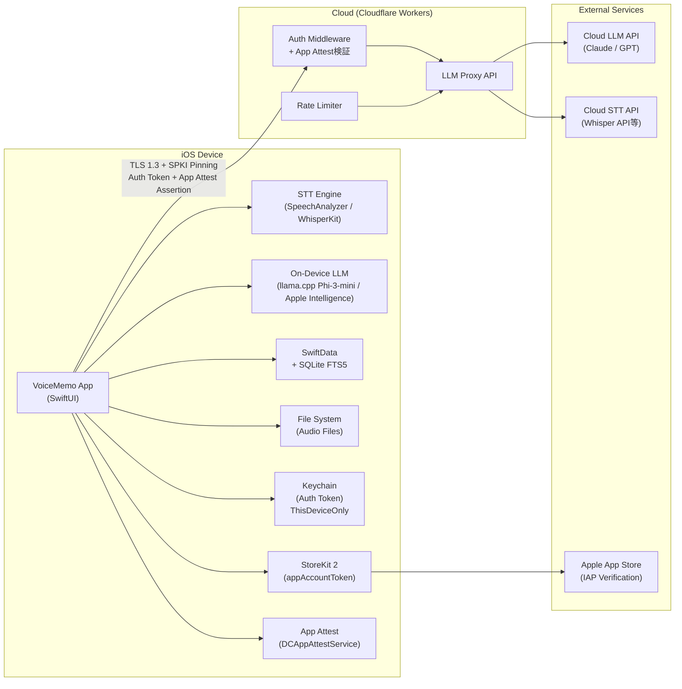
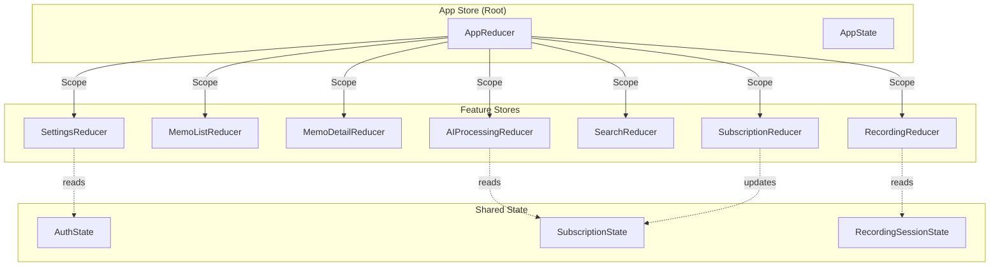
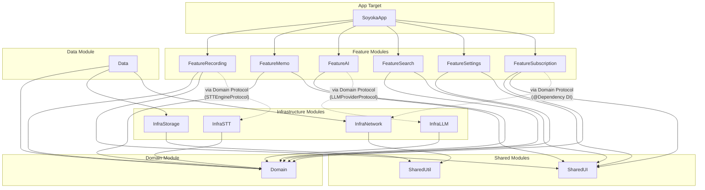
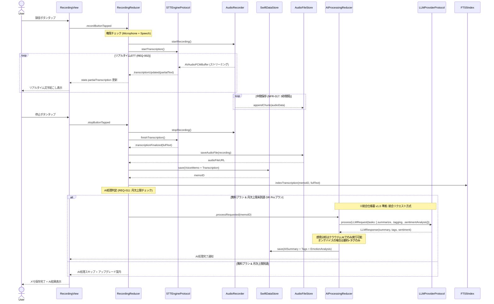
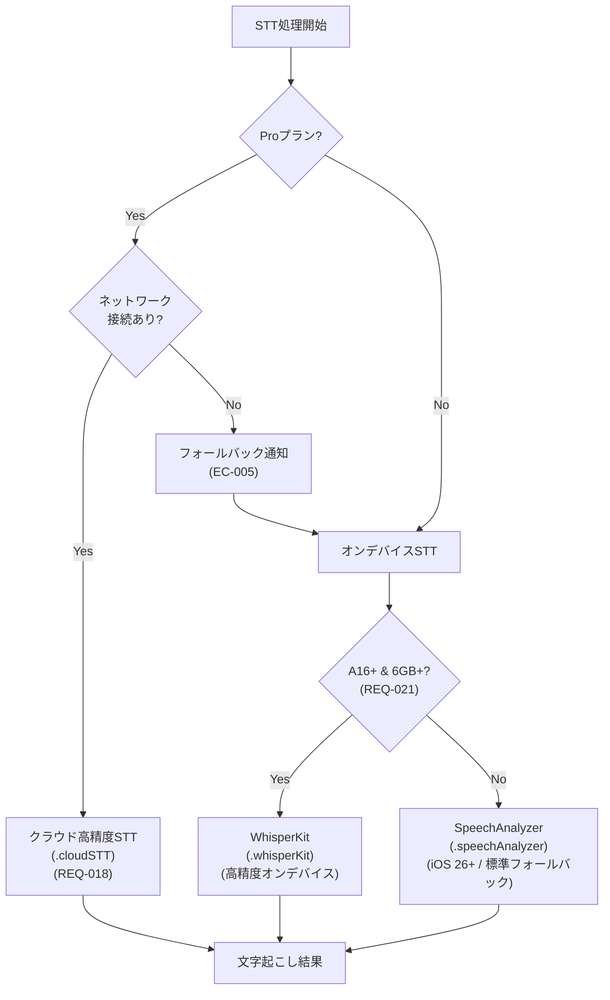
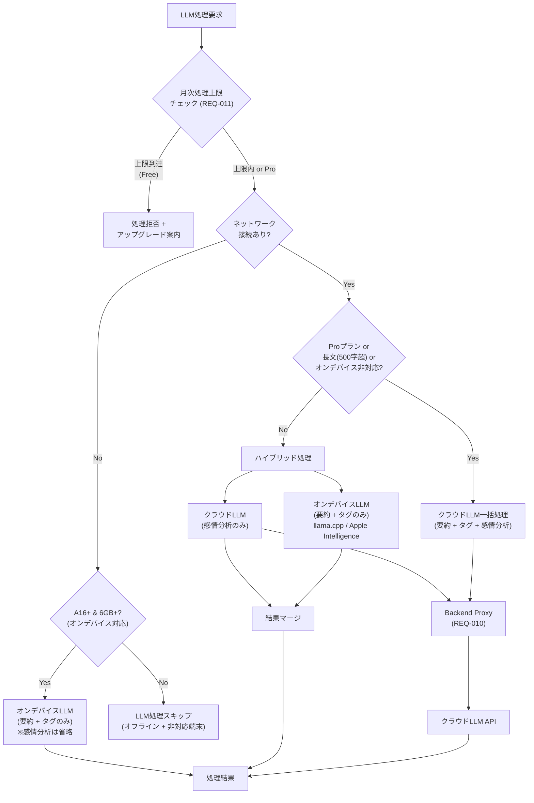
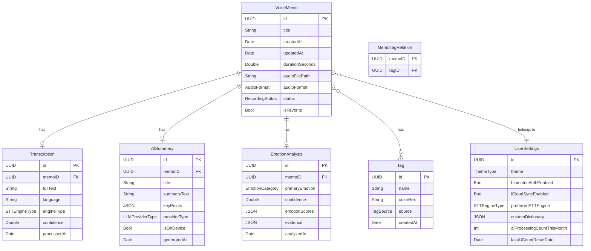
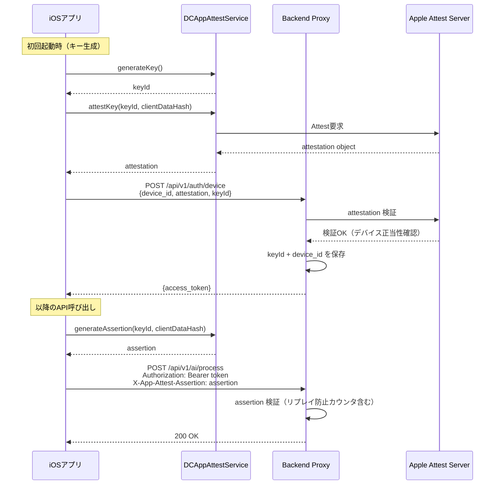

# AI音声メモ・日記アプリ システムアーキテクチャ設計書

> **文書ID**: ARCH-DOC-001
> **バージョン**: 1.1
> **作成日**: 2026-03-16
> **最終更新日**: 2026-03-16
> **ステータス**: ドラフト
> **対応要件書**: REQ-DOC-001 v1.2
> **準拠仕様書**: INT-SPEC-001 v1.0（統合インターフェース仕様書）

---

## 目次

1. [全体アーキテクチャ](#1-全体アーキテクチャ)
2. [アプリケーションアーキテクチャ](#2-アプリケーションアーキテクチャ)
3. [モジュール分割設計](#3-モジュール分割設計)
4. [データフロー設計](#4-データフロー設計)
5. [データモデル設計](#5-データモデル設計)
6. [ローカルストレージ設計](#6-ローカルストレージ設計)
7. [非機能要件への対応方針](#7-非機能要件への対応方針)
8. [技術スタック一覧](#8-技術スタック一覧)

---

## 1. 全体アーキテクチャ

### 1.1 レイヤー構成

本アプリはClean Architecture の原則に基づき、4層のレイヤー構成を採用する。依存の方向は外側から内側への一方向とし、Domain層は他のどの層にも依存しない。



### 1.2 システム全体構成図



### 1.3 設計原則

| 原則 | 適用方針 | 対応要件 |
|:-----|:---------|:---------|
| **Privacy First** | すべてのユーザーデータはローカル保存。クラウド送信時はデータ非保持を保証 | REQ-008, NFR-007 |
| **Offline First** | STT・保存・閲覧・検索はネットワーク不要で動作 | REQ-009, NFR-018 |
| **Protocol-Oriented** | STT/LLMエンジンはプロトコル抽象化し差し替え可能 | NFR-019, NFR-020 |
| **Dependency Inversion** | Domain層は具象実装に依存しない | 保守性全般 |
| **Single Responsibility** | 各モジュールは単一の責務を持つ | 保守性全般 |

---

## 2. アプリケーションアーキテクチャ

### 2.1 アーキテクチャパターン選定

#### 比較表

| 観点 | TCA (The Composable Architecture) | MVVM + Coordinator |
|:-----|:----------------------------------|:-------------------|
| **状態管理** | Store による一元管理。状態の予測可能性が高い | ViewModel ごとに分散。@Published で管理 |
| **テスタビリティ** | Reducer が純粋関数。TestStore による網羅的テストが容易 | ViewModel のテストは可能だが、副作用の分離が曖昧になりやすい |
| **副作用の制御** | Effect 型で明示的に管理。キャンセル・デバウンスが宣言的 | Combine/async-await で手動管理。統一的な制御が難しい |
| **学習コスト** | 高い。独自の概念（Reducer, Effect, Scope）の習得が必要 | 低い。SwiftUI の標準パターンに近い |
| **SwiftUI親和性** | WithViewStore / @ObservableState で統合 | @Observable / @State で自然に統合 |
| **モジュール分割** | Scope/Pullback で型安全なモジュール合成が可能 | Coordinator パターンで画面遷移を分離 |
| **依存注入** | @Dependency マクロで統一的に管理 | 手動 DI または Swinject 等のライブラリ |
| **コミュニティ・実績** | Point-Free 社が積極メンテ。Swift Composable 系の事実上標準 | iOS 開発の伝統的パターン。情報が豊富 |
| **録音・STT との相性** | Long-living Effect でストリーミング処理を宣言的に記述可能 | AsyncStream を手動管理する必要がある |

#### 選定結果: **TCA (The Composable Architecture)**

**選定理由:**

1. **録音・STTストリーミングとの親和性**: 録音やリアルタイムSTTはlong-living effectであり、TCAのEffect型で宣言的に管理できる。キャンセル（録音停止）やデバウンス（STTの中間結果フィルタリング）も `.cancellable()` / `.debounce()` で自然に表現可能
2. **状態の予測可能性**: 録音状態・STT結果・AI処理状態・課金状態など、複数の非同期状態が絡み合うアプリにおいて、単一Storeによる一元管理は状態遷移のバグを防ぐ
3. **テスタビリティ**: TestStoreにより「アクション送信 → 状態変化の検証 → Effect の検証」を一気通貫でテストできる。TDD（t-wada方式）との相性が極めて良い
4. **モジュール境界の明確化**: SPMマルチモジュール構成において、各Feature ModuleのReducerをScope/Pullbackで合成できるため、モジュール間の型安全な結合が保証される
5. **依存注入の統一**: `@Dependency` マクロにより、STTエンジンやLLMプロバイダの差し替え（NFR-019, NFR-020）がテスト時・本番時で一貫して行える

### 2.2 TCA適用方針



### 2.3 SwiftUI View階層設計

```
AppView (NavigationStack)
├── TabView
│   ├── Tab: ホーム
│   │   ├── MemoListView
│   │   │   ├── MemoRowView (LazyVStack)
│   │   │   └── MemoDetailView (NavigationDestination)
│   │   │       ├── TranscriptionView
│   │   │       ├── AudioPlayerView
│   │   │       ├── AISummaryView
│   │   │       ├── TagListView
│   │   │       └── EmotionChartView
│   │   └── RecordingOverlayView (fullScreenCover)
│   │       ├── WaveformView
│   │       ├── TimerView
│   │       └── RealtimeTranscriptionView
│   ├── Tab: 検索
│   │   └── SearchView
│   │       ├── SearchBarView
│   │       ├── FilterChipsView (Pro)
│   │       └── SearchResultListView
│   ├── Tab: 統計 (P4)
│   │   └── DashboardView
│   │       ├── EmotionTimelineChartView
│   │       └── UsageStatsView
│   └── Tab: 設定
│       └── SettingsView
│           ├── SubscriptionView
│           ├── ThemeSettingsView (Pro)
│           ├── CustomDictionaryView
│           ├── PrivacySettingsView
│           └── AboutView
└── OnboardingView (sheet, 初回起動時)
    ├── WelcomePage
    ├── PermissionRequestPage
    └── QuickTutorialPage
```

### 2.4 Navigation設計

NavigationStack + NavigationPath を使用し、TCA の状態としてナビゲーションスタックを管理する。

```swift
// Navigation State（TCA StackState を活用）
@Reducer
struct AppReducer {
    @ObservableState
    struct State {
        var path = StackState<Path.State>()
        var memoList = MemoListReducer.State()
        var recording = RecordingReducer.State()
        var selectedTab: Tab = .home

        enum Tab: Hashable {
            case home, search, stats, settings
        }
    }

    @Reducer
    enum Path {
        case memoDetail(MemoDetailReducer)
        case search(SearchReducer)
        case settings(SettingsReducer)
        case subscription(SubscriptionReducer)
    }

    enum Action {
        case path(StackActionOf<Path>)
        case memoList(MemoListReducer.Action)
        case recording(RecordingReducer.Action)
        case tabSelected(State.Tab)
    }

    var body: some ReducerOf<Self> {
        Scope(state: \.memoList, action: \.memoList) {
            MemoListReducer()
        }
        Scope(state: \.recording, action: \.recording) {
            RecordingReducer()
        }
        Reduce { state, action in
            // Root navigation logic
        }
        .forEach(\.path, action: \.path)
    }
}
```

**Deep Link対応方針:**
- `onOpenURL` でカスタムURLスキームを受け取り、`AppReducer` の `Action` に変換
- ウィジェットからの録音開始（REQ-029）は `voicememo://record` で遷移

---

## 3. モジュール分割設計

### 3.1 Swift Package Manager マルチモジュール構成



### 3.2 モジュール一覧

| モジュール名 | 責務 | 主要な型 | 依存先 |
|:-------------|:-----|:---------|:-------|
| **SoyokaApp** | アプリエントリポイント、DI構成、Root Reducer | `SoyokaApp`, `AppReducer` | 全Feature Module |
| **FeatureRecording** | 録音・リアルタイムSTT画面 (REQ-001, 002, 013, 014, 026) | `RecordingReducer`, `RecordingView` | Domain, SharedUI（※統合仕様書 v1.0 準拠: InfraSTTへはDomain層プロトコル経由） |
| **FeatureMemo** | メモ一覧・詳細・編集・削除・再生 (REQ-015, 016, 017, 023) | `MemoListReducer`, `MemoDetailReducer` | Domain, SharedUI |
| **FeatureAI** | AI要約・タグ付け・感情分析 (REQ-003, 004, 005, 021, 022) | `AIProcessingReducer`, `AISummaryView` | Domain, SharedUI（※統合仕様書 v1.0 準拠: InfraLLMへはDomain層プロトコル経由） |
| **FeatureSearch** | フルテキスト検索・フィルタ (REQ-006, 019) | `SearchReducer`, `SearchView` | Domain, SharedUI |
| **FeatureSettings** | 設定・辞書管理・プライバシー (REQ-025, 027) | `SettingsReducer`, `SettingsView` | Domain, SharedUI |
| **FeatureSubscription** | 課金・プラン管理 (REQ-011, 012, 024) | `SubscriptionReducer`, `PaywallView` | Domain, SharedUI（※統合仕様書 v1.0 準拠: InfraNetworkへはDomain層プロトコル経由） |
| **Domain** | エンティティ、ユースケース、プロトコル定義 | `VoiceMemo`, `TranscriptionUseCase` 等 | なし (最内層) |
| **Data** | Repository実装、DTO、マッパー | `MemoRepository`, `MemoDTO` | Domain, InfraStorage, InfraNetwork |
| **InfraSTT** | STTエンジン具象実装 (NFR-019) | `SpeechAnalyzerEngine`, `WhisperKitEngine` (※統合仕様書 v1.0 準拠: STTEngineProtocol を実装) | Domain |
| **InfraLLM** | LLMプロバイダ具象実装 (NFR-020) | `AppleIntelligenceProvider`, `LlamaCppProvider`, `CloudLLMProvider` (※統合仕様書 v1.0 準拠: LLMProviderProtocol を実装) | Domain |
| **InfraStorage** | SwiftData / SQLite FTS5 / ファイルストレージ | `SwiftDataStore`, `FTS5IndexManager`, `AudioFileStore` | SharedUtil |
| **InfraNetwork** | HTTP通信、Backend Proxy連携、App Attest (REQ-010) | `APIClient`, `ProxyEndpoint`, `AppAttestManager`, `KeychainTokenStore` (※統合仕様書 v1.0 準拠: Critical #7/#8 App Attest 追加) | SharedUtil |
| **SharedUI** | 共通UIコンポーネント、デザイントークン (NFR-012) | `WaveformView`, `DesignTokens`, `ThemeManager` | なし |
| **SharedUtil** | ユーティリティ、拡張、ロガー | `Logger`, `DateFormatter+`, `FileManager+` | なし |

### 3.3 Package.swift 構成（概要）

```swift
// Package.swift (ルートワークスペース)
let package = Package(
    name: "SoyokaModules",
    platforms: [.iOS(.v17)],
    products: [
        .library(name: "FeatureRecording", targets: ["FeatureRecording"]),
        .library(name: "FeatureMemo", targets: ["FeatureMemo"]),
        .library(name: "FeatureAI", targets: ["FeatureAI"]),
        .library(name: "FeatureSearch", targets: ["FeatureSearch"]),
        .library(name: "FeatureSettings", targets: ["FeatureSettings"]),
        .library(name: "FeatureSubscription", targets: ["FeatureSubscription"]),
        .library(name: "Domain", targets: ["Domain"]),
        .library(name: "Data", targets: ["Data"]),
        .library(name: "InfraSTT", targets: ["InfraSTT"]),
        .library(name: "InfraLLM", targets: ["InfraLLM"]),
        .library(name: "InfraStorage", targets: ["InfraStorage"]),
        .library(name: "InfraNetwork", targets: ["InfraNetwork"]),
        .library(name: "SharedUI", targets: ["SharedUI"]),
        .library(name: "SharedUtil", targets: ["SharedUtil"]),
    ],
    dependencies: [
        .package(url: "https://github.com/pointfreeco/swift-composable-architecture", from: "1.17.0"),
        .package(url: "https://github.com/argmaxinc/WhisperKit", from: "0.9.0"), // ※統合仕様書 v1.0 準拠: WhisperKit採用
        .package(url: "https://github.com/ggerganov/llama.cpp", branch: "master"), // オンデバイスLLM用
    ],
    targets: [
        .target(name: "Domain"),
        .target(name: "SharedUtil"),
        .target(name: "SharedUI"),
        .target(name: "InfraSTT", dependencies: ["Domain"]),
        .target(name: "InfraLLM", dependencies: ["Domain"]),
        .target(name: "InfraStorage", dependencies: ["SharedUtil"]),
        .target(name: "InfraNetwork", dependencies: ["SharedUtil"]),
        .target(name: "Data", dependencies: ["Domain", "InfraStorage", "InfraNetwork"]),
        // ※統合仕様書 v1.0 準拠（H2）: Feature → Infra 直接依存を排除
        // Feature モジュールは Domain 層のプロトコル経由でのみ Infra にアクセス
        // 実体の注入は SoyokaApp (DI構成) で @Dependency を通じて行う
        .target(name: "FeatureRecording", dependencies: [
            "Domain", "SharedUI",
            .product(name: "ComposableArchitecture", package: "swift-composable-architecture"),
        ]),
        .target(name: "FeatureMemo", dependencies: [
            "Domain", "SharedUI",
            .product(name: "ComposableArchitecture", package: "swift-composable-architecture"),
        ]),
        .target(name: "FeatureAI", dependencies: [
            "Domain", "SharedUI",
            .product(name: "ComposableArchitecture", package: "swift-composable-architecture"),
        ]),
        .target(name: "FeatureSearch", dependencies: [
            "Domain", "SharedUI",
            .product(name: "ComposableArchitecture", package: "swift-composable-architecture"),
        ]),
        .target(name: "FeatureSettings", dependencies: [
            "Domain", "SharedUI",
            .product(name: "ComposableArchitecture", package: "swift-composable-architecture"),
        ]),
        .target(name: "FeatureSubscription", dependencies: [
            "Domain", "SharedUI",
            .product(name: "ComposableArchitecture", package: "swift-composable-architecture"),
        ]),
        // Test targets
        .testTarget(name: "DomainTests", dependencies: ["Domain"]),
        .testTarget(name: "FeatureRecordingTests", dependencies: ["FeatureRecording"]),
        .testTarget(name: "FeatureMemoTests", dependencies: ["FeatureMemo"]),
        .testTarget(name: "FeatureAITests", dependencies: ["FeatureAI"]),
        .testTarget(name: "InfraSTTTests", dependencies: ["InfraSTT"]),
        .testTarget(name: "InfraLLMTests", dependencies: ["InfraLLM"]),
        .testTarget(name: "InfraStorageTests", dependencies: ["InfraStorage"]),
    ]
)
```

---

## 4. データフロー設計

### 4.1 録音 → STT → 保存 → AI処理 → 表示 全体フロー



### 4.2 STTエンジン切替フロー（ハイブリッド）



### 4.3 LLMハイブリッド処理フロー

<!-- ※統合仕様書 v1.0 準拠（Critical #3, セクション5.3）: 感情分析の分離パスを反映 -->



### 4.4 状態管理の方針

| 状態の種類 | 管理方式 | 説明 |
|:-----------|:---------|:-----|
| **画面状態** | TCA Store (各Feature Reducer) | 各画面のUI状態はFeature ReducerのStateで管理 |
| **録音セッション状態** | TCA Shared State (`@Shared`) | 録音中フラグ・経過時間は複数画面で共有 |
| **サブスクリプション状態** | TCA Shared State (`@Shared`) | プラン種別・AI処理残回数はアプリ全体で参照 |
| **永続化データ** | SwiftData (via Repository) | メモ・文字起こし・AI結果はSwiftDataで永続化 |
| **一時的UIイベント** | TCA Effect (`.send`) | トースト通知・エラーダイアログ等の一過性イベント |

---

## 5. データモデル設計

### 5.1 ER図



### 5.2 SwiftData @Model 定義

```swift
// Domain/Models/VoiceMemo.swift
import Foundation
import SwiftData

@Model
final class VoiceMemo {
    @Attribute(.unique) var id: UUID
    var title: String
    var createdAt: Date
    var updatedAt: Date
    var durationSeconds: Double
    var audioFilePath: String  // Documents/Audio/ からの相対パス
    var audioFormat: AudioFormat
    var status: RecordingStatus
    var isFavorite: Bool

    // Relationships
    @Relationship(deleteRule: .cascade, inverse: \Transcription.memo)
    var transcription: Transcription?

    @Relationship(deleteRule: .cascade, inverse: \AISummary.memo)
    var aiSummary: AISummary?

    @Relationship(deleteRule: .cascade, inverse: \EmotionAnalysis.memo)
    var emotionAnalysis: EmotionAnalysis?

    @Relationship(deleteRule: .nullify)
    var tags: [Tag]

    init(
        id: UUID = UUID(),
        title: String = "",
        createdAt: Date = Date(),
        durationSeconds: Double = 0,
        audioFilePath: String,
        audioFormat: AudioFormat = .m4a
    ) {
        self.id = id
        self.title = title
        self.createdAt = createdAt
        self.updatedAt = createdAt
        self.durationSeconds = durationSeconds
        self.audioFilePath = audioFilePath
        self.audioFormat = audioFormat
        self.status = .completed
        self.isFavorite = false
        self.tags = []
    }
}

/// ※統合仕様書 v1.0 準拠: AACコンテナとして .m4a を使用
enum AudioFormat: String, Codable {
    case m4a    // AAC圧縮 (M4Aコンテナ)
    case opus
}

enum RecordingStatus: String, Codable {
    case recording
    case paused
    case completed
    case failed
}
```

```swift
// Domain/Models/Transcription.swift
@Model
final class Transcription {
    @Attribute(.unique) var id: UUID
    var memo: VoiceMemo?
    var fullText: String
    var language: String
    var engineType: STTEngineType
    var confidence: Double
    var processedAt: Date

    /// ※統合仕様書 v1.0 準拠: デフォルトの engineType を .whisperKit に変更
    init(
        id: UUID = UUID(),
        fullText: String,
        language: String = "ja-JP",
        engineType: STTEngineType = .whisperKit,
        confidence: Double = 0.0,
        processedAt: Date = Date()
    ) {
        self.id = id
        self.fullText = fullText
        self.language = language
        self.engineType = engineType
        self.confidence = confidence
        self.processedAt = processedAt
    }
}

// 注: STTEngineType enum はセクション7.4 STTEngineProtocol にて
// 統合仕様書 v1.0 準拠の統一enum（.speechAnalyzer / .whisperKit / .cloudSTT）として定義済み
```

```swift
// Domain/Models/AISummary.swift
// ※統合仕様書 v1.0 準拠（セクション3.2, 6.5）:
//   LLMProviderType を4種類enumに統一
//   keyPoints は [String] 型（SwiftData の Transformable で JSON配列として保存）
@Model
final class AISummary {
    @Attribute(.unique) var id: UUID
    var memo: VoiceMemo?
    var title: String                   // 20文字以内の要約タイトル
    var summaryText: String             // 1-2行の要約
    @Attribute(.transformable(by: "NSSecureUnarchiveFromDataTransformerName"))
    var keyPoints: [String]             // 最大5つのキーポイント（JSON配列として保存）
    var providerType: LLMProviderType
    var isOnDevice: Bool
    var generatedAt: Date

    init(
        id: UUID = UUID(),
        title: String = "",
        summaryText: String,
        keyPoints: [String] = [],
        providerType: LLMProviderType = .onDeviceLlamaCpp,
        isOnDevice: Bool = true,
        generatedAt: Date = Date()
    ) {
        self.id = id
        self.title = title
        self.summaryText = summaryText
        self.keyPoints = keyPoints
        self.providerType = providerType
        self.isOnDevice = isOnDevice
        self.generatedAt = generatedAt
    }
}

// 注: LLMProviderType enum はセクション7.4 LLMProviderProtocol にて
// 統合仕様書 v1.0 準拠の4種類enum として定義済み
```

```swift
// Domain/Models/Tag.swift
@Model
final class Tag {
    @Attribute(.unique) var id: UUID
    var name: String
    var colorHex: String
    var source: TagSource
    var createdAt: Date

    @Relationship(inverse: \VoiceMemo.tags)
    var memos: [VoiceMemo]

    init(
        id: UUID = UUID(),
        name: String,
        colorHex: String = "#FF9500",
        source: TagSource = .ai,
        createdAt: Date = Date()
    ) {
        self.id = id
        self.name = name
        self.colorHex = colorHex
        self.source = source
        self.createdAt = createdAt
        self.memos = []
    }
}

enum TagSource: String, Codable {
    case ai       // AI自動付与
    case manual   // ユーザー手動
}
```

```swift
// Domain/Models/EmotionAnalysis.swift
// ※統合仕様書 v1.0 準拠（セクション3.2, 6.1）:
//   EmotionType → EmotionCategory に改名
//   fear → anxiety, disgust → 削除, anticipation 追加
@Model
final class EmotionAnalysis {
    @Attribute(.unique) var id: UUID
    var memo: VoiceMemo?
    var primaryEmotion: EmotionCategory
    var confidence: Double
    var emotionScores: [String: Double]  // {"joy": 0.8, "calm": 0.6, ...}
    var evidence: [[String: String]]     // [{text: "...", emotion: "joy"}, ...] 最大3件
    var analyzedAt: Date

    init(
        id: UUID = UUID(),
        primaryEmotion: EmotionCategory = .neutral,
        confidence: Double = 0.0,
        emotionScores: [String: Double] = [:],
        evidence: [[String: String]] = [],
        analyzedAt: Date = Date()
    ) {
        self.id = id
        self.primaryEmotion = primaryEmotion
        self.confidence = confidence
        self.emotionScores = emotionScores
        self.evidence = evidence
        self.analyzedAt = analyzedAt
    }
}

/// 感情カテゴリ（統一enum, 8段階）
/// ※統合仕様書 v1.0 準拠（セクション3.2）: 全設計書でこのenumを使用すること
enum EmotionCategory: String, Codable, CaseIterable, Sendable {
    case joy           = "joy"           // 喜び
    case calm          = "calm"          // 安心
    case anticipation  = "anticipation"  // 期待
    case sadness       = "sadness"       // 悲しみ
    case anxiety       = "anxiety"       // 不安
    case anger         = "anger"         // 怒り
    case surprise      = "surprise"      // 驚き
    case neutral       = "neutral"       // 中立
}
```

```swift
// Domain/Models/UserSettings.swift
// ※統合仕様書 v1.0 準拠（セクション3.1, 付録A）:
//   preferredSTTEngine のデフォルト値を .speechAnalyzer → .whisperKit に変更
//   ER図との型不一致を修正（iCloudSyncEnabled 追加）
@Model
final class UserSettings {
    @Attribute(.unique) var id: UUID
    var theme: ThemeType
    var biometricAuthEnabled: Bool
    var iCloudSyncEnabled: Bool
    var preferredSTTEngine: STTEngineType
    var customDictionary: [String: String]  // {"読み": "表記"} 形式
    var aiProcessingCountThisMonth: Int
    var lastAICountResetDate: Date

    init(id: UUID = UUID()) {
        self.id = id
        self.theme = .system
        self.biometricAuthEnabled = false
        self.iCloudSyncEnabled = false
        self.preferredSTTEngine = .whisperKit
        self.customDictionary = [:]
        self.aiProcessingCountThisMonth = 0
        self.lastAICountResetDate = Date()
    }

    /// 月次AI処理カウントのリセット判定 (EC-014: 毎月1日 JST 0:00)
    func shouldResetMonthlyCount() -> Bool {
        let calendar = Calendar(identifier: .gregorian)
        let jst = TimeZone(identifier: "Asia/Tokyo")!
        var cal = calendar
        cal.timeZone = jst
        let now = Date()
        let lastMonth = cal.component(.month, from: lastAICountResetDate)
        let currentMonth = cal.component(.month, from: now)
        return lastMonth != currentMonth
    }
}

enum ThemeType: String, Codable {
    case system
    case light
    case dark
    case journal  // 感性的ジャーナルテーマ (NFR-012)
}
```

### 5.3 SQLite FTS5 インデックス設計

SwiftDataのバックエンドであるSQLiteに対し、FTS5仮想テーブルを直接作成してフルテキスト検索を実現する（REQ-006）。

```swift
// InfraStorage/FTS5/FTS5IndexManager.swift
import SQLite3
import Foundation

/// FTS5全文検索インデックスの管理
/// REQ-006: フルテキスト検索、REQ-019: 高度な検索・フィルタリング
final class FTS5IndexManager {

    private let dbPath: String

    init(dbPath: String) {
        self.dbPath = dbPath
    }

    /// FTS5仮想テーブルの作成
    /// ※統合仕様書 v1.0 準拠（H5）: ICUトークナイザにフォールバック設計を追加
    /// 一次候補: ICU ja_JP（日本語形態素解析）
    /// フォールバック: unicode61 + trigram（ICU非対応環境向け）
    func createIndex() throws {
        // ICUトークナイザの利用可否を確認
        if isICUTokenizerAvailable() {
            let createSQL = """
                CREATE VIRTUAL TABLE IF NOT EXISTS memo_fts USING fts5(
                    memo_id UNINDEXED,
                    title,
                    transcription_text,
                    summary_text,
                    tags,
                    tokenize = 'icu ja_JP'
                );
            """
            try execute(sql: createSQL)
        } else {
            // フォールバック: unicode61 + trigram でN-gramベース検索
            // ICU非対応環境（一部のSQLiteビルド）でも日本語検索を可能にする
            let createSQL = """
                CREATE VIRTUAL TABLE IF NOT EXISTS memo_fts USING fts5(
                    memo_id UNINDEXED,
                    title,
                    transcription_text,
                    summary_text,
                    tags,
                    tokenize = 'unicode61',
                    content_rowid = 'rowid'
                );
            """
            try execute(sql: createSQL)

            // trigram インデックスも作成（部分一致検索用）
            let trigramSQL = """
                CREATE VIRTUAL TABLE IF NOT EXISTS memo_fts_trigram USING fts5(
                    memo_id UNINDEXED,
                    title,
                    transcription_text,
                    tokenize = 'trigram'
                );
            """
            try execute(sql: trigramSQL)
        }
    }

    /// ICUトークナイザの利用可否を確認
    private func isICUTokenizerAvailable() -> Bool {
        // テスト用の仮テーブルを作成してICU対応を確認
        do {
            let testSQL = """
                CREATE VIRTUAL TABLE IF NOT EXISTS _icu_test USING fts5(
                    test_col, tokenize = 'icu ja_JP'
                );
            """
            try execute(sql: testSQL)
            try execute(sql: "DROP TABLE IF EXISTS _icu_test;")
            return true
        } catch {
            return false
        }
    }

    /// メモのインデックス追加・更新
    func upsertIndex(
        memoID: String,
        title: String,
        transcriptionText: String,
        summaryText: String,
        tags: String
    ) throws {
        // 既存レコードを削除してから挿入（UPSERT相当）
        let deleteSQL = "DELETE FROM memo_fts WHERE memo_id = ?;"
        try execute(sql: deleteSQL, params: [memoID])

        let insertSQL = """
            INSERT INTO memo_fts (memo_id, title, transcription_text, summary_text, tags)
            VALUES (?, ?, ?, ?, ?);
        """
        try execute(sql: insertSQL, params: [memoID, title, transcriptionText, summaryText, tags])
    }

    /// フルテキスト検索の実行
    /// - Parameter query: 検索クエリ（日本語対応）
    /// - Returns: マッチしたメモIDの配列（ランク順）
    func search(query: String) throws -> [String] {
        let searchSQL = """
            SELECT memo_id
            FROM memo_fts
            WHERE memo_fts MATCH ?
            ORDER BY rank;
        """
        return try executeQuery(sql: searchSQL, params: [query])
    }

    /// インデックスからメモを削除
    func removeIndex(memoID: String) throws {
        let deleteSQL = "DELETE FROM memo_fts WHERE memo_id = ?;"
        try execute(sql: deleteSQL, params: [memoID])
    }

    // MARK: - Private helpers (SQLite3 C API wrapper)
    private func execute(sql: String, params: [String] = []) throws { /* ... */ }
    private func executeQuery(sql: String, params: [String]) throws -> [String] { /* ... */ }
}
```

**FTS5設計のポイント:**

| 項目 | 設計判断 | 理由 |
|:-----|:---------|:-----|
| トークナイザ | `icu ja_JP`（一次候補）/ `unicode61` + `trigram`（フォールバック） | 日本語形態素解析に対応。ICU非対応環境では unicode61 + trigram にフォールバック（※統合仕様書 v1.0 準拠: H5） |
| インデックス対象 | title, transcription_text, summary_text, tags | 検索対象となるテキスト系フィールドすべてをインデックス |
| memo_id | `UNINDEXED` | 検索対象ではなく結合キーとして使用するため非インデックス |
| 更新方式 | DELETE + INSERT | FTS5はUPDATEのパフォーマンスが劣るため、DELETE-INSERT方式を採用 |
| バックグラウンド更新 | AI処理完了時に非同期実行 | EC-009: 大量メモ蓄積時のパフォーマンス維持 |

---

## 6. ローカルストレージ設計

### 6.1 ディレクトリ構成

```
<!-- ※統合仕様書 v1.0 準拠（セクション6.6, 8.1, 8.2）: ディレクトリ構成統一 -->
App Sandbox/
├── Documents/                           # iCloudバックアップ対象外に設定
│   └── Audio/                           # 音声ファイル保存先（NSFileProtectionComplete）
│       ├── {UUID}.m4a                   # 録音済み音声（AAC/M4Aコンテナ）
│       └── {UUID}.opus                  # 録音済み音声（OPUS圧縮）
├── Library/
│   ├── Application Support/
│   │   ├── SecureStore/                 # SwiftData ストア（iCloudバックアップ除外）
│   │   │   └── default.sqlite           # メインDB + FTS5インデックス（NSFileProtectionComplete）
│   │   └── UserDefaults/               # iCloudバックアップ対象（メタデータ）
│   │       └── settings.plist           # テーマ・言語等の設定
│   └── Caches/
│       ├── STTCache/                    # STT中間結果キャッシュ
│       ├── ThumbnailCache/             # 波形サムネイルキャッシュ
│       └── Models/                      # MLモデル（再ダウンロード可能なためCachesに配置）
│           ├── whisper-small-ja.mlmodel # WhisperKit用モデル（日本語特化）
│           └── phi-3-mini-q4.gguf      # llama.cpp用LLMモデル（Phi-3-mini Q4_K_M）
└── tmp/
    └── Recording/                       # 録音中一時ファイル（NSFileProtectionCompleteUntilFirstUserAuthentication）
        └── {UUID}_chunk_{N}.m4a         # ※統合仕様書準拠: 拡張子を .m4a に統一
```

### 6.2 iCloudバックアップ除外設定（REQ-008, NFR-021）

```swift
// InfraStorage/FileStore/AudioFileStore.swift
import Foundation

/// ※統合仕様書 v1.0 準拠（セクション6.6, 8.1, 8.2）:
///   Models ディレクトリを Library/Caches/Models/ に移動
///   音声ファイルに NSFileProtectionComplete を設定
struct AudioFileStore {

    private let audioDirectory: URL
    private let modelDirectory: URL

    init() {
        let documents = FileManager.default.urls(for: .documentDirectory, in: .userDomainMask).first!
        let caches = FileManager.default.urls(for: .cachesDirectory, in: .userDomainMask).first!

        self.audioDirectory = documents.appendingPathComponent("Audio", isDirectory: true)
        // ※統合仕様書 v1.0 準拠: Models は再ダウンロード可能なため Caches に配置
        self.modelDirectory = caches.appendingPathComponent("Models", isDirectory: true)

        // ディレクトリ作成
        try? FileManager.default.createDirectory(at: audioDirectory, withIntermediateDirectories: true)
        try? FileManager.default.createDirectory(at: modelDirectory, withIntermediateDirectories: true)

        // iCloudバックアップから除外（NFR-021）
        excludeFromBackup(url: audioDirectory)
        // Caches は iOS により自動的にバックアップ除外されるため明示設定不要

        // ※統合仕様書 v1.0 準拠: 確定済み音声ファイルに最高保護レベルを設定
        setFileProtection(url: audioDirectory, protection: .complete)
    }

    /// ファイル保護レベルの設定
    private func setFileProtection(url: URL, protection: FileProtectionType) {
        try? FileManager.default.setAttributes(
            [.protectionKey: protection],
            ofItemAtPath: url.path
        )
    }

    /// iCloudバックアップからの除外設定
    /// NFR-021: 音声データ・文字起こしデータ・LLM処理結果はバックアップ対象外
    private func excludeFromBackup(url: URL) {
        var mutableURL = url
        var resourceValues = URLResourceValues()
        resourceValues.isExcludedFromBackup = true
        try? mutableURL.setResourceValues(resourceValues)
    }

    /// 音声ファイルの保存
    /// NFR-006: 1分あたり500KB以内（AAC圧縮, 44.1kHz, モノラル）
    func saveAudioFile(data: Data, id: UUID, format: AudioFormat) throws -> String {
        let fileName = "\(id.uuidString).\(format.rawValue)"
        let fileURL = audioDirectory.appendingPathComponent(fileName)
        try data.write(to: fileURL, options: [.atomic])
        excludeFromBackup(url: fileURL)
        return "Audio/\(fileName)"  // 相対パスを返却
    }

    /// 音声ファイルの削除（REQ-017: 完全削除）
    func deleteAudioFile(relativePath: String) throws {
        let documents = FileManager.default.urls(for: .documentDirectory, in: .userDomainMask).first!
        let fileURL = documents.appendingPathComponent(relativePath)
        try FileManager.default.removeItem(at: fileURL)
    }

    /// ストレージ使用量の計算（EC-002: ストレージ不足警告）
    func calculateStorageUsage() throws -> UInt64 {
        let contents = try FileManager.default.contentsOfDirectory(
            at: audioDirectory,
            includingPropertiesForKeys: [.fileSizeKey]
        )
        return try contents.reduce(0) { total, url in
            let values = try url.resourceValues(forKeys: [.fileSizeKey])
            return total + UInt64(values.fileSize ?? 0)
        }
    }
}
```

### 6.3 SwiftData ストア構成

```swift
// InfraStorage/SwiftDataStore/ModelContainerConfiguration.swift
import SwiftData
import Foundation

enum ModelContainerConfiguration {

    /// SwiftData ModelContainer の構成
    /// - Note: SwiftData のバックエンドSQLiteファイルもiCloudバックアップ除外対象
    static func create() throws -> ModelContainer {
        let schema = Schema([
            VoiceMemo.self,
            Transcription.self,
            AISummary.self,
            Tag.self,
            EmotionAnalysis.self,
            UserSettings.self,
        ])

        let configuration = ModelConfiguration(
            "VoiceMemoStore",
            schema: schema,
            isStoredInMemoryOnly: false,
            allowsSave: true
        )

        let container = try ModelContainer(
            for: schema,
            configurations: [configuration]
        )

        // SwiftDataのSQLiteファイルをiCloudバックアップから除外
        excludeSwiftDataStoreFromBackup()

        return container
    }

    /// ※統合仕様書 v1.0 準拠（セクション6.6, 8.4）:
    ///   SwiftDataストアディレクトリを SecureStore/ に統一
    ///   確定済みテキストデータに NSFileProtectionComplete を設定
    private static func excludeSwiftDataStoreFromBackup() {
        let appSupport = FileManager.default.urls(
            for: .applicationSupportDirectory,
            in: .userDomainMask
        ).first!
        let storeDir = appSupport.appendingPathComponent("SecureStore")

        // ディレクトリ作成
        try? FileManager.default.createDirectory(at: storeDir, withIntermediateDirectories: true)

        // iCloudバックアップ除外
        var mutableURL = storeDir
        var resourceValues = URLResourceValues()
        resourceValues.isExcludedFromBackup = true
        try? mutableURL.setResourceValues(resourceValues)

        // 確定済みデータに最高保護レベルを設定
        try? FileManager.default.setAttributes(
            [.protectionKey: FileProtectionType.complete],
            ofItemAtPath: storeDir.path
        )
    }
}
```

### 6.4 録音時の一時ファイル管理（NFR-017）

```swift
// InfraStorage/FileStore/TemporaryRecordingStore.swift
import Foundation

/// 録音中の中間保存を管理
/// NFR-017: アプリクラッシュ時でも録音データが失われないよう5秒間隔で中間保存
/// ※統合仕様書 v1.0 準拠（セクション5.2）: AVAssetExportSession方式に置換
struct TemporaryRecordingStore {

    private let tempDirectory: URL

    init() {
        let tmp = FileManager.default.temporaryDirectory
        self.tempDirectory = tmp.appendingPathComponent("Recording", isDirectory: true)
        try? FileManager.default.createDirectory(at: tempDirectory, withIntermediateDirectories: true)
    }

    /// チャンクの保存（5秒間隔で呼び出し）
    /// ※統合仕様書 v1.0 準拠: 拡張子を .m4a に変更（AACコンテナとして正しい拡張子）
    func saveChunk(recordingID: UUID, chunkIndex: Int, data: Data) throws -> URL {
        let fileName = "\(recordingID.uuidString)_chunk_\(chunkIndex).m4a"
        let fileURL = tempDirectory.appendingPathComponent(fileName)
        try data.write(to: fileURL, options: [.atomic])
        return fileURL
    }

    /// 録音完了時にチャンクを結合して最終ファイルを生成
    /// ※統合仕様書 v1.0 準拠（Critical #2）:
    ///   単純な Data.append() によるAAC連結は禁止。
    ///   AVAssetExportSession を使用した正しいチャンク結合を行う。
    func finalizeRecording(recordingID: UUID) async throws -> URL {
        let chunkURLs = try FileManager.default
            .contentsOfDirectory(at: tempDirectory, includingPropertiesForKeys: nil)
            .filter { $0.lastPathComponent.hasPrefix(recordingID.uuidString) }
            .sorted { $0.lastPathComponent < $1.lastPathComponent }

        // AVMutableComposition で複数チャンクを正しく結合
        let composition = AVMutableComposition()
        guard let track = composition.addMutableTrack(
            withMediaType: .audio,
            preferredTrackID: kCMPersistentTrackID_Invalid
        ) else {
            throw RecordingError.compositionFailed
        }

        var currentTime = CMTime.zero
        for chunkURL in chunkURLs {
            let asset = AVURLAsset(url: chunkURL)
            let duration = try await asset.load(.duration)
            guard let audioTrack = try await asset.loadTracks(withMediaType: .audio).first else {
                continue
            }
            try track.insertTimeRange(
                CMTimeRange(start: .zero, duration: duration),
                of: audioTrack,
                at: currentTime
            )
            currentTime = CMTimeAdd(currentTime, duration)
        }

        // AVAssetExportSession で正しいAACファイルを出力
        let outputURL = tempDirectory.appendingPathComponent("\(recordingID.uuidString)_final.m4a")
        guard let exportSession = AVAssetExportSession(
            asset: composition,
            presetName: AVAssetExportPresetAppleM4A
        ) else {
            throw RecordingError.exportFailed
        }
        exportSession.outputURL = outputURL
        exportSession.outputFileType = .m4a

        await exportSession.export()

        guard exportSession.status == .completed else {
            throw RecordingError.exportFailed
        }

        // 一時チャンクファイルの削除
        for chunkURL in chunkURLs {
            try? FileManager.default.removeItem(at: chunkURL)
        }

        return outputURL
    }

    /// 未完了の録音データの復旧（クラッシュリカバリ）
    func recoverUnfinishedRecordings() -> [UUID] {
        guard let contents = try? FileManager.default.contentsOfDirectory(
            at: tempDirectory, includingPropertiesForKeys: nil
        ) else { return [] }

        let recordingIDs = Set(contents.compactMap { url -> UUID? in
            let name = url.deletingPathExtension().lastPathComponent
            let uuidString = String(name.prefix(36))  // UUID部分を抽出
            return UUID(uuidString: uuidString)
        })

        return Array(recordingIDs)
    }
}

enum RecordingError: Error {
    case compositionFailed
    case exportFailed
}
```

---

## 7. 非機能要件への対応方針

### 7.1 パフォーマンス

| 要件ID | 要件概要 | 対応方針 | 実装手法 |
|:-------|:---------|:---------|:---------|
| **NFR-001** | 録音開始 500ms以内 | AVAudioSession の事前設定、マイク権限の先行取得 | アプリ起動時に `AVAudioSession.sharedInstance().setCategory(.playAndRecord)` を実行。RecordingReducer の初期化時にセッションをアクティブ化しておく |
| **NFR-002** | STT遅延 2秒以内 | ストリーミング処理、バッファサイズ最適化 | SpeechAnalyzer（iOS 26+）: `SFSpeechAudioBufferRecognitionRequest` でリアルタイム認識。WhisperKit: 3秒間隔のチャンク処理で遅延を制御 |
| **NFR-003** | AI要約 10秒以内 | オンデバイス: 量子化モデル使用。クラウド: ストリーミングレスポンス | オンデバイスLLMは4-bit量子化モデル（Q4_K_M）を使用。クラウド側はBackend Proxyでストリーミング応答に対応 |
| **NFR-004** | 起動 2秒以内 | 遅延初期化、モジュールの軽量化 | 重いモジュール（WhisperKitモデルロード、llama.cppモデルロード、FTS5インデックス構築）はバックグラウンドで遅延初期化。メイン画面のView階層を最小限に |
| **NFR-005** | 1,000件一覧 1秒以内 | ページネーション、SwiftData の `@Query` 最適化 | `LazyVStack` + `@Query(sort:)` による遅延ロード。FetchDescriptor に `fetchLimit: 50` を設定し、スクロール時に追加読み込み (EC-009) |
| **NFR-006** | 1分録音 500KB以内 | AAC圧縮パラメータ最適化 | `AVAudioRecorder` 設定: `AVFormatIDKey: kAudioFormatMPEG4AAC`, `AVSampleRateKey: 44100`, `AVNumberOfChannelsKey: 1`, `AVEncoderBitRateKey: 64000` (64kbps = 約480KB/分) |

### 7.2 セキュリティ

| 要件ID | 要件概要 | 対応方針 | 実装手法 |
|:-------|:---------|:---------|:---------|
| **NFR-007** | データ暗号化 | iOS Data Protection 活用（保護レベル分離） | ※統合仕様書 v1.0 準拠（セクション8.1）: データのライフサイクルに応じて保護レベルを分離。録音中一時ファイル（`tmp/Recording/`）= `NSFileProtectionCompleteUntilFirstUserAuthentication`（バックグラウンド録音 EC-003 対応）。確定済み音声ファイル（`Documents/Audio/`）= `NSFileProtectionComplete`（最高保護）。確定済みテキストデータ（SwiftData）= `NSFileProtectionComplete`。MLモデルファイル（`Library/Caches/Models/`）= `NSFileProtectionCompleteUntilFirstUserAuthentication` |
| **NFR-008** | APIキー非保持 | Backend Proxy経由のみ | アプリバイナリにAPIキーを埋め込まない。Cloudflare Workers側でAPIキーを環境変数として管理 |
| **NFR-009** | TLS 1.3通信 | URLSession の設定 + Certificate Pinning | `URLSessionConfiguration.default` の `tlsMinimumSupportedProtocolVersion` を `.TLSv13` に設定。Certificate Pinning は `URLSessionDelegate` の `urlSession(_:didReceive:completionHandler:)` で公開鍵ピンニング（SPKI SHA-256）を実施（※統合仕様書 v1.0 準拠: Pinning方針統一） |
| **NFR-010** | 認証トークン管理 | Keychain + 短期トークン | 認証トークンは `Keychain Services` に `kSecAttrAccessibleAfterFirstUnlockThisDeviceOnly` で保存（※統合仕様書 v1.0 準拠: ThisDeviceOnly 必須）。トークンリフレッシュロジックをInfraNetworkモジュールに実装 |

### 7.3 セキュリティ実装詳細

```swift
// ============================================================
// InfraNetwork/Auth/KeychainTokenStore.swift
// ※統合仕様書 v1.0 準拠（セクション3.3, 8.3）
// ============================================================
import Security
import Foundation

/// 認証トークンのKeychain管理 (NFR-010)
/// ※統合仕様書 v1.0 準拠: 全項目で ThisDeviceOnly を必須とする
struct KeychainTokenStore {

    private let service = "app.soyoka.api"
    private let account = "auth-token"

    func save(token: String) throws {
        let data = Data(token.utf8)
        let query: [String: Any] = [
            kSecClass as String: kSecClassGenericPassword,
            kSecAttrService as String: service,
            kSecAttrAccount as String: account,
            kSecValueData as String: data,
            kSecAttrAccessible as String: kSecAttrAccessibleAfterFirstUnlockThisDeviceOnly, // ※統合仕様書 v1.0 準拠: ThisDeviceOnly 必須
        ]
        SecItemDelete(query as CFDictionary)  // 既存を削除
        let status = SecItemAdd(query as CFDictionary, nil)
        guard status == errSecSuccess else {
            throw KeychainError.saveFailed(status)
        }
    }

    func load() throws -> String? {
        let query: [String: Any] = [
            kSecClass as String: kSecClassGenericPassword,
            kSecAttrService as String: service,
            kSecAttrAccount as String: account,
            kSecReturnData as String: true,
            kSecMatchLimit as String: kSecMatchLimitOne,
        ]
        var result: AnyObject?
        let status = SecItemCopyMatching(query as CFDictionary, &result)
        guard status == errSecSuccess, let data = result as? Data else {
            return nil
        }
        return String(data: data, encoding: .utf8)
    }

    func delete() throws {
        let query: [String: Any] = [
            kSecClass as String: kSecClassGenericPassword,
            kSecAttrService as String: service,
            kSecAttrAccount as String: account,
        ]
        SecItemDelete(query as CFDictionary)
    }

    enum KeychainError: Error {
        case saveFailed(OSStatus)
    }
}
```

### 7.3.1 App Attest 実装設計

<!-- ※統合仕様書 v1.0 準拠（Critical #7/#8, セクション5.7, 5.8）: App Attest の導入 -->

デバイスの正当性を保証するため、App Attest（DCAppAttestService）を必須とする。

```swift
// ============================================================
// InfraNetwork/AppAttest/AppAttestManager.swift
// ※統合仕様書 v1.0 準拠（Critical #7/#8）
// ============================================================
import DeviceCheck
import CryptoKit

final class AppAttestManager: Sendable {
    private let service = DCAppAttestService.shared

    /// App Attest の利用可否
    var isSupported: Bool {
        service.isSupported
    }

    /// キーの生成と登録（初回起動時に1回）
    func generateAndAttestKey() async throws -> (keyId: String, attestation: Data) {
        // 1. キー生成
        let keyId = try await service.generateKey()

        // 2. サーバーからチャレンジ取得
        let challenge = try await fetchChallenge()
        let clientDataHash = Data(SHA256.hash(data: challenge))

        // 3. Attestation 生成
        let attestation = try await service.attestKey(keyId, clientDataHash: clientDataHash)

        // 4. KeychainにキーIDを保存
        // kSecAttrAccessibleAfterFirstUnlockThisDeviceOnly で保存
        try SecureKeychain.save(key: .appAttestKeyID, data: Data(keyId.utf8))

        return (keyId, attestation)
    }

    /// APIリクエスト用のAssertion生成
    func generateAssertion(for requestBody: Data) async throws -> Data {
        guard let keyIdData = SecureKeychain.load(key: .appAttestKeyID),
              let keyId = String(data: keyIdData, encoding: .utf8) else {
            throw AppAttestError.keyNotFound
        }

        let clientDataHash = Data(SHA256.hash(data: requestBody))
        return try await service.generateAssertion(keyId, clientDataHash: clientDataHash)
    }

    private func fetchChallenge() async throws -> Data {
        // Backend Proxy から attestation チャレンジを取得
        // POST /api/v1/auth/attest/challenge
        fatalError("実装は InfraNetwork/APIClient で提供")
    }
}

enum AppAttestError: Error {
    case keyNotFound
    case attestationFailed
    case assertionFailed
}
```

**App Attest フロー:**



### 7.4 プロトコル抽象化（NFR-019, NFR-020）

```swift
// ============================================================
// Domain/Protocols/STTEngineProtocol.swift
// ※統合仕様書 v1.0 準拠（セクション3.1）
// ============================================================

import AVFoundation

/// STTエンジンの識別子（統一enum）
/// ※統合仕様書 v1.0 準拠: `.speechAnalyzer` / `.whisperKit` / `.cloudSTT` に統一
/// - `.speechAnalyzer`: iOS 26+ Apple SpeechAnalyzer
/// - `.whisperKit`: iOS 17+ WhisperKit (whisper.cpp Swift wrapper)
/// - `.cloudSTT`: Pro限定クラウドSTT
enum STTEngineType: String, Codable, Sendable {
    case speechAnalyzer = "speech_analyzer"   // 旧 appleSpeech を統一
    case whisperKit     = "whisper_kit"       // 旧 whisperOnDevice を統一
    case cloudSTT       = "cloud_stt"         // Pro限定（REQ-018）
}

/// STT認識結果（統一型）
/// ※統合仕様書 v1.0 準拠: confidence は Double 型に統一
struct TranscriptionResult: Sendable, Equatable {
    let text: String
    let confidence: Double          // 0.0 - 1.0
    let isFinal: Bool
    let language: String
    let segments: [TranscriptionSegment]
}

struct TranscriptionSegment: Sendable, Equatable {
    let text: String
    let startTime: TimeInterval
    let endTime: TimeInterval
    let confidence: Double
}

/// STTエンジンの抽象化プロトコル (NFR-019)
/// ※統合仕様書 v1.0 準拠: AsyncStreamベース。callbacks方式は使用しない。
/// Apple SpeechAnalyzer / WhisperKit / クラウドSTT を差し替え可能にする
protocol STTEngineProtocol: Sendable {
    /// エンジンの識別子
    var engineType: STTEngineType { get }

    /// リアルタイム文字起こしのストリーミング開始
    /// - Parameter audioStream: PCM 16kHz Mono の音声バッファストリーム
    /// - Returns: 認識結果のAsyncStream（部分結果 + 最終結果）
    func startTranscription(
        audioStream: AsyncStream<AVAudioPCMBuffer>,
        language: String
    ) -> AsyncStream<TranscriptionResult>

    /// 文字起こしの停止・確定
    func finishTranscription() async throws -> TranscriptionResult

    /// エンジンの利用可否チェック（デバイス性能・権限・言語パック）
    func isAvailable() async -> Bool

    /// 対応言語一覧
    var supportedLanguages: [String] { get }

    /// カスタム辞書の設定 (REQ-025)
    func setCustomDictionary(_ dictionary: [String: String]) async
}
```

```swift
// ============================================================
// Domain/Protocols/LLMProviderProtocol.swift
// ※統合仕様書 v1.0 準拠（セクション3.2）
// ============================================================

/// LLMプロバイダの識別子（統一enum）
/// ※統合仕様書 v1.0 準拠: 4種類に拡張
enum LLMProviderType: String, Codable, Sendable {
    case onDeviceAppleIntelligence = "on_device_apple_intelligence"
    case onDeviceLlamaCpp          = "on_device_llama_cpp"     // フォールバック用
    case cloudGPT4oMini            = "cloud_gpt4o_mini"
    case cloudClaude               = "cloud_claude"            // 将来拡張用
}

/// LLM処理タスクの種別
/// ※統合仕様書 v1.0 準拠: `.summarize` / `.tagging` / `.sentimentAnalysis` に統一
enum LLMTask: String, CaseIterable, Sendable {
    case summarize         // 要約（REQ-003）
    case tagging           // タグ付け（REQ-004）
    case sentimentAnalysis // 感情分析（REQ-005）
}

/// LLM処理リクエスト（統一型）
struct LLMRequest: Sendable {
    let text: String
    let tasks: Set<LLMTask>
    let language: String
    let maxTokens: Int
}

/// LLM処理レスポンス（統一型）
struct LLMResponse: Sendable, Codable {
    let summary: LLMSummaryResult?
    let tags: [LLMTagResult]?
    let sentiment: LLMSentimentResult?
    let processingTimeMs: Int
    let provider: String
}

struct LLMSummaryResult: Sendable, Codable {
    let title: String            // 20文字以内
    let brief: String            // 1-2行の要約
    let keyPoints: [String]      // 最大5つ
}

struct LLMTagResult: Sendable, Codable {
    let label: String            // タグラベル（15文字以内）
    let confidence: Double       // 0.0 - 1.0
}

/// 感情分析結果（統一型）
/// ※統合仕様書 v1.0 準拠: 8カテゴリ方式。positive/negative/neutral 方式は廃止。
struct LLMSentimentResult: Sendable, Codable {
    let primary: EmotionCategory
    let scores: [EmotionCategory: Double]    // 合計 1.0
    let evidence: [SentimentEvidence]        // 最大3件
}

struct SentimentEvidence: Sendable, Codable {
    let text: String
    let emotion: EmotionCategory
}

/// LLMプロバイダ共通プロトコル（統一版）(NFR-020)
/// ※統合仕様書 v1.0 準拠: 統合リクエスト方式。個別メソッド方式は使用しない。
/// オンデバイスLLM / クラウドLLM を差し替え可能にする
protocol LLMProviderProtocol: Sendable {
    /// プロバイダの識別子
    var providerType: LLMProviderType { get }

    /// オンデバイス実行かどうか
    var isOnDevice: Bool { get }

    /// 対応可能なタスク一覧
    /// 【重要】オンデバイスでは [.summarize, .tagging] のみ。
    /// 感情分析はクラウドLLMでのみ実行可能。
    var supportedTasks: Set<LLMTask> { get }

    /// 入力テキストの最大トークン数
    var maxInputTokens: Int { get }

    /// 統合LLM処理の実行
    func process(_ request: LLMRequest) async throws -> LLMResponse

    /// プロバイダの利用可否チェック
    func isAvailable() async -> Bool
}
```

```swift
// ============================================================
// Domain/Protocols/LLMProviderFactory.swift
// ※統合仕様書 v1.0 準拠（セクション3.2, 5.3）
// ============================================================

/// サブスクリプションプラン（統一enum）
/// ※統合仕様書 v1.0 準拠
enum SubscriptionPlan: String, Codable, Sendable {
    case free = "free"
    case pro  = "pro"
}

/// LLMプロバイダのファクトリ（ハイブリッド切替ロジック）
/// REQ-021: デバイス性能によるオンデバイス/クラウド切替
/// ※統合仕様書 v1.0 準拠: タスク分割ロジック対応
///   オンデバイスでは [.summarize, .tagging] のみ、感情分析はクラウドで別途処理
protocol LLMProviderFactory: Sendable {
    /// 最適なLLMプロバイダを選択して返す
    /// - Parameters:
    ///   - tasks: 処理タスクのセット
    ///   - subscriptionPlan: ユーザーのプラン
    /// - Returns: 選択されたLLMプロバイダ
    func resolveProvider(
        for tasks: Set<LLMTask>,
        subscriptionPlan: SubscriptionPlan
    ) async -> any LLMProviderProtocol
}
```

---

## 8. 技術スタック一覧

### 8.1 フレームワーク・ライブラリ

| カテゴリ | 技術 | バージョン | 用途 | 対応要件 |
|:---------|:-----|:-----------|:-----|:---------|
| **UIフレームワーク** | SwiftUI | iOS 17+ | UI構築 | 全体 |
| **アーキテクチャ** | TCA (swift-composable-architecture) | 1.17+ | 状態管理・副作用制御 | 全体 |
| **データ永続化** | SwiftData | iOS 17+ | エンティティ永続化 | REQ-008 |
| **全文検索** | SQLite FTS5 (ICUトークナイザ) | SQLite組み込み | 日本語フルテキスト検索 | REQ-006, REQ-019 |
| **音声録音** | AVFoundation (AVAudioRecorder / AVAudioEngine) | iOS 17+ | 音声録音・再生 | REQ-001, REQ-013, REQ-023 |
| **オンデバイスSTT** | Speech Framework (SFSpeechRecognizer) | iOS 17+ | Apple標準音声認識 | REQ-002, REQ-009 |
| **オンデバイスSTT (高精度)** | WhisperKit (whisper.cpp Swift wrapper) | latest | Whisper モデルによるオンデバイスSTT（※統合仕様書 v1.0 準拠: STTEngineType `.whisperKit`） | REQ-002, REQ-009 |
| **オンデバイスLLM** | llama.cpp (Phi-3-mini Q4_K_M) / Apple Intelligence @Generable (iOS 26+) | iOS 17+ | オンデバイスLLM推論（※統合仕様書 v1.0 準拠: llama.cpp を一次候補、Apple Intelligence を補助候補） | REQ-021 |
| **課金** | StoreKit 2 | iOS 17+ | サブスクリプション管理（※統合仕様書 v1.0 準拠: `purchase(options: [.appAccountToken()])` による購入者紐付け必須） | REQ-024, Critical #5 |
| **デバイス認証** | App Attest (DCAppAttestService) | iOS 17+ | デバイス正当性保証（※統合仕様書 v1.0 準拠: Critical #7/#8） | NFR-010, Critical #7 |
| **認証** | LocalAuthentication | iOS 17+ | Face ID / Touch ID | REQ-027 |
| **セキュリティ** | Security Framework (Keychain) | iOS 17+ | 認証トークン管理 | NFR-010 |
| **ネットワーク** | URLSession | iOS 17+ | Backend Proxy通信 | REQ-010 |
| **チャート** | Swift Charts | iOS 17+ | 感情推移の可視化 | REQ-022, REQ-030 |
| **ウィジェット** | WidgetKit | iOS 17+ | ホーム画面ウィジェット | REQ-029 |
| **テスト** | XCTest + TCA TestStore | Xcode 15+ | ユニットテスト・統合テスト | 全体 |

### 8.2 バックエンド（Cloudflare Workers）

| 技術 | 用途 | 対応要件 |
|:-----|:-----|:---------|
| Cloudflare Workers | LLM Proxy API | REQ-010 |
| Hono (TypeScript) | HTTP ルーティング | REQ-010 |
| Cloudflare KV | レートリミットカウンター | REQ-011 |
| Cloudflare D1 | ユーザー認証情報 | NFR-010 |

### 8.3 最小対応環境

| 項目 | 要件 |
|:-----|:-----|
| iOS | 17.0 以上 |
| Xcode | 15.0 以上 |
| Swift | 5.9 以上 |
| デバイス（フル機能） | A16 Bionic 以降、RAM 6GB 以上 |
| デバイス（基本機能） | A13 Bionic 以降（オンデバイスLLMはクラウドフォールバック） |

---

## 付録A: プロトコル・型定義の横断参照

<!-- ※統合仕様書 v1.0 準拠: プロトコル名を統一、AppAttestManager追加 -->

| プロトコル/型 | 定義モジュール | 実装モジュール | 対応要件 |
|:-------------|:---------------|:---------------|:---------|
| `STTEngineProtocol` | Domain | InfraSTT | NFR-019 |
| `LLMProviderProtocol` | Domain | InfraLLM | NFR-020 |
| `LLMProviderFactory` | Domain | InfraLLM | REQ-021 |
| `AuthTokenProviderProtocol` | Domain | InfraNetwork | NFR-010, Critical #7/#8 |
| `MemoRepository` | Domain | Data | REQ-008 |
| `AudioFileStore` | InfraStorage | InfraStorage | REQ-008, NFR-021 |
| `FTS5IndexManager` | InfraStorage | InfraStorage | REQ-006 |
| `KeychainTokenStore` | InfraNetwork | InfraNetwork | NFR-010 |
| `AppAttestManager` | InfraNetwork | InfraNetwork | Critical #7/#8 |

## 付録B: 要件トレーサビリティマトリクス

<!-- ※統合仕様書 v1.0 準拠（H1）: 未トレース要件を追加 -->

| 要件ID | アーキテクチャ対応箇所 |
|:-------|:---------------------|
| REQ-001 | FeatureRecording / AVAudioRecorder / NFR-001対応 |
| REQ-002 | FeatureRecording / InfraSTT / STTEngineProtocol |
| REQ-003 | FeatureAI / InfraLLM / LLMProviderProtocol.process(.summarize) |
| REQ-004 | FeatureAI / InfraLLM / LLMProviderProtocol.process(.tagging) |
| REQ-005 | FeatureAI / InfraLLM / LLMProviderProtocol.process(.sentimentAnalysis) |
| REQ-006 | FeatureSearch / InfraStorage / FTS5IndexManager |
| REQ-007 | FeatureRecording / InfraSTT / STTEngineProtocol.startTranscription() / リアルタイム文字起こし表示 |
| REQ-008 | InfraStorage / AudioFileStore / SwiftData / NFR-021対応 |
| REQ-009 | InfraSTT / STTEngineProtocol.isAvailable() / オフライン判定 |
| REQ-010 | InfraNetwork / APIClient / Backend Proxy |
| REQ-011 | FeatureSubscription / UserSettings.aiProcessingCountThisMonth |
| REQ-012 | FeatureSubscription / SubscriptionReducer / StoreKit 2 プラン切替・管理 |
| REQ-014 | FeatureRecording / RecordingReducer / 録音一時停止・再開制御 |
| REQ-016 | FeatureMemo / MemoDetailReducer / メモ詳細表示・再生 |
| REQ-020 | FeatureAI / AIProcessingReducer / AI要約の手動再実行・編集 |
| REQ-021 | InfraLLM / LLMProviderFactory / デバイス性能判定 |
| REQ-024 | FeatureSubscription / StoreKit 2 / appAccountToken紐付け |
| REQ-026 | FeatureRecording / RecordingReducer / バックグラウンド録音継続 |
| REQ-028 | FeatureSettings / SettingsReducer / データエクスポート（テキスト・音声） |
| NFR-007 | InfraStorage / Data Protection分離（一時ファイル: UntilFirstUserAuthentication、確定済み: Complete） |
| NFR-011 | FeatureRecording / InfraStorage / TemporaryRecordingStore / クラッシュリカバリ |
| NFR-013 | Domain / SharedUtil / ローカライゼーション対応（ja, en） |
| NFR-014 | SharedUI / Dynamic Type / VoiceOver対応 / アクセシビリティ |
| NFR-015 | InfraStorage / SwiftData Migration / データマイグレーション戦略 |
| NFR-016 | InfraNetwork / APIClient / APIバージョニング・後方互換性 |
| NFR-017 | InfraStorage / TemporaryRecordingStore / 5秒間隔チャンク保存 |
| NFR-019 | Domain / STTEngineProtocol / InfraSTT |
| NFR-020 | Domain / LLMProviderProtocol / InfraLLM |
| NFR-021 | InfraStorage / isExcludedFromBackup 設定 |
