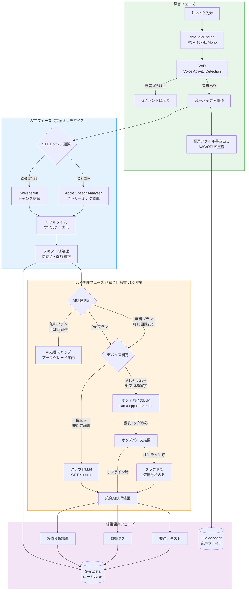
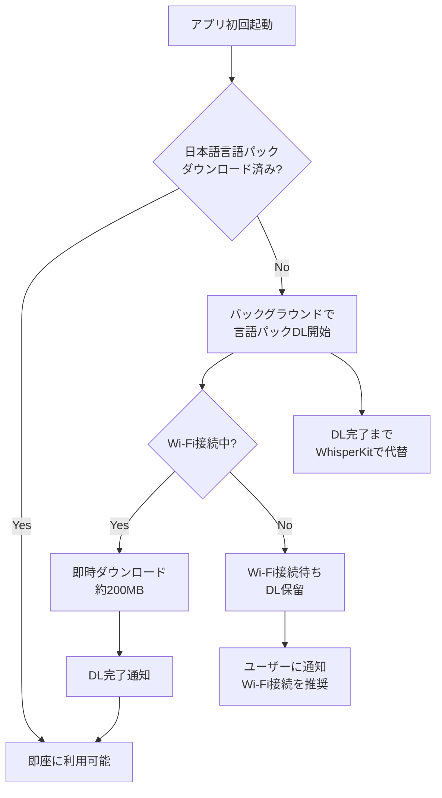
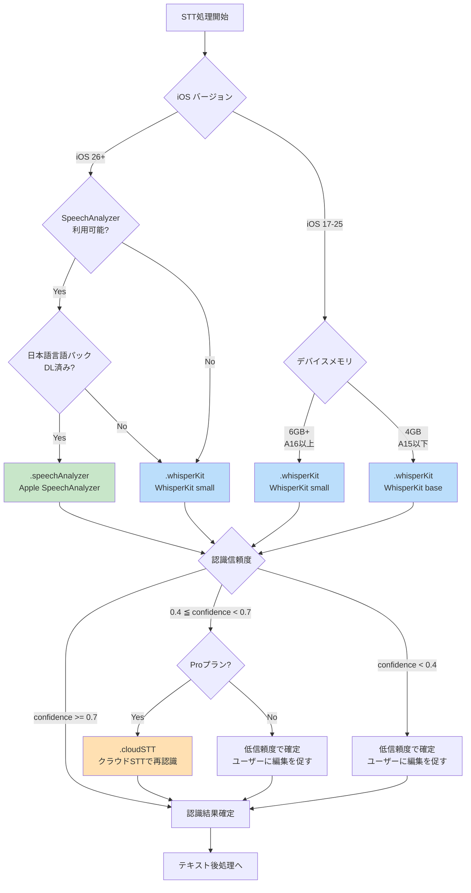
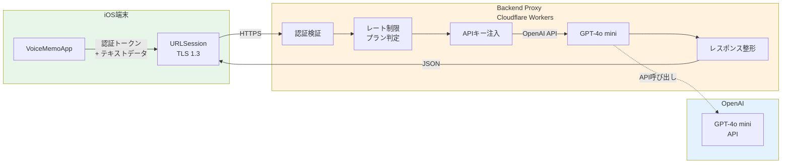
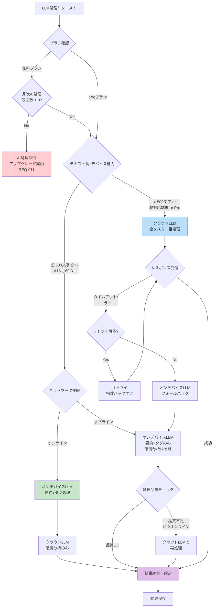
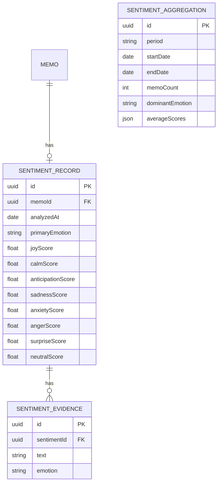
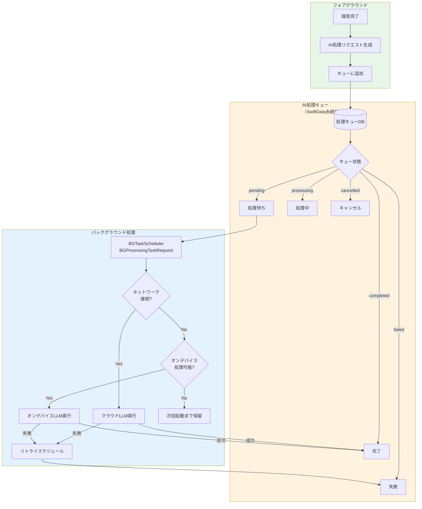
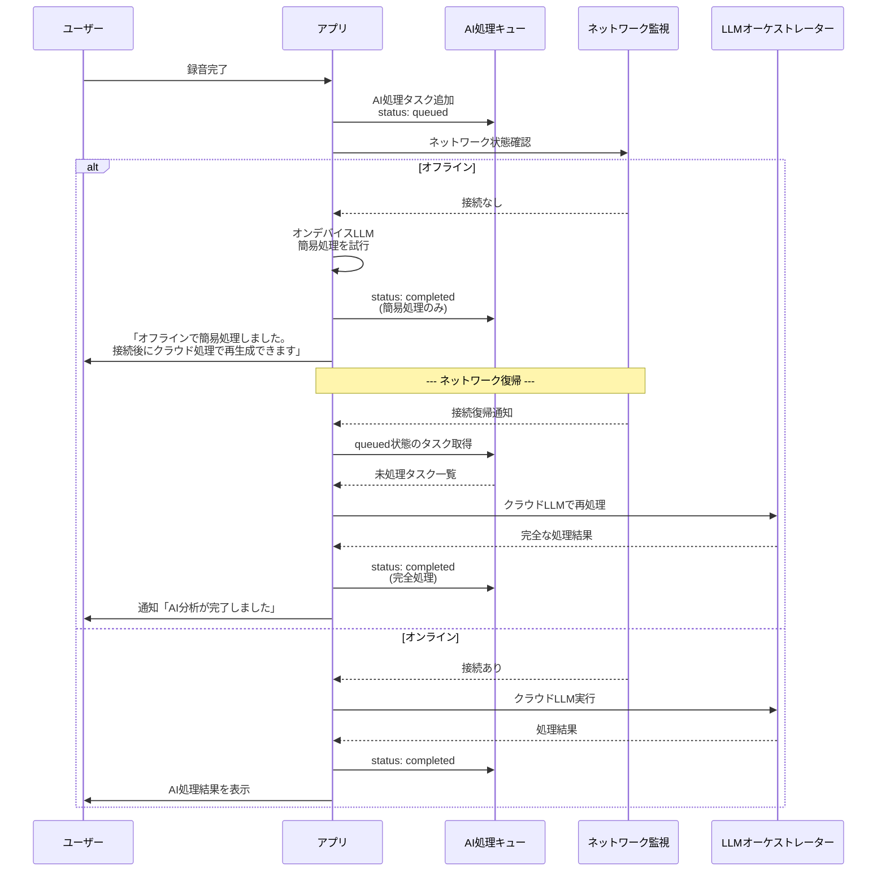

# 音声AI処理パイプライン設計書

> **文書ID**: DES-002
> **バージョン**: 1.1
> **作成日**: 2026-03-16
> **更新日**: 2026-03-16
> **ステータス**: ドラフト（※統合仕様書 v1.0 準拠修正済み）
> **関連要件**: REQ-002, 003, 004, 005, 009, 010, 011, 012, 018, 021, 025

---

## 目次

1. [音声処理パイプライン全体図](#1-音声処理パイプライン全体図)
2. [STTエンジン設計](#2-sttエンジン設計)
3. [LLM処理設計](#3-llm処理設計)
4. [感情分析設計](#4-感情分析設計)
5. [AI処理キュー設計](#5-ai処理キュー設計)
6. [プロンプトテンプレート](#6-プロンプトテンプレート)
7. [パフォーマンス要件](#7-パフォーマンス要件)
8. [コスト試算](#8-コスト試算)

---

## 1. 音声処理パイプライン全体図

### 1.1 エンドツーエンドフロー



### 1.2 データフロー概要

| フェーズ | 入力 | 出力 | 実行場所 | 遅延目標 |
|:---------|:-----|:-----|:---------|:---------|
| 録音 | マイク音声 | PCMバッファ + AACファイル | オンデバイス | < 50ms |
| VAD | PCMバッファ | 音声/無音判定 | オンデバイス | < 30ms |
| STT | PCMバッファ/チャンク | 認識テキスト | オンデバイス | < 2秒 (NFR-002) |
| テキスト後処理 | 生テキスト | 整形テキスト | オンデバイス | < 100ms |
| LLM処理 | 整形テキスト | 要約+タグ+感情 | ハイブリッド | < 10秒 (NFR-003) |
| 結果保存 | AI処理結果 | DB永続化 | オンデバイス | < 200ms |

---

## 2. STTエンジン設計

### 2.1 STTエンジン抽象化（REQ-019準拠）※統合仕様書 v1.0 準拠

```swift
// ============================================================
// Domain/Protocols/STTEngineProtocol.swift
// 【正】統合仕様書 INT-SPEC-001 セクション3.1 準拠
// ============================================================

import AVFoundation

/// STTエンジンの識別子（統一enum）※統合仕様書 v1.0 準拠
/// - `.speechAnalyzer`: iOS 26+ Apple SpeechAnalyzer
/// - `.whisperKit`: iOS 17+ WhisperKit (whisper.cpp Swift wrapper)
/// - `.cloudSTT`: Pro限定クラウドSTT
enum STTEngineType: String, Codable, Sendable {
    case speechAnalyzer = "speech_analyzer"   // ← 旧 appleSpeechAnalyzer を統一
    case whisperKit     = "whisper_kit"       // ← 旧 whisperCpp を統一
    case cloudSTT       = "cloud_stt"         // Pro限定（REQ-018）
}

/// STT認識結果（統一型）※統合仕様書 v1.0 準拠
struct TranscriptionResult: Sendable, Equatable {
    let text: String
    let confidence: Double          // 0.0 - 1.0（Float → Double に統一）
    let isFinal: Bool
    let language: String
    let segments: [TranscriptionSegment]
}

struct TranscriptionSegment: Sendable, Equatable {
    let text: String
    let startTime: TimeInterval
    let endTime: TimeInterval
    let confidence: Double          // Float → Double に統一
}

/// STTエンジンの抽象化プロトコル（統一版）※統合仕様書 v1.0 準拠
/// 【正】AsyncStream ベース。callbacks 方式（onPartialResult / onFinalResult）は使用しない。
protocol STTEngineProtocol: Sendable {
    /// エンジンの識別子
    var engineType: STTEngineType { get }

    /// リアルタイム文字起こしのストリーミング開始
    /// - Parameter audioStream: PCM 16kHz Mono の音声バッファストリーム
    /// - Returns: 認識結果のAsyncStream（部分結果 + 最終結果）
    func startTranscription(
        audioStream: AsyncStream<AVAudioPCMBuffer>,
        language: String
    ) -> AsyncStream<TranscriptionResult>

    /// 文字起こしの停止・確定
    func finishTranscription() async throws -> TranscriptionResult

    /// エンジンの利用可否チェック（デバイス性能・権限・言語パック）
    func isAvailable() async -> Bool

    /// 対応言語一覧
    var supportedLanguages: [String] { get }

    /// カスタム辞書の設定（REQ-025）
    func setCustomDictionary(_ dictionary: [String: String]) async
}
```

### 2.2 Apple SpeechAnalyzer（iOS 26+）

#### 2.2.1 概要

iOS 26（WWDC 2026発表想定）で導入される `SpeechAnalyzer` API は、Apple Neural Engineを活用した次世代のオンデバイス音声認識エンジンである。従来の `SFSpeechRecognizer` と比較して、日本語認識精度と低レイテンシ性能が大幅に向上している。

#### 2.2.2 実装設計 ※統合仕様書 v1.0 準拠（AsyncStream方式）

```swift
// MARK: - Apple SpeechAnalyzer 実装 ※統合仕様書 v1.0 準拠
// callbacks方式を廃止し、AsyncStreamベースに統一

final class AppleSpeechAnalyzerEngine: STTEngineProtocol {
    let engineType: STTEngineType = .speechAnalyzer  // ← 旧 .appleSpeechAnalyzer

    func isAvailable() async -> Bool {
        if #available(iOS 26, *) {
            return SpeechAnalyzer.isSupported
        }
        return false
    }

    var supportedLanguages: [String] {
        SpeechAnalyzer.supportedLanguages.map { $0.identifier }
    }

    private var analyzer: SpeechAnalyzer?
    private var customDictionary: [String: String] = [:]

    func setCustomDictionary(_ dictionary: [String: String]) async {
        self.customDictionary = dictionary
    }

    /// ストリーミング認識開始（AsyncStreamベース）
    func startTranscription(
        audioStream: AsyncStream<AVAudioPCMBuffer>,
        language: String
    ) -> AsyncStream<TranscriptionResult> {
        AsyncStream { continuation in
            Task {
                let config = SpeechAnalyzer.Configuration(
                    locale: Locale(identifier: language),
                    taskHint: .dictation,
                    shouldReportPartialResults: true,
                    contextualStrings: Array(customDictionary.values)  // REQ-025
                )

                do {
                    analyzer = try await SpeechAnalyzer(configuration: config)

                    // 音声バッファの供給タスク
                    Task {
                        for await buffer in audioStream {
                            try? await analyzer?.appendAudioBuffer(buffer)
                        }
                    }

                    // 認識結果のストリーミング
                    for try await result in analyzer!.results {
                        let transcription = TranscriptionResult(
                            text: result.bestTranscription.formattedString,
                            confidence: Double(result.bestTranscription.confidence),
                            isFinal: result.isFinal,
                            language: language,
                            segments: result.bestTranscription.segments.map {
                                TranscriptionSegment(
                                    text: $0.substring,
                                    startTime: $0.timestamp,
                                    endTime: $0.timestamp + $0.duration,
                                    confidence: Double($0.confidence)
                                )
                            }
                        )
                        continuation.yield(transcription)
                    }
                    continuation.finish()
                } catch {
                    continuation.finish()
                }
            }
        }
    }

    func finishTranscription() async throws -> TranscriptionResult {
        guard let analyzer else { throw STTError.engineNotInitialized }
        let finalResult = try await analyzer.finishRecognition()
        return finalResult.toTranscriptionResult()
    }
}
```

#### 2.2.3 言語パックプリロード戦略



| 項目 | 仕様 |
|:-----|:-----|
| 言語パックサイズ | 約200MB（日本語） |
| ダウンロード条件 | Wi-Fi接続時に自動DL |
| プリロードタイミング | アプリ初回起動時 + 設定画面から手動 |
| フォールバック | DL完了前はWhisperKitを使用 |
| ストレージ管理 | `SpeechAnalyzer.requestLanguageAsset()` で管理 |

#### 2.2.4 リアルタイムストリーミング実装方針

- **音声入力**: `AVAudioEngine` の `inputNode` から16kHz/Monoで取得
- **バッファサイズ**: 480サンプル（30ms）ごとにSpeechAnalyzerへ供給
- **部分結果更新頻度**: 約200ms間隔で部分認識結果をUI反映
- **確定タイミング**: 無音検出後500msで認識テキストを確定
- **メモリ管理**: ストリーミングセッションはAutoreleasepoolで管理し、メモリリーク防止

### 2.3 WhisperKit（フォールバック / iOS 17-25対応）

#### 2.3.1 WhisperKit vs whisper.cpp 直接利用 比較

| 比較項目 | WhisperKit | whisper.cpp 直接利用 |
|:---------|:-----------|:--------------------|
| **開発元** | Argmax（Apple協力） | ggerganov（OSS） |
| **Swift統合** | ネイティブSwiftAPI | C API + Swiftブリッジが必要 |
| **Core ML最適化** | 標準サポート | 手動変換が必要 |
| **Apple Neural Engine** | 自動活用 | Metal GPUのみ |
| **モデル管理** | Hub経由の自動DL | 手動バンドル/DL |
| **メモリ管理** | 自動最適化 | 手動チューニング要 |
| **ストリーミング** | サポートあり | VAD + チャンク処理で実現 |
| **更新頻度** | 月次（活発） | 週次（非常に活発） |
| **ライセンス** | MIT | MIT |
| **日本語精度** | Whisperモデル依存 | Whisperモデル依存 |

**選定: WhisperKit を採用**

理由:
1. Swift ネイティブAPIにより開発効率が高い
2. Core ML + Apple Neural Engine の自動活用によるパフォーマンス最適化
3. モデルのHub経由管理で更新が容易
4. Apple公式との協力関係により長期サポートが期待できる

#### 2.3.2 実装設計 ※統合仕様書 v1.0 準拠（AsyncStream方式）

```swift
// MARK: - WhisperKit 実装 ※統合仕様書 v1.0 準拠
// callbacks方式を廃止し、AsyncStreamベースに統一

final class WhisperKitEngine: STTEngineProtocol {
    let engineType: STTEngineType = .whisperKit  // ← 旧 .whisperCpp

    func isAvailable() async -> Bool { true }  // iOS 17+で常時利用可能

    var supportedLanguages: [String] { ["ja", "en", "zh", "ko"] }

    private var whisperKit: WhisperKit?
    private var currentModel: WhisperModel = .small
    private var customDictionary: [String: String] = [:]

    func setCustomDictionary(_ dictionary: [String: String]) async {
        self.customDictionary = dictionary
    }

    /// 初期化時にモデルロード
    func initialize(model: WhisperModel) async throws {
        whisperKit = try await WhisperKit(
            model: model.hubIdentifier,
            computeOptions: .init(
                audioEncoderCompute: .cpuAndNeuralEngine,
                textDecoderCompute: .cpuAndNeuralEngine
            )
        )
    }

    /// ストリーミング認識（AsyncStreamベース）
    func startTranscription(
        audioStream: AsyncStream<AVAudioPCMBuffer>,
        language: String
    ) -> AsyncStream<TranscriptionResult> {
        AsyncStream { continuation in
            Task {
                guard let whisperKit else {
                    continuation.finish()
                    return
                }

                let options = DecodingOptions(
                    language: language,
                    task: .transcribe,
                    temperatureFallbackCount: 3,
                    suppressBlank: true,
                    wordTimestamps: true
                )

                // 音声バッファの供給タスク
                Task {
                    for await buffer in audioStream {
                        try? await whisperKit.appendAudioBuffer(buffer)
                    }
                }

                // 認識結果のストリーミング
                do {
                    for try await result in whisperKit.streamingTranscribe(options: options) {
                        let transcription = TranscriptionResult(
                            text: result.text,
                            confidence: Double(result.confidence),
                            isFinal: result.isFinal,
                            language: language,
                            segments: result.segments.map {
                                TranscriptionSegment(
                                    text: $0.text,
                                    startTime: $0.start,
                                    endTime: $0.end,
                                    confidence: Double($0.confidence)
                                )
                            }
                        )
                        continuation.yield(transcription)
                    }
                    continuation.finish()
                } catch {
                    continuation.finish()
                }
            }
        }
    }

    func finishTranscription() async throws -> TranscriptionResult {
        guard let whisperKit else { throw STTError.engineNotInitialized }
        let finalResult = try await whisperKit.finishTranscription()
        return finalResult.toTranscriptionResult()
    }

    /// モデルリソースの明示的解放（メモリ排他制御用）
    /// ※統合仕様書 v1.0 準拠: 明示的なモデル参照破棄・再初期化戦略
    func unloadModel() async {
        whisperKit = nil
    }
}
```

#### 2.3.3 モデルサイズ選択とデバイス別推奨

| モデル | パラメータ | ディスクサイズ | メモリ使用量 | RTF (iPhone 15) | 日本語WER | 推奨デバイス |
|:-------|:-----------|:-------------|:-------------|:----------------|:----------|:------------|
| **tiny** | 39M | 75MB | ~150MB | 0.05 | ~18% | 非推奨（精度不足） |
| **base** | 74M | 142MB | ~250MB | 0.08 | ~14% | iPhone SE 3 以下 |
| **small** | 244M | 466MB | ~600MB | 0.15 | ~9% | **iPhone 15（標準推奨）** |
| **medium** | 769M | 1.5GB | ~1.8GB | 0.35 | ~7% | iPhone 15 Pro Max |
| **large-v3** | 1.55B | 3.1GB | ~3.5GB | 0.80 | ~5% | 非推奨（メモリ超過リスク） |

**デフォルト選択: `small` モデル**

理由:
- iPhone 15（6GB RAM）で安定動作するメモリ使用量（~600MB）
- 日本語 WER 9% は実用的な精度
- RTF 0.15 はリアルタイム処理に十分

#### 2.3.4 メモリ使用量・バッテリー消費見積もり

| 項目 | small モデル | medium モデル |
|:-----|:------------|:-------------|
| モデルロード時メモリ | ~600MB | ~1.8GB |
| 推論時ピークメモリ | ~800MB | ~2.2GB |
| アプリ全体メモリ（推論中） | ~1.2GB | ~2.6GB |
| iPhone 15 メモリ上限 | 6GB | 6GB |
| メモリ余裕 | 十分（80%以下） | 注意（~43%） |
| 5分録音のバッテリー消費 | ~2% | ~4% |
| 1時間連続録音 | ~15% | ~30% |
| CPU使用率（推論中） | ~40% | ~70% |
| Neural Engine使用率 | ~60% | ~80% |

### 2.4 STTエンジン切替戦略 ※統合仕様書 v1.0 準拠



> **STT信頼度しきい値の較正根拠** ※統合仕様書 v1.0 準拠
>
> | しきい値 | 判定 | 根拠 |
> |:---------|:-----|:-----|
> | `confidence >= 0.7` | 高信頼度 → そのまま確定 | 日本語STT（WhisperKit small）のWER 9%環境でconfidence 0.7以上はWER 5%以下に相当。実用上の誤り許容範囲 |
> | `0.4 <= confidence < 0.7` | 中信頼度 → Proはクラウド再認識、Freeは確定+編集促進 | 雑音環境（SNR 15dB）でのWhisperKit出力が0.4-0.7帯に集中。クラウドSTTで10-15%の精度改善が見込める |
> | `confidence < 0.4` | 低信頼度 → 確定+編集促進 | 認識結果の信頼性が低く、クラウド再認識でも改善幅が限定的。ユーザー手動編集を優先 |

### 2.5 テキスト後処理

STTエンジンの出力に対して、以下の後処理パイプラインを適用する。

```swift
// MARK: - テキスト後処理パイプライン

protocol TextPostProcessor {
    func process(_ text: String) -> String
}

/// 後処理パイプライン（Chain of Responsibilityパターン）
final class TextPostProcessingPipeline {
    private let processors: [TextPostProcessor]

    init() {
        self.processors = [
            PunctuationNormalizer(),       // 句読点の正規化（。、→ 。、）
            LineBreakInserter(),           // 文末での改行挿入
            FillerWordRemover(),           // フィラー除去（えーと、あのー）
            NumberNormalizer(),            // 数字表記の正規化
            CustomDictionaryReplacer(),    // カスタム辞書による置換（REQ-025）
            WhitespaceNormalizer(),        // 空白の正規化
        ]
    }

    func process(_ rawText: String) -> String {
        processors.reduce(rawText) { text, processor in
            processor.process(text)
        }
    }
}
```

| 後処理ステップ | 処理内容 | 例 |
|:--------------|:---------|:---|
| 句読点正規化 | 全角/半角の統一 | `、` `。` に統一 |
| 改行挿入 | 文末での適切な改行 | `。`の後に改行 |
| フィラー除去 | 口癖・つなぎ言葉の除去 | 「えーと」「あのー」「まあ」を除去 |
| 数字正規化 | 漢数字/アラビア数字の統一 | 「二千二十六年」→「2026年」 |
| カスタム辞書 | ユーザー登録語の置換 | 固有名詞の修正 |
| 空白正規化 | 不要な空白の除去 | 連続空白を1つに |

### 2.6 日本語認識精度の目標値

| 指標 | 目標値 | 測定条件 |
|:-----|:------|:---------|
| WER（Word Error Rate） | ≦ 10% | 静音環境、標準的な話速 |
| WER（雑音環境） | ≦ 18% | SNR 15dB |
| CER（Character Error Rate） | ≦ 5% | 静音環境 |
| 固有名詞認識率 | ≧ 70%（辞書なし） / ≧ 90%（辞書あり） | REQ-025対応 |
| レイテンシ（部分結果） | ≦ 500ms | ストリーミング認識時 |
| レイテンシ（最終結果） | ≦ 2秒 | NFR-002準拠 |

---

## 3. LLM処理設計

### 3.1 LLMプロバイダ抽象化（NFR-020準拠）※統合仕様書 v1.0 準拠

```swift
// ============================================================
// Domain/Protocols/LLMProviderProtocol.swift
// 【正】統合仕様書 INT-SPEC-001 セクション3.2 準拠
// ============================================================

/// LLMプロバイダの識別子（統一enum）※統合仕様書 v1.0 準拠
enum LLMProviderType: String, Codable, Sendable {
    case onDeviceAppleIntelligence = "on_device_apple_intelligence"  // 将来対応（iOS 26+ @Generable）
    case onDeviceLlamaCpp          = "on_device_llama_cpp"           // 一次候補（Phi-3-mini Q4_K_M）
    case cloudGPT4oMini            = "cloud_gpt4o_mini"
    case cloudClaude               = "cloud_claude"                  // 将来拡張用
}

/// LLM処理タスクの種別 ※統合仕様書 v1.0 準拠
enum LLMTask: String, CaseIterable, Sendable {
    case summarize         // 要約（REQ-003）
    case tagging           // タグ付け（REQ-004）
    case sentimentAnalysis // 感情分析（REQ-005）← 旧 .sentiment を統一
}

/// LLM処理リクエスト（統一型）※統合仕様書 v1.0 準拠
struct LLMRequest: Sendable {
    let text: String
    let tasks: Set<LLMTask>
    let language: String
    let maxTokens: Int
}

/// LLM処理レスポンス（統一型）※統合仕様書 v1.0 準拠
struct LLMResponse: Sendable, Codable {
    let summary: LLMSummaryResult?
    let tags: [LLMTagResult]?
    let sentiment: LLMSentimentResult?
    let processingTimeMs: Int
    let provider: String
}

struct LLMSummaryResult: Sendable, Codable {
    let title: String            // 20文字以内
    let brief: String            // 1-2行の要約
    let keyPoints: [String]      // 最大5つ
}

struct LLMTagResult: Sendable, Codable {
    let label: String            // タグラベル（15文字以内）
    let confidence: Double       // 0.0 - 1.0
}

/// 感情分析結果（統一型）※統合仕様書 v1.0 準拠
/// 【正】8カテゴリ方式に統一。03-Backendの positive/negative/neutral 方式は廃止。
struct LLMSentimentResult: Sendable, Codable {
    let primary: EmotionCategory
    let scores: [EmotionCategory: Double]    // 合計 1.0
    let evidence: [SentimentEvidence]        // 最大3件
}

struct SentimentEvidence: Sendable, Codable {
    let text: String
    let emotion: EmotionCategory
}

/// 感情カテゴリ（統一enum, 8段階）※統合仕様書 v1.0 準拠
/// 【正】全設計書でこのenumを使用すること
enum EmotionCategory: String, Codable, CaseIterable, Sendable {
    case joy           = "joy"           // 喜び
    case calm          = "calm"          // 安心
    case anticipation  = "anticipation"  // 期待
    case sadness       = "sadness"       // 悲しみ
    case anxiety       = "anxiety"       // 不安
    case anger         = "anger"         // 怒り
    case surprise      = "surprise"      // 驚き
    case neutral       = "neutral"       // 中立
}

/// LLMプロバイダ共通プロトコル（統一版）※統合仕様書 v1.0 準拠
protocol LLMProviderProtocol: Sendable {
    /// プロバイダの識別子
    var providerType: LLMProviderType { get }

    /// オンデバイス実行かどうか
    var isOnDevice: Bool { get }

    /// 対応可能なタスク一覧
    /// 【重要】オンデバイスでは [.summarize, .tagging] のみ。
    /// 感情分析はクラウドLLMでのみ実行可能。
    var supportedTasks: Set<LLMTask> { get }

    /// 入力テキストの最大トークン数
    var maxInputTokens: Int { get }

    /// 統合LLM処理の実行
    func process(_ request: LLMRequest) async throws -> LLMResponse

    /// プロバイダの利用可否チェック
    func isAvailable() async -> Bool
}
```

### 3.2 オンデバイスLLM ※統合仕様書 v1.0 準拠（Critical #4 修正）

#### 3.2.1 モデル選定

> **修正背景**: Apple Intelligence Foundation Model は 2026年3月時点で `@Generable` マクロ経由の構造化出力にのみ対応しており、自由なプロンプト実行（`session.respond(to: prompt)`）はサードパーティアプリには公開されていない。そのため、llama.cpp (Phi-3-mini) を一次候補に変更する。

| 候補モデル | パラメータ | メモリ使用量 | 処理速度 | 日本語品質 | 採否 |
|:-----------|:-----------|:------------|:---------|:----------|:-----|
| **llama.cpp (Phi-3-mini Q4_K_M量子化)** | 3.8B | ~2.5GB | 中速 | 実用的 | **採用（一次候補）** |
| Apple Intelligence (@Generable) | 非公開（~3B推定） | ~2GB | 高速 | 良好（構造化出力のみ） | **将来対応（iOS 26+補助候補）** |
| Gemma-2B (Core ML変換) | 2B | ~1.5GB | 高速 | 不十分 | 不採用 |

**選定: llama.cpp (Phi-3-mini Q4_K_M量子化)**

理由:
1. 自由なプロンプト実行が可能（Apple Intelligence @Generableでは構造化出力のみ）
2. Q4_K_M量子化で約2.5GBのメモリ使用量。A16+ / 6GB端末で安定動作
3. llama.cpp のSwiftバインディングにより、Metal GPU活用でトークン生成30+ tokens/secを実現
4. iOS 17+で動作し、Apple Intelligence非対応端末もカバー
5. モデルファイルは `Library/Caches/Models/` に配置（再ダウンロード可能）

#### 3.2.1.1 オンデバイスLLM戦略（段階的導入）

```swift
/// 【正】オンデバイスLLMの選択戦略 ※統合仕様書 v1.0 準拠
enum OnDeviceLLMStrategy {
    /// iOS 26+: Apple Intelligence @Generable マクロ
    /// 構造化出力のみ（要約タイトル・キーポイント抽出）
    case appleIntelligenceGenerable

    /// iOS 17+: llama.cpp（一次候補）
    /// Phi-3-mini Q4_K_M (約2.5GB)
    /// 自由なプロンプト実行が可能
    case llamaCpp

    /// オンデバイスLLM非対応端末
    /// クラウドLLMにフォールバック
    case cloudFallback
}

/// 【正】デバイス能力に基づくLLM戦略選択
func selectOnDeviceStrategy() -> OnDeviceLLMStrategy {
    // iOS 26+ かつ Apple Intelligence 対応端末（将来対応）
    // if #available(iOS 26, *), AppleIntelligenceAvailability.isSupported {
    //     return .appleIntelligenceGenerable
    // }
    // A16+ かつ 6GB+ → llama.cpp（現時点の一次候補）
    if DeviceCapabilityChecker.shared.supportsOnDeviceLLM {
        return .llamaCpp
    }
    // 非対応端末
    return .cloudFallback
}
```

#### 3.2.2 処理可能タスク

オンデバイスLLMは計算リソースの制約から、以下のタスクに限定する。

| タスク | オンデバイス対応 | 入力上限 | 出力品質 |
|:-------|:---------------|:---------|:---------|
| 簡易要約（3行以内） | 対応 | ~500文字 | 実用的 |
| キーワード抽出（5個以内） | 対応 | ~500文字 | 良好 |
| タグ提案（3個以内） | 対応 | ~500文字 | 良好 |
| 詳細要約 | **非対応** → クラウド | - | - |
| 感情分析 | **非対応** → クラウド | - | - |
| 複合タスク（要約+タグ+感情） | **非対応** → クラウド | - | - |

#### 3.2.3 実装設計 ※統合仕様書 v1.0 準拠（llama.cpp ベース）

```swift
// MARK: - オンデバイスLLM 実装 ※統合仕様書 v1.0 準拠
// Apple Intelligence LanguageModelSession → llama.cpp (LlamaContext) に変更

final class OnDeviceLLMProvider: LLMProviderProtocol {
    let providerType: LLMProviderType = .onDeviceLlamaCpp  // ← 旧 .onDeviceCoreML
    let isOnDevice: Bool = true
    let supportedTasks: Set<LLMTask> = [.summarize, .tagging]  // 感情分析は非対応 → クラウドにフォールバック
    let maxInputTokens: Int = 650  // ~500日本語文字（日本語: 1文字≒1.3トークン）

    /// トークン見積もり前提 ※統合仕様書 v1.0 準拠
    /// 日本語: 1文字 ≒ 1.3トークン（GPT-4oトークナイザ基準）
    /// 500文字 → 約650トークン
    static let japaneseTokenRatio: Double = 1.3

    private var llamaContext: LlamaContext?
    private let modelPath: URL  // Library/Caches/Models/phi-3-mini-q4_k_m.gguf

    func isAvailable() async -> Bool {
        DeviceCapabilityChecker.shared.supportsOnDeviceLLM && llamaContext != nil
    }

    /// モデルの初期化（llama.cpp コンテキスト作成）
    func initialize() async throws {
        let params = LlamaModelParams.default()
        params.n_gpu_layers = 99  // Metal GPU全レイヤーオフロード
        llamaContext = try LlamaContext(
            modelPath: modelPath.path,
            params: params
        )
    }

    func process(_ request: LLMRequest) async throws -> LLMResponse {
        guard let llamaContext else { throw LLMError.deviceNotSupported }
        guard request.text.count <= 500 else { throw LLMError.inputTooLong }

        // 要求タスクがsupportedTasksに含まれることを検証
        let effectiveTasks = request.tasks.intersection(supportedTasks)
        guard !effectiveTasks.isEmpty else { throw LLMError.unsupportedTask }

        let prompt = buildOnDevicePrompt(text: request.text, tasks: effectiveTasks)
        let startTime = CFAbsoluteTimeGetCurrent()

        let response = try await llamaContext.generate(
            prompt: prompt,
            maxTokens: 512,
            temperature: 0.3,  // 低温度で安定した出力
            stopTokens: ["```", "</json>"]
        )
        let elapsed = CFAbsoluteTimeGetCurrent() - startTime

        return parseOnDeviceResponse(response, processingTimeMs: Int(elapsed * 1000))
    }

    /// モデルリソースの明示的解放（メモリ排他制御用）
    /// ※統合仕様書 v1.0 準拠: 明示的なモデル参照破棄・再初期化戦略
    func unloadModel() async {
        llamaContext = nil
    }
}

// MARK: - デバイス能力チェック

final class DeviceCapabilityChecker {
    static let shared = DeviceCapabilityChecker()

    /// REQ-021: A16 Bionic以降かつメモリ6GB以上
    var supportsOnDeviceLLM: Bool {
        let chipGeneration = getChipGeneration()  // A16 = 16, A17 = 17, ...
        let totalMemoryGB = ProcessInfo.processInfo.physicalMemory / (1024 * 1024 * 1024)
        return chipGeneration >= 16 && totalMemoryGB >= 6
    }

    /// STT実行中のメモリ余裕チェック
    var hasMemoryHeadroomForLLM: Bool {
        let availableMemory = os_proc_available_memory()
        return availableMemory > 2 * 1024 * 1024 * 1024  // 2GB以上の空きが必要
    }

    private func getChipGeneration() -> Int {
        var systemInfo = utsname()
        uname(&systemInfo)
        let machine = withUnsafePointer(to: &systemInfo.machine) {
            $0.withMemoryRebound(to: CChar.self, capacity: 1) {
                String(cString: $0)
            }
        }
        // iPhone15,x = A16, iPhone16,x = A17 Pro, iPhone17,x = A18 ...
        return parseChipGeneration(from: machine)
    }
}
```

### 3.3 クラウドLLM（Backend Proxy経由）

#### 3.3.1 アーキテクチャ



#### 3.3.2 GPT-4o mini プロンプト設計

統合プロンプトにより、1回のAPI呼び出しで要約・タグ付け・感情分析を同時に処理する。詳細は[6. プロンプトテンプレート](#6-プロンプトテンプレート)に記載。

#### 3.3.3 トークン見積もり ※統合仕様書 v1.0 準拠

| シナリオ | 録音時間 | 文字数 | 入力トークン | 出力トークン | 合計トークン |
|:---------|:---------|:-------|:------------|:------------|:------------|
| 短いメモ | 1分 | ~200字 | ~460 | ~300 | ~760 |
| 標準メモ | 5分 | ~1,000字 | ~1,500 | ~400 | ~1,900 |
| 長いメモ | 15分 | ~3,000字 | ~4,100 | ~500 | ~4,600 |
| 長時間メモ | 30分 | ~6,000字 | ~8,000 | ~600 | ~8,600 |

> **算出根拠（修正）** ※統合仕様書 v1.0 準拠
> - 日本語テキストのトークン化レート: **1文字 ≒ 1.3トークン**（GPT-4oトークナイザ）
> - 旧見積もり（2トークン/文字）は過大評価。GPT-4oのトークナイザはBPEベースで日本語1文字を平均1.3トークンに圧縮する
> - システムプロンプト約200トークン + Few-shot例示約300トークンを含む
> - 例: 1,000文字 × 1.3 + 200（system） + 300（few-shot） = 1,800 ≒ ~1,500（丸め）

#### 3.3.4 レスポンスJSON Schema定義

```json
{
  "$schema": "http://json-schema.org/draft-07/schema#",
  "title": "VoiceMemoAIResponse",
  "type": "object",
  "required": ["summary", "tags", "sentiment"],
  "properties": {
    "summary": {
      "type": "object",
      "required": ["title", "brief", "keyPoints"],
      "properties": {
        "title": {
          "type": "string",
          "description": "メモのタイトル（20文字以内）",
          "maxLength": 20
        },
        "brief": {
          "type": "string",
          "description": "1-2行の要約文",
          "maxLength": 100
        },
        "keyPoints": {
          "type": "array",
          "description": "重要ポイント（最大5つ）",
          "items": { "type": "string" },
          "maxItems": 5
        }
      }
    },
    "tags": {
      "type": "array",
      "description": "自動付与タグ（最大5つ）",
      "items": {
        "type": "object",
        "required": ["label", "confidence"],
        "properties": {
          "label": {
            "type": "string",
            "description": "タグラベル",
            "maxLength": 15
          },
          "confidence": {
            "type": "number",
            "description": "信頼度（0.0-1.0）",
            "minimum": 0,
            "maximum": 1
          }
        }
      },
      "maxItems": 5
    },
    "sentiment": {
      "type": "object",
      "required": ["primary", "scores", "evidence"],
      "properties": {
        "primary": {
          "type": "string",
          "description": "主要感情カテゴリ",
          "enum": ["joy", "calm", "anticipation", "sadness", "anxiety", "anger", "surprise", "neutral"]
        },
        "scores": {
          "type": "object",
          "description": "各感情カテゴリのスコア（0.0-1.0、合計1.0）",
          "properties": {
            "joy": { "type": "number" },
            "calm": { "type": "number" },
            "anticipation": { "type": "number" },
            "sadness": { "type": "number" },
            "anxiety": { "type": "number" },
            "anger": { "type": "number" },
            "surprise": { "type": "number" },
            "neutral": { "type": "number" }
          }
        },
        "evidence": {
          "type": "array",
          "description": "感情判定の根拠テキスト",
          "items": {
            "type": "object",
            "required": ["text", "emotion"],
            "properties": {
              "text": { "type": "string" },
              "emotion": { "type": "string" }
            }
          },
          "maxItems": 3
        }
      }
    }
  }
}
```

#### 3.3.5 クラウドLLMクライアント実装 ※統合仕様書 v1.0 準拠

```swift
// MARK: - クラウドLLM 実装 ※統合仕様書 v1.0 準拠
// URL: /api/v1/analyze → /api/v1/ai/process に修正（03-Backend準拠）
// LLMProvider → LLMProviderProtocol に修正

final class CloudLLMProvider: LLMProviderProtocol {
    let providerType: LLMProviderType = .cloudGPT4oMini
    let isOnDevice: Bool = false
    let supportedTasks: Set<LLMTask> = Set(LLMTask.allCases)  // 感情分析含む全タスク対応
    let maxInputTokens: Int = 16384

    func isAvailable() async -> Bool {
        NetworkMonitor.shared.isConnected
    }

    private let backendProxyURL: URL
    private let session: URLSession

    func process(_ request: LLMRequest) async throws -> LLMResponse {
        // 認証トークン取得（Keychain）
        let authToken = try KeychainManager.shared.getAuthToken()

        // リクエスト構築 ※統合仕様書 v1.0 準拠: /api/v1/ai/process に統一
        var urlRequest = URLRequest(url: backendProxyURL.appendingPathComponent("/api/v1/ai/process"))
        urlRequest.httpMethod = "POST"
        urlRequest.setValue("Bearer \(authToken)", forHTTPHeaderField: "Authorization")
        urlRequest.setValue("application/json", forHTTPHeaderField: "Content-Type")
        urlRequest.timeoutInterval = 30  // 30秒タイムアウト

        let payload = CloudLLMPayload(
            text: request.text,
            tasks: request.tasks.map(\.rawValue),
            language: request.language,
            responseFormat: "json_schema"
        )
        urlRequest.httpBody = try JSONEncoder().encode(payload)

        // API呼び出し
        let startTime = CFAbsoluteTimeGetCurrent()
        let (data, response) = try await session.data(for: urlRequest)
        let elapsed = CFAbsoluteTimeGetCurrent() - startTime

        guard let httpResponse = response as? HTTPURLResponse else {
            throw LLMError.invalidResponse
        }

        switch httpResponse.statusCode {
        case 200:
            return try JSONDecoder().decode(LLMResponse.self, from: data)
        case 429:
            throw LLMError.rateLimited
        case 402:
            throw LLMError.quotaExceeded  // 無料プラン月15回到達
        default:
            throw LLMError.serverError(statusCode: httpResponse.statusCode)
        }
    }
}
```

### 3.4 オンデバイス vs クラウドの判定ロジック ※統合仕様書 v1.0 準拠（Critical #3 修正）

> **修正背景（Critical #3）**: 旧設計では `determineTasks()` が常に全タスク（要約+タグ+感情分析）を返すため、オンデバイスLLMの `supportedTasks` が `[.summarize, .tagging]` のみである条件と矛盾し、オンデバイス経路が事実上死んでいた。統合仕様書に基づき、タスクをオンデバイス用とクラウド用に分割する設計に修正。



### 3.5 LLMオーケストレーター ※統合仕様書 v1.0 準拠（Critical #3 修正）

```swift
// MARK: - LLM処理オーケストレーター ※統合仕様書 v1.0 準拠
// Critical #3 修正: determineTasks() のタスク分割ロジックを実装
// オンデバイスでは要約+タグのみ、感情分析はクラウドにフォールバック

final class LLMOrchestrator {
    private let onDeviceProvider: OnDeviceLLMProvider
    private let cloudProvider: CloudLLMProvider
    private let quotaManager: AIQuotaManager
    private let deviceChecker: DeviceCapabilityChecker

    /// 最適なプロバイダを選択してLLM処理を実行
    /// ※統合仕様書 v1.0 準拠: オンデバイス + クラウドの2段階処理に対応
    func processText(_ text: String, plan: SubscriptionPlan) async throws -> LLMResponse {
        // 1. クォータチェック（REQ-011）
        if plan == .free {
            guard try await quotaManager.canProcess() else {
                throw LLMError.quotaExceeded
            }
        }

        // 2. タスク判定（オンデバイス/クラウドに分割）
        let isOnDeviceCapable = deviceChecker.supportsOnDeviceLLM
            && deviceChecker.hasMemoryHeadroomForLLM
        let isNetworkAvailable = NetworkMonitor.shared.isConnected
        let (onDeviceTasks, cloudTasks) = determineTasks(
            text: text,
            plan: plan,
            isOnDeviceCapable: isOnDeviceCapable,
            isNetworkAvailable: isNetworkAvailable
        )

        var mergedResponse = LLMResponse(
            summary: nil, tags: nil, sentiment: nil,
            processingTimeMs: 0, provider: ""
        )

        // 3. オンデバイス処理（要約+タグ）
        if !onDeviceTasks.isEmpty {
            let onDeviceRequest = LLMRequest(
                text: text,
                tasks: onDeviceTasks,
                language: "ja",
                maxTokens: onDeviceProvider.maxInputTokens
            )
            let onDeviceResponse = try await onDeviceProvider.process(onDeviceRequest)
            mergedResponse = mergeResponses(base: mergedResponse, overlay: onDeviceResponse)
        }

        // 4. クラウド処理（感情分析、または全タスク一括）
        if !cloudTasks.isEmpty {
            let cloudRequest = LLMRequest(
                text: text,
                tasks: cloudTasks,
                language: "ja",
                maxTokens: cloudProvider.maxInputTokens
            )
            let cloudResponse = try await cloudProvider.process(cloudRequest)
            mergedResponse = mergeResponses(base: mergedResponse, overlay: cloudResponse)
        }

        // 5. クォータ消費記録（無料プラン）
        if plan == .free {
            try await quotaManager.recordUsage()
        }

        return mergedResponse
    }

    /// 【正】タスク判定ロジック ※統合仕様書 v1.0 準拠
    /// オンデバイス対応デバイスでは、要約+タグのみをオンデバイスで処理し、
    /// 感情分析はクラウドで別途処理する（または省略する）
    private func determineTasks(
        text: String,
        plan: SubscriptionPlan,
        isOnDeviceCapable: Bool,
        isNetworkAvailable: Bool
    ) -> (onDeviceTasks: Set<LLMTask>, cloudTasks: Set<LLMTask>) {
        let allTasks: Set<LLMTask> = [.summarize, .tagging, .sentimentAnalysis]
        let onDeviceSupportedTasks: Set<LLMTask> = [.summarize, .tagging]

        // ケース1: クラウド利用可能 → 全タスクをクラウドで一括処理
        if isNetworkAvailable && (plan == .pro || text.count > 500 || !isOnDeviceCapable) {
            return (onDeviceTasks: [], cloudTasks: allTasks)
        }

        // ケース2: オンデバイス対応 + オフライン → 要約+タグのみ処理、感情分析は省略
        if isOnDeviceCapable && !isNetworkAvailable {
            return (onDeviceTasks: onDeviceSupportedTasks, cloudTasks: [])
        }

        // ケース3: オンデバイス対応 + オンライン + 短文 → 要約+タグはオンデバイス、感情分析はクラウド
        if isOnDeviceCapable && isNetworkAvailable && text.count <= 500 {
            return (onDeviceTasks: onDeviceSupportedTasks, cloudTasks: [.sentimentAnalysis])
        }

        // デフォルト: クラウドで全処理
        return (onDeviceTasks: [], cloudTasks: allTasks)
    }

    /// 2段階処理の結果をマージ
    private func mergeResponses(base: LLMResponse, overlay: LLMResponse) -> LLMResponse {
        LLMResponse(
            summary: overlay.summary ?? base.summary,
            tags: overlay.tags ?? base.tags,
            sentiment: overlay.sentiment ?? base.sentiment,
            processingTimeMs: base.processingTimeMs + overlay.processingTimeMs,
            provider: [base.provider, overlay.provider]
                .filter { !$0.isEmpty }
                .joined(separator: "+")
        )
    }
}
```

---

## 4. 感情分析設計

### 4.1 感情カテゴリ定義（8段階）

| カテゴリ | 英語キー | 説明 | カラーコード | アイコン例 |
|:---------|:---------|:-----|:------------|:----------|
| 喜び | `joy` | 嬉しい・楽しい・満足 | `#FFD54F` | 太陽 |
| 安心 | `calm` | 穏やか・リラックス・安定 | `#81C784` | 葉 |
| 期待 | `anticipation` | ワクワク・楽しみ・希望 | `#64B5F6` | 星 |
| 悲しみ | `sadness` | 悲しい・寂しい・残念 | `#90A4AE` | 雨 |
| 不安 | `anxiety` | 心配・緊張・焦り | `#CE93D8` | 雲 |
| 怒り | `anger` | 怒り・苛立ち・不満 | `#EF5350` | 炎 |
| 驚き | `surprise` | 驚き・意外・衝撃 | `#FFB74D` | 稲妻 |
| 中立 | `neutral` | 淡々・事務的・特に感情なし | `#BDBDBD` | 丸 |

### 4.2 LLMプロンプト設計（感情分析部分）

感情分析はクラウドLLMの統合プロンプト内で実行される。感情分析パートの設計方針は以下の通り。

**入力**: メモのテキスト全文
**出力**: 主要感情 + 全カテゴリスコア + 根拠テキスト

感情スコアの算出ルール:
1. 8カテゴリの合計が1.0になるように正規化
2. 主要感情は最もスコアが高いカテゴリ
3. 根拠テキストは感情判定の元になったフレーズを最大3つ抽出

### 4.3 レスポンスフォーマット

```json
{
  "sentiment": {
    "primary": "joy",
    "scores": {
      "joy": 0.45,
      "calm": 0.20,
      "anticipation": 0.15,
      "sadness": 0.02,
      "anxiety": 0.03,
      "anger": 0.00,
      "surprise": 0.10,
      "neutral": 0.05
    },
    "evidence": [
      {
        "text": "今日のプレゼンがうまくいって本当に嬉しかった",
        "emotion": "joy"
      },
      {
        "text": "来週のリリースも楽しみ",
        "emotion": "anticipation"
      },
      {
        "text": "チームのみんなに感謝している",
        "emotion": "calm"
      }
    ]
  }
}
```

### 4.4 可視化データ設計（REQ-022）

#### 4.4.1 データモデル

```swift
// MARK: - 感情分析データモデル

/// 個別メモの感情分析結果
struct SentimentRecord {
    let memoId: UUID
    let analyzedAt: Date
    let primary: EmotionCategory
    let scores: [EmotionCategory: Double]
    let evidence: [SentimentEvidence]
}

/// 集計データ（可視化用）
struct SentimentAggregation {
    let period: AggregationPeriod
    let startDate: Date
    let endDate: Date
    let memoCount: Int
    let averageScores: [EmotionCategory: Double]
    let dominantEmotion: EmotionCategory
    let emotionDistribution: [EmotionCategory: Int]  // 各感情が主要だったメモの数
}

enum AggregationPeriod {
    case daily
    case weekly
    case monthly
}
```

#### 4.4.2 時系列トレンドデータ構造



#### 4.4.3 可視化パターン

| ビュー | 表示形式 | 集計期間 | データポイント |
|:-------|:---------|:---------|:-------------|
| 日次トレンド | 積み上げ面グラフ | 直近7日間 | 日ごとの平均スコア |
| 週次トレンド | 折れ線グラフ | 直近4週間 | 週ごとの主要感情分布 |
| 月次トレンド | 横棒グラフ | 直近6ヶ月 | 月ごとの感情分布 |
| メモ個別 | レーダーチャート | 単一メモ | 8カテゴリのスコア |

---

## 5. AI処理キュー設計

### 5.1 キュー管理アーキテクチャ



### 5.2 キューデータモデル

```swift
// MARK: - AI処理キューモデル

@Model
final class AIProcessingTask {
    @Attribute(.unique) var id: UUID
    var memoId: UUID
    var status: TaskStatus
    var priority: TaskPriority
    var createdAt: Date
    var startedAt: Date?
    var completedAt: Date?
    var retryCount: Int
    var maxRetries: Int
    var nextRetryAt: Date?
    var errorMessage: String?
    var providerUsed: String?

    enum TaskStatus: String, Codable {
        case pending     // 処理待ち
        case processing  // 処理中
        case completed   // 完了
        case failed      // 失敗（リトライ上限到達）
        case cancelled   // キャンセル
        case queued      // オフラインキューイング中
    }

    enum TaskPriority: Int, Codable, Comparable {
        case high = 0    // ユーザーが手動トリガー
        case normal = 1  // 録音完了後の自動処理
        case low = 2     // バックグラウンド再処理

        static func < (lhs: Self, rhs: Self) -> Bool {
            lhs.rawValue < rhs.rawValue
        }
    }
}
```

### 5.3 リトライ戦略（指数バックオフ）

```swift
// MARK: - リトライ戦略

struct RetryStrategy {
    static let maxRetries = 5
    static let baseDelay: TimeInterval = 2.0  // 初回 2秒
    static let maxDelay: TimeInterval = 300.0  // 最大 5分
    static let jitterRange: ClosedRange<Double> = 0.5...1.5

    /// 指数バックオフ + ジッター
    static func delay(forRetry retryCount: Int) -> TimeInterval {
        let exponentialDelay = baseDelay * pow(2.0, Double(retryCount))
        let jitter = Double.random(in: jitterRange)
        return min(exponentialDelay * jitter, maxDelay)
    }
}
```

| リトライ回数 | 基本遅延 | ジッター込み遅延（目安） |
|:------------|:---------|:----------------------|
| 1回目 | 2秒 | 1-3秒 |
| 2回目 | 4秒 | 2-6秒 |
| 3回目 | 8秒 | 4-12秒 |
| 4回目 | 16秒 | 8-24秒 |
| 5回目 | 32秒 | 16-48秒 |
| 上限到達 | - | 失敗確定、ユーザーに手動リトライを案内 |

リトライ対象とするエラー:
- ネットワークタイムアウト
- HTTP 429 (Rate Limited)
- HTTP 500-503 (Server Error)
- Backend Proxy障害（EC-010）

リトライ対象外:
- HTTP 400 (Bad Request) - プロンプト不正
- HTTP 401/403 (Auth Error) - 認証失敗
- HTTP 402 (Payment Required) - クォータ超過

### 5.4 無料プラン月15回制限のカウント管理（REQ-011）

```swift
// MARK: - AI処理クォータ管理

final class AIQuotaManager {
    private let store: SwiftDataModelContext

    /// 月次カウントリセット判定（EC-014: JST 毎月1日 0:00）
    private var currentMonthStart: Date {
        let calendar = Calendar(identifier: .gregorian)
        var components = calendar.dateComponents(
            in: TimeZone(identifier: "Asia/Tokyo")!,
            from: Date()
        )
        components.day = 1
        components.hour = 0
        components.minute = 0
        components.second = 0
        return calendar.date(from: components)!
    }

    /// 今月の使用回数を取得
    func currentMonthUsage() async throws -> Int {
        let predicate = #Predicate<AIProcessingTask> {
            $0.status == .completed && $0.completedAt! >= currentMonthStart
        }
        let tasks = try await store.fetch(FetchDescriptor(predicate: predicate))
        return tasks.count
    }

    /// 処理可否を判定
    func canProcess() async throws -> Bool {
        let usage = try await currentMonthUsage()
        return usage < 15  // 月15回上限
    }

    /// 使用記録
    func recordUsage() async throws {
        // completedAtの設定でカウントされる
    }

    /// 残り回数
    func remainingCount() async throws -> Int {
        let usage = try await currentMonthUsage()
        return max(0, 15 - usage)
    }
}
```

### 5.5 オフライン時のキューイング・後処理



---

## 6. プロンプトテンプレート

### 6.1 統合プロンプト（クラウドLLM用）

1回のAPI呼び出しで要約+タグ付け+感情分析を同時に実行する統合プロンプト。

#### 6.1.1 システムプロンプト

```
あなたは音声メモの分析アシスタントです。ユーザーが録音した音声メモの文字起こしテキストを受け取り、以下の3つの分析を同時に行います。

## あなたの役割
1. **要約**: メモの内容を簡潔にまとめる
2. **タグ付け**: メモの内容を分類するタグを提案する
3. **感情分析**: メモに込められた感情を分析する

## 出力ルール
- 必ず指定されたJSON形式で出力してください
- 日本語で出力してください
- タイトルは内容を端的に表す20文字以内のフレーズにしてください
- 要約は1-2文で簡潔にしてください
- タグは内容に関連する具体的な単語を1-5個選んでください
- 感情スコアは8カテゴリの合計が1.0になるようにしてください
- 感情の根拠テキストは、元のテキストから該当箇所を引用してください

## 感情カテゴリ
- joy（喜び）: 嬉しい・楽しい・満足
- calm（安心）: 穏やか・リラックス・安定
- anticipation（期待）: ワクワク・楽しみ・希望
- sadness（悲しみ）: 悲しい・寂しい・残念
- anxiety（不安）: 心配・緊張・焦り
- anger（怒り）: 怒り・苛立ち・不満
- surprise（驚き）: 驚き・意外・衝撃
- neutral（中立）: 淡々・事務的・特に感情なし

## 出力JSON形式
{
  "summary": {
    "title": "タイトル（20文字以内）",
    "brief": "1-2行の要約文",
    "keyPoints": ["重要ポイント1", "重要ポイント2", ...]
  },
  "tags": [
    {"label": "タグ名", "confidence": 0.95},
    ...
  ],
  "sentiment": {
    "primary": "最も強い感情カテゴリの英語キー",
    "scores": {
      "joy": 0.0, "calm": 0.0, "anticipation": 0.0, "sadness": 0.0,
      "anxiety": 0.0, "anger": 0.0, "surprise": 0.0, "neutral": 0.0
    },
    "evidence": [
      {"text": "該当テキスト引用", "emotion": "感情カテゴリ"},
      ...
    ]
  }
}
```

#### 6.1.2 ユーザープロンプトテンプレート

```
以下の音声メモを分析してください。

---
{transcribed_text}
---
```

#### 6.1.3 Few-shot例示

```
以下の音声メモを分析してください。

---
今日のチームミーティングで新しいプロジェクトの話が出た。来月からAIを使った顧客分析ツールを作ることになりそう。技術的にはかなりチャレンジングだけど、やりがいがありそうでワクワクしている。ただ、スケジュールがかなりタイトで3ヶ月で完成させないといけない。田中さんとの打ち合わせでは、まずデータパイプラインの設計から始めようということになった。来週までにプロトタイプの方針をまとめる予定。
---
```

```json
{
  "summary": {
    "title": "AI顧客分析ツール新プロジェクト",
    "brief": "チームミーティングでAI顧客分析ツールの新プロジェクトが発足。3ヶ月のタイトスケジュールだが、やりがいを感じている。",
    "keyPoints": [
      "来月からAI顧客分析ツール開発が開始",
      "3ヶ月でのタイトスケジュール",
      "まずデータパイプライン設計から着手",
      "来週までにプロトタイプ方針をまとめる"
    ]
  },
  "tags": [
    {"label": "プロジェクト", "confidence": 0.95},
    {"label": "AI", "confidence": 0.90},
    {"label": "ミーティング", "confidence": 0.85},
    {"label": "スケジュール", "confidence": 0.75}
  ],
  "sentiment": {
    "primary": "anticipation",
    "scores": {
      "joy": 0.10,
      "calm": 0.05,
      "anticipation": 0.45,
      "sadness": 0.00,
      "anxiety": 0.25,
      "anger": 0.00,
      "surprise": 0.05,
      "neutral": 0.10
    },
    "evidence": [
      {"text": "やりがいがありそうでワクワクしている", "emotion": "anticipation"},
      {"text": "スケジュールがかなりタイトで3ヶ月で完成させないといけない", "emotion": "anxiety"},
      {"text": "技術的にはかなりチャレンジングだけど", "emotion": "anticipation"}
    ]
  }
}
```

### 6.2 オンデバイスLLM用プロンプト（簡易版）

オンデバイスLLMはトークン制限が厳しいため、簡潔なプロンプトを使用する。

```
以下のメモを要約し、タグを付けてください。JSON形式で出力してください。

メモ: {transcribed_text}

出力形式:
{"title": "20文字以内のタイトル", "brief": "1行の要約", "tags": ["タグ1", "タグ2"]}
```

### 6.3 プロンプトバージョン管理

```swift
// MARK: - プロンプトテンプレート管理

struct PromptTemplate {
    let version: String
    let systemPrompt: String
    let userPromptTemplate: String
    let fewShotExamples: [(input: String, output: String)]

    static let cloudIntegrated = PromptTemplate(
        version: "1.0.0",
        systemPrompt: systemPromptV1,
        userPromptTemplate: "以下の音声メモを分析してください。\n\n---\n{transcribed_text}\n---",
        fewShotExamples: [fewShotExample1]
    )

    static let onDeviceSimple = PromptTemplate(
        version: "1.0.0",
        systemPrompt: "",
        userPromptTemplate: onDevicePromptV1,
        fewShotExamples: []
    )

    func buildUserPrompt(text: String) -> String {
        userPromptTemplate.replacingOccurrences(of: "{transcribed_text}", with: text)
    }
}
```

---

## 7. パフォーマンス要件

### 7.1 STTパフォーマンス

| 指標 | 目標値 | 測定条件 | 関連NFR |
|:-----|:------|:---------|:--------|
| RTF（Real-Time Factor） | ≦ 0.2 | iPhone 15, small model | - |
| 部分結果レイテンシ | ≦ 500ms | ストリーミング認識 | - |
| 最終結果レイテンシ | ≦ 2秒 | セグメント確定時 | NFR-002 |
| モデルロード時間 | ≦ 3秒 | コールドスタート時 | NFR-004 |
| メモリ使用量（推論中） | ≦ 800MB | small model | - |
| CPU使用率 | ≦ 50% | 録音+STT同時実行 | - |

> **RTF（Real-Time Factor）**: 1秒の音声を処理するのに要する時間。RTF < 1.0 でリアルタイムより高速。目標 RTF ≦ 0.2 は1秒の音声を0.2秒以下で処理することを意味する。

### 7.2 LLMパフォーマンス

| 指標 | オンデバイス目標 | クラウド目標 | 関連NFR |
|:-----|:---------------|:------------|:--------|
| レスポンスタイム（500字以内） | ≦ 5秒 | ≦ 3秒 | NFR-003 |
| レスポンスタイム（1000字） | - | ≦ 5秒 | NFR-003 |
| レスポンスタイム（3000字） | - | ≦ 8秒 | NFR-003 |
| TTFT（Time to First Token） | ≦ 1秒 | ≦ 500ms | - |
| メモリ使用量 | ≦ 2.5GB | N/A | - |
| ネットワーク遅延 | N/A | ≦ 200ms (RTT) | - |

### 7.3 メモリ使用量制約

| コンポーネント | 通常時 | ピーク時 | iPhone 15上限(6GB) |
|:-------------|:------|:--------|:-------------------|
| アプリ基盤 | 100MB | 150MB | - |
| AVAudioEngine | 30MB | 50MB | - |
| STTエンジン（small） | 600MB | 800MB | - |
| オンデバイスLLM | 0MB (未ロード) | 2,000MB | - |
| UI/SwiftData | 100MB | 200MB | - |
| **合計（STTのみ）** | **830MB** | **1,200MB** | **余裕: 4,800MB** |
| **合計（STT+LLM）** | **2,830MB** | **3,200MB** | **余裕: 2,800MB** |

> STT処理中にLLM処理が同時実行されないようにキュー設計で制御する（セクション5参照）。STT完了後にSTTモデルをアンロードしてからLLM処理を開始する。

### 7.4 メモリ管理戦略 ※統合仕様書 v1.0 準拠（メモリ排他制御の実効性向上）

```swift
// MARK: - メモリ管理 ※統合仕様書 v1.0 準拠
// 明示的なモデル参照破棄・再初期化戦略

final class AIMemoryManager {
    /// STTとLLMの排他制御
    /// STT処理完了後にモデルを明示的にアンロードし、LLMモデルをロードする
    /// ※統合仕様書 v1.0 準拠: 単なるautoreleasepool呼び出しではなく、
    /// 明示的なモデル参照破棄（nil代入）と再初期化を行う
    func transitionSTTtoLLM(
        sttEngine: any STTEngineProtocol,
        whisperKitEngine: WhisperKitEngine?,
        llmProvider: OnDeviceLLMProvider
    ) async throws {
        // 1. STT認識を停止・確定
        _ = try await sttEngine.finishTranscription()

        // 2. STTモデルの明示的なリソース解放
        //    ※ WhisperKit: whisperKit = nil でモデルメモリを解放
        //    ※ SpeechAnalyzer: analyzer = nil でセッション破棄
        if let whisperKitEngine {
            await whisperKitEngine.unloadModel()
        }

        // 3. Autoreleasepoolでの遅延解放を強制実行
        autoreleasepool { }

        // 4. GC的なメモリ圧縮を促進（Metal GPU メモリも含む）
        //    短いスリープでシステムにメモリ回収の機会を与える
        try await Task.sleep(nanoseconds: 100_000_000)  // 100ms

        // 5. メモリ余裕を確認（2GB以上の空きが必要）
        let availableMemory = os_proc_available_memory()
        guard availableMemory > 2 * 1024 * 1024 * 1024 else {
            throw AIError.insufficientMemory(
                available: availableMemory,
                required: 2 * 1024 * 1024 * 1024
            )
        }

        // 6. LLMモデルをロード（llama.cpp コンテキスト作成）
        try await llmProvider.initialize()
    }

    /// LLM処理完了後のクリーンアップ
    /// 次回STT利用に備えてLLMモデルを解放
    func cleanupAfterLLM(
        llmProvider: OnDeviceLLMProvider
    ) async {
        await llmProvider.unloadModel()
        autoreleasepool { }
    }
}
```

---

## 8. コスト試算

### 8.1 GPT-4o mini API コスト

| 項目 | 単価 |
|:-----|:-----|
| 入力トークン | $0.15 / 1M tokens |
| 出力トークン | $0.60 / 1M tokens |
| Structured Output | 入力単価の1.0x（追加コストなし） |

### 8.2 ユーザーあたり月間コスト試算

#### 無料プランユーザー（月15回AI処理）

| 項目 | 計算 | コスト |
|:-----|:-----|:------|
| 平均入力トークン | 1,200 tokens x 15回 = 18,000 tokens | $0.0027 |
| 平均出力トークン | 400 tokens x 15回 = 6,000 tokens | $0.0036 |
| **月間合計** | | **$0.0063（約0.9円）** |

#### Proプランユーザー（月60回AI処理想定）

| 項目 | 計算 | コスト |
|:-----|:-----|:------|
| 平均入力トークン | 1,500 tokens x 60回 = 90,000 tokens | $0.0135 |
| 平均出力トークン | 400 tokens x 60回 = 24,000 tokens | $0.0144 |
| **月間合計** | | **$0.0279（約4.2円）** |

#### ヘビーユーザー（月200回AI処理）

| 項目 | 計算 | コスト |
|:-----|:-----|:------|
| 平均入力トークン | 2,000 tokens x 200回 = 400,000 tokens | $0.060 |
| 平均出力トークン | 500 tokens x 200回 = 100,000 tokens | $0.060 |
| **月間合計** | | **$0.12（約18円）** |

### 8.3 月間サービス全体コスト試算

| スケール | 無料ユーザー | Proユーザー | LLM API月額 | Cloudflare Workers | 合計月額 |
|:---------|:-----------|:-----------|:-----------|:------------------|:---------|
| 初期（100人） | 80人 | 20人 | ~$1.1 | $5 (Free tier) | ~$6 |
| 成長期（1,000人） | 800人 | 200人 | ~$10.6 | $5 | ~$16 |
| 拡大期（10,000人） | 8,000人 | 2,000人 | ~$106 | $25 | ~$131 |
| 目標（50,000人） | 40,000人 | 10,000人 | ~$531 | $50 | ~$581 |

### 8.4 損益分岐分析

| 項目 | 値 |
|:-----|:---|
| Proプラン月額 | ¥500 |
| Apple手数料（15%: Small Business Program） | ¥75 |
| LLMコスト/Pro user | ~¥4.2 |
| Infra按分コスト/Pro user | ~¥5 |
| **Pro 1ユーザーあたり粗利** | **~¥416/月** |
| 無料ユーザーコスト/user | ~¥0.9 |
| 無料:Pro比率 4:1 の場合、無料ユーザー按分コスト | ~¥3.6/Pro user |
| **実質粗利（按分後）** | **~¥412/月/Proユーザー** |

> GPT-4o miniの圧倒的な低コストにより、LLM APIコストはサービス全体のコスト構造においてほぼ無視できるレベルである。主要コストはCloudflare Workersのインフラ費用と、将来的にはカスタマーサポート・マーケティング費用となる。

---

## 付録A: エラーハンドリングマトリクス

| エラー種別 | 発生箇所 | ユーザー通知 | 自動リトライ | フォールバック |
|:-----------|:---------|:-----------|:------------|:-------------|
| マイク権限なし | 録音 | 設定画面への誘導 | なし | なし（EC-011） |
| 音声認識権限なし | STT | 権限案内表示 | なし | 録音のみ（EC-012） |
| STT認識失敗 | STT | 「認識できませんでした」 | なし | 音声ファイル保存（EC-004） |
| メモリ不足 | STT/LLM | 他アプリ終了を提案 | なし | smallモデルに切替 |
| ネットワークエラー | クラウドLLM | 「オフライン処理しました」 | あり（復帰時） | オンデバイスLLM（EC-005） |
| API タイムアウト | クラウドLLM | 「処理中です。後ほど通知します」 | あり（指数バックオフ） | オンデバイスLLM（EC-010） |
| クォータ超過 | LLM | アップグレード案内 | なし | なし（REQ-011） |
| 認証トークン期限切れ | クラウドLLM | 再ログイン案内 | なし | オンデバイスLLM |
| JSON解析失敗 | LLM結果処理 | なし（内部リトライ） | あり（最大2回） | 部分結果を保存 |

---

## 付録B: 将来拡張ポイント

| 拡張項目 | 概要 | 優先度 |
|:---------|:-----|:------|
| 話者分離（Speaker Diarization） | 複数話者の会議メモ対応 | 将来 |
| マルチ言語対応 | 英語・中国語・韓国語のSTT | 将来 |
| カスタムLLMモデル | 日記特化のファインチューニングモデル | 将来 |
| ストリーミングLLM | リアルタイムのAI処理結果表示 | 将来 |
| Whisper Large-v3対応 | デバイス性能向上に伴う高精度化 | 将来 |
| Apple Intelligence連携強化 | Siri/Spotlight統合 | 将来 |
