# Backend Proxy 設計書

> **文書ID**: DES-003
> **バージョン**: 1.1
> **作成日**: 2026-03-16
> **最終更新日**: 2026-03-16
> **ステータス**: レビュー中（※統合仕様書 v1.0 準拠の修正適用済み）
> **関連要件**: REQ-008, REQ-010, REQ-011, REQ-012, REQ-018, REQ-024, NFR-008, NFR-009, NFR-010, EC-010, EC-014, EC-015
> **準拠文書**: INT-SPEC-001 統合インターフェース仕様書 v1.0

---

## 目次

1. [概要](#1-概要)
2. [システム構成](#2-システム構成)
3. [API設計](#3-api設計)
4. [認証・認可設計](#4-認証認可設計)
5. [課金検証設計](#5-課金検証設計)
6. [レート制限設計](#6-レート制限設計)
7. [プライバシー・データポリシー実装](#7-プライバシーデータポリシー実装)
8. [インフラ構成](#8-インフラ構成)
9. [コスト見積もり](#9-コスト見積もり)
10. [付録](#付録)

---

## 1. 概要

### 1.1 本文書の目的

本文書は、AI音声メモアプリのBackend Proxy層を Cloudflare Workers 上に構築するための技術設計を定義する。Backend Proxyは以下の責務を担う。

| 責務 | 関連要件 |
|:-----|:---------|
| LLM APIキーの安全な管理・プロキシ | REQ-010, NFR-008 |
| ユーザー認証（Apple Sign In / デバイストークン） | NFR-010 |
| サブスクリプション検証（App Store Server API v2） | REQ-024, EC-015 |
| 無料プラン使用量制限の強制 | REQ-011, EC-014 |
| レート制限・DDoS防御 | REQ-012 |
| プライバシーポリシーの技術的実装 | REQ-008 |

### 1.2 設計原則

1. **セキュリティファースト**: APIキーは絶対にクライアントに露出しない
2. **プライバシーバイデザイン**: テキストデータはメモリ上のみで処理し、永続化しない
3. **エッジ最適化**: Cloudflare Workers の 10ms CPU time 制約を意識した軽量設計
4. **フォールトトレラント**: Proxy障害時はオンデバイスLLMへフォールバック（EC-010）

---

## 2. システム構成

### 2.1 全体構成図

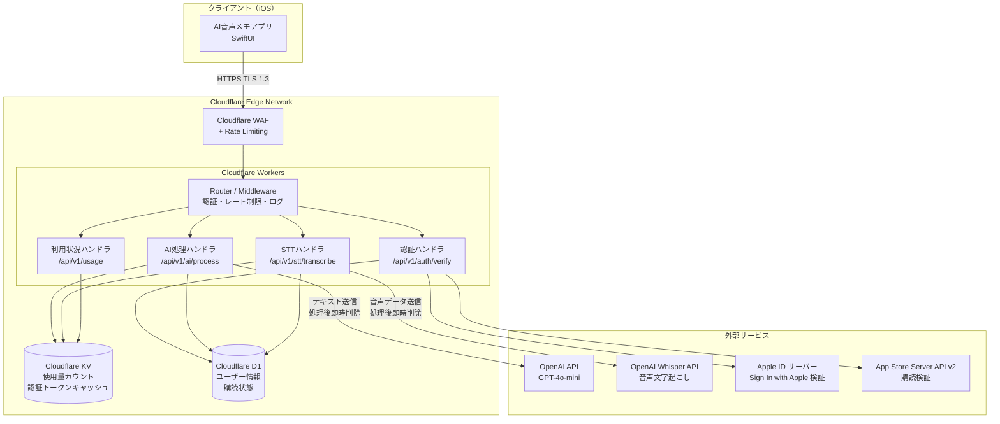

### 2.2 データフロー概要

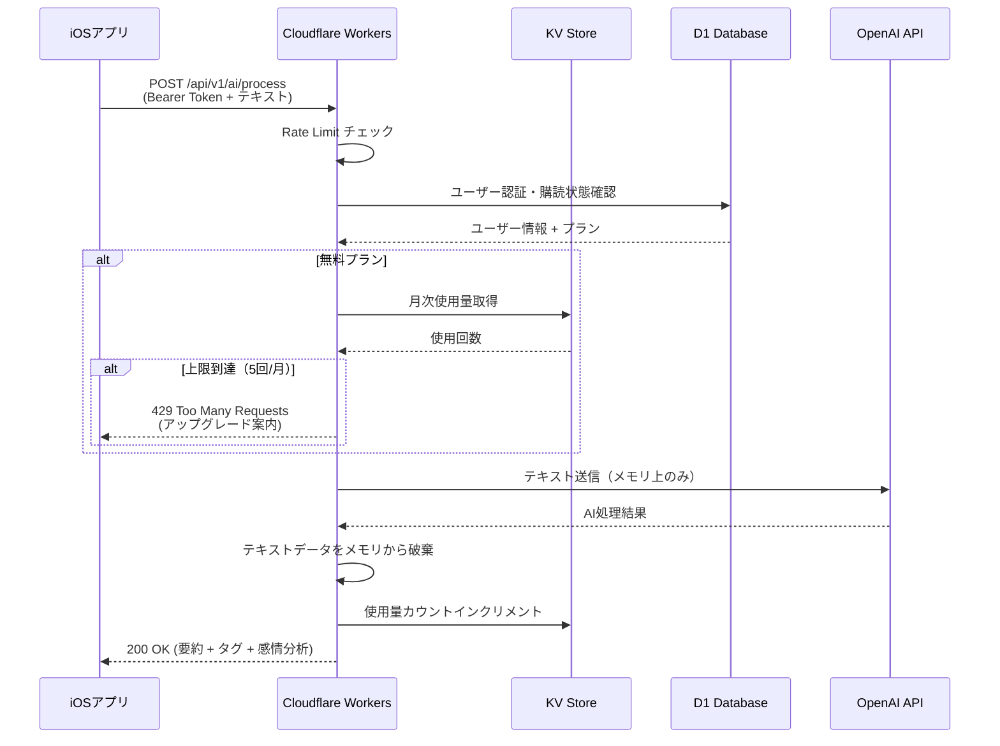

---

## 3. API設計

### 3.1 共通仕様

| 項目 | 値 |
|:-----|:---|
| ベースURL | `https://api.voicememo.example.com` |
| APIバージョン | `/api/v1` |
| プロトコル | HTTPS (TLS 1.3+) |
| コンテンツタイプ | `application/json` (AI処理) / `multipart/form-data` (STT) |
| 認証 | `Authorization: Bearer <token>` |
| 文字コード | UTF-8 |

### 3.2 共通リクエストヘッダー

<!-- ※統合仕様書 v1.0 準拠: App Attest assertion ヘッダー追加（Critical #7対応） -->
<!-- ※統合仕様書 v1.0 準拠: X-OS-Version ヘッダー追加（セクション7.4バージョン判定対応） -->

```
Authorization: Bearer <jwt_or_device_token>
Content-Type: application/json
X-App-Version: 1.0.0
X-OS-Version: 18.0
X-Device-ID: <device_uuid>
X-Request-ID: <uuid_v4>
X-App-Attest-Assertion: <base64_assertion>
Accept-Language: ja
```

| ヘッダー | 必須 | 説明 |
|:---------|:-----|:-----|
| `Authorization` | 認証必須EP | Bearer JWT or デバイストークン |
| `X-App-Version` | 推奨 | アプリバージョン（バージョン別機能判定用） |
| `X-OS-Version` | 推奨 | iOSバージョン（バージョン別機能判定用） |
| `X-Device-ID` | 必須 | デバイスUUID |
| `X-Request-ID` | 必須 | リクエストトレースID (UUIDv4) |
| `X-App-Attest-Assertion` | 必須※ | App Attest assertion (Base64)。※App Attest非対応端末はフォールバック許可 |
| `Accept-Language` | 推奨 | 言語コード |

### 3.3 共通エラーレスポンス

```json
{
  "error": {
    "code": "ERROR_CODE",
    "message": "人間が読めるエラーメッセージ",
    "details": {},
    "request_id": "uuid-v4"
  }
}
```

#### エラーコード一覧

| HTTPステータス | エラーコード | 説明 |
|:--------------|:-------------|:-----|
| 400 | `INVALID_REQUEST` | リクエストパラメータ不正 |
| 401 | `UNAUTHORIZED` | 認証トークン無効・期限切れ |
| 403 | `FORBIDDEN` | 権限不足（Pro機能へのFreeプランアクセス等） |
| 404 | `NOT_FOUND` | エンドポイント不存在 |
| 429 | `RATE_LIMITED` | レート制限超過 |
| 429 | `USAGE_LIMIT_EXCEEDED` | 月次AI処理上限到達（REQ-011） |
| 500 | `INTERNAL_ERROR` | サーバー内部エラー |
| 502 | `UPSTREAM_ERROR` | 外部API（OpenAI等）エラー |
| 503 | `SERVICE_UNAVAILABLE` | サービス一時停止 |

---

### 3.4 エンドポイント詳細

#### 3.4.1 POST /api/v1/ai/process — 統合AI処理

REQ-003（AI要約）、REQ-004（タグ自動付与）、REQ-005（感情分析）を単一リクエストで実行する。3つの処理を1回のAPI呼び出しに統合し、使用量カウントを1回分として計上する。

**リクエスト**

```json
{
  "text": "文字起こしされたテキスト...",
  "language": "ja",
  "options": {
    "summary": true,
    "tags": true,
    "sentiment": true
  },
  "context": {
    "memo_local_id": "local-uuid",
    "recording_duration_sec": 180
  }
}
```

**リクエスト JSON Schema**

```json
{
  "$schema": "https://json-schema.org/draft/2020-12/schema",
  "type": "object",
  "required": ["text"],
  "properties": {
    "text": {
      "type": "string",
      "minLength": 1,
      "maxLength": 30000,
      "description": "文字起こしテキスト（最大約30分の録音相当）"
    },
    "language": {
      "type": "string",
      "enum": ["ja", "en"],
      "default": "ja"
    },
    "options": {
      "type": "object",
      "properties": {
        "summary": { "type": "boolean", "default": true },
        "tags": { "type": "boolean", "default": true },
        "sentiment": { "type": "boolean", "default": true }
      }
    },
    "context": {
      "type": "object",
      "properties": {
        "memo_local_id": { "type": "string" },
        "recording_duration_sec": { "type": "integer", "minimum": 0 }
      }
    }
  }
}
```

<!-- ※統合仕様書 v1.0 準拠: 感情分析レスポンスを8カテゴリ方式（EmotionCategory）に統一。
     positive/negative/neutral/mixed 方式は廃止（High #6.1対応） -->

**レスポンス (200 OK)**

```json
{
  "summary": {
    "title": "自動生成タイトル",
    "brief": "要約テキスト（1-2行）",
    "key_points": ["ポイント1", "ポイント2"]
  },
  "tags": [
    { "label": "仕事", "confidence": 0.95 },
    { "label": "プロジェクトA", "confidence": 0.87 },
    { "label": "ブレスト", "confidence": 0.72 }
  ],
  "sentiment": {
    "primary": "joy",
    "scores": {
      "joy": 0.45,
      "calm": 0.20,
      "anticipation": 0.15,
      "sadness": 0.02,
      "anxiety": 0.03,
      "anger": 0.00,
      "surprise": 0.05,
      "neutral": 0.10
    },
    "evidence": [
      { "text": "プロジェクトが順調に進んでいる", "emotion": "joy" },
      { "text": "来週のリリースが楽しみ", "emotion": "anticipation" }
    ]
  },
  "usage": {
    "used": 3,
    "limit": 5,
    "plan": "free",
    "resets_at": "2026-04-01T00:00:00+09:00"
  },
  "metadata": {
    "model": "gpt-4o-mini",
    "provider": "cloud_gpt4o_mini",
    "processing_time_ms": 1200,
    "request_id": "uuid-v4"
  }
}
```

<!-- ※統合仕様書 v1.0 準拠: EmotionCategory 8値enum対応に修正（High #6.1対応） -->

**レスポンス JSON Schema**

```json
{
  "$schema": "https://json-schema.org/draft/2020-12/schema",
  "type": "object",
  "required": ["summary", "tags", "sentiment", "usage", "metadata"],
  "properties": {
    "summary": {
      "type": "object",
      "required": ["title", "brief"],
      "properties": {
        "title": { "type": "string", "maxLength": 20, "description": "20文字以内のタイトル" },
        "brief": { "type": "string", "maxLength": 200, "description": "1-2行の要約" },
        "key_points": {
          "type": "array",
          "items": { "type": "string" },
          "maxItems": 5,
          "description": "要点（最大5つ）"
        }
      }
    },
    "tags": {
      "type": "array",
      "items": {
        "type": "object",
        "required": ["label", "confidence"],
        "properties": {
          "label": { "type": "string", "maxLength": 15, "description": "タグラベル（15文字以内）" },
          "confidence": { "type": "number", "minimum": 0, "maximum": 1 }
        }
      },
      "maxItems": 10
    },
    "sentiment": {
      "type": "object",
      "required": ["primary", "scores"],
      "properties": {
        "primary": {
          "type": "string",
          "enum": ["joy", "calm", "anticipation", "sadness", "anxiety", "anger", "surprise", "neutral"],
          "description": "最も支配的な感情カテゴリ"
        },
        "scores": {
          "type": "object",
          "description": "8カテゴリの感情スコア（合計1.0）",
          "required": ["joy", "calm", "anticipation", "sadness", "anxiety", "anger", "surprise", "neutral"],
          "properties": {
            "joy":           { "type": "number", "minimum": 0, "maximum": 1 },
            "calm":          { "type": "number", "minimum": 0, "maximum": 1 },
            "anticipation":  { "type": "number", "minimum": 0, "maximum": 1 },
            "sadness":       { "type": "number", "minimum": 0, "maximum": 1 },
            "anxiety":       { "type": "number", "minimum": 0, "maximum": 1 },
            "anger":         { "type": "number", "minimum": 0, "maximum": 1 },
            "surprise":      { "type": "number", "minimum": 0, "maximum": 1 },
            "neutral":       { "type": "number", "minimum": 0, "maximum": 1 }
          }
        },
        "evidence": {
          "type": "array",
          "maxItems": 3,
          "items": {
            "type": "object",
            "required": ["text", "emotion"],
            "properties": {
              "text": { "type": "string", "description": "根拠となるテキスト箇所" },
              "emotion": {
                "type": "string",
                "enum": ["joy", "calm", "anticipation", "sadness", "anxiety", "anger", "surprise", "neutral"]
              }
            }
          }
        }
      }
    },
    "usage": {
      "type": "object",
      "required": ["used", "limit", "plan", "resets_at"],
      "properties": {
        "used": { "type": "integer" },
        "limit": { "type": ["integer", "null"], "description": "null = 無制限（Proプラン）" },
        "plan": { "type": "string", "enum": ["free", "pro"] },
        "resets_at": { "type": ["string", "null"], "format": "date-time" }
      }
    },
    "metadata": {
      "type": "object",
      "properties": {
        "model": { "type": "string" },
        "provider": { "type": "string", "description": "LLMProviderType識別子" },
        "processing_time_ms": { "type": "integer" },
        "request_id": { "type": "string" }
      }
    }
  }
}
```

---

#### 3.4.2 POST /api/v1/stt/transcribe — クラウドSTT（Pro限定）

REQ-018 に対応するPro限定のクラウド高精度文字起こし。OpenAI Whisper API を使用する。

**リクエスト**

```
POST /api/v1/stt/transcribe
Content-Type: multipart/form-data
Authorization: Bearer <token>

--boundary
Content-Disposition: form-data; name="audio"; filename="recording.m4a"
Content-Type: audio/mp4

<バイナリ音声データ>
--boundary
Content-Disposition: form-data; name="language"

ja
--boundary
Content-Disposition: form-data; name="options"
Content-Type: application/json

{"timestamps": true, "punctuation": true}
--boundary--
```

**リクエストパラメータ**

| パラメータ | 型 | 必須 | 説明 |
|:----------|:---|:-----|:-----|
| audio | file | Yes | 音声ファイル（m4a/wav/mp3、最大25MB） |
| language | string | No | 言語コード（デフォルト: `ja`） |
| options | JSON | No | `timestamps`: 単語タイムスタンプ、`punctuation`: 句読点付与 |

**レスポンス (200 OK)**

```json
{
  "text": "文字起こし結果のテキスト...",
  "segments": [
    {
      "start": 0.0,
      "end": 3.5,
      "text": "今日はプロジェクトAのミーティングがありました。"
    }
  ],
  "language": "ja",
  "duration_sec": 180.5,
  "metadata": {
    "model": "whisper-1",
    "processing_time_ms": 5400,
    "request_id": "uuid-v4"
  }
}
```

**認可**: Proプランのみ。Freeプランからのリクエストは `403 FORBIDDEN` を返却する。

---

#### 3.4.3 POST /api/v1/auth/apple-sign-in — Apple Sign In 検証

<!-- ※統合仕様書 v1.0 準拠: エンドポイント名を命名規則（kebab-case）に統一 -->
<!-- ※統合仕様書 v1.0 準拠: High対応 — Apple Sign In検証の強化（nonce必須化） -->

Sign In with Apple のIDトークンを検証し、アプリ用JWTを発行する。

> **旧パス**: `POST /api/v1/auth/verify` は非推奨。移行期間中は両パスを並行稼働する。

**リクエスト**

```json
{
  "identity_token": "Apple発行のIDトークン(JWT)",
  "authorization_code": "Apple発行の認可コード",
  "nonce": "クライアントが生成したnonce（リプレイ攻撃防止）",
  "user_info": {
    "name": "ユーザー名（初回のみ）",
    "email": "user@privaterelay.appleid.com"
  },
  "device_id": "device-uuid"
}
```

**リクエスト JSON Schema**

```json
{
  "$schema": "https://json-schema.org/draft/2020-12/schema",
  "type": "object",
  "required": ["identity_token", "authorization_code", "nonce", "device_id"],
  "properties": {
    "identity_token": { "type": "string", "description": "Apple発行のIDトークン (JWT)" },
    "authorization_code": { "type": "string", "description": "Apple発行の認可コード（サーバー側でrefresh_tokenに交換）" },
    "nonce": { "type": "string", "description": "クライアント生成のnonce（SHA256ハッシュ前の原文）" },
    "user_info": {
      "type": "object",
      "properties": {
        "name": { "type": "string", "maxLength": 100 },
        "email": { "type": "string", "format": "email" }
      }
    },
    "device_id": { "type": "string", "format": "uuid" }
  }
}
```

**サーバー側検証項目**:

| 検証項目 | 内容 | 失敗時の応答 |
|:---------|:-----|:-------------|
| JWT署名検証 | Apple JWKS公開鍵（`kid`で選択）による署名検証 | 401 |
| `iss` 検証 | `"https://appleid.apple.com"` と一致 | 401 |
| `aud` 検証 | `APPLE_CLIENT_ID`（Bundle ID）と一致 | 401 |
| `exp` 検証 | 現在時刻より未来 | 401 |
| `nonce` 検証 | `SHA256(client_nonce)` と一致 | 401 |
| `email_verified` | メール検証済み（存在する場合） | 401 |
| authorization_code交換 | Apple token endpointでrefresh_tokenに交換 | 502 |

**レスポンス (200 OK)**

```json
{
  "access_token": "eyJhbGciOiJFUzI1NiIs...",
  "refresh_token": "rt_xxxxxxxxxxxx",
  "expires_in": 3600,
  "token_type": "Bearer",
  "user": {
    "id": "usr_xxxxxxxxxxxx",
    "plan": "free",
    "created_at": "2026-03-16T00:00:00+09:00"
  }
}
```

---

#### 3.4.4 POST /api/v1/auth/token/refresh — トークンリフレッシュ

**リクエスト**

```json
{
  "refresh_token": "rt_xxxxxxxxxxxx",
  "device_id": "device-uuid"
}
```

**レスポンス (200 OK)**

```json
{
  "access_token": "eyJhbGciOiJFUzI1NiIs...",
  "refresh_token": "rt_new_xxxxxxxxxxxx",
  "expires_in": 3600,
  "token_type": "Bearer"
}
```

---

#### 3.4.5 POST /api/v1/auth/device — デバイストークン認証（MVP）+ App Attest

<!-- ※統合仕様書 v1.0 準拠: Critical #7 対応 — App Attest attestation検証を統合 -->

MVP段階でApple Sign Inの実装が未完了の場合に使用する匿名認証。デバイスUUIDベースで一意のユーザーを生成する。App Attest対応端末では attestation を検証し、デバイスの正当性を保証する。

**リクエスト（App Attest対応端末）**

```json
{
  "device_id": "device-uuid",
  "device_info": {
    "model": "iPhone15,2",
    "os_version": "18.0",
    "app_version": "1.0.0"
  },
  "attestation": "Base64エンコードされたattestation object (CBOR)",
  "key_id": "App Attest keyId",
  "challenge": "サーバーから取得したchallenge nonce"
}
```

**リクエスト（App Attest非対応端末フォールバック）**

```json
{
  "device_id": "device-uuid",
  "device_info": {
    "model": "iPhone12,1",
    "os_version": "17.0",
    "app_version": "1.0.0"
  },
  "attest_supported": false
}
```

**リクエスト JSON Schema**

```json
{
  "$schema": "https://json-schema.org/draft/2020-12/schema",
  "type": "object",
  "required": ["device_id", "device_info"],
  "properties": {
    "device_id": { "type": "string", "format": "uuid" },
    "device_info": {
      "type": "object",
      "required": ["model", "os_version", "app_version"],
      "properties": {
        "model": { "type": "string" },
        "os_version": { "type": "string" },
        "app_version": { "type": "string" }
      }
    },
    "attestation": { "type": "string", "description": "Base64 CBOR attestation object" },
    "key_id": { "type": "string", "description": "App Attest key ID" },
    "challenge": { "type": "string", "description": "サーバー発行のchallenge nonce" },
    "attest_supported": { "type": "boolean", "default": true }
  }
}
```

**レスポンス (200 OK)**

```json
{
  "access_token": "eyJhbGciOiJFUzI1NiIs...",
  "expires_in": 86400,
  "token_type": "Bearer",
  "user": {
    "id": "usr_device_xxxxxxxxxxxx",
    "plan": "free",
    "auth_method": "device",
    "attest_verified": true,
    "created_at": "2026-03-16T00:00:00+09:00"
  }
}
```

> **注意**: デバイストークン認証はMVPフェーズの暫定措置。Apple Sign In 実装後は段階的に移行し、デバイストークンユーザーにはApple Sign Inリンクを促す。App Attest非対応端末（`attest_supported: false`）では制限付き認証（月3回のAI処理制限等）を適用する。

#### 3.4.5a GET /api/v1/auth/challenge — App Attest用チャレンジ発行

App Attest の attestation / assertion 生成に必要な使い捨てchallenge nonceを発行する。

**レスポンス (200 OK)**

```json
{
  "challenge": "random_nonce_base64url",
  "expires_in": 300
}
```

| パラメータ | 説明 |
|:-----------|:-----|
| `challenge` | サーバー生成の使い捨てnonce (Base64URL, 32バイト) |
| `expires_in` | 有効期限（秒）。5分以内に使用すること |

> challengeはKVに保存し、TTL 300秒で自動削除する。使用済みのchallengeは即座に削除して再利用を防止する。

---

#### 3.4.6 GET /api/v1/usage — 利用状況確認

**レスポンス (200 OK)**

```json
{
  "plan": "free",
  "ai_processing": {
    "used": 3,
    "limit": 5,
    "resets_at": "2026-04-01T00:00:00+09:00"
  },
  "cloud_stt": {
    "available": false,
    "reason": "Pro plan required"
  },
  "subscription": null,
  "rate_limit": {
    "daily_remaining": null,
    "resets_at": null
  }
}
```

Proプランの場合:

```json
{
  "plan": "pro",
  "ai_processing": {
    "used": 42,
    "limit": null,
    "resets_at": null
  },
  "cloud_stt": {
    "available": true,
    "reason": null
  },
  "subscription": {
    "status": "active",
    "product_id": "io.murmurnote.pro.monthly",
    "expires_at": "2026-04-15T23:59:59+09:00",
    "auto_renew": true
  },
  "rate_limit": {
    "daily_remaining": 958,
    "resets_at": "2026-03-17T00:00:00+09:00"
  }
}
```

---

### 3.5 エンドポイント一覧サマリー

<!-- ※統合仕様書 v1.0 準拠: APIパスの統一（命名規則に準拠: kebab-case, REST形式） -->

| メソッド | パス | 説明 | 認証 | App Attest | プラン |
|:---------|:-----|:-----|:-----|:-----------|:-------|
| POST | `/api/v1/ai/process` | 統合AI処理 | JWT必須 | assertion必須 | Free(月5回) / Pro(無制限) |
| POST | `/api/v1/stt/transcribe` | クラウドSTT | JWT必須 | assertion必須 | Pro限定 |
| GET | `/api/v1/auth/challenge` | App Attest用チャレンジ発行 | 不要 | — | 全プラン |
| POST | `/api/v1/auth/apple-sign-in` | Apple Sign In検証 | 不要 | — | 全プラン |
| POST | `/api/v1/auth/token/refresh` | トークンリフレッシュ | refresh_token | — | 全プラン |
| POST | `/api/v1/auth/device` | デバイストークン認証 + attestation | 不要 | attestation | 全プラン |
| GET | `/api/v1/usage` | 利用状況確認 | JWT必須 | — | 全プラン |
| POST | `/api/v1/subscription/verify` | 購読検証（appAccountToken付き） | JWT必須 | assertion必須 | 全プラン |
| POST | `/api/v1/subscription/webhook` | App Store通知受信 | Apple署名検証 | — | — |
| DELETE | `/api/v1/account` | アカウント削除（忘れられる権利） | JWT必須 | — | 全プラン |

> **注意**: `POST /api/v1/auth/verify` は `POST /api/v1/auth/apple-sign-in` に改名（統合仕様書命名規則: kebab-case、動詞はPOSTメソッドで表現）。旧パスは非推奨として一定期間並行稼働する。

---

## 4. 認証・認可設計

### 4.1 認証方式の概要

本システムは段階的な認証方式を採用する。

| フェーズ | 認証方式 | 説明 |
|:---------|:---------|:-----|
| MVP (P3初期) | デバイストークン | デバイスUUIDベースの匿名認証 |
| P3完了 | Apple Sign In | Sign In with Apple によるフル認証 |
| 両方式共存 | ハイブリッド | 既存デバイスユーザーの移行期間 |

### 4.2 Sign In with Apple 認証フロー

<!-- ※統合仕様書 v1.0 準拠: Apple Sign In検証の強化（iss/aud/exp/nonce検証、authorization_code活用明確化） -->

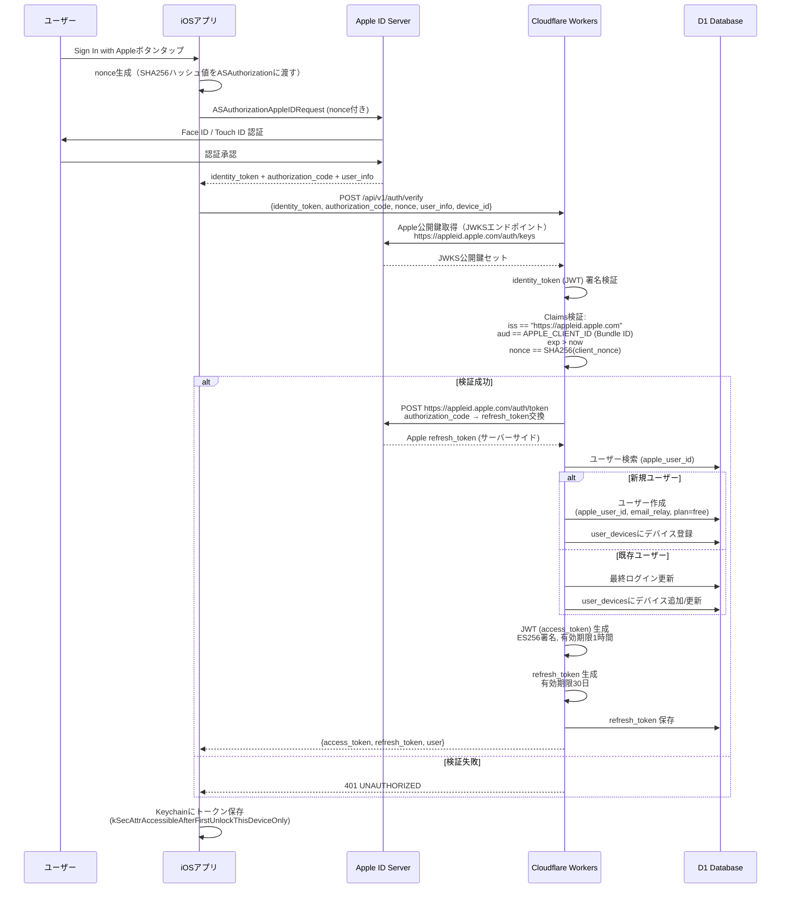

#### Apple Sign In identity_token 検証の詳細

identity_tokenはJWT形式であり、以下の検証を**全て**実施する。

```typescript
// ※統合仕様書 v1.0 準拠: Apple Sign In検証の強化
async function verifyAppleIdentityToken(
  identityToken: string,
  nonce: string,
  env: Env
): Promise<AppleIDTokenPayload> {
  // 1. Apple JWKSから公開鍵を取得（KVキャッシュ: 24時間）
  const jwks = await getAppleJWKS(env);

  // 2. JWT署名検証 + デコード
  const { payload, protectedHeader } = await jwtVerify(
    identityToken,
    async (header) => {
      const key = jwks.keys.find(k => k.kid === header.kid);
      if (!key) throw new Error('Apple JWK not found for kid: ' + header.kid);
      return importJWK(key, header.alg);
    },
    {
      issuer: 'https://appleid.apple.com',      // iss検証
      audience: env.APPLE_CLIENT_ID,             // aud検証（Bundle ID）
    }
  );

  // 3. 有効期限検証（jwtVerifyが自動チェックするが明示）
  if (payload.exp && payload.exp < Math.floor(Date.now() / 1000)) {
    throw new Error('Apple identity_token expired');
  }

  // 4. nonce検証（リプレイ攻撃防止）
  const expectedNonce = await sha256(nonce);
  if (payload.nonce !== expectedNonce) {
    throw new Error('Nonce mismatch');
  }

  // 5. email_verified チェック
  if (payload.email && !payload.email_verified) {
    throw new Error('Email not verified');
  }

  return payload as AppleIDTokenPayload;
}
```

#### authorization_code の活用

authorization_codeはサーバーサイドでApple refresh_tokenに交換し、以下に活用する。

| 用途 | 説明 |
|:-----|:-----|
| ユーザー離脱検知 | 定期的にApple refresh_tokenの有効性を確認し、Apple IDのアプリ連携解除を検知 |
| アカウント削除対応 | ユーザーアカウント削除時にApple Server-to-Server通知（`consent-revoked`）を処理 |
| token revocation | アカウント削除時に `POST https://appleid.apple.com/auth/revoke` でAppleトークンを無効化 |

### 4.3 JWT トークン設計

#### Access Token（短命）

```json
{
  "header": {
    "alg": "ES256",
    "typ": "JWT",
    "kid": "key-2026-03"
  },
  "payload": {
    "sub": "usr_xxxxxxxxxxxx",
    "iss": "voicememo-proxy",
    "aud": "voicememo-ios",
    "iat": 1742065200,
    "exp": 1742068800,
    "plan": "free",
    "auth_method": "apple",
    "device_id": "device-uuid"
  }
}
```

| フィールド | 説明 | 値 |
|:-----------|:-----|:---|
| `sub` | ユーザーID | `usr_` prefix |
| `plan` | 現在のプラン | `free` / `pro` |
| `auth_method` | 認証方式 | `apple` / `device` |
| `exp` | 有効期限 | 発行から1時間後 |

#### Refresh Token

- フォーマット: `rt_` + ランダム256bit (Base64URL)
- 有効期限: 30日
- D1に保存し、使用時にローテーション（1回使い捨て）
- デバイスIDと紐付け（異なるデバイスからの使用を拒否）

#### 鍵管理

```typescript
// Worker Secrets に ES256 秘密鍵を保存
// 公開鍵はクライアント側には配布しない（検証はサーバー側のみ）
interface Env {
  JWT_PRIVATE_KEY: string;   // ES256 秘密鍵 (PEM)
  JWT_KEY_ID: string;        // 鍵ID（ローテーション用）
  APPLE_TEAM_ID: string;
  APPLE_CLIENT_ID: string;   // Bundle ID
}
```

### 4.4 デバイストークン認証（MVP）+ App Attest

<!-- ※統合仕様書 v1.0 準拠: Critical #7 対応 — App Attest によるデバイス認証偽装対策 -->
<!-- DCAppAttestService による attestation 検証 → assertion 検証フローを追加 -->

#### 4.4.1 初回登録フロー（Attestation）

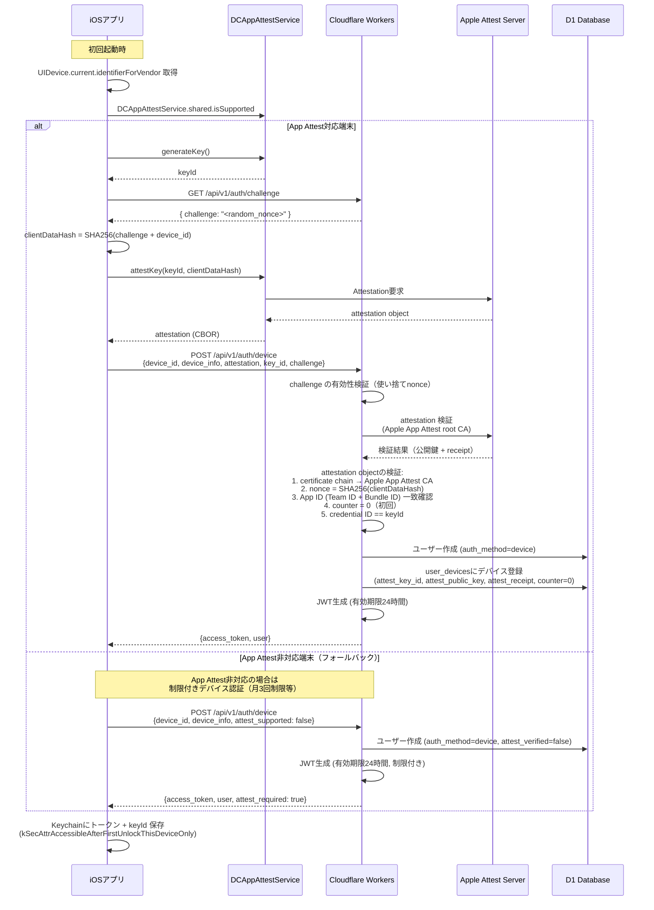

#### 4.4.2 以降のAPIリクエスト（Assertion）

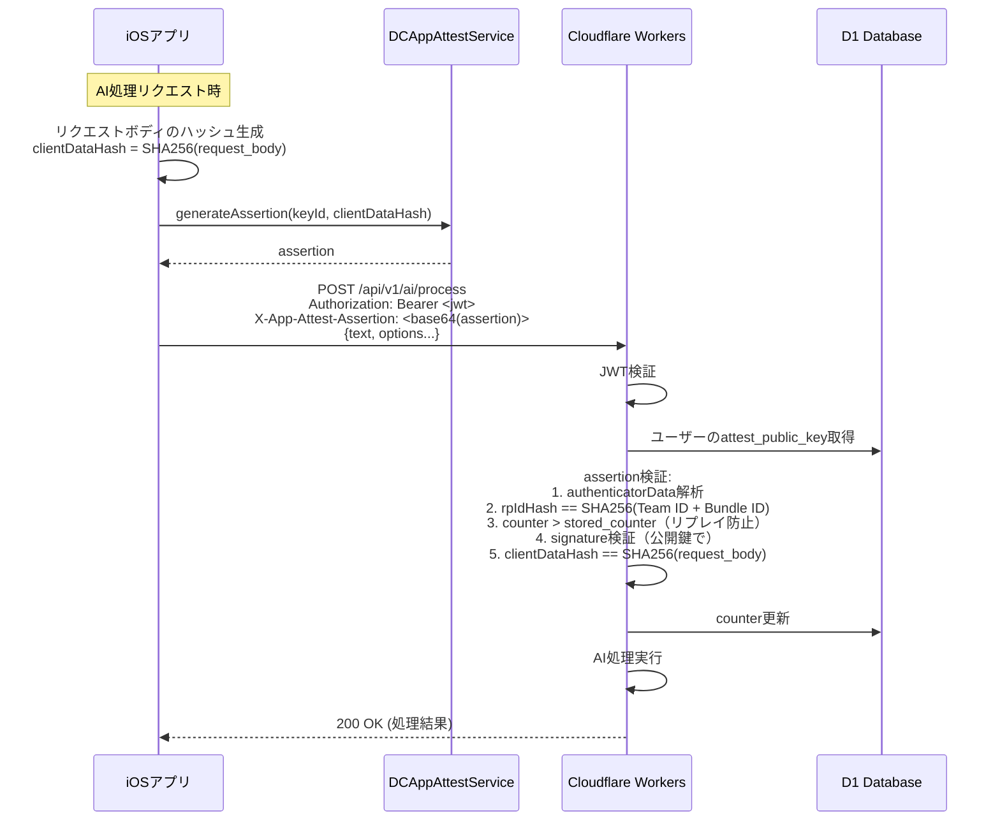

#### 4.4.3 App Attest検証の擬似コード

```typescript
// ※統合仕様書 v1.0 準拠: Critical #7 App Attest assertion検証
interface AttestationData {
  keyId: string;
  attestation: string;  // Base64 CBOR
  challenge: string;
}

async function verifyAttestation(
  data: AttestationData,
  deviceId: string,
  env: Env
): Promise<{ publicKey: CryptoKey; receipt: Uint8Array }> {
  // 1. CBOR デコード
  const attestObj = decodeCBOR(base64Decode(data.attestation));

  // 2. 証明書チェーン検証（Apple App Attest Root CA）
  const leafCert = attestObj.attStmt.x5c[0];
  const intermediateCert = attestObj.attStmt.x5c[1];
  await verifyCertChain(leafCert, intermediateCert, APPLE_APP_ATTEST_ROOT_CA);

  // 3. nonce検証
  const clientDataHash = await sha256(data.challenge + deviceId);
  const expectedNonce = await sha256(
    concatBuffers(attestObj.authData, clientDataHash)
  );
  const certNonce = extractNonceFromCert(leafCert);
  if (!timingSafeEqual(certNonce, expectedNonce)) {
    throw new Error('Attestation nonce mismatch');
  }

  // 4. App ID 検証
  const expectedAppId = `${env.APPLE_TEAM_ID}.${env.APPLE_CLIENT_ID}`;
  const rpIdHash = attestObj.authData.slice(0, 32);
  const expectedRpIdHash = await sha256(expectedAppId);
  if (!timingSafeEqual(rpIdHash, expectedRpIdHash)) {
    throw new Error('App ID mismatch');
  }

  // 5. counter == 0（初回attestation）
  const counter = new DataView(attestObj.authData.buffer).getUint32(33);
  if (counter !== 0) {
    throw new Error('Counter must be 0 for initial attestation');
  }

  // 6. credentialId == keyId
  const credentialId = extractCredentialId(attestObj.authData);
  if (credentialId !== data.keyId) {
    throw new Error('Credential ID mismatch');
  }

  // 公開鍵とreceiptを返却
  const publicKey = await extractPublicKey(leafCert);
  return { publicKey, receipt: attestObj.attStmt.receipt };
}

async function verifyAssertion(
  assertion: Uint8Array,
  clientDataHash: Uint8Array,
  storedPublicKey: CryptoKey,
  storedCounter: number,
  env: Env
): Promise<{ newCounter: number }> {
  // 1. CBOR デコード
  const assertObj = decodeCBOR(assertion);
  const { authenticatorData, signature } = assertObj;

  // 2. rpIdHash 検証
  const expectedAppId = `${env.APPLE_TEAM_ID}.${env.APPLE_CLIENT_ID}`;
  const rpIdHash = authenticatorData.slice(0, 32);
  const expectedRpIdHash = await sha256(expectedAppId);
  if (!timingSafeEqual(rpIdHash, expectedRpIdHash)) {
    throw new Error('RP ID mismatch');
  }

  // 3. counter検証（リプレイ防止）
  const counter = new DataView(authenticatorData.buffer).getUint32(33);
  if (counter <= storedCounter) {
    throw new Error('Assertion counter replay detected');
  }

  // 4. 署名検証
  const signedData = concatBuffers(authenticatorData, clientDataHash);
  const isValid = await crypto.subtle.verify(
    { name: 'ECDSA', hash: 'SHA-256' },
    storedPublicKey,
    signature,
    signedData
  );
  if (!isValid) {
    throw new Error('Assertion signature invalid');
  }

  return { newCounter: counter };
}
```

> **セキュリティ考慮**: デバイストークン認証はMVP限定であり、identifierForVendorはアプリ再インストールで変更される。Apple Sign In移行後はデバイストークンユーザーにアカウントリンクを案内する。App Attest非対応端末（Simulator等）では制限付き認証を提供し、不正利用リスクを低減する。

### 4.5 認証ミドルウェア擬似コード

<!-- ※統合仕様書 v1.0 準拠: Critical #7 対応 — assertion検証ミドルウェア追加 -->

```typescript
import { Hono } from 'hono';
import { verify } from 'hono/jwt';

const app = new Hono<{ Bindings: Env }>();

// 認証ミドルウェア（JWT検証 + App Attest assertion検証）
const authMiddleware = async (c, next) => {
  const authHeader = c.req.header('Authorization');
  if (!authHeader?.startsWith('Bearer ')) {
    return c.json({ error: { code: 'UNAUTHORIZED', message: '認証トークンが必要です' } }, 401);
  }

  const token = authHeader.substring(7);

  try {
    const payload = await verify(token, c.env.JWT_PUBLIC_KEY, 'ES256');

    // トークンの有効期限チェック
    if (payload.exp < Math.floor(Date.now() / 1000)) {
      return c.json({ error: { code: 'UNAUTHORIZED', message: 'トークンが期限切れです' } }, 401);
    }

    // コンテキストにユーザー情報をセット
    c.set('user', {
      id: payload.sub,
      plan: payload.plan,
      authMethod: payload.auth_method,
      deviceId: payload.device_id,
    });

    await next();
  } catch (e) {
    return c.json({ error: { code: 'UNAUTHORIZED', message: '無効なトークンです' } }, 401);
  }
};

// ※統合仕様書 v1.0 準拠: App Attest assertion 検証ミドルウェア（Critical #7）
const appAttestMiddleware = async (c, next) => {
  const user = c.get('user');
  const assertionHeader = c.req.header('X-App-Attest-Assertion');

  // App Attest非対応端末のフォールバック処理
  if (!assertionHeader) {
    // D1でユーザーのattest_verified状態を確認
    const device = await c.env.DB.prepare(
      'SELECT attest_verified FROM user_devices WHERE user_id = ? AND device_id = ?'
    ).bind(user.id, user.deviceId).first();

    if (device?.attest_verified) {
      // attest済みユーザーがassertionなしでリクエスト → 拒否
      return c.json({
        error: { code: 'ATTEST_REQUIRED', message: 'App Attest assertionが必要です' }
      }, 403);
    }

    // 未attest端末は制限付きで許可（月3回制限等）
    c.set('attestVerified', false);
    await next();
    return;
  }

  try {
    // リクエストボディのハッシュ生成
    const body = await c.req.raw.clone().arrayBuffer();
    const clientDataHash = new Uint8Array(
      await crypto.subtle.digest('SHA-256', body)
    );

    // ユーザーのApp Attest公開鍵とcounterを取得
    const device = await c.env.DB.prepare(
      'SELECT attest_public_key, attest_counter FROM user_devices WHERE user_id = ? AND device_id = ?'
    ).bind(user.id, user.deviceId).first();

    if (!device) {
      return c.json({ error: { code: 'DEVICE_NOT_FOUND', message: 'デバイスが登録されていません' } }, 403);
    }

    const assertion = base64Decode(assertionHeader);
    const publicKey = await importPublicKey(device.attest_public_key);

    const { newCounter } = await verifyAssertion(
      assertion,
      clientDataHash,
      publicKey,
      device.attest_counter,
      c.env
    );

    // counter更新
    await c.env.DB.prepare(
      'UPDATE user_devices SET attest_counter = ?, updated_at = ? WHERE user_id = ? AND device_id = ?'
    ).bind(newCounter, new Date().toISOString(), user.id, user.deviceId).run();

    c.set('attestVerified', true);
    await next();
  } catch (e) {
    console.error(`App Attest verification failed: ${e.message}`);
    return c.json({
      error: { code: 'ATTEST_FAILED', message: 'App Attest検証に失敗しました' }
    }, 403);
  }
};

// Pro限定エンドポイントのガード
const proOnlyMiddleware = async (c, next) => {
  const user = c.get('user');
  if (user.plan !== 'pro') {
    return c.json({
      error: {
        code: 'FORBIDDEN',
        message: 'この機能はProプランが必要です',
        details: { upgrade_url: 'voicememo://settings/upgrade' }
      }
    }, 403);
  }
  await next();
};
```

---

## 5. 課金検証設計

### 5.1 サブスクリプション構成

| プロダクトID | プラン | 価格 | 期間 |
|:-------------|:-------|:-----|:-----|
| `io.murmurnote.pro.monthly` | Pro月額 | ¥500/月 | 1か月 |
| `io.murmurnote.pro.yearly` | Pro年額 | ¥4,800/年 | 1年 |

### 5.2 App Store Server API v2 による購読検証

<!-- ※統合仕様書 v1.0 準拠: Critical #5 対応 — appAccountToken によるユーザーID強制バインド -->
<!-- StoreKit 2 の purchase(options: [.appAccountToken()]) でユーザーIDを紐付け -->
<!-- /subscription/verify で user_id 一致確認を追加 -->

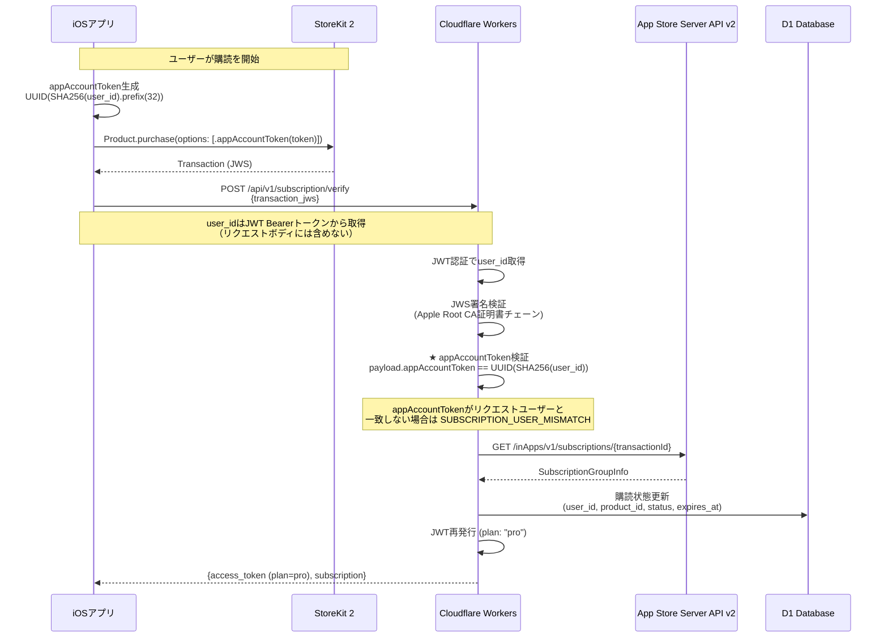

#### appAccountToken の生成・検証ロジック

```typescript
// ※統合仕様書 v1.0 準拠: Critical #5 appAccountToken検証
import { v5 as uuidv5 } from 'uuid';

// appAccountTokenの生成（クライアント・サーバー共通ロジック）
// user_idから決定論的にUUIDを生成
const APP_ACCOUNT_TOKEN_NAMESPACE = '6ba7b810-9dad-11d1-80b4-00c04fd430c8'; // DNS namespace UUID

function generateAppAccountToken(userId: string): string {
  return uuidv5(userId, APP_ACCOUNT_TOKEN_NAMESPACE);
}

// 購読検証時のappAccountToken一致確認
async function verifySubscription(
  transactionJWS: string,
  requestingUserId: string,
  env: Env
): Promise<SubscriptionStatus> {
  // JWS署名検証（Apple Root CA証明書チェーン）
  const payload = await verifyTransactionJWS(transactionJWS, env);

  // ★ appAccountToken がリクエストユーザーと一致することを検証
  const expectedToken = generateAppAccountToken(requestingUserId);
  if (payload.appAccountToken !== expectedToken) {
    throw new AppError(
      'SUBSCRIPTION_USER_MISMATCH',
      'appAccountToken does not match requesting user',
      403
    );
  }

  // トランザクション情報の検証
  if (payload.bundleId !== env.APPLE_CLIENT_ID) {
    throw new AppError('INVALID_BUNDLE_ID', 'Bundle ID mismatch', 403);
  }

  // 有効期限の確認
  const now = Date.now();
  if (payload.expiresDate && payload.expiresDate < now) {
    return { status: 'expired', plan: 'free' };
  }

  return {
    status: 'active',
    plan: 'pro',
    productId: payload.productId,
    expiresAt: new Date(payload.expiresDate).toISOString(),
    originalTransactionId: payload.originalTransactionId,
  };
}
```

### 5.3 Server Notification V2 処理

<!-- ※統合仕様書 v1.0 準拠: Critical #6 対応 — notificationUUID による冪等性保証 -->
<!-- ※統合仕様書 v1.0 準拠: Critical #5 対応 — appAccountToken によるユーザー照合 -->
<!-- ※統合仕様書 v1.0 準拠: High対応 — signedDate比較による順序競合対策 -->

App Storeからのサーバー通知をWebhookで受信し、購読状態を即時更新する。

**Webhook エンドポイント**: `POST /api/v1/subscription/webhook`

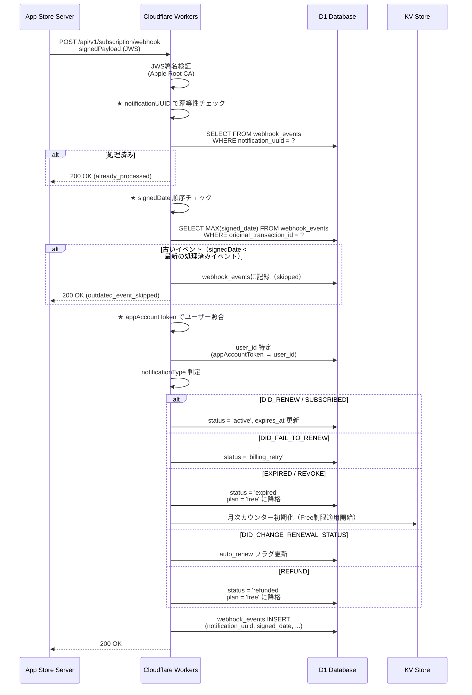

#### 処理する通知タイプ

| 通知タイプ | サブタイプ | 処理 |
|:-----------|:-----------|:-----|
| `SUBSCRIBED` | `INITIAL_BUY` | 新規購読: plan→pro |
| `SUBSCRIBED` | `RESUBSCRIBE` | 再購読: plan→pro |
| `DID_RENEW` | — | 自動更新成功: expires_at更新 |
| `DID_FAIL_TO_RENEW` | `GRACE_PERIOD` | 猶予期間: Pro維持 |
| `DID_FAIL_TO_RENEW` | — | 更新失敗: billing_retry状態 |
| `EXPIRED` | `VOLUNTARY` | 自主解約: plan→free |
| `EXPIRED` | `BILLING_RETRY_PERIOD` | 請求リトライ期間終了: plan→free |
| `REVOKE` | — | 返金による失効: plan→free |
| `REFUND` | — | 返金: plan→free |
| `DID_CHANGE_RENEWAL_STATUS` | `AUTO_RENEW_DISABLED` | 自動更新OFF |

### 5.4 購読検証の擬似コード

<!-- ※統合仕様書 v1.0 準拠: Critical #6 冪等性 + signedDate順序競合対策 -->

```typescript
import { jwtVerify, importX509 } from 'jose';

async function verifyAppStoreNotification(
  signedPayload: string,
  env: Env
): Promise<NotificationPayload> {
  // Apple Root CA 証明書チェーンの検証
  const { payload, protectedHeader } = await jwtVerify(
    signedPayload,
    async (header) => {
      // x5c ヘッダーから証明書チェーンを取得
      const certs = header.x5c?.map(c =>
        `-----BEGIN CERTIFICATE-----\n${c}\n-----END CERTIFICATE-----`
      );
      if (!certs?.length) throw new Error('証明書チェーンなし');

      // Apple Root CA に対する検証
      await verifyCertificateChain(certs, env.APPLE_ROOT_CA);

      return importX509(certs[0], 'ES256');
    }
  );

  return payload as NotificationPayload;
}

// ※統合仕様書 v1.0 準拠: Webhook処理の冪等性 + 順序競合対策
async function handleAppStoreWebhook(c: Context): Promise<Response> {
  const signedPayload = await c.req.json();
  const payload = await verifyAppStoreNotification(signedPayload.signedPayload, c.env);

  // ★ notificationUUID による冪等性チェック（Critical #6）
  const notificationUUID = payload.notificationUUID;
  const existing = await c.env.DB.prepare(
    'SELECT id FROM webhook_events WHERE notification_uuid = ?'
  ).bind(notificationUUID).first();

  if (existing) {
    // 既に処理済み → 200 OK を返して終了（冪等性保証）
    return c.json({ status: 'already_processed' }, 200);
  }

  // ★ signedDate による順序競合チェック（High: 購読状態更新の順序競合対策）
  const transactionInfo = await decodeTransactionInfo(payload.data.signedTransactionInfo, c.env);
  const signedDate = payload.signedDate;
  const latestEvent = await c.env.DB.prepare(
    'SELECT MAX(signed_date) as max_signed_date FROM webhook_events WHERE original_transaction_id = ?'
  ).bind(transactionInfo.originalTransactionId).first();

  if (latestEvent?.max_signed_date && signedDate < latestEvent.max_signed_date) {
    // 古いイベント → 記録のみして処理スキップ
    await c.env.DB.prepare(
      `INSERT INTO webhook_events
       (id, notification_uuid, notification_type, subtype, original_transaction_id, signed_date, status, processed_at, created_at)
       VALUES (?, ?, ?, ?, ?, ?, 'skipped', ?, ?)`
    ).bind(
      generateId('evt'), notificationUUID, payload.notificationType, payload.subtype || null,
      transactionInfo.originalTransactionId, signedDate,
      new Date().toISOString(), new Date().toISOString()
    ).run();
    return c.json({ status: 'outdated_event_skipped' }, 200);
  }

  // ★ appAccountToken でユーザー照合（Critical #5）
  const userId = await resolveUserByAppAccountToken(transactionInfo.appAccountToken, c.env);
  if (!userId) {
    console.error(`Unknown appAccountToken: ${transactionInfo.appAccountToken}`);
    // ユーザー不明でも200を返す（Apple再送防止）
    return c.json({ status: 'user_not_found' }, 200);
  }

  // 通知処理を実行
  await processNotification(payload, userId, transactionInfo, c.env);

  // 処理記録を保存
  await c.env.DB.prepare(
    `INSERT INTO webhook_events
     (id, notification_uuid, notification_type, subtype, original_transaction_id, signed_date, status, processed_at, created_at)
     VALUES (?, ?, ?, ?, ?, ?, 'processed', ?, ?)`
  ).bind(
    generateId('evt'), notificationUUID, payload.notificationType, payload.subtype || null,
    transactionInfo.originalTransactionId, signedDate,
    new Date().toISOString(), new Date().toISOString()
  ).run();

  return c.json({ status: 'processed' }, 200);
}

// appAccountTokenからユーザーIDを解決
async function resolveUserByAppAccountToken(
  appAccountToken: string,
  env: Env
): Promise<string | null> {
  // appAccountToken = UUID(SHA256(user_id)) なので逆引きが必要
  // subscriptionsテーブルにapp_account_tokenカラムを追加して照合
  const sub = await env.DB.prepare(
    'SELECT user_id FROM subscriptions WHERE app_account_token = ?'
  ).bind(appAccountToken).first();
  return sub?.user_id || null;
}
```

### 5.5 無料プラン月次使用量カウント

REQ-011、EC-014 に基づく使用量管理。

#### KV Store のキー設計

```
usage:{user_id}:{yyyy-mm}  →  { "count": 3, "last_used_at": "2026-03-16T10:30:00+09:00" }
```

- **TTL**: 月末 + 7日（安全マージン）
- **月次リセット**: TTLによる自動消滅 + アプリ側でのJST月初判定

#### 月次リセットロジック（EC-014準拠）

```typescript
/**
 * 月次使用量の取得・検証
 * EC-014: 毎月1日 JST 0:00 (UTC+9 00:00:00) にリセット
 */
async function checkAndIncrementUsage(
  userId: string,
  kv: KVNamespace
): Promise<{ allowed: boolean; used: number; limit: number; resetsAt: string }> {
  // JST基準で現在の年月を取得
  const now = new Date();
  const jstOffset = 9 * 60 * 60 * 1000;
  const jstNow = new Date(now.getTime() + jstOffset);
  const yearMonth = `${jstNow.getUTCFullYear()}-${String(jstNow.getUTCMonth() + 1).padStart(2, '0')}`;

  const key = `usage:${userId}:${yearMonth}`;
  const raw = await kv.get(key);
  const usage = raw ? JSON.parse(raw) : { count: 0 };

  const FREE_LIMIT = 5;

  if (usage.count >= FREE_LIMIT) {
    return {
      allowed: false,
      used: usage.count,
      limit: FREE_LIMIT,
      resetsAt: getNextMonthResetTime(jstNow),
    };
  }

  // カウントインクリメント（アトミック性はKVの特性上ベストエフォート）
  usage.count += 1;
  usage.last_used_at = now.toISOString();

  // TTL: 翌月末 + 7日
  const ttlSeconds = calculateTTL(jstNow);
  await kv.put(key, JSON.stringify(usage), { expirationTtl: ttlSeconds });

  return {
    allowed: true,
    used: usage.count,
    limit: FREE_LIMIT,
    resetsAt: getNextMonthResetTime(jstNow),
  };
}

function getNextMonthResetTime(jstNow: Date): string {
  const year = jstNow.getUTCFullYear();
  const month = jstNow.getUTCMonth() + 1;
  const nextMonth = month === 12 ? 1 : month + 1;
  const nextYear = month === 12 ? year + 1 : year;
  return `${nextYear}-${String(nextMonth).padStart(2, '0')}-01T00:00:00+09:00`;
}
```

#### カウントの原子性に関する注意

<!-- ※統合仕様書 v1.0 準拠: High対応 — KVカウンタの制限回避対策（D1トランザクションへの移行パス明記） -->

Cloudflare KV は結果整合性モデルであり、厳密なアトミックカウンターを保証しない。以下の対策を講じる。

| リスク | 対策 |
|:-------|:-----|
| 同時リクエストによるカウント漏れ | 1ユーザーからの同時AI処理リクエストはクライアント側で直列化 |
| KVレプリケーション遅延 | Free枠は「厳密に5回」ではなく「概ね5回」を許容（1-2回の超過は許容範囲） |
| 将来的な厳密化 | D1トランザクション方式への移行（下記参照） |

#### D1トランザクション移行パス（KV制限回避策）

KVカウンタの結果整合性問題が顕在化した場合（不正な無料枠超過が増加した場合）、D1のトランザクション機能を使用したアトミックカウンタに移行する。

**Phase 1（現在: MVP）**: KVベースのベストエフォートカウンタ
- 許容範囲: 1-2回の超過を許容
- 適用条件: DAU < 500

**Phase 2（移行時）**: D1トランザクションベースの厳密カウンタ

```sql
-- usage_counters テーブル（D1移行時に追加）
CREATE TABLE usage_counters (
    user_id TEXT NOT NULL,
    year_month TEXT NOT NULL,        -- 'YYYY-MM'
    count INTEGER NOT NULL DEFAULT 0,
    last_used_at TEXT NOT NULL,
    PRIMARY KEY (user_id, year_month)
);
```

```typescript
// D1トランザクションによるアトミックカウンタ
async function checkAndIncrementUsageD1(
  userId: string,
  db: D1Database
): Promise<{ allowed: boolean; used: number; limit: number }> {
  const yearMonth = getJSTYearMonth();
  const FREE_LIMIT = 5;

  // D1のトランザクション（batch）でアトミックに読み取り+更新
  const result = await db.batch([
    db.prepare(
      `INSERT INTO usage_counters (user_id, year_month, count, last_used_at)
       VALUES (?, ?, 1, ?)
       ON CONFLICT (user_id, year_month)
       DO UPDATE SET count = count + 1, last_used_at = ?
       RETURNING count`
    ).bind(userId, yearMonth, new Date().toISOString(), new Date().toISOString()),
  ]);

  const newCount = result[0].results[0].count;

  if (newCount > FREE_LIMIT) {
    // 超過した場合はロールバック（countを戻す）
    await db.prepare(
      'UPDATE usage_counters SET count = count - 1 WHERE user_id = ? AND year_month = ?'
    ).bind(userId, yearMonth).run();

    return { allowed: false, used: FREE_LIMIT, limit: FREE_LIMIT };
  }

  return { allowed: true, used: newCount, limit: FREE_LIMIT };
}
```

**Phase 3（将来）**: Durable Objects による完全アトミック制御
- 適用条件: DAU > 10,000 で D1 のwrite性能がボトルネックになった場合
- Durable Objects は単一オブジェクト内でのアトミック操作を保証

---

## 6. レート制限設計

### 6.1 レート制限ポリシー

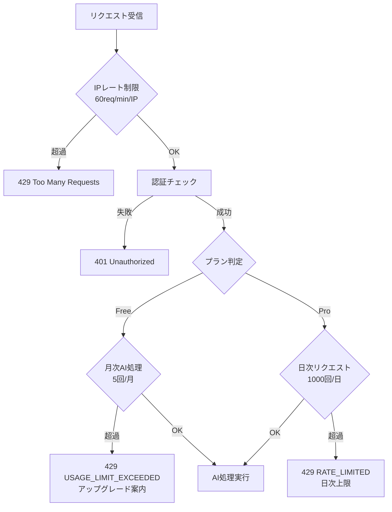

### 6.2 制限値の詳細

| レイヤー | 対象 | 制限値 | 実装方法 |
|:---------|:-----|:-------|:---------|
| L1: IP制限 | 全リクエスト | 60 req/min/IP | Cloudflare Rate Limiting Rules |
| L2: 認証エンドポイント | `/auth/*` | 10 req/min/IP | Cloudflare Rate Limiting Rules |
| L3: 無料プランAI処理 | `/ai/process` | 5 回/月/ユーザー | KV Store カウンター |
| L4: Proプラン日次制限 | `/ai/process`, `/stt/transcribe` | 1000 回/日/ユーザー | KV Store カウンター |
| L5: ペイロードサイズ | 全エンドポイント | JSON: 1MB, Audio: 25MB | Worker内バリデーション |

### 6.3 Cloudflare Rate Limiting 設定

```typescript
// wrangler.toml での Rate Limiting 設定は Cloudflare Dashboard で行う
// 以下は設定の概要

/**
 * Rule 1: 全体IPレート制限
 * - Expression: (http.request.uri.path contains "/api/v1/")
 * - Rate: 60 requests per 1 minute
 * - Per: IP
 * - Action: Block (429)
 * - Duration: 60 seconds
 */

/**
 * Rule 2: 認証エンドポイント保護
 * - Expression: (http.request.uri.path contains "/api/v1/auth/")
 * - Rate: 10 requests per 1 minute
 * - Per: IP
 * - Action: Block (429)
 * - Duration: 300 seconds (ブルートフォース対策)
 */

/**
 * Rule 3: STTエンドポイント（大容量）
 * - Expression: (http.request.uri.path contains "/api/v1/stt/")
 * - Rate: 10 requests per 1 minute
 * - Per: IP
 * - Action: Block (429)
 * - Duration: 60 seconds
 */
```

### 6.4 アプリケーション層レート制限の擬似コード

```typescript
async function checkDailyRateLimit(
  userId: string,
  kv: KVNamespace
): Promise<{ allowed: boolean; remaining: number; resetsAt: string }> {
  // JST基準の日付
  const now = new Date();
  const jstOffset = 9 * 60 * 60 * 1000;
  const jstNow = new Date(now.getTime() + jstOffset);
  const dateKey = jstNow.toISOString().slice(0, 10); // YYYY-MM-DD

  const key = `rate:${userId}:${dateKey}`;
  const raw = await kv.get(key);
  const count = raw ? parseInt(raw, 10) : 0;

  const PRO_DAILY_LIMIT = 1000;

  if (count >= PRO_DAILY_LIMIT) {
    return {
      allowed: false,
      remaining: 0,
      resetsAt: `${dateKey}T00:00:00+09:00`, // 翌日JST 0:00
    };
  }

  await kv.put(key, String(count + 1), { expirationTtl: 86400 + 3600 }); // 25時間TTL

  return {
    allowed: true,
    remaining: PRO_DAILY_LIMIT - count - 1,
    resetsAt: getNextDayJST(jstNow),
  };
}
```

### 6.5 レスポンスヘッダー

レート制限の状態をレスポンスヘッダーで通知する。

```
X-RateLimit-Limit: 1000
X-RateLimit-Remaining: 958
X-RateLimit-Reset: 1742169600
Retry-After: 3600  (429レスポンス時のみ)
```

---

## 7. プライバシー・データポリシー実装

### 7.1 設計原則（REQ-008準拠）

REQ-008で定義された3つのデータ取り扱いポリシーを技術的に実装する。

| ポリシー | 技術的実装 |
|:---------|:-----------|
| (1) 送信テキストのサーバー側非保持 | Worker内でメモリ上のみ処理、KV/D1にテキスト保存なし |
| (2) LLM学習データへの利用禁止 | OpenAI API Zero Data Retention (ZDR) オプション使用 |
| (3) 処理完了後の即時削除 | Workerの実行コンテキスト終了で自動的にメモリ解放 |

### 7.2 データフロー上のプライバシー保護

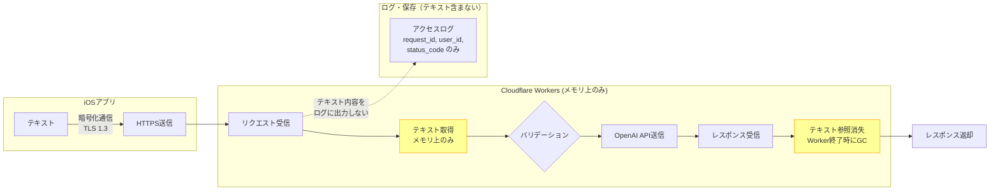

### 7.3 OpenAI API との DPA 準拠

```typescript
// OpenAI API呼び出し時の設定
const openaiRequest = {
  model: 'gpt-4o-mini',
  messages: [
    { role: 'system', content: SYSTEM_PROMPT },
    { role: 'user', content: userText },  // メモリ上のみ
  ],
  // データ保持に関する設定
  // OpenAI Business API / Zero Data Retention を使用
  // Organization設定でdata retention = 0に設定済み
};

// OpenAI APIへのリクエストヘッダー
const headers = {
  'Authorization': `Bearer ${env.OPENAI_API_KEY}`,
  'Content-Type': 'application/json',
  'OpenAI-Organization': env.OPENAI_ORG_ID,
  // OpenAI APIの利用規約に基づき、以下を保証:
  // - API経由のデータはモデルトレーニングに使用されない (2024年3月以降のデフォルト)
  // - Zero Data Retention対象の場合、処理後即座に削除
};
```

### 7.4 ログポリシー

ログに記録する情報と記録しない情報を厳密に定義する。

**記録する情報（ホワイトリスト方式）**

| フィールド | 例 | 目的 |
|:-----------|:---|:-----|
| request_id | `uuid-v4` | トレーサビリティ |
| user_id | `usr_xxx` | 利用状況追跡 |
| endpoint | `/api/v1/ai/process` | API利用分析 |
| status_code | `200` | エラー監視 |
| processing_time_ms | `1200` | パフォーマンス監視 |
| timestamp | ISO8601 | 時系列分析 |
| text_length | `1500` | 利用パターン分析 |

**記録しない情報（ブラックリスト）**

| 項目 | 理由 |
|:-----|:-----|
| リクエストボディのテキスト内容 | プライバシーポリシー (1) |
| AI処理の結果テキスト | プライバシーポリシー (1) |
| ユーザーのメールアドレス | 個人情報最小化 |
| IPアドレス（長期保存） | Cloudflareログで72時間保持後自動削除 |

```typescript
// ロギングユーティリティ
function createSafeLog(c: Context, startTime: number) {
  return {
    request_id: c.req.header('X-Request-ID'),
    user_id: c.get('user')?.id ?? 'anonymous',
    endpoint: c.req.path,
    method: c.req.method,
    status_code: c.res.status,
    processing_time_ms: Date.now() - startTime,
    text_length: c.req.header('Content-Length'),
    timestamp: new Date().toISOString(),
    // テキスト内容は絶対に含めない
  };
}
```

### 7.5 GDPR / 個人情報保護法への対応方針

| 要件 | 対応 |
|:-----|:-----|
| データ最小化原則 | テキストデータを保持しない。保持するのはuser_id、plan、usage_countのみ |
| 目的制限原則 | 収集データは認証・課金・レート制限の目的のみに使用 |
| 保存制限原則 | KVデータはTTLで自動削除。D1のユーザーデータはアカウント削除APIで完全消去 |
| 同意取得 | アプリ初回起動時のプライバシーポリシー同意画面 |
| データポータビリティ | ユーザーデータはローカルに保存されているため、アプリエクスポート機能で対応 |
| 削除権（忘れられる権利） | DELETE /api/v1/account エンドポイントで全データ削除 |

---

## 8. インフラ構成

### 8.1 Cloudflare Workers 構成

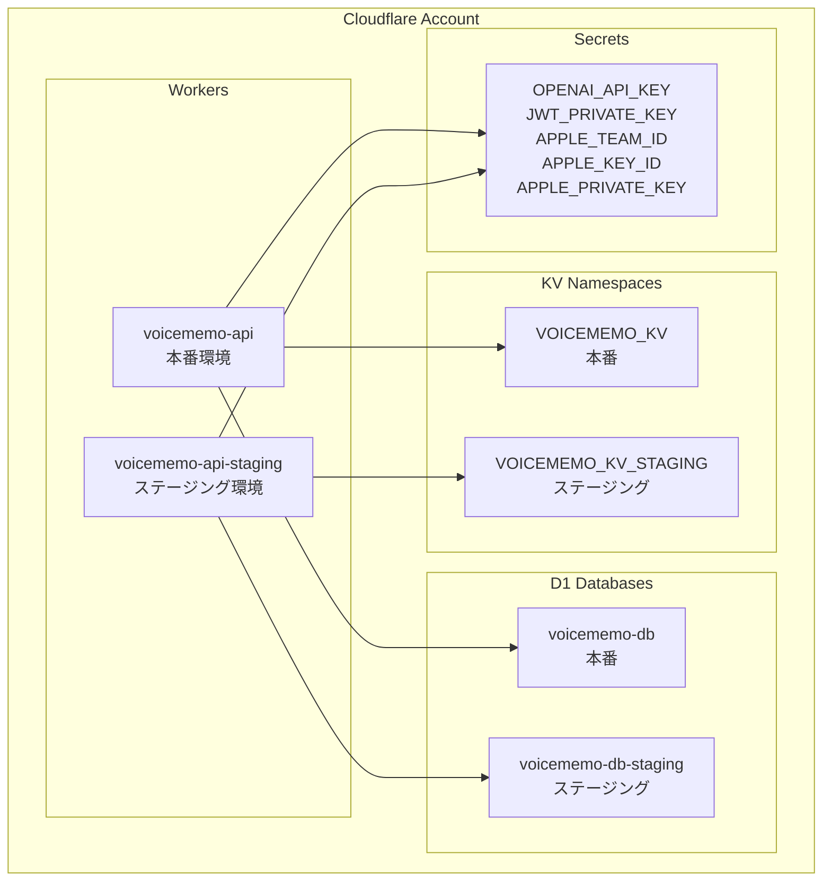

### 8.2 KV Namespace 設計

<!-- ※統合仕様書 v1.0 準拠: App Attest challenge用キーパターン追加 -->

| キーパターン | 値の例 | TTL | 用途 |
|:-------------|:-------|:----|:-----|
| `usage:{user_id}:{yyyy-mm}` | `{"count":3,"last_used_at":"..."}` | 月末+7日 | 月次AI処理カウント（REQ-011） |
| `rate:{user_id}:{yyyy-mm-dd}` | `"42"` | 25時間 | Proプラン日次レート制限 |
| `apple_keys:{kid}` | `{公開鍵JSON}` | 24時間 | Apple JWKS公開鍵キャッシュ |
| `sub_cache:{user_id}` | `{"plan":"pro","expires":"..."}` | 1時間 | 購読状態キャッシュ |
| `attest_challenge:{nonce}` | `{"created_at":"..."}` | 300秒 | App Attest用チャレンジnonce（使い捨て） |
| `attest_assertion_cache:{user_id}:{device_id}` | `{"verified_at":"..."}` | 300秒 | App Attest assertion検証結果キャッシュ（Option C用） |

### 8.3 D1 Database 設計

<!-- ※統合仕様書 v1.0 準拠: Critical #7 対応 — users テーブルに attest_key_id, attest_receipt 追加 -->
<!-- ※統合仕様書 v1.0 準拠: High対応 — device_id をマルチデバイス対応（user_devices テーブル分離） -->
<!-- ※統合仕様書 v1.0 準拠: Critical #6 対応 — webhook_events に notification_uuid UNIQUE追加 -->
<!-- ※統合仕様書 v1.0 準拠: Critical #5 対応 — subscriptions に app_account_token 追加 -->

#### テーブル: users

```sql
CREATE TABLE users (
    id TEXT PRIMARY KEY,                    -- usr_xxxxxxxxxxxx
    apple_user_id TEXT UNIQUE,              -- Apple Sign In ユーザーID（NULL可: デバイス認証の場合）
    email_relay TEXT,                       -- Apple Private Relay メール（NULL可）
    display_name TEXT,                      -- 表示名（NULL可）
    auth_method TEXT NOT NULL DEFAULT 'device', -- 'apple' | 'device'
    plan TEXT NOT NULL DEFAULT 'free',      -- 'free' | 'pro'
    apple_refresh_token TEXT,              -- Apple Sign In サーバー側refresh_token（暗号化保存）
    created_at TEXT NOT NULL,               -- ISO8601
    updated_at TEXT NOT NULL,               -- ISO8601
    last_login_at TEXT NOT NULL             -- ISO8601
);

CREATE INDEX idx_users_apple_user_id ON users(apple_user_id);
```

#### テーブル: user_devices（マルチデバイス対応）

```sql
-- ※統合仕様書 v1.0 準拠: High対応 — device_id をマルチデバイス対応
-- ※統合仕様書 v1.0 準拠: Critical #7 対応 — App Attest情報をデバイス単位で管理
CREATE TABLE user_devices (
    id TEXT PRIMARY KEY,                        -- dev_xxxxxxxxxxxx
    user_id TEXT NOT NULL REFERENCES users(id),
    device_id TEXT NOT NULL,                    -- デバイスUUID
    device_model TEXT,                          -- iPhone15,2 等
    os_version TEXT,                            -- 18.0 等
    app_version TEXT,                           -- 1.0.0 等
    attest_key_id TEXT,                         -- App Attest キーID（NULL可: 非対応端末）
    attest_public_key TEXT,                     -- App Attest 公開鍵（Base64 DER）
    attest_receipt TEXT,                        -- App Attest receipt（Base64）
    attest_counter INTEGER NOT NULL DEFAULT 0,  -- App Attest assertion カウンター
    attest_verified INTEGER NOT NULL DEFAULT 0, -- 1: attestation検証済み, 0: 未検証
    last_active_at TEXT NOT NULL,               -- 最終アクティブ日時
    created_at TEXT NOT NULL,
    updated_at TEXT NOT NULL,
    UNIQUE(user_id, device_id)
);

CREATE INDEX idx_user_devices_user_id ON user_devices(user_id);
CREATE INDEX idx_user_devices_device_id ON user_devices(device_id);
CREATE INDEX idx_user_devices_attest_key ON user_devices(attest_key_id);
```

#### テーブル: subscriptions

```sql
CREATE TABLE subscriptions (
    id TEXT PRIMARY KEY,                        -- sub_xxxxxxxxxxxx
    user_id TEXT NOT NULL REFERENCES users(id),
    product_id TEXT NOT NULL,                   -- io.murmurnote.pro.monthly
    original_transaction_id TEXT UNIQUE,        -- App Store Transaction ID
    app_account_token TEXT NOT NULL,            -- ★ appAccountToken (Critical #5)
    status TEXT NOT NULL DEFAULT 'active',      -- 'active' | 'expired' | 'billing_retry' | 'revoked' | 'refunded'
    auto_renew INTEGER NOT NULL DEFAULT 1,      -- 0 | 1
    expires_at TEXT NOT NULL,                   -- ISO8601
    grace_period_expires_at TEXT,               -- EC-015: 検証失敗時の猶予期限
    last_verified_at TEXT NOT NULL,             -- 最終検証日時
    created_at TEXT NOT NULL,
    updated_at TEXT NOT NULL
);

CREATE INDEX idx_subscriptions_user_id ON subscriptions(user_id);
CREATE INDEX idx_subscriptions_original_transaction_id ON subscriptions(original_transaction_id);
CREATE INDEX idx_subscriptions_app_account_token ON subscriptions(app_account_token);
CREATE INDEX idx_subscriptions_status ON subscriptions(status);
```

#### テーブル: refresh_tokens

```sql
CREATE TABLE refresh_tokens (
    id TEXT PRIMARY KEY,                        -- rt_xxxxxxxxxxxx
    user_id TEXT NOT NULL REFERENCES users(id),
    device_id TEXT NOT NULL,
    token_hash TEXT NOT NULL UNIQUE,            -- SHA-256ハッシュで保存
    expires_at TEXT NOT NULL,                   -- ISO8601
    created_at TEXT NOT NULL,
    used_at TEXT                                -- 使用済みの場合のタイムスタンプ
);

CREATE INDEX idx_refresh_tokens_user_id ON refresh_tokens(user_id);
CREATE INDEX idx_refresh_tokens_token_hash ON refresh_tokens(token_hash);
```

#### テーブル: webhook_events

```sql
-- ※統合仕様書 v1.0 準拠: Critical #6 対応 — notification_uuid UNIQUE制約追加
CREATE TABLE webhook_events (
    id TEXT PRIMARY KEY,                        -- evt_xxxxxxxxxxxx
    notification_uuid TEXT NOT NULL UNIQUE,     -- ★ Apple発行のnotificationUUID（冪等性キー）
    notification_type TEXT NOT NULL,            -- App Store通知タイプ
    subtype TEXT,                               -- サブタイプ
    original_transaction_id TEXT NOT NULL,
    signed_date TEXT NOT NULL,                  -- ★ 通知の署名日時（順序競合対策用）
    status TEXT NOT NULL DEFAULT 'processed',   -- 'processed' | 'skipped'
    processed_at TEXT NOT NULL,
    created_at TEXT NOT NULL
);

CREATE UNIQUE INDEX idx_webhook_notification_uuid ON webhook_events(notification_uuid);
CREATE INDEX idx_webhook_events_transaction ON webhook_events(original_transaction_id);
CREATE INDEX idx_webhook_events_signed_date ON webhook_events(original_transaction_id, signed_date);
```

### 8.4 ER図

<!-- ※統合仕様書 v1.0 準拠: user_devices テーブル追加、webhook_events に notification_uuid 追加 -->

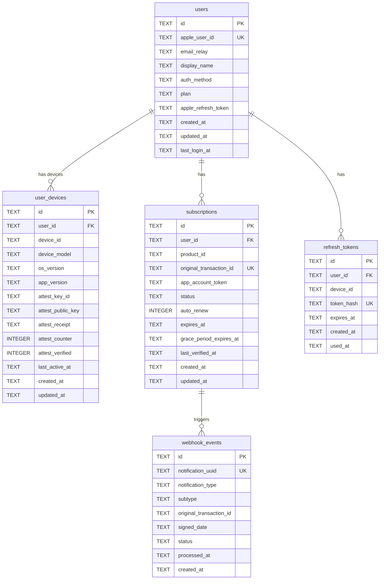

### 8.5 Wrangler 設定ファイル概要

```toml
# wrangler.toml
name = "voicememo-api"
main = "src/index.ts"
compatibility_date = "2026-03-01"
compatibility_flags = ["nodejs_compat"]

# Workers の実行環境
[placement]
mode = "smart"  # Smart Placementでレイテンシ最適化

# 本番環境
[env.production]
name = "voicememo-api"
routes = [
  { pattern = "api.voicememo.example.com/*", zone_name = "voicememo.example.com" }
]

# KV Namespace バインディング
[[env.production.kv_namespaces]]
binding = "KV"
id = "xxxxxxxxxxxxxxxxxxxxxxxxxxxxxxxx"

# D1 Database バインディング
[[env.production.d1_databases]]
binding = "DB"
database_name = "voicememo-db"
database_id = "xxxxxxxx-xxxx-xxxx-xxxx-xxxxxxxxxxxx"

# Secrets (wrangler secret put で設定)
# OPENAI_API_KEY
# JWT_PRIVATE_KEY
# JWT_PUBLIC_KEY
# APPLE_TEAM_ID
# APPLE_CLIENT_ID
# APPLE_KEY_ID
# APPLE_PRIVATE_KEY
# APPLE_ROOT_CA           # App Store / App Attest Root CA証明書
# APP_STORE_ISSUER_ID
# APP_STORE_KEY_ID
# APP_STORE_PRIVATE_KEY

# ステージング環境
[env.staging]
name = "voicememo-api-staging"
routes = [
  { pattern = "api-staging.voicememo.example.com/*", zone_name = "voicememo.example.com" }
]

[[env.staging.kv_namespaces]]
binding = "KV"
id = "yyyyyyyyyyyyyyyyyyyyyyyyyyyyyyyy"

[[env.staging.d1_databases]]
binding = "DB"
database_name = "voicememo-db-staging"
database_id = "yyyyyyyy-yyyy-yyyy-yyyy-yyyyyyyyyyyy"

# ビルド設定
[build]
command = "npm run build"

[dev]
port = 8787
local_protocol = "https"
```

### 8.6 Worker ルーター定義（Honoベース）

<!-- ※統合仕様書 v1.0 準拠: Critical #7 対応 — appAttestMiddleware追加 -->
<!-- ※統合仕様書 v1.0 準拠: APIパスの統一（命名規則に準拠） -->

```typescript
import { Hono } from 'hono';
import { cors } from 'hono/cors';
import { logger } from 'hono/logger';

interface Env {
  KV: KVNamespace;
  DB: D1Database;
  OPENAI_API_KEY: string;
  JWT_PRIVATE_KEY: string;
  JWT_PUBLIC_KEY: string;
  APPLE_TEAM_ID: string;
  APPLE_CLIENT_ID: string;    // Bundle ID
  APPLE_KEY_ID: string;
  APPLE_PRIVATE_KEY: string;
  APPLE_ROOT_CA: string;      // App Store Root CA証明書
  APP_STORE_ISSUER_ID: string;
  APP_STORE_KEY_ID: string;
  APP_STORE_PRIVATE_KEY: string;
}

const app = new Hono<{ Bindings: Env }>();

// グローバルミドルウェア
app.use('*', cors({
  origin: '*',  // iOSアプリからのリクエストのため全許可
  allowMethods: ['GET', 'POST', 'DELETE'],
  allowHeaders: [
    'Authorization', 'Content-Type',
    'X-App-Version', 'X-OS-Version', 'X-Device-ID',
    'X-Request-ID', 'X-App-Attest-Assertion',
  ],
}));

app.use('*', async (c, next) => {
  const start = Date.now();
  await next();
  // プライバシー安全なログ出力（テキスト内容を含まない）
  console.log(JSON.stringify(createSafeLog(c, start)));
});

// 認証不要エンドポイント
app.get('/api/v1/auth/challenge', handleChallenge);          // App Attest用チャレンジ発行
app.post('/api/v1/auth/apple-sign-in', handleAppleSignIn);   // ※統合仕様書 命名規則準拠: kebab-case
app.post('/api/v1/auth/device', handleDeviceAuth);           // デバイストークン認証 + App Attest attestation
app.post('/api/v1/auth/token/refresh', handleTokenRefresh);
app.post('/api/v1/subscription/webhook', handleAppStoreWebhook);

// 認証必須エンドポイント（JWT検証 + App Attest assertion検証）
app.use('/api/v1/ai/*', authMiddleware, appAttestMiddleware);
app.use('/api/v1/stt/*', authMiddleware, appAttestMiddleware);
app.use('/api/v1/usage', authMiddleware);
app.use('/api/v1/subscription/verify', authMiddleware, appAttestMiddleware);
app.use('/api/v1/account', authMiddleware);

app.post('/api/v1/ai/process', usageLimitMiddleware, handleAIProcess);
app.post('/api/v1/stt/transcribe', proOnlyMiddleware, handleSTTTranscribe);
app.get('/api/v1/usage', handleUsage);
app.post('/api/v1/subscription/verify', handleSubscriptionVerify);  // 購読検証
app.delete('/api/v1/account', handleAccountDeletion);                // アカウント削除

// ヘルスチェック
app.get('/health', (c) => c.json({ status: 'ok', timestamp: new Date().toISOString() }));

// 404ハンドラ
app.notFound((c) => c.json({ error: { code: 'NOT_FOUND', message: 'エンドポイントが見つかりません' } }, 404));

// エラーハンドラ
app.onError((err, c) => {
  console.error(`Error: ${err.message}`);
  return c.json({ error: { code: 'INTERNAL_ERROR', message: 'サーバー内部エラーが発生しました' } }, 500);
});

export default app;
```

### 8.7 Cloudflare Workers Free Plan の制約と対応

<!-- ※統合仕様書 v1.0 準拠: High対応 — Workers CPU time見積もりの再評価 -->

| 制約 | Free Plan | Paid Plan ($5/月) | 設計上の対応 |
|:-----|:----------|:-------------------|:-------------|
| リクエスト数 | 100,000/日 | 無制限 | 初期はFreeで十分。DAU 1,000超でPaidへ移行 |
| CPU時間 | 10ms/リクエスト | 30ms (50ms burst) | **下記CPU time詳細分析参照** |
| メモリ | 128MB | 128MB | テキストデータはストリーム処理。大きなペイロードは25MB制限で防御 |
| KV読み取り | 100,000/日 | 1,000万/日 | 使用量チェックで1リクエスト1-2回のKV読み取り |
| KV書き込み | 1,000/日 | 100万/日 | **注意**: Free Planでは1日1,000回の書き込み制限。DAU 100超で不足する可能性あり |
| D1読み取り | 500万行/日 | 500億行/日 | 十分な余裕 |
| D1書き込み | 100,000行/日 | 5,000万行/日 | 十分な余裕 |
| Worker サイズ | 1MB | 10MB | Honoベースの軽量設計で1MB以内に収める |

> **推奨**: MVP段階からCloudflare Workers Paid Plan ($5/月) を使用する。KV書き込み制限がFree Planのボトルネックになる可能性が高い。加えて、App Attest assertion検証のCPU time追加により、Free Planの10ms制約を超過する可能性がある。

#### Workers CPU time 詳細分析

App Attest導入に伴い、1リクエストあたりのCPU time見積もりを再評価する。

| 処理ステップ | CPU time見積もり | 備考 |
|:-------------|:----------------|:-----|
| JWT ES256検証 | ~1-2ms | hono/jwt ライブラリ |
| D1クエリ（ユーザー情報取得） | ~1-2ms | SQLite単一行取得 |
| App Attest assertion検証 | ~3-5ms | ECDSA署名検証 + CBOR解析 |
| D1クエリ（counter更新） | ~1ms | UPDATE文 |
| リクエストバリデーション | ~0.5ms | JSON Schema検証 |
| KV読み取り（使用量チェック） | ~0.5ms | 単一キー取得 |
| **合計（認証+バリデーション）** | **~7-11ms** | **Free Planの10ms制限に近い** |

**CPU time 10ms超過時の分離設計**:

Free Planの10ms制約を超過する場合、以下の分離設計を採用する。

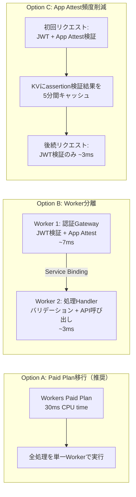

**推奨**: MVP段階ではOption A（Paid Plan移行）を採用。将来的にOption Cのassertionキャッシュを併用してCPU timeを最適化する。

---

## 9. コスト見積もり

### 9.1 Cloudflare 月額コスト

| サービス | Free Plan | Paid Plan ($5/月) | 備考 |
|:---------|:----------|:-------------------|:-----|
| Workers | $0 | $5 | 1,000万リクエスト/月含む |
| Workers (追加リクエスト) | — | $0.50/100万req | 超過分 |
| KV Storage | $0 (1GB) | $0.50/GB | 使用量データは軽量 |
| KV 読み取り | 含む | $0.50/1,000万req | |
| KV 書き込み | 含む | $0.50/100万req | |
| D1 Storage | $0 (5GB) | $0.75/GB超過分 | ユーザーデータは軽量 |
| D1 読み取り | 含む | $0.001/100万行 | |
| D1 書き込み | 含む | $0.001/100万行 | |
| カスタムドメイン | $0 | $0 | Cloudflare DNS使用 |
| Rate Limiting | 含む | 含む | Enterprise機能の一部はPaid |

### 9.2 OpenAI API 月間コスト見積もり

GPT-4o-mini（2026年3月時点想定）: 入力 $0.15/1M tokens, 出力 $0.60/1M tokens

**1回のAI処理あたりのトークン消費見積もり**

| 項目 | トークン数 | 備考 |
|:-----|:----------|:-----|
| システムプロンプト | ~500 | 要約・タグ・感情分析の指示 |
| ユーザーテキスト（5分録音相当） | ~1,500 | 日本語約2,000文字 |
| 出力（要約+タグ+感情） | ~800 | JSON構造化出力 |
| **合計** | **~2,800** | |

**1回あたりのAPI費用**: 入力2,000 tokens * $0.15/1M + 出力800 tokens * $0.60/1M ≈ **$0.0008/回**

#### ユーザー規模別月間コスト

| 規模 | DAU | Free AI処理/月 | Pro AI処理/月 | STT処理/月 | OpenAI API費用 | CF費用 | 合計 |
|:-----|:----|:---------------|:-------------|:-----------|:---------------|:-------|:-----|
| MVP | 10 | 50回 | 0回 | 0回 | ~$0.04 | $5 | **~$5** |
| 初期 | 100 | 300回 | 200回 | 100回 | ~$1.40 | $5 | **~$6** |
| 成長期 | 1,000 | 2,000回 | 3,000回 | 1,500回 | ~$11 | $5 | **~$16** |
| 拡大期 | 10,000 | 15,000回 | 30,000回 | 15,000回 | ~$96 | $10 | **~$106** |

> **Whisper API費用**: $0.006/分。Pro STT平均3分/回として $0.018/回。上表にはSTT費用も含む。

### 9.3 損益分岐点分析

#### 収入モデル

| プラン | 月額 | Apple手数料 (15%) | 純収入/ユーザー |
|:-------|:-----|:------------------|:---------------|
| Pro月額 | ¥500 | ¥75 | ¥425 (~$2.83) |
| Pro年額 | ¥4,800 (¥400/月) | ¥720 | ¥340/月 (~$2.27) |

> Apple手数料: Small Business Program適用（年収$1M以下で15%）

#### 損益分岐点

```
固定費: $5/月 (Cloudflare Workers Paid)
変動費/Pro: ~$0.04/月 (AI処理30回/月想定 + STT 10回/月)
変動費/Free: ~$0.004/月 (AI処理5回/月)

Pro 1ユーザーあたりの月間利益:
  $2.83 (純収入) - $0.04 (変動費) = $2.79

固定費回収に必要なProユーザー数:
  $5 / $2.79 ≈ 2人
```

**結論**: Proユーザー2人で固定費を回収でき、非常に健全なユニットエコノミクスを実現できる。

#### 規模別損益

| 規模 | 総ユーザー | Proユーザー (5%想定) | 月間収入 | 月間コスト | 月間利益 |
|:-----|:----------|:--------------------|:---------|:----------|:---------|
| MVP | 50 | 2 | $5.66 | $5 | **+$0.66** |
| 初期 | 500 | 25 | $70.75 | $7 | **+$63.75** |
| 成長期 | 5,000 | 250 | $707.50 | $20 | **+$687.50** |
| 拡大期 | 50,000 | 2,500 | $7,075 | $120 | **+$6,955** |

---

## 付録

### A. Worker ハンドラ実装例（AI処理）

```typescript
async function handleAIProcess(c: Context<{ Bindings: Env }>) {
  const startTime = Date.now();
  const user = c.get('user');

  // リクエストボディの取得（メモリ上のみ）
  const body = await c.req.json<AIProcessRequest>();

  // バリデーション
  if (!body.text || body.text.length === 0) {
    return c.json({ error: { code: 'INVALID_REQUEST', message: 'テキストが空です' } }, 400);
  }
  if (body.text.length > 30000) {
    return c.json({ error: { code: 'INVALID_REQUEST', message: 'テキストが長すぎます（上限30,000文字）' } }, 400);
  }

  // OpenAI API 呼び出し
  const systemPrompt = buildSystemPrompt(body.options, body.language);

  const openaiResponse = await fetch('https://api.openai.com/v1/chat/completions', {
    method: 'POST',
    headers: {
      'Authorization': `Bearer ${c.env.OPENAI_API_KEY}`,
      'Content-Type': 'application/json',
    },
    body: JSON.stringify({
      model: 'gpt-4o-mini',
      messages: [
        { role: 'system', content: systemPrompt },
        { role: 'user', content: body.text },
      ],
      response_format: { type: 'json_object' },
      temperature: 0.3,
      max_tokens: 2000,
    }),
  });

  if (!openaiResponse.ok) {
    const errBody = await openaiResponse.text();
    console.error(`OpenAI API error: ${openaiResponse.status}`);
    return c.json({ error: { code: 'UPSTREAM_ERROR', message: 'AI処理に失敗しました' } }, 502);
  }

  const aiResult = await openaiResponse.json<OpenAIResponse>();
  const parsed = JSON.parse(aiResult.choices[0].message.content);

  // body.text への参照はここ以降不要（GC対象になる）
  // 明示的な参照消去（防御的コーディング）
  // ※ Workerの実行コンテキスト終了時に全メモリが解放される

  // 使用量情報の取得（usageLimitMiddlewareで既にセット済み）
  const usageInfo = c.get('usageInfo');

  return c.json({
    summary: parsed.summary,
    tags: parsed.tags,
    sentiment: parsed.sentiment,
    usage: usageInfo,
    metadata: {
      model: aiResult.model,
      processing_time_ms: Date.now() - startTime,
      request_id: c.req.header('X-Request-ID'),
    },
  });
}

// ※統合仕様書 v1.0 準拠: 感情分析を8カテゴリ（EmotionCategory）方式に統一
function buildSystemPrompt(
  options: { summary?: boolean; tags?: boolean; sentiment?: boolean },
  language: string
): string {
  const tasks: string[] = [];

  if (options.summary !== false) {
    tasks.push(`"summary": {"title": "20文字以内のタイトル", "brief": "1-2行の要約", "key_points": ["要点1", "要点2"] (最大5個)}`);
  }
  if (options.tags !== false) {
    tasks.push(`"tags": [{"label": "タグ名(15文字以内)", "confidence": 0.0-1.0}] (最大10個、内容に基づく分類タグ)`);
  }
  if (options.sentiment !== false) {
    tasks.push(`"sentiment": {
    "primary": "最も支配的な感情カテゴリ (joy|calm|anticipation|sadness|anxiety|anger|surprise|neutral)",
    "scores": {"joy": 0.0-1.0, "calm": 0.0-1.0, "anticipation": 0.0-1.0, "sadness": 0.0-1.0, "anxiety": 0.0-1.0, "anger": 0.0-1.0, "surprise": 0.0-1.0, "neutral": 0.0-1.0} (合計1.0),
    "evidence": [{"text": "根拠テキスト", "emotion": "カテゴリ名"}] (最大3件)
  }`);
  }

  return `あなたは音声メモの分析アシスタントです。以下のテキストを分析し、JSON形式で結果を返してください。
言語: ${language === 'ja' ? '日本語' : 'English'}

出力フォーマット:
{
  ${tasks.join(',\n  ')}
}

要約は簡潔かつ情報量豊富に。タグは内容のカテゴリを反映。
感情分析は以下の8カテゴリで分類してください:
- joy (喜び), calm (安心), anticipation (期待), sadness (悲しみ)
- anxiety (不安), anger (怒り), surprise (驚き), neutral (中立)
scoresの合計は1.0になるようにしてください。`;
}
```

### B. セキュリティチェックリスト

<!-- ※統合仕様書 v1.0 準拠: App Attest、appAccountToken関連のチェック項目追加 -->

| カテゴリ | チェック項目 | 対応 |
|:---------|:-------------|:-----|
| APIキー管理 | OpenAI APIキーがクライアントに露出しない | Workers Secretsに保存 |
| APIキー管理 | APIキーがログに出力されない | ログフィルタリング実装 |
| 認証 | JWTの署名検証にES256を使用 | Hono JWT middleware |
| 認証 | Refresh tokenのローテーション | 1回使い捨て + ハッシュ保存 |
| 認証 | Apple ID tokenの署名検証（iss/aud/exp/nonce全項目） | Apple公開鍵 + Claims全検証 |
| 認証 | authorization_codeのサーバーサイド交換 | Apple token endpointでrefresh_token取得 |
| デバイス認証 | App Attest attestation検証（Critical #7） | Apple App Attest Root CA検証 |
| デバイス認証 | App Attest assertion検証（リプレイ防止カウンタ含む） | ECDSA署名検証 + counter単調増加チェック |
| デバイス認証 | App Attest非対応端末のフォールバック制限 | 制限付き認証（月3回AI処理制限） |
| 通信 | TLS 1.3以上の強制 | Cloudflareデフォルト設定 |
| 通信 | HSTS有効化 | Cloudflare設定 |
| 入力検証 | テキスト長の上限チェック | 30,000文字制限 |
| 入力検証 | 音声ファイルサイズの上限チェック | 25MB制限 |
| レート制限 | IP単位のレート制限 | Cloudflare Rate Limiting |
| レート制限 | ブルートフォース対策（認証エンドポイント） | 10 req/min/IP |
| データ保護 | テキストの非永続化 | メモリ上のみで処理 |
| データ保護 | ログに個人データを含めない | ホワイトリスト方式 |
| 課金 | appAccountTokenによる購入者紐付け検証（Critical #5） | user_id → UUID決定論的生成 → 一致確認 |
| 課金 | App Store通知のJWS署名検証 | Apple Root CA検証 |
| 課金 | Webhook冪等性（notificationUUID）（Critical #6） | webhook_eventsテーブルUNIQUE制約 |
| 課金 | Webhook順序競合対策（signedDate比較） | 古いイベントの棄却 |

### C. 開発・デプロイフロー

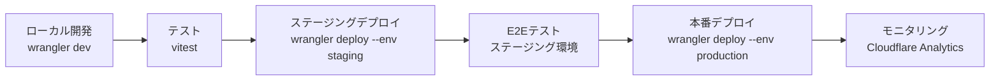

### D. 用語集

| 用語 | 定義 |
|:-----|:-----|
| Backend Proxy | iOSアプリとLLM APIの間に配置される中継サーバー |
| Cloudflare Workers | Cloudflareのエッジコンピューティングプラットフォーム |
| KV (Key-Value) Store | Cloudflare Workersのグローバル分散KVストレージ |
| D1 | Cloudflare Workersのサーバーレスsqliteデータベース |
| Hono | Cloudflare Workers向け軽量Webフレームワーク |
| JWS | JSON Web Signature。App Store通知の署名形式 |
| JWT | JSON Web Token。認証トークンの形式 |
| DPA | Data Processing Agreement。データ処理契約 |
| ZDR | Zero Data Retention。OpenAI APIのデータ非保持オプション |
| Smart Placement | Cloudflare Workersの自動配置最適化機能 |

---

> **文書履歴**
> | バージョン | 日付 | 変更内容 |
> |:-----------|:-----|:---------|
> | 1.0 | 2026-03-16 | 初版作成 |
> | 1.1 | 2026-03-16 | 統合仕様書 (INT-SPEC-001) v1.0 準拠の修正適用。Critical #5(appAccountToken紐付け), Critical #6(notificationUUID冪等性), Critical #7(App Attest導入)対応。High: 感情分析8カテゴリ方式統一、APIパス命名規則統一、user_devicesテーブル分離、Apple Sign In検証強化、signedDate順序競合対策、CPU time再評価、KVカウンタD1移行パス明記 |
