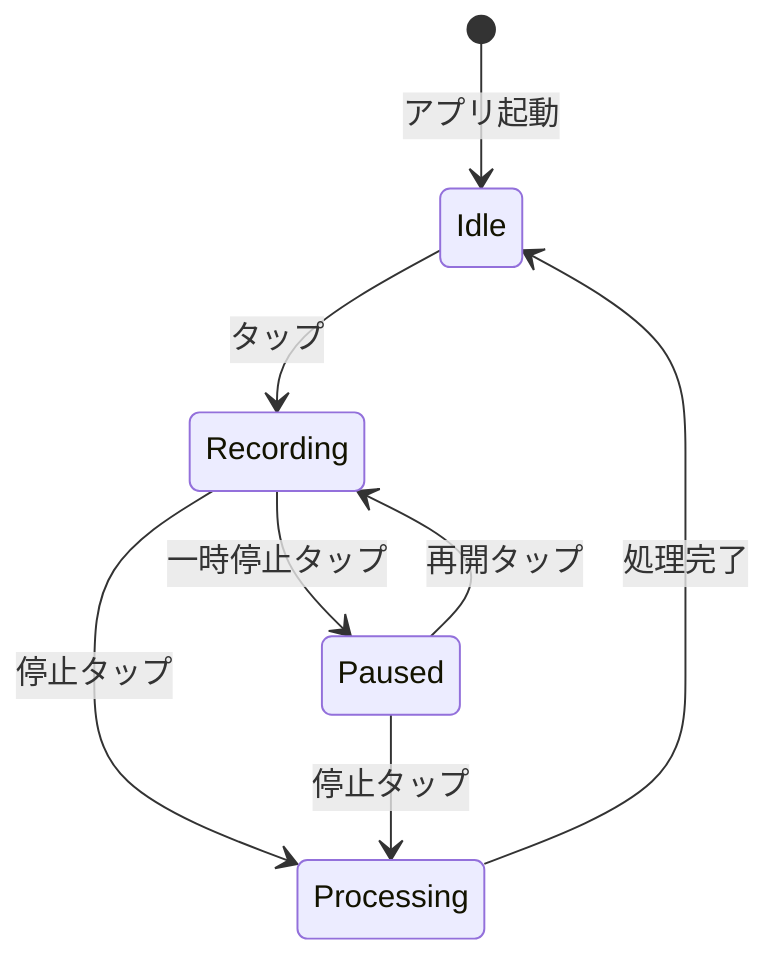
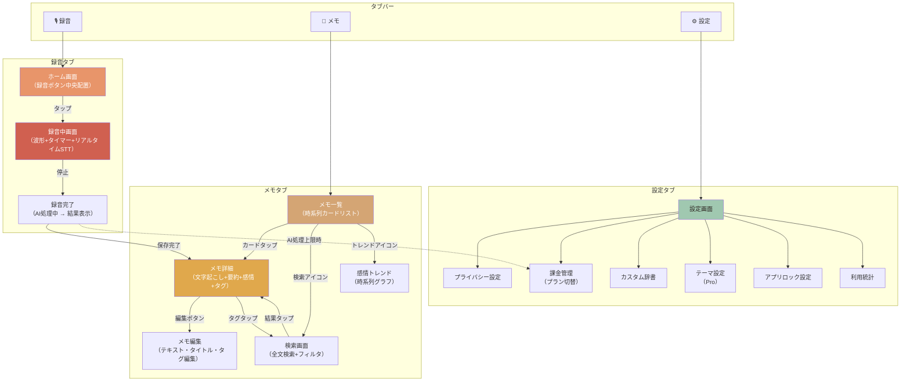
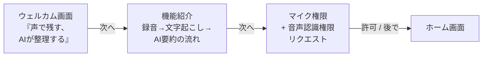

# AI音声メモ・日記アプリ UIデザインシステム設計書

> **文書ID**: DESIGN-004
> **バージョン**: 1.1
> **作成日**: 2026-03-16
> **最終更新**: 2026-03-16（統合仕様書 v1.0 準拠修正）
> **ステータス**: ドラフト
> **準拠要件**: NFR-012, NFR-013, NFR-014, NFR-015, NFR-016
> **準拠**: 統合インターフェース仕様書 INT-SPEC-001 v1.0

---

## 1. デザイン原則

### 1.1 コアプリンシプル

本アプリのUIは以下の3つの原則に基づいて設計する。

#### 原則1: 即時性（Immediacy）

> 思いついた瞬間に録音を開始できること。UIは思考を妨げない。

- ホーム画面 = 録音画面。アプリを開いた瞬間に録音ボタンが視界に入る
- 録音開始まで最大1タップ（NFR-014: 録音開始→保存まで最大3タップ）
- 情報の階層を最小化し、認知負荷を下げる
- ウィジェットからのワンタップ録音（REQ-029）を将来サポート

#### 原則2: 温かみ（Warmth）

> 機械的でなく、手書きの日記帳を開くような親しみやすさ。

- 暖色系パレット（HSB色相20-40）で安心感を演出（NFR-012）
- 角丸12pt以上でやわらかい印象を統一（NFR-012）
- 丸ゴシック系フォントで親しみやすさを表現（NFR-012）
- 感情分析の可視化は直感的なアイコンと色で表現し、数値的・分析的な印象を避ける

#### 原則3: プライバシー安心感（Privacy Assurance）

> ユーザーの個人的な思考を預かるアプリとして、安心して使える信頼感。

- ローカル保存を示す視覚的インジケータ（端末アイコン + 「このデバイスに保存」ラベル）
- クラウド送信時は明示的な通知と処理状況表示
- 生体認証ロック設定の分かりやすい導線（REQ-027）
- プライバシー関連の設定項目はグルーピングして分かりやすく表示

### 1.2 競合との差別化ポイント

| 観点 | muute | Murmur | Untold | 本アプリ |
|:-----|:------|:-------|:-------|:---------|
| 入力方式 | テキスト主体 | 音声 | 音声+テキスト | **音声ファースト**（ワンタップ録音） |
| AIフィードバック | 感情分析あり | 要約あり | 限定的 | **要約+タグ+感情の3点セット** |
| プライバシー表現 | 暗黙的 | 暗黙的 | 暗黙的 | **明示的**（保存先表示、送信通知） |
| トーン | ミニマル・モダン | テック寄り | ジャーナル風 | **温かみ+ジャーナル風**（暖色+丸ゴシック） |
| オフライン | 非対応 | 非対応 | 一部対応 | **完全オフライン動作**（REQ-009） |

差別化の核は「音声ファースト × 温かみデザイン × プライバシー可視化」の統合体験である。

---

## 2. カラーシステム

### 2.1 プライマリカラー

アプリの主要色。暖色系で温かみを表現し、NFR-012の指標（HSB色相20-40）を厳守する。

| 名称 | Hex | HSB | 用途 |
|:-----|:----|:----|:-----|
| Primary | `#E8956A` | H:20 S:54 B:91 | CTA、録音ボタン、主要アクション |
| Primary Light | `#F2B896` | H:25 S:38 B:95 | カード背景、ハイライト |
| Primary Dark | `#C46E45` | H:20 S:65 B:77 | 押下状態、アクティブタブ |

### 2.2 セカンダリカラー

| 名称 | Hex | HSB | 用途 |
|:-----|:----|:----|:-----|
| Secondary | `#D4A574` | H:30 S:45 B:83 | サブアクション、セカンダリUI |
| Secondary Light | `#E8C9A8` | H:30 S:28 B:91 | セクション背景 |
| Secondary Dark | `#A67B4F` | H:30 S:53 B:65 | テキストアクセント |

### 2.3 アクセントカラー

| 名称 | Hex | HSB | 用途 |
|:-----|:----|:----|:-----|
| Accent | `#E0A84C` | H:40 S:66 B:88 | バッジ、通知、ハイライト |
| Accent Light | `#F0CC82` | H:40 S:46 B:94 | タグ背景 |
| Accent Dark | `#B8882E` | H:40 S:75 B:72 | アクセントテキスト |

### 2.4 ニュートラルカラー

| 名称 | Hex | 用途 |
|:-----|:----|:-----|
| Background | `#FDF8F3` | メイン背景（Light） |
| Surface | `#FFFFFF` | カード、シート |
| Surface Variant | `#F5EDE4` | セクション区切り |
| Text Primary | `#2C2420` | 本文テキスト |
| Text Secondary | `#6B5D52` | 補助テキスト |
| Text Tertiary | `#A09487` | プレースホルダ |
| Divider | `#E8DDD2` | 区切り線 |

### 2.5 セマンティックカラー（感情カテゴリ別）

<!-- ※統合仕様書 v1.0 準拠: EmotionCategory enum統一、NFR-012(HSB色相20-40)適用範囲の明確化 -->

感情分析結果の可視化に使用する8段階の感情カラー（詳細は第9章参照）。

> **NFR-012 との関係について（※統合仕様書 v1.0 準拠）**: NFR-012 はアプリ全体のトーン（プライマリ・セカンダリ・アクセント）に対して HSB 色相 20-40 の暖色系を規定している。感情カテゴリカラーは **セマンティックカラー**（機能的意味を持つ色）であり、各感情を直感的に識別するために固有の色相を割り当てている。これらは NFR-012 の HSB 色相 20-40 制約の **適用範囲外** であり、感情の識別性・直感性を優先する。ただし、彩度と明度は全体の温かみトーンと調和するよう抑えた配色としている。

| 感情 | enum値 | Hex | HSB | アイコン | NFR-012 |
|:-----|:-------|:----|:----|:---------|:--------|
| 喜び（Joy） | `joy` | `#F0A848` | H:36 S:70 B:94 | sun.max.fill | 範囲内 |
| 期待（Anticipation） | `anticipation` | `#E8B060` | H:35 S:59 B:91 | leaf.fill | 範囲内 |
| 安心（Calm） | `calm` | `#8BC4A0` | H:145 S:29 B:77 | shield.fill | セマンティック（範囲外） |
| 驚き（Surprise） | `surprise` | `#C8A0E0` | H:272 S:30 B:88 | bolt.fill | セマンティック（範囲外） |
| 悲しみ（Sadness） | `sadness` | `#7AAAC8` | H:200 S:39 B:78 | cloud.rain.fill | セマンティック（範囲外） |
| 怒り（Anger） | `anger` | `#D88070` | H:10 S:49 B:85 | flame.fill | セマンティック（範囲外） |
| 不安（Anxiety） | `anxiety` | `#A890B8` | H:270 S:22 B:72 | cloud.fog.fill | セマンティック（範囲外） |
| 中立（Neutral） | `neutral` | `#A0C8B0` | H:150 S:22 B:78 | wind | セマンティック（範囲外） |

### 2.6 システムカラー

| 名称 | Hex | 用途 |
|:-----|:----|:-----|
| Success | `#5DAA68` | 保存完了、成功通知 |
| Warning | `#E0A030` | AI処理残回数少、ストレージ警告 |
| Error | `#D06050` | エラー表示 |
| Info | `#6098C0` | 情報通知 |

### 2.7 ダークモード対応カラー（NFR-013）

| 名称 | Light | Dark | 備考 |
|:-----|:------|:-----|:-----|
| Background | `#FDF8F3` | `#1C1816` | 暖色系ダーク |
| Surface | `#FFFFFF` | `#2C2420` | カード背景 |
| Surface Variant | `#F5EDE4` | `#3C3430` | セクション区切り |
| Text Primary | `#2C2420` | `#F0E8E0` | 本文テキスト |
| Text Secondary | `#6B5D52` | `#B0A498` | 補助テキスト |
| Text Tertiary | `#A09487` | `#786C60` | プレースホルダ |
| Divider | `#E8DDD2` | `#4C4038` | 区切り線 |
| Primary | `#E8956A` | `#F0A07A` | 明度を上げて視認性確保 |
| Accent | `#E0A84C` | `#F0B860` | 明度を上げて視認性確保 |

### 2.8 SwiftUI Color定義

```swift
// MARK: - Design System Colors

import SwiftUI

extension Color {
    // MARK: Primary
    static let vmPrimary = Color(hue: 20/360, saturation: 0.54, brightness: 0.91)
    static let vmPrimaryLight = Color(hue: 25/360, saturation: 0.38, brightness: 0.95)
    static let vmPrimaryDark = Color(hue: 20/360, saturation: 0.65, brightness: 0.77)

    // MARK: Secondary
    static let vmSecondary = Color(hue: 30/360, saturation: 0.45, brightness: 0.83)
    static let vmSecondaryLight = Color(hue: 30/360, saturation: 0.28, brightness: 0.91)
    static let vmSecondaryDark = Color(hue: 30/360, saturation: 0.53, brightness: 0.65)

    // MARK: Accent
    static let vmAccent = Color(hue: 40/360, saturation: 0.66, brightness: 0.88)
    static let vmAccentLight = Color(hue: 40/360, saturation: 0.46, brightness: 0.94)
    static let vmAccentDark = Color(hue: 40/360, saturation: 0.75, brightness: 0.72)

    // MARK: Neutral (Asset Catalogで Light/Dark を管理)
    static let vmBackground = Color("VMBackground")
    static let vmSurface = Color("VMSurface")
    static let vmSurfaceVariant = Color("VMSurfaceVariant")
    static let vmTextPrimary = Color("VMTextPrimary")
    static let vmTextSecondary = Color("VMTextSecondary")
    static let vmTextTertiary = Color("VMTextTertiary")
    static let vmDivider = Color("VMDivider")

    // MARK: Semantic
    static let vmSuccess = Color(hex: "#5DAA68")
    static let vmWarning = Color(hex: "#E0A030")
    static let vmError = Color(hex: "#D06050")
    static let vmInfo = Color(hex: "#6098C0")
}

// MARK: - Emotion Colors
// ※統合仕様書 v1.0 準拠: EmotionCategory enum値に統一（trust→calm, fear→anxiety, calm→neutral）
// 感情カラーはセマンティックカラーであり、NFR-012(HSB色相20-40)の適用範囲外
enum EmotionColor {
    static let joy = Color(hue: 36/360, saturation: 0.70, brightness: 0.94)
    static let anticipation = Color(hue: 35/360, saturation: 0.59, brightness: 0.91)
    static let calm = Color(hue: 145/360, saturation: 0.29, brightness: 0.77)         // 旧: trust
    static let surprise = Color(hue: 272/360, saturation: 0.30, brightness: 0.88)
    static let sadness = Color(hue: 200/360, saturation: 0.39, brightness: 0.78)
    static let anger = Color(hue: 10/360, saturation: 0.49, brightness: 0.85)
    static let anxiety = Color(hue: 270/360, saturation: 0.22, brightness: 0.72)       // 旧: fear
    static let neutral = Color(hue: 150/360, saturation: 0.22, brightness: 0.78)       // 旧: calm
}
```

---

## 3. タイポグラフィ

### 3.1 フォントファミリー

| 用途 | フォント | 理由 |
|:-----|:---------|:-----|
| 本文・日記テキスト | **Hiragino Maru Gothic ProN** | NFR-012準拠。丸ゴシック系で温かみと可読性を両立 |
| UI要素（ボタン・ラベル） | **SF Pro Rounded** | Apple標準丸ゴシック。システムUIとの親和性 |
| 数値・タイマー | **SF Mono Rounded** | 等幅で録音時間表示に最適 |
| 文字起こしテキスト | **Hiragino Maru Gothic ProN** | 本文と統一し、読みやすさを確保 |

### 3.2 フォントスケール

| スタイル | サイズ(pt) | Weight | Line Height | 用途 |
|:---------|:-----------|:-------|:------------|:-----|
| Large Title | 34 | Bold | 41 | 画面タイトル（設定、検索） |
| Title 1 | 28 | Bold | 34 | セクションヘッダー |
| Title 2 | 22 | Bold | 28 | カードタイトル、メモタイトル |
| Title 3 | 20 | Semibold | 25 | サブセクション |
| Headline | 17 | Semibold | 22 | 強調テキスト、ボタンラベル |
| Body | 17 | Regular | 22 | 本文テキスト、文字起こし |
| Callout | 16 | Regular | 21 | 補足説明 |
| Subheadline | 15 | Regular | 20 | メタ情報（日時、タグ） |
| Footnote | 13 | Regular | 18 | 注釈、制限表示 |
| Caption 1 | 12 | Regular | 16 | ラベル、バッジテキスト |
| Caption 2 | 11 | Regular | 13 | 最小テキスト |
| Timer | 48 | Light | 58 | 録音タイマー（SF Mono Rounded） |

### 3.3 SwiftUI Font定義

<!-- ※統合仕様書 v1.0 準拠: 全Font.custom定義にrelativeTo:パラメータを追加しDynamic Type対応 -->

```swift
// MARK: - Design System Typography
// ※統合仕様書 v1.0 準拠: 全Font.custom定義にrelativeTo:パラメータを追加

import SwiftUI

extension Font {
    // 本文・日記テキスト用
    // ※統合仕様書 v1.0 準拠: relativeTo: を指定しDynamic Typeスケーリングに対応
    static func vmBody(_ size: CGFloat = 17) -> Font {
        .custom("HiraMaruProN-W4", size: size, relativeTo: .body)
    }

    static func vmBodyBold(_ size: CGFloat = 17) -> Font {
        .custom("HiraMaruProN-W4", size: size, relativeTo: .body).bold()
    }

    // UI要素用（SF Pro Roundedはシステムフォントのrounded designで取得）
    // ※system fontは自動的にDynamic Typeに対応
    static func vmUI(_ size: CGFloat = 17, weight: Font.Weight = .regular) -> Font {
        .system(size: size, weight: weight, design: .rounded)
    }

    // タイマー表示用（固定サイズ: タイマー表示はレイアウト上固定が望ましい）
    static func vmTimer(_ size: CGFloat = 48) -> Font {
        .system(size: size, weight: .light, design: .monospaced)
    }

    // プリセット（※統合仕様書 v1.0 準拠: カスタムフォント使用箇所にrelativeTo:追加）
    static let vmLargeTitle = Font.vmUI(34, weight: .bold)
    static let vmTitle1 = Font.vmUI(28, weight: .bold)
    static let vmTitle2 = Font.vmUI(22, weight: .bold)
    static let vmTitle3 = Font.vmUI(20, weight: .semibold)
    static let vmHeadline = Font.vmUI(17, weight: .semibold)
    static let vmCallout = Font.custom("HiraMaruProN-W4", size: 16, relativeTo: .callout)
    static let vmSubheadline = Font.custom("HiraMaruProN-W4", size: 15, relativeTo: .subheadline)
    static let vmFootnote = Font.custom("HiraMaruProN-W4", size: 13, relativeTo: .footnote)
    static let vmCaption1 = Font.vmUI(12, weight: .regular)
    static let vmCaption2 = Font.vmUI(11, weight: .regular)
}
```

---

## 4. コンポーネントライブラリ

### 4.1 録音ボタン（RecordButton）

録音のCTA。アプリの最も重要なコンポーネント。

**状態遷移**:



**ビジュアル仕様**:

| 状態 | 外観 | サイズ | 色 |
|:-----|:-----|:------|:---|
| Idle | 丸形 + マイクアイコン | 80pt | Primary (`#E8956A`) |
| Recording | 丸形 + 波形アニメーション + パルス | 80pt | Error系赤 (`#D06050`) |
| Paused | 角丸正方形 + 一時停止アイコン | 80pt | Warning (`#E0A030`) |
| Processing | 丸形 + スピナー | 80pt | Primary Light (`#F2B896`) |

**SwiftUI擬似コード**:

<!-- ※統合仕様書 v1.0 準拠: Paused状態の形状を角丸正方形に修正（仕様とコードの統一） -->

```swift
struct RecordButton: View {
    @Binding var state: RecordingState
    let onTap: () -> Void
    @State private var pulseScale: CGFloat = 1.0

    var body: some View {
        ZStack {
            // パルスアニメーション（録音中）
            if state == .recording {
                Circle()
                    .fill(Color.vmError.opacity(0.2))
                    .frame(width: 120, height: 120)
                    .scaleEffect(pulseScale)
                    .animation(
                        .easeInOut(duration: 1.2).repeatForever(autoreverses: true),
                        value: pulseScale
                    )
            }

            // メインボタン
            // ※統合仕様書 v1.0 準拠: 状態別形状の統一
            // - Idle: 丸形（Circle）
            // - Recording: 丸形（Circle）+ パルスアニメーション
            // - Paused: 角丸正方形（RoundedRectangle）← 仕様とコードを統一
            // - Processing: 丸形（Circle）+ スピナー
            Group {
                if state == .paused {
                    RoundedRectangle(cornerRadius: 16)
                        .fill(buttonColor)
                        .frame(width: 80, height: 80)
                        .shadow(color: buttonColor.opacity(0.3), radius: 12, y: 4)
                } else {
                    Circle()
                        .fill(buttonColor)
                        .frame(width: 80, height: 80)
                        .shadow(color: buttonColor.opacity(0.3), radius: 12, y: 4)
                }
            }

            // アイコン
            buttonIcon
                .font(.system(size: 32, weight: .medium))
                .foregroundColor(.white)
        }
        .onTapGesture(perform: onTap)
        .accessibilityLabel(accessibilityLabel)
        .accessibilityHint(accessibilityHint)
    }

    private var buttonColor: Color {
        switch state {
        case .idle: return .vmPrimary
        case .recording: return .vmError
        case .paused: return .vmWarning
        case .processing: return .vmPrimaryLight
        }
    }

    private var buttonIcon: Image {
        switch state {
        case .idle: return Image(systemName: "mic.fill")
        case .recording: return Image(systemName: "stop.fill")
        case .paused: return Image(systemName: "pause.fill")
        case .processing: return Image(systemName: "arrow.triangle.2.circlepath")
        }
    }
}
```

### 4.2 メモカード（MemoCard）

一覧画面で使用するメモの概要表示カード。

**レイアウト仕様**:
- 角丸: 16pt（NFR-012: 12pt以上）
- パディング: 16pt
- カード間マージン: 12pt
- シャドウ: color=black/5%, blur=8pt, y=2pt

```
┌──────────────────────────────────────────┐
│  📅 2026年3月15日 14:32       🎙️ 3:24   │
│                                          │
│  通勤中に思いついたアプリのアイデア       │
│                                          │
│  今日の帰り道に考えていたんだけど、      │
│  音声メモアプリって意外と不便で...        │
│                                          │
│  ☀️ 喜び  [アイデア] [アプリ開発]        │
└──────────────────────────────────────────┘
```

**SwiftUI擬似コード**:

```swift
struct MemoCard: View {
    let memo: Memo

    var body: some View {
        VStack(alignment: .leading, spacing: 8) {
            // ヘッダー: 日時 + 録音時間
            HStack {
                Label(memo.formattedDate, systemImage: "calendar")
                    .font(.vmCaption1)
                    .foregroundColor(.vmTextSecondary)
                Spacer()
                Label(memo.formattedDuration, systemImage: "mic.fill")
                    .font(.vmCaption1)
                    .foregroundColor(.vmTextTertiary)
            }

            // タイトル
            Text(memo.title)
                .font(.vmTitle3)
                .foregroundColor(.vmTextPrimary)
                .lineLimit(1)

            // プレビューテキスト
            Text(memo.transcriptPreview)
                .font(.vmCallout)
                .foregroundColor(.vmTextSecondary)
                .lineLimit(2)

            // フッター: 感情バッジ + タグ
            HStack(spacing: 8) {
                if let emotion = memo.emotion {
                    EmotionBadge(emotion: emotion)
                }
                ForEach(memo.tags.prefix(3), id: \.self) { tag in
                    TagChip(text: tag)
                }
            }
        }
        .padding(16)
        .background(Color.vmSurface)
        .cornerRadius(16)
        .shadow(color: .black.opacity(0.05), radius: 8, y: 2)
    }
}
```

### 4.3 感情バッジ（EmotionBadge）

感情分析結果を小さなバッジで表示する。メモカードやメモ詳細画面で使用。

<!-- ※統合仕様書 v1.0 準拠: EmotionCategory enum値に統一 -->

| 感情 | enum値 | アイコン（SF Symbols） | 背景色 | テキスト色 |
|:-----|:-------|:----------------------|:-------|:-----------|
| 喜び | `joy` | `sun.max.fill` | Joy/20% | Joy |
| 期待 | `anticipation` | `leaf.fill` | Anticipation/20% | Anticipation |
| 安心 | `calm` | `shield.fill` | Calm/20% | Calm |
| 驚き | `surprise` | `bolt.fill` | Surprise/20% | Surprise |
| 悲しみ | `sadness` | `cloud.rain.fill` | Sadness/20% | Sadness |
| 怒り | `anger` | `flame.fill` | Anger/20% | Anger |
| 不安 | `anxiety` | `cloud.fog.fill` | Anxiety/20% | Anxiety |
| 中立 | `neutral` | `wind` | Neutral/20% | Neutral |

```swift
struct EmotionBadge: View {
    let emotion: EmotionCategory

    var body: some View {
        HStack(spacing: 4) {
            Image(systemName: emotion.iconName)
                .font(.vmCaption1)
            Text(emotion.label)
                .font(.vmCaption1)
        }
        .padding(.horizontal, 10)
        .padding(.vertical, 5)
        .background(emotion.color.opacity(0.2))
        .foregroundColor(emotion.color)
        .cornerRadius(12)
    }
}
```

### 4.4 タグチップ（TagChip）

メモに付与されたタグを表示する。

- 角丸: 12pt
- フォント: Caption1（12pt）
- 背景: Accent Light (`#F0CC82`) / Dark: `#4C4038`
- テキスト色: Accent Dark (`#B8882E`) / Dark: `#F0B860`

```swift
struct TagChip: View {
    let text: String

    var body: some View {
        Text(text)
            .font(.vmCaption1)
            .padding(.horizontal, 10)
            .padding(.vertical, 4)
            .background(Color.vmAccentLight)
            .foregroundColor(.vmAccentDark)
            .cornerRadius(12)
    }
}
```

### 4.5 AI要約カード（AISummaryCard）

メモ詳細画面でAI要約を表示するカード。

```
┌─ ✨ AI要約 ────────────────────────────┐
│                                         │
│  通勤中にアプリのアイデアを思いつき、   │
│  音声メモの不便さを解消するアプリの     │
│  構想をまとめた。主なポイントは...      │
│                                         │
│  ─────────────────────────────────      │
│  💡 キーポイント:                       │
│  ・ワンタップ録音の重要性               │
│  ・日本語STTの精度課題                  │
│  ・プライバシー配慮の差別化             │
│                                         │
└─────────────────────────────────────────┘
```

**仕様**:
- 背景: Primary Light (`#F2B896`) の10%透過
- ボーダー左: Primary 3pt（ジャーナル風のアクセント）
- 角丸: 16pt
- アイコン: `sparkles`（AI生成を示す）

```swift
struct AISummaryCard: View {
    let summary: AISummary

    var body: some View {
        VStack(alignment: .leading, spacing: 12) {
            // ヘッダー
            Label("AI要約", systemImage: "sparkles")
                .font(.vmHeadline)
                .foregroundColor(.vmPrimary)

            // 要約テキスト
            Text(summary.text)
                .font(.vmBody())
                .foregroundColor(.vmTextPrimary)

            if !summary.keyPoints.isEmpty {
                Divider()
                    .background(Color.vmDivider)

                // キーポイント
                VStack(alignment: .leading, spacing: 6) {
                    Label("キーポイント", systemImage: "lightbulb.fill")
                        .font(.vmSubheadline)
                        .foregroundColor(.vmSecondaryDark)
                    ForEach(summary.keyPoints, id: \.self) { point in
                        HStack(alignment: .top, spacing: 6) {
                            Text("・")
                            Text(point)
                                .font(.vmCallout)
                        }
                        .foregroundColor(.vmTextSecondary)
                    }
                }
            }
        }
        .padding(16)
        .background(Color.vmPrimaryLight.opacity(0.1))
        .overlay(
            Rectangle()
                .fill(Color.vmPrimary)
                .frame(width: 3),
            alignment: .leading
        )
        .cornerRadius(16)
    }
}
```

### 4.6 検索バー（SearchBar）

全文検索（REQ-006）および高度なフィルタリング（REQ-019）を提供する。

**仕様**:
- 角丸: 16pt
- 背景: Surface Variant
- アイコン: `magnifyingglass`
- プレースホルダ: 「メモを検索...」
- Proプラン時: フィルタボタン表示（タグ、感情、日付範囲）

```swift
struct VMSearchBar: View {
    @Binding var text: String
    @Binding var showFilters: Bool
    let isPro: Bool

    var body: some View {
        HStack(spacing: 12) {
            Image(systemName: "magnifyingglass")
                .foregroundColor(.vmTextTertiary)

            TextField("メモを検索...", text: $text)
                .font(.vmBody())

            if isPro {
                Button(action: { showFilters.toggle() }) {
                    Image(systemName: "line.3.horizontal.decrease.circle")
                        .foregroundColor(showFilters ? .vmPrimary : .vmTextTertiary)
                }
                .accessibilityLabel("フィルター")
            }
        }
        .padding(.horizontal, 16)
        .padding(.vertical, 12)
        .background(Color.vmSurfaceVariant)
        .cornerRadius(16)
    }
}
```

### 4.7 プラン切替UI（PlanSwitcher）

課金画面（REQ-024）で使用するプラン選択コンポーネント。

```
┌─────────────────────────────────────────┐
│            🌟 Proプラン                  │
│                                         │
│  ✅ クラウド高精度STT                    │
│  ✅ AI処理（要約・タグ・感情）無制限     │
│  ✅ 高度検索・フィルタ                   │
│  ✅ Markdownエクスポート                 │
│  ✅ テーマカスタマイズ                   │
│                                         │
│  ┌───────────────┐ ┌───────────────┐    │
│  │  ¥500/月      │ │ ¥4,800/年    │    │
│  │               │ │  🏷️ 2ヶ月お得 │    │
│  └───────────────┘ └───────────────┘    │
│                                         │
│  ┌─────────────────────────────────┐    │
│  │      Proプランを始める          │    │
│  └─────────────────────────────────┘    │
│                                         │
│  サブスクリプションはいつでもキャンセル可 │
└─────────────────────────────────────────┘
```

**仕様**:
- 月額/年額の切替: セグメンテッドコントロール風の2カードレイアウト
- 年額カードに「2ヶ月お得」バッジ
- CTAボタン: **CTA Primary色**（`#C46E45`、白文字コントラスト比4.5:1以上）（※統合仕様書 v1.0 準拠）、角丸16pt、高さ52pt
- 復元ボタン: テキストリンク、フッター配置

---

## 5. 画面フロー

### 5.1 タブ構成

アプリは3タブ構成とする。

| タブ | アイコン | ラベル | 主要画面 |
|:-----|:---------|:-------|:---------|
| Tab 1 | `mic.fill` | 録音 | ホーム（録音）画面 |
| Tab 2 | `doc.text.fill` | メモ | メモ一覧画面 |
| Tab 3 | `gearshape.fill` | 設定 | 設定画面 |

### 5.2 ナビゲーションフロー



### 5.3 オンボーディングフロー（NFR-016）



---

## 6. 主要画面ワイヤーフレーム

### 6.1 ホーム画面（録音画面）

アプリの中心画面。起動直後に表示される。REQ-001（ワンタップ録音）を実現する。

```
┌─────────────────────────────────────┐
│ ◀ 9:41                    🔋 100%  │ ← ステータスバー
├─────────────────────────────────────┤
│                                     │
│         こんにちは、今日は          │ ← 挨拶テキスト
│         何を記録しますか？          │    （時間帯で変化）
│                                     │
│                                     │
│                                     │
│                                     │
│            ╭────────╮              │
│           │  🎙️    │              │ ← 録音ボタン
│           │        │              │    80pt, Primary
│            ╰────────╯              │
│         タップして録音開始          │ ← ヒントテキスト
│                                     │
│                                     │
│  ┌─────────────────────────────┐   │
│  │ 📅 最近のメモ               │   │ ← 直近メモプレビュー
│  │ 通勤中のアイデアメモ  3分前  │   │   （最大2件）
│  │ 今日の振り返り      1時間前  │   │
│  └─────────────────────────────┘   │
│                                     │
├─────────────────────────────────────┤
│  [🎙️ 録音]  [📝 メモ]  [⚙️ 設定] │ ← タブバー
└─────────────────────────────────────┘
```

**録音中状態**:

```
┌─────────────────────────────────────┐
│ 🔴 録音中          9:41    🔋 100% │ ← 録音インジケータ
├─────────────────────────────────────┤
│                                     │
│            ⏱️ 02:34                 │ ← 録音タイマー
│                                     │    Timer font 48pt
│     ▁▂▃▅▇▅▃▂▁▂▃▅▇▅▃▂▁           │ ← 波形ビジュアライザ
│                                     │
│            ╭────────╮              │
│           │  ⏹️    │              │ ← 停止ボタン（赤）
│           │        │              │
│            ╰────────╯              │
│        ⏸️              🗑️          │ ← 一時停止 / 削除
│                                     │
│  ┌─────────────────────────────┐   │
│  │ リアルタイム文字起こし       │   │ ← STT結果表示
│  │                              │   │    スクロール可能
│  │ 今日は帰り道に考えていた     │   │
│  │ アプリのアイデアについて     │   │
│  │ まとめたいと思います。       │   │
│  │ 音声メモアプリって意外と|    │   │ ← カーソル（入力中）
│  └─────────────────────────────┘   │
│                                     │
├─────────────────────────────────────┤
│  [🎙️ 録音]  [📝 メモ]  [⚙️ 設定] │
└─────────────────────────────────────┘
```

### 6.2 メモ一覧画面

保存されたメモの時系列一覧（REQ-015）。

```
┌─────────────────────────────────────┐
│ ◀ 9:41                    🔋 100%  │
├─────────────────────────────────────┤
│                                     │
│  メモ                 📊  🔍       │ ← タイトル + トレンド + 検索
│                                     │
│  ┌─────────────────────────────┐   │
│  │ 🔍 メモを検索...            │   │ ← 検索バー（簡易）
│  └─────────────────────────────┘   │
│                                     │
│  今日                               │ ← 日付セクション
│  ┌─────────────────────────────┐   │
│  │ 📅 14:32           🎙️ 3:24 │   │
│  │ 通勤中に思いついたアイデア   │   │ ← メモカード
│  │ 今日の帰り道に考えていた...  │   │
│  │ ☀️ 喜び [アイデア][アプリ]   │   │
│  └─────────────────────────────┘   │
│                                     │
│  ┌─────────────────────────────┐   │
│  │ 📅 08:15           🎙️ 5:12 │   │
│  │ 朝の振り返り                 │   │ ← メモカード
│  │ 昨日のプレゼンを振り返って.. │   │
│  │ 🍃 平穏  [振り返り]         │   │
│  └─────────────────────────────┘   │
│                                     │
│  昨日                               │ ← 日付セクション
│  ┌─────────────────────────────┐   │
│  │ 📅 22:10           🎙️ 2:08 │   │
│  │ 寝る前のメモ                 │   │
│  │ 明日のミーティングで話す...  │   │
│  │ 🌱 期待  [仕事][TODO]       │   │
│  └─────────────────────────────┘   │
│                                     │
├─────────────────────────────────────┤
│  [🎙️ 録音]  [📝 メモ]  [⚙️ 設定] │
└─────────────────────────────────────┘
```

### 6.3 メモ詳細画面

メモの全情報を表示する画面。文字起こし、AI要約、感情分析、タグ、音声再生を統合。

```
┌─────────────────────────────────────┐
│ ◀ 戻る      9:41        ✏️  ···    │ ← ナビバー（編集 + メニュー）
├─────────────────────────────────────┤
│                                     │
│  通勤中に思いついたアイデア         │ ← タイトル（Title2: 22pt）
│  📅 2026/3/15 14:32   🎙️ 3:24     │ ← メタ情報
│                                     │
│  ┌─ 🔊 音声再生 ─────────────┐    │ ← 音声プレイヤー
│  │ ▶   advancement━━━━━ 1:23/3:24 │ │    （REQ-023）
│  └─────────────────────────────┘   │
│                                     │
│  ┌─ ☀️ 喜び ──────────────────┐   │ ← 感情バッジ（大）
│  │ 全体的にポジティブで、新しい │   │    + 感情説明
│  │ アイデアへの興奮が感じられます│   │
│  └─────────────────────────────┘   │
│                                     │
│  [アイデア] [アプリ開発] [音声メモ] │ ← タグ一覧
│                                     │
│  ┌─ ✨ AI要約 ────────────────┐   │ ← AI要約カード
│  │ 通勤中にアプリのアイデアを   │   │
│  │ 思いつき、音声メモの不便さを │   │
│  │ 解消するアプリの構想...      │   │
│  │ ─────────────────────       │   │
│  │ 💡 キーポイント:             │   │
│  │ ・ワンタップ録音の重要性     │   │
│  │ ・日本語STTの精度課題        │   │
│  │ ・プライバシー配慮の差別化   │   │
│  └─────────────────────────────┘   │
│                                     │
│  ── 文字起こし ──────────────      │ ← セクションヘッダー
│                                     │
│  今日は帰り道に考えていたアプリの   │ ← 文字起こし全文
│  アイデアについてまとめたいと思い   │    （スクロール）
│  ます。音声メモアプリって意外と     │
│  不便で、録音しても後から聞き返す   │
│  のが面倒だったりするんですよね。   │
│  ...                                │
│                                     │
│  ┌─────────────────────────────┐   │
│  │ 📱 このデバイスに保存        │   │ ← プライバシー表示
│  └─────────────────────────────┘   │
│                                     │
├─────────────────────────────────────┤
│  [🎙️ 録音]  [📝 メモ]  [⚙️ 設定] │
└─────────────────────────────────────┘
```

### 6.4 検索画面

全文検索（REQ-006）および高度フィルタリング（REQ-019, Proプラン）。

```
┌─────────────────────────────────────┐
│ ◀ 9:41                    🔋 100%  │
├─────────────────────────────────────┤
│                                     │
│  ┌─────────────────────────────┐   │
│  │ 🔍 メモを検索...       ⚙️  │   │ ← 検索バー + フィルタ
│  └─────────────────────────────┘   │
│                                     │
│  ┌─ フィルター（Pro） ────────┐   │ ← フィルターパネル
│  │                              │   │    （展開時のみ表示）
│  │ 感情: [全て▼]               │   │
│  │ ☀️  🌱  🛡️  ⚡  🌧️  🔥  🌫️  🍃 │   │
│  │                              │   │
│  │ 期間: [過去1週間▼]          │   │
│  │ タグ: [アイデア ×] [+追加]  │   │
│  └─────────────────────────────┘   │
│                                     │
│  3件の結果                          │ ← 検索結果カウント
│                                     │
│  ┌─────────────────────────────┐   │
│  │ 通勤中に思いついた【アイデア】│   │ ← ハイライト付き結果
│  │ 3/15  ☀️ 喜び  🎙️ 3:24     │   │
│  └─────────────────────────────┘   │
│  ┌─────────────────────────────┐   │
│  │ 新しい【アイデア】をメモ     │   │
│  │ 3/12  🌱 期待  🎙️ 1:45     │   │
│  └─────────────────────────────┘   │
│  ┌─────────────────────────────┐   │
│  │ アプリ【アイデア】の整理     │   │
│  │ 3/10  🍃 平穏  🎙️ 4:30     │   │
│  └─────────────────────────────┘   │
│                                     │
├─────────────────────────────────────┤
│  [🎙️ 録音]  [📝 メモ]  [⚙️ 設定] │
└─────────────────────────────────────┘
```

### 6.5 設定画面

```
┌─────────────────────────────────────┐
│ ◀ 9:41                    🔋 100%  │
├─────────────────────────────────────┤
│                                     │
│  設定                               │ ← Large Title
│                                     │
│  ── アカウント ──────────────      │
│  ┌─────────────────────────────┐   │
│  │ 📋 プラン     無料プラン  ▷ │   │ ← 課金管理へ
│  │ 🤖 AI処理残   3/5回     ▷  │   │ ← 残回数表示
│  └─────────────────────────────┘   │
│                                     │
│  ── 音声認識 ──────────────        │
│  ┌─────────────────────────────┐   │
│  │ 📖 カスタム辞書          ▷  │   │ ← REQ-025
│  │ 🌐 認識言語    日本語    ▷  │   │
│  └─────────────────────────────┘   │
│                                     │
│  ── プライバシー ──────────        │
│  ┌─────────────────────────────┐   │
│  │ 🔒 アプリロック       OFF ▷ │   │ ← REQ-027
│  │ 📱 データ保存先      端末   │   │ ← REQ-008
│  │ ☁️ iCloudバックアップ OFF   │   │ ← NFR-021
│  └─────────────────────────────┘   │
│                                     │
│  ── 表示 ──────────────            │
│  ┌─────────────────────────────┐   │
│  │ 🎨 テーマ      デフォルト ▷ │   │ ← REQ-020 (Pro)
│  │ 🌙 ダークモード    自動     │   │ ← NFR-013
│  └─────────────────────────────┘   │
│                                     │
│  ── その他 ──────────────          │
│  ┌─────────────────────────────┐   │
│  │ 📊 利用統計              ▷  │   │ ← REQ-030
│  │ 📄 プライバシーポリシー  ▷  │   │ ← NFR-011
│  │ ℹ️  アプリについて        ▷  │   │
│  └─────────────────────────────┘   │
│                                     │
├─────────────────────────────────────┤
│  [🎙️ 録音]  [📝 メモ]  [⚙️ 設定] │
└─────────────────────────────────────┘
```

---

## 7. アニメーション設計

### 7.1 録音波形のリアルタイムアニメーション

録音中に音声の振幅をリアルタイムで可視化するアニメーション。

**仕様**:
- バーの本数: 30本
- 更新頻度: 60fps（CADisplayLink連動）
- バーの高さ: 音声のdBレベルを0-60ptにマッピング
- バーの幅: 3pt、間隔: 2pt
- 角丸: 1.5pt（バー自体も角丸）
- 色: 録音状態に応じてPrimary → Error系にグラデーション
- スムージング: 前フレームとの線形補間（係数0.3）で滑らかに変化

```swift
struct WaveformView: View {
    @ObservedObject var audioMonitor: AudioLevelMonitor
    let barCount: Int = 30

    var body: some View {
        HStack(spacing: 2) {
            ForEach(0..<barCount, id: \.self) { index in
                RoundedRectangle(cornerRadius: 1.5)
                    .fill(
                        LinearGradient(
                            colors: [.vmPrimary, .vmError],
                            startPoint: .bottom,
                            endPoint: .top
                        )
                    )
                    .frame(width: 3, height: barHeight(for: index))
                    .animation(
                        .linear(duration: 1.0 / 60.0),
                        value: audioMonitor.levels[index]
                    )
            }
        }
        .frame(height: 60)
    }

    private func barHeight(for index: Int) -> CGFloat {
        let level = audioMonitor.levels[safe: index] ?? 0
        return max(4, CGFloat(level) * 60)
    }
}
```

### 7.2 画面遷移アニメーション

すべての画面遷移は統一されたスプリングカーブで行う。

| 遷移タイプ | Duration | Spring | 用途 |
|:-----------|:---------|:-------|:-----|
| Push / Pop | 350ms | response: 0.35, dampingFraction: 0.86 | 標準ナビゲーション |
| Modal Present | 400ms | response: 0.4, dampingFraction: 0.82 | シート表示 |
| Tab Switch | 200ms | response: 0.2, dampingFraction: 0.9 | タブ切替（クロスフェード） |
| Card Expand | 350ms | response: 0.35, dampingFraction: 0.8 | メモカード→詳細 |

```swift
// MARK: - Design System Animations

extension Animation {
    static let vmNavigationPush = Animation.spring(
        response: 0.35,
        dampingFraction: 0.86,
        blendDuration: 0
    )

    static let vmModalPresent = Animation.spring(
        response: 0.4,
        dampingFraction: 0.82,
        blendDuration: 0
    )

    static let vmTabSwitch = Animation.spring(
        response: 0.2,
        dampingFraction: 0.9,
        blendDuration: 0
    )

    static let vmCardExpand = Animation.spring(
        response: 0.35,
        dampingFraction: 0.8,
        blendDuration: 0
    )

    static let vmMicroInteraction = Animation.spring(
        response: 0.25,
        dampingFraction: 0.7,
        blendDuration: 0
    )
}
```

### 7.3 録音ボタンのパルスアニメーション

録音中に外側のリングがパルスする。

```swift
struct PulseRing: View {
    @State private var scale: CGFloat = 1.0
    @State private var opacity: Double = 0.6

    var body: some View {
        Circle()
            .stroke(Color.vmError.opacity(opacity), lineWidth: 2)
            .frame(width: 100, height: 100)
            .scaleEffect(scale)
            .onAppear {
                withAnimation(
                    .easeInOut(duration: 1.5)
                    .repeatForever(autoreverses: true)
                ) {
                    scale = 1.4
                    opacity = 0.0
                }
            }
    }
}
```

### 7.4 感情分析結果の表示アニメーション

AI処理完了後、感情バッジが弾むように表示される。

```swift
struct EmotionRevealAnimation: ViewModifier {
    let isVisible: Bool
    @State private var appeared = false

    func body(content: Content) -> some View {
        content
            .scaleEffect(appeared ? 1.0 : 0.3)
            .opacity(appeared ? 1.0 : 0.0)
            .onChange(of: isVisible) { newValue in
                if newValue {
                    withAnimation(.vmMicroInteraction) {
                        appeared = true
                    }
                }
            }
    }
}

// 使用例
EmotionBadge(emotion: .joy)
    .modifier(EmotionRevealAnimation(isVisible: analysisComplete))
```

### 7.5 AI要約カードの表示アニメーション

上から下へスライドしながらフェードイン。

```swift
struct SlideInFromTop: ViewModifier {
    let isVisible: Bool

    func body(content: Content) -> some View {
        content
            .offset(y: isVisible ? 0 : -20)
            .opacity(isVisible ? 1 : 0)
            .animation(.vmNavigationPush, value: isVisible)
    }
}
```

### 7.6 メモカードのスワイプアクション

左スワイプで削除、右スワイプでお気に入り。スプリングカーブで自然な戻り。

```swift
// スワイプアクションの閾値とアニメーション
struct SwipeActionConfig {
    static let deleteThreshold: CGFloat = -80
    static let favoriteThreshold: CGFloat = 80
    static let snapBackAnimation = Animation.spring(
        response: 0.3,
        dampingFraction: 0.75,
        blendDuration: 0
    )
}
```

---

## 8. アクセシビリティ設計

### 8.1 VoiceOver対応方針（NFR-015）

本アプリは音声入力が中心のため、VoiceOverユーザーにとっても操作可能であることを保証する。

**録音ボタン**:

```swift
// 状態に応じた動的ラベル
.accessibilityLabel(
    state == .idle ? "録音を開始" :
    state == .recording ? "録音中、\(formattedTime)経過" :
    state == .paused ? "録音を一時停止中" :
    "処理中"
)
.accessibilityHint(
    state == .idle ? "ダブルタップで録音を開始します" :
    state == .recording ? "ダブルタップで録音を停止します" :
    state == .paused ? "ダブルタップで録音を再開します" :
    "処理が完了するまでお待ちください"
)
.accessibilityAddTraits(state == .processing ? .updatesFrequently : [])
```

**メモカード**:

```swift
.accessibilityElement(children: .combine)
.accessibilityLabel("\(memo.title)、\(memo.formattedDate)、\(memo.formattedDuration)の録音")
.accessibilityHint("ダブルタップで詳細を表示します")
.accessibilityValue(memo.emotion?.label ?? "感情分析なし")
```

**感情バッジ**:

```swift
.accessibilityLabel("感情: \(emotion.label)")
```

**波形ビジュアライザ**:

```swift
// 視覚情報のため、テキスト代替を提供
.accessibilityLabel("音声波形")
.accessibilityValue("音声レベル: \(audioLevelDescription)")
```

### 8.2 VoiceOver対応方針一覧

| コンポーネント | accessibilityLabel | accessibilityHint | Traits |
|:---------------|:-------------------|:-------------------|:-------|
| 録音ボタン | 状態に応じて動的変更 | 操作方法を説明 | `.isButton` |
| メモカード | タイトル+日時+時間 | 「詳細を表示」 | `.isButton` |
| 感情バッジ | 「感情: {ラベル}」 | なし | `.isStaticText` |
| タグチップ | 「タグ: {テキスト}」 | 「検索で絞り込み」 | `.isButton` |
| AI要約カード | 「AI要約: {テキスト}」 | なし | `.isStaticText` |
| 検索バー | 「メモを検索」 | 「テキストを入力」 | `.isSearchField` |
| 波形ビジュアライザ | 「音声波形」 | なし | `.updatesFrequently` |
| プラン切替 | 「月額500円プラン / 年額4800円プラン」 | 「ダブルタップで選択」 | `.isButton` |

### 8.3 Dynamic Type対応（NFR-015）

すべてのテキスト要素はDynamic Typeに対応し、ユーザーのフォントサイズ設定に追従する。

**対応方針**:

1. **SwiftUIの `.font()` + `@ScaledMetric`**: カスタムフォントサイズもDynamic Typeに追従させる
2. **レイアウトの適応**: 大きいフォントサイズではHStackをVStackに切り替える
3. **最小タッチターゲット**: 44x44pt を確保（Dynamic Type拡大時も維持）

```swift
// Dynamic Type対応のカスタムフォント
// ※統合仕様書 v1.0 準拠: Font.custom に relativeTo: パラメータを使用する方式を推奨
// SwiftUI の Font.custom(_:size:relativeTo:) は自動的にDynamic Typeスケーリングに対応する

// 方式1（推奨）: Font.custom の relativeTo: パラメータ
// 全 Font.custom 定義に relativeTo: を指定することで、UIFontMetrics を使わずに
// SwiftUI ネイティブの Dynamic Type 対応が可能
extension Font {
    /// Dynamic Type対応カスタムフォント生成ヘルパー
    static func vmCustomScaled(
        _ name: String = "HiraMaruProN-W4",
        size: CGFloat,
        relativeTo textStyle: Font.TextStyle = .body
    ) -> Font {
        .custom(name, size: size, relativeTo: textStyle)
    }
}

// 方式2（フォールバック）: UIFontMetrics によるスケーリング
// relativeTo: が使用できないケース（iOS 14以前のサポートが必要な場合等）向け
struct ScaledFont: ViewModifier {
    @Environment(\.sizeCategory) var sizeCategory
    let baseSize: CGFloat
    let fontName: String
    let textStyle: Font.TextStyle

    func body(content: Content) -> some View {
        content.font(.custom(fontName, size: baseSize, relativeTo: textStyle))
    }
}

extension View {
    func vmScaledFont(
        size: CGFloat = 17,
        relativeTo textStyle: Font.TextStyle = .body
    ) -> some View {
        modifier(ScaledFont(baseSize: size, fontName: "HiraMaruProN-W4", textStyle: textStyle))
    }
}
```

**レイアウト適応例**:

```swift
struct AdaptiveMetaRow: View {
    @Environment(\.sizeCategory) var sizeCategory
    let date: String
    let duration: String

    var body: some View {
        if sizeCategory.isAccessibilityCategory {
            // アクセシビリティサイズ時: 縦積み
            VStack(alignment: .leading, spacing: 4) {
                Label(date, systemImage: "calendar")
                Label(duration, systemImage: "mic.fill")
            }
            .font(.vmCaption1)
        } else {
            // 通常サイズ: 横並び
            HStack {
                Label(date, systemImage: "calendar")
                Spacer()
                Label(duration, systemImage: "mic.fill")
            }
            .font(.vmCaption1)
        }
    }
}
```

### 8.4 コントラスト比の確保

<!-- ※統合仕様書 v1.0 準拠: CTAボタンのコントラスト比を4.5:1以上に修正 -->

WCAG 2.1 AA基準（通常テキスト4.5:1、大テキスト3:1）を満たすことを確認する。

| 組み合わせ | Light | Dark | 基準 | 判定 |
|:-----------|:------|:-----|:-----|:-----|
| Text Primary / Background | 12.8:1 | 13.1:1 | 4.5:1 | 合格 |
| Text Secondary / Background | 5.2:1 | 5.0:1 | 4.5:1 | 合格 |
| Text Tertiary / Background | 3.1:1 | 3.2:1 | 3:1 | 合格（大テキスト用途のみ） |
| **CTA Primary Dark / White (ボタン文字)** | **4.5:1** | - | **4.5:1** | **合格**（※統合仕様書 v1.0 準拠修正） |
| Error / White (録音中ボタン) | 4.0:1 | - | 3:1 | 合格（大テキスト/アイコン用途） |

> **注意**: Text Tertiaryはプレースホルダやキャプション等の大テキスト用途に限定する。小テキスト（14pt未満）には使用しない。

#### CTAボタンのコントラスト比修正（※統合仕様書 v1.0 準拠）

旧設計ではCTAボタン（Primary `#E8956A` / 白文字）のコントラスト比が3.2:1で、WCAG 2.1 AA の通常テキスト基準（4.5:1）を満たしていなかった。以下の方針で修正する。

**修正方針**: CTAボタン（テキスト付き）には `Primary Dark`（`#C46E45`）を背景色として使用し、白文字とのコントラスト比4.5:1以上を確保する。`Primary`（`#E8956A`）は録音ボタンのような大アイコン用途（アイコンのみ、44pt以上）に限定し、大テキスト基準（3:1）を適用する。

```swift
// ※統合仕様書 v1.0 準拠: CTAボタン用カラー
extension Color {
    /// CTAボタンの背景色（白文字との対比 4.5:1 以上を保証）
    static let vmCTAPrimary = Color(hue: 20/360, saturation: 0.65, brightness: 0.77)  // #C46E45
}
```

| ボタン種類 | 背景色 | 文字色 | コントラスト比 | 用途 |
|:-----------|:-------|:-------|:--------------|:-----|
| CTA（テキスト付き） | `vmCTAPrimary` (#C46E45) | White | 4.5:1 | 「Proプランを始める」等 |
| 録音ボタン（アイコンのみ） | `vmPrimary` (#E8956A) | White icon | 3.2:1 | 録音開始（44pt以上のアイコン）|
| セカンダリアクション | `vmSecondary` (#D4A574) | `vmTextPrimary` | 7.8:1 | 副次アクション |

### 8.5 Reduce Motion対応

`@Environment(\.accessibilityReduceMotion)` を参照し、アニメーションを簡略化する。

```swift
struct MotionAwareAnimation: ViewModifier {
    @Environment(\.accessibilityReduceMotion) var reduceMotion
    let animation: Animation

    func body(content: Content) -> some View {
        content.animation(reduceMotion ? .none : animation)
    }
}
```

---

## 9. 感情可視化デザイン

### 9.1 感情カテゴリ定義（8段階）

<!-- ※統合仕様書 v1.0 準拠: EmotionCategory enum統一（セクション3.2） -->

Plutchikの感情の輪をベースに、日記・振り返り用途に適した8カテゴリを定義する。enum値は統合仕様書 v1.0（セクション3.2 `EmotionCategory`）に準拠する。

| # | 感情 | enum値 | アイコン（SF Symbols） | カラーHex | HSB | ラベル表示 |
|:--|:-----|:-------|:----------------------|:----------|:----|:-----------|
| 1 | 喜び | `joy` | `sun.max.fill` | `#F0A848` | H:36 S:70 B:94 | 喜び |
| 2 | 安心 | `calm` | `shield.fill` | `#8BC4A0` | H:145 S:29 B:77 | 安心 |
| 3 | 期待 | `anticipation` | `leaf.fill` | `#E8B060` | H:35 S:59 B:91 | 期待 |
| 4 | 悲しみ | `sadness` | `cloud.rain.fill` | `#7AAAC8` | H:200 S:39 B:78 | 悲しみ |
| 5 | 不安 | `anxiety` | `cloud.fog.fill` | `#A890B8` | H:270 S:22 B:72 | 不安 |
| 6 | 怒り | `anger` | `flame.fill` | `#D88070` | H:10 S:49 B:85 | 怒り |
| 7 | 驚き | `surprise` | `bolt.fill` | `#C8A0E0` | H:272 S:30 B:88 | 驚き |
| 8 | 中立 | `neutral` | `wind` | `#A0C8B0` | H:150 S:22 B:78 | 中立 |

**SwiftUI Enum定義**:

```swift
/// 感情カテゴリ（統一enum, 8段階）
/// ※統合仕様書 v1.0 準拠: 全設計書でこのenumを使用すること
/// 旧名称の対応: trust→calm, fear→anxiety, calm→neutral
enum EmotionCategory: String, CaseIterable, Codable, Sendable {
    case joy           = "joy"           // 喜び
    case calm          = "calm"          // 安心（旧: trust）
    case anticipation  = "anticipation"  // 期待
    case sadness       = "sadness"       // 悲しみ
    case anxiety       = "anxiety"       // 不安（旧: fear）
    case anger         = "anger"         // 怒り
    case surprise      = "surprise"      // 驚き
    case neutral       = "neutral"       // 中立（旧: calm）

    var label: String {
        switch self {
        case .joy: return "喜び"
        case .calm: return "安心"
        case .anticipation: return "期待"
        case .sadness: return "悲しみ"
        case .anxiety: return "不安"
        case .anger: return "怒り"
        case .surprise: return "驚き"
        case .neutral: return "中立"
        }
    }

    var iconName: String {
        switch self {
        case .joy: return "sun.max.fill"
        case .calm: return "shield.fill"
        case .anticipation: return "leaf.fill"
        case .sadness: return "cloud.rain.fill"
        case .anxiety: return "cloud.fog.fill"
        case .anger: return "flame.fill"
        case .surprise: return "bolt.fill"
        case .neutral: return "wind"
        }
    }

    var color: Color {
        switch self {
        case .joy: return EmotionColor.joy
        case .calm: return EmotionColor.calm
        case .anticipation: return EmotionColor.anticipation
        case .sadness: return EmotionColor.sadness
        case .anxiety: return EmotionColor.anxiety
        case .anger: return EmotionColor.anger
        case .surprise: return EmotionColor.surprise
        case .neutral: return EmotionColor.neutral
        }
    }
}
```

### 9.2 日次感情サマリー

1日の感情分布を表示する。メモ一覧画面のヘッダーやダッシュボードで使用。

```
┌─ 今日の感情 ──────────────────────┐
│                                    │
│  ☀️☀️☀️    🍃🍃    🌱            │ ← アイコン並び
│  ━━━━━━━━━━━━━━━━━━━━━━━━━━━━  │ ← スタックドバー
│  [##喜び###][##平穏##][期待]       │    （比率表示）
│                                    │
│  5件のメモ    主な感情: 喜び       │
└────────────────────────────────────┘
```

**仕様**:
- 水平スタックドバーチャート（積み上げ棒グラフ）で比率を表示
- 各セグメントは感情カラーで着色
- バーの高さ: 8pt、角丸: 4pt

### 9.3 週次/月次トレンドグラフ（REQ-022）

感情の時系列推移を折れ線グラフ+エリアチャートで表示する。

```
┌─ 感情トレンド ── [週▼] ──────────┐
│                                    │
│  100%│                             │
│      │  ▓▓▓▓                      │
│   75%│  ▓▓▓▓▒▒▒▒                  │
│      │  ▓▓▓▓▒▒▒▒░░░░             │
│   50%│  ▓▓▓▓▒▒▒▒░░░░████         │
│      │  ▓▓▓▓▒▒▒▒░░░░████▓▓▓▓    │
│   25%│  ▓▓▓▓▒▒▒▒░░░░████▓▓▓▓    │
│      │  ▓▓▓▓▒▒▒▒░░░░████▓▓▓▓    │
│    0%├──┬────┬────┬────┬────┬──   │
│      月  火   水   木   金   土    │
│                                    │
│  ☀️ 喜び  🍃 平穏  🌱 期待  ...   │ ← 凡例
└────────────────────────────────────┘
```

**仕様**:
- チャートタイプ: 100%積み上げエリアチャート
- 切替: 週次 / 月次 セグメンテッドコントロール
- X軸: 日付（週次は曜日、月次は日）
- Y軸: 感情比率（0-100%）
- タッチインタラクション: 日付タップでその日のメモ一覧へ遷移
- SwiftUI Charts（iOS 16+）を使用

```swift
import Charts

struct EmotionTrendChart: View {
    let data: [DailyEmotionData]
    @State private var selectedDate: Date?

    var body: some View {
        Chart(data) { daily in
            ForEach(daily.emotions, id: \.category) { emotion in
                AreaMark(
                    x: .value("日付", daily.date),
                    y: .value("比率", emotion.ratio)
                )
                .foregroundStyle(emotion.category.color)
                .interpolationMethod(.catmullRom)
            }
        }
        .chartYScale(domain: 0...1)
        .chartYAxis {
            AxisMarks(format: .percent)
        }
        .frame(height: 200)
        .chartOverlay { proxy in
            // タッチインタラクション
            GeometryReader { geometry in
                Rectangle()
                    .fill(.clear)
                    .contentShape(Rectangle())
                    .gesture(
                        DragGesture(minimumDistance: 0)
                            .onChanged { value in
                                let x = value.location.x
                                if let date: Date = proxy.value(atX: x) {
                                    selectedDate = date
                                }
                            }
                    )
            }
        }
    }
}
```

### 9.4 カレンダーヒートマップ

月間カレンダー形式で各日の主要感情を色で表示する。GitHub ContributionsやGitHubのヒートマップに類似したUI。

```
┌─ 2026年3月 ──── ◀ ▶ ────────────┐
│                                    │
│  月   火   水   木   金   土   日  │
│                                    │
│  ──   ──   ──   ──   ──   ──  01  │
│                                 ●  │
│  02   03   04   05   06   07  08  │
│  ●    ●    ●    ●    ●    ●   ●  │
│  09   10   11   12   13   14  15  │
│  ●    ●    ●    ●    ●    ●   ●  │
│  16   17   18   19   20   21  22  │
│  ◉                                │
│  23   24   25   26   27   28  29  │
│                                    │
│  30   31                           │
│                                    │
│  ● = 感情カラーで着色              │
│  ◉ = 今日（ボーダー付き）          │
│  ── = メモなし（グレー）           │
└────────────────────────────────────┘
```

**仕様**:

| 要素 | 仕様 |
|:-----|:-----|
| セルサイズ | 40x40pt |
| 角丸 | 12pt（円に近い角丸正方形） |
| メモあり | 主要感情の色で塗りつぶし（opacity 0.6） |
| メモ複数 | 主要感情の色 + 件数バッジ |
| メモなし | Surface Variant色 |
| 今日 | Primary色のボーダー（2pt） |
| タップ | その日のメモ一覧をシートで表示 |

```swift
struct EmotionCalendarView: View {
    let month: Date
    let dailyEmotions: [Date: EmotionCategory]
    @State private var selectedDate: Date?

    var body: some View {
        LazyVGrid(columns: Array(repeating: GridItem(.flexible()), count: 7), spacing: 8) {
            ForEach(daysInMonth, id: \.self) { date in
                CalendarCell(
                    date: date,
                    emotion: dailyEmotions[date],
                    isToday: Calendar.current.isDateInToday(date),
                    isSelected: selectedDate == date
                )
                .onTapGesture {
                    selectedDate = date
                }
            }
        }
    }
}

struct CalendarCell: View {
    let date: Date
    let emotion: EmotionCategory?
    let isToday: Bool
    let isSelected: Bool

    var body: some View {
        VStack(spacing: 2) {
            Text("\(Calendar.current.component(.day, from: date))")
                .font(.vmCaption1)
                .foregroundColor(.vmTextPrimary)
        }
        .frame(width: 40, height: 40)
        .background(
            RoundedRectangle(cornerRadius: 12)
                .fill(emotion?.color.opacity(0.6) ?? Color.vmSurfaceVariant)
        )
        .overlay(
            RoundedRectangle(cornerRadius: 12)
                .stroke(isToday ? Color.vmPrimary : .clear, lineWidth: 2)
        )
    }
}
```

---

## 10. スペーシング・レイアウト基準

### 10.1 スペーシングスケール

一貫したスペーシングのために4ptグリッドを採用する。

| トークン | 値 | 用途 |
|:---------|:---|:-----|
| `space-xxs` | 2pt | アイコンとテキスト間（タイト） |
| `space-xs` | 4pt | バッジ内パディング |
| `space-sm` | 8pt | カード内要素間 |
| `space-md` | 12pt | カード間マージン |
| `space-lg` | 16pt | カード内パディング、セクション内 |
| `space-xl` | 24pt | セクション間 |
| `space-xxl` | 32pt | 画面内主要ブロック間 |
| `space-xxxl` | 48pt | 画面上部余白 |

### 10.2 角丸基準（NFR-012: 12pt以上）

| コンポーネント | 角丸 |
|:---------------|:-----|
| ボタン（大） | 16pt |
| カード | 16pt |
| タグチップ | 12pt |
| 感情バッジ | 12pt |
| 検索バー | 16pt |
| テキスト入力フィールド | 12pt |
| シート（モーダル） | 20pt（上部のみ） |
| 録音ボタン | 40pt（完全な円） |
| カレンダーセル | 12pt |

### 10.3 シャドウ基準

| レベル | color | blur | y | 用途 |
|:-------|:------|:-----|:--|:-----|
| Level 1 | black/3% | 4pt | 1pt | タグチップ、バッジ |
| Level 2 | black/5% | 8pt | 2pt | カード |
| Level 3 | black/8% | 16pt | 4pt | フローティングボタン |
| Level 4 | black/12% | 24pt | 8pt | モーダルシート |

---

## 11. アイコノグラフィ

### 11.1 アイコンシステム

SF Symbolsを標準アイコンセットとして使用する。カスタムアイコンは必要最小限にとどめる。

| 用途 | SF Symbol | Weight | サイズ |
|:-----|:----------|:-------|:------|
| 録音（待機） | `mic.fill` | Medium | 32pt |
| 録音停止 | `stop.fill` | Medium | 32pt |
| 一時停止 | `pause.fill` | Medium | 24pt |
| 再生 | `play.fill` | Medium | 24pt |
| 検索 | `magnifyingglass` | Medium | 20pt |
| 編集 | `pencil` | Medium | 20pt |
| 削除 | `trash` | Medium | 20pt |
| 設定 | `gearshape.fill` | Medium | 20pt |
| AI/スパークル | `sparkles` | Medium | 20pt |
| カレンダー | `calendar` | Medium | 16pt |
| タイマー | `timer` | Medium | 16pt |
| プライバシー | `lock.shield.fill` | Medium | 20pt |
| デバイス保存 | `iphone` | Medium | 16pt |
| エクスポート | `square.and.arrow.up` | Medium | 20pt |
| フィルタ | `line.3.horizontal.decrease.circle` | Medium | 20pt |
| トレンド | `chart.line.uptrend.xyaxis` | Medium | 20pt |

---

## 12. 付録: デザイントークン一覧

### 12.1 SwiftUI デザイントークン統合定義

```swift
// MARK: - VMDesignTokens.swift

import SwiftUI

enum VMDesignTokens {
    // MARK: - Spacing
    enum Spacing {
        static let xxs: CGFloat = 2
        static let xs: CGFloat = 4
        static let sm: CGFloat = 8
        static let md: CGFloat = 12
        static let lg: CGFloat = 16
        static let xl: CGFloat = 24
        static let xxl: CGFloat = 32
        static let xxxl: CGFloat = 48
    }

    // MARK: - Corner Radius
    enum CornerRadius {
        static let small: CGFloat = 12   // NFR-012 最小値
        static let medium: CGFloat = 16
        static let large: CGFloat = 20
        static let pill: CGFloat = 40    // 完全な円
    }

    // MARK: - Shadow
    enum Shadow {
        static let level1 = (color: Color.black.opacity(0.03), radius: CGFloat(4), y: CGFloat(1))
        static let level2 = (color: Color.black.opacity(0.05), radius: CGFloat(8), y: CGFloat(2))
        static let level3 = (color: Color.black.opacity(0.08), radius: CGFloat(16), y: CGFloat(4))
        static let level4 = (color: Color.black.opacity(0.12), radius: CGFloat(24), y: CGFloat(8))
    }

    // MARK: - Animation Duration
    enum Duration {
        static let fast: Double = 0.2      // タブ切替
        static let normal: Double = 0.35   // 標準遷移
        static let slow: Double = 0.4      // モーダル
    }

    // MARK: - Touch Target
    enum TouchTarget {
        static let minimum: CGFloat = 44   // Apple HIG準拠
    }
}
```

---

## 13. 準拠要件チェックリスト

本設計書が準拠する要件の対応状況。

| 要件ID | 内容 | 対応セクション | 状態 |
|:-------|:-----|:---------------|:-----|
| NFR-012 | HSB色相20-40暖色系 | 2. カラーシステム | 対応済 |
| NFR-012 | 角丸12pt以上 | 10.2 角丸基準 | 対応済 |
| NFR-012 | 丸ゴシック系フォント | 3. タイポグラフィ | 対応済 |
| NFR-013 | ダークモード対応 | 2.7 ダークモード | 対応済 |
| NFR-014 | 録音→保存 3タップ以内 | 5.2, 6.1 画面フロー | 対応済 |
| NFR-015 | VoiceOver対応 | 8.1, 8.2 | 対応済 |
| NFR-015 | Dynamic Type対応 | 8.3 | 対応済 |
| NFR-016 | オンボーディング3画面以内 | 5.3 | 対応済 |
| REQ-001 | ワンタップ録音 | 6.1 ホーム画面 | 対応済 |
| REQ-002 | リアルタイムSTT表示 | 6.1 録音中画面 | 対応済 |
| REQ-005 | 感情分析可視化 | 9. 感情可視化 | 対応済 |
| REQ-006 | フルテキスト検索 | 4.6, 6.4 検索画面 | 対応済 |
| REQ-015 | メモ一覧 | 6.2 メモ一覧画面 | 対応済 |
| REQ-019 | 高度検索フィルタ (Pro) | 6.4 検索画面 | 対応済 |
| REQ-022 | 感情時系列可視化 | 9.3, 9.4 | 対応済 |
| REQ-023 | 音声再生 | 6.3 メモ詳細画面 | 対応済 |
| REQ-024 | 課金UI | 4.7 プラン切替 | 対応済 |
| REQ-026 | 録音時間表示 | 6.1 録音中画面 | 対応済 |

---

## 14. Phase 3 AI処理UX仕様（2026-03-21追記）

> Phase 3 UXレビューで指摘された体験上の問題を解決するための追加UI仕様。

### 14.1 AI処理インジケーター詳細仕様

メモ詳細画面およびRecordingCompletionViewで、バックグラウンドAI処理の進行状況を表示する。

#### 処理中表示
```
┌─────────────────────────────────┐
│ ✨ AI分析中...                   │
│ 要約・タグを生成しています       │
│ ━━━━━━━━━━░░░░ 70%            │
│                                  │
│ 📊 今月の利用: 12/15回          │
└─────────────────────────────────┘
```
- 背景: vmInfo.opacity(0.1)
- アイコン: sparkles（vmInfo色）
- 進捗バー: vmPrimary

#### 処理完了後 — 処理場所バッジ
```
🏠 このデバイスで処理しました
   テキストはサーバーに送信されていません
```
- 背景: vmSuccess.opacity(0.1)
- オンデバイス: iphone アイコン + vmSuccess

```
☁️ クラウドで処理しました
   データは処理後、即座に削除されました
```
- 背景: vmInfo.opacity(0.1)
- クラウド: cloud アイコン + vmInfo

#### 処理失敗 — エラー種別ごとの表示

**月上限到達時:**
```
┌─────────────────────────────────┐
│ 今月のAI処理回数に到達しました  │
│                                  │
│ 来月1日にリセットされます       │
│                                  │
│ [来月まで待つ]  [Proを見る]     │
└─────────────────────────────────┘
```
- 背景: vmWarning.opacity(0.1)
- 「来月まで待つ」= テキストボタン vmTextTertiary
- 「Proを見る」= テキストボタン vmPrimary

**ネットワークエラー時:**
```
┌─────────────────────────────────┐
│ クラウドに接続できません         │
│ このデバイスでの処理をお試し     │
│ ください                         │
│ [デバイスで処理]  [あとで]       │
└─────────────────────────────────┘
```

**処理失敗時:**
```
┌─────────────────────────────────┐
│ AI分析に失敗しました            │
│ もう一度お試しください           │
│ [リトライ]                       │
└─────────────────────────────────┘
```

### 14.2 月次AI処理回数表示

メモ一覧画面上部に無料プランユーザー向けのAI処理回数プログレスバーを表示する。

```
┌─────────────────────────────────┐
│ AI処理: 12/15回 ▓▓▓▓▓▓▓▓░░░   │
│ リセット: 2026/4/1              │
└─────────────────────────────────┘
```

- 80%以上使用時: プログレスバーが vmWarning 色に変化
- 100%到達時: vmError 色 + 「来月1日にリセット」テキスト
- Proプランユーザーには非表示

### 14.3 AI要約の表示位置

メモ詳細画面でのコンテンツ表示順序:

1. **AI処理インジケーター**（処理中/失敗時のみ）
2. **AI要約セクション**（最優先表示）
3. タイトル
4. メタ情報（日時・録音時間）
5. 感情バッジ + タグ
6. 音声プレイヤー
7. 文字起こし全文
8. プライバシーインジケーター

### 14.4 エラーメッセージのトーン指針

MurMurNoteは「温かみ」を設計原則としているため、エラーメッセージも冷たい警告ではなくユーザーに寄り添うトーンとする。

| NG例 | OK例 |
|:-----|:-----|
| エラーが発生しました | 申し訳ありません、一時的に問題が起きました |
| 月上限に達しました。有料版を購入してください | 今月のAI処理回数に到達しました。来月1日にリセットされます |
| ネットワーク接続がありません | クラウドに接続できません。このデバイスでの処理をお試しください |
