# AI音声メモ・日記アプリ セキュリティ設計書

> **文書ID**: SEC-DESIGN-001
> **バージョン**: 1.1
> **作成日**: 2026-03-16
> **最終更新**: 2026-03-16（統合仕様書 v1.0 準拠修正）
> **ステータス**: ドラフト
> **対応NFR**: NFR-007, NFR-008, NFR-009, NFR-010, NFR-011, NFR-021
> **参照規格**: OWASP Mobile Top 10 (2024), Apple Platform Security Guide, NIST SP 800-53
> **準拠**: 統合インターフェース仕様書 INT-SPEC-001 v1.0

---

## 目次

1. [脅威モデル](#1-脅威モデル)
2. [データ保護設計](#2-データ保護設計)
3. [通信セキュリティ](#3-通信セキュリティ)
4. [認証・認可設計](#4-認証認可設計)
5. [プライバシー設計](#5-プライバシー設計)
6. [クラウドデータポリシー実装](#6-クラウドデータポリシー実装)
7. [セキュリティテスト計画](#7-セキュリティテスト計画)
8. [インシデント対応計画](#8-インシデント対応計画)
9. [NFR対応マッピング](#9-nfr対応マッピング)

---

## 1. 脅威モデル

### 1.1 システム全体のアタックサーフェス

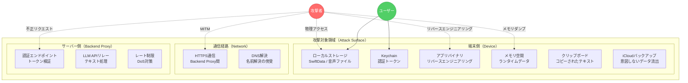

### 1.2 想定攻撃者プロファイル

| 攻撃者 | 能力レベル | 動機 | 想定される攻撃手法 |
|:--------|:-----------|:-----|:-------------------|
| 端末紛失・盗難による第三者 | 低 | 好奇心、個人情報取得 | 端末の物理操作、ストレージ直接アクセス |
| 同一Wi-Fiネットワーク上の傍受者 | 中 | 通信データの盗聴 | MITM攻撃、ARP Spoofing |
| リバースエンジニアリング攻撃者 | 中〜高 | APIキー抽出、ロジック解析 | バイナリ解析、Frida等によるランタイム操作 |
| Backend Proxyへの外部攻撃者 | 中〜高 | 不正API利用、サービス妨害 | ブルートフォース、トークン偽造、DDoS |
| 悪意あるアプリ（同一端末内） | 低〜中 | サンドボックス外からのデータ取得 | 共有ストレージへのアクセス試行 |

### 1.3 STRIDE脅威分析

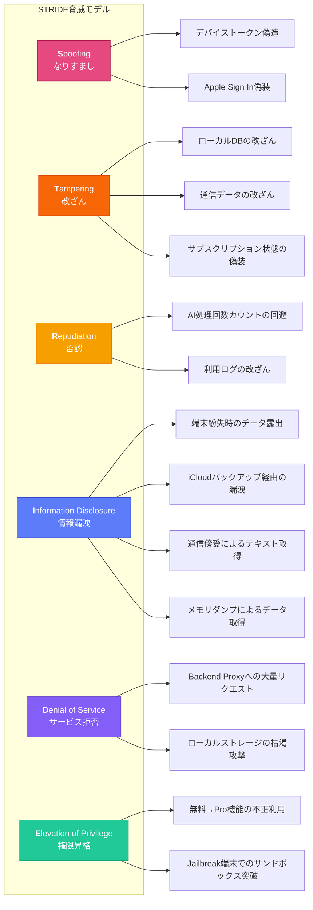

### 1.4 STRIDE詳細分析と対策

#### S: Spoofing（なりすまし）

| ID | 脅威 | 対策 | 対応NFR |
|:---|:-----|:-----|:--------|
| S-1 | デバイストークンの偽造によるBackend Proxyへの不正アクセス | **App Attest（DCAppAttestService）によるデバイス正当性検証**（※統合仕様書 v1.0 準拠 Critical #7/#8）。初回起動時にattestation、以降のAPIリクエストにassertion付加。リプレイ防止カウンタによる再利用検知。フォールバックとしてHMAC-SHA256署名を併用 | NFR-010 |
| S-2 | Apple Sign In のIDトークン改ざん | Apple公開鍵によるJWT検証をサーバー側で実施 | NFR-010 |
| S-3 | リプレイアタックによるトークン再利用 | トークンにタイムスタンプとnonce付与。サーバー側でnonce重複チェック | NFR-010 |

#### T: Tampering（改ざん）

| ID | 脅威 | 対策 | 対応NFR |
|:---|:-----|:-----|:--------|
| T-1 | SwiftDataストア内のAI処理回数カウンタ改ざん | カウンタ値のHMAC検証。サーバー側でも回数管理（二重チェック） | NFR-007 |
| T-2 | 通信途中のリクエスト/レスポンス改ざん | TLS 1.3の強制使用。Certificate Pinning | NFR-009 |
| T-3 | サブスクリプション状態のローカル偽装 | App Store Server-Side Verification。レシート検証をサーバー側で実施 | NFR-010 |

#### R: Repudiation（否認）

| ID | 脅威 | 対策 | 対応NFR |
|:---|:-----|:-----|:--------|
| R-1 | AI処理回数の不正リセット | サーバー側での処理回数記録。ローカルカウンタとの整合性チェック | - |
| R-2 | 不正利用の痕跡消去 | Backend Proxy側でのアクセスログ記録（個人情報除外） | - |

#### I: Information Disclosure（情報漏洩）

| ID | 脅威 | 対策 | 対応NFR |
|:---|:-----|:-----|:--------|
| I-1 | 端末紛失時のローカルデータ露出 | iOS Data Protection（確定済みデータは`NSFileProtectionComplete`、録音中一時ファイルは`NSFileProtectionCompleteUntilFirstUserAuthentication`）（※統合仕様書 v1.0 準拠） | NFR-007 |
| I-2 | iCloudバックアップ経由のデータ漏洩 | 音声・文字起こしデータの`isExcludedFromBackup = true`設定 | NFR-021 |
| I-3 | MITM攻撃による通信データ傍受 | TLS 1.3強制 + Certificate Pinning | NFR-009 |
| I-4 | リバースエンジニアリングによるシークレット取得 | 端末にAPIキー非保持。Backend Proxy方式 | NFR-008 |
| I-5 | メモリダンプによる一時データ取得 | 機密データの使用後即時ゼロ化。Jailbreak検知 | NFR-007 |

#### D: Denial of Service（サービス拒否）

| ID | 脅威 | 対策 | 対応NFR |
|:---|:-----|:-----|:--------|
| D-1 | Backend Proxyへの大量リクエスト | Cloudflare Rate Limiting。デバイストークンベースのスロットリング | NFR-009 |
| D-2 | 悪意ある大容量データ送信 | リクエストボディサイズ制限（最大50KB） | - |

#### E: Elevation of Privilege（権限昇格）

| ID | 脅威 | 対策 | 対応NFR |
|:---|:-----|:-----|:--------|
| E-1 | 無料プランユーザーのPro機能不正利用 | サーバー側でのサブスクリプション検証。ローカルキャッシュの暗号化署名 | NFR-010 |
| E-2 | Jailbreak端末でのサンドボックス突破 | Jailbreak検知の実装。検知時の機能制限（将来対応） | NFR-007 |

### 1.5 リスクマトリクス

リスクレベルは **影響度（Impact）** と **発生確率（Likelihood）** の掛け合わせで評価する。

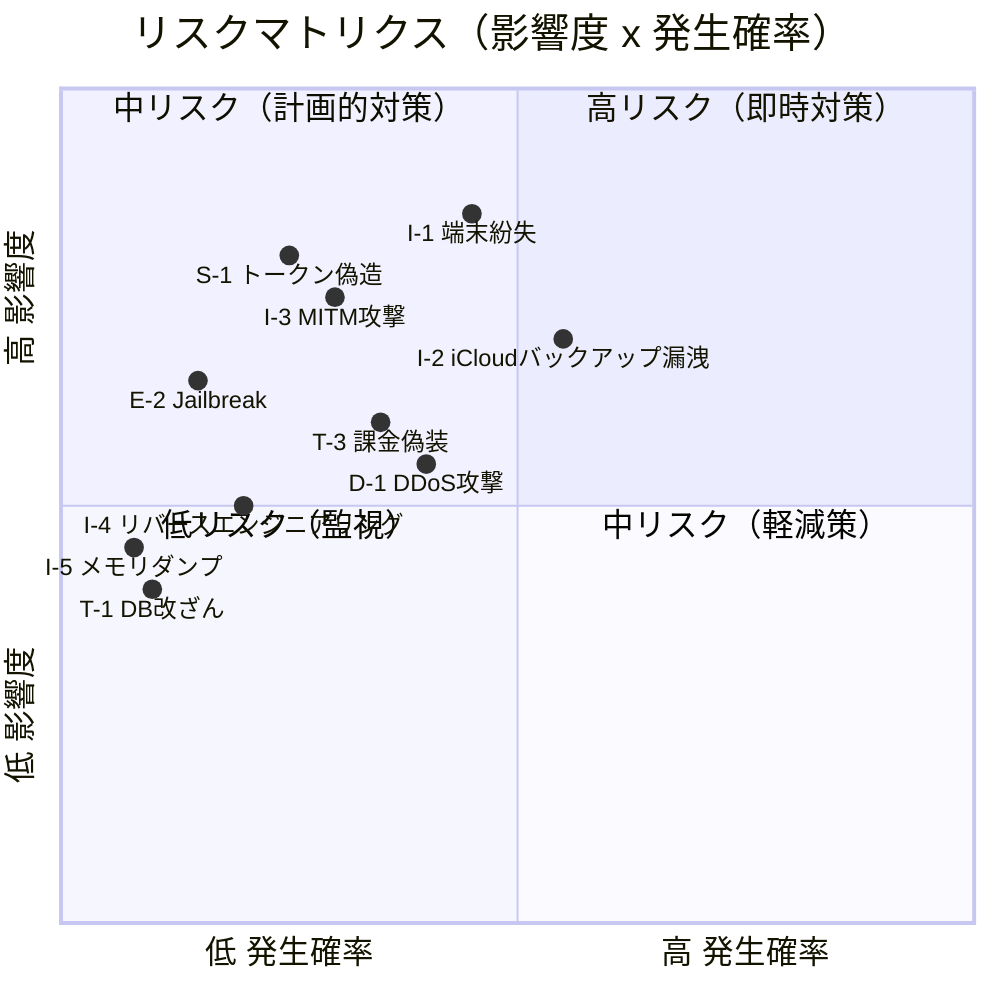

| リスクレベル | 脅威ID | 対応優先度 |
|:-------------|:-------|:-----------|
| **高** | I-1（端末紛失時データ露出）, I-2（iCloudバックアップ漏洩） | P1: MVP必須 |
| **高** | I-3（MITM攻撃）, S-1（トークン偽造） | P3: Backend Proxy導入時 |
| **中** | D-1（DDoS）, T-3（課金偽装）, E-2（Jailbreak） | P3: 公開時対応 |
| **低** | T-1（DB改ざん）, I-4（リバースエンジニアリング）, I-5（メモリダンプ） | P4: 将来対応 |

---

## 2. データ保護設計

### 2.1 保存データ分類と保護レベル

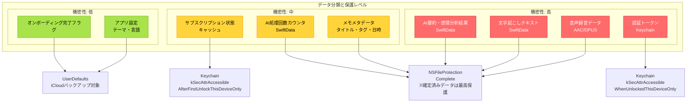

### 2.2 iOS Data Protection の適用設計（NFR-007対応）

<!-- ※統合仕様書 v1.0 準拠: セクション8.1 データ保護レベル分離 -->

#### 保護レベルの選定根拠（データライフサイクルに応じた分離方式）

本アプリでは、データのライフサイクルに応じて保護レベルを分離する（※統合仕様書 v1.0 準拠）。録音中一時ファイルと確定済みデータで異なる保護レベルを適用する。

| データ種別 | ファイル保護レベル | 根拠 |
|:-----------|:------------------|:-----|
| 録音中一時ファイル（`tmp/Recording/`） | `NSFileProtectionCompleteUntilFirstUserAuthentication` | バックグラウンド録音（EC-003）対応。端末ロック中も書き込み継続が必要 |
| 確定済み音声ファイル（`Documents/Audio/`） | **`NSFileProtectionComplete`** | 録音完了後は閲覧のみ。端末ロック時のアクセス不要。最高保護 |
| 確定済みテキストデータ（SwiftData） | **`NSFileProtectionComplete`** | 文字起こし・要約・感情分析結果。端末ロック時のアクセス不要 |
| MLモデルファイル（`Library/Caches/Models/`） | `NSFileProtectionCompleteUntilFirstUserAuthentication` | バックグラウンドでのモデル事前ロードに対応 |

#### 保護レベル選定の判断基準

| 保護レベル | 特性 | 採用対象 | 理由 |
|:-----------|:-----|:---------|:-----|
| `NSFileProtectionComplete` | 端末ロック時にファイルアクセス不可 | **確定済みデータ（音声・テキスト）** | 録音完了後のデータには最高保護を適用 |
| `NSFileProtectionCompleteUntilFirstUserAuthentication` | 初回ロック解除後は常時アクセス可能 | **録音中一時ファイル・MLモデル** | バックグラウンド録音（EC-003）との両立が必要 |
| `NSFileProtectionCompleteUnlessOpen` | ファイルオープン中のみアクセス可能 | **不採用** | SwiftDataストア全体への適用が困難 |
| `NSFileProtectionNone` | 保護なし | **不可** | セキュリティ要件を満たさない |

#### SwiftDataストアの保護設定

```swift
// SwiftData ModelContainer の保護レベル設定
// ※統合仕様書 v1.0 準拠: 確定済みデータはNSFileProtectionComplete
import SwiftData

struct PersistenceConfiguration {
    static func createModelContainer() throws -> ModelContainer {
        let schema = Schema([
            VoiceMemo.self,
            TranscriptionResult.self,
            AISummary.self,
            EmotionAnalysis.self,
            Tag.self
        ])

        let modelConfiguration = ModelConfiguration(
            schema: schema,
            isStoredInMemoryOnly: false,
            // iCloudバックアップ除外を担保するため
            // Application Support 内の専用ディレクトリに保存
            url: Self.secureStoreURL
        )

        return try ModelContainer(
            for: schema,
            configurations: [modelConfiguration]
        )
    }

    /// セキュア保存先URL（iCloudバックアップ除外設定済み）
    private static var secureStoreURL: URL {
        let appSupport = FileManager.default
            .urls(for: .applicationSupportDirectory, in: .userDomainMask)
            .first!
        let storeDir = appSupport.appendingPathComponent(
            "SecureStore", isDirectory: true
        )

        // ※統合仕様書 v1.0 準拠: 確定済みデータはNSFileProtectionComplete
        try? FileManager.default.createDirectory(
            at: storeDir,
            withIntermediateDirectories: true,
            attributes: [
                .protectionKey: FileProtectionType.complete
            ]
        )

        // iCloudバックアップから除外
        var resourceValues = URLResourceValues()
        resourceValues.isExcludedFromBackup = true
        var mutableURL = storeDir
        try? mutableURL.setResourceValues(resourceValues)

        return storeDir.appendingPathComponent("VoiceMemo.store")
    }
}
```

#### 音声ファイルの保護設定

```swift
/// 音声ファイル保存マネージャー
/// ※統合仕様書 v1.0 準拠: ディレクトリ名を「Audio」に統一、保護レベルを分離
struct AudioFileManager {
    /// 確定済み音声ファイル保存先（NSFileProtectionComplete）
    private static var audioDirectory: URL {
        let documents = FileManager.default
            .urls(for: .documentDirectory, in: .userDomainMask)
            .first!
        let audioDir = documents.appendingPathComponent(
            "Audio", isDirectory: true  // ※統合仕様書 v1.0 準拠: Recordings → Audio
        )

        // ※統合仕様書 v1.0 準拠: 確定済みデータはNSFileProtectionComplete
        try? FileManager.default.createDirectory(
            at: audioDir,
            withIntermediateDirectories: true,
            attributes: [
                .protectionKey: FileProtectionType.complete
            ]
        )

        // iCloudバックアップから除外（NFR-021）
        var resourceValues = URLResourceValues()
        resourceValues.isExcludedFromBackup = true
        var mutableURL = audioDir
        try? mutableURL.setResourceValues(resourceValues)

        return audioDir
    }

    /// 録音中一時ファイル保存先（NSFileProtectionCompleteUntilFirstUserAuthentication）
    /// バックグラウンド録音（EC-003）対応のため、ロック中も書き込み可能
    private static var tempRecordingDirectory: URL {
        let tmpDir = FileManager.default.temporaryDirectory
            .appendingPathComponent("Recording", isDirectory: true)

        try? FileManager.default.createDirectory(
            at: tmpDir,
            withIntermediateDirectories: true,
            attributes: [
                .protectionKey: FileProtectionType
                    .completeUntilFirstUserAuthentication
            ]
        )

        return tmpDir
    }

    /// 確定済み音声ファイル保存（最高保護レベル）
    static func save(audioData: Data, filename: String) throws -> URL {
        let fileURL = audioDirectory.appendingPathComponent(filename)

        try audioData.write(
            to: fileURL,
            options: [.atomic, .completeFileProtection]
        )

        // ※統合仕様書 v1.0 準拠: 確定済みファイルにはNSFileProtectionComplete
        try FileManager.default.setAttributes(
            [.protectionKey: FileProtectionType.complete],
            ofItemAtPath: fileURL.path
        )

        return fileURL
    }

    /// 録音中一時ファイル保存（バックグラウンド対応保護レベル）
    static func saveTempChunk(audioData: Data, filename: String) throws -> URL {
        let fileURL = tempRecordingDirectory.appendingPathComponent(filename)

        try audioData.write(to: fileURL, options: [.atomic])

        try FileManager.default.setAttributes(
            [.protectionKey: FileProtectionType
                .completeUntilFirstUserAuthentication],
            ofItemAtPath: fileURL.path
        )

        return fileURL
    }
}
```

### 2.3 Keychain利用設計（NFR-010対応）

<!-- ※統合仕様書 v1.0 準拠: セクション8.3 Keychain属性統一、セクション3.3 App AttestキーID追加 -->

#### 保存データと属性

全Keychain項目で `ThisDeviceOnly` を必須とする（※統合仕様書 v1.0 準拠）。端末移行時にトークンが引き継がれないことは認証の再登録で対処可能であり、セキュリティを優先する。

| データ項目 | Keychainキー | アクセシビリティ | 備考 |
|:-----------|:-------------|:-----------------|:-----|
| アクセストークン | `access_token` | `kSecAttrAccessibleAfterFirstUnlockThisDeviceOnly` | 端末移行時は再生成 |
| リフレッシュトークン | `refresh_token` | `kSecAttrAccessibleAfterFirstUnlockThisDeviceOnly` | バックグラウンドリフレッシュ対応 |
| Apple Sign Inユーザー識別子 | `apple_user_id` | `kSecAttrAccessibleWhenUnlockedThisDeviceOnly` | 公開時に追加。最高セキュリティ |
| サブスクリプション検証キャッシュ | `subscription_cache` | `kSecAttrAccessibleAfterFirstUnlockThisDeviceOnly` | EC-015猶予期間判定用 |
| App AttestキーID | `app_attest_key_id` | `kSecAttrAccessibleAfterFirstUnlockThisDeviceOnly` | ※統合仕様書 v1.0 準拠 Critical #8 |

#### Keychain操作のラッパー設計

```swift
/// Keychainアクセスの安全な抽象化レイヤー
/// ※統合仕様書 v1.0 準拠: 全項目でThisDeviceOnly必須、App AttestキーID追加
enum KeychainKey: String {
    case accessToken = "access_token"
    case refreshToken = "refresh_token"
    case appleUserID = "apple_user_id"
    case subscriptionCache = "subscription_cache"
    case appAttestKeyID = "app_attest_key_id"  // ※統合仕様書 v1.0 準拠 Critical #8

    var accessibility: CFString {
        switch self {
        case .appleUserID:
            // ロック解除時のみアクセス可能（最高セキュリティ）
            return kSecAttrAccessibleWhenUnlockedThisDeviceOnly
        case .accessToken, .refreshToken, .subscriptionCache, .appAttestKeyID:
            // 初回ロック解除後はアクセス可能（バックグラウンド処理対応）
            return kSecAttrAccessibleAfterFirstUnlockThisDeviceOnly
        }
    }
}

struct SecureKeychain {
    private static let service = "app.soyoka.app"

    static func save(key: KeychainKey, data: Data) throws { ... }
    static func load(key: KeychainKey) -> Data? { ... }
    static func delete(key: KeychainKey) throws { ... }

    /// 全Keychainデータの削除（アカウント削除時）
    static func deleteAll() throws { ... }
}
```

### 2.4 iCloudバックアップ除外の実装（NFR-021対応）

#### 除外対象と対象外の明確化

<!-- ※統合仕様書 v1.0 準拠: セクション8.2 ディレクトリ名統一（Recordings → Audio） -->

| データ | ディレクトリ | バックアップ除外 | 根拠 |
|:-------|:-------------|:-----------------|:-----|
| 音声録音ファイル | `Documents/Audio/` | **除外する** | プライバシーデータ（※統合仕様書 v1.0 準拠） |
| SwiftDataストア | `Library/Application Support/SecureStore/` | **除外する** | 文字起こし・AI処理結果を含む |
| MLモデルファイル | `Library/Caches/Models/` | **除外する**（iOS標準で除外） | Cachesは自動除外 |
| 録音中一時ファイル | `tmp/Recording/` | **除外する**（iOS標準で除外） | tmpは自動除外 |
| UserDefaults（アプリ設定） | `Library/Preferences/` | **除外しない** | テーマ・言語等のメタデータのみ。個人情報を含まない |

#### 統一ディレクトリ構成（※統合仕様書 v1.0 準拠）

```
App Sandbox/
├── Documents/
│   └── Audio/                      # 確定済み音声ファイル（iCloudバックアップ除外）
├── Library/
│   ├── Application Support/
│   │   └── SecureStore/            # SwiftDataストア（iCloudバックアップ除外）
│   └── Caches/
│       ├── STTCache/
│       ├── ThumbnailCache/
│       └── Models/                 # MLモデル（Cachesに配置: 再ダウンロード可能なため）
└── tmp/
    └── Recording/                  # 録音中一時ファイル
```

#### 実装方法

```swift
/// アプリ初期化時に全セキュアディレクトリのバックアップ除外を設定
/// ※統合仕様書 v1.0 準拠: ディレクトリ名統一
struct BackupExclusionManager {
    static func configureExclusions() {
        let appSupport = FileManager.default
            .urls(for: .applicationSupportDirectory, in: .userDomainMask)
            .first!
        let documents = FileManager.default
            .urls(for: .documentDirectory, in: .userDomainMask)
            .first!

        let allPaths = [
            appSupport.appendingPathComponent("SecureStore"),
            documents.appendingPathComponent("Audio"),  // ※統合仕様書 v1.0 準拠: Recordings → Audio
        ]

        for var url in allPaths {
            guard FileManager.default.fileExists(
                atPath: url.path
            ) else { continue }

            var resourceValues = URLResourceValues()
            resourceValues.isExcludedFromBackup = true
            try? url.setResourceValues(resourceValues)
        }
    }
}
```

### 2.5 データ削除設計（REQ-017対応）

メモ削除時は関連する全データを完全削除する。

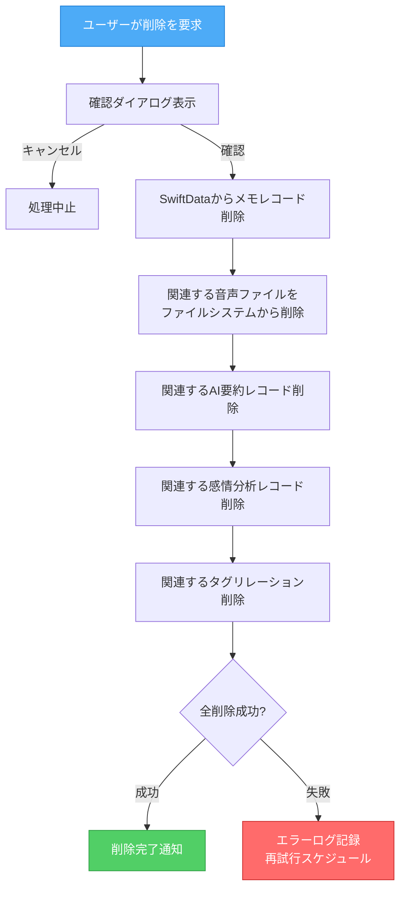

**セキュアな削除の補足**: iOSのファイルシステム（APFS）はハードウェアレベルの暗号化を採用しており、`FileManager.removeItem`による削除はファイルの暗号鍵破棄と同等の効果を持つ。追加の上書き消去は不要である。

---

## 3. 通信セキュリティ

### 3.1 通信アーキテクチャ概要

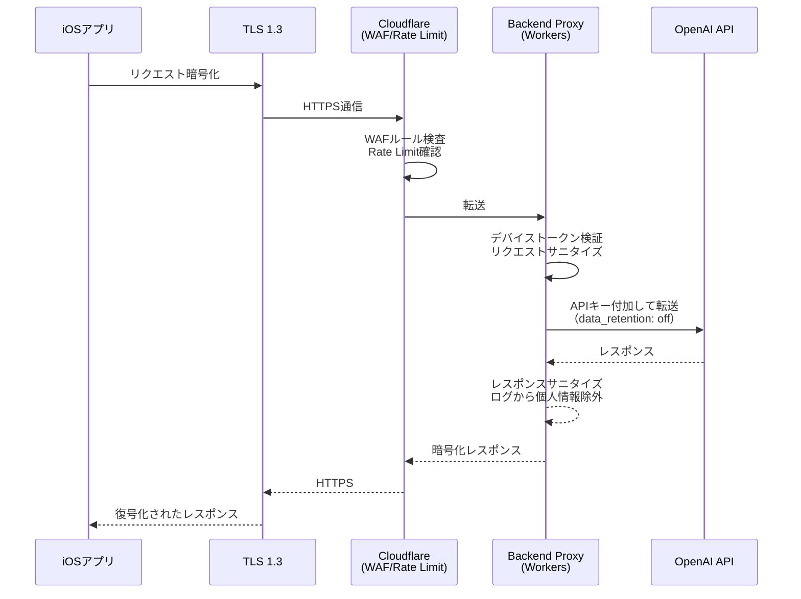

### 3.2 App Transport Security（ATS）設定（NFR-009対応）

ATSはiOSのデフォルトで有効であり、本アプリではATS例外を一切設けない。

```xml
<!-- Info.plist: ATS設定（デフォルト設定を明示） -->
<key>NSAppTransportSecurity</key>
<dict>
    <!-- 例外なし: 全通信でTLS 1.2以上を強制 -->
    <!-- NSAllowsArbitraryLoads は設定しない（デフォルト false） -->
</dict>
```

**TLS 1.3の強制**: Backend Proxy（Cloudflare Workers）側でTLS 1.3をミニマムバージョンとして設定する。Cloudflareのエッジでは TLS 1.3 がデフォルトで有効であり、Minimum TLS Version 設定で 1.2 以下を拒否する。

### 3.3 Certificate Pinning 設計

#### MVP段階（P3）: Certificate Pinning は導入しない

**理由**:
- 個人開発のMVP段階ではCloudflare管理のTLS証明書を使用
- Certificate Pinningは証明書更新時のアプリアップデート強制が必要で運用負荷が高い
- Cloudflareの証明書自動ローテーションと競合するリスク

#### 公開段階（P4以降）: 段階的導入を検討

導入する場合は `TrustKit` ライブラリまたは `URLSession` のデリゲートメソッドを使用する。

```swift
/// Certificate Pinning（将来実装用の設計指針）
/// - Cloudflareルート証明書のSPKI hashをピン留め
/// - バックアップピンを必ず含める（証明書ローテーション対策）
/// - ピン検証失敗時はフォールバック通信を許可しない（Fail-Closed）
///
/// 実装例:
/// func urlSession(
///     _ session: URLSession,
///     didReceive challenge: URLAuthenticationChallenge,
///     completionHandler: @escaping (URLSession.AuthChallengeDisposition, URLCredential?) -> Void
/// ) {
///     guard let serverTrust = challenge.protectionSpace.serverTrust,
///           let certificate = SecTrustGetCertificateAtIndex(serverTrust, 0)
///     else {
///         completionHandler(.cancelAuthenticationChallenge, nil)
///         return
///     }
///     // SPKI hash検証ロジック
/// }
```

### 3.4 中間者攻撃（MITM）対策

| 対策レイヤー | 実装 | 対応時期 |
|:-------------|:-----|:---------|
| TLS 1.3 強制 | Cloudflare Minimum TLS Version設定 | P3（Backend Proxy導入時） |
| HSTS | Cloudflare設定で`Strict-Transport-Security`ヘッダ付与 | P3 |
| Certificate Pinning | URLSession delegate / TrustKit | P4（公開時に検討） |
| リクエスト真正性検証 | **App Attest assertion**（※統合仕様書 v1.0 準拠: HMAC署名方式を廃止） | P3 |
| リプレイ防止 | App Attestカウンタの単調増加検証 + タイムスタンプ + nonce | P3 |

### 3.5 リクエスト署名の設計

<!-- ※統合仕様書 v1.0 準拠: BearerトークンのHMAC利用を廃止、App Attestのassertion検証に置換 -->

**注意**: 旧設計ではBearerトークンをHMAC-SHA256署名の鍵として使用していたが、これはBearerトークンの本来の用途から逸脱しており、セキュリティ上の問題がある。統合仕様書 v1.0 に基づき、リクエストの真正性検証にはApp Attestのassertion（DCAppAttestService）を使用する方式に置換する。

```swift
/// Backend Proxyへのリクエスト署名
/// ※統合仕様書 v1.0 準拠: HMAC署名方式を廃止し、App Attest assertion方式に置換
struct RequestSigner {
    private let appAttestManager: AppAttestManager

    init(appAttestManager: AppAttestManager) {
        self.appAttestManager = appAttestManager
    }

    /// リクエストに認証ヘッダとApp Attestアサーションを付加
    func sign(
        request: inout URLRequest,
        body: Data,
        token: String
    ) async throws {
        let timestamp = String(Int(Date().timeIntervalSince1970))
        let nonce = UUID().uuidString

        // Bearerトークンによる認証（JWTとして検証）
        request.setValue("Bearer \(token)", forHTTPHeaderField: "Authorization")
        request.setValue(timestamp, forHTTPHeaderField: "X-Timestamp")
        request.setValue(nonce, forHTTPHeaderField: "X-Nonce")

        // ※統合仕様書 v1.0 準拠: App Attestアサーションでリクエストの真正性を検証
        // clientDataHash = SHA256(timestamp + nonce + body) でリクエスト全体をカバー
        let clientData = "\(timestamp).\(nonce).\(body.base64EncodedString())"
        let assertion = try await appAttestManager.generateAssertion(
            for: Data(clientData.utf8)
        )
        request.setValue(
            assertion.base64EncodedString(),
            forHTTPHeaderField: "X-App-Attest-Assertion"
        )
    }
}
```

**フォールバック**: App Attestが利用できない環境（シミュレータ、一部旧端末）では、タイムスタンプ + nonceによるリプレイ防止のみを適用し、サーバー側で追加の検証（IPレート制限等）を実施する。

---

## 4. 認証・認可設計

### 4.1 認証戦略の全体像

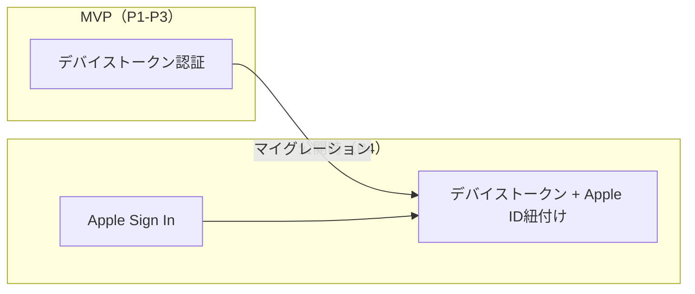

### 4.2 デバイストークン生成・検証フロー（MVP）

<!-- ※統合仕様書 v1.0 準拠: App Attest attestation をデバイス登録フローに統合 -->

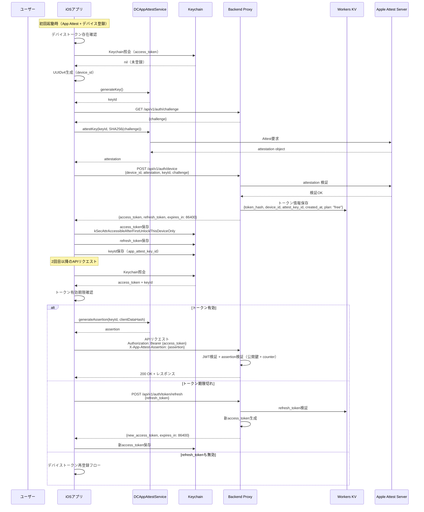

#### トークン仕様

| 項目 | 仕様 |
|:-----|:-----|
| access_token形式 | JWT（HS256署名） |
| access_token有効期限 | 24時間 |
| refresh_token形式 | ランダム256bit + HMAC |
| refresh_token有効期限 | 90日 |
| トークン保存先 | iOS Keychain（`ThisDeviceOnly`） |
| サーバー保存 | トークンハッシュのみ（平文非保持） |

### 4.3 Apple Sign In 実装設計（公開時）

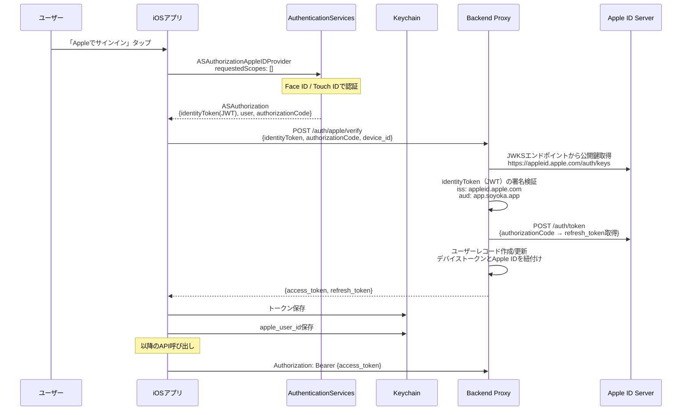

#### Apple Sign In 実装上の注意事項

| 項目 | 対応 |
|:-----|:-----|
| スコープ要求 | 空（メールアドレス・名前を要求しない。プライバシー最小化） |
| user identifierの保存 | Keychainに保存。ユーザー識別のみに使用 |
| 認証状態の監視 | `ASAuthorizationAppleIDProvider.getCredentialState`で定期確認 |
| 資格情報取り消し対応 | `ASAuthorizationAppleIDProvider.credentialRevokedNotification`を監視 |
| デバイストークンからの移行 | 既存デバイストークンにApple IDを紐付け。データ引き継ぎ |

### 4.4 トークンリフレッシュ戦略

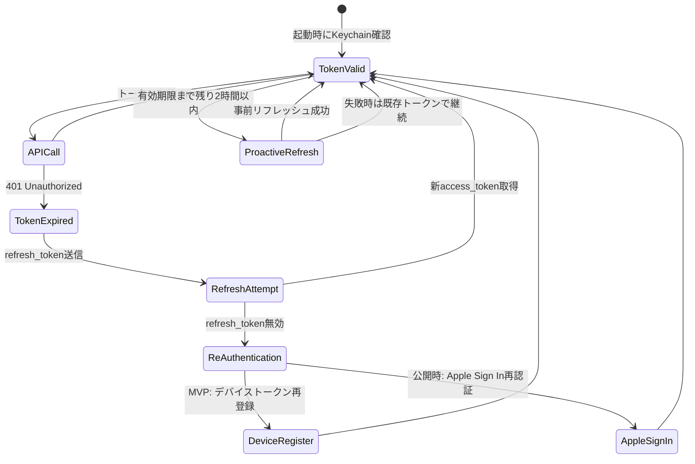

**リフレッシュポリシー**:
- **プロアクティブリフレッシュ**: access_tokenの有効期限まで残り2時間を切ったタイミングでバックグラウンドリフレッシュを実行
- **リアクティブリフレッシュ**: APIレスポンス401受信時に即座にリフレッシュ
- **リフレッシュ失敗時**: 最大3回リトライ後、再認証フローへ
- **オフライン時**: リフレッシュをスキップし、オンライン復帰時に実行

### 4.5 セッション管理

| 項目 | 設計 |
|:-----|:-----|
| セッション永続化 | Keychainに保存されたトークンによる暗黙的セッション |
| 同時セッション | 1デバイス1セッション（デバイストークン方式のため自然に制約） |
| セッション無効化 | ユーザーによる明示的サインアウト、またはサーバー側でのトークン失効 |
| アクティビティタイムアウト | なし（日記アプリの使い勝手を優先） |
| アプリロック | Face ID/Touch ID（REQ-027、P4で実装） |

### 4.6 App Attest 実装設計（Critical #7/#8対応）

<!-- ※統合仕様書 v1.0 準拠: セクション5.7/5.8 App Attest導入 -->

DCAppAttestServiceによるデバイス正当性検証の完全な設計。STRIDE S-1（デバイストークン偽造）への根本対策として導入する。

#### 4.6.1 App Attest 概要

| 項目 | 内容 |
|:-----|:-----|
| **目的** | デバイスの正当性を Apple のサーバーを通じて暗号学的に検証し、偽造デバイストークンによる不正アクセスを防止 |
| **対応OS** | iOS 14.0+（本アプリの最低対応バージョン iOS 17.0 で利用可能） |
| **フレームワーク** | `DeviceCheck.DCAppAttestService` |
| **フォールバック** | App Attest非対応環境（シミュレータ等）では従来のデバイストークン方式を使用し、サーバー側でレート制限を強化 |

#### 4.6.2 Attestation フロー（初回登録）

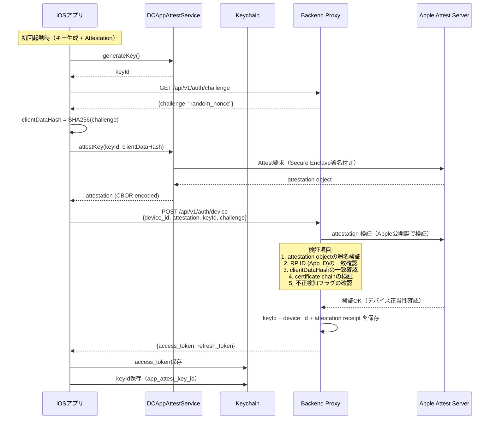

#### 4.6.3 Assertion フロー（APIリクエスト毎）

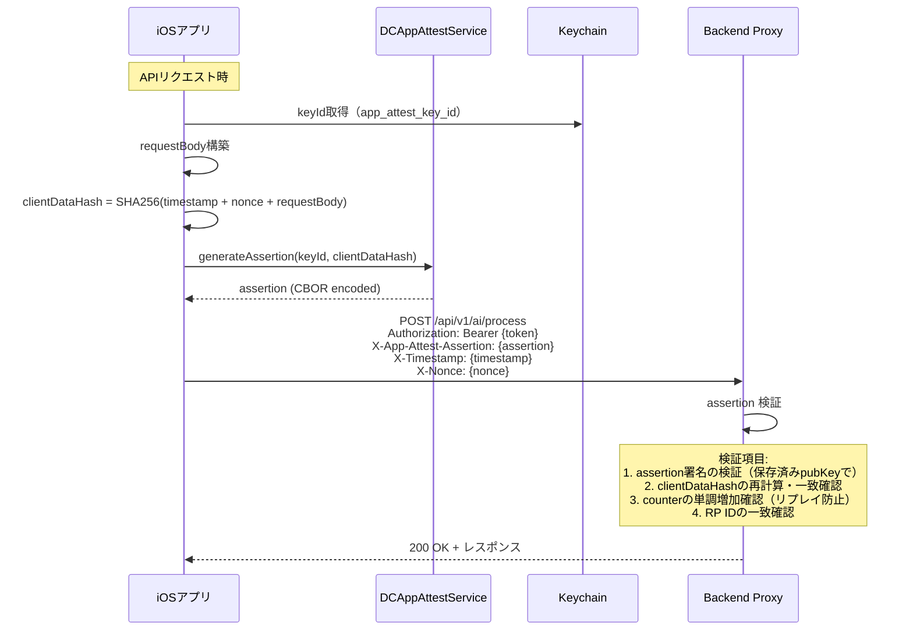

#### 4.6.4 クライアント側実装

```swift
// ============================================================
// InfraNetwork/AppAttest/AppAttestManager.swift
// ※統合仕様書 v1.0 準拠: App Attest の統一実装
// ============================================================

import DeviceCheck
import CryptoKit

final class AppAttestManager: Sendable {
    private let service = DCAppAttestService.shared

    /// App Attest の利用可否
    var isSupported: Bool {
        service.isSupported
    }

    /// キーの生成と登録（初回起動時に1回）
    func generateAndAttestKey(challenge: Data) async throws -> (keyId: String, attestation: Data) {
        // 1. キー生成（Secure Enclaveで生成）
        let keyId = try await service.generateKey()

        // 2. チャレンジのハッシュ化
        let clientDataHash = Data(SHA256.hash(data: challenge))

        // 3. Attestation 生成（Apple Attest Serverと通信）
        let attestation = try await service.attestKey(keyId, clientDataHash: clientDataHash)

        // 4. KeychainにキーIDを保存
        try SecureKeychain.save(key: .appAttestKeyID, data: Data(keyId.utf8))

        return (keyId, attestation)
    }

    /// APIリクエスト用のAssertion生成
    /// - Parameter requestData: リクエストボディ + タイムスタンプ + nonceの結合データ
    func generateAssertion(for requestData: Data) async throws -> Data {
        guard let keyIdData = SecureKeychain.load(key: .appAttestKeyID),
              let keyId = String(data: keyIdData, encoding: .utf8) else {
            throw AppAttestError.keyNotFound
        }

        let clientDataHash = Data(SHA256.hash(data: requestData))
        return try await service.generateAssertion(keyId, clientDataHash: clientDataHash)
    }
}

/// App Attest エラー定義
enum AppAttestError: Error, LocalizedError {
    case notSupported
    case keyNotFound
    case attestationFailed(underlying: Error)
    case assertionFailed(underlying: Error)

    var errorDescription: String? {
        switch self {
        case .notSupported: return "App Attest is not supported on this device"
        case .keyNotFound: return "App Attest key not found in Keychain"
        case .attestationFailed(let error): return "Attestation failed: \(error.localizedDescription)"
        case .assertionFailed(let error): return "Assertion failed: \(error.localizedDescription)"
        }
    }
}
```

#### 4.6.5 サーバー側検証のポイント

| 検証項目 | Attestation時 | Assertion時 |
|:---------|:-------------|:------------|
| 署名検証 | Apple CA証明書チェーンで検証 | 保存済み公開鍵で検証 |
| RP ID | App IDと一致確認 | App IDと一致確認 |
| clientDataHash | チャレンジと一致確認 | リクエストデータと一致確認 |
| counter | 初期値を記録 | 単調増加を確認（リプレイ防止） |
| fraud risk | `attestation.risk` フィールド確認 | - |
| receipt | attestation receiptを保存 | - |

#### 4.6.6 フォールバック戦略

App Attestが利用できない環境（シミュレータ、Apple Silicon Mac等）への対応。

```swift
/// App Attest 対応状況に応じた認証フロー分岐
func authenticateDevice() async throws -> AuthResult {
    if AppAttestManager().isSupported {
        // App Attest 対応: attestation + assertion 方式
        return try await authenticateWithAppAttest()
    } else {
        // 非対応: 従来のデバイストークン方式（レート制限強化）
        // サーバー側で追加の検証を実施
        // - IP アドレスベースのレート制限
        // - デバイス情報の整合性チェック
        return try await authenticateWithDeviceToken()
    }
}
```

| 環境 | 方式 | 追加対策 |
|:-----|:-----|:---------|
| App Attest対応端末 | attestation + assertion | リプレイ防止カウンタ |
| シミュレータ（開発用） | デバイストークン | 開発環境フラグによるバイパス |
| App Attest非対応端末 | デバイストークン | IP レート制限強化、デバイス情報検証 |

---

## 5. プライバシー設計

### 5.1 プライバシー設計原則

本アプリは **Privacy by Design** の7原則に基づき設計する。

| 原則 | 本アプリでの適用 |
|:-----|:-----------------|
| 1. 事前防止 | ローカル主保存。クラウド送信は最小限のテキストのみ |
| 2. デフォルトでプライバシー保護 | iCloudバックアップ除外がデフォルト。追跡なし |
| 3. 設計にプライバシーを組み込む | iOS Data Protection、Keychain、Backend Proxy方式 |
| 4. ゼロサムでなくポジティブサム | AI機能の利便性とプライバシーの両立 |
| 5. 完全なライフサイクル保護 | 収集→保存→処理→削除の全段階で保護 |
| 6. 可視化と透明性 | プライバシーポリシーの明示、権限利用理由の説明 |
| 7. ユーザー中心 | ユーザーがデータの完全な管理権を持つ |

### 5.2 Privacy Manifest（PrivacyInfo.xcprivacy）設計

<!-- ※統合仕様書 v1.0 準拠: Privacy Manifest/App Privacy申告の整合性修正 — 収集データ定義を一本化 -->

iOS 17以降で必須となるPrivacy Manifestの設計。App Store Connectの「App Privacy」申告と完全に整合させる。

```xml
<?xml version="1.0" encoding="UTF-8"?>
<!DOCTYPE plist PUBLIC "-//Apple//DTD PLIST 1.0//EN"
  "http://www.apple.com/DTDs/PropertyList-1.0.dtd">
<plist version="1.0">
<dict>
    <!-- 追跡ドメインの宣言 -->
    <key>NSPrivacyTrackingDomains</key>
    <array>
        <!-- 追跡ドメインなし: 本アプリはユーザートラッキングを行わない -->
    </array>

    <!-- トラッキングの宣言 -->
    <key>NSPrivacyTracking</key>
    <false/>

    <!-- ※統合仕様書 v1.0 準拠: 収集データ定義を一本化（Privacy Manifest + App Privacy申告 + 実装で統一） -->
    <!-- 収集するデータタイプの宣言 -->
    <key>NSPrivacyCollectedDataTypes</key>
    <array>
        <!-- 音声データ（ローカル録音、クラウド非送信） -->
        <dict>
            <key>NSPrivacyCollectedDataType</key>
            <string>NSPrivacyCollectedDataTypeAudioData</string>
            <key>NSPrivacyCollectedDataTypeLinked</key>
            <false/>
            <key>NSPrivacyCollectedDataTypeTracking</key>
            <false/>
            <key>NSPrivacyCollectedDataTypePurposes</key>
            <array>
                <string>NSPrivacyCollectedDataTypePurposeAppFunctionality</string>
            </array>
        </dict>
        <!-- デバイス識別子（デバイストークン認証 + App Attest用） -->
        <dict>
            <key>NSPrivacyCollectedDataType</key>
            <string>NSPrivacyCollectedDataTypeDeviceID</string>
            <key>NSPrivacyCollectedDataTypeLinked</key>
            <false/>
            <key>NSPrivacyCollectedDataTypeTracking</key>
            <false/>
            <key>NSPrivacyCollectedDataTypePurposes</key>
            <array>
                <string>NSPrivacyCollectedDataTypePurposeAppFunctionality</string>
            </array>
        </dict>
        <!-- 購入履歴（サブスクリプション管理） -->
        <dict>
            <key>NSPrivacyCollectedDataType</key>
            <string>NSPrivacyCollectedDataTypePurchaseHistory</string>
            <key>NSPrivacyCollectedDataTypeLinked</key>
            <false/>
            <key>NSPrivacyCollectedDataTypeTracking</key>
            <false/>
            <key>NSPrivacyCollectedDataTypePurposes</key>
            <array>
                <string>NSPrivacyCollectedDataTypePurposeAppFunctionality</string>
            </array>
        </dict>
    </array>

    <!-- Required Reason API の使用宣言 -->
    <key>NSPrivacyAccessedAPITypes</key>
    <array>
        <!-- UserDefaults API -->
        <dict>
            <key>NSPrivacyAccessedAPIType</key>
            <string>NSPrivacyAccessedAPICategoryUserDefaults</string>
            <key>NSPrivacyAccessedAPITypeReasons</key>
            <array>
                <string>CA92.1</string>
                <!-- アプリ自身の設定情報の読み書き -->
            </array>
        </dict>
        <!-- File timestamp API（録音ファイルの管理） -->
        <dict>
            <key>NSPrivacyAccessedAPIType</key>
            <string>NSPrivacyAccessedAPICategoryFileTimestamp</string>
            <key>NSPrivacyAccessedAPITypeReasons</key>
            <array>
                <string>C617.1</string>
                <!-- ファイルの作成日時・更新日時をアプリ機能で使用 -->
            </array>
        </dict>
    </array>
</dict>
</plist>
```

### 5.3 App Tracking Transparency（ATT）対応

**本アプリではATTフレームワークの利用は不要である。**

根拠:
- ユーザートラッキングを一切行わない
- 広告SDKを組み込まない
- サードパーティ分析ツールを使用しない（個人開発のMVP）
- `NSPrivacyTracking = false` をPrivacy Manifestで宣言

将来的にアナリティクスを導入する場合は、Appleの`App Analytics`（ATT不要）の利用を優先する。

### 5.4 App Store審査対応

#### 権限要求の文言設計

| 権限 | Info.plistキー | 説明文言（日本語） | 説明文言（英語） |
|:-----|:---------------|:-------------------|:-----------------|
| マイク | `NSMicrophoneUsageDescription` | 音声メモを録音するためにマイクを使用します。録音データは端末内にのみ保存されます。 | The microphone is used to record voice memos. All recordings are stored locally on your device only. |
| 音声認識 | `NSSpeechRecognitionUsageDescription` | 録音した音声をテキストに変換するために音声認識を使用します。音声認識はすべて端末内で処理されます。 | Speech recognition is used to transcribe your voice recordings to text. All processing happens on your device. |

#### App Store審査時のプライバシー説明

<!-- ※統合仕様書 v1.0 準拠: Privacy Manifest/App Privacy申告の整合性修正 — 収集データ定義を一本化 -->

App Store Connectの「App Privacy」セクションで以下を申告する。Privacy Manifest（PrivacyInfo.xcprivacy）と完全に整合させる。

| データタイプ | Privacy Manifest対応型 | 収集する | リンクする | トラッキングに使用 | 用途 |
|:-------------|:----------------------|:---------|:-----------|:-------------------|:-----|
| 音声データ | `NSPrivacyCollectedDataTypeAudioData` | はい | いいえ | いいえ | 録音機能（ローカルのみ） |
| デバイスID | `NSPrivacyCollectedDataTypeDeviceID` | はい | いいえ | いいえ | デバイス認証・App Attest |
| 購入履歴 | `NSPrivacyCollectedDataTypePurchaseHistory` | はい | いいえ | いいえ | サブスクリプション管理 |
| 使用状況データ | - | いいえ | - | - | - |
| 位置情報 | - | いいえ | - | - | - |
| 連絡先 | - | いいえ | - | - | - |

**AI処理に関する審査対応**: App Review ガイドライン 5.6.1（App Clips）および 5.1.1（Data Collection and Storage）に基づき、以下を明記する。

- AI処理（要約・タグ付け・感情分析）はテキストデータのみをクラウドに送信
- 音声データはクラウドに送信しない
- 送信テキストはサーバーで保持せず、処理完了後に即時削除
- OpenAI APIのデータ利用ポリシー（学習への非使用設定）を適用

---

## 6. クラウドデータポリシー実装

### 6.1 送信データの最小化原則（REQ-008対応）

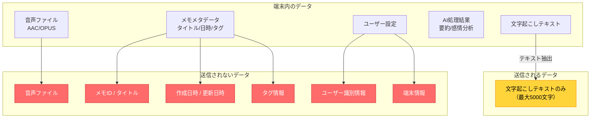

#### 送信データのサニタイズ処理

```swift
/// クラウド送信前のデータサニタイズ
struct CloudDataSanitizer {
    /// 送信するテキストから個人情報パターンを検出・除去
    static func sanitize(text: String) -> String {
        var sanitized = text

        // 電話番号パターンの検出と置換
        let phonePattern = #"\d{2,4}[-\s]?\d{2,4}[-\s]?\d{3,4}"#
        sanitized = sanitized.replacingOccurrences(
            of: phonePattern,
            with: "[電話番号]",
            options: .regularExpression
        )

        // メールアドレスパターンの検出と置換
        let emailPattern = #"[\w.+-]+@[\w-]+\.[\w.]+"#
        sanitized = sanitized.replacingOccurrences(
            of: emailPattern,
            with: "[メールアドレス]",
            options: .regularExpression
        )

        // 文字数制限（最大5000文字）
        if sanitized.count > 5000 {
            sanitized = String(sanitized.prefix(5000))
        }

        return sanitized
    }
}
```

### 6.2 Backend Proxyでのデータ非保持保証

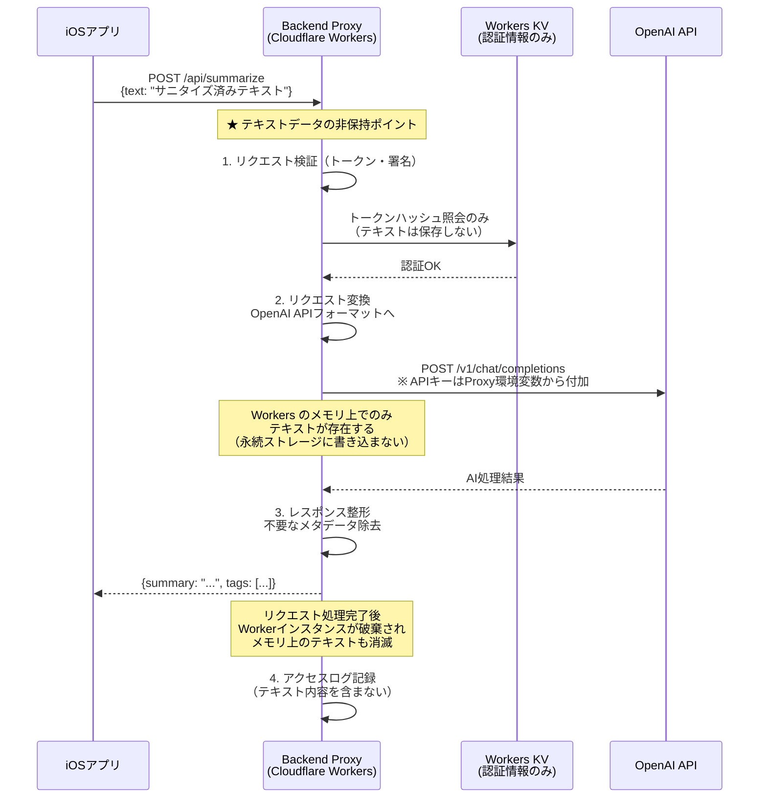

#### Backend Proxy側の実装ガイドライン

```javascript
// Cloudflare Workers における非保持の設計指針

export default {
  async fetch(request, env) {
    // ★ 原則: テキストデータをKV/D1/R2等の永続ストレージに書き込まない

    const body = await request.json();

    // 認証検証（KVにはトークンハッシュのみ保存）
    const isValid = await verifyToken(body.token, env);
    if (!isValid) return new Response("Unauthorized", { status: 401 });

    // OpenAI API呼び出し（テキストはメモリ上のみ）
    const result = await callOpenAI(body.text, env.OPENAI_API_KEY);

    // ログ記録（テキスト内容を含めない）
    console.log(JSON.stringify({
      timestamp: new Date().toISOString(),
      endpoint: "/api/summarize",
      status: "success",
      // text: body.text ← ★ 絶対にテキストをログに含めない
      text_length: body.text.length,  // 長さのみ記録
    }));

    return new Response(JSON.stringify(result));
    // Worker実行完了後、メモリ上のbody.textは自動的に破棄される
  }
};
```

### 6.3 OpenAI APIデータ利用ポリシー準拠

| 対策項目 | 実装方法 |
|:---------|:---------|
| API利用データの学習への非使用 | OpenAI API利用時に `organization` 設定でオプトアウト。APIエンドポイント（`/v1/chat/completions`）経由のデータはデフォルトで学習に使用されない（2024年3月以降のポリシー） |
| データ保持期間 | Zero Data Retention（ZDR）の適用を申請（対象プランの場合）。申請不可の場合は、OpenAI標準の30日ログ保持ポリシーに準拠し、ユーザーに告知 |
| Content Policyの遵守 | 送信テキストにContent Policy違反がないことをクライアント側で事前フィルタ（悪意ある入力の防止） |
| DPA（Data Processing Agreement） | OpenAIとのDPAを締結（公開時。個人開発MVP段階ではOpenAI標準利用規約に準拠） |

### 6.4 ログからの個人情報除外

#### ログレベル別の記録内容

| ログレベル | 記録内容 | 個人情報 |
|:-----------|:---------|:---------|
| ERROR | エラータイプ、エラーコード、スタックトレース | 含めない |
| WARN | 処理失敗の種別、リトライ回数 | 含めない |
| INFO | API呼び出し成否、処理時間、テキスト長 | 含めない |
| DEBUG | リクエスト/レスポンスの構造（本番では無効化） | 含めない |

**禁止ログ項目**:
- 文字起こしテキストの内容（全部または一部）
- ユーザーの音声データ
- デバイストークンの平文（ハッシュ化して記録）
- IPアドレス（Cloudflareヘッダーから自動除外設定）

---

## 7. セキュリティテスト計画

### 7.1 テスト分類とスケジュール

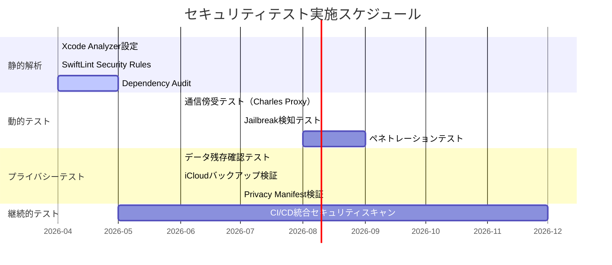

### 7.2 静的解析

#### 7.2.1 Xcode Analyzer

| 項目 | 設定 |
|:-----|:-----|
| Static Analysis | Build Settingsで `RUN_CLANG_STATIC_ANALYZER = YES` |
| Address Sanitizer | Scheme > Diagnostics > Address Sanitizer有効化 |
| Thread Sanitizer | Scheme > Diagnostics > Thread Sanitizer有効化 |
| Undefined Behavior Sanitizer | Scheme > Diagnostics > UB Sanitizer有効化 |
| 実施タイミング | 全ビルド時（CI/CD含む） |

#### 7.2.2 SwiftLint Security Rules

```yaml
# .swiftlint.yml セキュリティ関連ルール
opt_in_rules:
  - force_unwrapping            # 強制アンラップ禁止
  - force_cast                  # 強制キャスト禁止
  - implicitly_unwrapped_optional  # 暗黙的アンラップ禁止
  - prohibited_interface_builder   # Storyboard非使用の強制
  - overridden_super_call        # super呼び出し忘れ防止

custom_rules:
  no_print_statement:
    name: "No Print Statements"
    regex: "\\bprint\\s*\\("
    message: "print()の使用禁止。os_logまたはLoggerを使用してください。"
    severity: warning

  no_nslog:
    name: "No NSLog"
    regex: "\\bNSLog\\s*\\("
    message: "NSLogの使用禁止。個人情報がシステムログに残る可能性があります。"
    severity: error

  no_hardcoded_credentials:
    name: "No Hardcoded Credentials"
    regex: "(api[_-]?key|secret|password|token)\\s*[:=]\\s*\"[^\"]{8,}\""
    message: "ハードコードされた認証情報を検出しました。Keychainまたは環境変数を使用してください。"
    severity: error

  no_http_url:
    name: "No HTTP URLs"
    regex: "http://(?!localhost)"
    message: "HTTPのURLを検出しました。HTTPSを使用してください。"
    severity: error
```

#### 7.2.3 依存関係の脆弱性スキャン

| ツール | 対象 | 実施頻度 |
|:-------|:-----|:---------|
| Swift Package Manager Audit | SPM依存パッケージ | CI/CDビルド毎 |
| GitHub Dependabot | リポジトリ全体 | 日次 |
| `swift package audit`（将来対応） | SPM依存の既知脆弱性 | 週次 |

### 7.3 動的テスト

#### 7.3.1 通信傍受テスト（Proxy Interception）

| テスト項目 | 手順 | 期待結果 |
|:-----------|:-----|:---------|
| TLS強制の確認 | Charles Proxyで通信傍受を試行 | TLS 1.3で暗号化されており平文での傍受不可 |
| 平文通信の不在確認 | Wiresharkでパケットキャプチャ | HTTP（平文）通信が一切存在しない |
| リクエストボディの確認 | 正規のProxyで復号化して内容確認 | テキストのみが送信され、音声データ・メタデータが含まれない |
| レスポンスの検証 | レスポンスの改ざんを試行 | アプリが改ざんされたレスポンスを拒否する |

#### 7.3.2 Jailbreak検知

MVP段階では検知のみ実施し、機能制限は公開時に追加する。

```swift
/// Jailbreak検知（検知結果をログに記録）
struct JailbreakDetector {
    static func isJailbroken() -> Bool {
        #if targetEnvironment(simulator)
        return false
        #else
        // 1. Cydiaの存在確認
        if FileManager.default.fileExists(atPath: "/Applications/Cydia.app") {
            return true
        }

        // 2. 典型的なJailbreakファイルの存在確認
        let suspiciousPaths = [
            "/private/var/lib/apt",
            "/private/var/lib/cydia",
            "/private/var/stash",
            "/usr/sbin/sshd",
            "/usr/bin/ssh",
            "/etc/apt",
            "/usr/libexec/sftp-server",
        ]
        for path in suspiciousPaths {
            if FileManager.default.fileExists(atPath: path) {
                return true
            }
        }

        // 3. サンドボックス外への書き込みテスト
        let testPath = "/private/jailbreak_test"
        do {
            try "test".write(
                toFile: testPath,
                atomically: true,
                encoding: .utf8
            )
            try FileManager.default.removeItem(atPath: testPath)
            return true
        } catch {
            return false
        }
        #endif
    }
}
```

#### 7.3.3 ランタイムセキュリティテスト

| テスト項目 | ツール | 期待結果 |
|:-----------|:------|:---------|
| メモリ内の機密データ残存 | Xcode Memory Graph Debugger | API呼び出し完了後、メモリ上にテキストデータが残存しない |
| キーチェーンデータの保護 | Keychain Dumper（Jailbreak端末） | `ThisDeviceOnly`属性によりダンプ不可 |
| バイナリの難読化レベル | Hopper / class-dump | APIキー等のハードコードが存在しない |

### 7.4 プライバシーテスト

#### 7.4.1 データ残存確認テスト

| テスト項目 | 手順 | 期待結果 |
|:-----------|:-----|:---------|
| メモ削除後のファイル残存 | メモ削除→ファイルシステム確認 | 音声ファイルが物理削除されている |
| アプリアンインストール後 | アプリ削除→ファイルシステム確認 | アプリコンテナ内の全データが削除されている |
| Keychainデータのアンインストール後残存 | アプリ削除→Keychain確認 | Keychainデータは残存する（iOS仕様）。再インストール時に古いトークンを検知してクリーンアップ |

#### 7.4.2 iCloudバックアップ検証（NFR-021対応）

| テスト項目 | 手順 | 期待結果 |
|:-----------|:-----|:---------|
| バックアップ除外設定の確認 | `URLResourceValues.isExcludedFromBackup`を照会 | 音声ファイルディレクトリとSwiftDataストアが`true` |
| 実バックアップでの検証 | iCloudバックアップ→新端末に復元 | 音声データ・文字起こしデータが復元されない |
| アプリ設定の復元確認 | iCloudバックアップ→新端末に復元 | テーマ・言語設定が復元される |

#### 7.4.3 Privacy Manifest検証

| テスト項目 | 手順 | 期待結果 |
|:-----------|:-----|:---------|
| Manifest内容の妥当性 | Xcodeの Privacy Report 生成 | 宣言したAPI使用理由と実際の使用が一致 |
| サードパーティSDKの確認 | SPM依存パッケージのPrivacy Manifest確認 | 全依存パッケージがPrivacy Manifestを提供 |
| App Store Connect検証 | アーカイブアップロード時の警告確認 | Privacy Manifest関連の警告が存在しない |

---

## 8. インシデント対応計画

### 8.1 インシデント分類

| レベル | 定義 | 例 | 対応SLA |
|:-------|:-----|:---|:--------|
| **Critical** | ユーザーデータの漏洩、またはその可能性が高い | Backend Proxyの侵害、認証バイパスの発見 | 1時間以内に初動対応 |
| **High** | セキュリティ機能の迂回が可能 | トークン偽造の脆弱性、課金バイパス | 24時間以内に対策リリース |
| **Medium** | 潜在的なセキュリティリスク | 非推奨TLSバージョンの検出、依存ライブラリの脆弱性 | 1週間以内に対策 |
| **Low** | 影響が限定的な問題 | ログへの不要情報の記録、軽微な設定ミス | 次回リリースで対応 |

### 8.2 データ漏洩時の対応フロー

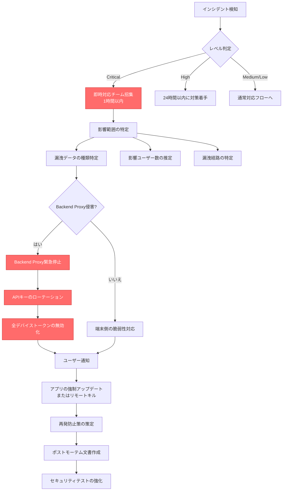

### 8.3 リモートキル / 強制アップデート戦略

#### 8.3.1 Feature Flag によるリモート制御

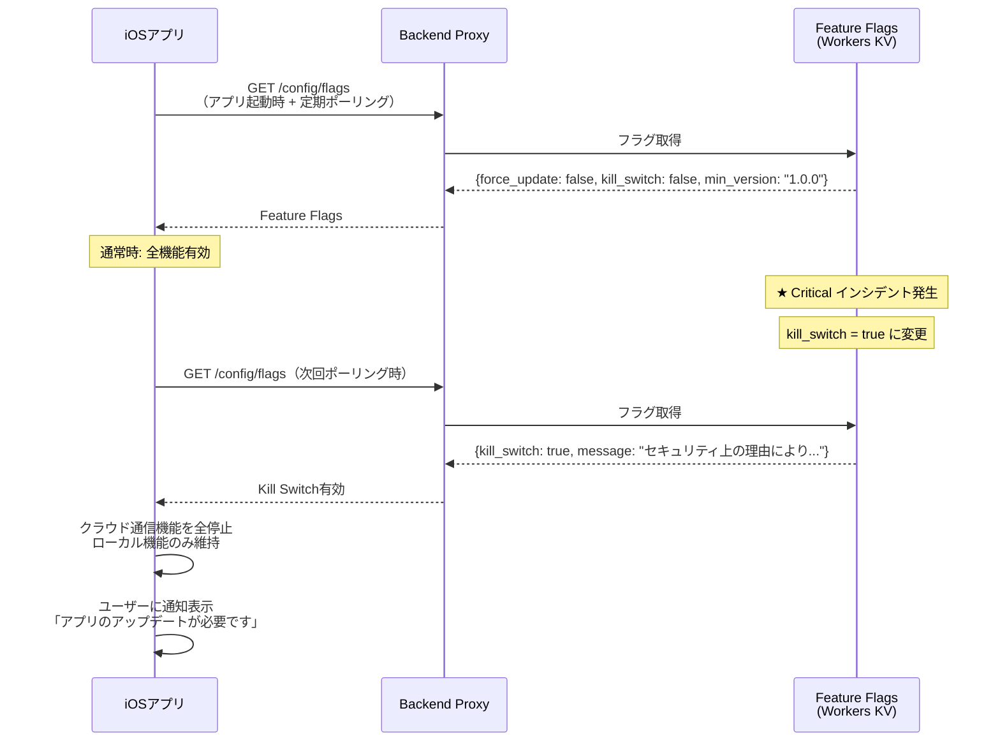

#### 8.3.2 制御レベル

| 制御レベル | 動作 | 用途 |
|:-----------|:-----|:-----|
| **Kill Switch** | クラウド通信機能の全停止。ローカル機能（録音・閲覧・検索）は維持 | Backend Proxy侵害時 |
| **Force Update** | App Storeへのアップデート誘導ダイアログ（非dismissible） | クリティカルな脆弱性修正時 |
| **Soft Update** | アップデート推奨ダイアログ（dismissible） | 重要なセキュリティ修正時 |
| **Feature Disable** | 特定機能のみ無効化 | 特定機能に限定された脆弱性対応時 |

#### 8.3.3 ポーリング設計

| 項目 | 設定値 |
|:-----|:-------|
| ポーリング間隔 | アプリ起動時 + 30分毎 |
| ネットワーク非接続時 | 直前のキャッシュを使用（最大24時間有効） |
| キャッシュの保存先 | Keychain（改ざん防止のため署名付き） |
| フォールバック | ポーリング失敗時は既存の設定で動作継続 |

### 8.4 個人開発体制での現実的なインシデント対応

本アプリは個人開発であるため、企業レベルのインシデント対応チームは存在しない。以下の現実的な対応策を定める。

| 対応項目 | 実装 |
|:---------|:-----|
| 監視 | Cloudflare Analyticsでの異常トラフィック検知。Workers ログの日次確認 |
| アラート | Cloudflare Workers の Error Rate が閾値超過時にメール通知 |
| 初動対応 | Cloudflare ダッシュボードからの即時Workers停止（スマートフォンから操作可能） |
| 強制アップデート | App Store Connect から緊急審査申請（Expedited Review） |
| ユーザー通知 | アプリ内通知（Feature Flagsシステム経由） |
| 事後対応 | ポストモーテム文書作成、セキュリティテスト計画の更新 |

---

## 9. NFR対応マッピング

### 9.1 非機能要件との対応表

| NFR ID | 要件概要 | 本設計書での対応箇所 | 対応状況 |
|:-------|:---------|:---------------------|:---------|
| **NFR-007** | データ暗号化（NSFileProtectionCompleteUntilFirstUserAuthentication） | [2.2 iOS Data Protection の適用設計](#22-ios-data-protection-の適用設計nfr-007対応) | 完全対応 |
| **NFR-008** | APIキー非保持 | [3.1 通信アーキテクチャ概要](#31-通信アーキテクチャ概要)、[6.2 Backend Proxyでのデータ非保持保証](#62-backend-proxyでのデータ非保持保証) | 完全対応 |
| **NFR-009** | 通信暗号化（TLS 1.3以上） | [3.2 ATS設定](#32-app-transport-securityats設定nfr-009対応)、[3.4 MITM対策](#34-中間者攻撃mitm対策) | 完全対応 |
| **NFR-010** | 認証トークン管理（Keychain保存） | [2.3 Keychain利用設計](#23-keychain利用設計nfr-010対応)、[4.2 デバイストークンフロー](#42-デバイストークン生成検証フローmvp) | 完全対応 |
| **NFR-011** | プライバシーポリシー準拠 | [5.4 App Store審査対応](#54-app-store審査対応) | 設計完了。文書作成は公開時 |
| **NFR-021** | iCloudバックアップ除外 | [2.4 iCloudバックアップ除外の実装](#24-icloudバックアップ除外の実装nfr-021対応) | 完全対応 |

### 9.2 OWASP Mobile Top 10 (2024) 対応表

| OWASP ID | 脅威カテゴリ | 本アプリでのリスク | 対策 | 対応箇所 |
|:---------|:-------------|:-------------------|:-----|:---------|
| **M1** | Improper Credential Usage | デバイストークンの不適切な管理 | Keychain保存（`ThisDeviceOnly`属性） | 2.3, 4.2 |
| **M2** | Inadequate Supply Chain Security | サードパーティ依存の脆弱性 | Dependabot、SPM Audit | 7.2.3 |
| **M3** | Insecure Authentication/Authorization | 認証バイパス、権限昇格 | サーバー側トークン検証、サブスクリプション検証 | 4.2, 4.3 |
| **M4** | Insufficient Input/Output Validation | テキスト注入攻撃 | 送信データのサニタイズ、レスポンス検証 | 6.1 |
| **M5** | Insecure Communication | MITM攻撃による通信傍受 | TLS 1.3強制、ATS設定、リクエスト署名 | 3.2, 3.4, 3.5 |
| **M6** | Inadequate Privacy Controls | プライバシーデータの不適切な取り扱い | ローカル主保存、iCloudバックアップ除外、最小データ送信 | 2.4, 5.2, 6.1 |
| **M7** | Insufficient Binary Protections | リバースエンジニアリング | APIキー非保持（根本対策）、Jailbreak検知 | NFR-008, 7.3.2 |
| **M8** | Security Misconfiguration | 不適切なファイル保護レベル設定 | NSFileProtection明示設定、バックアップ除外設定 | 2.2, 2.4 |
| **M9** | Insecure Data Storage | 端末紛失時のデータ露出 | iOS Data Protection、Keychain | 2.2, 2.3 |
| **M10** | Insufficient Cryptography | 弱い暗号アルゴリズムの使用 | iOS標準暗号化（AES-256）、HMAC-SHA256 | 2.2, 3.5 |

### 9.3 実装フェーズマッピング

| フェーズ | セキュリティ実装項目 | 対応する要件 |
|:---------|:---------------------|:-------------|
| **P1（MVP）** | iOS Data Protection設定（確定済み=Complete、一時=UntilFirstAuth）、iCloudバックアップ除外、Keychain基本実装 | NFR-007, NFR-021 |
| **P2** | メモ完全削除の実装、データサニタイズ | REQ-017 |
| **P3** | Backend Proxy認証、TLS 1.3設定、**App Attest（attestation/assertion）**、デバイストークン認証、Feature Flagsシステム | NFR-008, NFR-009, NFR-010 |
| **P4** | Apple Sign In、Certificate Pinning検討、Jailbreak検知、プライバシーポリシー策定 | NFR-011, REQ-027 |

---

## 付録

### A. セキュリティ設計チェックリスト

開発時に各フェーズで確認するチェックリスト。

#### P1（MVP）チェックリスト

- [ ] 録音中一時ファイルに`NSFileProtectionCompleteUntilFirstUserAuthentication`が設定されている
- [ ] 確定済みデータ（音声・SwiftData）に`NSFileProtectionComplete`が設定されている（※統合仕様書 v1.0 準拠）
- [ ] 音声ファイルディレクトリ（`Documents/Audio/`）に`isExcludedFromBackup = true`が設定されている
- [ ] SwiftDataストアディレクトリ（`SecureStore/`）に`isExcludedFromBackup = true`が設定されている
- [ ] `print()`/`NSLog()`がリリースビルドに含まれていない
- [ ] ハードコードされた認証情報が存在しない
- [ ] Privacy Manifest（PrivacyInfo.xcprivacy）がApp Privacy申告と整合している（※統合仕様書 v1.0 準拠）

#### P3（Backend Proxy導入時）チェックリスト

- [ ] APIキーがアプリバイナリ・端末ストレージに含まれていない
- [ ] Backend Proxyとの通信がTLS 1.3以上で暗号化されている
- [ ] デバイストークンがKeychainに安全に保存されている（全項目`ThisDeviceOnly`）
- [ ] **App Attestのattestation/assertion検証が実装されている**（※統合仕様書 v1.0 準拠 Critical #7/#8）
- [ ] App AttestキーIDがKeychainに保存されている
- [ ] リクエストにApp Attest assertionが付加されている
- [ ] Backend Proxyがテキストデータを永続ストレージに保存していない
- [ ] アクセスログにテキスト内容が含まれていない
- [ ] レート制限が設定されている
- [ ] Feature Flagsシステムが動作している

#### P4（公開時）チェックリスト

- [ ] Apple Sign Inが正しく実装されている
- [ ] プライバシーポリシーが策定・公開されている
- [ ] App Store審査対応の権限説明文言が適切である
- [ ] App Privacyの申告内容が実態と一致している
- [ ] OWASP Mobile Top 10の全項目に対策が実施されている

### B. 用語集

| 用語 | 定義 |
|:-----|:-----|
| App Attest | DCAppAttestServiceによるデバイス正当性検証の仕組み。Secure Enclaveで生成された鍵を用いてAttestation/Assertionを行い、デバイスの真正性を暗号学的に検証する |
| ATS | App Transport Security。iOSの通信セキュリティフレームワーク |
| Certificate Pinning | サーバー証明書の公開鍵ハッシュをアプリに埋め込み、中間者攻撃を防止する技術 |
| DPA | Data Processing Agreement。データ処理契約 |
| Feature Flag | リモートから機能の有効/無効を切り替える仕組み |
| HMAC | Hash-based Message Authentication Code。メッセージ認証コード |
| Kill Switch | 緊急時にアプリの特定機能を即座に停止する仕組み |
| MITM | Man-in-the-Middle。中間者攻撃 |
| OWASP | Open Web Application Security Project |
| SPKI | Subject Public Key Info。証明書ピンニングで使用する公開鍵情報 |
| STRIDE | Spoofing, Tampering, Repudiation, Information Disclosure, DoS, Elevation of Privilege の脅威分類モデル |
| ZDR | Zero Data Retention。APIプロバイダがリクエストデータを保持しないポリシー |
