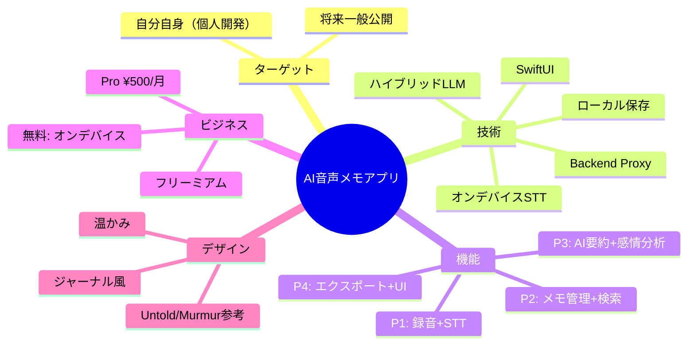

# AI音声メモ・日記アプリ ヒアリング記録

> **文書ID**: INT-DOC-001
> **バージョン**: 1.1
> **作成日**: 2026-03-15
> **ステータス**: 確定

## 信頼性レベル凡例

| マーク | 意味 |
|:------:|:-----|
| 🔵 | ヒアリングで明確に確認した内容 |
| 🟡 | ヒアリング結果から妥当に推測した内容 |
| 📎 | 外部根拠: 市場調査レポート等の外部資料から引用した内容 |
| 🔴 | ヒアリングにない推測・業界標準からの補完 |

---

## 関連文書

| 文書 | パス |
|:-----|:-----|
| 統合機能要件書 | [requirements.md](./requirements.md) |
| ユーザーストーリー | [user-stories.md](./user-stories.md) |
| 受け入れ基準 | [acceptance-criteria.md](./acceptance-criteria.md) |

---

## ヒアリング概要

| 項目 | 内容 |
|:-----|:-----|
| 実施日 | 2026-03-15 |
| 参加者 | プロダクトオーナー（開発者本人） |
| 目的 | AI音声メモ・日記アプリの要件確定 |
| 形式 | 構造化インタビュー（13問、うちQ13はQ3に統合） |

---

## Q1: ターゲットユーザー 🔵

**質問**: このアプリの主なターゲットユーザーは誰ですか？

**回答**:
> 自分自身（個人開発）。まずはドッグフーディングで自分が使い込む。将来的には一般公開を目指す。

**決定事項**:
- **DEC-001**: 初期ターゲット: 開発者自身 → REQ-001
- **DEC-002**: 将来展開: 一般ユーザーへの公開 → REQ-002

**補足・推測** 🟡:
- 個人開発のため、初期は自分のユースケースに最適化して問題ない
- 一般公開時には多様なユーザーペルソナを改めて定義する必要がある

---

## Q2: プラットフォーム 🔵

**質問**: 対応するプラットフォームはどれですか？

**回答**:
> iOSのみ（MVP）。

**決定事項**:
- **DEC-003**: MVP: iOS単一プラットフォーム → NFR-001
- Android、Web等は将来検討

**補足・推測** 🟡:
- iOS最低サポートバージョンは未確定（iOS 17以上を推奨）
- iPad対応の優先度は未確認

---

## Q3: MVP機能スコープ・実装優先度 🔵

**質問**: MVPに含める機能の優先度はどうしますか？

**回答**:
> 全機能を段階的に実装する。優先順位は以下の通り:
> - P1: 録音 + STT（文字起こし）
> - P2: メモ保存 + 一覧 + 検索
> - P3: AI要約・タグ付け + 感情分析
> - P4: Markdownエクスポート + UI磨き込み

**決定事項**:
- **DEC-004**: 4フェーズ段階的実装 → REQ-003
  - P1: 録音+STT → P2: メモ保存+一覧+検索 → P3: AI要約・タグ+感情分析 → P4: Markdownエクスポート+UI磨き込み
  - 各フェーズは前のフェーズの完了後に開始
- **DEC-005**: 品質優先で期限なし → NFR-002

**補足・推測** 🟡:
- P1がMVPの最小スコープとなる
- 各フェーズ完了時にドッグフーディングで評価を行う想定
- 各フェーズの見積もり期間は未設定
- フェーズ間のマイルストーン・レビュー基準は未定義

---

## Q4: データ保存方針 🔵

**質問**: データの保存先はどうしますか？

**回答**:
> 完全ローカル（端末内のみ）。

**決定事項**:
- **DEC-006**: 完全ローカル保存（クラウド同期なし、iCloud同期も対象外） → NFR-003

**補足・推測** 🟡:
- 端末紛失・故障時のデータ復旧手段は未定義
- 将来的にオプションのiCloudバックアップは検討の余地あり

**外部根拠** 📎:
- 市場調査でプライバシー懸念がユーザーの主要ペインとして特定されており、この方針は妥当

---

## Q5: 技術スタック 🔵

**質問**: 開発に使用する技術スタックは？

**回答**:
> SwiftUI。

**決定事項**:
- **DEC-007**: UI: SwiftUI / 言語: Swift → NFR-004

**補足・推測** 🟡:
- データ永続化: SwiftData または Core Data（未確定）
- 音声処理: AVFoundation
- 検索: Core Spotlight または SQLite FTS（未確定）

---

## Q6: STT（音声文字起こし）方針 🔵

**質問**: 音声文字起こしの技術方針はどうしますか？

**回答**:
> 完全オンデバイス。Apple SpeechAnalyzer または Whisper.cpp を使用する。

**決定事項**:
- **DEC-008**: 完全オンデバイスSTT（候補: Apple Speech framework / Whisper.cpp、ネットワーク不要） → REQ-004, NFR-005

**補足・推測** 🟡:
- Apple Speech frameworkはiOS標準で導入コストが低い
- Whisper.cppは精度が高いがモデルサイズ（約75MB〜）とバッテリー消費が課題
- 両方を実装してユーザーが選択できる設計が望ましい可能性あり

**外部根拠** 📎:
- 市場調査で日本語STT精度がユーザー最大のペインと特定されている

---

## Q7: LLM方針 🔵

**質問**: AI処理（要約・タグ付け等）のLLM方針はどうしますか？

**回答**:
> ハイブリッド。基本はオンデバイスで処理し、高度な処理はクラウド（Backend Proxy経由）で行う。

**決定事項**:
- **DEC-009**: ハイブリッドLLM方式（オンデバイス: 基本要約・キーワード抽出 / クラウド: 高精度要約・複雑なタグ付け・感情分析） → REQ-005, NFR-006
- **DEC-010**: クラウド通信はBackend Proxy経由 → NFR-007

**補足・推測** 🟡:
- オンデバイスLLM候補: Apple Intelligence / Core ML models
- オンデバイスとクラウドの使い分け基準は未確定

**外部根拠** 📎:
- クラウドLLM候補: GPT-4o mini（市場調査でコスト$0.02/月/ユーザーと試算）

---

## Q8: 利用シーン 🔵

**質問**: このアプリの主な利用シーンは？

**回答**:
> - 思考整理: 考えをまとめるために声に出して整理する
> - アイデアメモ: ふとした思いつきを即座に記録する
> - 日記・振り返り: 一日の出来事や感情を記録して振り返る

**決定事項**:
- **DEC-011**: 3つの主要利用シーン（思考整理・アイデアメモ・日記/振り返り）をサポートし、各シーンに最適化したUI/UXを設計 → REQ-006

**補足・推測** 🟡:
- 思考整理: 長めの録音（5〜15分）が想定される
- アイデアメモ: 短い録音（30秒〜2分）が想定される
- 日記・振り返り: 定期的（毎日）な利用パターンが想定される
- 会議メモやインタビュー録音は現時点ではスコープ外

---

## Q9: 感情分析方針 🔵

**質問**: 感情分析はどのように行いますか？

**回答**:
> テキストベース。LLMで文字起こしテキストから感情を推定する。

**決定事項**:
- **DEC-012**: テキストベース感情分析（音声トーンではなくテキスト内容からLLMで感情を推定・分類） → REQ-007

**補足・推測** 🟡:
- 感情カテゴリの定義は未確定（例: ポジティブ/ネガティブ/ニュートラル、または喜怒哀楽等の多段階）
- 感情スコアの粒度（バイナリ vs 数値 vs 多カテゴリ）は設計時に決定
- 日記用途を考慮すると、6〜8段階程度の感情カテゴリが適切と推測

---

## Q10: エクスポート形式 🔵

**質問**: メモのエクスポート形式はどうしますか？

**回答**:
> Markdown形式。

**決定事項**:
- **DEC-013**: Markdownエクスポート（Proプラン限定機能） → REQ-008

**補足・推測** 🟡:
- Obsidian、Notion等のナレッジ管理ツールとの連携を想定
- エクスポート時のMarkdownテンプレート（メタデータ、タグ、感情等の含め方）は設計時に決定
- 一括エクスポートの可否は未確定

---

## Q11: UIデザイン方針 🔵

**質問**: UIデザインの方向性はどうしますか？

**回答**:
> 感性的・ジャーナル風。Untold/Murmur的な温かみのあるデザイン。

**決定事項**:
- **DEC-014**: ジャーナル風UI（温かみのあるデザインコンセプト、参考: Untold、Murmur） → NFR-008

**補足・推測** 🟡:
- カラーパレット: 暖色系（アンバー、クリーム、テラコッタ等）を基調とする
- タイポグラフィ: 手書き風または柔らかいセリフ体を検討
- アニメーション: 控えめで心地よいトランジション
- Proプランのテーマカスタマイズで複数テーマを提供予定

---

## Q12: APIキー管理 🔵

**質問**: クラウドAPIのキー管理はどうしますか？

**回答**:
> 最初からBackend Proxyを構築する。Cloudflare Workers等を利用。

**決定事項**:
- **DEC-015**: 最初からBackend Proxy構築（APIキーをアプリに埋め込まず、Proxyサーバーで管理。候補: Cloudflare Workers） → NFR-009

**補足・推測** 🟡:
- Cloudflare Workersは無料枠が大きく個人開発に適している
- ユーザー認証方式（Anonymous Auth / Apple Sign In等）は未確定
- レート制限の実装方針は設計時に決定

---

## Q13: 実装優先度

> **※ Q3（MVP機能スコープ・実装優先度）に統合済み。** 実装フェーズ（P1〜P4）の詳細および決定事項（DEC-004, DEC-005）はQ3を参照。

---

## 追加確認事項（未ヒアリング） 🔴

以下の項目はヒアリングでは未確認であり、設計フェーズで決定が必要:

### 技術的事項

| # | 項目 | 想定される選択肢 | 推奨 | 優先度 | 解決期限 | オーナー |
|:--|:-----|:-----------------|:-----|:-------|:---------|:---------|
| 1 | iOSサポート最低バージョン | iOS 16 / 17 / 18 | iOS 17（SwiftData利用可能） | High | 設計フェーズ開始前 | 開発者本人 |
| 2 | データ永続化フレームワーク | SwiftData / Core Data / SQLite | SwiftData | High | 設計フェーズ開始前 | 開発者本人 |
| 3 | 検索エンジン | SQLite FTS5 / Core Spotlight | SQLite FTS5 | Medium | P2実装前 | 開発者本人 |
| 4 | 音声フォーマット | AAC / OPUS / WAV | AAC（iOS標準、圧縮効率良好） | Medium | P1実装前 | 開発者本人 |
| 5 | オンデバイスLLMフレームワーク | Core ML / llama.cpp | Core ML | Medium | P3実装前 | 開発者本人 |
| 6 | CI/CD | Xcode Cloud / GitHub Actions | Xcode Cloud | Low | リリース前 | 開発者本人 |

### ビジネス的事項

| # | 項目 | 備考 | 優先度 | 解決期限 | オーナー |
|:--|:-----|:-----|:-------|:---------|:---------|
| 1 | アプリ名 | **Soyoka（つぶやき）** に決定 | ~~High~~ 解決済み | App Store申請前 | 開発者本人 |
| 2 | App Store カテゴリ | Productivity or Lifestyle | Medium | App Store申請前 | 開発者本人 |
| 3 | プライバシーポリシー | 一般公開前に作成必要 | High | 一般公開前 | 開発者本人 |
| 4 | サブスクリプション無料トライアル期間 | 7日 or 14日（未決定） | Medium | P3実装前 | 開発者本人 |
| 5 | Apple Sign In対応 | Proxy認証に必要（未確定） | High | Proxy構築時 | 開発者本人 |
| 6 | 分析ツール | Firebase Analytics / 自前（未確定） | Low | 一般公開前 | 開発者本人 |

---

## 市場調査からの重要知見（参考） 📎

ヒアリングの背景として以下の市場調査結果を確認済み:

| 項目 | 知見 | 出典 |
|:-----|:-----|:-----|
| 市場機会 | 「日本語 x AI音声日記」の空白地帯が存在（競合28アプリ分析） | [グローバル競合市場調査](../../reports/20260314_01_音声メモアプリ_グローバル競合市場調査.md) |
| STTコスト | オンデバイス$0 / クラウド月$0.27/ユーザー | [STT APIコスト調査](../../reports/20260315_01_音声メモアプリ_STT_APIコスト調査.md) |
| LLMコスト | GPT-4o miniで月$0.02/ユーザー | [LLM APIコスト調査](../../reports/20260315_01_音声メモアプリ_LLM_APIコスト調査.md) |
| 最大リスク | 2026年春のApple Siri刷新 | [グローバル競合市場調査](../../reports/20260314_01_音声メモアプリ_グローバル競合市場調査.md) |
| 成功の鍵 | 「録音→活用」ギャップを埋めるAI整理機能 | [グローバル競合市場調査](../../reports/20260314_01_音声メモアプリ_グローバル競合市場調査.md) |
| ユーザーペイン | 日本語STT精度、プライバシー懸念、検索・整理不足 | [日本市場競合再調査](../../reports/20260315_04_日本市場AI音声日記アプリ競合再調査.md) |

---

## ヒアリング結果サマリー

