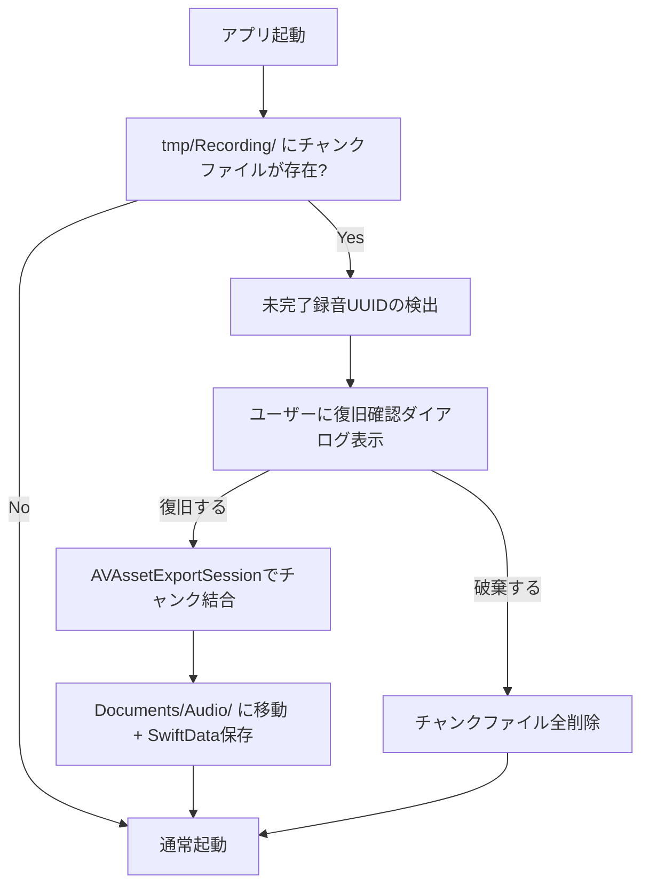

# TASK-0004: クラッシュリカバリ（録音自動保存）

**タスクID**: TASK-0004
**タスクタイプ**: TDD
**推定工数**: 8h
**フェーズ**: Phase 1 - 基盤構築 + 録音 + STT
**信頼性レベル**: :large_blue_circle: *設計文書01-system-architecture.md, 00-integration-spec.md準拠*

## 関連文書
- **概要**: [overview.md](overview.md)
- **要件定義**: [requirements.md](../../spec/ai-voice-memo/requirements.md) - REQ-014, NFR-017, EC-003
- **設計文書**: [01-system-architecture.md](../../spec/ai-voice-memo/design/01-system-architecture.md) - セクション6.4(TemporaryRecordingStore)
- **統合仕様書**: [00-integration-spec.md](../../spec/ai-voice-memo/design/00-integration-spec.md) - セクション5.2(Critical #2: AVAssetExportSession方式)

## タスク概要

録音中のクラッシュやアプリ強制終了からデータを保護するため、5秒間隔のチャンク保存機能を実装する。チャンク結合にはAVMutableComposition + AVAssetExportSessionを使用し（統合仕様書Critical #2準拠: Data.append()による単純バイト連結は禁止）、アプリ再起動時に未完了録音を検出して復旧するフローを実装する。

## 依存タスク
- **前提**: TASK-0003（音声録音エンジン）
- **後続**: TASK-0009（録音完了フロー）

## 完了条件
- [ ] 5秒間隔でチャンクファイル（M4Aフォーマット）が保存される
- [ ] AVMutableComposition + AVAssetExportSessionによるチャンク結合が動作する（Data.append()禁止）
- [ ] アプリ再起動時に未完了録音のUUIDリストが検出される
- [ ] 未完了録音のチャンクから有効な音声ファイルが復元される
- [ ] チャンクファイルは `tmp/Recording/{UUID}_chunk_{N}.m4a` 形式で保存される
- [ ] 結合完了後にチャンクファイルが自動削除される
- [ ] 全テストがパス
- [ ] カバレッジ80%以上

## 実装詳細

### 1. TemporaryRecordingStore :large_blue_circle:

01-Archセクション6.4 + 統合仕様書Critical #2準拠。

```swift
// InfraStorage/FileStore/TemporaryRecordingStore.swift
struct TemporaryRecordingStore {
    private let tempDirectory: URL  // tmp/Recording/

    /// チャンクの保存（5秒間隔で呼び出し）
    func saveChunk(recordingID: UUID, chunkIndex: Int, data: Data) throws -> URL {
        let fileName = "\(recordingID.uuidString)_chunk_\(chunkIndex).m4a"
        let fileURL = tempDirectory.appendingPathComponent(fileName)
        try data.write(to: fileURL, options: [.atomic])
        return fileURL
    }
}
```

### 2. AVAssetExportSession によるチャンク結合 :large_blue_circle:

**統合仕様書Critical #2**: 単純な `Data.append()` によるAAC連結は禁止。AVMutableComposition でトラックを時間軸に沿って正しく結合する。

```swift
func finalizeRecording(recordingID: UUID) async throws -> URL {
    let chunkURLs = try FileManager.default
        .contentsOfDirectory(at: tempDirectory, includingPropertiesForKeys: nil)
        .filter { $0.lastPathComponent.hasPrefix(recordingID.uuidString) }
        .sorted { $0.lastPathComponent < $1.lastPathComponent }

    let composition = AVMutableComposition()
    guard let track = composition.addMutableTrack(
        withMediaType: .audio,
        preferredTrackID: kCMPersistentTrackID_Invalid
    ) else { throw RecordingError.compositionFailed }

    var currentTime = CMTime.zero
    for chunkURL in chunkURLs {
        let asset = AVURLAsset(url: chunkURL)
        let duration = try await asset.load(.duration)
        guard let audioTrack = try await asset.loadTracks(withMediaType: .audio).first else { continue }
        try track.insertTimeRange(
            CMTimeRange(start: .zero, duration: duration),
            of: audioTrack, at: currentTime
        )
        currentTime = CMTimeAdd(currentTime, duration)
    }

    let outputURL = tempDirectory.appendingPathComponent("\(recordingID.uuidString)_final.m4a")
    guard let exportSession = AVAssetExportSession(
        asset: composition, presetName: AVAssetExportPresetAppleM4A
    ) else { throw RecordingError.exportFailed }
    exportSession.outputURL = outputURL
    exportSession.outputFileType = .m4a
    await exportSession.export()

    guard exportSession.status == .completed else { throw RecordingError.exportFailed }

    // チャンクファイルの削除
    for chunkURL in chunkURLs { try? FileManager.default.removeItem(at: chunkURL) }
    return outputURL
}
```

### 3. 未完了録音の検出 :large_blue_circle:

アプリ再起動時に `tmp/Recording/` ディレクトリを走査し、チャンクファイルが残存しているUUIDを検出する。

```swift
func recoverUnfinishedRecordings() -> [UUID] {
    guard let contents = try? FileManager.default.contentsOfDirectory(
        at: tempDirectory, includingPropertiesForKeys: nil
    ) else { return [] }

    let recordingIDs = Set(contents.compactMap { url -> UUID? in
        let name = url.deletingPathExtension().lastPathComponent
        let uuidString = String(name.prefix(36))
        return UUID(uuidString: uuidString)
    })
    return Array(recordingIDs)
}
```

### 4. 5秒間隔チャンク保存タイマー :large_blue_circle:

録音エンジン（TASK-0003）と連携し、5秒間隔でPCMバッファをM4Aチャンクとして保存する。AVAudioFile経由でチャンク単位のM4Aファイルを書き出す。

```swift
// 5秒間隔でチャンクを確定・保存
private func scheduleChunkSaving(recordingID: UUID) -> AsyncStream<Int> {
    AsyncStream { continuation in
        Task {
            var chunkIndex = 0
            while isRecording {
                try await Task.sleep(for: .seconds(5))
                if isRecording {
                    // 現在のAVAudioFileを閉じ、新しいチャンクを開始
                    try rotateAudioFile(recordingID: recordingID, chunkIndex: chunkIndex)
                    continuation.yield(chunkIndex)
                    chunkIndex += 1
                }
            }
            continuation.finish()
        }
    }
}
```

### 5. 復旧フロー :large_blue_circle:



## テスト要件

### 正常系
- 5秒間隔でチャンクファイルが生成されること
- チャンクファイルが `{UUID}_chunk_{N}.m4a` 形式で保存されること
- AVAssetExportSessionでチャンク結合後、有効なM4Aファイルが生成されること
- 結合後のファイルの再生時間がチャンクの合計時間と一致すること
- 結合完了後にチャンクファイルが削除されること

### 異常系
- 強制終了シミュレーション: チャンクファイルが残存していること
- 不完全なチャンク（途中で切れたファイル）がある場合のスキップ処理
- チャンクが0件の場合のエラーハンドリング
- AVAssetExportSession失敗時のリトライまたはエラー通知

### 復旧フロー
- アプリ再起動時に `recoverUnfinishedRecordings()` が正しいUUIDリストを返すこと
- 復旧済みのチャンクからfinalizeRecordingが成功すること
- 破棄を選択した場合にチャンクが全削除されること

## 実装手順
1. **tdd-requirements**: チャンク保存・結合・復旧の要件整理
2. **tdd-testcases**: テストケース設計（正常系:5件, 異常系:4件, 復旧:3件）
3. **tdd-red**: テストコード先行記述
4. **tdd-green**: TemporaryRecordingStore実装 -> チャンク保存 -> AVAssetExportSession結合 -> 復旧フロー
5. **tdd-refactor**: エラーハンドリング統一、ファイル操作のアトミック性改善
6. **tdd-verify-complete**: カバレッジ80%以上確認

## 信頼性レベルサマリー
- :large_blue_circle:: 5件（全て設計書準拠）
- :yellow_circle:: 0件
- :red_circle:: 0件
