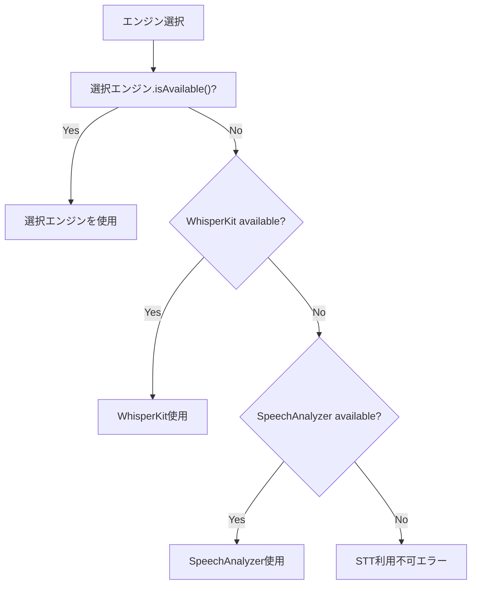

# TASK-0007: STTエンジン切替ロジック

**タスクID**: TASK-0007
**タスクタイプ**: TDD
**推定工数**: 4h
**フェーズ**: Phase 1 - 基盤構築 + 録音 + STT
**信頼性レベル**: :large_blue_circle: *設計文書01-system-architecture.md, 00-integration-spec.md準拠*

## 関連文書
- **概要**: [overview.md](overview.md)
- **要件定義**: [requirements.md](../../spec/ai-voice-memo/requirements.md) - REQ-002, REQ-009
- **設計文書**: [01-system-architecture.md](../../spec/ai-voice-memo/design/01-system-architecture.md) - セクション4.2(STTエンジン切替フロー)
- **統合仕様書**: [00-integration-spec.md](../../spec/ai-voice-memo/design/00-integration-spec.md) - セクション3.1(STTEngineType統一enum), セクション7(iOS対応バージョン戦略)

## タスク概要

iOS版判定に基づくSTTエンジンの自動切替ロジックを実装する。iOS 26+ではSpeechAnalyzerを優先、iOS 17-25ではWhisperKitを使用する。ユーザー設定での手動切替、信頼度しきい値に基づく3段階の信頼度表示、ProプランでのクラウドSTT切替も含む。

## 依存タスク
- **前提**: TASK-0005（Apple Speech Framework STT）, TASK-0006（WhisperKit STT）
- **後続**: TASK-0008（録音画面UI）

## 完了条件
- [ ] iOS版判定によるSTTエンジン自動選択が動作（26+ -> SpeechAnalyzer, 17-25 -> WhisperKit）
- [ ] STTEngineType enum（`.speechAnalyzer` / `.whisperKit` / `.cloudSTT`）が統合仕様書準拠
- [ ] ユーザー設定（UserSettings.preferredSTTEngine）による手動切替が動作
- [ ] 信頼度しきい値による3段階判定（>=0.7: 高信頼, 0.4-0.7: 中信頼, <0.4: 低信頼）
- [ ] Proプラン + ネットワーク接続時にクラウドSTT切替が可能
- [ ] エンジン利用不可時のフォールバックが動作
- [ ] 全テストがパス
- [ ] カバレッジ80%以上

## 実装詳細

### 1. STTEngineSelector :large_blue_circle:

01-Archセクション4.2のSTTエンジン切替フロー準拠。統合仕様書セクション7.3の条件分岐パターンに従う。

```swift
// Domain/Services/STTEngineSelector.swift
import Foundation

/// STTエンジンの自動選択ロジック
/// 統合仕様書セクション7.3: iOS バージョン分岐の統一パターン
struct STTEngineSelector {

    /// iOS版・デバイス性能・プラン・ネットワーク状態に基づきSTTエンジンを選択
    func selectEngine(
        userPreference: STTEngineType?,
        subscriptionPlan: SubscriptionPlan,
        isNetworkAvailable: Bool,
        isDeviceCapable: Bool   // A16+ & 6GB+
    ) -> STTEngineType {
        // 1. ユーザー手動設定がある場合はそれを優先
        if let preference = userPreference {
            return preference
        }

        // 2. Proプラン + ネットワーク接続 -> クラウドSTT
        if subscriptionPlan == .pro && isNetworkAvailable {
            return .cloudSTT
        }

        // 3. iOS 26+ -> SpeechAnalyzer
        if #available(iOS 26, *) {
            return .speechAnalyzer
        }

        // 4. A16+ & 6GB+ -> WhisperKit（高精度オンデバイス）
        if isDeviceCapable {
            return .whisperKit
        }

        // 5. フォールバック -> SpeechAnalyzer（Apple Speech Framework）
        return .speechAnalyzer
    }
}
```

### 2. STTEngineFactory（TCA @Dependency） :large_blue_circle:

TCA の `@Dependency` 経由でSTTエンジンを解決するファクトリ。

```swift
// Domain/Services/STTEngineFactory.swift
protocol STTEngineFactoryProtocol: Sendable {
    func createEngine(type: STTEngineType) -> any STTEngineProtocol
    func resolveEngine(
        userPreference: STTEngineType?,
        subscriptionPlan: SubscriptionPlan,
        isNetworkAvailable: Bool
    ) async -> any STTEngineProtocol
}

// TCA Dependency登録
extension DependencyValues {
    var sttEngineFactory: any STTEngineFactoryProtocol {
        get { self[STTEngineFactoryKey.self] }
        set { self[STTEngineFactoryKey.self] = newValue }
    }
}
```

### 3. 信頼度しきい値判定 :large_blue_circle:

TranscriptionResultのconfidence値に基づく3段階の信頼度レベル。

```swift
/// 信頼度レベル（3段階）
enum ConfidenceLevel: Sendable {
    case high       // confidence >= 0.7: 高信頼（そのまま使用可能）
    case medium     // 0.4 <= confidence < 0.7: 中信頼（要確認表示）
    case low        // confidence < 0.4: 低信頼（再録音推奨表示）

    init(confidence: Double) {
        switch confidence {
        case 0.7...:       self = .high
        case 0.4..<0.7:    self = .medium
        default:           self = .low
        }
    }

    /// UIに表示するインジケーターカラー
    var indicatorColor: String {
        switch self {
        case .high:   return "green"
        case .medium: return "yellow"
        case .low:    return "red"
        }
    }
}
```

### 4. フォールバックチェーン :large_blue_circle:

エンジンが利用不可の場合のフォールバック。



```swift
func resolveEngineWithFallback(
    preferredType: STTEngineType
) async -> (engine: any STTEngineProtocol, actualType: STTEngineType)? {
    // 優先エンジンを試行
    let preferred = createEngine(type: preferredType)
    if await preferred.isAvailable() {
        return (preferred, preferredType)
    }

    // フォールバックチェーン
    let fallbackOrder: [STTEngineType] = [.whisperKit, .speechAnalyzer]
    for type in fallbackOrder where type != preferredType {
        let engine = createEngine(type: type)
        if await engine.isAvailable() {
            return (engine, type)
        }
    }

    return nil  // 全エンジン利用不可
}
```

## テスト要件

### 正常系
- iOS 26+環境で `.speechAnalyzer` が選択されること
- iOS 17-25 + A16+環境で `.whisperKit` が選択されること
- Proプラン + ネットワーク接続時に `.cloudSTT` が選択されること
- ユーザー手動設定が最優先されること
- 信頼度0.8で `ConfidenceLevel.high` が返されること
- 信頼度0.5で `ConfidenceLevel.medium` が返されること
- 信頼度0.2で `ConfidenceLevel.low` が返されること

### 異常系
- 選択エンジンが利用不可時にフォールバックが動作すること
- 全エンジン利用不可時にnilが返されること
- ネットワーク切断時に `.cloudSTT` が選択されないこと

## 実装手順
1. **tdd-requirements**: STTエンジン切替の要件整理（バージョン分岐、フォールバック）
2. **tdd-testcases**: テストケース設計（正常系:7件, 異常系:3件）
3. **tdd-red**: テストコード先行記述（MockSTTEngine準備含む）
4. **tdd-green**: STTEngineSelector -> STTEngineFactory -> ConfidenceLevel -> フォールバック
5. **tdd-refactor**: 条件分岐の簡潔化
6. **tdd-verify-complete**: カバレッジ80%以上確認

## 信頼性レベルサマリー
- :large_blue_circle:: 4件（全て設計書準拠）
- :yellow_circle:: 0件
- :red_circle:: 0件
