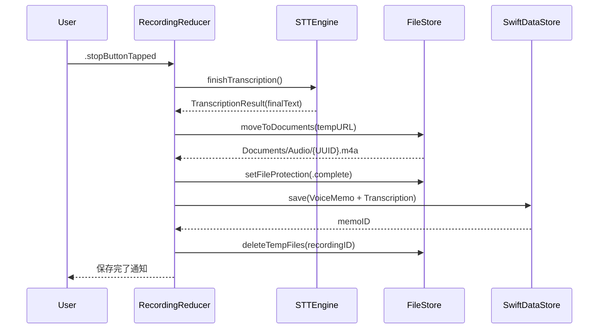

# TASK-0009: 録音完了フロー + メモ保存

**タスクID**: TASK-0009
**タスクタイプ**: TDD
**推定工数**: 4h
**フェーズ**: Phase 1 - 基盤構築 + 録音 + STT
**信頼性レベル**: :large_blue_circle: *設計文書01-system-architecture.md, 00-integration-spec.md準拠*

## 関連文書
- **概要**: [overview.md](overview.md)
- **要件定義**: [requirements.md](../../spec/ai-voice-memo/requirements.md) - REQ-008, REQ-014
- **設計文書**: [01-system-architecture.md](../../spec/ai-voice-memo/design/01-system-architecture.md) - セクション4.1(録音フロー: 停止→保存), セクション6(ローカルストレージ)
- **統合仕様書**: [00-integration-spec.md](../../spec/ai-voice-memo/design/00-integration-spec.md) - セクション8.1(データ保護レベル分離)

## タスク概要

録音停止から文字起こし確定、VoiceMemo + Transcription のSwiftData保存、音声ファイルのDocuments/Audio/への移動、確定ファイルへのNSFileProtectionComplete適用までの一連の録音完了フローを実装する。一時ファイル（tmp/Recording/）から確定ディレクトリ（Documents/Audio/）への移動とデータ保護レベルの切り替えが核心。

## 依存タスク
- **前提**: TASK-0002（SwiftDataモデル定義）, TASK-0008（録音画面UI -- RecordingReducer）
- **後続**: なし（Phase 1完了タスク）

## 完了条件
- [ ] 録音停止時に文字起こし結果が確定される
- [ ] VoiceMemo + Transcription がSwiftDataに正しく保存される
- [ ] 音声ファイルが `tmp/Recording/` から `Documents/Audio/{UUID}.m4a` に移動される
- [ ] 確定ファイルに `NSFileProtectionComplete`（最高保護レベル）が適用される
- [ ] 一時ファイルが移動後に削除される
- [ ] 保存後にメモ一覧に新しいメモが表示される
- [ ] 全テストがパス
- [ ] カバレッジ80%以上

## 実装詳細

### 1. 録音完了フロー全体 :large_blue_circle:

01-Archセクション4.1準拠。録音停止 -> STT確定 -> ファイル移動 -> SwiftData保存。



### 2. RecordingReducer 録音完了アクション :large_blue_circle:

RecordingReducer（TASK-0008）に録音完了時のEffectを追加。

```swift
// RecordingReducerへの追加
case .stopButtonTapped:
    state.recordingStatus = .idle
    return .run { [state] send in
        // 1. 録音停止
        let tempAudioURL = try await audioRecorder.stopRecording()

        // 2. STT確定
        let finalTranscription = try await sttEngine.finishTranscription()

        // 3. 音声ファイルをDocuments/Audio/に移動
        let permanentURL = try await audioFileStore.moveToDocuments(
            from: tempAudioURL,
            id: state.recordingID
        )

        // 4. NSFileProtectionComplete適用
        try audioFileStore.setFileProtection(
            url: permanentURL,
            protection: .complete
        )

        // 5. SwiftData保存
        let memo = VoiceMemo(
            title: "",  // AI要約で後から設定（Phase 2）
            durationSeconds: state.elapsedTime,
            audioFilePath: "Audio/\(state.recordingID.uuidString).m4a",
            audioFormat: .m4a
        )
        let transcription = Transcription(
            fullText: finalTranscription.text,
            language: finalTranscription.language,
            engineType: finalTranscription.engineType,
            confidence: finalTranscription.confidence
        )
        memo.transcription = transcription

        try await memoRepository.save(memo)

        // 6. 一時ファイル削除
        try await tempRecordingStore.cleanup(recordingID: state.recordingID)

        await send(.recordingSaved(memo.id))
    } catch: { error, send in
        await send(.recordingFailed(error.localizedDescription))
    }
```

### 3. AudioFileStore: ファイル移動 + 保護レベル設定 :large_blue_circle:

統合仕様書セクション8.1準拠: 確定済み音声ファイルには `NSFileProtectionComplete` を適用。

```swift
// InfraStorage/FileStore/AudioFileStore.swift (追加)
extension AudioFileStore {
    /// 一時ファイルからDocuments/Audio/への移動
    func moveToDocuments(from tempURL: URL, id: UUID) throws -> URL {
        let fileName = "\(id.uuidString).m4a"
        let destURL = audioDirectory.appendingPathComponent(fileName)

        // アトミック移動（上書き防止）
        if FileManager.default.fileExists(atPath: destURL.path) {
            try FileManager.default.removeItem(at: destURL)
        }
        try FileManager.default.moveItem(at: tempURL, to: destURL)

        // iCloudバックアップ除外
        excludeFromBackup(url: destURL)

        return destURL
    }

    /// 確定済みファイルへの最高保護レベル適用
    func setFileProtection(url: URL, protection: FileProtectionType) throws {
        try FileManager.default.setAttributes(
            [.protectionKey: protection],
            ofItemAtPath: url.path
        )
    }
}
```

### 4. MemoRepository: SwiftData保存 :large_blue_circle:

```swift
// Data/Repositories/MemoRepository.swift
protocol MemoRepositoryProtocol: Sendable {
    func save(_ memo: VoiceMemo) async throws
    func fetch(id: UUID) async throws -> VoiceMemo?
    func fetchAll() async throws -> [VoiceMemo]
    func delete(_ memo: VoiceMemo) async throws
}

final class MemoRepository: MemoRepositoryProtocol {
    private let modelContext: ModelContext

    func save(_ memo: VoiceMemo) async throws {
        modelContext.insert(memo)
        try modelContext.save()
    }
}
```

### 5. 一時ファイルクリーンアップ :large_blue_circle:

録音完了後、`tmp/Recording/` 内の該当する一時ファイル（チャンクファイル含む）を全て削除する。

```swift
extension TemporaryRecordingStore {
    func cleanup(recordingID: UUID) throws {
        let contents = try FileManager.default.contentsOfDirectory(
            at: tempDirectory, includingPropertiesForKeys: nil
        )
        for url in contents where url.lastPathComponent.hasPrefix(recordingID.uuidString) {
            try FileManager.default.removeItem(at: url)
        }
    }
}
```

## テスト要件

### 正常系
- 録音停止後にVoiceMemoがSwiftDataに保存されること
- VoiceMemoにTranscriptionが正しく紐付けられていること
- 音声ファイルが `Documents/Audio/{UUID}.m4a` に移動されていること
- 確定ファイルに `NSFileProtectionComplete` が適用されていること
- 一時ファイル（tmp/Recording/）が削除されていること
- `durationSeconds` が録音経過時間と一致すること

### 異常系
- ファイル移動失敗時のエラーハンドリング（ストレージ不足等）
- SwiftData保存失敗時のロールバック（音声ファイルを一時ディレクトリに戻す）
- STT finishTranscription失敗時でも音声ファイルは保存されること（文字起こしは空）

### データ整合性
- 保存されたVoiceMemoの `audioFilePath` が正しい相対パスであること
- Transcriptionの `confidence` / `engineType` / `language` が正しく保存されていること
- 保存後にfetchで正しく取得できること

## 実装手順
1. **tdd-requirements**: 録音完了フローの要件整理（ファイル移動、保護レベル、SwiftData保存）
2. **tdd-testcases**: テストケース設計（正常系:6件, 異常系:3件, データ整合性:3件）
3. **tdd-red**: テストコード先行記述（InMemory ModelContainer + テンプファイル使用）
4. **tdd-green**: AudioFileStore拡張 -> MemoRepository -> RecordingReducer完了フロー -> クリーンアップ
5. **tdd-refactor**: エラーハンドリング統一、ロールバック処理の堅牢化
6. **tdd-verify-complete**: カバレッジ80%以上確認

## 信頼性レベルサマリー
- :large_blue_circle:: 5件（全て設計書準拠）
- :yellow_circle:: 0件
- :red_circle:: 0件
