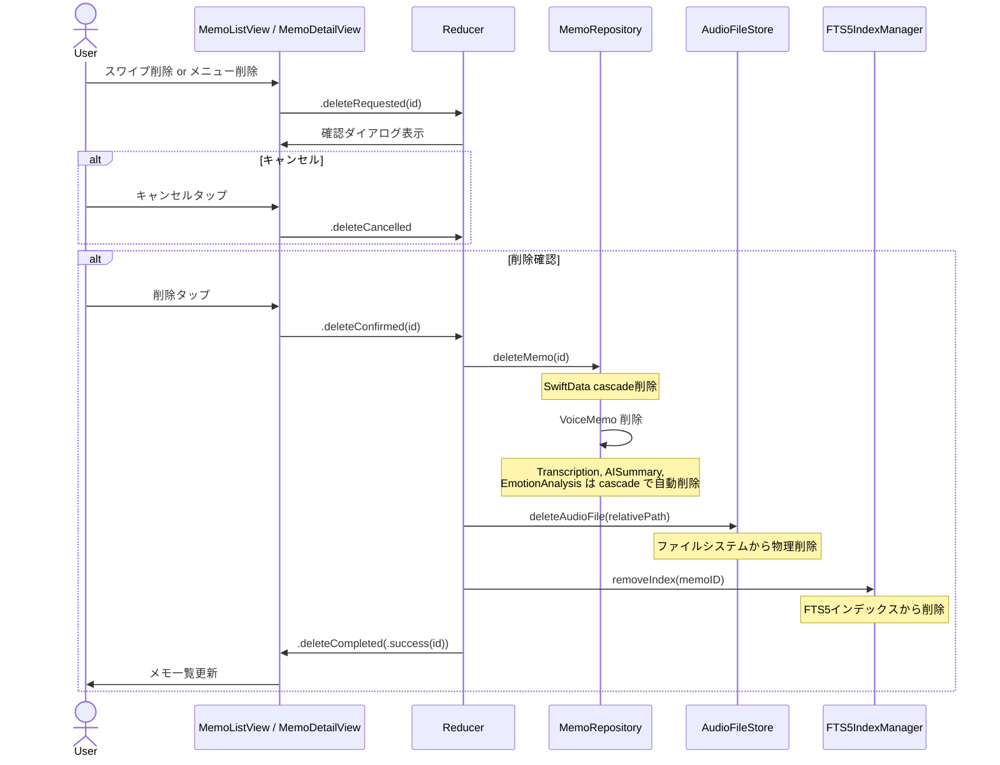

# TASK-0017: メモ削除 + 確認ダイアログ

> **タスクID**: TASK-0017
> **フェーズ**: Phase 2 - メモ管理 + 検索
> **タイプ**: TDD
> **見積工数**: 4h
> **依存タスク**: TASK-0011
> **関連要件**: REQ-017, EC-005
> **ステータス**: TODO
> **担当モジュール**: FeatureMemo, Data, InfraStorage

---

## 1. 概要

メモの完全削除機能を実装する。削除時にSwiftData（VoiceMemo + 関連エンティティ）、音声ファイル（ファイルシステムからの物理削除）、FTS5インデックスの3つを一貫して削除する。確認ダイアログを挟み、スワイプ削除およびメモ詳細画面からの削除の両方に対応する。

---

## 2. 完了条件（Definition of Done）

- [ ] MemoDeleteReducer（またはMemoListReducer内の削除ロジック）のユニットテストが全てパス
- [ ] 削除前に確認ダイアログが表示される
- [ ] 確認ダイアログで「削除」選択後、以下が全て実行される:
  - [ ] SwiftData の VoiceMemo + cascade 先（Transcription, AISummary, EmotionAnalysis）が削除
  - [ ] 音声ファイルがファイルシステムから物理削除される
  - [ ] FTS5インデックスから該当メモが削除される
- [ ] 確認ダイアログで「キャンセル」選択時、何も削除されない
- [ ] スワイプ削除（メモ一覧画面）が動作する
- [ ] メニューからの削除（メモ詳細画面）が動作する
- [ ] 削除後にメモ一覧が更新される
- [ ] エラー発生時に適切なエラーメッセージが表示される
- [ ] 削除処理中にUIにフィードバック（ローディング等）が表示される

---

## 3. 技術仕様

### 3.1 削除フロー



### 3.2 TCA Reducer（MemoListReducer への拡張）

```swift
// FeatureMemo/MemoList/MemoListReducer+Delete.swift
// MemoListReducer の Action / Reducer を削除機能で拡張

extension MemoListReducer {
    // 追加 State プロパティ
    @ObservableState
    struct DeleteState: Equatable {
        var pendingDeleteID: UUID?
        var showDeleteConfirmation: Bool = false
        var isDeleting: Bool = false
        var deleteError: String?
    }
}

// MemoListReducer.Action に追加
enum DeleteAction {
    case deleteRequested(id: UUID)
    case deleteConfirmed(id: UUID)
    case deleteCancelled
    case deleteCompleted(Result<UUID, Error>)
}

// Reducer body 内の削除ロジック
// case let .deleteRequested(id):
//     state.deleteState.pendingDeleteID = id
//     state.deleteState.showDeleteConfirmation = true
//     return .none
//
// case let .deleteConfirmed(id):
//     state.deleteState.showDeleteConfirmation = false
//     state.deleteState.isDeleting = true
//     return .run { send in
//         let result = await Result {
//             // 1. メモの情報を取得（音声ファイルパス）
//             let audioPath = try await memoRepository.getAudioFilePath(id: id)
//
//             // 2. SwiftData削除（cascade: Transcription, AISummary, EmotionAnalysis）
//             try await memoRepository.deleteMemo(id: id)
//
//             // 3. 音声ファイルの物理削除
//             try audioFileStore.deleteAudioFile(relativePath: audioPath)
//
//             // 4. FTS5インデックスから削除
//             try fts5IndexManager.removeIndex(memoID: id.uuidString)
//
//             return id
//         }
//         await send(.delete(.deleteCompleted(result)))
//     }
//
// case .deleteCancelled:
//     state.deleteState.pendingDeleteID = nil
//     state.deleteState.showDeleteConfirmation = false
//     return .none
//
// case let .deleteCompleted(.success(id)):
//     state.deleteState.isDeleting = false
//     state.deleteState.pendingDeleteID = nil
//     state.memos.remove(id: id)
//     state.sections = buildSections(from: state.memos)
//     return .none
//
// case let .deleteCompleted(.failure(error)):
//     state.deleteState.isDeleting = false
//     state.deleteState.deleteError = error.localizedDescription
//     return .none
```

### 3.3 MemoRepository 削除メソッド

```swift
// Domain/Protocols/MemoRepositoryProtocol.swift に追加

protocol MemoRepositoryProtocol {
    // ... 既存メソッド

    /// メモの削除（SwiftData cascade削除）
    /// VoiceMemo + Transcription + AISummary + EmotionAnalysis を削除
    /// Tag との関連は nullify（タグ自体は残る）
    func deleteMemo(id: UUID) async throws

    /// 音声ファイルパスの取得（削除前に取得）
    func getAudioFilePath(id: UUID) async throws -> String
}
```

### 3.4 AudioFileStore 物理削除

```swift
// InfraStorage/FileStore/AudioFileStore.swift
// 設計書 01-system-architecture.md セクション6.2 準拠

extension AudioFileStore {
    /// 音声ファイルの物理削除（REQ-017: 完全削除）
    func deleteAudioFile(relativePath: String) throws {
        let documents = FileManager.default.urls(
            for: .documentDirectory, in: .userDomainMask
        ).first!
        let fileURL = documents.appendingPathComponent(relativePath)

        guard FileManager.default.fileExists(atPath: fileURL.path) else {
            // ファイルが既に存在しない場合はエラーにしない
            return
        }

        try FileManager.default.removeItem(at: fileURL)
    }
}
```

### 3.5 確認ダイアログ（SwiftUI）

```swift
// MemoListView に追加

.alert(
    "メモを削除しますか？",
    isPresented: $store.deleteState.showDeleteConfirmation,
    presenting: store.deleteState.pendingDeleteID
) { id in
    Button("キャンセル", role: .cancel) {
        store.send(.delete(.deleteCancelled))
    }
    Button("削除", role: .destructive) {
        store.send(.delete(.deleteConfirmed(id: id)))
    }
} message: { _ in
    Text("この操作は取り消せません。音声ファイルとすべての関連データが完全に削除されます。")
}

// スワイプ削除
.swipeActions(edge: .trailing, allowsFullSwipe: false) {
    Button(role: .destructive) {
        store.send(.delete(.deleteRequested(id: memoID)))
    } label: {
        Label("削除", systemImage: "trash")
    }
}
```

### 3.6 削除の一貫性保証

| 手順 | 対象 | 失敗時の対処 |
|:-----|:-----|:------------|
| 1 | 音声ファイルパス取得 | 取得失敗→全体中止、エラー表示 |
| 2 | SwiftData削除 | 削除失敗→全体中止、エラー表示 |
| 3 | 音声ファイル物理削除 | ファイル不存在→警告のみ（続行）、削除失敗→警告のみ（続行） |
| 4 | FTS5インデックス削除 | 削除失敗→警告のみ（続行）、次回再構築で修復 |

SwiftData削除が最もクリティカルなため最初に実行する。音声ファイルとFTS5は「ベストエフォート」で削除し、一部失敗してもUIにはエラーを表示しない（ログのみ）。

---

## 4. TDDテスト計画

### 4.1 Red-Green-Refactor サイクル

| # | テストケース | 検証内容 |
|:--|:------------|:---------|
| 1 | `test_deleteRequested_確認ダイアログ表示` | deleteRequested→showDeleteConfirmation=true, pendingDeleteID設定 |
| 2 | `test_deleteCancelled_ダイアログ閉じる` | deleteCancelled→showDeleteConfirmation=false, pendingDeleteID=nil |
| 3 | `test_deleteConfirmed_SwiftData削除` | deleteConfirmed→memoRepository.deleteMemo が呼ばれる |
| 4 | `test_deleteConfirmed_音声ファイル物理削除` | deleteConfirmed→audioFileStore.deleteAudioFile が呼ばれる |
| 5 | `test_deleteConfirmed_FTS5インデックス削除` | deleteConfirmed→fts5IndexManager.removeIndex が呼ばれる |
| 6 | `test_deleteCompleted_success_一覧から除去` | deleteCompleted(.success)→memos から該当メモが除去される |
| 7 | `test_deleteCompleted_success_セクション再構築` | 削除後にsectionsが再構築される |
| 8 | `test_deleteCompleted_failure_エラー表示` | deleteCompleted(.failure)→deleteError設定、isDeleting=false |
| 9 | `test_deleteConfirmed_音声ファイル不存在でも続行` | ファイル不存在→エラーなしで完了 |
| 10 | `test_deleteConfirmed_FTS5失敗でも続行` | FTS5エラー→SwiftData削除は成功とみなす |
| 11 | `test_swipeDelete_スワイプから確認ダイアログ` | スワイプ→deleteRequested→確認ダイアログ表示 |

### 4.2 TestStore テスト例

```swift
@MainActor
func test_deleteConfirmed_全リソース削除() async {
    let memoID = UUID()
    var deletedMemoID: UUID?
    var deletedAudioPath: String?
    var deletedFTSID: String?

    let store = TestStore(
        initialState: MemoListReducer.State(
            memos: [
                .init(id: memoID, title: "テスト", createdAt: Date(),
                      durationSeconds: 120, transcriptPreview: "...",
                      emotion: nil, tags: [], audioFilePath: "Audio/test.m4a")
            ]
        )
    ) {
        MemoListReducer()
    } withDependencies: {
        $0.memoRepository.getAudioFilePath = { id in
            "Audio/test.m4a"
        }
        $0.memoRepository.deleteMemo = { id in
            deletedMemoID = id
        }
        $0.audioFileStore.deleteAudioFile = { path in
            deletedAudioPath = path
        }
        $0.fts5IndexManager.removeIndex = { id in
            deletedFTSID = id
        }
    }

    await store.send(.delete(.deleteRequested(id: memoID))) {
        $0.deleteState.pendingDeleteID = memoID
        $0.deleteState.showDeleteConfirmation = true
    }

    await store.send(.delete(.deleteConfirmed(id: memoID))) {
        $0.deleteState.showDeleteConfirmation = false
        $0.deleteState.isDeleting = true
    }

    await store.receive(.delete(.deleteCompleted(.success(memoID)))) {
        $0.deleteState.isDeleting = false
        $0.deleteState.pendingDeleteID = nil
        $0.memos = []
        $0.sections = []
    }

    XCTAssertEqual(deletedMemoID, memoID)
    XCTAssertEqual(deletedAudioPath, "Audio/test.m4a")
    XCTAssertEqual(deletedFTSID, memoID.uuidString)
}
```

---

## 5. 依存関係

### 5.1 前提タスク

| タスクID | 内容 | 必要な成果物 |
|:---------|:-----|:------------|
| TASK-0011 | メモ一覧画面 | MemoListReducer のスワイプ削除アクション基盤 |

### 5.2 後続タスク

なし（独立した削除機能）

### 5.3 @Dependency

| 依存名 | プロトコル | 提供モジュール |
|:-------|:----------|:--------------|
| memoRepository | MemoRepositoryProtocol | Domain / Data |
| audioFileStore | AudioFileStoreProtocol | InfraStorage |
| fts5IndexManager | FTS5IndexManagerProtocol | InfraStorage |

---

## 6. 実装手順

1. **MemoRepositoryProtocol に deleteMemo / getAudioFilePath 追加**
2. **TestStoreテスト: deleteRequested → 確認ダイアログ** を記述（Red）
3. **MemoListReducer に DeleteAction / DeleteState 追加**（Green）
4. **TestStoreテスト: deleteConfirmed → 3リソース削除** を記述（Red）
5. **削除ロジック実装**（SwiftData → 音声ファイル → FTS5）（Green）
6. **一部失敗時の耐障害性テスト・実装**
7. **確認ダイアログの SwiftUI .alert 実装**
8. **スワイプ削除の .swipeActions 実装**
9. **メモ詳細画面からの削除トリガー統合**
10. **UI フィードバック（ローディング）実装**

---

## 7. 設計書参照

| 設計書 | セクション | 内容 |
|:-------|:----------|:-----|
| 01-system-architecture.md | 5.1 ER図 | VoiceMemo → Transcription/AISummary/EmotionAnalysis の cascade 削除 |
| 01-system-architecture.md | 5.2 SwiftData @Model | deleteRule: .cascade / .nullify の定義 |
| 01-system-architecture.md | 5.3 SQLite FTS5 | removeIndex() メソッド |
| 01-system-architecture.md | 6.2 AudioFileStore | deleteAudioFile() メソッド |
| 04-ui-design-system.md | 7.6 スワイプアクション | deleteThreshold: -80, スプリングアニメーション |
