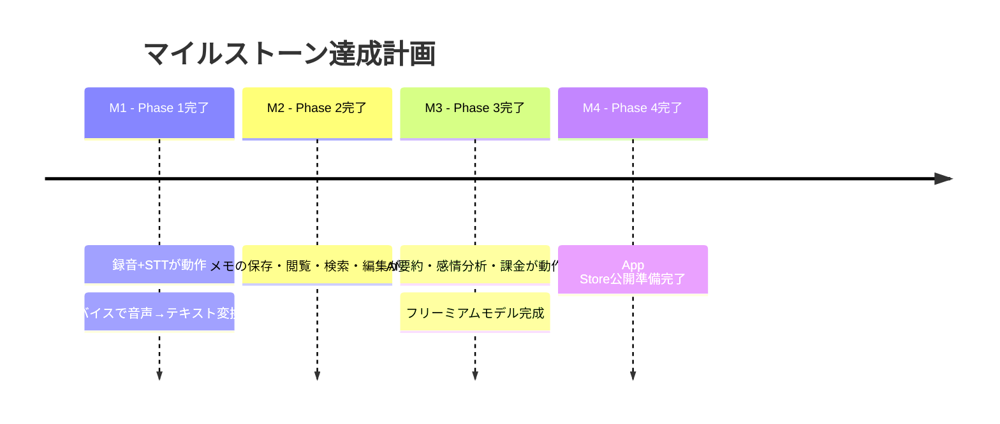
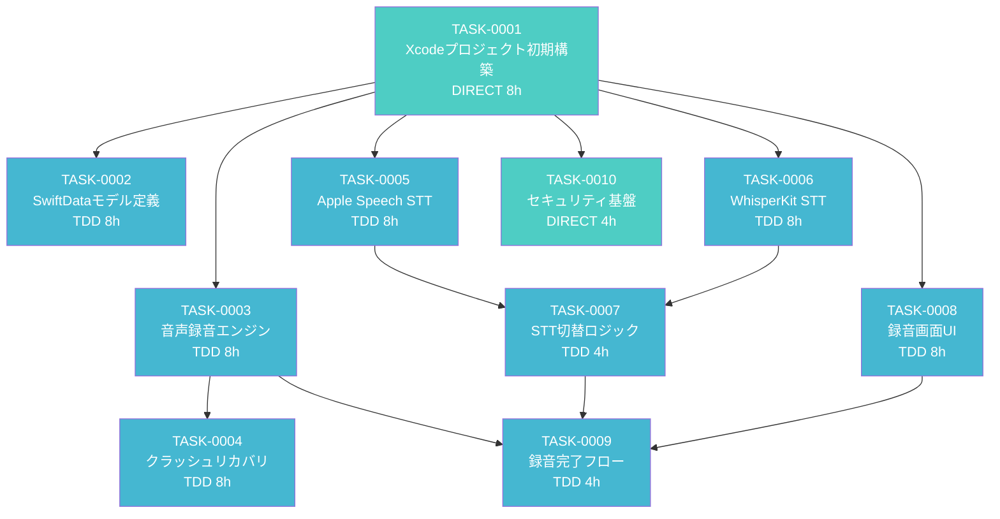
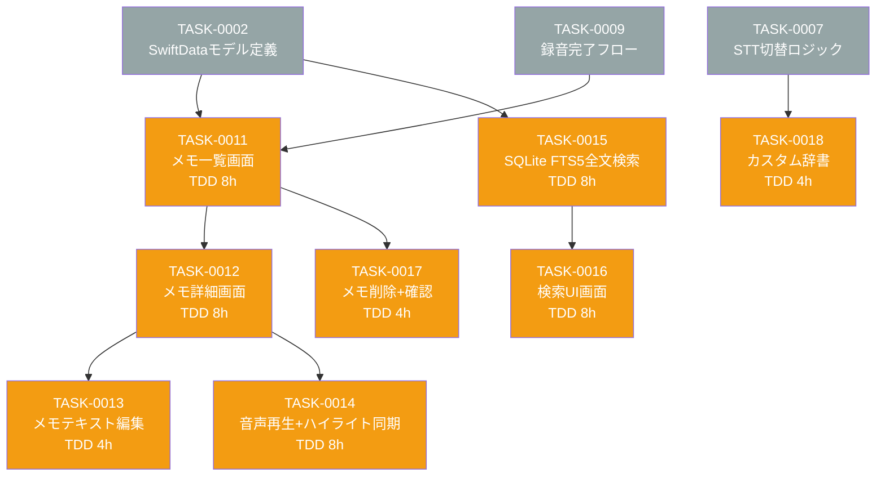
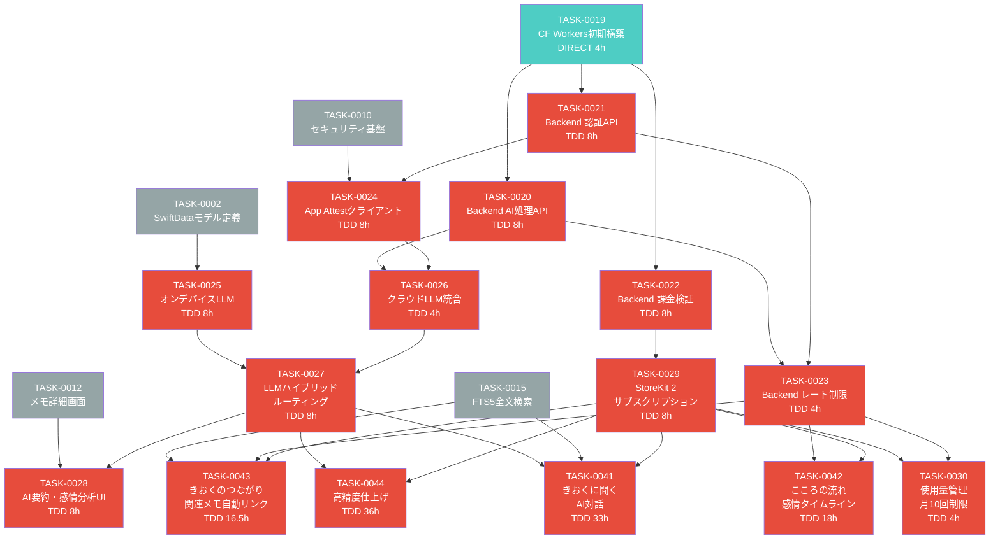
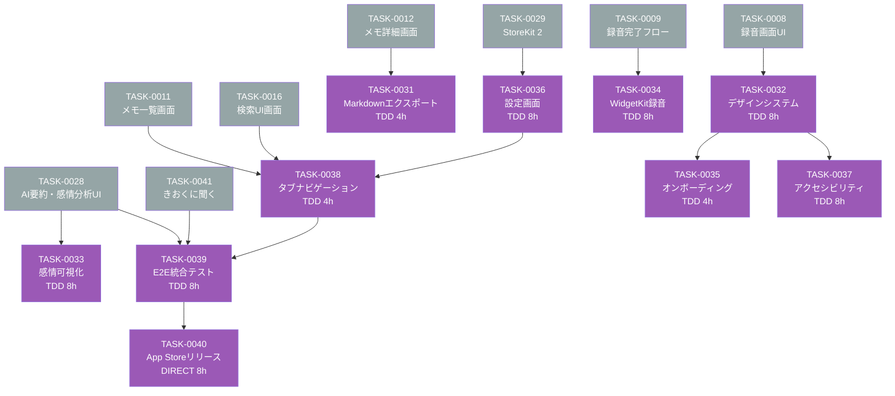
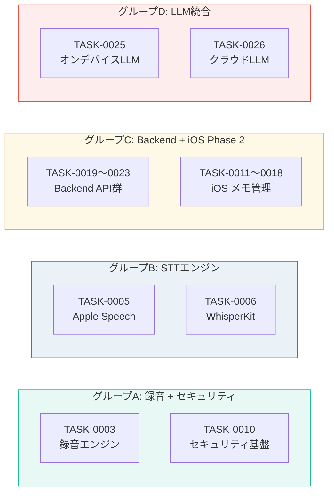

# Soyoka（つぶやき） - AI音声メモ・日記アプリ - タスク概要

**要件名**: Soyoka（つぶやき） - AI音声メモ・日記アプリ (ai-voice-memo)
**作成日**: 2026-03-16
**総タスク数**: 44件
**推定総工数**: 367.5時間（約46営業日）
**ステータス**: 計画完了

---

## 目次

- [技術スタック](#技術スタック)
- [フェーズ構成](#フェーズ構成)
- [タスク一覧](#タスク一覧)
- [マイルストーン](#マイルストーン)
- [クリティカルパス](#クリティカルパス)
- [依存関係図](#依存関係図)
- [並行可能なタスク](#並行可能なタスク)
- [関連文書](#関連文書)

---

## 技術スタック

| レイヤー | 技術 |
|---------|------|
| iOS フレームワーク | SwiftUI, TCA (The Composable Architecture) |
| データ永続化 | SwiftData |
| 音声 | AVFoundation (AVAudioEngine) |
| 音声認識 (STT) | Apple Speech Framework, WhisperKit |
| オンデバイス LLM | llama.cpp |
| 課金 | StoreKit 2 |
| ウィジェット | WidgetKit |
| セキュリティ | App Attest, Data Protection, Keychain |
| Backend | Cloudflare Workers, Hono, D1, KV |
| クラウド AI | OpenAI GPT-4o mini |
| テスト | XCTest, TCA TestStore, カバレッジ80%目標 |

---

## フェーズ構成

```mermaid
gantt
    title Soyoka - フェーズ別工数
    dateFormat X
    axisFormat %s h

    section Phase 1
    基盤構築 + 録音 + STT (10タスク, 76h) : 0, 76

    section Phase 2
    メモ管理 + 検索 (8タスク, 52h) : 0, 52

    section Phase 3
    AI要約 + 感情分析 + 課金 (16タスク, 183.5h) : 0, 183

    section Phase 4
    エクスポート + UI磨き込み + リリース (10タスク, 68h) : 0, 68
```

| フェーズ | 内容 | タスク数 | 推定工数 |
|---------|------|---------|---------|
| Phase 1 | 基盤構築 + 録音 + STT | 10 | 76h |
| Phase 2 | メモ管理 + 検索 | 8 | 52h |
| Phase 3 | AI要約 + 感情分析 + 課金 | 16 | 183.5h |
| Phase 4 | エクスポート + UI磨き込み + リリース準備 | 10 | 68h |
| **合計** | | **44** | **367.5h** |

---

## タスク一覧

### Phase 1: 基盤構築 + 録音 + STT（10タスク、76h）

| タスクID | タスク名 | タイプ | 工数 | 依存元 |
|---------|---------|-------|------|--------|
| [TASK-0001](TASK-0001.md) | Xcodeプロジェクト初期構築 | DIRECT | 8h | なし |
| [TASK-0002](TASK-0002.md) | SwiftDataモデル定義 + ローカルストレージ | TDD | 8h | TASK-0001 |
| [TASK-0003](TASK-0003.md) | 音声録音エンジン（AVAudioEngine） | TDD | 8h | TASK-0001 |
| [TASK-0004](TASK-0004.md) | クラッシュリカバリ（録音自動保存） | TDD | 8h | TASK-0003 |
| [TASK-0005](TASK-0005.md) | Apple Speech Framework STT統合 | TDD | 8h | TASK-0001 |
| [TASK-0006](TASK-0006.md) | WhisperKit STT統合 | TDD | 8h | TASK-0001 |
| [TASK-0007](TASK-0007.md) | STTエンジン切替ロジック | TDD | 4h | TASK-0005, TASK-0006 |
| [TASK-0008](TASK-0008.md) | 録音画面UI（ホーム画面） | TDD | 8h | TASK-0001 |
| [TASK-0009](TASK-0009.md) | 録音完了フロー + メモ保存 | TDD | 4h | TASK-0003, TASK-0007, TASK-0008 |
| [TASK-0010](TASK-0010.md) | セキュリティ基盤（Data Protection + Keychain） | DIRECT | 4h | TASK-0001 |

### Phase 2: メモ管理 + 検索（8タスク、52h）

| タスクID | タスク名 | タイプ | 工数 | 依存元 |
|---------|---------|-------|------|--------|
| [TASK-0011](TASK-0011.md) | メモ一覧画面 | TDD | 8h | TASK-0002, TASK-0009 |
| [TASK-0012](TASK-0012.md) | メモ詳細画面 | TDD | 8h | TASK-0011 |
| [TASK-0013](TASK-0013.md) | メモテキスト編集 | TDD | 4h | TASK-0012 |
| [TASK-0014](TASK-0014.md) | 音声再生 + ハイライト同期 | TDD | 8h | TASK-0012 |
| [TASK-0015](TASK-0015.md) | SQLite FTS5全文検索エンジン | TDD | 8h | TASK-0002 |
| [TASK-0016](TASK-0016.md) | 検索UI画面 | TDD | 8h | TASK-0015 |
| [TASK-0017](TASK-0017.md) | メモ削除 + 確認ダイアログ | TDD | 4h | TASK-0011 |
| [TASK-0018](TASK-0018.md) | カスタム辞書（STT精度向上） | TDD | 4h | TASK-0007 |

### Phase 3: AI要約 + 感情分析 + 課金（16タスク、183.5h）

| タスクID | タスク名 | タイプ | 工数 | 依存元 |
|---------|---------|-------|------|--------|
| [TASK-0019](TASK-0019.md) | Cloudflare Workers プロジェクト初期構築 | DIRECT | 4h | なし |
| [TASK-0020](TASK-0020.md) | Backend API - AI処理エンドポイント | TDD | 8h | TASK-0019 |
| [TASK-0021](TASK-0021.md) | Backend API - 認証（デバイストークン + App Attest） | TDD | 8h | TASK-0019 |
| [TASK-0022](TASK-0022.md) | Backend API - 課金検証 + Webhook | TDD | 8h | TASK-0019 |
| [TASK-0023](TASK-0023.md) | Backend API - レート制限 + 使用量カウント | TDD | 4h | TASK-0020, TASK-0021 |
| [TASK-0024](TASK-0024.md) | iOSアプリ - App Attestクライアント実装 | TDD | 8h | TASK-0010, TASK-0021 |
| [TASK-0025](TASK-0025.md) | iOSアプリ - オンデバイスLLM統合（llama.cpp） | TDD | 8h | TASK-0002 |
| [TASK-0026](TASK-0026.md) | iOSアプリ - クラウドLLM統合（Backend Proxy経由） | TDD | 4h | TASK-0020, TASK-0024 |
| [TASK-0027](TASK-0027.md) | LLMハイブリッドルーティングロジック | TDD | 8h | TASK-0025, TASK-0026 |
| [TASK-0028](TASK-0028.md) | AI要約・タグ・感情分析結果のUI表示 | TDD | 8h | TASK-0012, TASK-0027 |
| [TASK-0029](TASK-0029.md) | StoreKit 2 サブスクリプション実装 | TDD | 8h | TASK-0022 |
| [TASK-0030](TASK-0030.md) | 使用量管理（月10回制限）iOS側 | TDD | 4h | TASK-0029, TASK-0023 |
| [TASK-0041](TASK-0041.md) | きおくに聞く（AI対話） | TDD | 33h | TASK-0027, TASK-0015, TASK-0029 |
| [TASK-0042](TASK-0042.md) | こころの流れ（感情タイムライン + AIインサイト） | TDD | 18h | TASK-0023, TASK-0029 |
| [TASK-0043](TASK-0043.md) | きおくのつながり（関連メモ自動リンク） | TDD | 16.5h | TASK-0015, TASK-0023, TASK-0029 |
| [TASK-0044](TASK-0044.md) | 高精度仕上げ | TDD | 36h | TASK-0027, TASK-0029 |

### Phase 4: エクスポート + UI磨き込み + リリース準備（10タスク、68h）

| タスクID | タスク名 | タイプ | 工数 | 依存元 |
|---------|---------|-------|------|--------|
| [TASK-0031](TASK-0031.md) | Markdownエクスポート | TDD | 4h | TASK-0012 |
| [TASK-0032](TASK-0032.md) | デザインシステム実装 | TDD | 8h | TASK-0008 |
| [TASK-0033](TASK-0033.md) | 感情可視化（トレンドグラフ + カレンダーヒートマップ） | TDD | 8h | TASK-0028 |
| [TASK-0034](TASK-0034.md) | WidgetKit録音ショートカット | TDD | 8h | TASK-0009 |
| [TASK-0035](TASK-0035.md) | オンボーディングフロー | TDD | 4h | TASK-0032 |
| [TASK-0036](TASK-0036.md) | 設定画面 | TDD | 8h | TASK-0029 |
| [TASK-0037](TASK-0037.md) | アクセシビリティ対応 | TDD | 8h | TASK-0032 |
| [TASK-0038](TASK-0038.md) | タブナビゲーション + 画面遷移 | TDD | 4h | TASK-0011, TASK-0016, TASK-0036 |
| [TASK-0039](TASK-0039.md) | E2E統合テスト + パフォーマンス最適化 | TDD | 8h | TASK-0038, TASK-0028 |
| [TASK-0040](TASK-0040.md) | App Storeリリース準備 | DIRECT | 8h | TASK-0039 |

---

## マイルストーン

| マイルストーン | フェーズ | 達成条件 |
|-------------|---------|---------|
| **M1** | Phase 1完了 | 録音+STTが動作、オンデバイスで音声→テキスト変換が可能 |
| **M2** | Phase 2完了 | メモの保存・閲覧・検索・編集が可能 |
| **M3** | Phase 3完了 | AI要約・感情分析・課金が動作、フリーミアムモデル完成 |
| **M4** | Phase 4完了 | App Store公開準備完了 |

---

## クリティカルパス

プロジェクト全体のクリティカルパス（最長依存チェーン）:

**TASK-0001 → 0002 → 0003 → 0005 → 0007 → 0008 → 0009 → 0011 → 0012 → 0028 → 0039 → 0040**

```mermaid
flowchart LR
    T0001["TASK-0001\nXcodeプロジェクト\n初期構築\n8h"]
    T0002["TASK-0002\nSwiftData\nモデル定義\n8h"]
    T0003["TASK-0003\n音声録音\nエンジン\n8h"]
    T0005["TASK-0005\nApple Speech\nSTT統合\n8h"]
    T0007["TASK-0007\nSTTエンジン\n切替ロジック\n4h"]
    T0008["TASK-0008\n録音画面UI\n8h"]
    T0009["TASK-0009\n録音完了フロー\n+ メモ保存\n4h"]
    T0011["TASK-0011\nメモ一覧画面\n8h"]
    T0012["TASK-0012\nメモ詳細画面\n8h"]
    T0028["TASK-0028\nAI要約・タグ\n感情分析UI\n8h"]
    T0039["TASK-0039\nE2E統合テスト\nパフォーマンス\n8h"]
    T0040["TASK-0040\nApp Store\nリリース準備\n8h"]

    T0001 --> T0002 --> T0003 --> T0005 --> T0007 --> T0008 --> T0009 --> T0011 --> T0012 --> T0028 --> T0039 --> T0040

    style T0001 fill:#ff6b6b,color:#fff
    style T0002 fill:#ff6b6b,color:#fff
    style T0003 fill:#ff6b6b,color:#fff
    style T0005 fill:#ff6b6b,color:#fff
    style T0007 fill:#ff6b6b,color:#fff
    style T0008 fill:#ff6b6b,color:#fff
    style T0009 fill:#ff6b6b,color:#fff
    style T0011 fill:#ff6b6b,color:#fff
    style T0012 fill:#ff6b6b,color:#fff
    style T0028 fill:#ff6b6b,color:#fff
    style T0039 fill:#ff6b6b,color:#fff
    style T0040 fill:#ff6b6b,color:#fff
```

**クリティカルパス合計工数**: 88h

---

## 依存関係図

### Phase 1: 基盤構築 + 録音 + STT

### Phase 2: メモ管理 + 検索

### Phase 3: AI要約 + 感情分析 + 課金

### Phase 4: エクスポート + UI磨き込み + リリース準備

### 全体依存関係（俯瞰図）

```mermaid
flowchart TB
    subgraph Phase1["Phase 1: 基盤構築 + 録音 + STT (76h)"]
        T01["0001 Xcode初期構築"]
        T02["0002 SwiftData"]
        T03["0003 録音エンジン"]
        T04["0004 クラッシュリカバリ"]
        T05["0005 Apple Speech"]
        T06["0006 WhisperKit"]
        T07["0007 STT切替"]
        T08["0008 録音画面UI"]
        T09["0009 録音完了フロー"]
        T10["0010 セキュリティ基盤"]
    end

    subgraph Phase2["Phase 2: メモ管理 + 検索 (52h)"]
        T11["0011 メモ一覧"]
        T12["0012 メモ詳細"]
        T13["0013 テキスト編集"]
        T14["0014 音声再生"]
        T15["0015 FTS5検索"]
        T16["0016 検索UI"]
        T17["0017 メモ削除"]
        T18["0018 カスタム辞書"]
    end

    subgraph Phase3["Phase 3: AI要約 + 感情分析 + 課金 (183.5h)"]
        T19["0019 CF Workers"]
        T20["0020 AI処理API"]
        T21["0021 認証API"]
        T22["0022 課金検証"]
        T23["0023 レート制限"]
        T24["0024 App Attest"]
        T25["0025 オンデバイスLLM"]
        T26["0026 クラウドLLM"]
        T27["0027 LLMルーティング"]
        T28["0028 AI結果UI"]
        T29["0029 StoreKit 2"]
        T30["0030 使用量管理"]
        T41["0041 きおくに聞く"]
        T42["0042 こころの流れ"]
        T43["0043 きおくのつながり"]
        T44["0044 高精度仕上げ"]
    end

    subgraph Phase4["Phase 4: エクスポート + UI + リリース (68h)"]
        T31["0031 Markdownエクスポート"]
        T32["0032 デザインシステム"]
        T33["0033 感情可視化"]
        T34["0034 WidgetKit"]
        T35["0035 オンボーディング"]
        T36["0036 設定画面"]
        T37["0037 アクセシビリティ"]
        T38["0038 タブナビゲーション"]
        T39["0039 E2Eテスト"]
        T40["0040 リリース準備"]
    end

    %% Phase 1 内部依存
    T01 --> T02
    T01 --> T03
    T01 --> T05
    T01 --> T06
    T01 --> T08
    T01 --> T10
    T03 --> T04
    T05 --> T07
    T06 --> T07
    T03 --> T09
    T07 --> T09
    T08 --> T09

    %% Phase 1 → Phase 2
    T02 --> T11
    T09 --> T11
    T02 --> T15
    T07 --> T18
    T11 --> T12
    T12 --> T13
    T12 --> T14
    T15 --> T16
    T11 --> T17

    %% Phase 1 → Phase 3
    T10 --> T24
    T02 --> T25

    %% Phase 3 内部依存
    T19 --> T20
    T19 --> T21
    T19 --> T22
    T20 --> T23
    T21 --> T23
    T21 --> T24
    T20 --> T26
    T24 --> T26
    T25 --> T27
    T26 --> T27
    T22 --> T29
    T29 --> T30
    T23 --> T30

    %% Phase 2 → Phase 3
    T12 --> T28
    T27 --> T28
    T27 --> T41
    T15 --> T41
    T29 --> T41

    T23 --> T42
    T29 --> T42

    T15 --> T43
    T23 --> T43
    T29 --> T43

    T27 --> T44
    T29 --> T44

    %% Phase 2/3 → Phase 4
    T12 --> T31
    T08 --> T32
    T28 --> T33
    T09 --> T34
    T32 --> T35
    T29 --> T36
    T32 --> T37
    T11 --> T38
    T16 --> T38
    T36 --> T38
    T38 --> T39
    T28 --> T39
    T41 --> T39
    T39 --> T40

    style Phase1 fill:#e8f4f8,stroke:#45b7d1
    style Phase2 fill:#fef9e7,stroke:#f39c12
    style Phase3 fill:#fdedec,stroke:#e74c3c
    style Phase4 fill:#f4ecf7,stroke:#9b59b6
```

---

## 並行可能なタスク

以下のタスクグループは互いに依存関係がないため、並行して実行可能:

| 並行グループ | タスク | 理由 |
|-------------|--------|------|
| **グループA** | TASK-0003 (録音エンジン) と TASK-0010 (セキュリティ基盤) | 共通依存は TASK-0001 のみ、互いに独立 |
| **グループB** | TASK-0005 (Apple Speech) と TASK-0006 (WhisperKit) | 2つのSTTエンジンは独立して開発可能 |
| **グループC** | TASK-0019〜0023 (Backend) と TASK-0011〜0018 (iOS Phase 2) | Backend とiOSアプリは別レイヤーで並行開発可能 |
| **グループD** | TASK-0025 (オンデバイスLLM) と TASK-0026 (クラウドLLM) | 2つのLLM統合は独立して開発可能 |

---

## 関連文書

### 仕様書

| 文書 | パス | バージョン |
|------|------|-----------|
| 要件定義 | [requirements.md](../../spec/ai-voice-memo/requirements.md) | v1.2 |
| ユーザーストーリー | [user-stories.md](../../spec/ai-voice-memo/user-stories.md) | v1.2 |
| 受け入れ基準 | [acceptance-criteria.md](../../spec/ai-voice-memo/acceptance-criteria.md) | v1.2 |

### 設計書

| 文書 | パス | バージョン |
|------|------|-----------|
| 統合仕様書 | [00-integration-spec.md](../../spec/ai-voice-memo/design/00-integration-spec.md) | - |
| システムアーキテクチャ | [01-system-architecture.md](../../spec/ai-voice-memo/design/01-system-architecture.md) | v1.1 |
| AIパイプライン | [02-ai-pipeline.md](../../spec/ai-voice-memo/design/02-ai-pipeline.md) | v1.1 |
| Backend Proxy | [03-backend-proxy.md](../../spec/ai-voice-memo/design/03-backend-proxy.md) | v1.1 |
| UIデザインシステム | [04-ui-design-system.md](../../spec/ai-voice-memo/design/04-ui-design-system.md) | v1.1 |
| セキュリティ | [05-security.md](../../spec/ai-voice-memo/design/05-security.md) | v1.1 |

---

## 凡例

### タスクタイプ

| タイプ | 説明 |
|--------|------|
| **TDD** | テスト駆動開発で実装。Red → Green → Refactor サイクルに従う |
| **DIRECT** | 環境構築・設定系タスク。TDDサイクルは適用せず手動検証 |

### 依存関係図の色分け

| 色 | 意味 |
|----|------|
| 赤系 (`#ff6b6b`, `#e74c3c`) | クリティカルパス上のタスク / Phase 3 タスク |
| 青系 (`#45b7d1`) | Phase 1 TDD タスク |
| 緑系 (`#4ecdc4`) | DIRECT タスク |
| 黄系 (`#f39c12`) | Phase 2 タスク |
| 紫系 (`#9b59b6`) | Phase 4 タスク |
| 灰色 (`#95a5a6`) | 前フェーズの依存元（参照のみ） |
