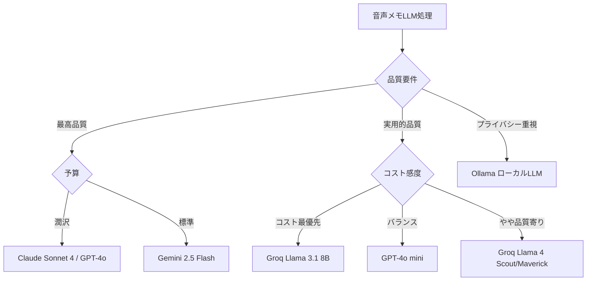

# 音声メモアプリ LLM APIコスト調査レポート

**調査日**: 2026-03-15
**調査目的**: 文字起こし後テキストに対する「要約」「タグ付け」「感情分析」処理のAPIコスト比較

---

## 1. 調査対象モデルと料金一覧

### 1.1 トークン単価比較（per 1M tokens）

| プロバイダ | モデル | 入力単価 | 出力単価 | 備考 |
|:----------|:-------|--------:|--------:|:-----|
| OpenAI | **GPT-4o** | $2.50 | $10.00 | 高性能マルチモーダル |
| OpenAI | **GPT-4o mini** | $0.15 | $0.60 | コスト効率重視 |
| Anthropic | **Claude Sonnet 4** | $3.00 | $15.00 | claude-sonnet-4-20250514 |
| Anthropic | **Claude Haiku 4.5** | $1.00 | $5.00 | 最速・近フロンティア性能 |
| Google | **Gemini 2.5 Flash** | $0.30 | $2.50 | テキスト入力価格 |
| Google | **Gemini 2.5 Pro** | $1.25 | $10.00 | ≤200kプロンプト価格 |
| Groq | **Llama 4 Scout** | $0.11 | $0.34 | 17Bx16E MoE |
| Groq | **Llama 4 Maverick** | $0.20 | $0.60 | 17Bx128E MoE |
| Groq | **Llama 3.3 70B** | $0.59 | $0.79 | 高性能Llama |
| Groq | **Llama 3.1 8B** | $0.05 | $0.08 | 最安・最速 |
| ローカル | **Ollama等** | $0.00 | $0.00 | 電気代・ハードウェアコストのみ |

> **情報ソース**: OpenAI公式（DocsBot経由）、Anthropic公式ドキュメント、Google AI for Developers、Groq公式サイト（2026年3月時点）

---

## 2. トークン見積もりの前提

### 2.1 音声メモの特性

| 項目 | 値 | 説明 |
|:----|:---|:-----|
| 1分間の音声メモ | 約300文字 | 日本語の平均的な発話速度 |
| テキストのトークン数 | 約400トークン | 日本語は1文字≒1.3トークン |
| プロンプト（1タスク分） | 約130トークン | 指示文100文字程度 |
| プロンプト（3タスクまとめ） | 約230トークン | 複合指示文 |

### 2.2 各処理の入出力トークン数

| 処理 | 入力トークン | 出力トークン | 説明 |
|:----|:-----------:|:----------:|:-----|
| 要約 | 530 | 70 | テキスト400 + プロンプト130 → 要約文50文字 |
| タグ付け・カテゴリ分類 | 530 | 80 | 同上 → タグ5個（JSON形式） |
| 感情分析 | 530 | 60 | 同上 → 感情スコア+短文 |
| **個別処理 合計（3回）** | **1,590** | **210** | 3回のAPI呼び出し |
| **まとめ処理（1回）** | **630** | **210** | 1回のAPI呼び出しで3タスク実行 |

> **まとめ処理のメリット**: 入力トークンが60%削減（1,590→630）。テキスト本文の重複送信がなくなるため。出力トークンは同量。

---

## 3. 1分間の音声メモあたりのコスト

### 3.1 個別処理（3回のAPI呼び出し）

| モデル | 1分あたりコスト | 備考 |
|:-------|---------------:|:-----|
| GPT-4o | $0.006075 | 約¥0.91 |
| GPT-4o mini | $0.000365 | 約¥0.05 |
| Claude Sonnet 4 | $0.007920 | 約¥1.19 |
| Claude Haiku 4.5 | $0.002640 | 約¥0.40 |
| Gemini 2.5 Flash | $0.001002 | 約¥0.15 |
| Gemini 2.5 Pro | $0.004088 | 約¥0.61 |
| Groq Llama 4 Scout | $0.000246 | 約¥0.04 |
| Groq Llama 4 Maverick | $0.000444 | 約¥0.07 |
| Groq Llama 3.3 70B | $0.001104 | 約¥0.17 |
| Groq Llama 3.1 8B | $0.000096 | 約¥0.01 |
| Ollama (ローカル) | $0.000000 | 電気代のみ |

### 3.2 まとめ処理（1回のAPI呼び出し）

| モデル | 1分あたりコスト | 個別比 削減率 |
|:-------|---------------:|:-------------|
| GPT-4o | $0.003675 | -39.5% |
| GPT-4o mini | $0.000221 | -39.5% |
| Claude Sonnet 4 | $0.005040 | -36.4% |
| Claude Haiku 4.5 | $0.001680 | -36.4% |
| Gemini 2.5 Flash | $0.000714 | -28.7% |
| Gemini 2.5 Pro | $0.002888 | -29.4% |
| Groq Llama 4 Scout | $0.000141 | -42.9% |
| Groq Llama 4 Maverick | $0.000252 | -43.2% |
| Groq Llama 3.3 70B | $0.000538 | -51.3% |
| Groq Llama 3.1 8B | $0.000048 | -49.8% |
| Ollama (ローカル) | $0.000000 | - |

---

## 4. 月間コスト試算（1ユーザーあたり）

**利用シナリオ**: 1日平均3分の音声メモ x 月30日 = **月90分**

### 4.1 まとめ処理（推奨）での月間コスト

| モデル | 月間コスト(USD) | 月間コスト(JPY) | 年間コスト(USD) |
|:-------|---------------:|---------------:|---------------:|
| GPT-4o | $0.3308 | ¥49.6 | $3.97 |
| **GPT-4o mini** | **$0.0198** | **¥3.0** | **$0.24** |
| Claude Sonnet 4 | $0.4536 | ¥68.0 | $5.44 |
| Claude Haiku 4.5 | $0.1512 | ¥22.7 | $1.81 |
| **Gemini 2.5 Flash** | **$0.0643** | **¥9.6** | **$0.77** |
| Gemini 2.5 Pro | $0.2599 | ¥39.0 | $3.12 |
| Groq Llama 4 Scout | $0.0127 | ¥1.9 | $0.15 |
| Groq Llama 4 Maverick | $0.0227 | ¥3.4 | $0.27 |
| Groq Llama 3.3 70B | $0.0484 | ¥7.3 | $0.58 |
| **Groq Llama 3.1 8B** | **$0.0043** | **¥0.7** | **$0.05** |
| **Ollama (ローカル)** | **$0.0000** | **¥0.0** | **$0.00** |

> ※ 為替レート: $1 = ¥150 で計算

### 4.2 個別処理（3回API呼び出し）での月間コスト

| モデル | 月間コスト(USD) | 月間コスト(JPY) | 年間コスト(USD) |
|:-------|---------------:|---------------:|---------------:|
| GPT-4o | $0.5468 | ¥82.0 | $6.56 |
| GPT-4o mini | $0.0328 | ¥4.9 | $0.39 |
| Claude Sonnet 4 | $0.7128 | ¥106.9 | $8.55 |
| Claude Haiku 4.5 | $0.2376 | ¥35.6 | $2.85 |
| Gemini 2.5 Flash | $0.0902 | ¥13.5 | $1.08 |
| Gemini 2.5 Pro | $0.3679 | ¥55.2 | $4.41 |
| Groq Llama 4 Scout | $0.0222 | ¥3.3 | $0.27 |
| Groq Llama 4 Maverick | $0.0400 | ¥6.0 | $0.48 |
| Groq Llama 3.3 70B | $0.0994 | ¥14.9 | $1.19 |
| Groq Llama 3.1 8B | $0.0087 | ¥1.3 | $0.10 |
| Ollama (ローカル) | $0.0000 | ¥0.0 | $0.00 |

---

## 5. スケール別コスト比較（まとめ処理・月間）

**1,000ユーザー / 10,000ユーザー / 100,000ユーザーの場合**

| モデル | 1,000ユーザー | 10,000ユーザー | 100,000ユーザー |
|:-------|-------------:|---------------:|----------------:|
| GPT-4o | $330.75 | $3,307.50 | $33,075.00 |
| GPT-4o mini | $19.85 | $198.45 | $1,984.50 |
| Claude Sonnet 4 | $453.60 | $4,536.00 | $45,360.00 |
| Claude Haiku 4.5 | $151.20 | $1,512.00 | $15,120.00 |
| Gemini 2.5 Flash | $64.26 | $642.60 | $6,426.00 |
| Gemini 2.5 Pro | $259.88 | $2,598.75 | $25,987.50 |
| Groq Llama 4 Scout | $12.66 | $126.63 | $1,266.30 |
| Groq Llama 4 Maverick | $22.68 | $226.80 | $2,268.00 |
| Groq Llama 3.3 70B | $48.38 | $483.84 | $4,838.40 |
| Groq Llama 3.1 8B | $4.35 | $43.47 | $434.70 |

---

## 6. ローカルLLM（Ollama等）の検討

### 6.1 コスト構造の違い

| 項目 | クラウドAPI | ローカルLLM |
|:----|:-----------|:-----------|
| API利用料 | 従量課金 | なし |
| ハードウェア | 不要 | GPU搭載デバイスが必要 |
| 電気代 | 不要 | 推論時の消費電力 |
| メンテナンス | プロバイダ任せ | 自前で管理 |
| レイテンシ | ネットワーク依存 | ローカル処理で高速 |
| プライバシー | データ送信あり | 完全オンデバイス |

### 6.2 ローカルLLMの適用可能シナリオ

| 項目 | 詳細 |
|:----|:-----|
| 推奨モデル | Llama 3.1 8B, Gemma 2 9B, Phi-3 Mini |
| 必要メモリ | 8B モデルで約5-8GB VRAM |
| 処理速度 | Apple M3/M4で約20-40 tokens/sec |
| 品質 | 要約・タグ付けは十分実用的、感情分析はやや精度低下の可能性 |
| 最適ユースケース | プライバシー重視、オフライン対応、B2Bエンタープライズ |

### 6.3 ローカルLLMの実質コスト（参考）

| ハードウェア | 初期投資 | 電気代/月 | 損益分岐点（vs GPT-4o mini） |
|:-----------|--------:|---------:|:---------------------------|
| Mac Mini M4（16GB） | 約¥100,000 | 約¥300 | 約33,000ユーザー月分のAPI代に相当 |
| Mac Mini M4 Pro（48GB） | 約¥250,000 | 約¥500 | 約83,000ユーザー月分 |

> ※ 損益分岐点は GPT-4o mini のまとめ処理コスト（¥3.0/ユーザー月）で計算

---

## 7. 推奨戦略

### 7.1 コストパフォーマンスランキング

| 順位 | モデル | 月間/ユーザー | 品質 | 推奨用途 |
|:---:|:-------|------------:|:----:|:--------|
| 1 | Groq Llama 3.1 8B | $0.004 | B | プロトタイプ・MVP |
| 2 | Groq Llama 4 Scout | $0.013 | B+ | 本番・コスト最優先 |
| 3 | GPT-4o mini | $0.020 | A- | 本番・バランス重視 |
| 4 | Groq Llama 4 Maverick | $0.023 | A- | 本番・コスト重視 |
| 5 | Gemini 2.5 Flash | $0.064 | A | 本番・高品質重視 |
| 6 | Claude Haiku 4.5 | $0.151 | A | 高品質・日本語重視 |
| 7 | Gemini 2.5 Pro | $0.260 | A+ | 最高品質 |
| 8 | GPT-4o | $0.331 | A+ | 最高品質 |
| 9 | Claude Sonnet 4 | $0.454 | A+ | 最高品質・日本語最良 |

### 7.2 ユースケース別推奨

### 7.3 段階的導入の推奨

| フェーズ | ユーザー規模 | 推奨モデル | 想定月間コスト |
|:--------|:-----------|:----------|:-------------|
| MVP/β版 | ~1,000 | GPT-4o mini | ~$20/月 |
| 初期ローンチ | 1,000-10,000 | Gemini 2.5 Flash | $64-$643/月 |
| グロース期 | 10,000-100,000 | Groq Llama 4 Scout + キャッシュ | $127-$1,266/月 |
| 大規模 | 100,000+ | ローカルLLM + API併用 | ハイブリッド構成 |

---

## 8. コスト最適化のヒント

1. **まとめ処理を必ず採用**: 個別に3回呼ぶより30-50%コスト削減
2. **プロンプトキャッシュの活用**: OpenAI/AnthropicはCached Input割引あり（50%オフ）
3. **バッチAPI**: リアルタイム不要ならバッチ処理で50%割引（OpenAI/Anthropic）
4. **結果キャッシュ**: 同一テキストの再処理を防ぐアプリ側キャッシュ
5. **段階処理**: 全メモにフル処理せず、ユーザーが開いたメモのみ詳細処理
6. **モデルの使い分け**: タグ付けは軽量モデル、要約は高品質モデル、といった使い分け

---

## 9. 結論

音声メモアプリの「要約・タグ付け・感情分析」処理において、**1ユーザーあたりの月間LLMコストは$0.004〜$0.454（約¥0.7〜¥68）** と非常に低廉である。

**最もコストパフォーマンスが高い選択肢**:
- **GPT-4o mini**（$0.020/月/ユーザー）: 品質・コスト・安定性のバランスが最良
- **Gemini 2.5 Flash**（$0.064/月/ユーザー）: 品質重視で次善のコスパ
- **Groq Llama 4 Scout**（$0.013/月/ユーザー）: コスト最優先で十分な品質

100,000ユーザー規模でも月間$1,266〜$1,985程度であり、LLM処理コストはアプリの収益モデル（広告/サブスクリプション）で十分に賄える水準である。
