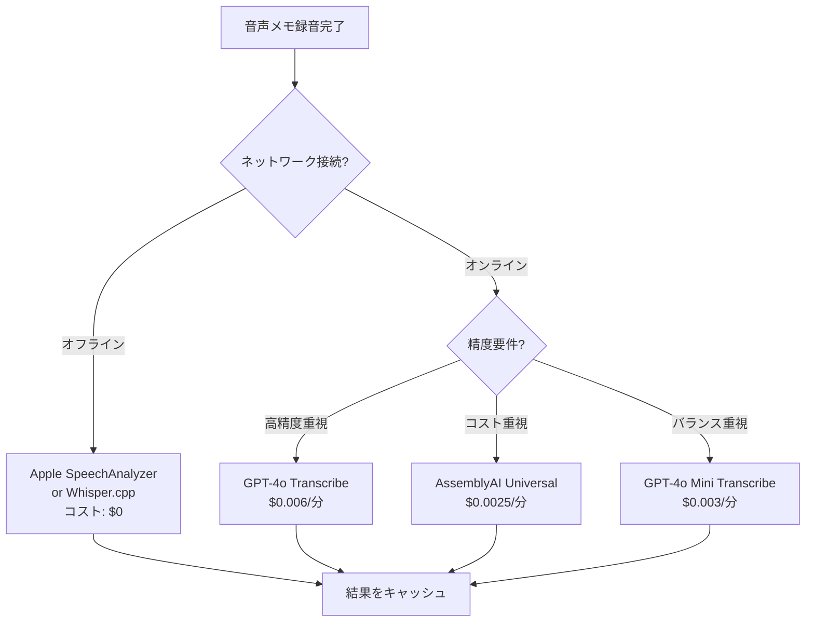

# 音声メモアプリ向け Speech-to-Text APIコスト調査

> 調査日: 2026-03-15
> 調査目的: 音声メモアプリにおける音声文字起こしAPIの料金比較

---

## 1. 料金比較一覧

### 1.1 基本料金表

| サービス | 1分あたり料金 | 1時間あたり料金 | 無料枠 | 課金単位 |
|---|---|---|---|---|
| **OpenAI Whisper API (whisper-1)** | $0.006 | $0.36 | なし | 秒単位 |
| **OpenAI GPT-4o Transcribe** | $0.006 | $0.36 | なし | 秒単位 |
| **OpenAI GPT-4o Mini Transcribe** | $0.003 | $0.18 | なし | 秒単位 |
| **Google Cloud STT (標準)** | $0.024 | $1.44 | 月60分無料 | 秒単位 |
| **Google Cloud STT (拡張)** | $0.036 | $2.16 | 月60分無料 | 秒単位 |
| **Deepgram Nova-3 (バッチ/英語)** | $0.0043 | $0.258 | $200クレジット | 秒単位 |
| **Deepgram Nova-3 (バッチ/多言語)** | $0.0052 | $0.312 | $200クレジット | 秒単位 |
| **Deepgram Nova-3 (ストリーミング)** | $0.0077 | $0.462 | $200クレジット | 秒単位 |
| **AssemblyAI Universal** | $0.0025 | $0.15 | $50クレジット | 秒単位 |
| **AssemblyAI Slam-1 (高精度)** | $0.0045 | $0.27 | $50クレジット | 秒単位 |
| **Apple SpeechAnalyzer (オンデバイス)** | $0.00 | $0.00 | 完全無料 | - |
| **Whisper.cpp (オンデバイス)** | $0.00 | $0.00 | 完全無料 | - |

### 1.2 日本語対応・精度評価

| サービス | 日本語対応 | 精度評価 | 備考 |
|---|---|---|---|
| **OpenAI Whisper API** | 対応 | 高 (WER 5-8%) | 99+言語対応、日本語は安定した精度 |
| **OpenAI GPT-4o Transcribe** | 対応 | 非常に高 | Whisperベースに精度向上、話者分離対応 |
| **OpenAI GPT-4o Mini Transcribe** | 対応 | 高 | コスト重視時の選択肢 |
| **Google Cloud STT (Chirp 3)** | 対応 | 高 | 125+言語対応、話者分離・自動言語検出 |
| **Deepgram Nova-3** | 対応 | 中〜高 (WER 7-16%) | Tier 2言語、コードスイッチング対応 |
| **AssemblyAI Universal** | 対応 | 高 | 99言語対応、話者分離も日本語対応 |
| **Apple SpeechAnalyzer** | 対応 | 中〜高 | iOS 26+、言語パック事前DL可能 |
| **Whisper.cpp** | 対応 | 高 | モデルサイズに依存（Medium以上推奨） |

---

## 2. 月間コストシミュレーション

### 前提条件

- 1ユーザー / 1日平均3分の音声メモ / 月30日利用
- **月間合計: 90分（1.5時間）**

### 2.1 月間コスト比較表

| サービス | 1分あたり | 月間90分のコスト | 年間コスト（概算） | 備考 |
|---|---|---|---|---|
| **OpenAI Whisper API** | $0.006 | **$0.54** | $6.48 | - |
| **OpenAI GPT-4o Transcribe** | $0.006 | **$0.54** | $6.48 | 最高精度 |
| **OpenAI GPT-4o Mini Transcribe** | $0.003 | **$0.27** | $3.24 | 最もコスパが良いクラウドAPI |
| **Google Cloud STT (標準)** | $0.024 | **$0.72** | $8.64 | 無料枠60分で実質30分課金 |
| **Google Cloud STT (拡張)** | $0.036 | **$1.08** | $12.96 | 無料枠活用で実質30分課金 |
| **Deepgram Nova-3 (バッチ/多言語)** | $0.0052 | **$0.468** | $5.62 | 日本語はバッチ多言語料金 |
| **Deepgram Nova-3 (ストリーミング)** | $0.0077 | **$0.693** | $8.32 | リアルタイム処理時 |
| **AssemblyAI Universal** | $0.0025 | **$0.225** | $2.70 | 最安のクラウドAPI |
| **AssemblyAI Slam-1** | $0.0045 | **$0.405** | $4.86 | 高精度版 |
| **Apple SpeechAnalyzer** | $0.00 | **$0.00** | $0.00 | デバイス負荷のみ |
| **Whisper.cpp** | $0.00 | **$0.00** | $0.00 | デバイス負荷のみ |

### 2.2 無料枠を考慮した実質コスト

| サービス | 無料枠 | 月90分中の課金対象 | 実質月間コスト |
|---|---|---|---|
| **Google Cloud STT (標準)** | 月60分無料 | 30分 | **$0.72** |
| **Google Cloud STT (拡張)** | 月60分無料 | 30分 | **$1.08** |
| **Deepgram** | $200初回クレジット | 0分（クレジット消化中） | **$0.00** (約427時間分) |
| **AssemblyAI** | $50初回クレジット | 0分（クレジット消化中） | **$0.00** (約333時間分) |

> **注**: Deepgramの$200クレジットは月90分利用で約427ヶ月分、AssemblyAIの$50クレジットは約222ヶ月分に相当。個人利用なら長期間無料で運用可能。

---

## 3. オンデバイス処理の詳細

### 3.1 Apple SpeechAnalyzer（iOS 26+）

| 項目 | 詳細 |
|---|---|
| **APIコスト** | $0（完全無料） |
| **処理場所** | 完全オンデバイス |
| **プライバシー** | データは端末外に送信されない |
| **日本語対応** | 対応（言語パックのプリロード可能） |
| **精度** | 中〜高（中規模Whisperモデルと同等レベル） |
| **デバイス負荷** | 中程度（Apple Neural Engine活用） |
| **制約** | iOS 26以上必須 |

### 3.2 Whisper.cpp（オンデバイス）

| 項目 | 詳細 |
|---|---|
| **APIコスト** | $0（完全無料） |
| **処理場所** | 完全オンデバイス |
| **処理速度** | M1 MacBook Proで5分音声を38秒で処理（RTF 15.8x） |
| **メモリ使用量** | 2GB以下（競合ソリューションは3-4GB） |
| **日本語対応** | 対応（Medium以上のモデル推奨） |
| **精度** | モデルサイズ依存（Large > Medium > Small > Base） |
| **デバイス負荷** | 高（特にLargeモデル使用時） |
| **推奨モデル** | Small〜Medium（モバイル端末）、Large（Apple Silicon Mac） |

### 3.3 Apple Speech Framework（SFSpeechRecognizer）

| 項目 | 詳細 |
|---|---|
| **APIコスト** | $0（オンデバイスモード時） |
| **処理場所** | オンデバイス or サーバー |
| **日本語対応** | 対応 |
| **精度** | SpeechAnalyzerよりカスタム語彙で優位 |
| **制約** | 1分あたりの認識回数制限あり |

---

## 4. スケール時のコスト予測（参考）

### 1,000ユーザー / 月90分ずつの場合（月間90,000分 = 1,500時間）

| サービス | 月間コスト | 年間コスト |
|---|---|---|
| **AssemblyAI Universal** | $225 | $2,700 |
| **OpenAI GPT-4o Mini Transcribe** | $270 | $3,240 |
| **Deepgram Nova-3 (バッチ/多言語)** | $468 | $5,616 |
| **OpenAI Whisper / GPT-4o Transcribe** | $540 | $6,480 |
| **Google Cloud STT (標準)** | $2,160 | $25,920 |
| **Apple SpeechAnalyzer** | $0 | $0 |

---

## 5. 推奨戦略

### 音声メモアプリにおける最適なアプローチ

### ハイブリッド戦略（推奨）

1. **第1段階: オンデバイス処理**（Apple SpeechAnalyzer / Whisper.cpp）
   - コスト: $0
   - 即座にプレビューを表示
   - プライバシー保護

2. **第2段階: クラウドAPI補正**（必要に応じて）
   - GPT-4o Mini Transcribe ($0.003/分) で高精度の最終テキストを生成
   - ユーザー設定で切替可能にする

3. **月間コスト試算**（ハイブリッド、クラウド補正50%利用時）
   - 月90分中、45分をクラウド処理: **月額$0.135**（GPT-4o Mini）
   - 年間: **$1.62**

---

## 6. 結論

| 用途 | 推奨サービス | 理由 |
|---|---|---|
| **個人利用・MVP** | Apple SpeechAnalyzer + Whisper.cpp | コスト$0、プライバシー保護 |
| **精度重視の個人利用** | GPT-4o Mini Transcribe | $0.27/月で高精度 |
| **スタートアップ（〜1,000ユーザー）** | AssemblyAI Universal | 最安クラウドAPI、$50無料枠 |
| **エンタープライズ** | Deepgram Nova-3 + ボリュームディスカウント | スケール時の価格交渉可能 |

---

## 7. 調査ソース

- [OpenAI API Pricing](https://openai.com/api/pricing/)
- [OpenAI Transcribe & Whisper API Pricing](https://costgoat.com/pricing/openai-transcription)
- [Whisper API Pricing 2026 - BrassTranscripts](https://brasstranscripts.com/blog/openai-whisper-api-pricing-2025-self-hosted-vs-managed)
- [Google Cloud Speech-to-Text Pricing](https://cloud.google.com/speech-to-text/pricing)
- [Google Cloud STT Pricing Analysis](https://brasstranscripts.com/blog/google-cloud-speech-to-text-pricing-2025-gcp-integration-costs)
- [Deepgram Pricing](https://deepgram.com/pricing)
- [Deepgram Pricing 2026 Breakdown](https://brasstranscripts.com/blog/deepgram-pricing-per-minute-2025-real-time-vs-batch)
- [Deepgram Nova-3 Language Expansion](https://deepgram.com/learn/deepgram-expands-nova-3-with-11-new-languages-across-europe-and-asia)
- [AssemblyAI Pricing](https://www.assemblyai.com/pricing)
- [AssemblyAI Pricing Analysis](https://brasstranscripts.com/blog/assemblyai-pricing-per-minute-2025-real-costs)
- [Apple SpeechAnalyzer Documentation](https://developer.apple.com/documentation/speech/speechanalyzer)
- [Apple SpeechAnalyzer Guide](https://antongubarenko.substack.com/p/ios-26-speechanalyzer-guide)
- [Whisper.cpp GitHub](https://github.com/ggml-org/whisper.cpp)
- [WhisperKit by Argmax](https://github.com/argmaxinc/WhisperKit)
- [Speech-to-Text API Pricing Breakdown 2025 (Deepgram)](https://deepgram.com/learn/speech-to-text-api-pricing-breakdown-2025)
