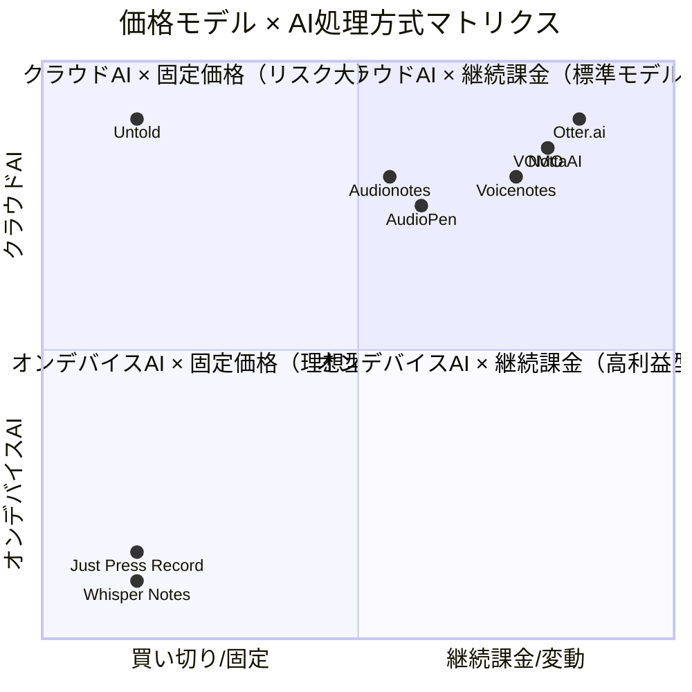
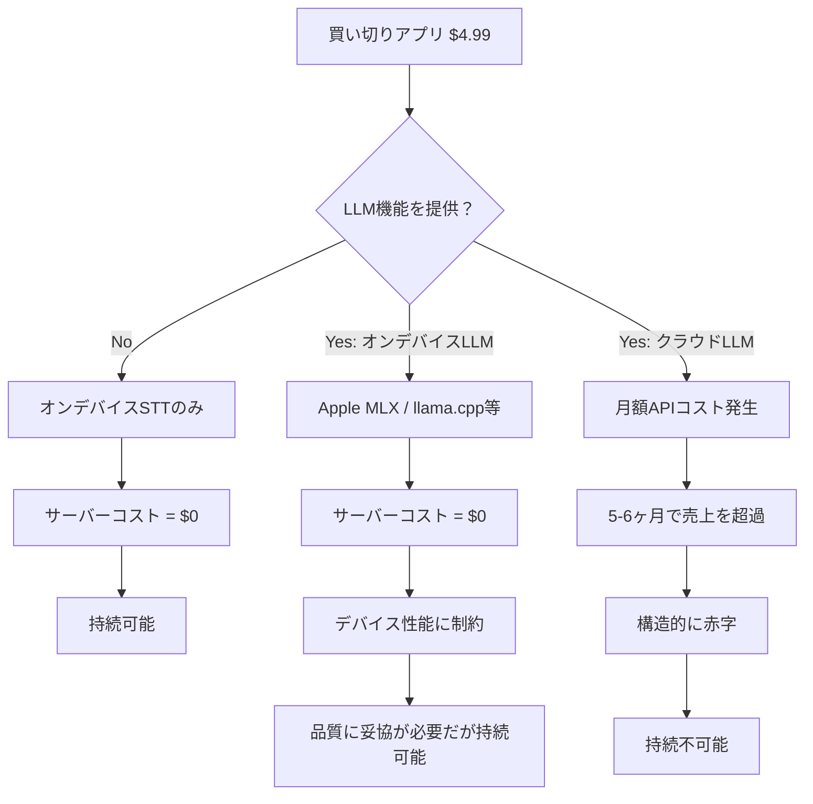
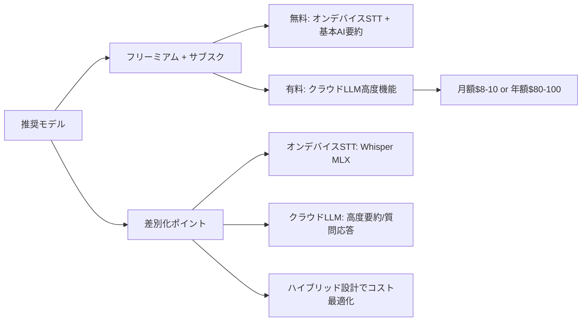

# 音声メモアプリ 競合ビジネスモデル・価格設定調査

**調査日**: 2026-03-15
**目的**: 競合9アプリのビジネスモデル（価格設定・無料/有料機能の境界・AI機能のコスト構造）を調査し、持続可能な収益モデルの知見を得る

---

## 1. 競合アプリ 価格・機能比較一覧

| アプリ名 | ビジネスモデル | 価格 | 無料プランの制限 | AI機能の提供形態 |
|---|---|---|---|---|
| **Voicenotes** | サブスク / Lifetime | $10/月, $99.99/年, Lifetime $50 | 録音時間が短い（1分程度）、AI利用回数制限 | 無料で基本AI利用可、有料で無制限 |
| **AudioPen** | 年額パス（非自動更新） | $99/年, $159/2年 | 10ノート・各3分まで | 無料でも基本的な音声→テキスト変換AI可、有料で高度な整形・カスタマイズ |
| **Just Press Record** | 買い切り | $4.99（一回） | なし（全機能利用可） | オンデバイス（Apple Siri）、クラウドAPI不使用 |
| **Whisper Notes** | 買い切り | $4.99（一回） | なし（全機能利用可） | オンデバイス（Whisper Large-v3 Turbo）、クラウドAPI不使用 |
| **Untold** | 完全無料（VC資金） | $0 | なし（全機能利用可） | クラウドAPI（Hume AI + OpenAI）、VCが資金負担 |
| **Otter.ai** | フリーミアム | Free / Pro $16.99/月（年払$8.33/月）/ Business $20/月 | 月300分、1会話30分上限、エクスポート不可 | 無料でもAI要約あり、有料で高度検索・語彙カスタマイズ |
| **VOMO AI** | サブスク | Free / Pro $19.99/月（年払$99.99/年） | 月30分まで | 無料で基本AI利用可、有料で無制限・高度テンプレート |
| **Audionotes** | サブスク / Lifetime | Personal $9.99/月, Pro $19.99/月, Lifetime $199 | 10ノート・各5分まで | 無料で基本AI、有料でチャット・マジック検索・高度AI生成 |
| **Notta** | フリーミアム | Free / Pro $14.99/月（年払$8.17/月）/ Business / Enterprise | 月200分だが1録音3分制限、エクスポート不可 | 無料でAI要約あり、有料で翻訳・カスタム語彙・完全機能 |

---

## 2. 各アプリの詳細分析

### 2.1 Voicenotes（サブスクリプション型）

**価格体系**:
- 無料プラン: 録音時間が短い（約1分）、AI機能の利用回数制限あり
- Pro: $10/月、$99.99/年（2025年10月改定）
- Lifetime: $50（限定オファー）
- チーム: $199/月
- Enterprise: $49/10,000分〜

**無料プランでできること**:
- 基本的な音声録音・文字起こし
- AI要約・質問応答（回数制限あり）
- ノートの検索・整理

**有料プランの追加機能**:
- 無制限録音
- AI機能の無制限利用
- Meeting Bot（Zoom/Meet/Teams URL入力で自動要約）
- WhatsApp連携
- 100+言語対応

**AI機能の位置づけ**: 無料でも基本AI利用可能だが、回数制限でヘビーユーザーは有料へ誘導

---

### 2.2 AudioPen（年額パス型）

**価格体系**:
- 無料: 10ノート、各3分まで
- Prime Yearly: $99/年（自動更新なし）
- Prime 2-Year: $159/2年（自動更新なし）

**無料プランでできること**:
- 最大10ノートの録音（各3分）
- 基本的な音声→テキスト変換
- AI による文章整形（基本レベル）

**有料プランの追加機能**:
- 無制限ノート保存
- 15分録音
- 月30件の音声ファイルアップロード
- SuperSummaries（ノート結合要約）
- ライティングスタイルカスタマイズ
- Zapier連携

**AI機能の位置づけ**: コアのAI（音声→整形テキスト変換）は無料でも利用可能。有料では高度なカスタマイズとワークフロー統合

**特徴的なビジネスモデル**: 「自動更新なし」を明示し、サブスク疲れユーザーを取り込む戦略

---

### 2.3 Just Press Record（買い切り型）

**価格体系**:
- $4.99 買い切り（iOS/Mac）
- サブスクなし、アプリ内課金なし

**全機能が含まれる**:
- 無制限録音
- 30+言語での文字起こし
- iCloud同期（iPhone/iPad/Mac/Apple Watch）
- Siriハンズフリー録音

**AI/文字起こしの仕組み**:
- Apple Siri音声認識エンジン（オンデバイス処理）
- 音声データはデバイスから外に出ない
- サーバーコストゼロ → 買い切りが成立

**制約**: LLM統合なし（要約・整形・質問応答は非対応）。文字起こし精度はSiriに依存。

---

### 2.4 Whisper Notes（買い切り型）

**価格体系**:
- $4.99 買い切り（iOS/Mac）
- サブスクなし

**全機能が含まれる**:
- 100+言語対応の文字起こし
- 音声ファイルインポート（MP3/M4A/WAV）
- 完全オフライン動作

**AI/文字起こしの仕組み**:
- OpenAI Whisper Large-v3 Turbo をオンデバイスで実行
- Apple SiliconのNeural Engineで処理
- サーバーなし、ネットワークリクエストなし
- M4チップで約12倍速、M1チップで約8倍速

**制約**: Apple Silicon専用（M1以降、iOS 18+）。Android/Windows非対応。LLM統合（要約・質問応答）はなし。

**ビジネスモデルの核心**: サーバーコストが文字通りゼロのため、買い切りモデルが完全に成立する。

---

### 2.5 Untold（完全無料・VC支援型）

**価格体系**:
- 完全無料（広告なし、アプリ内課金なし）

**全機能が含まれる**:
- 音声ジャーナリング
- AI感情分析（Hume AI Expression Measurement API）
- AI要約・フォローアップ質問
- パーソナリティ分析

**AI機能の仕組み**:
- Hume AI: 感情・トーン分析
- OpenAI: LLM（テキスト生成）+ 音声認識（STT）
- クラウドAPIに依存

**収益モデル**:
- 2023年設立（カリフォルニア州リバモア）、社員4名
- Soma Capital、Visible Venturesなどからプレシード資金調達
- **将来的にサブスクリプション導入を計画**
- 現在はVC資金でクラウドAPIコストを負担

**リスク**: ユーザーデータを販売しない方針を明言。しかし無料モデルの持続性には疑問が残る。

---

### 2.6 Otter.ai（フリーミアム型）

**価格体系**:
- Free: 月300分、1会話30分上限
- Pro: $16.99/月（年払$8.33/月=約$100/年）
- Business: $30/月（年払$20/月）
- Enterprise: カスタム見積

**無料プランでできること**:
- 月300分の文字起こし
- リアルタイム要約
- Otter AI Chat（会議内容への質問）
- 1会話30分で自動停止

**有料プランの追加機能（Pro）**:
- 月1,200分の文字起こし
- 高度検索
- カスタム語彙
- 一括エクスポート
- 月10件のファイルインポート

**Business追加機能**:
- 月6,000分
- 1会話4時間
- 無制限ファイルインポート
- 管理者コンソール

**AI機能の位置づけ**: 無料でもAI要約・チャット機能あり。有料では利用量の拡大と高度な機能。

**ビジネス規模**:
- ARR $100M（2025年3月時点、前年$81Mから成長）
- ユーザー数2,500万人以上
- Pro利用者の73%が4ヶ月以内に利用上限に達する → 上位プランへの転換ドライバー

---

### 2.7 VOMO AI（サブスクリプション型）

**価格体系**:
- Free: 月30分
- Pro（週額）: $1.92〜$7.99/週（契約期間で変動）
- Pro（月額）: $19.99/月
- Pro（年額）: $99.99/年（75%割引）
- 7日間無料トライアルあり

**無料プランでできること**:
- 月30分の文字起こし
- 話者識別
- AI要約（基本）
- トランスクリプトとのチャット

**有料プランの追加機能**:
- 無制限文字起こし
- 1ファイル3時間まで
- カスタマイズ可能な要約テンプレート
- 一括音声インポート
- YouTube文字起こし
- 50+言語対応
- チャプター自動生成

**AI機能の位置づけ**: 基本AIは無料でも利用可能。無制限利用とカスタマイズは有料。
- Whisper（STT）+ GPT-4-TURBO（LLM）を使用

---

### 2.8 Audionotes（サブスク + Lifetime型）

**価格体系**:
- Free: 10ノート、各5分まで
- Personal: $9.99/月
- Pro: $19.99/月
- Lifetime: $199（一回払い）

**無料プランでできること**:
- 最大10ノート（各5分）
- 基本的な文字起こし
- 基本的なAI要約

**有料プランの追加機能**:
- 無制限ノート
- 長時間録音
- 音声ファイルアップロード
- AI高品質コンテンツ生成
- ノートとのチャット
- マジック検索
- Notion連携
- ノート共有

**Lifetime プラン**: $199で最大1,000ノート + 月900分 + 全プレミアム機能

**AI機能の位置づけ**: 基本AIは無料でも利用可能だが、10ノートの壁で実質的な有料誘導。高度なAIチャット・検索は有料限定。

---

### 2.9 Notta（フリーミアム型）

**価格体系**:
- Free: 月200分（ただし1録音3分制限）
- Pro: $14.99/月（年払$8.17/月）
- Business: カスタム
- Enterprise: カスタム

**無料プランでできること**:
- 月200分の文字起こし（1録音3分まで）
- AI要約
- 話者識別
- Zoom/Teams/Meet連携
- 月50件のファイルアップロード
- **エクスポート不可**

**有料プランの追加機能（Pro）**:
- 録音時間制限の撤廃
- トランスクリプトのエクスポート
- 翻訳機能
- カスタム語彙
- コラボレーション機能

**AI機能の位置づけ**: 無料でもAI要約・話者識別あり。ただし1録音3分の制限が「実質トライアル」化。

**注目**: 無料プランの1録音3分制限は、月200分の枠があっても実用的な会議録音には使えない。これは意図的なアップセル設計。

---

## 3. ビジネスモデル分類と比較分析

### 3.1 ビジネスモデル4類型

### 3.2 モデル別の特徴

| 分類 | アプリ | 収益の予測可能性 | APIコストリスク | スケーラビリティ |
|---|---|---|---|---|
| **月額/年額サブスク** | Voicenotes, VOMO AI | 高い | 中（利用量に応じて増加） | 高い |
| **フリーミアム** | Otter.ai, Notta | 中（転換率依存） | 中〜高 | 高い |
| **年額パス（非自動更新）** | AudioPen | 中 | 中 | 中 |
| **サブスク + Lifetime** | Audionotes | 中（Lifetimeユーザーのコスト負担リスク） | 高 | 中 |
| **買い切り（オンデバイス）** | Just Press Record, Whisper Notes | 低（新規獲得依存） | なし | 限定的 |
| **完全無料（VC支援）** | Untold | なし | 極めて高い | VC資金次第 |

---

## 4. AI機能の無料/有料境界の設計パターン

### パターン A: 基本AI無料 + 利用量で有料転換（主流）

**採用アプリ**: Voicenotes, VOMO AI, Otter.ai, Notta

- 文字起こし・基本要約は無料で提供
- 月間利用分数の上限で有料プランへ誘導
- AI機能自体ではなく「利用量」が課金ゲート

### パターン B: 基本AI無料 + 高度AI機能で有料転換

**採用アプリ**: AudioPen, Audionotes

- 基本的な音声→テキスト変換は無料
- カスタマイズ（スタイル変換・長さ調整）、チャット、統合ノート要約は有料
- 「AI の質」が課金ゲート

### パターン C: オンデバイスAIで買い切り（AI = ソフトウェア機能）

**採用アプリ**: Just Press Record, Whisper Notes

- AI処理をデバイス上で完結
- クラウドAPIコスト = ゼロ
- LLM機能（要約・質問応答）は非提供
- AI は「文字起こし」に限定

### パターン D: 全AI無料（VC資金で補填）

**採用アプリ**: Untold

- 感情AI・LLM全機能を無料で提供
- プレシード資金で運営
- 将来的にサブスク導入予定

---

## 5. 買い切りアプリがLLMコストを持続的に負担できるか

### 5.1 現状の買い切りアプリの戦略

現在の買い切りアプリ（Just Press Record, Whisper Notes）が成立している理由は明確である。

**LLMを使っていない。**

| アプリ | 文字起こし方式 | LLM機能 | サーバーコスト |
|---|---|---|---|
| Just Press Record | Apple Siri（オンデバイス） | なし | ゼロ |
| Whisper Notes | OpenAI Whisper（オンデバイス） | なし | ゼロ |

両アプリともオンデバイス音声認識のみを提供し、LLMによる要約・質問応答・テキスト整形機能は一切持たない。サーバーを持たず、クラウドAPIを呼ばないため、ユーザーが増えてもコストが増加しない。

### 5.2 「買い切り + LLM」は成立するか？

#### コスト試算

1ユーザーが月に30回、各5分の音声メモを録音し、LLM要約を行う場合:

| 処理 | 単価 | 月間利用量 | 月間コスト |
|---|---|---|---|
| STT（Whisper API） | $0.006/分 | 150分 | $0.90 |
| LLM要約（GPT-4o-mini） | ~$0.15/1Mトークン（入力） | 30回 x 1,500トークン = 45Kトークン | $0.007 |
| LLM要約（GPT-4o） | ~$2.50/1Mトークン（入力） | 30回 x 1,500トークン = 45Kトークン | $0.11 |
| 合計（GPT-4o-mini利用時） | - | - | **約$0.91/月** |
| 合計（GPT-4o利用時） | - | - | **約$1.01/月** |

#### 損益分析

$4.99の買い切りアプリが月$0.91のAPIコストを負担する場合:

- **回収期間**: 約5.5ヶ月で初期売上を消費
- **1年後の累積コスト**: $10.92（売上$4.99の**2.2倍**）
- **2年後の累積コスト**: $21.84（売上$4.99の**4.4倍**）

#### ヘビーユーザーの場合（月100回利用）

| 処理 | 月間コスト |
|---|---|
| STT | $3.00 |
| LLM（GPT-4o-mini） | $0.02 |
| 合計 | **$3.02/月** |

- **回収期間**: わずか1.6ヶ月
- 1年後の累積コスト: **$36.24**（売上の7.3倍）

### 5.3 結論: 買い切り + クラウドLLMは構造的に不可能

**買い切りアプリがクラウドLLM機能を提供する唯一の方法**:

1. **オンデバイスLLM**: Apple MLX、llama.cpp等で小型LLMをデバイス上で実行。品質は劣るが持続可能
2. **ハイブリッドモデル**: 買い切り + クラウドAI機能のみサブスク/従量課金
3. **クレジット制**: 買い切り購入時にAIクレジットを付与し、追加利用は有料

### 5.4 各価格モデルのLLMコスト吸収能力

| 価格モデル | 月額換算収入 | APIコスト（一般ユーザー/月） | マージン |
|---|---|---|---|
| Voicenotes $10/月 | $10.00 | $0.91 | **$9.09 (91%)** |
| AudioPen $99/年 | $8.25 | $0.91 | **$7.34 (89%)** |
| Otter.ai Pro $8.33/月 | $8.33 | $0.91 | **$7.42 (89%)** |
| VOMO AI $99.99/年 | $8.33 | $0.91 | **$7.42 (89%)** |
| Audionotes Lifetime $199 | $199/利用月数 | $0.91 | 18ヶ月で損益分岐 |
| **買い切り $4.99** | **$4.99/全期間** | **$0.91** | **5.5ヶ月で赤字** |

---

## 6. フリーミアム転換率

### 6.1 業界平均

| 指標 | 数値 |
|---|---|
| SaaSフリーミアム平均転換率 | **2〜5%** |
| 良好な転換率 | **3〜5%** |
| 優秀な転換率 | **6〜8%** |
| トップパフォーマー | **5〜10%** |
| フリーミアムサインアップ率（訪問者→無料登録） | 中央値12% |

### 6.2 個別アプリの転換シグナル

| アプリ | 推定/公開データ |
|---|---|
| **Otter.ai** | 2,500万ユーザー、ARR $100M。Pro $100/年として100万有料ユーザーと仮定 → 転換率 **約4%**。Pro利用者の73%が4ヶ月以内に利用上限到達 |
| **Notta** | 無料プランの1録音3分制限が「実質トライアル」として機能。高い転換率を誘導する設計 |
| **Voicenotes** | Lifetime $50のキャンペーンで初期ユーザーの早期転換を促進 |
| **AudioPen** | 10ノート制限が明確な転換トリガー。非自動更新の安心感で決済ハードルを下げる |

---

## 7. 戦略的示唆

### 7.1 新規参入時の推奨ビジネスモデル

### 7.2 価格設定のスイートスポット

市場分析から見えた価格帯のクラスタ:

| 価格帯 | 月額換算 | 競合密度 | ポジション |
|---|---|---|---|
| 無料 | $0 | 低（Untoldのみ） | VC依存で参考にならない |
| 買い切り | $4.99（一回） | 低（2アプリ） | LLM機能なしに限定 |
| $8-10/月 | $8-10 | **高（密集帯）** | Otter, Notta, Voicenotes, AudioPen, VOMO |
| $15-20/月 | $15-20 | 中 | Audionotes Pro, Otter Business |
| Lifetime | $50-199 | 中 | Voicenotes, Audionotes |

**$8-10/月が市場の「アンカー価格」** となっており、ここからの差別化が重要。

### 7.3 重要な教訓

1. **STTは「コモディティ化」が進行中**: オンデバイスWhisperの普及により、文字起こし自体の価値は低下。差別化はLLM活用（要約・整理・検索・生成）に移行
2. **「月間分数制限」が最も効果的な課金ゲート**: Otter.ai、VOMO、Nottaすべてが採用。機能制限より量的制限のほうが自然なアップセルを生む
3. **Lifetime販売はキャッシュフローのブースターだがリスクも大**: Audionotes $199の場合、18ヶ月以降はコスト持ち出し。Voicenotesの$50 Lifetimeはさらに早く損益分岐を超える
4. **完全無料モデル（Untold）はVCベットであり参考にならない**: 将来的にサブスク移行が確定的
5. **非自動更新（AudioPen方式）はサブスク疲れ対策として有効**: 心理的ハードルを下げつつ、利用者は自発的に更新する傾向

---

## Sources

- [Voicenotes Pricing](https://voicenotes.com/pricing)
- [AudioPen Prime](https://www.audiopen.ai/prime)
- [Just Press Record](https://www.openplanetsoftware.com/just-press-record/)
- [Whisper Notes](https://whispernotes.app/)
- [Untold App](https://www.untoldapp.com/)
- [Otter.ai Pricing](https://otter.ai/pricing)
- [VOMO Pricing](https://vomo.ai/pricing)
- [Audionotes Pricing](https://www.audionotes.app/pricing)
- [Notta Pricing](https://www.notta.ai/en/pricing)
- [Otter.ai Revenue - Sacra](https://sacra.com/c/otter/)
- [SaaS Freemium Conversion Rates - FirstPageSage](https://firstpagesage.com/seo-blog/saas-freemium-conversion-rates/)
- [Hume AI - Untold Case Study](https://www.hume.ai/blog/case-study-hume-untold-app)
- [Otter.ai Pricing 2026 - Claap](https://www.claap.io/blog/otter-pricing)
- [Notta AI Review 2026 - tl;dv](https://tldv.io/blog/notta-ai-review/)
- [Voicenotes Review - NoCodeMentor](https://www.nocodementor.io/blog/voicenotes-review)
- [On-Device GenAI Cost Shift - BrainerHub](https://www.brainerhub.com/blog/cloud-bills-too-high-on-device-genai-and-the-shift-in-saas-cost-structures)
