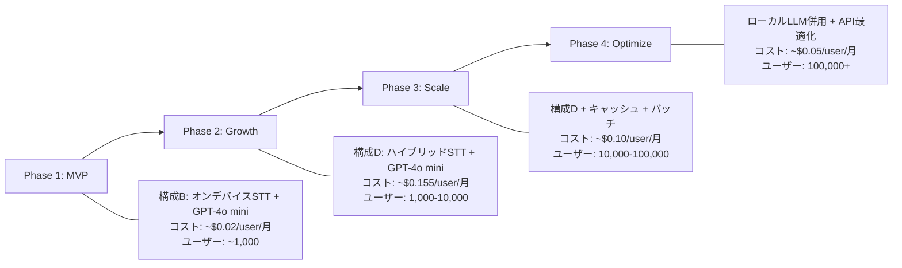

# 音声メモアプリ 統合コスト分析 & ビジネスモデル提案

**作成日**: 2026-03-15
**目的**: STT + LLM の統合コストからビジネスモデルの最適解を導出する

---

## 1. 統合コストサマリー（1ユーザー / 月90分利用）

### 1.1 構成パターン別 月間コスト

| 構成 | STT | LLM | 月間合計 | 年間合計 | 特徴 |
|:-----|:----|:----|--------:|--------:|:-----|
| **A. 最小コスト** | オンデバイス ($0) | Groq Llama 3.1 8B ($0.004) | **$0.004** | **$0.05** | API依存最小、品質△ |
| **B. コスパ最良** | オンデバイス ($0) | GPT-4o mini ($0.020) | **$0.020** | **$0.24** | STT無料+高品質LLM |
| **C. 推奨バランス** | GPT-4o Mini Transcribe ($0.27) | GPT-4o mini ($0.020) | **$0.290** | **$3.48** | クラウドSTT+LLM |
| **D. ハイブリッドSTT** | オンデバイス+クラウド50% ($0.135) | GPT-4o mini ($0.020) | **$0.155** | **$1.86** | 最も実用的 |
| **E. 高品質重視** | GPT-4o Transcribe ($0.54) | Gemini 2.5 Flash ($0.064) | **$0.604** | **$7.25** | 最高精度 |
| **F. 完全オンデバイス** | オンデバイス ($0) | Ollama ($0) | **$0.000** | **$0.00** | プライバシー最強 |

### 1.2 スケール別コスト（構成D: ハイブリッドSTT + GPT-4o mini）

| ユーザー数 | STTコスト/月 | LLMコスト/月 | 合計/月 | 合計/年 |
|-----------:|------------:|------------:|--------:|--------:|
| 100 | $13.50 | $2.00 | **$15.50** | $186 |
| 1,000 | $135.00 | $19.85 | **$154.85** | $1,858 |
| 10,000 | $1,350.00 | $198.45 | **$1,548.45** | $18,581 |
| 100,000 | $13,500.00 | $1,984.50 | **$15,484.50** | $185,814 |

---

## 2. ビジネスモデル分析

### 2.1 モデル別の損益シミュレーション

#### パターン①: 買い切り ¥750（$4.99）

| 指標 | 構成B (オンデバイスSTT) | 構成D (ハイブリッド) |
|:-----|:--:|:--:|
| 1ユーザーの年間コスト | $0.24 | $1.86 |
| **買い切り価格でカバーできる期間** | **20.8年** | **2.7年** |
| Apple手数料(30%)控除後 | $3.49 | $3.49 |
| 控除後カバー期間 | 14.5年 | 1.9年 |
| 1万ユーザーでの総収入 | $49,900 | $49,900 |
| 1万ユーザーの年間コスト | $2,400 | $18,581 |
| **年間利益率** | **95.2%** | **62.8%** |

**判定**: 構成B（オンデバイスSTT）なら**買い切りモデルは十分持続可能**。構成Dでも約2年はカバーできるが、長期的にはコスト圧迫リスクあり。

#### パターン②: フリーミアム（無料 + Pro月額¥500）

| 指標 | 想定値 |
|:-----|:------|
| 無料ユーザーの機能 | オンデバイスSTT + LLM要約 月5回まで |
| 無料ユーザーの月間コスト | $0.003（LLM 5回分のみ） |
| Pro月額 | ¥500（$3.33） |
| Apple手数料控除後 | $2.33 |
| Proユーザー月間コスト（構成D） | $0.155 |
| **Pro粗利率** | **93.3%** |
| 無料→Pro転換率 5%の場合 | |
| 10万DL → 5,000 Pro | 月間収入 $11,650 |
| 10万ユーザーの総コスト | 無料95K×$0.003 + Pro5K×$0.155 = **$1,060/月** |
| **月間利益** | **$10,590** |

**判定**: フリーミアムが**最も収益性が高い**。無料ユーザーのコストが極めて低いため、大規模に配布しても問題なし。

#### パターン③: 低額サブスク一律 ¥300/月

| 指標 | 想定値 |
|:-----|:------|
| 月額 | ¥300（$2.00） |
| Apple手数料控除後 | $1.40 |
| 月間コスト（構成D） | $0.155 |
| **粗利率** | **88.9%** |
| 1万有料ユーザー時の月間利益 | $12,450 |

#### パターン④: 買い切り + AI機能サブスク

| 指標 | 想定値 |
|:-----|:------|
| 買い切り（基本機能） | ¥500（$3.33）— 録音 + オンデバイスSTT |
| AI月額（クラウドSTT + LLM） | ¥300（$2.00） |
| Apple手数料控除後 | 買い切り$2.33 + 月額$1.40 |
| AI月額の粗利率 | **88.9%** |
| 買い切りでの初期回収 | ✅ 開発コスト回収 |

**判定**: 「基本機能は買い切りで安心感」+「AI機能はサブスクで持続収益」のハイブリッドが**サブスク疲れ層にも刺さる**。

---

## 3. 推奨ビジネスモデル

### 第1推奨: フリーミアム + 低額Pro

```
┌─────────────────────────────────────────────────┐
│  無料プラン（Free）                                │
│  ・オンデバイス音声文字起こし（無制限）              │
│  ・録音・保存（無制限）                             │
│  ・AI要約・タグ付け：月5回まで                      │
│  ・基本検索                                        │
│  → 月間コスト: ~$0.003/ユーザー                     │
├─────────────────────────────────────────────────┤
│  Proプラン（¥500/月 or ¥4,800/年）                 │
│  ・クラウド高精度STT（日本語最高精度）               │
│  ・AI要約・タグ付け・感情分析（無制限）              │
│  ・高度な検索・フィルタリング                        │
│  ・データエクスポート（Notion/Obsidian連携）         │
│  ・テーマカスタマイズ                               │
│  → 月間コスト: ~$0.155/ユーザー                     │
│  → 粗利率: 93.3%                                   │
└─────────────────────────────────────────────────┘
```

### なぜこのモデルか

1. **無料ユーザーのコストが月$0.003** — 100万DLでも月$3,000。広告なしでも許容範囲
2. **オンデバイスSTTを無料で開放** — 「制限なしで使える」体験がレビューと口コミを生む
3. **AI要約の月5回制限** — 無料で価値を体験→「もっと使いたい」でPro転換
4. **¥500/月** — 競合のOtter.ai($8.33)、Voicenotes($10)より大幅に安く、サブスク疲れ層にも刺さる
5. **年額¥4,800（月あたり¥400）** — 年払い割引で継続率向上

---

## 4. コスト最適化ロードマップ



### Phase別の技術選択

| Phase | STT | LLM | コスト最適化手法 |
|:------|:----|:----|:----------------|
| **1. MVP** | Apple SpeechAnalyzer / Whisper.cpp | GPT-4o mini | なし（小規模） |
| **2. Growth** | オンデバイス + GPT-4o Mini Transcribe | GPT-4o mini | プロンプトキャッシュ |
| **3. Scale** | 同上 | Gemini 2.5 Flash or Groq | バッチAPI、結果キャッシュ、遅延処理 |
| **4. Optimize** | 同上 + AssemblyAI | ローカルLLM + API併用 | オンデバイスLLM、モデル使い分け |

---

## 5. 結論

### コアメッセージ

> **LLM/STTのコストはビジネスモデル選択を制約しない。**
> 1ユーザーあたり月$0.02〜$0.60という極めて低いコスト構造により、
> **買い切り・フリーミアム・サブスクのいずれのモデルも成立する。**

### 数字で見る事実

| 指標 | 値 |
|:-----|:---|
| 最安構成の月間コスト/ユーザー | **¥0.6**（オンデバイス + Groq） |
| 推奨構成の月間コスト/ユーザー | **¥23**（ハイブリッドSTT + GPT-4o mini） |
| 10万ユーザー時の推奨構成月間コスト | **¥232万**（$15,485） |
| ¥500サブスク（5%転換）の月間収入 | **¥250万** |
| → **月間利益** | **¥18万+** |

---

## 6. 競合ビジネスモデル調査からの重要補正

### 6.1 核心的発見：買い切り + クラウドLLMは「STTコスト」で破綻する

競合調査で判明した事実：
- 既存の買い切りアプリ（Just Press Record, Whisper Notes）は**LLMを一切使っていない**
- クラウドSTTを使うと月$0.27〜$0.90/ユーザーのコストが発生
- $4.99買い切りでは**5.5ヶ月で売上を食い尽くす**

**ただし、オンデバイスSTT + クラウドLLMなら話が変わる：**
- STT: $0（オンデバイス）
- LLM: $0.02/月（GPT-4o mini）
- **$4.99で250ヶ月（20年）カバー可能**

### 6.2 市場のアンカー価格

| 価格帯 | 競合 | 密度 |
|:-------|:-----|:-----|
| **$8-10/月** | Otter.ai, Notta, Voicenotes, AudioPen, VOMO | **密集帯** |
| $15-20/月 | Audionotes Pro, Otter Business | 中 |
| Lifetime $50-199 | Voicenotes, Audionotes | 中 |

### 6.3 最も効果的な課金ゲート：「月間分数制限」

Otter.ai, VOMO, Nottaが採用。機能制限より量的制限の方が自然なアップセルを生む。

### 6.4 フリーミアム転換率の実績

- SaaS業界平均: 2-5%
- Otter.ai推定: 約4%（2,500万ユーザー / ARR $100M）
- Pro利用者の73%が4ヶ月以内に利用上限到達 → 上位プランへの転換ドライバー

---

## 7. 最終推奨（3調査統合）

### 第1推奨：フリーミアム（¥500/月 Pro）— 競合より圧倒的に安く

**市場のアンカー価格$8-10/月に対し、¥500（約$3.33）で参入。**

```
┌─────────────────────────────────────────────────┐
│  無料プラン（Free）                                │
│  ・オンデバイス音声文字起こし（無制限）              │
│  ・録音・保存（無制限）                             │
│  ・AI要約：月5回まで（課金ゲート）                  │
│  → 原価: ~$0.003/ユーザー/月                       │
├─────────────────────────────────────────────────┤
│  Proプラン（¥500/月 or ¥4,800/年）                 │
│  ・クラウド高精度STT（日本語最高精度）               │
│  ・AI要約・タグ付け・感情分析（無制限）              │
│  ・高度な検索・フィルタリング                        │
│  ・Notion/Obsidian連携エクスポート                   │
│  → 原価: ~$0.155/ユーザー/月                       │
│  → 粗利率: 93.3%（Apple手数料後でも89%）            │
└─────────────────────────────────────────────────┘
```

### 第2選択肢：買い切り¥500 + AI月額¥300（ハイブリッド）

サブスク疲れ層向け。基本機能は買い切りで安心感を提供しつつ、AI機能で継続収益。

### なぜ¥500/月か（$3.33）

1. **競合の半額以下**: Otter.ai $8.33、Voicenotes $10 → 価格で圧倒
2. **原価¥23で粗利93%**: 十分な収益性
3. **日本市場の心理的閾値**: ¥500はワンコインで決済ハードルが低い
4. **年額¥4,800**: 月あたり¥400で継続率向上

### 数字で見る事実

| 指標 | 値 |
|:-----|:---|
| 推奨構成の月間コスト/ユーザー | **¥23**（ハイブリッドSTT + GPT-4o mini） |
| Proプラン粗利率（Apple手数料前） | **93.3%** |
| Proプラン粗利率（Apple手数料30%後） | **89.4%** |
| 10万DL × 5%転換 → 月間収入 | **¥250万** |
| 10万DL全体の月間コスト | **約¥12万** |
| → **月間利益** | **¥238万** |
