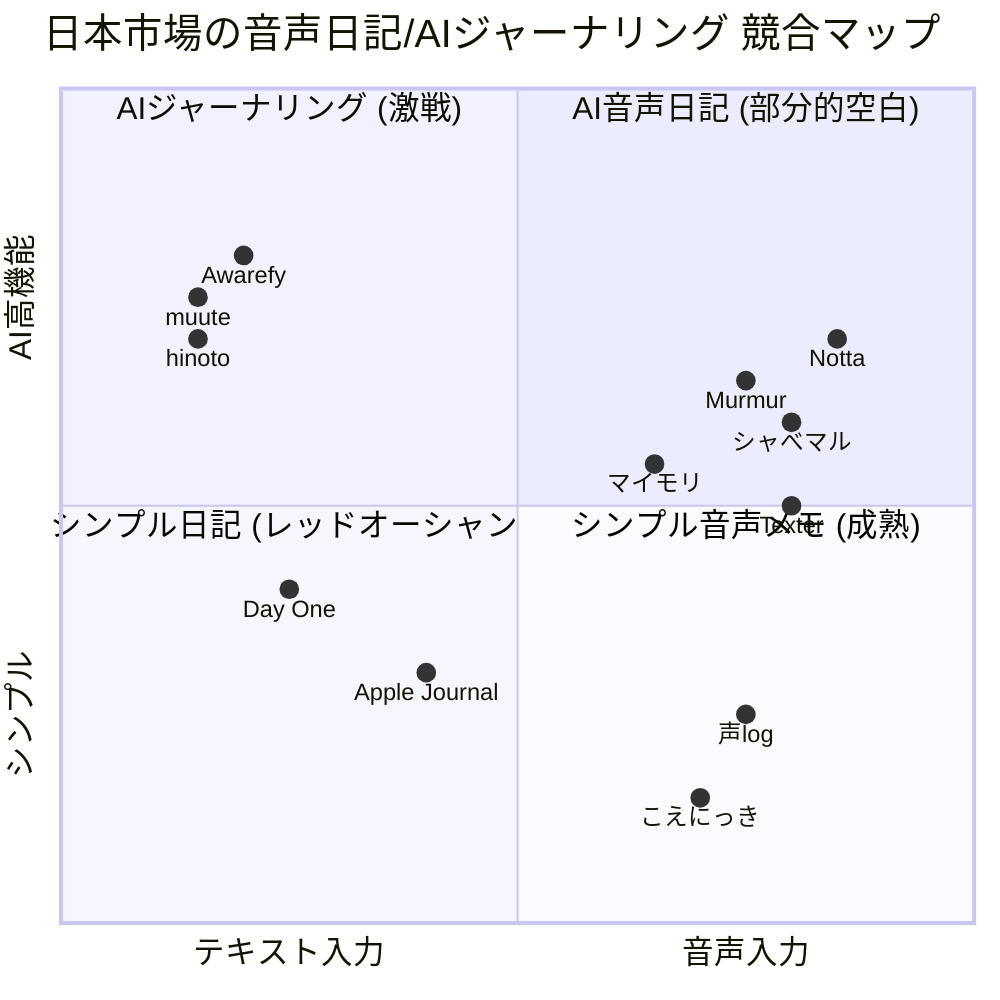
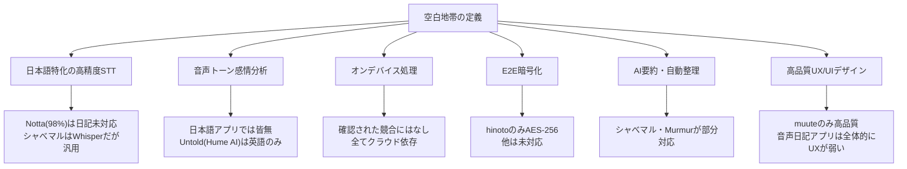
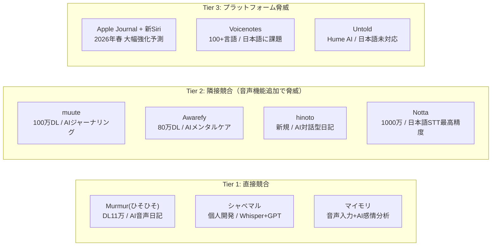

# 日本市場 AI音声日記アプリ 競合再調査レポート

**調査日**: 2026-03-15
**前回調査**: 2026-03-14（グローバル競合市場調査）
**目的**: 前回結論「日本語 x AI音声日記は明確な空白地帯」の再検証
**作業ディレクトリ**: `works/20260315_05_日本市場競合再調査/`

---

## エグゼクティブサマリー

前回調査の結論を修正する。「完全な空白」ではなく「**部分的空白**」が正確な表現である。



**修正結論**:
- 「日本語特化 x AI音声日記 x 高品質プロダクト」の交差点は依然として空白
- ただしシャべマル、Murmur(ひそひそ)、マイモリなど小規模競合が存在
- muute(100万DL)・Awarefy(80万DL)が「AI x 感情分析 x 日記」需要を実証済み（テキストのみ）

---

## 1. 日本発の音声メモ・音声日記アプリ

### 1.1 App Store / Google Play ランキング

**「音声日記」検索結果上位（AppBank調べ）**:

| 順位 | アプリ名 | DL数 | AI機能 | 感情分析 | 価格 |
|---|---|---|---|---|---|
| 1 | 音声メモ 付箋 | **1,175万** | なし | なし | 無料(広告) |
| 2 | 音声メモ帳 | **98万** | なし | なし | 無料(広告) |
| 3 | 写真を音声日記 | **44万** | なし | なし | 無料(IAP) |
| 4 | ひそひそ(Murmur) | **11万** | Premium | Premium | Freemium |

**「音声メモ」検索結果上位（AppBank調べ）**:

| 順位 | アプリ名 | DL数 | 特徴 |
|---|---|---|---|
| 1 | Google Keep | 21億+ | テキスト・音声メモ |
| 2 | 音声文字変換 | 8億+ | リアルタイム変換 |
| 3 | ボイスレコーダー | 8,100万+ | シンプル録音 |

**重要な発見**: 上位ランキングはシンプルな録音・メモアプリが独占。AI機能搭載アプリはランク外であり、「AI音声日記」ジャンル自体がまだ日本のユーザーに浸透していない。

### 1.2 日本発スタートアップ・個人開発アプリ

#### シャべマル（音声認識メモ日記）

- **開発**: 個人開発者「にょす」
- **技術**: OpenAI Whisper + ChatGPT（Function Calling活用）
- **主要機能**:
  - 音声入力→自動タイトル生成・絵文字・感情・カテゴリ分類
  - 月次振り返りレポート（ChatGPT生成）
  - 「よく使う単語」登録による誤認識改善
- **価格**: 月額500円（1ヶ月無料トライアル）
- **プラットフォーム**: iOS
- **評価**: 技術的には当プロジェクトに最も近いコンセプト。ただし個人開発でマーケティング・スケーリングに限界あり
- **出典**: [note.com - シャべマルの開発記事](https://note.com/nyosubro/n/na2b9c6ede8d5)

#### 声log

- **開発**: 株式会社Infigate
- **主要機能**:
  - 音声録音→AI文字起こし
  - 日記の公開/閲覧（音声SNS機能）
  - 匿名性重視
- **AI感情分析**: 現在なし（**今後アップデート予定**）
- **評価**: SNS機能が差別化ポイントだが、AI機能はまだ未実装
- **出典**: [Infigate公式](https://infigate.net/%E3%80%8C%E5%A3%B0log%E3%80%8D%E3%82%92%E3%83%AA%E3%83%AA%E3%83%BC%E3%82%B9%E3%81%97%E3%81%BE%E3%81%97%E3%81%9F-%E9%9F%B3%E5%A3%B0%E3%81%A7%E6%AE%8B%E3%81%99%E3%80%81%E6%96%B0%E3%81%97%E3%81%84/)

#### こえにっき / こえ日記

- **主要機能**: 音声録音→文字起こし→カレンダー表示
- **AI機能**: なし
- **評価**: 「シンプルでがらんとした雰囲気が話しやすい」「無料で使わせていただくのが申し訳ない」と高評価
- **出典**: [App Store](https://apps.apple.com/jp/app/%E3%81%93%E3%81%88%E3%81%AB%E3%81%A3%E3%81%8D/id975010774)

#### 日記AI（売却済み）

- **技術**: Next.js / TypeScript / Supabase / OpenAI API（Whisper + GPT-4）
- **主要機能**: 音声入力→自動文字起こし→要約生成→感情分析スコア化
- **収益**: 月額売上0円、フォロワー5人
- **備考**: ラッコM&Aにて**10万円で売却済み**（成約14日）
- **評価**: コンセプトは当プロジェクトと酷似するが、プロダクト品質・マーケティングが不十分だった典型例
- **出典**: [ラッコM&A](https://rakkoma.com/project/detail/19606)

#### マイモリ

- **主要機能**: 木のキャラクターに話しかけて日記作成、AIが短文を自然な日記文に整形
- **感情分析**: 6段階ムード評価、月間可視化、「良い日」の割合表示
- **レポート**: 週次・月次の感情パターンレポート
- **評価**: 音声入力+AI感情分析の組み合わせを持つ貴重な日本語アプリ
- **出典**: [ROOMIE](https://www.roomie.jp/2025/10/1618301/)

---

## 2. 日本語に特化/対応したグローバルアプリ

### 2.1 Notta

| 項目 | 詳細 |
|---|---|
| ユーザー | 1,000万人超 / 法人4,000社+ |
| 日本語精度 | 約98% |
| **日記機能** | **なし**（会議・ビジネス特化） |
| 最新AI機能 | Notta Brain（AIエージェント、2026年1月） |
| 価格 | Free / Pro月額$8.17 |

**判定**: Nottaは日記市場に参入しておらず、直接競合ではない。ただしNottaが持つ日本語98%精度のSTT技術と1000万ユーザー基盤は、将来の個人向け展開で脅威になり得る。

### 2.2 Murmur（ひそひそ）

| 項目 | 詳細 |
|---|---|
| 開発元 | 韓国（Huurray / Junhyeok Heo） |
| 日本DL数 | 約11万 |
| 評価 | 4.8 (500+レビュー) |
| 日本語対応 | あり（16言語中の1つ） |
| AI要約 | Premium |
| 感情分析 | 5段階 + 月間トレンド（Premium） |
| STT | Premium |
| 録音上限 | 20分/エントリー |
| 最終更新 | 2026年2月21日 |
| 価格 | 基本無料 / Premium（購読制） |

**判定**: **最も近い直接競合**。AI音声日記のコンセプトは当プロジェクトとほぼ同一。ただし:
- 日本語は16言語の1つであり特化ではない
- 日本のDL数11万は小規模
- 「ひそひそ」というブランディングは日本ユーザーに好意的に受け入れられている

### 2.3 Texter（テキスター）

| 項目 | 詳細 |
|---|---|
| 開発元 | 日本 |
| 音声認識 | Whisper搭載 |
| AI要約 | あり |
| **日記機能** | **なし**（文字起こし・議事録特化） |
| 最新機能 | リアルタイム翻訳（2025年12月） |
| 価格 | Free / Premium月額1,500円（年額6,000円） |

**判定**: 日記市場には参入していない。文字起こし特化。

### 2.4 Voicenotes

| 項目 | 詳細 |
|---|---|
| 日本語対応 | 100+言語の1つ |
| 日本語品質 | **課題あり**（タイトルが中国語表示、日英混在でハングル出力等） |
| AI要約 | あり |
| 感情分析 | なし |
| 価格 | 月$10 |

**判定**: 日本語対応に明確な品質問題があり、日本市場では弱い。

### 2.5 Untold

| 項目 | 詳細 |
|---|---|
| 日本語対応 | **未対応**（英語中心） |
| 感情分析 | Hume AI連携 |
| 価格 | 完全無料 |
| 最終更新 | 2025年8月 |

**判定**: 日本語未対応。最終更新が2025年8月で開発ペースが遅い。近い将来の日本語対応は不明。

### 2.6 YoByte

**判定**: Web検索で存在を確認できず。前回調査での言及が不正確であった可能性あり。

---

## 3. AIジャーナリング市場（テキスト入力型 - 隣接市場）

前回調査で見落としていた重要市場。音声機能は持たないが、「AI x 日記 x 感情分析」の需要を実証している。

### 3.1 muute（ミュート）

| 項目 | 詳細 |
|---|---|
| DL数 | **100万超** |
| App Store評価 | ★4.4 |
| 開発元 | 日本（ミッドナイトブレックファスト） |
| AI機能 | テキスト感情分析、週次/月次インサイトレポート |
| **音声入力** | **なし** |
| 価格 | 月額750円 / 年額5,000円 |
| 展開 | B2C + B2B（muute for school） |

**重要性**: **日本市場で「AI x 日記 x 感情分析」のPMFが実証されている**。100万DLは無視できない数字。音声機能を追加すれば直接競合になる。

### 3.2 Awarefy（アウェアファイ）

| 項目 | 詳細 |
|---|---|
| DL数 | **80万超** |
| App Store評価 | ★4.4 |
| 開発元 | 日本（株式会社Awarefy） |
| AI機能 | 認知行動療法ベース、200種セルフケア提案、AIカウンセリング |
| **音声入力** | **限定的**（AI音声対話は可能） |
| 価格 | Premium（詳細不明） |

**重要性**: メンタルケア x AIの市場で確固たるポジション。音声日記との機能重複が大きい。

### 3.3 hinoto（ヒノト）

| 項目 | 詳細 |
|---|---|
| リリース | 2026年1月1日 |
| 開発元 | 日本（株式会社YONAGI） |
| AI機能 | 3つのAIモード（温もり/道しるべ/月明かり）、長期記憶、深層分析 |
| 暗号化 | AES-256、運営者もデータ閲覧不可 |
| **音声入力** | **記載なし** |

**重要性**: 最新参入でプライバシー重視設計。2026年リリースの新規参入者が存在することは、この市場のホットさを示す。

### 3.4 Apple Journal

| 項目 | 詳細 |
|---|---|
| リリース | iOS 17.2（2023年12月） |
| 音声入力 | あり（iOSの音声入力を使用） |
| AI機能 | Siri連携の記入提案（写真・音楽・運動データ） |
| 感情分析 | なし |
| 価格 | 無料（iOS標準） |

**重要性**: 2026年春の新Siri + Apple Intelligence統合で大幅強化される可能性。最大の潜在的脅威。

---

## 4. カテゴリ別ランキング分析

### 4.1 仕事効率化カテゴリ（音声系アプリ）

- **Notta**: 日本語文字起こしのトップ。法人市場で確固たる地位
- **Texter**: 個人・中小向け音声文字起こし
- **Typeless**: 2025年登場のAI音声入力キーボード。Stanford出身チーム開発。iOS版は2026年3月リリース予定

### 4.2 ライフスタイルカテゴリ（日記系アプリ）

日記アプリランキング上位:
1. Day One（定番・高機能）
2. muute（AI×ジャーナリング）
3. Lifebear（手帳統合型）
4. Apple ジャーナル（標準アプリ）

**音声日記はこのランキングに入っていない**。これはジャンル自体の認知度の低さを示す。

---

## 5. 主要競合の詳細評価

### 5.1 機能比較マトリクス

| 機能 | Murmur | シャべマル | muute | Awarefy | マイモリ | Notta | 当プロジェクト(想定) |
|---|---|---|---|---|---|---|---|
| **音声録音** | 20分 | あり | なし | 限定 | あり | あり | あり |
| **日本語STT** | 中 | 高(Whisper) | N/A | N/A | 中 | 最高(98%) | 高(目標) |
| **AI要約** | Premium | あり | なし | なし | あり | あり | あり |
| **感情分析(テキスト)** | Premium | あり | あり | あり | あり(6段階) | なし | あり |
| **感情分析(音声トーン)** | なし | なし | N/A | なし | なし | なし | **あり(差別化)** |
| **オンデバイス処理** | 不明 | なし | 不明 | 不明 | 不明 | なし | **あり(差別化)** |
| **E2E暗号化** | なし | なし | なし | なし | なし | なし | **あり(差別化)** |
| **週次/月次レポート** | Premium | あり | あり | あり | あり | なし | あり |
| **Apple Watch** | なし | なし | なし | なし | なし | なし | あり(目標) |
| **CarPlay** | なし | なし | なし | なし | なし | なし | **あり(差別化)** |

### 5.2 価格比較

```mermaid
xychart-beta
    title 日本市場の競合価格帯（月額・円）
    x-axis ["こえにっき", "Murmur(無料)", "シャべマル", "muute", "Texter", "Notta Pro"]
    y-axis "月額(円)" 0 --> 2000
    bar [0, 0, 500, 750, 1500, 1200]
```

---

## 6. 前回調査からの修正事項

### 6.1 修正が必要な認識

| 前回の結論 | 修正後の結論 | 根拠 |
|---|---|---|
| 日本語AI音声日記は**完全な空白** | 「日本語特化 x AI x 音声日記 x 高品質」は**部分的空白** | シャべマル、Murmur、マイモリが存在 |
| Murmurは「感性的デザイン」程度 | MurmurはAI要約・感情分析・STTを搭載する**実質的な競合** | Premium機能の詳細調査 |
| 競合は28プロダクト | **日本市場固有の競合が追加で10以上存在** | muute, Awarefy, hinoto, シャべマル等 |
| AIジャーナリング市場を未考慮 | muute(100万DL)とAwarefy(80万DL)が**隣接市場で需要を実証** | DL数・評価の確認 |

### 6.2 新たに発見された重要事実

1. **「日記AI」が10万円で売却された**: 同コンセプトのアプリが収益化に失敗し売却。マーケティングとプロダクト品質の重要性を示す反面教訓
2. **AIジャーナリング市場が日本で急成長中**: muute(100万DL)は「AI x 感情分析 x 日記」への明確な需要を証明
3. **音声入力 x 日記の行動変容が未成熟**: 日記アプリランキング上位に音声日記が入っていない。「話して日記をつける」行動自体の啓蒙が必要
4. **Typeless等のAI音声入力ツールが台頭**: 音声→整形テキストの汎用ツールが日記用途にも転用可能

---

## 7. 結論と戦略的示唆

### 7.1 空白は本当に存在するか？

**YES - ただし「条件付きの空白」**

以下の条件が全て揃ったプロダクトは日本市場に存在しない:



### 7.2 なぜ空白なのか？

| 理由 | 詳細 |
|---|---|
| **市場の分断** | 「音声メモ」「文字起こし」「AIジャーナリング」「メンタルケア」が別市場として発展。統合プレイヤー不在 |
| **ビジネス市場への偏重** | 日本語音声AI技術を持つ企業(Notta等)はB2B市場を優先。個人向け日記は後回し |
| **テキスト入力文化の根強さ** | muuteの100万DLが示すように、日本ユーザーはテキスト日記に慣れている |
| **個人開発者の限界** | シャべマル・日記AIは技術的には可能性を示すが、持続的開発・マーケティングに限界 |
| **技術統合コスト** | 高精度日本語STT + LLM + 感情分析 + オンデバイス + プライバシーの同時実現は高コスト |

### 7.3 参入した場合の直接競合



### 7.4 勝つための条件

前回調査の結論に加え、以下の修正・追加を提言:

| 条件 | 具体策 | 根拠 |
|---|---|---|
| **muute以上のUX品質** | muuteの洗練されたUIを参考に、音声日記でも同等以上の体験を | muuteの100万DL成功要因はUX品質 |
| **音声トーン感情分析** | Hume AI等の音声感情APIを日本語で実現 | 全競合が未実装の最大の差別化ポイント |
| **オンデバイス + 暗号化** | Apple SpeechAnalyzerの活用 | 「日記のプライバシー」は日本ユーザーの最大懸念 |
| **行動変容の設計** | 「話して日記をつける」習慣の啓蒙・オンボーディング | 市場自体が未成熟であるため教育コストが必要 |
| **個人開発との差別化** | 持続的なアップデート、カスタマーサポート、マーケティング | 日記AI(10万円売却)の反面教訓 |
| **Apple Watch / CarPlay** | ハンズフリーシーンの独占 | 全競合が未対応の空白 |

### 7.5 リスクの再評価

| リスク | 前回評価 | 修正評価 | 理由 |
|---|---|---|---|
| **Apple Siri刷新** | 高 | **最高** | Apple Journal + 新Siriの統合が最大の脅威 |
| **muuteの音声機能追加** | 未評価 | **高** | 100万DL基盤 + AI感情分析の実績 |
| **Nottaの個人向け展開** | 未評価 | **中-高** | 1000万ユーザー + 日本語98%精度 |
| **市場啓蒙コスト** | 未評価 | **中-高** | 音声日記習慣がまだ根付いていない |
| **Murmurの日本語強化** | 低 | **中** | 2026年2月更新と活発な開発 |

---

## 8. 最終まとめ

### 前回vs今回の結論比較

| 観点 | 前回(3/14) | 今回(3/15) |
|---|---|---|
| 空白の有無 | 明確な空白 | **条件付きの部分的空白** |
| 直接競合 | なし | **Murmur、シャべマル、マイモリ** |
| 隣接脅威 | 未分析 | **muute(100万DL)、Awarefy(80万DL)** |
| 市場成熟度 | 未分析 | **音声日記ジャンル自体が未成熟** |
| 参入難易度 | 中 | **中-高**（市場啓蒙コスト加算） |

### 最終評価

**参入は依然として有望だが、前回調査よりも慎重な戦略が必要**。

1. **空白は存在するが、「無人の荒野」ではなく「小さな開拓者がいる新大陸」** - シャべマル等の先行者から学べることが多い
2. **最大の課題は技術ではなく行動変容** - 「話して日記をつける」習慣を日本ユーザーに根付かせる必要がある
3. **muuteの成功は希望** - AI x 感情分析 x 日記への需要は日本で実証済み（100万DL）
4. **差別化の鍵は「音声トーン感情分析」と「オンデバイス」** - この2つは全競合が未実装
5. **Apple Siri + Journal統合が最大のリスク** - 2026年春の動向を注視し、Appleが実現できない深い体験で差別化すべき

---

## Sources

### 日本発アプリ
- [シャべマル 開発記事 - note.com](https://note.com/nyosubro/n/na2b9c6ede8d5)
- [声log リリース - Infigate](https://infigate.net/%E3%80%8C%E5%A3%B0log%E3%80%8D%E3%82%92%E3%83%AA%E3%83%AA%E3%83%BC%E3%82%B9%E3%81%97%E3%81%BE%E3%81%97%E3%81%9F-%E9%9F%B3%E5%A3%B0%E3%81%A7%E6%AE%8B%E3%81%99%E3%80%81%E6%96%B0%E3%81%97%E3%81%84/)
- [こえにっき - App Store](https://apps.apple.com/jp/app/%E3%81%93%E3%81%88%E3%81%AB%E3%81%A3%E3%81%8D/id975010774)
- [日記AI - ラッコM&A](https://rakkoma.com/project/detail/19606)
- [マイモリ - ROOMIE](https://www.roomie.jp/2025/10/1618301/)

### グローバルアプリ（日本語対応）
- [Murmur公式サイト](https://murmur.website/en)
- [Murmur - App Store](https://apps.apple.com/jp/app/%E3%81%B2%E3%81%9D%E3%81%B2%E3%81%9D-%E9%9F%B3%E5%A3%B0%E6%97%A5%E8%A8%98/id1510564828)
- [Notta - Business Insider Japan](https://www.businessinsider.jp/article/2506-notta-new-product-notta-memo/)
- [Texter - App Store](https://apps.apple.com/jp/app/texter-%E8%AD%B0%E4%BA%8B%E9%8C%B2-%E9%9F%B3%E5%A3%B0%E6%96%87%E5%AD%97%E8%B5%B7%E3%81%93%E3%81%97/id1482592304)
- [Voicenotes - App Store Japan](https://apps.apple.com/jp/app/voicenotes-ai-notes-meetings/id6483293628)
- [Untold公式](https://www.untoldapp.com/)

### AIジャーナリング市場
- [muute公式](https://muute.jp/)
- [Awarefy公式](https://www.awarefy.com/)
- [hinoto - PR TIMES](https://prtimes.jp/main/html/rd/p/000000004.000141963.html)
- [ジャーナリングアプリ8選 - アプリブ](https://app-liv.jp/health/mental/2796/)

### App Storeランキング
- [音声日記ランキング - AppBank](https://www.appbank.net/app-rank/life/life-log/voice-diary)
- [音声メモランキング - AppBank](https://www.appbank.net/app-rank/life/memo-note/voice-memo)

### 市場データ
- [デジタルジャーナルアプリ市場 - Market Research](https://www.marketresearch.co.jp/insights/digital-journal-apps-market-straits/)
- [モバイル音声認識市場 - GII](https://www.gii.co.jp/report/tbrc1976051-mobile-speech-recognition-software-global-market.html)

### 音声入力ツール
- [Typeless公式](https://www.typeless.com/ja)
- [音声入力アプリ6選](https://www.saku-info.net/entry/voice-input-app-osusume)
