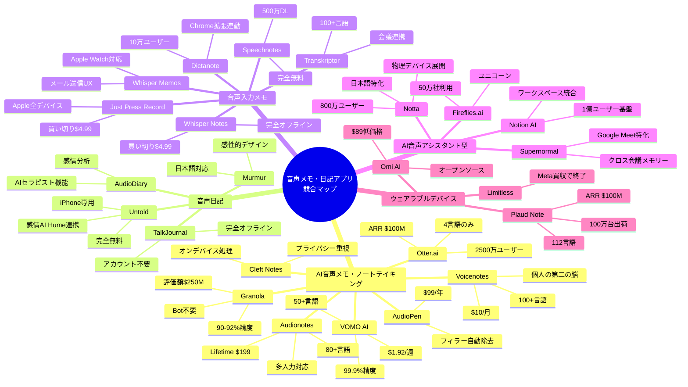
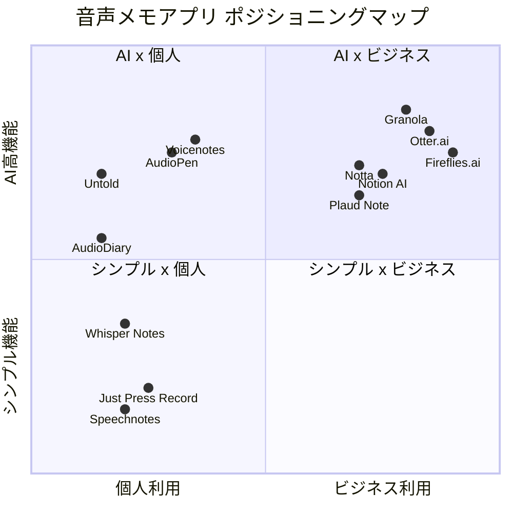
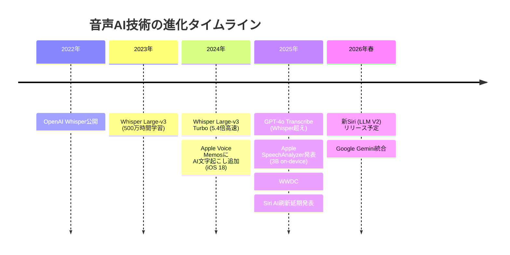
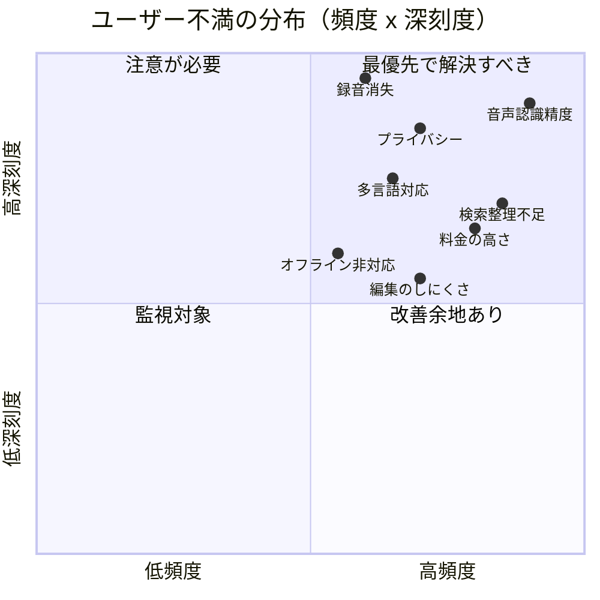
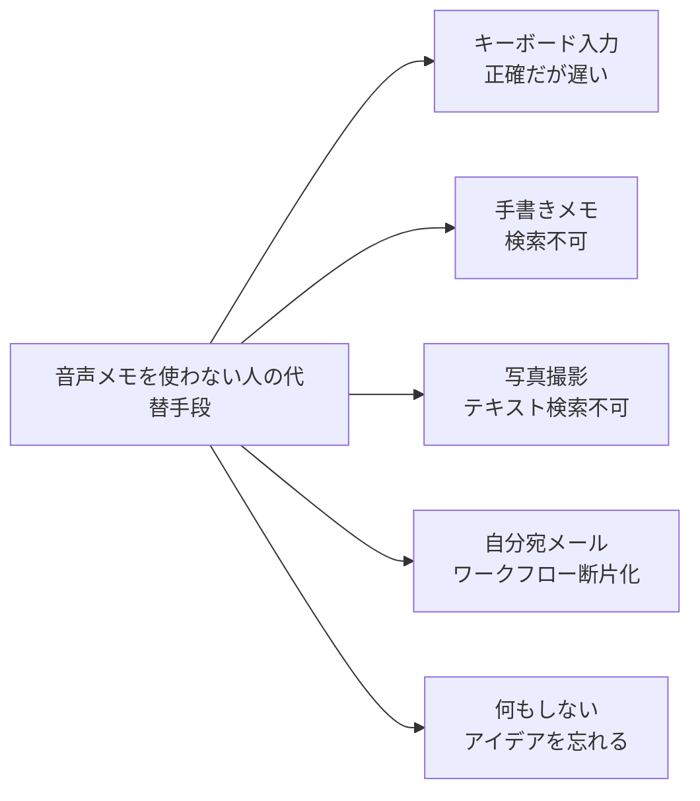
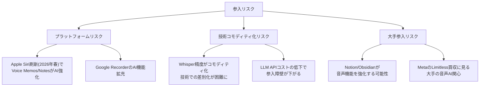
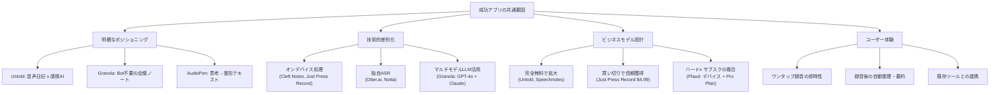
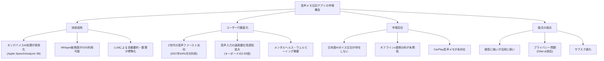

# 音声入力メモ・日記アプリ グローバル市場調査 統合レポート

**調査日**: 2026-03-14
**目的**: 音声入力を活用した日記・メモアプリの新規参入にあたり、グローバル競合環境・市場動向・ユーザーニーズを包括的に把握する

---

## エグゼクティブサマリー

### 市場の全体像

音声メモ・日記アプリ市場は、3つの成長市場の交差点に位置する巨大な機会領域である。

| 市場セグメント | 2024年規模 | 2030-33年予測 | CAGR |
|---|---|---|---|
| 音声認識市場 | $84.9億 | $231-537億 | 14-23% |
| ノートアプリ市場 | $79-95億 | $267億(2032) | 16.5% |
| デジタルジャーナルアプリ市場 | $51-55億 | $136億(2033) | 11.5% |

### 最重要ファインディング

1. **日本語 x AI音声日記は明確な空白地帯** - Untold（感情AI日記）の日本語版に相当するアプリが存在しない
2. **既存アプリは「録音」に強いが「活用」に弱い** - 録音後のワークフロー（文字起こし→整理→検索→活用）にペインが集中
3. **プライバシーファースト設計への需要急増** - Otter.ai訴訟を契機に、オンデバイス処理への期待が高まる
4. **サブスク疲れと買い切りモデルの再評価** - $4.99買い切りアプリが支持を獲得
5. **Z世代が音声ファースト世代** - 2027年までに64%が月次利用予測

---

## 1. 競合マップ（28プロダクト）

### 1.1 カテゴリ別競合一覧

### 1.2 主要競合 詳細比較表

| アプリ | ユーザー規模 | 価格帯 | 音声認識技術 | 対応言語 | 差別化ポイント |
|---|---|---|---|---|---|
| **Otter.ai** | 2,500万 | Free / Pro $8.33/月 | 独自ASR | 4言語 | 企業向けナレッジベース化 |
| **Voicenotes** | 15万+ | $10/月 | Whisper+GPT-4 | 100+ | 個人の「第二の脳」 |
| **AudioPen** | 非公開 | $99/年 | Whisper+GPT | 多言語 | フィラー自動除去 |
| **Granola** | 急成長中 | $18/月 | GPT-4o+Claude | 多言語 | Bot不要会議録音 |
| **Untold** | 非公開 | **完全無料** | Hume AI | 英語中心 | 感情AI日記 |
| **AudioDiary** | 非公開 | フリーミアム | Deepgram | 多言語 | AIセラピスト機能 |
| **Just Press Record** | 非公開 | **$4.99買い切り** | Apple Speech | 30+ | Apple全デバイス統合 |
| **Whisper Notes** | 非公開 | **$4.99買い切り** | Whisper(on-device) | 90+ | 完全オフライン |
| **Notta** | 800万 | Free / Pro $8.17/月 | 日本語特化AI | 58 | 日本語98.86%精度 |
| **Plaud Note** | 100万台 | デバイス$159+ | 独自AI+Whisper | 112 | 超小型録音デバイス |

### 1.3 ポジショニングマップ

**空白地帯**: 「AI高機能 x 個人利用」の日本語特化ゾーン（Untold的体験の日本版）が明確に空いている

---

## 2. 市場トレンドと技術動向

### 2.1 技術の転換点

**重要な技術シフト**:
- オンデバイスAI処理が実用水準に到達（Apple 3Bパラメータモデル、5ms未満のレイテンシ）
- Whisperの精度がコモディティ化（月間1,000万DL超）
- LLMによる音声→構造化テキストの変換が標準化

### 2.2 プラットフォーム各社の動き

| プラットフォーム | 直近の動き | 脅威レベル |
|---|---|---|
| **Apple** | Voice Memos/NotesにAI文字起こし追加。2026年春に新Siri（LLMベース） | **高** - エコシステム内完結の脅威 |
| **Google** | Recorder「Clear voice」開発中。Pixel専用 | **中** - Pixel限定で影響範囲小 |
| **Samsung** | Galaxy AI統合Voice Recorder。AI要約+翻訳 | **中** - Galaxy限定 |

### 2.3 ユーザー行動の変化

| 指標 | 数値 |
|---|---|
| 音声入力はキーボードの何倍速いか | **2.93倍** |
| Z世代の2027年月次利用予測 | **64%** |
| ミレニアル世代の月次利用率 | **61.9%** |
| 「音声の方が使いやすい」と回答した割合 | **90%** |
| 音声データプライバシーを懸念するユーザー | **45%** |

### 2.4 資金調達・M&A動向

| 企業 | 資金状況 | 備考 |
|---|---|---|
| Otter.ai | 累計$73M / ARR $100M | 2025年3月にARR $1億到達 |
| Granola | Series B $43M | 評価額$250M（2025年5月） |
| Fireflies.ai | 非公開 | 評価額$10億（ユニコーン） |
| Fathom | Series A $17M | 2024年9月 |
| Plaud AI | **外部資金ゼロ** | 年間売上$100M（ブートストラップ成功） |
| AssemblyAI | 累計$160M | 音声AI基盤技術 |

---

## 3. ユーザー不満・未充足ニーズ分析

### 3.1 不満の深刻度マップ

### 3.2 最重要ペインポイント TOP 7

| 順位 | ペインポイント | 深刻度 | 代表的な声 |
|---|---|---|---|
| 1 | **音声認識精度（特に日本語）** | 最高 | 「存在しない単語を生成する」 |
| 2 | **プライバシー懸念** | 高 | Otter.ai集団訴訟が不信を加速 |
| 3 | **検索・整理機能の不足** | 高 | 「整理なしでは録音しなかったのと同じ」 |
| 4 | **サブスク疲れ** | 高 | 「保存するだけでサブスク必要」への反発 |
| 5 | **録音の信頼性** | 高 | 30分の録音が数秒に / 完全消失 |
| 6 | **多言語対応** | 中-高 | バイリンガルの言語混在で認識崩壊 |
| 7 | **オフライン対応** | 中-高 | AI文字起こしの大半がクラウド依存 |

### 3.3 ステータス・クオ（現状の代替手段）

音声メモアプリを使わない人は以下で代替している:

**3つの利用障壁**:
- **社会的障壁**: 公共の場で声を出すのが恥ずかしい
- **技術的障壁**: 認識精度への不信、修正の手間
- **習慣的障壁**: タイピングの方が慣れている

### 3.4 音声メモが特に求められるシーン

1. 運転中（CarPlay非対応が大きな障壁）
2. 歩行・ジョギング中
3. 寝起き・就寝前の日記
4. 料理・家事中
5. 感情的な瞬間（声の方が感情を伝えやすい）
6. 長文の思考整理（150 WPM vs 40 WPM）

---

## 4. 市場の空白領域と参入機会

### 4.1 競合が解決できていない根本課題

> **「音声でキャプチャしたアイデアや情報を、テキストと同等以上に検索・整理・活用できるようにする」**

既存アプリの大半は「録音」フェーズに強いが、「活用」フェーズが弱い。

- 緑: 既存アプリが得意な領域
- 黄: 改善中だが課題が多い領域
- 赤: 明確に弱い領域

### 4.2 空白地帯マトリクス

| 空白領域 | 説明 | 競合状況 | 参入難易度 |
|---|---|---|---|
| **日本語 x AI音声日記** | Untold的な感情分析付き音声日記の日本語版 | **競合なし** | 中 |
| **オフライン x 感情分析** | オンデバイスで完結する感情AI日記 | **競合なし** | 高 |
| **低価格 x 多言語 x 個人日記** | 買い切りor低額で100+言語対応の個人向け | **競合少ない** | 低-中 |
| **Apple Watch x 日記特化** | Apple Watch単体で完結する音声日記 | **競合少ない** | 中 |
| **CarPlay x 音声メモ** | 運転中のハンズフリー音声メモ | **競合なし** | 中 |
| **音声メモ x ナレッジグラフ** | 音声→構造化知識ベースへの自動統合 | **競合極少** | 高 |

### 4.3 参入にあたって考慮すべきリスク

---

## 5. 成功アプリの共通要因分析

### 5.1 成功パターン

### 5.2 April Dunford式ポジショニング分析

競合分析の大家 April Dunford のフレームワークに基づく分析:

**「顧客がこの製品を使わなかったら何をするか？」**

| ターゲット | ステータス・クオ（現状の代替手段） | なぜ代替手段では不十分か |
|---|---|---|
| 日記を書きたい人 | 手書き / Day One / テキスト入力 | 時間がかかる、続かない、感情が伝わらない |
| アイデアをメモしたい人 | Apple標準メモ / Google Keep | 音声入力の活用が限定的、整理されない |
| 会議録を残したい人 | Otter.ai / Notion | 高い、プライバシー懸念、日本語が弱い |
| 思考を整理したい人 | 手書きノート / テキストエディタ | 話す方が速い(150 WPM vs 40 WPM)のに活かせない |

**最大の敵は「やらないこと」**: ボイスメモを試したが活用できず放置 → 結局キーボード入力に戻る。このサイクルを断ち切ることが最重要。

---

## 6. 参入戦略への示唆

### 6.1 推奨ポジショニング

上記の分析から、以下のポジショニングが最も大きな市場機会を持つ:

> **「日本語に強い、プライバシーファーストのAI音声日記・思考整理アプリ」**

**理由**:
1. 日本語 x AI音声日記の競合が実質ゼロ
2. プライバシー（オンデバイス処理）への需要急増
3. 「録音→活用」のギャップを埋めるAI整理機能
4. Z世代・ミレニアル世代の音声ファースト志向

### 6.2 差別化の武器（既存競合が持たない強み）

| 差別化要素 | 対抗できる競合 | 実現難易度 |
|---|---|---|
| 日本語高精度 + 多言語自動切替 | Otter.ai(4言語), Untold(英語) | 中（Whisper + 日本語fine-tune） |
| オンデバイス完結 + E2E暗号化 | Otter.ai, Voicenotes(クラウド依存) | 中-高（Apple SpeechAnalyzer活用） |
| 感情トーン分析付き日記 | AudioDiary(精度低), TalkJournal(機能なし) | 中（Hume AI等のAPI活用） |
| 自動整理 + AI要約 + 検索 | Apple Voice Memos(整理弱い) | 中（LLM API活用） |
| 買い切り or 低額サブスク | Otter.ai($8+/月), Notion($10+/月) | ビジネス判断 |

### 6.3 ビジネスモデルの選択肢

| モデル | 例 | メリット | リスク |
|---|---|---|---|
| **完全無料** | Untold | 急速なユーザー獲得 | マネタイズ課題 |
| **買い切り** | Just Press Record ($4.99) | サブスク疲れ層に刺さる | 継続収益なし |
| **フリーミアム+低額サブスク** | Voicenotes ($10/月) | バランス型 | 無料→有料転換率が鍵 |
| **Lifetime Deal** | Audionotes ($199) | エバンジェリスト獲得 | LTV予測困難 |

### 6.4 ユーザーが最優先で求める機能

| 優先度 | 機能 | なぜ重要か |
|---|---|---|
| 1 | 高精度な日本語文字起こし | 全アプリ共通の最大不満 |
| 2 | オフライン完結の録音・文字起こし | プライバシー + 接続環境 |
| 3 | 自動整理・タグ付け・AI要約 | 「録音して終わり」からの脱却 |
| 4 | 録音の100%信頼性 | 消失・クラッシュへの恐怖 |
| 5 | 感情・トーン分析（日記向け） | Untold成功の根幹機能 |
| 6 | Apple Watch / CarPlay対応 | ハンズフリーシーンの需要 |
| 7 | Notion / Obsidian連携 | ナレッジワーカーの必須要件 |

---

## 7. 競合の技術スタック比較

| 音声認識技術 | 利用アプリ | 特徴 |
|---|---|---|
| **OpenAI Whisper** | Whisper Memos, Whisper Notes, AudioPen, VOMO, Cleft Notes, Omi | オープンソース、90+言語、月間1000万DL |
| **GPT-4o Transcribe** | 新世代アプリ | Whisper超えの精度、2025年3月リリース |
| **独自ASRエンジン** | Otter.ai, Notta | 言語特化で高精度、開発コスト大 |
| **Apple Speech Framework** | Just Press Record, Texter, TalkJournal | オンデバイス、プライバシー保護、Appleエコ限定 |
| **Apple SpeechAnalyzer** | 今後のアプリ | 3Bパラメータ、Whisper中位と同等、2025年WWDC発表 |
| **Google Speech-to-Text** | Dictanote, Speechnotes | 安定・低コスト、クラウド依存 |
| **Deepgram** | AudioDiary | リアルタイム処理、開発者フレンドリー |
| **Hume AI** | Untold | 感情分析特化 |
| **LLM（後処理）** | Voicenotes(GPT-4/Claude), Granola(GPT-4o+Claude) | 要約・整理・リライト |

---

## 8. まとめ

### 市場機会の総括

### 最終提言

**今がこの市場に参入する最適なタイミング**である。理由:

1. **技術的転換点**: オンデバイスAIが実用水準に到達し、クラウド依存からの脱却が可能に
2. **競合の隙**: 日本語 x AI音声日記の空白が明確に存在
3. **プラットフォームの追い風**: Apple SpeechAnalyzer、新Siriの登場がエコシステムを活性化
4. **ユーザー需要の高まり**: Z世代の音声ファースト化、メンタルヘルス意識の向上
5. **ブートストラップ成功モデルの存在**: Plaud AIのように外部資金なしでARR $1億到達の前例あり

**最大のリスクは「2026年春のApple Siri刷新」**。Voice Memos/NotesのAI強化が直接的な脅威となるため、AppleのOSレベルでは実現できない差別化（感情分析、マルチモーダル日記、ナレッジグラフ統合等）を武器にすべき。

---

## Sources

### 競合調査
- [Otter.ai Pricing - Outdoo.ai](https://www.outdoo.ai/blog/otter-ai-pricing)
- [Otter revenue & funding - Sacra](https://sacra.com/c/otter/)
- [12 Best Voice to Notes Apps (2026)](https://voicetonotes.ai/blog/best-voice-to-notes-app/)
- [Voicenotes - TechCrunch](https://techcrunch.com/2024/05/13/buymeacoffees-founder-has-built-an-ai-powered-voice-note-app/)
- [AudioPen - TechCrunch](https://techcrunch.com/2023/07/03/audio-pen-is-a-great-web-app-for-converting-your-voice-into-text-notes/)
- [Granola raises $43M - TechCrunch](https://techcrunch.com/2025/05/14/ai-note-taking-app-granola-raises-43m-at-250m-valuation-launches-collaborative-features/)
- [Untold - Hume AI](https://www.hume.ai/blog/case-study-hume-untold-app)
- [AudioDiary - Deepgram](https://deepgram.com/ai-apps/audio-diary)
- [Cleft Notes - The Sweet Setup](https://thesweetsetup.com/cleft-notes-is-the-thinking-companion-i-didnt-know-i-needed/)
- [Plaud Note Pro - TechCrunch](https://techcrunch.com/2025/12/29/plaud-note-pro-is-an-excellent-ai-powered-recorder-that-i-carry-everywhere/)
- [Notion AI Meeting Notes - TechCrunch](https://techcrunch.com/2025/05/13/notion-takes-on-ai-notetakers-like-granola-with-its-own-transcription-feature/)
- [Fireflies.ai Pricing - Lindy](https://www.lindy.ai/blog/fireflies-ai-pricing)

### 市場規模・トレンド
- [MarketsandMarkets - Speech and Voice Recognition Industry](https://www.marketsandmarkets.com/PressReleases/speech-voice-recognition.asp)
- [Grand View Research - Voice And Speech Recognition Market](https://www.grandviewresearch.com/press-release/global-voice-recognition-industry)
- [OpenAI - Next-generation audio models](https://openai.com/index/introducing-our-next-generation-audio-models/)
- [Apple ML Research - Foundation Models 2025](https://machinelearning.apple.com/research/apple-foundation-models-2025-updates)
- [eMarketer - Gen Z Leading Voice Assistant Growth](https://www.emarketer.com/content/data-drop-gen-z-leading-voice-assistant-growth)
- [DemandSage - Voice Search Statistics 2025](https://www.demandsage.com/voice-search-statistics/)

### ユーザーニーズ
- [Apple Voice Memos Reviews](https://justuseapp.com/en/app/1069512134/voice-memos/reviews)
- [Otter.ai Reviews - Trustpilot](https://www.trustpilot.com/review/otter.ai)
- [Otter.ai Class Action Lawsuit](https://www.workplaceprivacyreport.com/2025/08/articles/artificial-intelligence/ai-notetaking-tools-under-fire-lessons-from-the-otter-ai-class-action-complaint/)
- [Voice Privacy Concerns - WeLiveSecurity](https://www.welivesecurity.com/en/privacy/favorite-speech-to-text-app-privacy-risk/)

### プラットフォーム動向
- [CNBC - Apple delays Siri AI improvements to 2026](https://www.cnbc.com/2025/03/07/apple-delays-siri-ai-improvements-to-2026.html)
- [Apple SpeechAnalyzer - Callstack](https://www.callstack.com/blog/on-device-speech-transcription-with-apple-speechanalyzer)
- [Samsung Voice Recorder with Galaxy AI](https://www.samsung.com/us/support/answer/ANS10000942/)
- [Google Recorder Clear Voice - Android Central](https://www.androidcentral.com/apps-software/google-recorder-app-clear-voice-feature-spotted)
