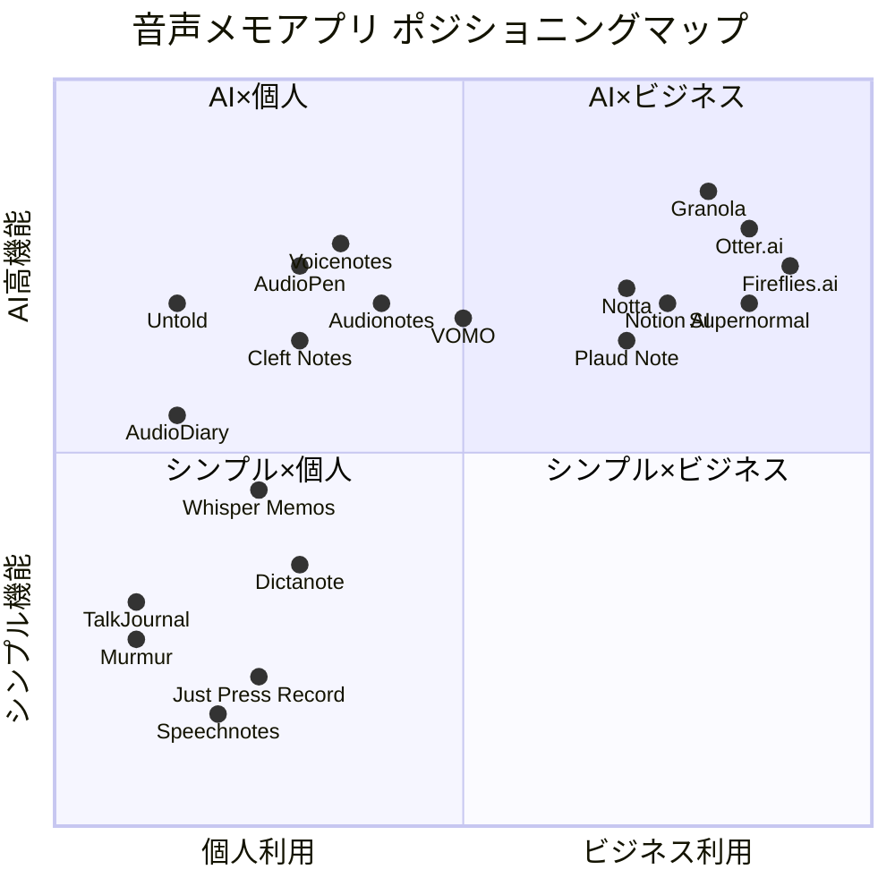
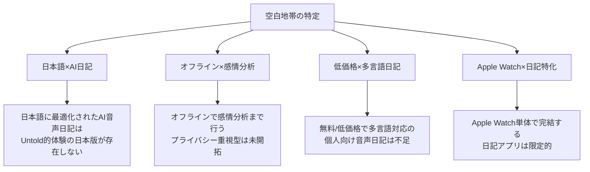

# 音声入力メモ・日記アプリ グローバル競合調査レポート

**調査日**: 2026-03-14
**調査対象**: 音声をテキストに変換して日記・メモとして活用するアプリ（単なるボイスレコーダーは除外）

---

## 目次

1. [カテゴリ1: AI音声メモ・ノートテイキングアプリ](#1-ai音声メモノートテイキングアプリ)
2. [カテゴリ2: 音声日記アプリ（Voice Diary系）](#2-音声日記アプリvoice-diary系)
3. [カテゴリ3: 音声入力メモアプリ（音声→テキスト変換メイン）](#3-音声入力メモアプリ音声テキスト変換メイン)
4. [カテゴリ4: AIを活用した音声アシスタント型メモアプリ](#4-aiを活用した音声アシスタント型メモアプリ)
5. [カテゴリ5: 日本市場特有のアプリ](#5-日本市場特有のアプリ)
6. [カテゴリ6: AIウェアラブル音声デバイス（新興カテゴリ）](#6-aiウェアラブル音声デバイス新興カテゴリ)
7. [競合マップ（ポジショニング）](#競合マップポジショニング)
8. [主要知見・示唆](#主要知見示唆)

---

## 1. AI音声メモ・ノートテイキングアプリ

### 1-1. Otter.ai

| 項目 | 詳細 |
|------|------|
| **URL** | https://otter.ai/ |
| **主要機能** | リアルタイム文字起こし、会議録音・要約、話者分離、AI検索、APIプラットフォーム |
| **差別化ポイント** | 独自開発のASRエンジン（サードパーティAPI非依存）、企業向けナレッジベース化 |
| **ビジネスモデル** | フリーミアム。Free（300分/月）、Pro（$8.33/月・年払い、1,200分）、Business（6,000分）、Enterprise |
| **ユーザー規模** | 2,500万ユーザー以上（2025年時点） |
| **ARR** | 約$100M（2025年3月、Sacra推計） |
| **評価** | App Store 4.5 / Google Play 4.3（推定） |
| **音声認識技術** | 独自開発ASRエンジン |
| **対応言語** | 4言語のみ（英語中心） |
| **創業年/本社** | 2016年 / カリフォルニア州マウンテンビュー |
| **注記** | 2025年8月にプライバシー関連の集団訴訟（Brewer v. Otter.ai）。言語サポートの少なさが弱点 |

---

### 1-2. Voicenotes

| 項目 | 詳細 |
|------|------|
| **URL** | https://voicenotes.com/ |
| **主要機能** | 音声メモ→テキスト変換、AI要約・リライト（ブログ・ツイート・To-Doリスト化）、「Ask my AI」自然言語検索、関連ノート自動提案 |
| **差別化ポイント** | Buy Me a Coffee創業者が開発。個人の「第二の脳」としてのポジショニング。100+言語対応 |
| **ビジネスモデル** | Free + $10/月（GPT-4 Turbo/Claude Opus利用可）。年額$99.99。Believer Plan $50（買い切り・限定） |
| **ユーザー規模** | 15万人以上のコミュニティ（2025年時点） |
| **評価** | Product Hunt高評価 |
| **音声認識技術** | OpenAI Whisper + GPT-4 Turbo / Claude Opus |
| **対応言語** | 100+言語 |
| **創業年/本社** | 2024年 / 米国 |
| **注記** | 月間訪問数21.5万（2025年6月、10.7%増加） |

---

### 1-3. Audionotes

| 項目 | 詳細 |
|------|------|
| **URL** | https://www.audionotes.app/ |
| **主要機能** | 音声/テキスト/画像/動画からノート生成、講義ノート・フラッシュカード自動生成、WhatsApp連携、YouTube動画からのノート作成 |
| **差別化ポイント** | 多入力対応（音声・画像・動画・YouTube）。話者認識。80+言語・自動言語検出。95%精度 |
| **ビジネスモデル** | フリーミアム。Lifetime $199（900分/月）。年額プラン35%割引あり |
| **ユーザー規模** | 非公開 |
| **評価** | App Store 4.7（推定） |
| **音声認識技術** | 独自AI（詳細非公開） |
| **対応言語** | 80+言語（自動検出） |
| **創業年/本社** | 非公開 / 運営: 1811 Labs |
| **注記** | Notion連携、Chrome拡張あり |

---

### 1-4. AudioPen

| 項目 | 詳細 |
|------|------|
| **URL** | https://audiopen.ai/ |
| **主要機能** | 音声→整形テキスト変換（「えーっと」等のフィラー自動除去）、複数ノートのSuper Summary、文体選択、翻訳 |
| **差別化ポイント** | 「考えたことをそのまま話すだけで、きれいな文章になる」体験。フィラー・冗長表現の自動削除が秀逸 |
| **ビジネスモデル** | Free（3分録音・10ノート制限）。Prime年額$99 or 2年$159。30日返金保証 |
| **ユーザー規模** | 非公開 |
| **評価** | TechCrunch等メディアで高評価 |
| **音声認識技術** | OpenAI API（Whisper + GPT） |
| **対応言語** | 多言語対応（OpenAI依存） |
| **創業年/本社** | 2023年 / 非公開 |
| **注記** | Web + Chrome拡張 + ネイティブモバイルアプリ |

---

### 1-5. Granola

| 項目 | 詳細 |
|------|------|
| **URL** | https://www.granola.so/ |
| **主要機能** | Bot不要の会議録音・文字起こし、ハイブリッドノートテイキング（人間+AI）、「Enhance Notes」機能、クロス会議AI検索 |
| **差別化ポイント** | Bot不要（システムオーディオ直接キャプチャ）でプライバシー重視。VC・起業家コミュニティで急速普及。90-92%精度（Otter超え） |
| **ビジネスモデル** | Free（25回）、Individual $18/月、Business $14/ユーザー/月、Enterprise $35~/ユーザー/月 |
| **ユーザー規模** | 急成長中（具体数非公開） |
| **評価** | G2 4.8/5 |
| **音声認識技術** | GPT-4o + Claude（マルチモデル） |
| **対応言語** | 多言語対応 |
| **創業年/本社** | 2023年 / 英国ロンドン |
| **注記** | Series B $43M調達、評価額$250M（2025年5月） |

---

### 1-6. VOMO AI

| 項目 | 詳細 |
|------|------|
| **URL** | https://vomo.ai/ |
| **主要機能** | 音声/動画の文字起こし、AI要約、キーポイント抽出、50+言語翻訳、99.9%精度 |
| **差別化ポイント** | 低価格（$1.92/週〜）でプロフェッショナル向け。Whisper + GPT-4 Turbo活用 |
| **ビジネスモデル** | Free（30分無料）、Pro $1.92/週〜 |
| **ユーザー規模** | 40,000人以上のプロフェッショナルユーザー |
| **評価** | App Store 4.7（推定） |
| **音声認識技術** | OpenAI Whisper + GPT-4 Turbo |
| **対応言語** | 50+言語 |
| **創業年/本社** | 非公開 |
| **注記** | iOS特化 |

---

### 1-7. Cleft Notes

| 項目 | 詳細 |
|------|------|
| **URL** | https://www.cleftnotes.com/ |
| **主要機能** | オンデバイス文字起こし、AI構造化ノート生成、Notion連携 |
| **差別化ポイント** | オンデバイス処理でプライバシー保護。Fast Company「25 Best New Apps」選出。ニューロダイバーシティ対応設計 |
| **ビジネスモデル** | Free（10分録音制限）、Plus年額$39（通常$89） |
| **ユーザー規模** | 10,000人以上 |
| **評価** | App Store高評価 |
| **音声認識技術** | オンデバイスWhisper |
| **対応言語** | 多言語対応 |
| **創業年/本社** | 2023-2024年 / 米国 |
| **注記** | 神経多様性を持つ創業者（Justin Mitchell, Jonathan Cosgrove） |

---

## 2. 音声日記アプリ（Voice Diary系）

### 2-1. Untold

| 項目 | 詳細 |
|------|------|
| **URL** | https://www.untoldapp.com/ |
| **主要機能** | 音声→テキスト日記、AIパーソナライズ質問、感情分析、人間関係トラッキング、月次レビュー、ストーリー生成 |
| **差別化ポイント** | 「書き返す声の日記」。Hume AI（感情AI）との連携。完全無料。エンドツーエンド暗号化 |
| **ビジネスモデル** | **完全無料**（ペイウォールなし） |
| **ユーザー規模** | 非公開（TikTokでバイラル） |
| **評価** | App Store 4.8（推定） |
| **音声認識技術** | Speech-to-Text AI（詳細非公開、Hume AI統合） |
| **対応言語** | 英語中心 |
| **創業年/本社** | 2023年 / カリフォルニア州リバモア |
| **注記** | iPhone専用。Android Coming Soon。Thoughts ACC, Inc.運営 |

---

### 2-2. AudioDiary

| 項目 | 詳細 |
|------|------|
| **URL** | https://audiodiary.ai/ |
| **主要機能** | 音声→テキスト日記変換、AIセラピスト機能（トレンド検知・目標設定）、自動タグ付け、感情分析 |
| **差別化ポイント** | セラピスト/友人/ライフコーチからトーンを選択可能。パターン検出による長期的な自己洞察 |
| **ビジネスモデル** | フリーミアム（Premiumで録音時間拡大・高度AI分析） |
| **ユーザー規模** | 非公開 |
| **評価** | App Store 4.7 / Google Play 4.5（推定） |
| **音声認識技術** | Deepgram（AI音声認識プラットフォーム） |
| **対応言語** | 多言語対応 |
| **創業年/本社** | 非公開 |
| **注記** | AWS暗号化保存。データ販売・共有なし |

---

### 2-3. Murmur（ひそひそ）

| 項目 | 詳細 |
|------|------|
| **URL** | https://play.google.com/store/apps/details?id=com.midnightplan.murmur |
| **主要機能** | 音声日記録音、Premium時の自動文字起こし、要約、キーワード・感情抽出 |
| **差別化ポイント** | 「文字に残せない日常の瞬間」をコンセプトにした感性的デザイン。日本語名「ひそひそ」で日本展開 |
| **ビジネスモデル** | フリーミアム（Premium: 文字起こし・要約・感情分析） |
| **ユーザー規模** | 非公開 |
| **評価** | Google Play 4.3（推定） |
| **音声認識技術** | 非公開 |
| **対応言語** | 多言語（日本語対応） |
| **創業年/本社** | 非公開 / Midnight Plan |
| **注記** | iOS/Android両対応 |

---

### 2-4. TalkJournal

| 項目 | 詳細 |
|------|------|
| **URL** | https://play.google.com/store/apps/details?id=app.talkjournal |
| **主要機能** | 音声→テキスト即時変換、オフライン音声認識、カレンダー表示、検索機能 |
| **差別化ポイント** | **完全オフライン処理**でプライバシー最優先。データはデバイス内完結。アカウント不要 |
| **ビジネスモデル** | Free（1エントリ）、Pro（無制限エントリ・高度検索・カレンダー） |
| **ユーザー規模** | 非公開 |
| **評価** | Google Play 4.2（推定） |
| **音声認識技術** | ネイティブ音声認識（オンデバイス） |
| **対応言語** | デバイス依存 |
| **創業年/本社** | 非公開 |
| **注記** | Android専用。完全プライバシー保護型 |

---

## 3. 音声入力メモアプリ（音声→テキスト変換メイン）

### 3-1. Whisper Memos

| 項目 | 詳細 |
|------|------|
| **URL** | https://whispermemos.com/ |
| **主要機能** | 音声録音→文字起こし→メール送信、Apple Watch対応、ロック画面ウィジェット、ランダムメモリー機能 |
| **差別化ポイント** | OpenAI Whisper直接活用。Apple Watch対応。文字起こしテキストをメールで受信するユニークなUX |
| **ビジネスモデル** | 無料試用 + 月額/年額サブスクリプション |
| **ユーザー規模** | 非公開 |
| **評価** | App Store 4.6（推定） |
| **音声認識技術** | OpenAI Whisper |
| **対応言語** | チェコ語、フランス語、ドイツ語、イタリア語、ポーランド語、スロバキア語、スペイン語、スウェーデン語等 |
| **創業年/本社** | 2023年頃 / 非公開 |
| **注記** | Apple専用（iPhone/iPad/Mac/Apple Watch/Vision Pro） |

---

### 3-2. Whisper Notes

| 項目 | 詳細 |
|------|------|
| **URL** | https://whispernotes.app/ |
| **主要機能** | オフラインWhisper文字起こし、音声メモ管理 |
| **差別化ポイント** | **買い切り$4.99**（サブスク不要）。完全オフライン処理 |
| **ビジネスモデル** | 買い切り $4.99（iOS + Mac） |
| **ユーザー規模** | 非公開 |
| **評価** | App Store 4.5（推定） |
| **音声認識技術** | OpenAI Whisper（オンデバイス） |
| **対応言語** | Whisper対応言語（90+言語） |
| **創業年/本社** | 非公開 |
| **注記** | サブスクリプション疲れのユーザーに人気 |

---

### 3-3. Just Press Record

| 項目 | 詳細 |
|------|------|
| **URL** | https://www.openplanetsoftware.com/just-press-record/ |
| **主要機能** | ワンタップ録音、オンデバイス文字起こし、Apple Watch対応、iCloud同期、Siri連携 |
| **差別化ポイント** | **買い切り$4.99**。オフライン文字起こし。Apple全デバイス統合（iPhone/iPad/Mac/Apple Watch） |
| **ビジネスモデル** | 買い切り $4.99 |
| **ユーザー規模** | 非公開 |
| **評価** | App Store 4.3 |
| **音声認識技術** | Apple Speech Framework（オンデバイス） |
| **対応言語** | 30+言語 |
| **創業年/本社** | 2015年 / Open Planet Software |
| **注記** | Apple Design Award受賞歴あり |

---

### 3-4. Dictanote

| 項目 | 詳細 |
|------|------|
| **URL** | https://dictanote.co/ |
| **主要機能** | 音声ディクテーション→ノート、AudioScribe AIアシスタント（文字起こし+句読点追加+フィラー除去）、カスタム音声コマンド |
| **差別化ポイント** | Chrome拡張「Voice In」との連動。カスタム音声コマンドで反復作業自動化。90%以上の認識精度 |
| **ビジネスモデル** | Free（時間無制限）+ Pro $5/月（年払い$60） |
| **ユーザー規模** | 100,000人以上 |
| **評価** | Chrome Web Store 4.4 |
| **音声認識技術** | Google Speech-to-Text API |
| **対応言語** | 50+言語 |
| **創業年/本社** | 非公開 / カリフォルニア州レッドウッドシティ |
| **注記** | Voice Inと同チーム開発 |

---

### 3-5. Speechnotes

| 項目 | 詳細 |
|------|------|
| **URL** | https://speechnotes.co/ |
| **主要機能** | ブラウザベース音声ディクテーション、句読点の音声コマンド、自動大文字化 |
| **差別化ポイント** | **完全無料**（広告付き）。インストール不要のWebアプリ。2015年からの長い実績 |
| **ビジネスモデル** | 無料（広告付き）/ 広告除去の有料版あり。文字起こしサービスは$0.1/分 |
| **ユーザー規模** | Androidアプリ 500万ダウンロード以上 |
| **評価** | Google Play 4.4 |
| **音声認識技術** | Google Speech-to-Text API |
| **対応言語** | 多言語対応 |
| **創業年/本社** | 2015年 / 非公開 |
| **注記** | Web版はChrome限定 |

---

### 3-6. Transkriptor

| 項目 | 詳細 |
|------|------|
| **URL** | https://transkriptor.com/ |
| **主要機能** | 音声/動画→テキスト変換、AI要約、話者分離、会議連携（Zoom/Teams/Meet） |
| **差別化ポイント** | 低価格で100+言語対応。音声メモ→整形文書（メール・ノート）変換機能 |
| **ビジネスモデル** | Free（30分/日）、Unlimited $19.99/月 |
| **ユーザー規模** | 非公開 |
| **評価** | G2 4.5 / Capterra 4.5 |
| **音声認識技術** | 独自AI + サードパーティAPI（詳細非公開） |
| **対応言語** | 100+言語 |
| **創業年/本社** | 非公開 |
| **注記** | Web/iOS/Android/Chrome拡張 |

---

## 4. AIを活用した音声アシスタント型メモアプリ

### 4-1. Notion（AI Meeting Notes）

| 項目 | 詳細 |
|------|------|
| **URL** | https://www.notion.com/ |
| **主要機能** | リアルタイム会議文字起こし、AI要約・アクションアイテム抽出、プロジェクトDB連携、双方向同期 |
| **差別化ポイント** | 既存のNotionワークスペースとの完全統合。会議ノートからプロジェクト管理まで一気通貫 |
| **ビジネスモデル** | Notion Plus以上のプランに含まれる（Plus $10/月〜） |
| **ユーザー規模** | Notion全体で1億ユーザー以上 |
| **評価** | App Store 4.6 |
| **音声認識技術** | 独自AI（詳細非公開） |
| **対応言語** | 英語、中国語、スペイン語、フランス語、ドイツ語、日本語、韓国語、ポルトガル語、ロシア語等16言語 |
| **創業年/本社** | 2013年 / サンフランシスコ |
| **注記** | 2025年5月にAI Meeting Notes機能ローンチ。現在Mac優先、モバイル展開予定 |

---

### 4-2. Fireflies.ai

| 項目 | 詳細 |
|------|------|
| **URL** | https://fireflies.ai/ |
| **主要機能** | 会議自動録音・文字起こし・要約、CRM/タスク管理連携（Salesforce/HubSpot/Notion/Slack）、AIアクションアイテム抽出 |
| **差別化ポイント** | 50万社以上が利用。豊富な外部連携。寛大な無料プラン |
| **ビジネスモデル** | Free、Pro $10/月（年払い）/ $18/月（月払い）、Business、Enterprise $39/月 |
| **ユーザー規模** | 500,000社以上 |
| **評価** | G2 4.5 |
| **音声認識技術** | 独自AI + サードパーティAPI |
| **対応言語** | 60+言語 |
| **創業年/本社** | 2016年 / 米国 |
| **注記** | 会議特化だが個人メモにも活用可能 |

---

### 4-3. Notta

| 項目 | 詳細 |
|------|------|
| **URL** | https://www.notta.ai/ |
| **主要機能** | 58言語文字起こし、42言語翻訳、会議Bot、AI要約、Notta Memo（物理デバイス） |
| **差別化ポイント** | **58言語対応で98.86%精度**。日本語に特化したASRエンジン。物理デバイス（Notta Memo）展開 |
| **ビジネスモデル** | Free（200分/月）、Pro $8.17/月（年払い）、Business、Enterprise |
| **ユーザー規模** | 800万ユーザー以上 |
| **評価** | G2 4.6 / Capterra 4.0 / Trustpilot 1.8 |
| **音声認識技術** | 言語別特化型AIエンジン（日本語専用エンジンあり） |
| **対応言語** | 58言語（文字起こし）+ 42言語（翻訳） |
| **創業年/本社** | 2019年 / 日本（Langogo Technology）→ グローバル展開 |
| **注記** | 2025年6月にNotta Memo（物理デバイス）発売。Trustpilot評価の低さに注意 |

---

### 4-4. Supernormal

| 項目 | 詳細 |
|------|------|
| **URL** | https://www.supernormal.com/ |
| **主要機能** | Google Meet対応自動議事録、GPT-4/4o活用の詳細要約、クロスミーティングメモリー（文脈引き継ぎ） |
| **差別化ポイント** | 同一参加者との複数会議の文脈を自動接続する「メモリー」機能 |
| **ビジネスモデル** | Free（無制限会議、1,000分ストレージ）、Pro $49/月 |
| **ユーザー規模** | 非公開 |
| **評価** | G2 4.5 |
| **音声認識技術** | GPT-4 / GPT-4o |
| **対応言語** | 60+言語 |
| **創業年/本社** | 非公開 / 米国 |
| **注記** | Google Meet特化 |

---

## 5. 日本市場特有のアプリ

### 5-1. Texter（テキスター）

| 項目 | 詳細 |
|------|------|
| **URL** | https://apps.apple.com/jp/app/texter/（App Store） |
| **主要機能** | リアルタイム音声文字起こし、画像/動画/PDF文字起こし、多言語対応、バックグラウンド文字起こし |
| **差別化ポイント** | 日本語特化の音声認識エンジン。画像・動画・PDFからも文字起こし可能な多機能性 |
| **ビジネスモデル** | Free（機能制限）、Premium M 月額1,500円、Premium Y 年額7,400円 |
| **ユーザー規模** | 非公開 |
| **評価** | App Store 4.5（推定） |
| **音声認識技術** | Apple Speech Framework + 独自AI |
| **対応言語** | iOSがサポートする全言語 |
| **創業年/本社** | 日本 |
| **注記** | iPad/Apple Watch連携対応 |

---

### 5-2. しゃべるメモ帳

| 項目 | 詳細 |
|------|------|
| **URL** | https://apps.apple.com/jp/app/しゃべるメモ帳/id1320861716 |
| **主要機能** | 音声録音→テキスト変換、リアルタイム文字起こし、テキスト読み上げ |
| **差別化ポイント** | シンプルなUI。日本語に最適化。メモ帳としての使いやすさ重視 |
| **ビジネスモデル** | 無料（広告付き）/ 有料版あり |
| **ユーザー規模** | 非公開 |
| **評価** | App Store 4.2（推定） |
| **音声認識技術** | Apple Speech Framework |
| **対応言語** | 日本語中心 |
| **創業年/本社** | 日本 |
| **注記** | iOS専用 |

---

### 5-3. 無限もじおこし

| 項目 | 詳細 |
|------|------|
| **URL** | https://apps.apple.com/jp/app/無限もじおこし/id6727009265 |
| **主要機能** | リアルタイム文字起こし、テキスト変換、議事録作成 |
| **差別化ポイント** | 無料でも月3回利用可能。日本語UIに完全対応 |
| **ビジネスモデル** | Free（月3回）、Premium（無制限） |
| **ユーザー規模** | 非公開 |
| **評価** | 非公開 |
| **音声認識技術** | 非公開 |
| **対応言語** | 日本語中心 |
| **創業年/本社** | 日本 |
| **注記** | 比較的新しいアプリ |

---

### 5-4. Notta（日本市場向け）

| 項目 | 詳細 |
|------|------|
| **URL** | https://www.notta.ai/ |
| **主要機能** | 日本語特化98.86%精度の文字起こし、2か国語同時文字起こし・翻訳、Notta Memo（物理デバイス） |
| **差別化ポイント** | **日本語専用ASRエンジン搭載**。日本語UIと日本語カスタマーサポート。物理デバイス展開（Notta Memo、2025年6月発売） |
| **ビジネスモデル** | Free（200分/月）、Pro $8.17/月（年払い） |
| **ユーザー規模** | グローバル800万人（うち日本市場は主要セグメント） |
| **評価** | App Store 4.5 |
| **音声認識技術** | 日本語特化型AIエンジン |
| **対応言語** | 58言語（日本語は最も精度が高い言語の一つ） |
| **創業年/本社** | 2019年 / Langogo Technology（元は日本発） |
| **注記** | 日本のビジネスユーザーに特に人気 |

---

## 6. AIウェアラブル音声デバイス（新興カテゴリ）

### 6-1. Plaud Note / Note Pro

| 項目 | 詳細 |
|------|------|
| **URL** | https://www.plaud.ai/ |
| **主要機能** | カード型録音デバイス + AI文字起こし・要約アプリ。112言語対応。30時間連続録音 |
| **差別化ポイント** | クレジットカードサイズの超小型デバイス。100万台以上出荷。50%以上がProサブスク契約 |
| **ビジネスモデル** | デバイス: Note $159 / Note Pro $179。Pro Plan $8.33/月（年$99）、Unlimited $239.99/年 |
| **ユーザー規模** | 100万台以上出荷 |
| **音声認識技術** | 独自AI + Whisper |
| **対応言語** | 112言語 |
| **創業年/本社** | 2022年頃 / 中国深圳 |

---

### 6-2. Omi AI

| 項目 | 詳細 |
|------|------|
| **URL** | https://www.omi.me/ |
| **主要機能** | 常時装着型AIアシスタント。会話録音・文字起こし・要約・タスク生成。オープンソースアプリ |
| **差別化ポイント** | **$89の低価格**。無料プラン（オンフォン文字起こし無制限）。オープンソースエコシステム。ローカルデータ保存 |
| **ビジネスモデル** | デバイス$89 + Free（無制限オンフォン）/ 1,200分クラウド無料/月 |
| **音声認識技術** | オンデバイスWhisper + クラウドAI |
| **対応言語** | 多言語 |
| **創業年/本社** | 2024年頃 |

---

### 6-3. Limitless AI Pendant（参考・サービス終了）

| 項目 | 詳細 |
|------|------|
| **URL** | https://www.limitless.ai/ |
| **主要機能** | 常時録音→文字起こし→AI要約・検索。「デジタルメモリー」コンセプト |
| **差別化ポイント** | Rewind AIからの進化。「人生を記録する」ビジョン |
| **ビジネスモデル** | デバイス$300 + サブスクリプション |
| **ユーザー規模** | 非公開 |
| **音声認識技術** | 独自AI |
| **創業年/本社** | 2023年（Rewindとして2020年） / 米国 |
| **注記** | **2025年12月にMetaが買収し、新規販売停止。実質サービス終了** |

---

## 競合マップ（ポジショニング）

---

## 主要知見・示唆

### 1. 市場トレンド

| トレンド | 内容 |
|---------|------|
| **プライバシー最優先化** | オンデバイス処理（Whisper on-device）への移行が加速。Cleft Notes, TalkJournal, Just Press Recordが先行 |
| **ウェアラブル化** | Plaud（100万台出荷）、Omi（$89低価格）が「常時録音→AI処理」を推進。MetaのLimitless買収、AmazonのBee買収で大手も参入 |
| **買い切りモデルの再評価** | サブスク疲れに対応し、Just Press Record（$4.99）、Whisper Notes（$4.99）、Audionotes Lifetime（$199）が支持獲得 |
| **感情AI統合** | Untold（Hume AI連携）、AudioDiary（セラピスト機能）が日記×感情分析領域を開拓 |
| **マルチモーダル入力** | Audionotes（音声+画像+動画+YouTube）がテキスト以外の入力も統合 |

### 2. 競合の空白地帯（参入機会）

### 3. 価格帯分析

| 価格帯 | アプリ例 | 特徴 |
|--------|---------|------|
| **完全無料** | Untold, Speechnotes, TalkJournal（基本） | ユーザー獲得重視、将来のマネタイズ模索中 |
| **買い切り $5以下** | Just Press Record, Whisper Notes | サブスク疲れ層に訴求 |
| **月額 $5-10** | Dictanote, Notta Pro, VOMO | 個人の日常利用向け |
| **月額 $10-20** | Voicenotes, Otter Pro, Granola | パワーユーザー/プロフェッショナル向け |
| **月額 $20+** | Sonix, Granola Business, Supernormal | チーム/企業向け |
| **Lifetime $50-200** | Voicenotes Believer, Audionotes Lifetime | 長期利用者・エバンジェリスト向け |

### 4. 技術スタック比較

| 音声認識技術 | 利用アプリ |
|-------------|-----------|
| **OpenAI Whisper** | Whisper Memos, Whisper Notes, AudioPen, VOMO, Cleft Notes, Omi |
| **独自ASRエンジン** | Otter.ai, Notta（言語別特化型） |
| **Google Speech-to-Text** | Dictanote, Speechnotes |
| **Apple Speech Framework** | Just Press Record, Texter, TalkJournal |
| **GPT-4 / Claude（後処理）** | Voicenotes, Granola, Supernormal, AudioPen |
| **Deepgram** | AudioDiary |
| **Hume AI（感情分析）** | Untold |

---

## 調査方法

- Web検索（2026年3月14日実施）
- 対象: App Store, Google Play, 各社公式サイト, TechCrunch, Product Hunt, G2, Capterra等のレビューサイト
- 価格情報は調査時点のものであり、変動の可能性あり

---

**調査対象アプリ数: 25アプリ + 3ウェアラブルデバイス = 計28プロダクト**
