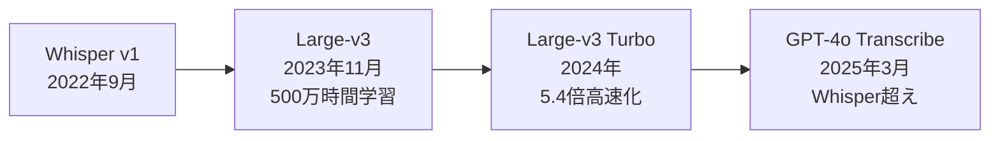
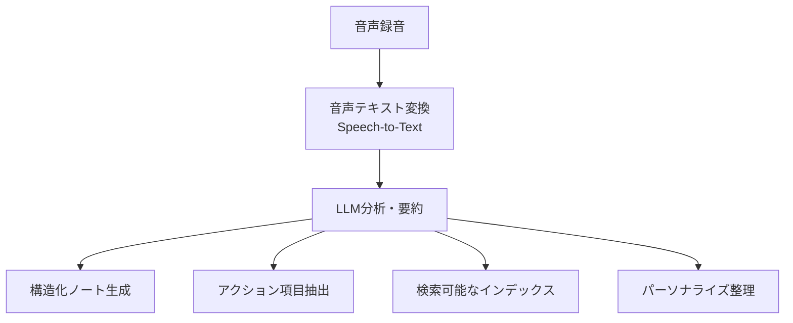
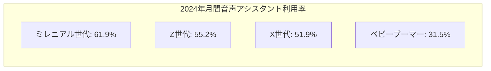
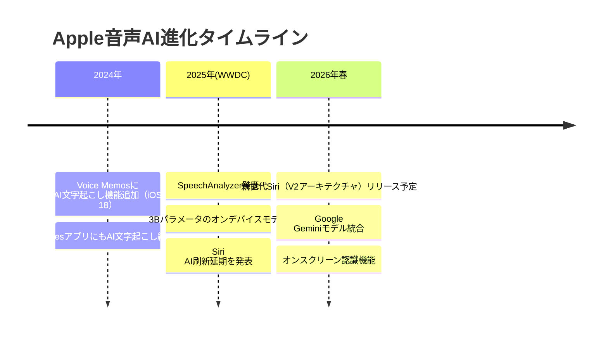
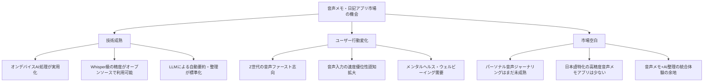

# 音声入力メモ・日記アプリ市場 最新トレンドと技術動向レポート

**調査日**: 2026-03-14
**調査範囲**: 2024-2030年の市場データ・技術動向

---

## 1. 市場規模と成長率

### 1.1 音声認識市場全体の規模（2024-2030予測）

| 調査会社 | 2024年 | 2025年 | 2030年 | CAGR |
|---|---|---|---|---|
| MarketsandMarkets | $84.9億 | $96.6億 | $231.1億 | 19.1% |
| Grand View Research | - | - | $536.7億 | 14.6% |
| Mordor Intelligence | - | $183.9億 | $517.2億 | 22.97% |
| Straits Research | $148億 | $173.3億 | $612.7億(2033) | 17.1% |

**主要な成長ドライバー**:
- ハンズフリー・直感的UIへのグローバルシフト
- スマートデバイスと音声アシスタントの日常化
- リモートワーク、デジタルバンキング、コネクテッドカーの普及
- アジア太平洋地域が最速成長（CAGR 20.4%）: 中国・インド・日本でのスマートフォン普及とAI推進政策

### 1.2 モバイルメモ・ノートアプリ市場の規模

| 年 | 市場規模 | 備考 |
|---|---|---|
| 2024年 | $79.1億~$95.4億 | 調査機関により幅あり |
| 2025年 | $111.1億 | CAGR 16.5%で成長 |
| 2032年 | $266.6億 | CAGR 16%予測 |
| 2035年 | $494.7億 | 長期予測 |

**成長要因**: AIの統合（インテリジェント整理、音声テキスト変換、コンテキスト認識サジェスト）

### 1.3 音声ジャーナリング/日記アプリのセグメント規模

| 年 | 市場規模 |
|---|---|
| 2024年 | $51億~$55.4億 |
| 2025年 | $56.9億~$60.7億 |
| 2033年 | $135.8億（CAGR 11.5%） |

**注目トレンド**: 音声操作・マルチモーダル・ジャーナリングプラットフォームが情報収集・アクセス方法を変革。メンタルヘルス・ウェルビーイング支援アプリへの需要増。

### 1.4 AIノートテイキング市場

- **2030年までに$113.2億**に到達見込み（CAGR 11.53%、2024-2030）
- 2026-2030年にかけてAIとデジタルプラットフォームの深い統合が進む

---

## 2. 技術トレンド

### 2.1 OpenAI Whisperの影響と普及状況

- **月間ダウンロード数**: 全バリアント合計で2025年12月に1,000万DL超
- **Hugging Face**: Large-v3モデルは2024年12月時点で月間409万DL
- **GitHub Stars**: 75,000超（openai/whisperリポジトリ）
- **GPT-4o Transcribe（2025年3月）**: Whisperを上回る低エラー率と言語認識精度を実現
- **競合出現**: OLMoASR（2025年）など、Whisper対抗のオープンソースASRモデルが登場
- **精度ベンチマーク**: 2026年レビューで98%精度を記録（Google、AWSと比較）

### 2.2 オンデバイスAI音声認識の進展

#### Apple（iOS 26 / WWDC 2025）
- **SpeechAnalyzer**クラスの導入
  - `SpeechTranscriber`: 音声テキスト変換
  - `SpeechDetector`: オーディオストリーム中の音声アクティビティ検出
- 新しいApple独自モデルがWhisper中位モデルと同等の速度・精度を実現
- **~3Bパラメータのオンデバイスモデル**: Apple Silicon最適化（KV-cacheシェアリング、2bit量子化学習）
- **マルチモーダル処理**: 視覚+言語+音声を5ms未満のレイテンシで同時処理

#### Google
- **Pixel Recorder**: 「Clear voice」機能開発中（背景ノイズ低減）
- 話者識別・言語検出機能搭載（18時間連続録音対応）
- **Pixel 10 Pro**: 音声タイピング精度が大幅向上

#### 共通トレンド
- 2023-2025年: 70+ TOPS NPU + 8-24GB統一メモリで4B+パラメータLLMがローカル実行可能に
- オンデバイス処理とパッシブ音声キャプチャが実用的かつ選好される方向に

### 2.3 LLMを活用した音声メモの要約・整理機能

**代表的な活用パターン**:

**主要プレイヤーの取り組み**:
- **Plaud AI**: 高度なLLMによる録音の完全・組織化された要約の統合
- **UMEVO**（2024年創業）: 音声をアクショナブルなインテリジェンスに変換
- **Otter.ai**: AIミーティングエージェントとして進化
- **read.ai**: ミーティングサマリー、トランスクリプト、AIノートテイカー

**今後の展望**:
- リアルタイム文字起こし/要約の高度化
- ユーザー嗜好を学習するパーソナライズドノートテイキング
- AI駆動の検索・整理機能の強化

### 2.4 リアルタイム文字起こし技術の進化

- Apple SpeechAnalyzerが長文会話音声のリアルタイム文字起こしを実現
- Samsung Galaxy: Speech-to-textモードで録音と同時に画面上テキスト変換
- Google Recorder: リアルタイム文字起こし+話者識別+翻訳
- AIノートテイカーがリアルタイム会議文字起こしを標準機能化

### 2.5 マルチモーダルAI（音声+テキスト+画像）

- Apple: 視覚+言語+音声を統合処理するファウンデーションモデル（<5msレイテンシ）
- ジャーナリングアプリ: 音声操作+マルチモーダルプラットフォームへの進化
- Obsidianとの連携（UMEVO）: 音声からナレッジグラフへの統合

---

## 3. ユーザー行動トレンド

### 3.1 音声入力の利用率の推移

| 指標 | 数値 |
|---|---|
| グローバル音声検索利用率 | 20.5%（2024年Q1の20.3%から微増） |
| 米国音声検索ユーザー数（2025年） | 1億5,350万人（前年比+2.5%） |
| モバイルでの音声検索利用率 | 27% |
| スマートフォン比率 | 全音声検索の56% |
| 日常的に音声検索するユーザー | 32% |

**音声入力の速度優位性**:
- 音声認識入力はタッチスクリーンキーボード入力の**2.93倍速い**
- 平均タイピング速度（40-50WPM）と比較して3-5倍効率的
- 90%のユーザーが音声検索はテキスト検索より「使いやすい」と回答
- 70%のユーザーが「速くて手間が少ない」ことを理由に音声検索を利用

### 3.2 Z世代・ミレニアル世代の音声アプリ利用傾向

| 世代 | 特徴 |
|---|---|
| **ミレニアル世代** | 週次利用34%で最多、Alexa（33%が過去1ヶ月利用）を選好 |
| **Z世代** | 2027年までに64%が月次利用予測（2023年51%から成長）、Siriを選好（Appleエコシステム親和性） |

**重要インサイト**:
- AIツール利用者のうち、Z世代の10人に1人以上が「音声統合」を最も重要な機能と回答（全世代で最高）
- 米国音声アシスタントユーザー数: 2024年1億4,910万人 → 2027年1億6,270万人予測

### 3.3 音声メモ vs 手入力メモのユーザー選好

- 2026年時点で、音声タイピングは多くのタスクで従来のタイピングより好まれる傾向
- 特にモバイルデバイスでの短いメッセージ・メモ作成で音声入力の優位性が顕著
- ただし、長文の編集・構造化されたドキュメント作成ではキーボード入力が依然として主流

---

## 4. 最近の資金調達・M&A

### 4.1 主要企業の資金調達状況

| 企業名 | 資金調達額 | 時期 | 備考 |
|---|---|---|---|
| **AssemblyAI** | 累計約$1.6億 | - | Y Combinator, Accel, Insight Partners等 |
| **Otter.ai** | 累計$7,300万 | 2021年まで | 2025年3月ARR $1億到達（2024年末$8,100万から成長） |
| **Fathom** | $1,700万（Series A） | 2024年9月 | AIノートテイカー |
| **Fireflies.ai** | 非公開 | - | 評価額$10億（ユニコーン） |
| **Plaud AI** | 非公開（外部調達記録なし） | - | 2024年11月時点で年間売上$1億（2年連続10倍成長） |

### 4.2 投資動向の特徴

- **VC投資家の注目**: Voice AIスタートアップへのグローバル投資が活発化
- **ブートストラップ型成功**: Plaud AIのように外部資金調達なしで急成長する企業も出現
- **インフラ企業への大型投資**: AssemblyAIなど音声AI基盤技術への投資が$1億超規模
- **大型M&Aは限定的**: 2024-2025年においてこの分野での目立った買収事例は確認されず

---

## 5. プラットフォーム動向

### 5.1 Apple（ボイスメモ、ジャーナル、Siri）の進化

**新世代Siri（2026年春予定）の主要機能**:
- LLMベースの完全刷新（V2アーキテクチャ）
- パーソナルコンテキスト認識の強化
- セマンティック理解の改善
- Apple全アプリ・サービスとの深い統合
- **オンスクリーン認識**: 現在表示中の内容を理解して行動
- Google Geminiモデルによる要約・マルチステップタスク計画

**延期の背景**: V1ベースシステムがUX・信頼性基準を満たさず、中間リリースではなく完全再構築を選択

### 5.2 Google（Recorder、Keep）の戦略

| 機能 | 詳細 |
|---|---|
| **Recorder「Clear voice」** | 録音中の背景ノイズ低減（開発中） |
| **話者識別** | 音声中の異なる話者を自動識別・ラベリング |
| **言語検出** | 文字起こし精度向上のための自動言語検出 |
| **長時間録音** | 最大18時間の連続録音セッション対応 |
| **Pixel 10 Pro** | 音声タイピング精度の大幅向上 |
| **Gemini統合** | Appleとの提携でSiriにGeminiモデル提供 |

**制限事項**: Google Recorderは引き続きPixel専用（Pixel 2以降）

### 5.3 Samsung等Android OEMの取り組み

| 機能 | 詳細 |
|---|---|
| **Galaxy AI連携** | Voice RecorderアプリにGalaxy AIを統合 |
| **録音モード** | Standard / Interview / Speech-to-text の3モード |
| **リアルタイム文字起こし** | Speech-to-textモードで録音と同時にテキスト変換 |
| **AI要約** | 録音のAI生成サマリー（Google Pixelとの差別化ポイント） |
| **翻訳機能** | 録音の翻訳対応 |

**Galaxy S24 vs Pixel比較**: Samsungは「AI生成要約」で直接的に優位性を発揮

---

## 6. 総括と示唆

### 市場機会

### 重要な示唆

1. **市場は急成長中**: 音声認識市場（CAGR 14-23%）、ノートアプリ市場（CAGR 16.5%）、ジャーナルアプリ市場（CAGR 11.5%）いずれも二桁成長
2. **技術的転換点**: オンデバイスAIが実用水準に到達（Apple SpeechAnalyzer、70+ TOPS NPU）。Whisperの精度がコモディティ化
3. **Apple Siri刷新が転機**: 2026年春のLLMベースSiriリリースがエコシステム全体に波及。Voice Memos/NotesのAI強化も進行中
4. **Samsung・GoogleもAI音声に注力**: 三大プラットフォームが揃って音声AI機能を強化中
5. **Z世代が音声ファースト世代**: 2027年には64%が月次利用。Appleエコシステム親和性が高い
6. **ブートストラップ型成功モデル**: Plaud AIのように外部資金なしでARR $1億到達の事例あり
7. **差別化ポイント**: パーソナライズ、マルチモーダル統合、メンタルヘルス連携が次の競争軸

---

## Sources

### 市場規模
- [MarketsandMarkets - Speech and Voice Recognition Industry worth $23.11 billion by 2030](https://www.marketsandmarkets.com/PressReleases/speech-voice-recognition.asp)
- [Grand View Research - Voice And Speech Recognition Market To Reach $53.67Bn By 2030](https://www.grandviewresearch.com/press-release/global-voice-recognition-industry)
- [Mordor Intelligence - Voice Recognition Market Size, Trends 2025-2030](https://www.mordorintelligence.com/industry-reports/voice-recognition-market)
- [Straits Research - Voice and Speech Recognition Market Size to 2033](https://straitsresearch.com/report/voice-and-speech-recognition-market)
- [Verified Market Research - Note Taking App Market Size](https://www.verifiedmarketresearch.com/product/note-taking-app-market/)
- [Business Research Company - Note Taking App Market Report 2026](https://www.thebusinessresearchcompany.com/report/note-taking-app-global-market-report)
- [Future Market Insights - Digital Journal Apps Market Size 2025-2035](https://www.futuremarketinsights.com/reports/digital-journal-apps-market)
- [Straits Research - Digital Journal Apps Market Size to 2033](https://straitsresearch.com/report/digital-journal-apps-market)

### 技術トレンド
- [OpenAI - Introducing Whisper](https://openai.com/index/whisper/)
- [OpenAI - Introducing next-generation audio models in the API](https://openai.com/index/introducing-our-next-generation-audio-models/)
- [Quantumrun Foresight - Whisper Statistics](https://www.quantumrun.com/consulting/whisper-statistics/)
- [DIY AI - OpenAI Whisper Review 2026 98% Accuracy Benchmarks](https://diyai.io/ai-tools/speech-to-text/reviews/openai-whisper-review/)
- [Callstack - On-Device Speech Transcription with Apple SpeechAnalyzer](https://www.callstack.com/blog/on-device-speech-transcription-with-apple-speechanalyzer)
- [Apple ML Research - Foundation Models 2025 Updates](https://machinelearning.apple.com/research/apple-foundation-models-2025-updates)
- [MarkTechPost - OLMoASR vs OpenAI Whisper](https://www.marktechpost.com/2025/09/04/what-is-olmoasr-and-how-does-it-compare-to-openais-whisper-in-speech-recognition/)

### ユーザー行動
- [eMarketer - Data Drop Gen Z Leading Voice Assistant Growth](https://www.emarketer.com/content/data-drop-gen-z-leading-voice-assistant-growth)
- [GWI - 4 Voice Search Trends For 2025](https://www.gwi.com/blog/voice-search-trends)
- [DemandSage - 51 Voice Search Statistics 2025](https://www.demandsage.com/voice-search-statistics/)
- [Yaguara - 62 Voice Search Statistics 2026](https://www.yaguara.co/voice-search-statistics/)
- [SixthCity Marketing - 60+ Voice Search Statistics for 2026](https://www.sixthcitymarketing.com/voice-search-stats/)

### 資金調達・M&A
- [Crunchbase - Otter.ai Company Profile](https://www.crunchbase.com/organization/aisense-inc)
- [Sacra - Otter revenue, funding & news](https://sacra.com/c/otter/)
- [TechCrunch - AI notetaker Fathom raises $17M](https://techcrunch.com/2024/09/19/ai-notetaker-fathom-raises-17m/)
- [Crunchbase News - Why Big Investors Are All Ears For Voice AI Startups](https://news.crunchbase.com/venture/voice-ai-startups-global-investment/)
- [36Kr - Plaud AI $100M ARR](https://eu.36kr.com/en/p/3315175009200386)

### プラットフォーム動向
- [CNBC - Apple delays Siri AI improvements to 2026](https://www.cnbc.com/2025/03/07/apple-delays-siri-ai-improvements-to-2026.html)
- [Bloomberg - Apple Targets Spring 2026 for Delayed Siri AI Upgrade](https://www.bloomberg.com/news/articles/2025-06-12/apple-targets-spring-2026-for-release-of-delayed-siri-ai-upgrade)
- [WebProNews - Apple Siri Gets Major AI Overhaul with LLMs in Spring 2026](https://www.webpronews.com/apples-siri-gets-major-ai-overhaul-with-llms-in-spring-2026/)
- [MacDailyNews - Apple Voice Memos Notes AI transcription](https://macdailynews.com/2024/05/14/apples-voice-memos-notes-and-other-apps-said-to-gain-ai-transcription-capability/)
- [Android Central - Google Recorder Clear Voice Feature](https://www.androidcentral.com/apps-software/google-recorder-app-clear-voice-feature-spotted)
- [Tom's Guide - Samsung Galaxy S24 vs Google Pixel Voice Recorder](https://www.tomsguide.com/phones/android-phones/samsung-galaxy-s24-vs-google-pixel-voice-recorder-app-showdown-whos-got-the-better-ai-features)
- [Samsung Support - Voice Recorder with Galaxy AI](https://www.samsung.com/us/support/answer/ANS10000942/)
- [Android Authority - Pixel 10 Pro Voice Typing](https://www.androidauthority.com/pixel-10-pro-new-voice-typing-3608473/)
