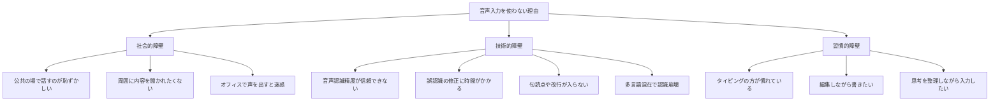
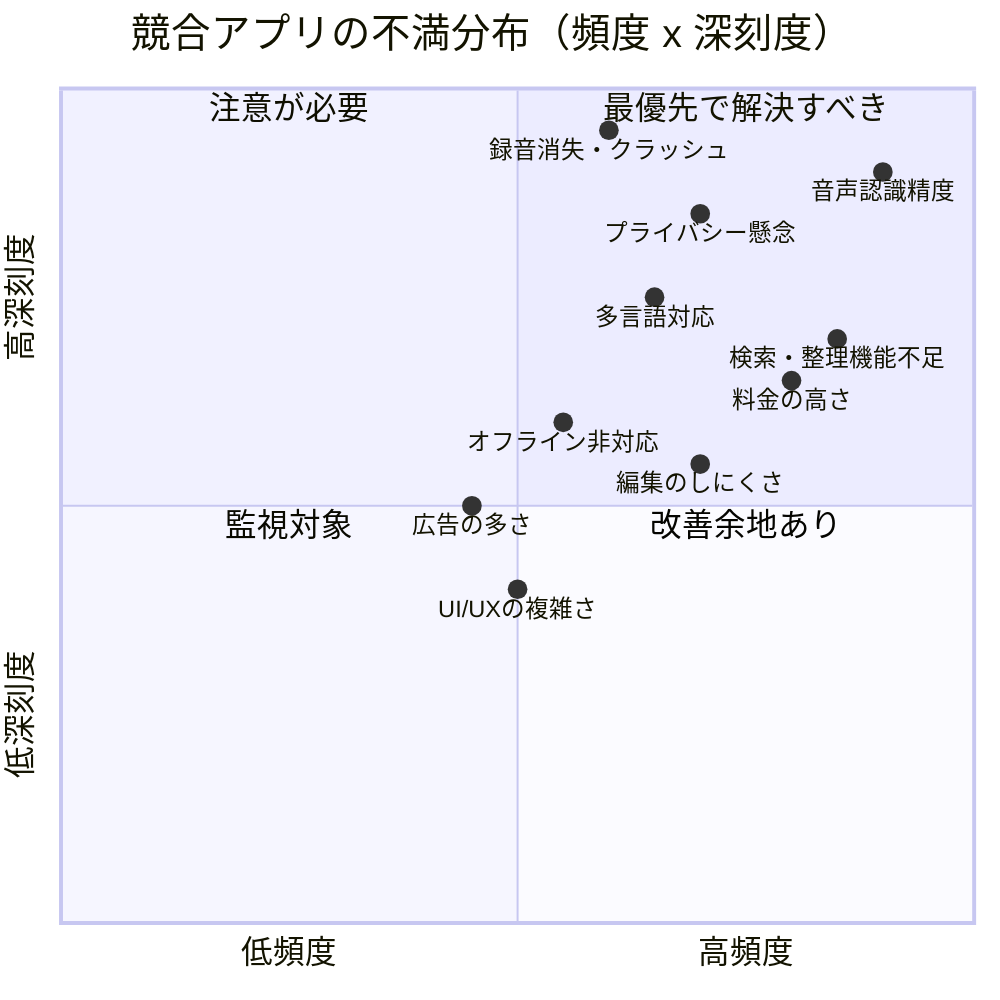

# 音声メモ・音声日記アプリ ユーザー不満点・未充足ニーズ調査レポート

調査日: 2026-03-14
調査方法: Web検索によるApp Store/Google Playレビュー、Reddit、Product Hunt、フォーラム等の意見収集

---

## 1. 主要アプリ別 不満・課題まとめ

### 1.1 Apple ボイスメモ

| カテゴリ | 不満内容 |
|---------|---------|
| 録音消失 | 30分以上の録音が数秒しか残らない、録音が完全に消える |
| アプリ安定性 | 起動時にブランクスクリーンが1分程度続き、その後クラッシュ |
| ストレージ | 録音を全削除してもストレージ容量が解放されない |
| 文字起こし | 単一テキストブロックで出力され、段落分け・書式設定なし |
| 多言語対応 | 端末の言語設定と録音言語が異なると意味不明な文字起こしになる |
| 整理機能 | アルファベット順ソート不可、タグ付け不可 |
| 編集 | トリム時にコンテンツが失われるリスク |
| CarPlay | CarPlayに非対応（運転中のメモ取りができない） |
| iPad連携 | スマートカバーのオートスリープ時に録音が中止される |

### 1.2 Otter.ai

| カテゴリ | 不満内容 |
|---------|---------|
| 認識精度 | アクセント・専門用語・複数話者で精度低下（背景ノイズで60-70%まで低下） |
| 話者識別 | 話者が区別できず「Speaker 1, 2」のまま、要約やアクションアイテムも不正確に |
| プライバシー | 2025年8月に集団訴訟（同意なく会話を録音・転送） |
| 不招請参加 | ボットが招待されていない会議に参加、全参加者に議事録を自動送信 |
| 課金問題 | キャンセルしても請求が続く、解約手続きが分かりにくい |
| サポート | カスタマーサポートの応答が極めて遅い、無回答のケースも |
| 接続依存 | 安定したインターネット接続が必須 |

### 1.3 Just Press Record

| カテゴリ | 不満内容 |
|---------|---------|
| Apple Watch同期 | 録音がWatch上で再生できない（音量最大でも無音） |
| 自動削除 | 1週間経過後にWatch上の録音が自動削除される |
| AirPods競合 | AirPods Pro 3で音楽再生中はWatch録音不可（純正Voice Memosは可能） |
| 整理機能 | 組織化ツールの改善が必要との指摘 |

### 1.4 Day One Journal

| カテゴリ | 不満内容 |
|---------|---------|
| UI変更 | 音声録音が三点メニュー内に移動し、毎回2クリック追加が必要 |
| プラットフォーム差 | 音声メモはAppleのみ、Android/Web/Windowsでは利用不可 |
| 文字起こし制限 | 10分までのみ対応、インターネット接続必須 |

### 1.5 Google Keep

| カテゴリ | 不満内容 |
|---------|---------|
| 録音長制限 | 短いメモ・リマインダー用途のみ対応、少しの沈黙で録音終了と判断 |
| 認識精度 | 誤認識による文脈変化、句読点・書式設定なし |
| 環境依存 | 騒音のない環境でないと精度が出ない |
| オフライン | 強力なインターネット接続がないと正確な処理不可 |
| 言語対応 | 全言語非対応、アクセントによる精度低下 |
| 音質 | Keep固有の音声品質問題（こもった音声） |

### 1.6 Notion（音声入力関連）

| カテゴリ | 不満内容 |
|---------|---------|
| ブラウザ制限 | ブラウザではマイク入力のみ、システム音声キャプチャ不可 |
| ヘッドフォン | イヤフォン使用時に音声がキャプチャされない |
| 料金 | AI Meeting Notesがビジネスプラン（$20/月/人）のみに制限 |
| 対面会議 | モバイルアプリでのオフライン会話録音機能なし |
| 話者識別 | 話者ラベルなし、全員の発言が1ブロックのテキストに |
| 利用制限 | 1日10時間の利用上限 |

---

## 2. カテゴリ別 頻出不満・未充足ニーズ

### 2.1 音声認識精度（特に日本語）

**深刻度: 最高**

- Apple Voice Memosの文字起こしは端末の言語設定に依存し、録音言語を個別に指定できない
- 日本語の文字起こしは特に精度が低く、「存在しない単語を生成する」レベル
- 背景ノイズがある環境では精度が60-70%まで低下（Otter.ai）
- 専門用語・固有名詞の誤認識が頻発
- OpenAI Whisperも1時間超の日本語音声でドロップアウトが発生
- ElevenLabsのScribeがFLEURSベンチマークでWER 3.1%と最高精度だが、一般アプリには未実装

**ユーザーの声:**
> 「文字起こしが単語を完全に変え、意味不明な文を生成し、存在しない単語まで作り出す」

### 2.2 テキスト変換後の編集のしにくさ

**深刻度: 高**

- 文字起こしが段落分けなし・句読点なしの塊テキストで出力される
- 話者ラベルがない（誰が何を言ったか不明）
- トリム操作でコンテンツが失われるリスク
- 一括編集やフォーマット調整の機能が不十分
- エクスポート形式の選択肢が限られている

### 2.3 検索性・整理機能の不足

**深刻度: 高**

- 2時間の講義録音から特定箇所を見つけるのが「苦痛」
- アルファベット順ソート不可、タグ付け不可（Apple Voice Memos）
- 録音コレクションが増えると管理が困難に
- 「5秒の命名が5分の検索を節約する」が、自動分類がない
- iOS 18で「Lecture」「Meeting」等の自動ラベルが追加されたが、まだ不十分

**ユーザーの声:**
> 「整理なしでは、それらの思考は録音されなかったのと同じ」

### 2.4 プライバシー懸念

**深刻度: 高**

- 世界の45%のスマートスピーカーユーザーが音声データプライバシーを懸念
- 42%が音声データのハッキングを懸念
- Otter.aiの集団訴訟（同意なき録音・転送）がユーザー不信を加速
- 音声データはバイオメトリック情報として多くの法域で保護対象
- クラウド送信型の文字起こしは機密情報漏洩リスク
- 一部AIベンダーがユーザーデータを第三者広告主に転売

**音声固有のリスク:**
- 声紋（生体認証情報）の流出
- バックグラウンドの会話の意図しない録音
- 感情状態の推定データの漏洩

### 2.5 料金の高さ・サブスクリプション疲れ

**深刻度: 高**

- 主要アプリのサブスクリプション料金:
  - Otter.ai: 月額$16.99〜
  - Notion Business: 月額$20/人
  - 一般的な音声メモアプリ: 月額$9.99、年額$24.99
  - Owll: 週$7.99（年$50+）
- 「保存するだけでサブスクリプションが必要」への強い反発
- 無料プランから有料への移行時の機能制限が厳しい
- 買い切りアプリ（Whisper Notes $4.99、Auto Memo Recorder $1.99）への需要増

**ユーザーの声:**
> 「同じことをするアプリが他にたくさんあるのに、なぜこんなに高いのか」

### 2.6 オフライン対応

**深刻度: 中〜高**

- 大半のAI文字起こしアプリはクラウド処理のためインターネット接続必須
- Google Keepは接続が不安定だと文字起こしの精度が大幅低下
- オフライン録音→後で同期は可能なアプリもあるが、リアルタイム文字起こしは不可
- オンデバイスWhisperモデルによるオフライン文字起こしへの需要増
- Whisper Notesなどオフライン完結型アプリが登場し始めている

### 2.7 多言語対応

**深刻度: 中〜高**

- Apple Voice Memosの文字起こし言語を録音ごとに切り替えられない
- バイリンガルユーザーが言語を切り替えながら話すと認識崩壊
- 言語自動検出機能を持つアプリが少ない（SpeakAppは20言語対応・自動検出あり）
- 中国語で録音→英語設定で文字起こし→意味不明のテキスト
- iOS表示言語を変更しないと文字起こし言語が変わらない仕様への不満

---

## 3. 「ステータス・クオ」分析

### 3.1 音声メモアプリを使わない人の代替手段

| 代替手段 | 利用シーン | メリット | デメリット |
|---------|----------|---------|----------|
| キーボード入力 | デスクワーク、公共の場 | 正確、編集容易、静かに入力可 | 速度が遅い（モバイル40 WPM vs 音声150 WPM） |
| 手書きメモ | 会議、ブレスト | 思考の自由度、図の描画可 | 検索不可、デジタル化に手間 |
| 写真撮影 | ホワイトボード、資料 | 瞬時にキャプチャ、情報量大 | テキスト検索不可、整理困難 |
| 自分宛メール | 移動中 | すぐ送れる、検索可能 | ワークフローが断片化 |
| 自分宛ボイスメール | 運転中 | ハンズフリー | 文字起こしなし、聞き返しが面倒 |
| テキストメッセージ | 移動中 | 手軽、既存アプリ活用 | メモ専用でないため整理困難 |

### 3.2 音声入力を使わない主な理由

### 3.3 音声メモが特に求められるシーン（既存手段では不十分な場面）

1. **運転中**: CarPlay非対応が大きな障壁、ボイスメール等のワークアラウンドを強いられる
2. **歩行・ジョギング中**: 手が使えない状況でのアイデアキャプチャ
3. **寝起き・就寝前**: ベッドで横になりながらの日記・思考整理
4. **料理・家事中**: 両手がふさがっている状態
5. **感情的な瞬間**: タイピングより声の方が感情を伝えやすい
6. **長文の思考整理**: 150 WPM vs 40 WPMの速度差は大きい

---

## 4. ユーザーが求める「理想の音声メモアプリ」像

### 4.1 最優先で求められている機能

| 優先度 | 機能 | 根拠 |
|-------|------|------|
| 1 | 高精度な多言語文字起こし（特に日本語） | 最多の不満カテゴリ、既存アプリ全てに共通する課題 |
| 2 | オフライン完結での録音・文字起こし | プライバシー懸念+接続環境不安定への対応 |
| 3 | 自動整理・タグ付け・検索 | 「録音したのに見つけられない」問題 |
| 4 | 買い切りまたは低価格プラン | サブスクリプション疲れへの対応 |
| 5 | 録音の信頼性（消失・クラッシュなし） | 基本品質への不信 |

### 4.2 差別化に繋がる可能性のある機能

| 機能 | 詳細 |
|------|------|
| 言語自動検出 | 録音ごと・文中での言語切り替えに自動対応 |
| 話者識別 | 会議メモでの「誰が何を言ったか」の自動識別 |
| AI要約・構造化 | 長い録音からの要約、ToDoリスト自動抽出 |
| CarPlay/Android Auto対応 | 運転中のハンズフリーメモ |
| 感情・トーン分析 | 音声日記での気分トラッキング |
| Notion/Obsidian連携 | 既存ナレッジベースとの統合 |
| BYOK（自分のAPIキー持ち込み） | コスト削減とプライバシー確保の両立 |
| テンプレート・プロンプト | 日記・会議・アイデア等のシーン別テンプレート |

---

## 5. 競合アプリの不満マッピング

---

## 6. まとめと示唆

### 最も大きな市場機会

1. **日本語を含む多言語に強い、オフライン対応の文字起こし**: 既存アプリの最大の弱点であり、オンデバイスWhisperモデルの進化により技術的に実現可能になりつつある
2. **プライバシーファーストの設計**: Otter.aiの訴訟問題を契機に、ローカル処理・E2E暗号化への需要が急増
3. **適正価格モデル**: サブスクリプション疲れに対応した買い切り or フリーミアム+低額サブスク
4. **「録音して終わり」からの脱却**: 自動整理・検索・AI要約による「録音後の価値化」

### 既存アプリが解決できていない根本課題

> **「音声でキャプチャしたアイデアや情報を、テキストと同等以上に検索・整理・活用できるようにする」**

現状の音声メモアプリは「録音」に強いが「活用」に弱い。録音後のワークフロー（文字起こし→編集→整理→検索→共有→他ツール連携）にペインポイントが集中している。

---

## Sources

- [Apple Voice Memos Reviews (2025)](https://justuseapp.com/en/app/1069512134/voice-memos/reviews)
- [Otter.ai Reviews - Trustpilot](https://www.trustpilot.com/review/otter.ai)
- [Otter AI Review - Honest Pros and Cons (2026)](https://tldv.io/blog/otter-ai-review/)
- [Otter.ai Class Action Lawsuit (2025)](https://www.workplaceprivacyreport.com/2025/08/articles/artificial-intelligence/ai-notetaking-tools-under-fire-lessons-from-the-otter-ai-class-action-complaint/)
- [Just Press Record - App Store](https://apps.apple.com/us/app/just-press-record/id1033342465)
- [Just Press Record Reviews - AppHunter](https://appshunter.io/ios/app/1033342465/reviews)
- [Day One Audio Recording Issues - Forums](https://forums.dayoneapp.com/forums/topic/they-made-audio-recordings-more-tedious/)
- [Google Keep Voice Recording Limitations](https://support.google.com/docs/thread/200604130/recording-longer-memos-with-keep)
- [Notion AI Meeting Notes](https://www.notion.com/help/ai-meeting-notes)
- [Voice Memo Transcription Language Issues - Apple Community](https://discussions.apple.com/thread/256051102)
- [Voicenotes Reviews - Product Hunt](https://www.producthunt.com/products/voicenotes/reviews)
- [Speech to Note Reviews - Product Hunt](https://www.producthunt.com/products/speech-to-note/reviews)
- [Voice Privacy Concerns - WeLiveSecurity](https://www.welivesecurity.com/en/privacy/favorite-speech-to-text-app-privacy-risk/)
- [Ethical AI Voice Transcription](https://voicetonotes.ai/blog/ethical-ai-voice-transcription/)
- [Voice Memo Organization - Apple Community](https://discussions.apple.com/thread/254334767)
- [CarPlay Voice Memo Gap - Disquiet](https://disquiet.com/2025/03/04/carplay-app-voice-memo-iphone/)
- [Whisper Notes - Offline Transcription](https://whispernotes.app/)
- [Best Voice to Notes Apps (2026)](https://voicetonotes.ai/blog/best-voice-to-notes-app/)
- [Best Voice Journal Apps (2025)](https://journalinginsights.com/best-voice-journal-app/)
- [Guide to Voice Journaling - Reflection.app](https://www.reflection.app/blog/guide-to-voice-journaling)
