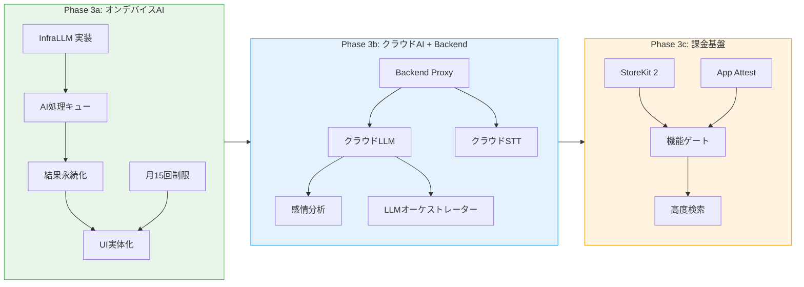
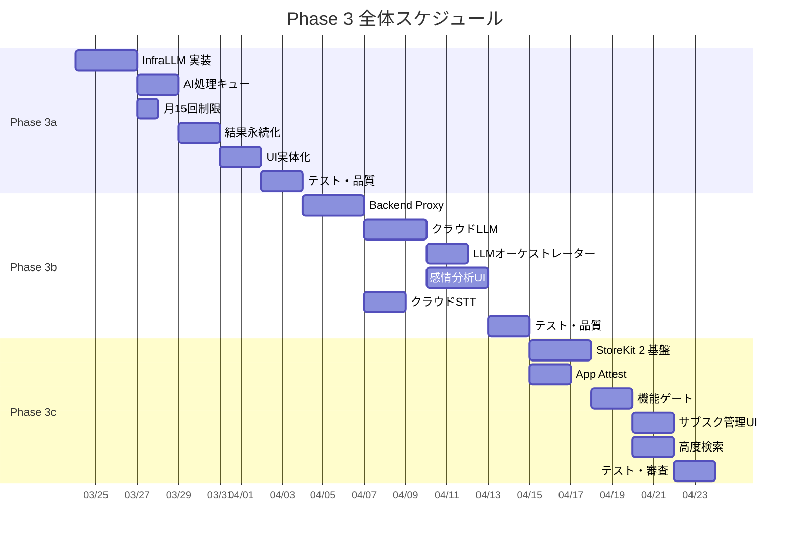

# Phase 3 全体ロードマップ

> **文書ID**: ROADMAP-PHASE3-001
> **バージョン**: 1.0
> **作成日**: 2026-03-21
> **ステータス**: ドラフト

---

## 1. Phase 3 概要

Phase 3 は MurMurNote の核となる「AI が自動で整理・要約する」機能を段階的に実装するフェーズである。Backend 不要のオンデバイス処理から始め、クラウド AI、課金と段階的にスコープを拡大する。

### 1.1 分割方針

| サブフェーズ | 名称 | スコープ | Backend 依存 |
|:------------|:-----|:---------|:------------|
| **Phase 3a** | オンデバイス AI | オンデバイス LLM による要約・タグ生成、月15回制限管理、AI 処理キュー、UI 実体化 | 不要 |
| **Phase 3b** | クラウド AI + Backend | Backend Proxy 構築、クラウド LLM 統合、感情分析、高精度 STT（Pro） | 必要 |
| **Phase 3c** | 課金基盤 | StoreKit 2 サブスクリプション、App Attest、Pro/Free 機能ゲート | 必要 |

### 1.2 分割の根拠

1. **リスク分離**: オンデバイス AI は端末のみで完結するため、Backend のインフラ構築リスクと分離できる
2. **価値の早期検証**: Backend なしでも AI 要約・タグ付けのコア体験を検証できる（ドッグフーディング）
3. **段階的な複雑性の導入**: 認証・課金・外部 API 依存を後半に集約し、前半の技術的負債を最小化する

---

## 2. Phase 3a: オンデバイス AI 処理

### 2.1 スコープ

| 項目 | 内容 |
|:-----|:-----|
| **対象要件** | REQ-003（AI 要約）、REQ-004（タグ自動付与）、REQ-011（月15回制限）、REQ-021（オンデバイス LLM） |
| **対象ストーリー** | US-301, US-302, US-307, US-501（部分） |
| **LLM エンジン** | Apple Intelligence Foundation Models API（iOS 26+）、llama.cpp Phi-3-mini（フォールバック） |
| **処理内容** | 要約生成（3行以内）、キーポイント抽出（最大5件）、タグ提案（最大3件） |
| **スキップ** | 感情分析（クラウド LLM 必須 -> Phase 3b） |

### 2.2 成果物

- オンデバイス LLM プロバイダ実装（InfraLLM モジュール）
- AI 処理キュー実装（バックグラウンド処理対応）
- 月15回制限のローカルカウント管理
- AI 処理結果の SwiftData 永続化
- メモ詳細画面の AI 要約・タグ表示の実体化
- FeatureAI Reducer 実装

### 2.3 マイルストーン

| マイルストーン | 完了条件 | 推定日数 |
|:-------------|:---------|:--------|
| M1: LLM 基盤 | InfraLLM にオンデバイス LLM プロバイダが実装され、テキスト入力に対して JSON 形式のレスポンスを返す | 3日 |
| M2: AI 処理キュー | 録音完了後に AI 処理がキューイングされ、バックグラウンドで実行される | 2日 |
| M3: 結果永続化 | AI 処理結果（要約・タグ）が SwiftData に保存され、メモ詳細画面で表示される | 2日 |
| M4: 月次制限 | 無料プランの月15回制限が機能し、到達時にアップグレード案内が表示される | 1日 |
| M5: UI 実体化 | メモ詳細画面の AI 要約カード・タグ・ステータスインジケータが実データで動作する | 2日 |
| M6: テスト・品質 | 全テスト pass、TCA TestStore によるインテグレーションテスト完了 | 2日 |

**Phase 3a 推定期間: 12日（実作業日）**

---

## 3. Phase 3b: クラウド AI + Backend Proxy

### 3.1 スコープ

| 項目 | 内容 |
|:-----|:-----|
| **対象要件** | REQ-005（感情分析）、REQ-010（Backend Proxy）、REQ-018（クラウド高精度 STT）、REQ-022（感情時系列可視化） |
| **対象ストーリー** | US-303, US-304, US-305, US-308 |
| **依存** | Phase 3a 完了（AI 処理キュー・UI 基盤の再利用） |

### 3.2 成果物

- Backend Proxy（Cloudflare Workers）の構築・デプロイ
- クラウド LLM プロバイダ実装（GPT-4o mini 経由）
- 感情分析の統合プロンプト対応
- 感情分析結果の SwiftData 永続化
- 感情推移の時系列可視化 UI
- オンデバイス / クラウドの判定ロジック（LLM オーケストレーター）
- クラウド高精度 STT の統合（Pro プラン用）
- 認証トークン管理（Keychain）
- ネットワークエラー時のフォールバック UI

### 3.3 マイルストーン

| マイルストーン | 完了条件 | 推定日数 |
|:-------------|:---------|:--------|
| M1: Backend Proxy | Cloudflare Workers がデプロイされ、認証付きでリクエストを中継する | 3日 |
| M2: クラウド LLM | 統合プロンプトで要約+タグ+感情分析が返却され、結果が永続化される | 3日 |
| M3: LLM オーケストレーター | テキスト長・デバイス能力・ネットワーク状態に基づく最適なプロバイダ選択が機能する | 2日 |
| M4: 感情分析 UI | 感情バッジ・レーダーチャート・時系列グラフが実データで動作する | 3日 |
| M5: クラウド STT | Pro プラン用のクラウド高精度 STT が統合され、オンデバイス STT との切替が機能する | 2日 |
| M6: テスト・品質 | E2E テスト（録音 -> クラウド AI -> 結果表示）完了 | 2日 |

**Phase 3b 推定期間: 15日（実作業日）**

---

## 4. Phase 3c: 課金基盤（StoreKit 2 + App Attest）

### 4.1 スコープ

| 項目 | 内容 |
|:-----|:-----|
| **対象要件** | REQ-024（アプリ内課金）、REQ-012（Pro プラン無制限）、REQ-019（高度検索・フィルタリング） |
| **対象ストーリー** | US-501（完全版）, US-502, US-503, US-504, US-505 |
| **依存** | Phase 3b 完了（クラウド AI + Pro 機能の全機能が揃った状態で課金ゲートを適用） |

### 4.2 成果物

- StoreKit 2 サブスクリプション実装（月額/年額）
- App Attest による不正利用防止
- Pro / Free 機能ゲートの全画面適用
- サブスクリプション管理 UI（FeatureSubscription の実体化）
- サブスクリプション有効期限切れ時のグレースフル・デグラデーション
- App Store Connect 設定・審査対応
- 高度検索・フィルタリング（Pro 機能）

### 4.3 マイルストーン

| マイルストーン | 完了条件 | 推定日数 |
|:-------------|:---------|:--------|
| M1: StoreKit 2 基盤 | Product 定義、購入フロー、Transaction 検証が動作する | 3日 |
| M2: App Attest | Backend Proxy でアテステーション検証が機能する | 2日 |
| M3: 機能ゲート | Pro / Free の機能制限が全画面に適用される | 2日 |
| M4: サブスク管理 UI | 購入・復元・解約導線が完成する | 2日 |
| M5: 高度検索 | タグ・日付範囲フィルタリングが Pro ユーザーに提供される | 2日 |
| M6: テスト・審査 | Sandbox テスト完了、App Store 審査提出準備 | 2日 |

**Phase 3c 推定期間: 13日（実作業日）**

---

## 5. 依存関係

### 5.1 フェーズ間の依存

| 依存元 | 依存先 | 依存内容 |
|:-------|:-------|:---------|
| Phase 3b | Phase 3a | AI 処理キュー基盤、SwiftData 永続化スキーマ、UI コンポーネント |
| Phase 3b | Phase 3a | `LLMProviderProtocol` の抽象化（Phase 3a で定義、Phase 3b で拡張） |
| Phase 3c | Phase 3b | クラウド AI 機能（Pro 機能ゲートの対象）、Backend Proxy（App Attest 検証先） |
| Phase 3c | Phase 3a | 月15回制限ロジック（課金ステータスに応じた制限解除） |

### 5.2 並行作業の可能性

- Phase 3b の Backend Proxy 構築は Phase 3a の iOS 実装と **一部並行可能**（API 仕様を先に確定する前提）
- Phase 3c の StoreKit 2 基盤調査は Phase 3b 中に **先行着手可能**

---

## 6. 全体スケジュール

| フェーズ | 開始予定 | 完了予定 | 期間 |
|:---------|:---------|:---------|:-----|
| Phase 3a | 2026-03-24 | 2026-04-08 | 12日 |
| Phase 3b | 2026-04-09 | 2026-04-29 | 15日 |
| Phase 3c | 2026-04-30 | 2026-05-16 | 13日 |
| **Phase 3 合計** | **2026-03-24** | **2026-05-16** | **40日** |

---

## 7. リスクと対策

| リスク | 影響度 | 発生確率 | 対策 |
|:-------|:------|:---------|:-----|
| Apple Intelligence Foundation Models API が iOS 26 正式版で自由プロンプト未対応のまま | 中 | 高 | llama.cpp フォールバックを一次候補として先に実装。Apple Intelligence は `@Generable` 構造化出力の補助利用に限定 |
| llama.cpp Phi-3-mini の日本語品質が実用水準に達しない | 高 | 中 | プロンプトチューニングで対応。改善しない場合は Gemma-2 9B や Qwen2.5 等の代替モデルを検証 |
| オンデバイス LLM のメモリ使用量が iPhone 15（6GB）で問題を起こす | 高 | 低 | STT モデルをアンロード後に LLM を起動するメモリ排他制御を実装。メモリ不足時はクラウドフォールバック |
| Backend Proxy の Cloudflare Workers の Cold Start が許容範囲を超える | 中 | 低 | Workers のウォームアップ設定、または Durable Objects の活用を検討 |
| StoreKit 2 の App Store 審査で課金フローがリジェクトされる | 中 | 低 | Apple の審査ガイドラインに厳密に準拠。Sandbox で十分にテスト |

---

## 8. 技術的判断の記録

### 8.1 Apple Intelligence Foundation Models API の採用方針

2026年3月時点で、Apple Intelligence Foundation Models は `@Generable` マクロ経由の構造化出力にのみ対応しており、サードパーティアプリからの自由なプロンプト実行（`session.respond(to: prompt)`）は公開されていない。

**判断**: llama.cpp (Phi-3-mini Q4_K_M) を一次候補とし、Apple Intelligence は将来的な補助利用（構造化出力によるタイトル生成等）に留める。iOS 26 正式版リリース時に API の拡張を再評価する。

### 8.2 感情分析の Phase 3b 先送り

設計書（02-ai-pipeline.md セクション3.2.2）により、オンデバイス LLM の対応タスクは「要約」と「タグ付け」のみであり、感情分析はクラウド LLM でのみ実行可能と定義されている。

**判断**: 感情分析は Backend Proxy + クラウド LLM が必要なため Phase 3b に先送り。Phase 3a では `EmotionAnalysisEntity` のスキーマは維持するが、データ投入は行わない。

### 8.3 月15回制限のローカル管理

Phase 3a では Backend が存在しないため、月15回制限はローカル（SwiftData）で管理する。Phase 3b で Backend Proxy にサーバーサイド検証を追加し、クライアント側の改竄耐性を強化する。

**判断**: Phase 3a ではローカルカウントのみ。SwiftData の `AIProcessingTask` テーブルの `completedAt` で月次集計。Phase 3b でサーバーサイド検証を追加。
