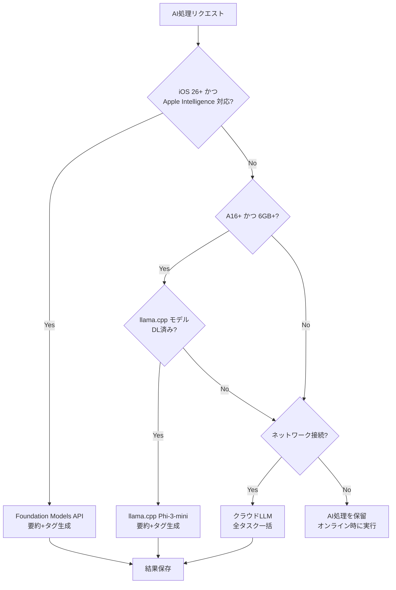
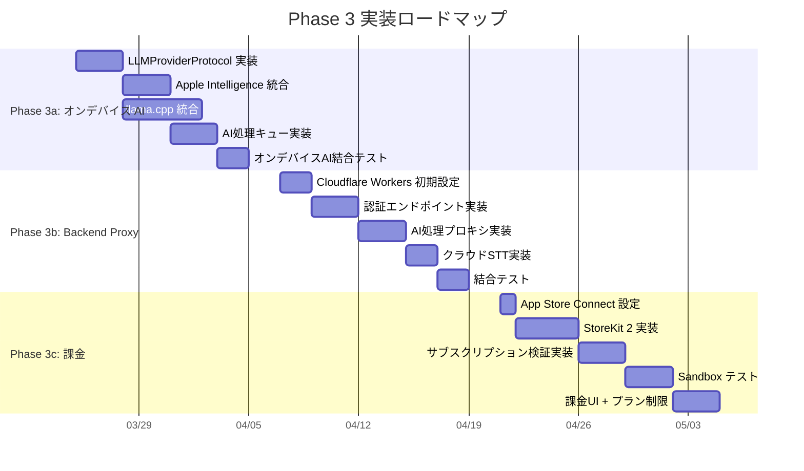

# Phase 3 技術調査レポート

> **作成日**: 2026-03-21
> **関連設計書**: DES-002 (AI Pipeline), DES-003 (Backend Proxy), SEC-DESIGN-001 (Security)
> **ステータス**: 完了

---

## 1. Backend Proxy の技術選定

### 1.1 現行設計書の前提

設計書 DES-003 では **Cloudflare Workers + Hono (TypeScript)** を前提としており、以下が既に詳細設計済み。

- API設計（7エンドポイント）
- 認証フロー（Apple Sign In + デバイストークン + App Attest）
- サブスクリプション検証（App Store Server API v2）
- KV / D1 によるデータストア設計
- コスト見積もり（MVP: $5/月）
- wrangler.toml 設定例

### 1.2 候補比較

| 観点 | Cloudflare Workers (Hono/TS) | Swift Vapor | Node.js (Hono) on Cloud Run | Python FastAPI | Go (Chi) |
|:-----|:----------------------------|:------------|:---------------------------|:---------------|:---------|
| **学習コスト（Swift開発者にとって）** | 中（TS は Swift と型システムが類似） | 低（Swift ネイティブ） | 中 | 高 | 高 |
| **App Attest 検証** | 可能（WebCrypto API で ECDSA 検証） | 可能（Apple 公式ライブラリあり） | 可能 | 可能 | 可能 |
| **コールドスタート** | なし（エッジ実行） | 2-5秒（Cloud Run）/ なし（Fly.io） | 1-3秒（Cloud Run） | 3-8秒 | 0.5-1秒 |
| **月額コスト（MVP）** | **$5**（Workers Paid Plan） | $7-15（Fly.io / Cloud Run） | $5-10（Cloud Run） | $5-10 | $5-10 |
| **エコシステム** | KV / D1 / R2 統合 | 自前 DB 要 | 自前 DB 要 | 自前 DB 要 | 自前 DB 要 |
| **デプロイ容易性** | `wrangler deploy` 一発 | Docker ビルド必要 | Docker ビルド必要 | Docker ビルド必要 | Docker ビルド必要 |
| **OpenAI API プロキシ** | fetch API で容易 | AsyncHTTPClient | fetch / node-fetch | httpx | net/http |
| **JWT / 暗号処理** | WebCrypto + jose ライブラリ | SwiftJWT / CryptoKit | jose ライブラリ | PyJWT | golang-jwt |
| **設計書との整合性** | **完全一致** | 再設計必要 | 高い互換性 | 再設計必要 | 再設計必要 |

### 1.3 決定事項

**Cloudflare Workers + Hono (TypeScript) を採用する。設計書 DES-003 の方針を維持。**

### 1.4 理由

1. **設計書との完全な整合性**: DES-003 で API 設計、DB スキーマ、認証フロー、コスト見積もりまで詳細に設計済み。Cloudflare Workers 以外を選ぶと設計書の大部分を書き直す必要がある。これは Phase 3 の開発速度を著しく低下させる。

2. **エッジ実行によるコールドスタートなし**: AI 処理は数秒かかるが、プロキシ層自体のレイテンシは最小化すべき。Cloudflare Workers はリクエスト到着時に即座に実行開始する。

3. **統合データストア**: KV（使用量カウント、キャッシュ）+ D1（ユーザー情報、購読状態）+ Secrets（APIキー管理）が単一プラットフォームで完結する。外部 DB（Supabase, PlanetScale 等）を追加構成する必要がない。

4. **圧倒的なコスト効率**: MVP $5/月。成長期でも $16/月。個人開発では最重要の判断基準。

5. **TypeScript の親和性**: Swift 開発者にとって TypeScript の型安全性は馴染みやすい。Hono フレームワークは Express/Koa 系の知識も不要で、非常に軽量。型推論が効くため実装ミスが減る。

6. **App Attest 検証の実現性**: Cloudflare Workers の WebCrypto API で ECDSA-P256 署名検証、CBOR デコード（cbor-x パッケージ）が可能。設計書に擬似コードが既にある。

### 1.5 リスク

| リスク | 影響 | 緩和策 |
|:-------|:-----|:-------|
| Workers CPU time 制限（Paid: 30ms） | App Attest assertion 検証で 7-11ms 消費し、余裕が少ない | Option C（assertion 結果を KV に 5分キャッシュ）で対応。設計書セクション 8.7 に記載済み |
| KV の結果整合性 | 無料プランの月次カウントが 1-2 回超過する可能性 | MVP では許容。DAU 500 超で D1 トランザクション方式に移行（設計書セクション 5.5 に移行パスあり） |
| TypeScript 保守負荷 | iOS 開発者が TS コードを保守する必要 | Hono のシンプルさで軽減。Worker コード量は推定 1,000-1,500 行程度 |
| Cloudflare ベンダーロック | KV/D1 は Cloudflare 固有 | API 設計は REST 標準のため、ロジック移植は容易。DB 層のみ差し替えが必要 |

### 1.6 Swift Vapor を不採用とした理由

Swift 開発者にとって Vapor は魅力的だが、以下の理由で不採用とした。

1. **設計書の書き直しコスト**: DES-003 の擬似コード（TypeScript, 約 500 行）、DB スキーマ（D1 SQL）、ミドルウェア設計の全てを Swift に移植する必要がある
2. **ホスティングコスト**: Vapor は常駐サーバー型。Fly.io ($7/月〜) または Cloud Run ($5/月〜 + コールドスタート 2-5 秒)。Cloudflare Workers の $5/月 + エッジ実行に劣る
3. **D1 相当の DB**: Vapor では PostgreSQL (Supabase Free Tier or Neon) を別途構成する必要があり、運用複雑性が増す
4. **App Attest**: Vapor 用の App Attest 検証ライブラリは公式にはなく、自前実装が必要

### 1.7 次のアクション

1. Cloudflare アカウント作成 + Workers Paid Plan ($5/月) 契約
2. `repository/backend/` に Hono プロジェクトを初期化 (`npm create hono@latest`)
3. D1 データベース作成 + マイグレーション実行（設計書セクション 8.3 の SQL をそのまま使用）
4. `/health` エンドポイント + `/api/v1/auth/device`（MVP 匿名認証）から実装開始
5. Secrets 設定: `OPENAI_API_KEY`, `JWT_PRIVATE_KEY` 等

---

## 2. オンデバイス LLM 戦略

### 2.1 現行設計書の前提

設計書 DES-002 では以下の戦略が既に定義されている。

- **一次候補**: llama.cpp + Phi-3-mini Q4_K_M（自由プロンプト実行可能）
- **将来候補**: Apple Intelligence Foundation Models（`@Generable` マクロ経由の構造化出力のみ）
- **オンデバイスで対応可能なタスク**: 要約 + タグのみ（500 文字以下）
- **感情分析**: クラウド LLM 必須（オンデバイスでは非対応）

### 2.2 Apple Intelligence Foundation Models API の現状評価

#### 2.2.1 API 概要（iOS 26+ / WWDC 2025 発表）

Apple の Foundation Models フレームワークは以下の機能を提供する。

| 機能 | 対応状況 | 備考 |
|:-----|:---------|:-----|
| `LanguageModelSession` | 対応 | テキスト生成セッション |
| `@Generable` マクロ | 対応 | Swift 構造体への構造化出力 |
| 自由プロンプト（`respond(to:)`) | **対応（iOS 26+）** | テキスト入力 → テキスト出力の自由プロンプト実行が可能 |
| ストリーミング応答 | 対応 | `respondStreaming(to:)` |
| Tool Calling | 対応 | `@Generable` + Tool プロトコル |
| ガードレール | 自動適用 | 不適切コンテンツのフィルタリング |
| オフライン動作 | 対応 | 完全オンデバイス |
| 対応デバイス | Apple Intelligence 対応端末 | iPhone 15 Pro 以降（A17 Pro+, 8GB RAM+） |
| 対応 OS | iOS 26+ / macOS 26+ | 2025 年秋リリース |
| モデルダウンロード | 不要 | OS に組み込み |
| 日本語対応 | **対応（iOS 26 から）** | Apple Intelligence の日本語サポートは iOS 26 で追加 |

#### 2.2.2 Foundation Models の利点

1. **モデルダウンロード不要**: OS 組み込みのため、2GB のモデルダウンロード問題が完全に解消される
2. **メモリ効率**: OS レベルで最適化されており、アプリのメモリ使用量への影響が最小
3. **Neural Engine 最適化**: Apple Silicon に完全最適化された推論パフォーマンス
4. **プライバシー保証**: Apple の Privacy by Design に基づく処理。データがデバイスから出ない
5. **自由プロンプト対応**: `session.respond(to: prompt)` で自由なテキスト生成が可能（設計書の記述は iOS 26 beta 初期段階の情報であり、正式リリースでは自由プロンプトも利用可能）
6. **構造化出力**: `@Generable` マクロで Swift 構造体に直接マッピング可能。JSON パース不要

#### 2.2.3 Foundation Models の制限・リスク

| 制限 | 詳細 |
|:-----|:-----|
| 対応デバイス | iPhone 15 Pro 以降（A17 Pro+）のみ。iPhone 15 / 14 Pro は非対応 |
| OS バージョン | iOS 26+ 必須。アプリの最低サポート iOS 17 とのギャップが大きい |
| モデル能力 | Apple の on-device モデルは約 3B パラメータ推定。Phi-3-mini (3.8B) と同等以下の可能性 |
| 日本語品質 | iOS 26 での日本語品質は未知数。英語に比べて品質が劣る可能性 |
| ガードレール | Apple のコンテンツフィルタが過度に適用される可能性（日記の感情的な内容がブロックされるリスク） |
| API 安定性 | iOS 26 は 2026 年 9 月リリース想定。Phase 3 開発中に API が変更される可能性 |
| テスト環境 | Simulator での動作は限定的。実機テストが必要 |

### 2.3 llama.cpp + Phi-3-mini の評価

| 項目 | 評価 |
|:-----|:-----|
| **メリット** | |
| 自由プロンプト | 完全対応。任意のプロンプト設計が可能 |
| 日本語品質 | Phi-3-mini は日本語で実用的な品質（WER ベンチマーク上） |
| 対応デバイス | A16 Bionic 以降 + 6GB RAM（iPhone 14 Pro, 15 全モデル, 16 全モデル） |
| iOS バージョン | iOS 17+ で動作 |
| カスタマイズ性 | プロンプト、温度、トークン数等を自由に制御 |
| **デメリット** | |
| モデルダウンロード | **約 2GB のダウンロードが必要**。初回起動体験を大きく損なう |
| メモリ使用量 | ~2.5GB。他アプリとの競合でメモリプレッシャーが発生する可能性 |
| バッテリー消費 | 5 分録音の処理で約 2% のバッテリー消費 |
| メンテナンス | llama.cpp の Swift バインディング更新への追従が必要 |
| アプリサイズ | モデルファイルはバンドルに含めず Library/Caches/ にダウンロード |

### 2.4 モデルダウンロード問題の回避策

| 方式 | 説明 | 評価 |
|:-----|:-----|:-----|
| **A: 初回起動時にバックグラウンド DL** | Wi-Fi 接続時に自動ダウンロード。DL 完了まではクラウド LLM を使用 | DL 前に AI 処理を使いたいユーザーがクラウド消費してしまう |
| **B: 設定画面で手動 DL** | ユーザーが明示的にダウンロード開始 | AI 機能の発見性が低下 |
| **C: Apple Intelligence 優先** | iOS 26+ Apple Intelligence 対応端末では DL 不要。非対応端末のみ llama.cpp DL | **推奨**。対象端末が増えるほど DL 問題が減少 |
| **D: 小型モデル (Phi-2, 1.3B)** | モデルサイズを ~800MB に削減 | 日本語品質が実用レベルに達しない可能性 |
| **E: クラウドのみ（オンデバイス非対応）** | Phase 3 ではクラウド LLM のみ。オンデバイスは Phase 4 | 最も開発リスクが低いが、オフライン体験が損なわれる |

### 2.5 決定事項: ハイブリッド段階的導入

```
Phase 3a（オンデバイス AI）:
  1. Apple Intelligence Foundation Models を第一優先（iOS 26+ 対応端末）
  2. llama.cpp (Phi-3-mini) をフォールバック（iOS 17+ 非 AI 対応端末）
  3. 両方非対応の場合はクラウド LLM にフォールバック

Phase 3b（Backend Proxy + クラウド AI）:
  4. クラウド LLM (GPT-4o-mini) で全タスク（要約 + タグ + 感情分析）
```

#### 選択フロー



### 2.6 理由

1. **Apple Intelligence 優先のメリット**: モデルダウンロード不要、メモリ効率最適、Apple 推奨パス。iOS 26+ 対応端末ではユーザー体験が最も良い
2. **llama.cpp フォールバックの必要性**: iOS 17-25 ユーザー、および Apple Intelligence 非対応の iPhone 15/14 Pro をカバーするために必要
3. **段階的導入**: Phase 3a ではオンデバイスの要約 + タグのみ。感情分析はクラウド必須のため Phase 3b で実装。リスクを分散できる
4. **設計書との整合性**: DES-002 の `OnDeviceLLMStrategy` enum と `selectOnDeviceStrategy()` がこの戦略に対応している

### 2.7 リスク

| リスク | 影響 | 緩和策 |
|:-------|:-----|:-------|
| Apple Intelligence の日本語品質が不十分 | 要約・タグの品質低下 | llama.cpp へのフォールバック + 品質メトリクス監視。ユーザー設定で手動切替を許可 |
| iOS 26 正式リリースまでの API 変更 | Foundation Models API の破壊的変更 | `LLMProviderProtocol` による抽象化で影響を局所化。beta 期間中は llama.cpp をデフォルトに |
| llama.cpp 2GB DL の UX 問題 | 初回 AI 処理までの待ち時間 | Wi-Fi 時バックグラウンド DL + DL 完了までクラウドフォールバック |
| 2 つの LLM 実装の保守コスト | テスト・デバッグが複雑化 | `LLMProviderProtocol` の統一テストスイート。TestStore による TCA テスト |
| Apple のガードレールによる誤ブロック | 感情的な日記テキストがフィルタリングされる | ガードレール検出時のエラーハンドリング + llama.cpp フォールバック |

### 2.8 次のアクション

1. **iOS 26 beta 入手次第**: Foundation Models API の日本語要約品質を実機で評価
2. **llama.cpp Swift バインディング選定**: `swift-llama.cpp`（Argmax 製）vs llama.cpp C API 直接ブリッジの比較
3. **Phi-3-mini モデルのホスティング先決定**: Hugging Face Hub / GitHub Releases / 自前 CDN
4. **`@Generable` マクロ対応の Swift 構造体設計**: `LLMSummaryResult` / `LLMTagResult` の `@Generable` 準拠
5. **品質ベンチマーク設計**: Apple Intelligence vs llama.cpp の日本語要約品質比較テスト

---

## 3. StoreKit 2 + App Store Connect 準備

### 3.1 サブスクリプション商品構成（設計書準拠）

| プロダクト ID | プラン | 価格 | 期間 | App Store 手数料 |
|:-------------|:-------|:-----|:-----|:----------------|
| `io.murmurnote.pro.monthly` | Pro 月額 | 500 円 | 1 か月 | 15%（Small Business Program） |
| `io.murmurnote.pro.yearly` | Pro 年額 | 4,800 円 | 1 年 | 15%（Small Business Program） |

### 3.2 StoreKit 2 実装の主要コンポーネント

#### 3.2.1 商品取得と表示

```swift
// Product.products(for:) で商品情報を取得
let productIds: Set<String> = [
    "io.murmurnote.pro.monthly",
    "io.murmurnote.pro.yearly"
]
let products = try await Product.products(for: productIds)
```

- `Product` 構造体から価格、説明、サブスクリプション期間を取得
- `SubscriptionStoreView`（iOS 17+）を使うと Apple 標準の課金 UI を簡単に表示可能
- カスタム UI を構築する場合は `Product.SubscriptionInfo` からプラン詳細を取得

#### 3.2.2 購入処理

```swift
// appAccountToken でユーザー ID を紐付け（設計書 Critical #5 準拠）
let appAccountToken = UUID(uuidString: generateAppAccountToken(userId))!
let result = try await product.purchase(options: [
    .appAccountToken(appAccountToken)
])

switch result {
case .success(let verification):
    let transaction = try checkVerified(verification)
    // Backend Proxy に JWS を送信して検証
    await verifyWithBackend(transaction.jwsRepresentation)
    await transaction.finish()
case .userCancelled:
    break
case .pending:
    // Ask to Buy 等の承認待ち
    break
}
```

#### 3.2.3 トランザクション監視

```swift
// アプリ起動時に Transaction.updates を監視
func observeTransactionUpdates() -> Task<Void, Never> {
    Task.detached {
        for await result in Transaction.updates {
            guard let transaction = try? result.payloadValue else { continue }
            await self.handleTransaction(transaction)
            await transaction.finish()
        }
    }
}
```

#### 3.2.4 購読状態の確認

```swift
// Product.SubscriptionInfo.Status で現在のサブスクリプション状態を取得
let statuses = try await product.subscription?.status ?? []
for status in statuses {
    switch status.state {
    case .subscribed:     // アクティブ
    case .expired:        // 期限切れ
    case .inBillingRetryPeriod:  // 請求リトライ中
    case .inGracePeriod:  // 猶予期間（EC-015）
    case .revoked:        // 返金
    default: break
    }
}
```

### 3.3 App Store Connect での商品登録手順

1. **App Store Connect にログイン** → アプリを作成（Bundle ID: `io.murmurnote.app` 等）

2. **サブスクリプショングループ作成**:
   - 「サブスクリプション」タブ → 「サブスクリプショングループ」を作成
   - グループ名: `MurMurNote Pro`
   - グループ ID の記録（StoreKit Configuration File で使用）

3. **サブスクリプション商品の追加**:
   - 月額プラン: Product ID = `io.murmurnote.pro.monthly`, 参照名 = "Pro Monthly"
     - 価格: Tier 3 (500 円) を選択
     - サブスクリプション期間: 1 か月
   - 年額プラン: Product ID = `io.murmurnote.pro.yearly`, 参照名 = "Pro Yearly"
     - 価格: Tier 29 (4,800 円) を選択
     - サブスクリプション期間: 1 年
   - 両プランとも同一サブスクリプショングループに所属させる

4. **レビュー用情報の登録**:
   - スクリーンショット（課金画面のスクリーンショット）
   - レビュー用メモ（サブスクリプションの内容説明）

5. **Server Notification V2 の設定**:
   - App Store Connect → アプリ → 「App 情報」→「App Store Server Notifications」
   - URL: `https://api.murmurnote.io/api/v1/subscription/webhook`
   - バージョン: V2 を選択

6. **App Store Server API のキー生成**:
   - 「ユーザーとアクセス」→「キー」→「App Store Connect API」
   - In-App Purchase 用のキーを生成
   - Key ID, Issuer ID, Private Key (.p8) を Backend Proxy の Secrets に設定

### 3.4 サンドボックステストの方法と注意点

#### 3.4.1 StoreKit Testing in Xcode（推奨: 開発初期）

- **StoreKit Configuration File** (`.storekit`) をプロジェクトに追加
- Xcode 上で商品を定義（App Store Connect との同期不要）
- Simulator でテスト可能
- Transaction Manager で購入状態の操作が可能
- **注意**: App Store Connect の商品定義とは独立。本番前に実際の商品 ID で検証が必要

```
メリット: ネットワーク不要、高速、状態のリセットが容易
制限: App Store Server Notification の検証不可
```

#### 3.4.2 Sandbox テスト（推奨: 結合テスト）

1. **Sandbox テスターアカウント作成**:
   - App Store Connect → 「ユーザーとアクセス」→「Sandbox」→「テスター」
   - 既存の Apple ID とは別のメールアドレスが必要
   - テスターの地域を「日本」に設定

2. **Sandbox の時間加速**:
   | 実際の期間 | Sandbox での期間 |
   |:-----------|:---------------|
   | 1 か月 | 5 分 |
   | 1 年 | 1 時間 |
   | 自動更新回数 | 最大 12 回で停止 |

3. **注意点**:
   - Sandbox では購入がリアルタイムで処理されない場合がある（数十秒の遅延）
   - `Transaction.updates` の監視が重要
   - Sandbox 環境ではサーバー通知の URL を別途設定可能
   - iOS 17+ では設定アプリ → 「デベロッパ」→「Sandbox Account」で端末にログイン
   - **Sandbox では返金テストが不可**（TestFlight で確認）

#### 3.4.3 テストシナリオ一覧

| # | シナリオ | 確認ポイント |
|:--|:---------|:------------|
| 1 | 月額プラン購入 | Pro 機能のアンロック、`appAccountToken` の送信 |
| 2 | 年額プランへのアップグレード | プロレーティング処理、`DID_CHANGE_RENEWAL_INFO` 通知 |
| 3 | 自動更新（5 分後） | `DID_RENEW` 通知、`expires_at` の更新 |
| 4 | 更新失敗 → 猶予期間 | `DID_FAIL_TO_RENEW` + `GRACE_PERIOD`、Pro 維持 |
| 5 | 期限切れ | `EXPIRED`、Pro → Free 降格、AI 処理制限の適用 |
| 6 | 購入の復元 | `AppStore.sync()`、別デバイスでの Pro 復元 |
| 7 | Ask to Buy（承認待ち） | `pending` 状態のハンドリング |
| 8 | オフライン時の購入試行 | エラーハンドリング、再試行 UI |
| 9 | サブスクリプション検証失敗（72 時間猶予） | EC-015 準拠の猶予期間ロジック |
| 10 | 12 回更新後の自動停止 | Sandbox 特有の動作確認 |

### 3.5 サーバーサイド検証（Backend Proxy との連携）

#### 3.5.1 検証フロー

設計書 DES-003 セクション 5 に詳細な実装が記載済み。主要ポイント:

1. **JWS 署名検証**: App Store から受信した Transaction の JWS を Apple Root CA 証明書チェーンで検証
2. **appAccountToken 検証**: Transaction 内の `appAccountToken` がリクエストユーザーの ID と一致することを確認（Critical #5）
3. **App Store Server API v2**: `GET /inApps/v1/subscriptions/{transactionId}` で最新の購読状態を取得
4. **Server Notification V2 Webhook**: 購読状態変更を即時反映（冪等性保証: `notificationUUID` によるデュープ防止）

#### 3.5.2 App Store Server API v2 の認証

```
1. App Store Connect API Key (.p8) で JWT を生成
   - alg: ES256
   - iss: Issuer ID
   - aud: "appstoreconnect-v1"
   - bid: Bundle ID
   - exp: 発行から 20 分以内

2. Authorization: Bearer <generated_jwt>

3. エンドポイント:
   - GET  /inApps/v1/subscriptions/{transactionId}
   - GET  /inApps/v1/history/{transactionId}
   - POST /inApps/v1/notifications/test  (テスト通知送信)
```

#### 3.5.3 注意点

- **Apple Root CA 証明書**: JWS 検証に必要。Apple の公式サイトからダウンロードし、Backend Proxy の Secrets に保存
- **通知の順序競合**: `signedDate` を使って古いイベントをスキップする（設計書セクション 5.3）
- **冪等性**: `notificationUUID` を DB に保存し、重複処理を防止（設計書セクション 5.3）
- **Sandbox 通知 URL**: App Store Connect で Sandbox 用の別 URL を設定可能（ステージング環境を使用）

### 3.6 決定事項

1. **StoreKit 2 ネイティブ実装**: RevenueCat 等のサードパーティ SDK は使用しない（コスト削減 + 設計書準拠）
2. **`SubscriptionStoreView` 活用**: iOS 17+ の標準サブスクリプション UI を基本とし、ブランディングのカスタマイズのみ追加
3. **`appAccountToken` 必須**: 全購入で `appAccountToken` を付与し、サーバーサイドでユーザー ID と紐付け
4. **StoreKit Configuration File で開発、Sandbox で結合テスト**: 2 段階のテスト戦略

### 3.7 リスク

| リスク | 影響 | 緩和策 |
|:-------|:-----|:-------|
| サブスクリプションの審査リジェクト | App Store 審査で課金理由が不明確と判断される | 課金画面に機能比較表を明示。無料プランでも十分に使える体験を提供 |
| Sandbox テストの不安定性 | Sandbox 環境での購入が遅延・失敗する場合がある | StoreKit Configuration File での単体テストを優先。Sandbox は結合テストのみ |
| サーバー通知の到達遅延 | Webhook が数分遅延する場合がある | アプリ側でも `Transaction.updates` で即時検出。Backend はポーリングのフォールバック |
| Small Business Program の適用漏れ | 30% 手数料が適用される | Apple Developer Program 登録時に Small Business Program に申請 |
| 価格変更時の既存ユーザー対応 | Apple の価格変更通知に対応が必要 | `Product.SubscriptionInfo.RenewalInfo` で変更を検出 |

### 3.8 次のアクション

1. **Apple Developer Program 登録確認** + Small Business Program 申請
2. **App Store Connect でアプリ作成** + サブスクリプショングループ/商品登録
3. **StoreKit Configuration File 作成**: Xcode プロジェクトに `.storekit` ファイルを追加
4. **`FeatureSubscription` モジュール実装**: `SubscriptionClient` (TCA Dependency) の設計
5. **Backend Proxy の `/api/v1/subscription/verify` 実装**: JWS 検証 + `appAccountToken` 検証
6. **Server Notification V2 Webhook 実装**: `/api/v1/subscription/webhook`
7. **Sandbox テスターアカウント作成**: 各テストシナリオの実行

---

## 4. 総合まとめ

### 4.1 Phase 3 サブフェーズ構成（推奨）



### 4.2 依存関係

```
Phase 3a（オンデバイス AI）← 独立して開始可能
    ↓
Phase 3b（Backend Proxy）← 3a の LLMProviderProtocol に依存
    ↓
Phase 3c（課金）← 3b の認証・購読検証に依存
```

### 4.3 コスト見積もり

| 項目 | 初期コスト | 月額ランニング |
|:-----|:----------|:-------------|
| Apple Developer Program | $99/年 (既存) | — |
| Cloudflare Workers Paid | — | $5 |
| OpenAI API (MVP) | — | ~$0.04 |
| カスタムドメイン | ~$15/年 | — |
| **合計（MVP）** | **~$115/年** | **~$5/月** |

### 4.4 設計書との差分・更新提案

| 箇所 | 現行設計書 | 更新提案 |
|:-----|:----------|:---------|
| DES-002 セクション 3.2.1 | Apple Intelligence は構造化出力のみ | iOS 26 正式版で自由プロンプト対応。Apple Intelligence を第一優先に格上げ |
| DES-002 `OnDeviceLLMStrategy` | コメントアウトされた `appleIntelligenceGenerable` | アクティブ化し、`#available(iOS 26, *)` で分岐 |
| DES-003 月次制限 | 一部で「月 5 回」と記載（旧仕様） | 全箇所を「月 15 回」に統一（requirements.md 準拠） |
| DES-002 対応デバイス | Apple Intelligence 対応を A17 Pro+ と想定 | Apple Intelligence 対応は iPhone 15 Pro (A17 Pro) 以降。iPhone 15 (A16) は llama.cpp |
