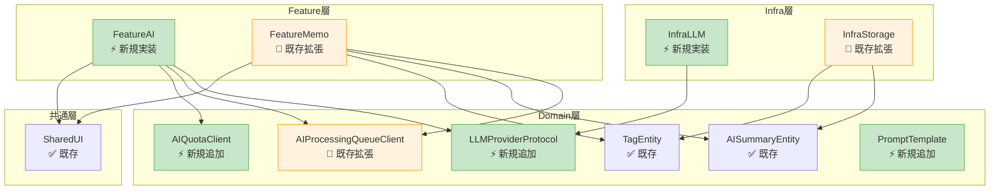
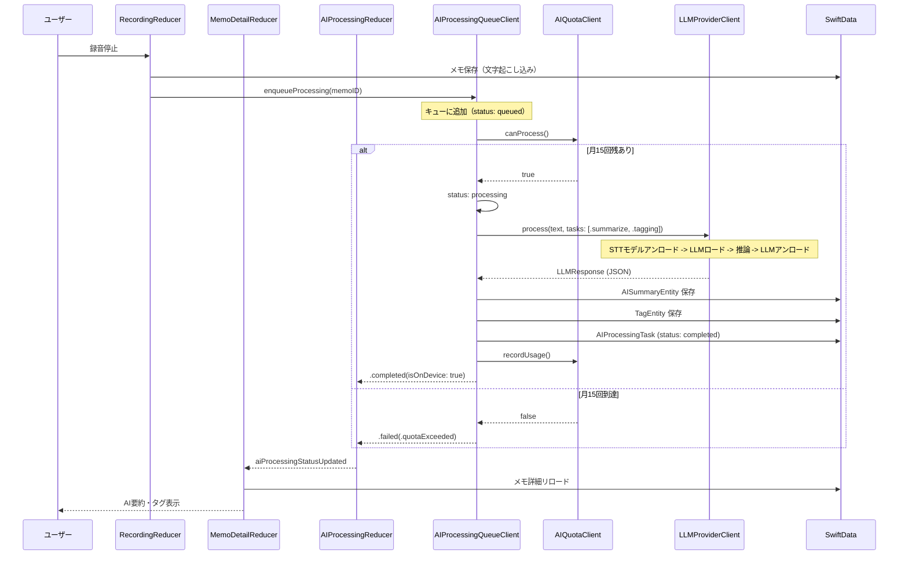
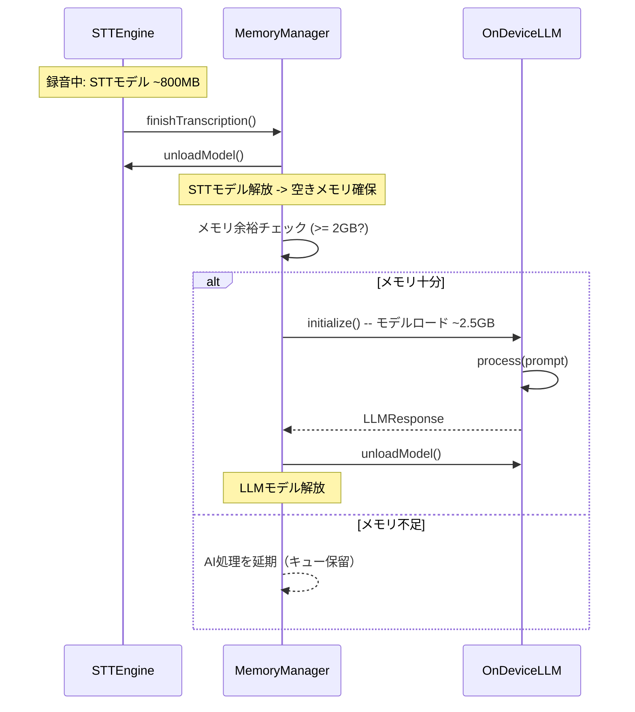
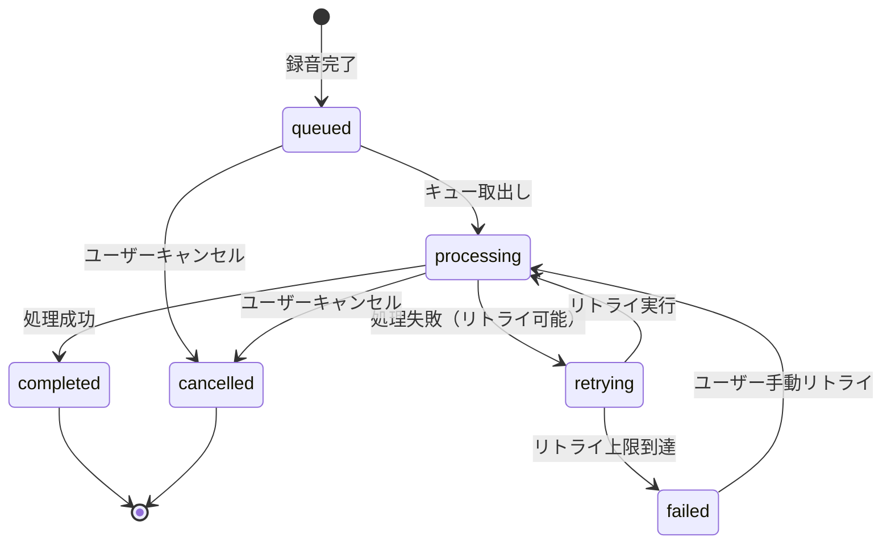
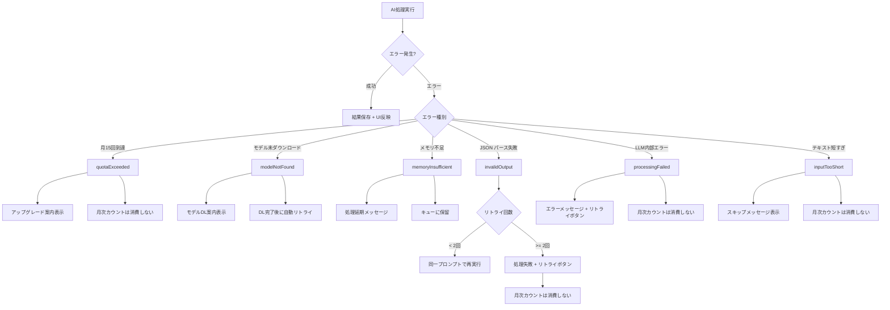
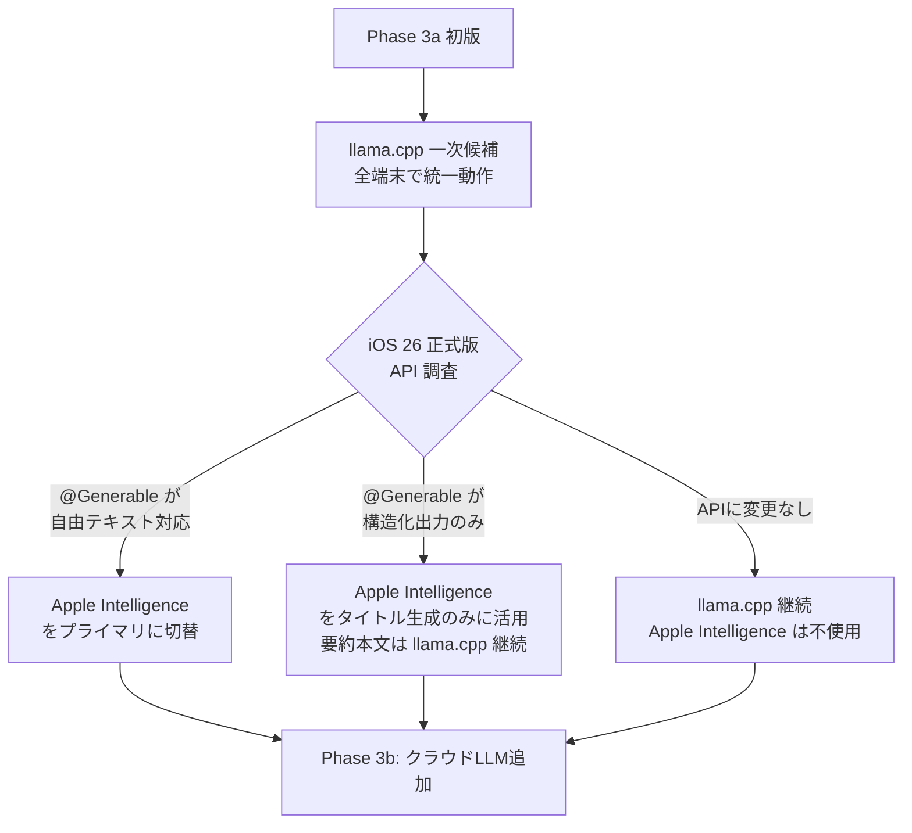
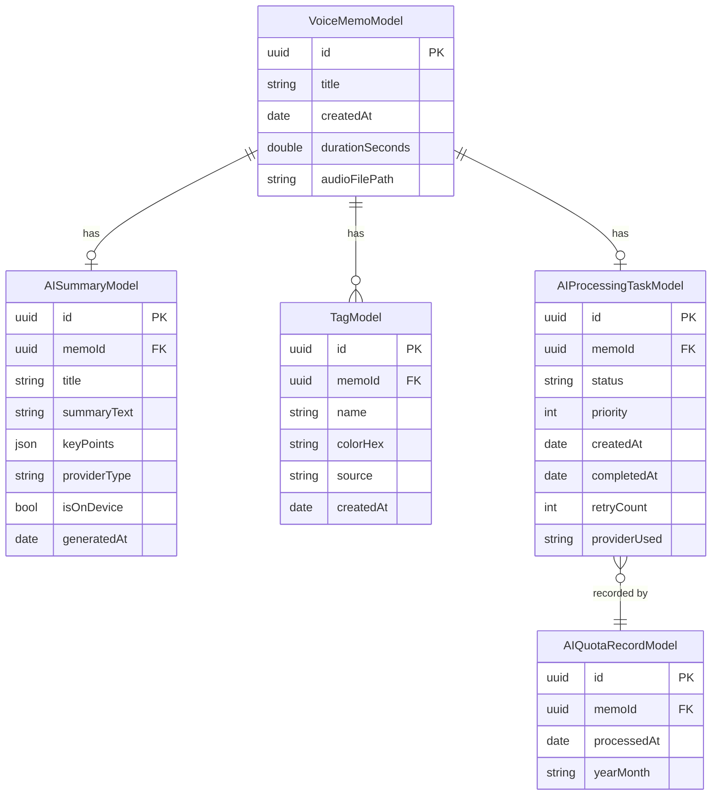

# Phase 3a 詳細設計

> **文書ID**: DES-PHASE3A-001
> **バージョン**: 1.0
> **作成日**: 2026-03-21
> **ステータス**: ドラフト
> **準拠**: DES-002 v1.1、DESIGN-004 v1.1、REQ-PHASE3A-001 v1.0

---

## 1. モジュール構成

### 1.1 Phase 3a で変更・追加するモジュール



凡例: ⚡ 新規実装 / 🔧 既存拡張 / ✅ 変更なし

### 1.2 ファイル構成（新規・変更）

```
MurMurNoteModules/Sources/
├── Domain/
│   ├── Protocols/
│   │   ├── LLMProviderProtocol.swift          ⚡ 新規
│   │   ├── LLMProviderClient.swift            ⚡ 新規
│   │   ├── AIQuotaClient.swift                ⚡ 新規
│   │   └── AIProcessingQueueClient.swift      🔧 拡張
│   ├── ValueObjects/
│   │   └── LLMProviderType.swift              ✅ 既存
│   ├── Entities/
│   │   ├── AISummaryEntity.swift              ✅ 既存
│   │   └── TagEntity.swift                    ✅ 既存
│   └── Services/
│       └── PromptTemplate.swift               ⚡ 新規
│
├── InfraLLM/
│   ├── InfraLLM.swift                         🔧 拡張
│   ├── OnDeviceLLMProvider.swift              ⚡ 新規（llama.cpp）
│   ├── AppleIntelligenceLLMProvider.swift     ⚡ 新規（@Generable）
│   ├── DeviceCapabilityChecker.swift          ⚡ 新規
│   ├── LLMModelManager.swift                 ⚡ 新規（モデルDL管理）
│   └── LLMResponseParser.swift               ⚡ 新規（JSONパース）
│
├── InfraStorage/
│   ├── SwiftData/
│   │   ├── AIProcessingTaskModel.swift        ⚡ 新規
│   │   └── AIQuotaRecordModel.swift           ⚡ 新規
│   └── Repository/
│       └── AIProcessingRepository.swift       ⚡ 新規
│
├── FeatureAI/
│   ├── FeatureAI.swift                        🔧 拡張
│   ├── AIProcessingReducer.swift              ⚡ 新規
│   ├── AIOnboardingView.swift                 ⚡ 新規
│   └── AIQuotaBarView.swift                   ⚡ 新規
│
└── FeatureMemo/
    └── MemoDetail/
        ├── MemoDetailReducer.swift            🔧 拡張
        └── MemoDetailView.swift               🔧 拡張
```

### 1.3 Package.swift 変更

InfraLLM モジュールに llama.cpp Swift バインディングの依存を追加する。

```swift
// InfraLLM に llama.cpp Swift ラッパーを追加
.target(
    name: "InfraLLM",
    dependencies: [
        "Domain",
        // llama.cpp Swift バインディング（候補: swift-llama or llmfarm-core）
        .product(name: "LlamaSwift", package: "swift-llama"),
    ],
    plugins: []
),
```

> **ライブラリ選定の注意**: llama.cpp の Swift バインディングは複数の候補がある。Phase 3a 実装着手時に最新の互換性・メンテナンス状況を確認して選定する。

---

## 2. データフロー

### 2.1 録音完了からAI処理結果表示までのエンドツーエンドフロー



### 2.2 メモリ排他制御フロー



### 2.3 AI処理キューの状態遷移



---

## 3. クラス設計

### 3.1 Domain 層の新規プロトコル

#### LLMProviderProtocol（新規）

```swift
// Domain/Protocols/LLMProviderProtocol.swift

import Foundation

/// LLM処理タスクの種別
public enum LLMTask: String, CaseIterable, Sendable {
    case summarize
    case tagging
    // sentimentAnalysis は Phase 3b で追加
}

/// LLM処理リクエスト
public struct LLMRequest: Sendable {
    public let text: String
    public let tasks: Set<LLMTask>
    public let language: String
    public let maxTokens: Int

    public init(text: String, tasks: Set<LLMTask>, language: String = "ja", maxTokens: Int = 650) {
        self.text = text
        self.tasks = tasks
        self.language = language
        self.maxTokens = maxTokens
    }
}

/// LLM処理レスポンス
public struct LLMResponse: Sendable, Equatable {
    public let summary: LLMSummaryResult?
    public let tags: [LLMTagResult]
    public let processingTimeMs: Int
    public let provider: LLMProviderType

    public init(
        summary: LLMSummaryResult?,
        tags: [LLMTagResult],
        processingTimeMs: Int,
        provider: LLMProviderType
    ) {
        self.summary = summary
        self.tags = tags
        self.processingTimeMs = processingTimeMs
        self.provider = provider
    }
}

public struct LLMSummaryResult: Sendable, Equatable {
    public let title: String
    public let brief: String
    public let keyPoints: [String]
}

public struct LLMTagResult: Sendable, Equatable {
    public let label: String
    public let confidence: Double
}
```

#### LLMProviderClient（新規 TCA Dependency）

```swift
// Domain/Protocols/LLMProviderClient.swift

import Dependencies
import Foundation

public struct LLMProviderClient: Sendable {
    /// テキストに対してLLM処理を実行
    public var process: @Sendable (LLMRequest) async throws -> LLMResponse
    /// プロバイダの利用可否チェック
    public var isAvailable: @Sendable () async -> Bool
    /// 現在のプロバイダ種別
    public var providerType: @Sendable () -> LLMProviderType
    /// モデルのアンロード（メモリ解放）
    public var unloadModel: @Sendable () async -> Void
}

extension LLMProviderClient: TestDependencyKey {
    public static let testValue = LLMProviderClient(
        process: unimplemented("LLMProviderClient.process"),
        isAvailable: unimplemented("LLMProviderClient.isAvailable", placeholder: false),
        providerType: unimplemented("LLMProviderClient.providerType", placeholder: .onDeviceLlamaCpp),
        unloadModel: unimplemented("LLMProviderClient.unloadModel")
    )
}

extension DependencyValues {
    public var llmProvider: LLMProviderClient {
        get { self[LLMProviderClient.self] }
        set { self[LLMProviderClient.self] = newValue }
    }
}
```

#### AIQuotaClient（新規 TCA Dependency）

```swift
// Domain/Protocols/AIQuotaClient.swift

import Dependencies
import Foundation

public struct AIQuotaClient: Sendable {
    /// 処理可否を判定（月15回制限）
    public var canProcess: @Sendable () async throws -> Bool
    /// 今月の使用回数を取得
    public var currentMonthUsage: @Sendable () async throws -> Int
    /// 残り回数を取得
    public var remainingCount: @Sendable () async throws -> Int
    /// 使用記録
    public var recordUsage: @Sendable () async throws -> Void
    /// 次回リセット日を取得
    public var nextResetDate: @Sendable () -> Date
}

extension AIQuotaClient: TestDependencyKey {
    public static let testValue = AIQuotaClient(
        canProcess: unimplemented("AIQuotaClient.canProcess", placeholder: true),
        currentMonthUsage: unimplemented("AIQuotaClient.currentMonthUsage", placeholder: 0),
        remainingCount: unimplemented("AIQuotaClient.remainingCount", placeholder: 15),
        recordUsage: unimplemented("AIQuotaClient.recordUsage"),
        nextResetDate: unimplemented("AIQuotaClient.nextResetDate", placeholder: Date())
    )
}

extension DependencyValues {
    public var aiQuota: AIQuotaClient {
        get { self[AIQuotaClient.self] }
        set { self[AIQuotaClient.self] = newValue }
    }
}
```

### 3.2 InfraLLM 層の新規実装

#### OnDeviceLLMProvider

```swift
// InfraLLM/OnDeviceLLMProvider.swift

/// llama.cpp (Phi-3-mini Q4_K_M) によるオンデバイスLLM実装
/// P3A-REQ-004 準拠
final class OnDeviceLLMProvider: @unchecked Sendable {
    private var llamaContext: LlamaContext?
    private let modelManager: LLMModelManager
    private let responseParser: LLMResponseParser

    let providerType: LLMProviderType = .onDeviceLlamaCpp
    let maxInputTokens: Int = 650  // ~500日本語文字

    func isAvailable() async -> Bool {
        DeviceCapabilityChecker.shared.supportsOnDeviceLLM
            && modelManager.isModelDownloaded
    }

    func process(_ request: LLMRequest) async throws -> LLMResponse {
        // 1. モデルロード（未ロード時）
        if llamaContext == nil {
            try await loadModel()
        }

        // 2. プロンプト構築
        let prompt = PromptTemplate.onDeviceSimple.buildUserPrompt(text: request.text)

        // 3. 推論実行
        let startTime = CFAbsoluteTimeGetCurrent()
        let rawOutput = try await llamaContext!.generate(
            prompt: prompt,
            maxTokens: 512,
            temperature: 0.3,
            stopTokens: ["```", "</json>"]
        )
        let elapsed = CFAbsoluteTimeGetCurrent() - startTime

        // 4. レスポンスパース（JSONバリデーション + リトライ）
        let response = try responseParser.parse(
            rawOutput,
            processingTimeMs: Int(elapsed * 1000),
            provider: providerType
        )

        return response
    }

    func unloadModel() async {
        llamaContext = nil
    }

    private func loadModel() async throws {
        guard let modelPath = modelManager.modelPath else {
            throw LLMError.modelNotFound
        }
        let params = LlamaModelParams.default()
        params.n_gpu_layers = 99  // Metal GPU全レイヤーオフロード
        llamaContext = try LlamaContext(modelPath: modelPath.path, params: params)
    }
}
```

#### DeviceCapabilityChecker

```swift
// InfraLLM/DeviceCapabilityChecker.swift

import Foundation

/// デバイス能力チェッカー
/// P3A-REQ-004, P3A-REQ-005, P3A-REQ-014 準拠
final class DeviceCapabilityChecker: Sendable {
    static let shared = DeviceCapabilityChecker()

    /// REQ-021: A16 Bionic以降かつメモリ6GB以上
    var supportsOnDeviceLLM: Bool {
        chipGeneration >= 16 && totalMemoryGB >= 6
    }

    /// Apple Intelligence 利用可否
    var supportsAppleIntelligence: Bool {
        if #available(iOS 26, *) {
            // Apple Intelligence の利用可否チェック
            // 実際のAPI呼び出しで判定
            return false  // Phase 3a 初版では false 固定（API 調査後に有効化）
        }
        return false
    }

    /// STT実行中のメモリ余裕チェック
    var hasMemoryHeadroomForLLM: Bool {
        let availableMemory = os_proc_available_memory()
        return availableMemory > 2 * 1024 * 1024 * 1024  // 2GB以上
    }

    private var chipGeneration: Int { /* utsname解析 */ }
    private var totalMemoryGB: UInt64 {
        ProcessInfo.processInfo.physicalMemory / (1024 * 1024 * 1024)
    }
}
```

#### LLMResponseParser

```swift
// InfraLLM/LLMResponseParser.swift

/// LLMの生テキスト出力をパースしてLLMResponseに変換
/// P3A-EC-003（不正JSON時のリトライ）対応
struct LLMResponseParser {

    /// JSONパース（レジリエント: 部分的にパース可能な場合は部分結果を返す）
    func parse(
        _ rawOutput: String,
        processingTimeMs: Int,
        provider: LLMProviderType
    ) throws -> LLMResponse {
        // 1. JSON部分の抽出（```json ... ``` や余分なテキストを除去）
        let jsonString = extractJSON(from: rawOutput)

        // 2. JSONデコード
        let decoded = try JSONDecoder().decode(OnDeviceLLMOutput.self, from: Data(jsonString.utf8))

        // 3. LLMResponseへの変換
        return LLMResponse(
            summary: LLMSummaryResult(
                title: String(decoded.title.prefix(20)),
                brief: decoded.brief,
                keyPoints: []  // オンデバイス簡易版ではキーポイントなし
            ),
            tags: decoded.tags.prefix(3).map { tag in
                LLMTagResult(label: String(tag.prefix(15)), confidence: 0.8)
            },
            processingTimeMs: processingTimeMs,
            provider: provider
        )
    }

    private func extractJSON(from text: String) -> String {
        // ```json ... ``` のフェンスドコードブロックを抽出
        // または { ... } を直接抽出
        if let range = text.range(of: "\\{[^}]+\\}", options: .regularExpression) {
            return String(text[range])
        }
        return text
    }
}

/// オンデバイスLLMの出力形式
private struct OnDeviceLLMOutput: Decodable {
    let title: String
    let brief: String
    let tags: [String]
}
```

### 3.3 FeatureAI 層の新規実装

#### AIProcessingReducer

```swift
// FeatureAI/AIProcessingReducer.swift

@Reducer
public struct AIProcessingReducer {

    @ObservableState
    public struct State: Equatable {
        public var memoID: UUID
        public var processingStatus: AIProcessingStatus = .idle
        public var remainingQuota: Int = 15
        public var isFirstTimeProcessing: Bool = false
        public var showOnboarding: Bool = false
    }

    public enum Action: Equatable, Sendable {
        case startProcessing
        case processingStatusUpdated(AIProcessingStatus)
        case quotaUpdated(remaining: Int)
        case retryProcessing
        case cancelProcessing
        case onboardingDismissed
        case _processCompleted(LLMResponse)
        case _processFailed(AIProcessingError)
    }

    @Dependency(\.aiProcessingQueue) var aiProcessingQueue
    @Dependency(\.aiQuota) var aiQuota
    @Dependency(\.llmProvider) var llmProvider

    public var body: some ReducerOf<Self> {
        Reduce { state, action in
            switch action {
            case .startProcessing:
                let memoID = state.memoID
                return .run { send in
                    try await aiProcessingQueue.enqueueProcessing(memoID)
                    let remaining = try await aiQuota.remainingCount()
                    await send(.quotaUpdated(remaining: remaining))
                }

            case let .processingStatusUpdated(status):
                state.processingStatus = status
                return .none

            case let .quotaUpdated(remaining):
                state.remainingQuota = remaining
                return .none

            case .retryProcessing:
                return .send(.startProcessing)

            case .cancelProcessing:
                let memoID = state.memoID
                return .run { _ in
                    try await aiProcessingQueue.cancelProcessing(memoID)
                }

            case .onboardingDismissed:
                state.showOnboarding = false
                return .send(.startProcessing)

            case ._processCompleted, ._processFailed:
                return .none
            }
        }
    }
}
```

---

## 4. プロンプト設計

### 4.1 オンデバイス統合プロンプト（要約+タグ）

Phase 3a ではオンデバイス LLM の制約（トークン上限 ~650 入力トークン、出力安定性）を考慮し、簡潔なプロンプトを使用する。

```
以下のメモを要約し、タグを付けてください。JSON形式で出力してください。

メモ: {transcribed_text}

出力形式:
{"title": "20文字以内のタイトル", "brief": "1行の要約", "tags": ["タグ1", "タグ2"]}
```

#### 設計判断

| 項目 | 決定 | 根拠 |
|:-----|:-----|:-----|
| プロンプト言語 | 日本語 | 入出力ともに日本語。プロンプトも日本語にすることで出力品質を向上 |
| システムプロンプト | なし | オンデバイスモデルではトークン節約のため不使用 |
| Few-shot 例示 | なし | オンデバイスモデルではトークン節約のため不使用 |
| 出力形式指定 | JSON | 構造化データの抽出を容易にするため |
| temperature | 0.3 | 低温度で安定した出力を得る |
| キーポイント | 省略 | オンデバイスの出力安定性を考慮し簡潔な出力に限定。Phase 3b のクラウドプロンプトでキーポイントを追加 |

### 4.2 Apple Intelligence @Generable プロンプト（将来対応）

Apple Intelligence Foundation Models が `@Generable` マクロで構造化出力を提供する場合の設計。

```swift
@Generable
struct MemoSummary {
    @Guide("メモの内容を端的に表す20文字以内のタイトル")
    var title: String

    @Guide("メモの要約文（1-2行）")
    var brief: String

    @Guide("メモの内容に基づくタグ（最大3件）")
    var tags: [String]
}
```

> **注意**: `@Generable` マクロの API が iOS 26 正式版で確定するまでは、この実装は保留とする。Phase 3a 初版は llama.cpp で実装し、Apple Intelligence 対応は後から差し替える。

### 4.3 プロンプトバージョン管理

```swift
// Domain/Services/PromptTemplate.swift

public struct PromptTemplate: Sendable {
    public let version: String
    public let userPromptTemplate: String

    public func buildUserPrompt(text: String) -> String {
        userPromptTemplate.replacingOccurrences(of: "{transcribed_text}", with: text)
    }

    /// Phase 3a: オンデバイス簡易プロンプト
    public static let onDeviceSimple = PromptTemplate(
        version: "1.0.0",
        userPromptTemplate: """
        以下のメモを要約し、タグを付けてください。JSON形式で出力してください。

        メモ: {transcribed_text}

        出力形式:
        {"title": "20文字以内のタイトル", "brief": "1行の要約", "tags": ["タグ1", "タグ2"]}
        """
    )
}
```

---

## 5. エラーハンドリングフロー

### 5.1 エラー分類と対応



### 5.2 エラー型定義

```swift
/// Phase 3a のLLMエラー型
public enum LLMError: Error, Equatable, Sendable {
    case modelNotFound              // モデルファイル未ダウンロード
    case modelLoadFailed(String)    // モデルロード失敗
    case memoryInsufficient         // メモリ不足
    case inputTooShort              // 入力テキストが短すぎる（10文字未満）
    case inputTooLong               // 入力テキストが長すぎる（500文字超、オンデバイス制限）
    case invalidOutput              // LLM出力のJSONパース失敗
    case processingFailed(String)   // LLM推論中のエラー
    case quotaExceeded              // 月15回制限到達
    case deviceNotSupported         // 非対応デバイス
    case cancelled                  // ユーザーキャンセル
}
```

### 5.3 リトライ戦略

| エラー種別 | 自動リトライ | 最大回数 | バックオフ | 手動リトライ |
|:-----------|:------------|:---------|:----------|:------------|
| invalidOutput | あり | 2回 | なし（即時） | あり |
| processingFailed | あり | 3回 | 指数（2s, 4s, 8s） | あり |
| memoryInsufficient | なし | - | - | あり（次回起動時） |
| modelNotFound | なし | - | - | DL完了後に自動 |
| quotaExceeded | なし | - | - | なし |
| inputTooShort | なし | - | - | なし |
| deviceNotSupported | なし | - | - | なし |

---

## 6. Apple Intelligence Foundation Models API の利用方法

### 6.1 現状の API 制約（2026年3月時点）

Apple Intelligence Foundation Models は以下の API を提供している:

| API | 用途 | Phase 3a での利用 |
|:----|:-----|:-----------------|
| `@Generable` マクロ | 構造化出力（Swift 型への直接マッピング） | 要検証（タイトル・タグ生成に利用可能な可能性） |
| `LanguageModelSession` | テキスト生成セッション | サードパーティアプリには未公開（2026年3月時点） |
| `SystemLanguageModel` | システム言語モデルへのアクセス | サードパーティアプリには未公開 |

### 6.2 段階的導入戦略



### 6.3 @Generable 構造化出力の検証コード

```swift
// Apple Intelligence @Generable の検証（Phase 3a で実装するが、フラグで無効化）
@available(iOS 26, *)
@Generable
struct AIGeneratedMemoTitle {
    @Guide("メモの内容を端的に表す20文字以内の日本語タイトル")
    var title: String
}

@available(iOS 26, *)
func generateTitleWithAppleIntelligence(text: String) async throws -> String {
    let session = LanguageModelSession()
    let result = try await session.respond(
        to: "以下のメモにタイトルを付けてください: \(text)",
        generating: AIGeneratedMemoTitle.self
    )
    return result.title
}
```

---

## 7. llama.cpp フォールバックの実装方針

### 7.1 モデル管理

```swift
// InfraLLM/LLMModelManager.swift

/// オンデバイスLLMモデルのダウンロード・キャッシュ管理
final class LLMModelManager: @unchecked Sendable {

    /// モデル配置先: Library/Caches/Models/（OSによるキャッシュクリア対象）
    private var modelsDirectory: URL {
        FileManager.default.urls(for: .cachesDirectory, in: .userDomainMask).first!
            .appendingPathComponent("Models", isDirectory: true)
    }

    /// モデルファイルパス
    var modelPath: URL? {
        let path = modelsDirectory.appendingPathComponent("phi-3-mini-q4_k_m.gguf")
        return FileManager.default.fileExists(atPath: path.path) ? path : nil
    }

    /// ダウンロード済みか
    var isModelDownloaded: Bool { modelPath != nil }

    /// モデルダウンロード（進捗コールバック付き）
    func downloadModel(progress: @escaping (Double) -> Void) async throws {
        // 1. ダウンロードURL（Hugging Face Hub 等）
        let downloadURL = URL(string: "https://huggingface.co/microsoft/Phi-3-mini-4k-instruct-gguf/resolve/main/Phi-3-mini-4k-instruct-q4_k_m.gguf")!

        // 2. URLSession でダウンロード（バックグラウンド対応）
        try FileManager.default.createDirectory(at: modelsDirectory, withIntermediateDirectories: true)

        let (tempURL, _) = try await URLSession.shared.download(from: downloadURL) { bytesWritten, totalBytes, _ in
            if totalBytes > 0 {
                progress(Double(bytesWritten) / Double(totalBytes))
            }
        }

        // 3. キャッシュディレクトリに移動
        let destURL = modelsDirectory.appendingPathComponent("phi-3-mini-q4_k_m.gguf")
        try FileManager.default.moveItem(at: tempURL, to: destURL)
    }

    /// モデルファイルサイズ
    var modelFileSizeDescription: String { "約 2.5GB" }
}
```

### 7.2 推論パラメータ

| パラメータ | 値 | 根拠 |
|:-----------|:---|:-----|
| temperature | 0.3 | 低温度で安定した JSON 出力を得る |
| max_tokens | 512 | 出力は JSON 形式で 200-300 トークン程度。余裕を持って 512 |
| n_gpu_layers | 99（全レイヤー） | Metal GPU にオフロードして高速化 |
| stop_tokens | `["```", "</json>"]` | JSON 出力後の余分なテキスト生成を防止 |
| repeat_penalty | 1.1 | 繰り返し表現の抑制 |

### 7.3 パフォーマンス目標

| 指標 | 目標値 | 測定条件 |
|:-----|:-------|:---------|
| モデルロード時間 | 3秒以内 | iPhone 15, コールドスタート |
| 推論時間（100文字入力） | 2秒以内 | iPhone 15, Metal GPU |
| 推論時間（500文字入力） | 5秒以内 | iPhone 15, Metal GPU |
| トークン生成速度 | 30+ tokens/sec | iPhone 15, Metal GPU |
| ピークメモリ使用量 | 2.5GB 以下 | Q4_K_M 量子化モデル |

---

## 8. SwiftData スキーマ設計

### 8.1 新規モデル

#### AIProcessingTaskModel（AI処理キューの永続化）

```swift
@Model
final class AIProcessingTaskModel {
    @Attribute(.unique) var id: UUID
    var memoId: UUID
    var status: String           // "queued" | "processing" | "completed" | "failed" | "cancelled"
    var priority: Int            // 0=high, 1=normal, 2=low
    var createdAt: Date
    var startedAt: Date?
    var completedAt: Date?
    var retryCount: Int
    var maxRetries: Int
    var errorMessage: String?
    var providerUsed: String?    // LLMProviderType.rawValue

    init(
        id: UUID = UUID(),
        memoId: UUID,
        status: String = "queued",
        priority: Int = 1,
        createdAt: Date = Date(),
        retryCount: Int = 0,
        maxRetries: Int = 3
    ) { ... }
}
```

#### AIQuotaRecordModel（月次カウントの永続化）

```swift
@Model
final class AIQuotaRecordModel {
    @Attribute(.unique) var id: UUID
    var memoId: UUID             // 対象メモID
    var processedAt: Date        // 処理完了日時
    var yearMonth: String        // "2026-03" 形式（月次集計用インデックス）

    init(
        id: UUID = UUID(),
        memoId: UUID,
        processedAt: Date = Date()
    ) {
        self.id = id
        self.memoId = memoId
        self.processedAt = processedAt
        // JSTベースの年月
        let calendar = Calendar(identifier: .gregorian)
        let components = calendar.dateComponents(
            in: TimeZone(identifier: "Asia/Tokyo")!,
            from: processedAt
        )
        self.yearMonth = String(format: "%04d-%02d", components.year!, components.month!)
    }
}
```

### 8.2 既存エンティティとの関係


