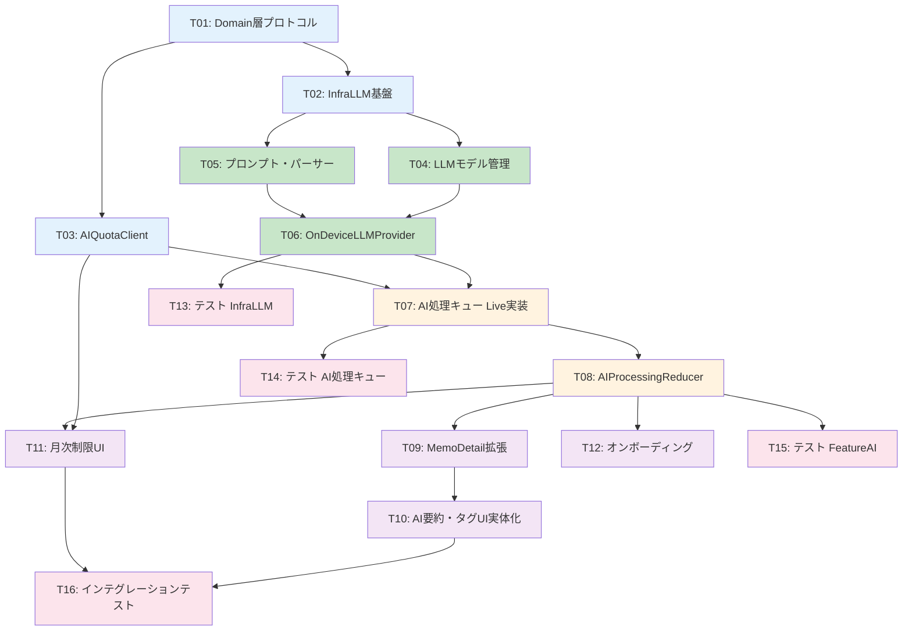

# Phase 3a タスク一覧

> **文書ID**: TASK-PHASE3A-001
> **バージョン**: 1.0
> **作成日**: 2026-03-21
> **ステータス**: ドラフト
> **推定合計期間**: 12日（実作業日）

---

## タスク依存関係

凡例: 青=基盤 / 緑=LLM実装 / 橙=キュー・Reducer / 紫=UI / ピンク=テスト

---

## タスク詳細

### T01: Domain 層プロトコル・型定義

| 項目 | 内容 |
|:-----|:-----|
| **タスクID** | T01 |
| **タイトル** | Domain 層に LLM プロバイダ・クォータ管理のプロトコルと型を追加 |
| **説明** | `LLMProviderProtocol`、`LLMProviderClient`（TCA Dependency）、`LLMRequest`/`LLMResponse` 型、`LLMTask` enum、`LLMError` 型を Domain 層に追加する。既存の `LLMProviderType` は変更なし。 |
| **依存タスク** | なし |
| **推定作業量** | S |
| **対象ファイル** | `Domain/Protocols/LLMProviderProtocol.swift`（新規）、`Domain/Protocols/LLMProviderClient.swift`（新規）、`Domain/Errors/LLMError.swift`（新規） |
| **完了条件** | 全型が定義され、`swift test`（Domain ターゲット）が pass |

---

### T02: InfraLLM モジュール基盤構築

| 項目 | 内容 |
|:-----|:-----|
| **タスクID** | T02 |
| **タイトル** | InfraLLM モジュールに llama.cpp 依存を追加し、基盤コードを構築 |
| **説明** | `Package.swift` に llama.cpp Swift バインディングの依存を追加する。`DeviceCapabilityChecker` を実装し、デバイスの SoC 世代・メモリ容量を判定するロジックを作成する。 |
| **依存タスク** | T01 |
| **推定作業量** | M |
| **対象ファイル** | `Package.swift`（変更）、`InfraLLM/DeviceCapabilityChecker.swift`（新規）、`InfraLLM/InfraLLM.swift`（変更） |
| **完了条件** | `swift build` が成功し、`DeviceCapabilityChecker.supportsOnDeviceLLM` がデバイス判定を返す |
| **注意点** | llama.cpp Swift バインディングのライブラリ選定が必要。候補: `swift-llama`、`llmfarm-core`、C API 直接ブリッジ |

---

### T03: AIQuotaClient（月次制限管理）

| 項目 | 内容 |
|:-----|:-----|
| **タスクID** | T03 |
| **タイトル** | 月次 AI 処理回数のカウント管理を実装 |
| **説明** | `AIQuotaClient`（TCA Dependency）を Domain 層に定義し、`InfraStorage` 層に SwiftData ベースの Live 実装を作成する。`AIQuotaRecordModel`（SwiftData モデル）を追加し、JST 基準の月次集計ロジックを実装する。 |
| **依存タスク** | T01 |
| **推定作業量** | M |
| **対象ファイル** | `Domain/Protocols/AIQuotaClient.swift`（新規）、`InfraStorage/SwiftData/AIQuotaRecordModel.swift`（新規）、`InfraStorage/Repository/AIQuotaRepository.swift`（新規） |
| **完了条件** | `canProcess()` が月15回制限を正しく判定、`recordUsage()` がカウントを記録、`nextResetDate()` が翌月1日 JST 0:00 を返す。ユニットテスト pass |

---

### T04: LLM モデルダウンロード管理

| 項目 | 内容 |
|:-----|:-----|
| **タスクID** | T04 |
| **タイトル** | llama.cpp モデルファイルのダウンロード・キャッシュ管理を実装 |
| **説明** | `LLMModelManager` を InfraLLM 層に実装する。Hugging Face Hub からの Phi-3-mini Q4_K_M モデルダウンロード（約 2.5GB）、`Library/Caches/Models/` への配置、ダウンロード進捗の通知、ダウンロード中断時のリジューム対応を含む。 |
| **依存タスク** | T02 |
| **推定作業量** | M |
| **対象ファイル** | `InfraLLM/LLMModelManager.swift`（新規） |
| **完了条件** | モデルのダウンロード・キャッシュ・存在チェックが動作する。ダウンロード進捗が正しくコールバックされる |

---

### T05: プロンプトテンプレート・レスポンスパーサー

| 項目 | 内容 |
|:-----|:-----|
| **タスクID** | T05 |
| **タイトル** | オンデバイス LLM 用のプロンプトテンプレートと JSON レスポンスパーサーを実装 |
| **説明** | `PromptTemplate` を Domain 層に、`LLMResponseParser` を InfraLLM 層に実装する。プロンプトは設計書 DES-002 セクション6.2 準拠の簡易版。パーサーは LLM の生テキスト出力から JSON 部分を抽出し、`LLMResponse` に変換する。不正 JSON 検出・フォールバック処理を含む。 |
| **依存タスク** | T02 |
| **推定作業量** | M |
| **対象ファイル** | `Domain/Services/PromptTemplate.swift`（新規）、`InfraLLM/LLMResponseParser.swift`（新規） |
| **完了条件** | 様々な LLM 出力パターン（正常 JSON、フェンスドブロック付き JSON、不正 JSON）に対してパーサーが正しく動作する。ユニットテスト pass |

---

### T06: OnDeviceLLMProvider 実装

| 項目 | 内容 |
|:-----|:-----|
| **タスクID** | T06 |
| **タイトル** | llama.cpp ベースのオンデバイス LLM プロバイダを実装 |
| **説明** | `OnDeviceLLMProvider` を InfraLLM 層に実装する。llama.cpp コンテキストの作成・破棄、Metal GPU オフロード、プロンプト実行、レスポンスパース、メモリ管理（ロード/アンロード）の全フローを実装する。 |
| **依存タスク** | T04, T05 |
| **推定作業量** | L |
| **対象ファイル** | `InfraLLM/OnDeviceLLMProvider.swift`（新規） |
| **完了条件** | iPhone 15 実機で Phi-3-mini Q4_K_M を使用して日本語テキストの要約+タグ生成が動作する。処理時間 5 秒以内（500 文字入力） |
| **注意点** | 実機テストが必要。Simulator では Metal GPU が使えないため、推論速度の検証は実機のみ |

---

### T07: AI 処理キュー Live 実装

| 項目 | 内容 |
|:-----|:-----|
| **タスクID** | T07 |
| **タイトル** | AIProcessingQueueClient の Live 実装（SwiftData 永続化 + バックグラウンド処理） |
| **説明** | 既存の `AIProcessingQueueClient`（Domain 層で TestDependencyKey のみ定義済み）に対する Live 実装を作成する。`AIProcessingTaskModel`（SwiftData）でキューを永続化し、`enqueueProcessing` / `observeStatus` / `cancelProcessing` の実体を実装する。STT アンロード -> LLM ロード -> 推論 -> LLM アンロードのメモリ排他制御も含む。 |
| **依存タスク** | T06, T03 |
| **推定作業量** | L |
| **対象ファイル** | `InfraStorage/SwiftData/AIProcessingTaskModel.swift`（新規）、`InfraStorage/Repository/AIProcessingRepository.swift`（新規）、`Data/LiveDependencies/AIProcessingQueueLive.swift`（新規）または `MurMurNoteApp/LiveDependencies.swift`（変更） |
| **完了条件** | 録音完了 -> キュー追加 -> LLM 実行 -> 結果保存 -> ステータス通知の全フローが動作する。リトライが機能する |

---

### T08: AIProcessingReducer 実装

| 項目 | 内容 |
|:-----|:-----|
| **タスクID** | T08 |
| **タイトル** | FeatureAI モジュールに AIProcessingReducer を実装 |
| **説明** | TCA Reducer として AI 処理の開始・ステータス監視・リトライ・キャンセルを管理する `AIProcessingReducer` を実装する。`AIProcessingQueueClient`、`AIQuotaClient`、`LLMProviderClient` の 3 つの Dependency を注入して使用する。 |
| **依存タスク** | T07 |
| **推定作業量** | M |
| **対象ファイル** | `FeatureAI/AIProcessingReducer.swift`（新規）、`FeatureAI/FeatureAI.swift`（変更） |
| **完了条件** | `TestStore` を使用した Reducer テストが全 pass。startProcessing / retryProcessing / cancelProcessing の各アクションが正しく動作する |

---

### T09: MemoDetailReducer の AI 処理連携拡張

| 項目 | 内容 |
|:-----|:-----|
| **タスクID** | T09 |
| **タイトル** | MemoDetailReducer に AI 処理の実トリガー・再生成ロジックを追加 |
| **説明** | 既存の `MemoDetailReducer` は `aiProcessingStatusUpdated` アクションと `regenerateAISummary` アクションのスタブを持っている。これらを実装し、`AIProcessingQueueClient` と連携する。再生成時の月次カウント消費ロジック（P3A-REQ-012）も実装する。 |
| **依存タスク** | T08 |
| **推定作業量** | M |
| **対象ファイル** | `FeatureMemo/MemoDetail/MemoDetailReducer.swift`（変更） |
| **完了条件** | メモ詳細画面で AI 処理ステータスがリアルタイムに反映される。「再生成」ボタンが機能する |

---

### T10: AI 要約・タグ UI の実体化

| 項目 | 内容 |
|:-----|:-----|
| **タスクID** | T10 |
| **タイトル** | MemoDetailView の AI 要約カード・タグ表示を実データで動作させる |
| **説明** | 既存の `AISummarySection`、`AIProcessingStatusView`、`TagFlowLayout` は UI コンポーネントとして実装済みだが、実データでの動作確認が必要。AI 処理完了後のリロードで実データが正しく表示されることを確認し、必要に応じてレイアウト調整を行う。AI 要約カードの展開/折りたたみ機能を追加する。 |
| **依存タスク** | T09 |
| **推定作業量** | M |
| **対象ファイル** | `FeatureMemo/MemoDetail/MemoDetailView.swift`（変更）、`SharedUI/Components/`（必要に応じて変更） |
| **完了条件** | AI 要約・タグが実データで正しく表示される。展開/折りたたみが動作する。VoiceOver 対応が維持されている |

---

### T11: 月次制限 UI（プログレスバー + 警告）

| 項目 | 内容 |
|:-----|:-----|
| **タスクID** | T11 |
| **タイトル** | メモ一覧画面の月次 AI 処理回数プログレスバーと段階的警告 UI を実装 |
| **説明** | メモ一覧画面上部に `AIQuotaBarView` を配置し、月次利用状況（X/15回）をプログレスバーで表示する。80% 以上で vmWarning 色、100% で vmError 色に変化。Pro プランユーザーには非表示（Phase 3c で判定実装。Phase 3a では常に表示）。月上限到達時のダイアログ（「来月まで待つ」/「Pro を見る」）も実装する。 |
| **依存タスク** | T03, T08 |
| **推定作業量** | M |
| **対象ファイル** | `FeatureAI/AIQuotaBarView.swift`（新規）、`FeatureMemo/MemoList/MemoListView.swift`（変更） |
| **完了条件** | プログレスバーが正しい残回数を表示。80%/100% の色変化が動作。月上限到達時のダイアログが表示される |

---

### T12: 初回 AI 処理オンボーディング

| 項目 | 内容 |
|:-----|:-----|
| **タスクID** | T12 |
| **タイトル** | 初回 AI 処理時のオンボーディングシートを実装 |
| **説明** | 初めて AI 処理が実行される場面で、AI 分析機能の説明・オンデバイス処理の説明・月15回無料枠の説明を含むオンボーディングシートを表示する。`UserDefaults` で表示済みフラグを管理し、2回目以降はスキップする。 |
| **依存タスク** | T08 |
| **推定作業量** | S |
| **対象ファイル** | `FeatureAI/AIOnboardingView.swift`（新規） |
| **完了条件** | 初回のみオンボーディングシートが表示される。「はじめる」で閉じた後、AI 処理が開始される |

---

### T13: InfraLLM ユニットテスト

| 項目 | 内容 |
|:-----|:-----|
| **タスクID** | T13 |
| **タイトル** | InfraLLM モジュールのユニットテストを作成 |
| **説明** | `DeviceCapabilityChecker`、`LLMResponseParser`、`LLMModelManager`（モック使用）、`PromptTemplate` のユニットテストを作成する。`OnDeviceLLMProvider` は Simulator で Metal が使えないため、モック化したテストを作成する。 |
| **依存タスク** | T06 |
| **推定作業量** | M |
| **対象ファイル** | `Tests/InfraLLMTests/` 配下に各テストファイル |
| **完了条件** | LLM レスポンスパーサーのテスト（正常系・異常系・エッジケース）が全 pass。デバイス判定ロジックのテストが pass |

---

### T14: AI 処理キューテスト

| 項目 | 内容 |
|:-----|:-----|
| **タスクID** | T14 |
| **タイトル** | AI 処理キューのユニットテスト・インテグレーションテストを作成 |
| **説明** | `AIProcessingQueueClient` の Live 実装に対するテストを作成する。キュー追加・処理開始・完了・失敗・リトライ・キャンセルの全状態遷移をテストする。`AIQuotaClient` の月次集計ロジックのテストも含む。 |
| **依存タスク** | T07 |
| **推定作業量** | M |
| **対象ファイル** | `Tests/InfraStorageTests/` 配下に `AIProcessingRepositoryTests.swift`、`AIQuotaRepositoryTests.swift` |
| **完了条件** | 全状態遷移のテストが pass。月次リセットのエッジケース（月末・JST 0:00 境界）のテストが pass |

---

### T15: FeatureAI Reducer テスト

| 項目 | 内容 |
|:-----|:-----|
| **タスクID** | T15 |
| **タイトル** | AIProcessingReducer の TCA TestStore テストを作成 |
| **説明** | `TestStore` を使用して `AIProcessingReducer` の全アクション（startProcessing、retryProcessing、cancelProcessing、onboardingDismissed）をテストする。Dependency は `testValue` + オーバーライドでモック注入する。 |
| **依存タスク** | T08 |
| **推定作業量** | M |
| **対象ファイル** | `Tests/FeatureAITests/AIProcessingReducerTests.swift`（新規） |
| **完了条件** | 正常系・月上限到達・リトライ・キャンセルの全シナリオが pass |

---

### T16: エンドツーエンドインテグレーションテスト

| 項目 | 内容 |
|:-----|:-----|
| **タスクID** | T16 |
| **タイトル** | 録音完了 -> AI 処理 -> 結果表示のエンドツーエンドテスト |
| **説明** | 録音完了後に AI 処理がキューイングされ、オンデバイス LLM が実行され、結果が SwiftData に保存され、メモ詳細画面に表示される一連のフローを検証するインテグレーションテストを作成する。LLM はモックを使用し、レスポンスの固定値を返す。 |
| **依存タスク** | T10, T11 |
| **推定作業量** | L |
| **対象ファイル** | `Tests/FeatureMemoTests/MemoDetailAIIntegrationTests.swift`（新規） |
| **完了条件** | エンドツーエンドの状態遷移が正しくテストされる。月上限到達シナリオも含む |

---

## スケジュール配置

| 日 | タスク | 推定作業量 | 備考 |
|:---|:-------|:----------|:-----|
| Day 1 | T01: Domain 層プロトコル | S | 午前中に完了見込み |
| Day 1 | T03: AIQuotaClient | M | T01 完了後に着手 |
| Day 2 | T02: InfraLLM 基盤構築 | M | llama.cpp ライブラリ選定含む |
| Day 3 | T04: LLM モデル管理 | M | ダウンロードロジック |
| Day 3 | T05: プロンプト・パーサー | M | T04 と並行可能 |
| Day 4 | T06: OnDeviceLLMProvider | L（前半） | llama.cpp コンテキスト構築 |
| Day 5 | T06: OnDeviceLLMProvider | L（後半） | 推論実行・メモリ管理 |
| Day 6 | T07: AI 処理キュー Live 実装 | L（前半） | SwiftData モデル + キュー管理 |
| Day 7 | T07: AI 処理キュー Live 実装 | L（後半） | メモリ排他制御 + バックグラウンド |
| Day 8 | T08: AIProcessingReducer | M | TCA Reducer 実装 |
| Day 9 | T09: MemoDetail 拡張 | M | AI 処理連携 |
| Day 9 | T12: オンボーディング | S | T08 完了後に着手 |
| Day 10 | T10: AI 要約・タグ UI 実体化 | M | 実データでの動作確認 |
| Day 10 | T11: 月次制限 UI | M | T10 と並行可能 |
| Day 11 | T13: InfraLLM テスト | M | |
| Day 11 | T14: AI 処理キューテスト | M | T13 と並行可能 |
| Day 12 | T15: FeatureAI テスト | M | |
| Day 12 | T16: インテグレーションテスト | L | T15 完了後に着手 |

---

## リスクバッファ

- **llama.cpp ライブラリ選定**: Day 2 で選定に時間がかかる場合、+1 日のバッファ
- **実機テスト**: Day 5（T06 後半）で実機テストが必要。Simulator のみの検証では推論速度・メモリ使用量の確認が不十分
- **モデル品質**: Day 5 で日本語の要約品質が不十分な場合、プロンプトチューニングに +1-2 日

**推奨バッファ**: 12 日 + 2-3 日 = **合計 14-15 日**
