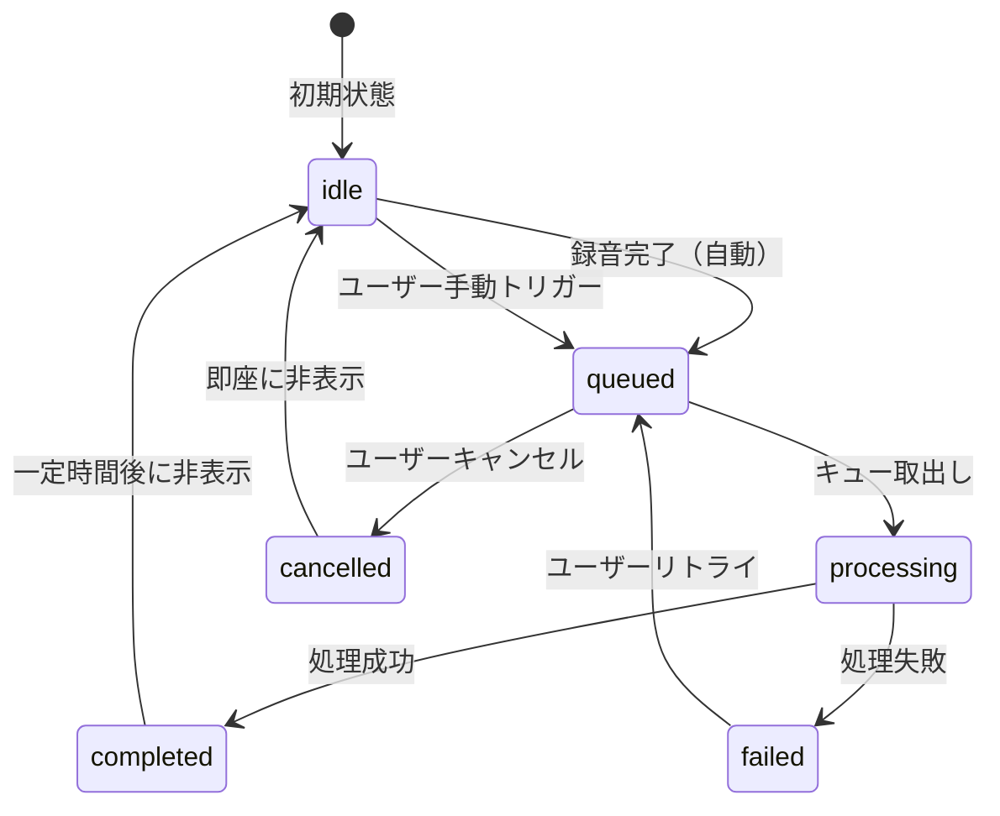
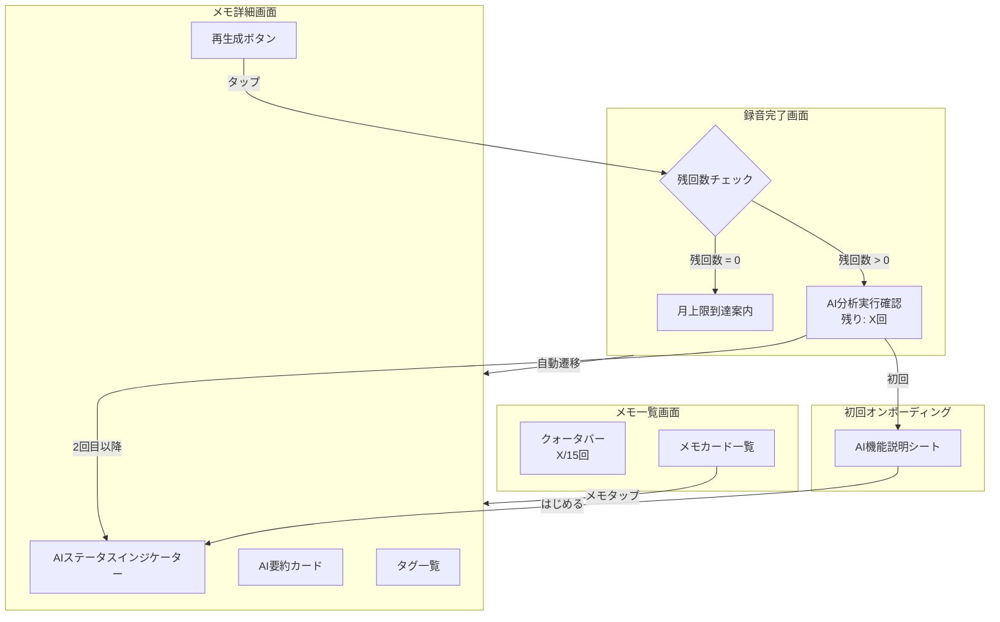

# Phase 3a UI/UX 仕様

> **文書ID**: UX-PHASE3A-001
> **バージョン**: 1.0
> **作成日**: 2026-03-21
> **ステータス**: ドラフト
> **準拠**: DESIGN-004 v1.1 セクション14、REQ-PHASE3A-001 v1.0

---

## 1. AI 要約カードの詳細レイアウト

### 1.1 基本レイアウト

メモ詳細画面の最上部（タイトルの次）に配置する。既存の `AISummarySection` コンポーネントを拡張する。

```
┌─── ✨ AI要約 ────────────── [オンデバイス処理] ─┐
│                                                    │
│  通勤中にアプリのアイデアを思いつき、音声メモの   │
│  不便さを解消するアプリの構想をまとめた。          │
│                                                    │
│  ──────────────────────────────────────           │
│  キーポイント:                                     │
│  * ワンタップ録音の重要性                         │
│  * 日本語STTの精度課題                            │
│  * プライバシー配慮の差別化                       │
│                                                    │
│                          [展開/折りたたみ ▼]       │
│                                                    │
│  ──────────────────────────────────────           │
│  [🔄 再生成]                    生成: 2026/3/21   │
└────────────────────────────────────────────────────┘
```

### 1.2 テキスト量による展開/折りたたみ

| 条件 | 表示モード | 動作 |
|:-----|:----------|:-----|
| 要約テキストが 3 行以下 | 全文表示 | 折りたたみボタンなし |
| 要約テキストが 4 行以上 | 折りたたみ表示（3 行 + ...） | 「もっと見る」ボタンで展開 |
| キーポイントが 0 件 | キーポイントセクション非表示 | --- |
| キーポイントが 1-5 件 | 常時表示 | --- |

#### 折りたたみ状態

```
┌─── ✨ AI要約 ────────────── [オンデバイス処理] ─┐
│                                                    │
│  通勤中にアプリのアイデアを思いつき、音声メモの   │
│  不便さを解消するアプリの構想をまとめた。主な     │
│  ポイントは...                                     │
│                                [もっと見る ▼]       │
└────────────────────────────────────────────────────┘
```

#### 展開状態

```
┌─── ✨ AI要約 ────────────── [オンデバイス処理] ─┐
│                                                    │
│  通勤中にアプリのアイデアを思いつき、音声メモの   │
│  不便さを解消するアプリの構想をまとめた。主な     │
│  ポイントはワンタップ録音の重要性、日本語STTの    │
│  精度向上、そしてプライバシーへの配慮による差別   │
│  化である。来週までに具体的な実装計画を策定する。 │
│                                                    │
│  ──────────────────────────────────────           │
│  キーポイント:                                     │
│  * ワンタップ録音の重要性                         │
│  * 日本語STTの精度課題                            │
│  * プライバシー配慮の差別化                       │
│  * 来週までに実装計画を策定                       │
│                                                    │
│                                 [閉じる ▲]         │
│                                                    │
│  ──────────────────────────────────────           │
│  [🔄 再生成]                    生成: 2026/3/21   │
└────────────────────────────────────────────────────┘
```

### 1.3 スタイル仕様

| 要素 | スタイル |
|:-----|:---------|
| カード背景 | `vmPrimaryLight.opacity(0.1)` |
| 左ボーダー | `vmPrimary` 3pt |
| 角丸 | 16pt（`VMDesignTokens.CornerRadius.medium`） |
| ヘッダーアイコン | `sparkles`（SF Symbols）vmPrimary 色 |
| 処理場所バッジ | `vmSuccess`（オンデバイス）/ `vmInfo`（クラウド） |
| 要約テキストフォント | `.vmCallout`（16pt） |
| キーポイントマーカー | `*` 文字、vmPrimary 色 |
| 再生成ボタン | テキストボタン、vmPrimary 色 |
| 生成日時 | `.vmCaption1`（12pt）、vmTextTertiary 色 |

### 1.4 AI 要約未生成時のプレースホルダ

```
┌─── ✨ AI要約 ──────────────────────────────────┐
│                                                    │
│  AI要約はまだ生成されていません                    │
│                                                    │
│  [AI分析を実行する]  (残り: 12回)                  │
│                                                    │
└────────────────────────────────────────────────────┘
```

| 要素 | スタイル |
|:-----|:---------|
| カード背景 | `vmPrimaryLight.opacity(0.05)` |
| 左ボーダー | `vmTextTertiary.opacity(0.3)` 3pt |
| テキスト | vmTextTertiary 色 |
| 実行ボタン | テキストボタン、vmPrimary 色 |
| 残回数 | `.vmCaption1`、vmTextTertiary 色 |

---

## 2. タグ自動付与時のアニメーション

### 2.1 タグ出現アニメーション

AI 処理完了後、タグが 1 つずつ順番にアニメーション付きで出現する。

```
フレーム1（0ms）:    [  ]  [  ]  [  ]     -- 空の状態
フレーム2（300ms）:  [アイデア]  [  ]  [  ]  -- 1つ目がフェードイン
フレーム3（600ms）:  [アイデア]  [アプリ開発]  [  ]  -- 2つ目がフェードイン
フレーム4（900ms）:  [アイデア]  [アプリ開発]  [設計]  -- 3つ目がフェードイン
```

#### アニメーションパラメータ

| パラメータ | 値 |
|:-----------|:---|
| アニメーション種別 | `.spring(response: 0.4, dampingFraction: 0.7)` |
| 出現間隔 | 300ms |
| 初期状態 | `opacity: 0`, `scaleEffect: 0.5`, `offset.y: 10` |
| 最終状態 | `opacity: 1`, `scaleEffect: 1.0`, `offset.y: 0` |

#### SwiftUI 擬似コード

```swift
struct AnimatedTagFlowLayout: View {
    let tags: [MemoDetailReducer.State.TagItem]
    @State private var visibleTagCount: Int = 0

    var body: some View {
        ScrollView(.horizontal, showsIndicators: false) {
            HStack(spacing: VMDesignTokens.Spacing.sm) {
                ForEach(Array(tags.enumerated()), id: \.element.id) { index, tag in
                    TagChip(text: tag.name)
                        .opacity(index < visibleTagCount ? 1 : 0)
                        .scaleEffect(index < visibleTagCount ? 1 : 0.5)
                        .offset(y: index < visibleTagCount ? 0 : 10)
                        .animation(
                            .spring(response: 0.4, dampingFraction: 0.7)
                            .delay(Double(index) * 0.3),
                            value: visibleTagCount
                        )
                }
            }
        }
        .onAppear {
            withAnimation {
                visibleTagCount = tags.count
            }
        }
    }
}
```

### 2.2 タグのソースインジケーター

AI 生成タグとユーザー手動タグを視覚的に区別する。

| ソース | 表示 | スタイル |
|:-------|:-----|:---------|
| AI 生成（`source: "ai"`） | `✨ アイデア` | sparkles アイコン + vmAccentLight 背景 |
| ユーザー手動（`source: "user"`） | `アイデア` | アイコンなし + vmSurfaceVariant 背景 |

---

## 3. AI 処理キューの状態遷移と UI 表現

### 3.1 状態遷移図



### 3.2 各状態の UI 表現

#### idle（初期状態）

UI 非表示。メモ詳細画面には AI 要約カードのプレースホルダのみ表示。

#### queued（キュー待ち）

```
┌──────────────────────────────────┐
│  ⏳ AI分析をスケジュール中...     │
│  まもなく処理を開始します          │
└──────────────────────────────────┘
```

- 背景: `vmInfo.opacity(0.05)`
- アイコン: ⏳ アニメーション（ゆっくり回転）
- テキスト: vmTextSecondary

#### processing（処理中）

```
┌──────────────────────────────────┐
│  ✨ AI分析中...                   │
│  要約・タグを生成しています        │
│  ━━━━━━━━━━░░░░ 70%             │
│                                   │
│  📊 今月の利用: 12/15回           │
└──────────────────────────────────┘
```

- 背景: `vmInfo.opacity(0.1)`
- プログレスバー: `vmPrimary` tint
- 進捗パーセンテージ: vmTextTertiary
- 月次利用: vmTextTertiary

進捗パーセンテージの更新は以下の段階で行う:

| 進捗 | 段階 | 説明テキスト |
|:-----|:-----|:------------|
| 0-10% | モデルロード | 「モデルを準備しています」 |
| 10-30% | プロンプト構築 | 「テキストを分析しています」 |
| 30-80% | LLM 推論 | 「要約・タグを生成しています」 |
| 80-90% | レスポンスパース | 「結果を確認しています」 |
| 90-100% | 結果保存 | 「保存しています」 |

#### completed（完了）

```
┌──────────────────────────────────┐
│  ✅ AI分析完了                    │
│                  [オンデバイス]    │
└──────────────────────────────────┘
```

- 背景: `vmSuccess.opacity(0.05)`
- アイコン: `checkmark.circle.fill`、vmSuccess
- バッジ: 「オンデバイス」vmSuccess テキスト + `vmSuccess.opacity(0.1)` 背景
- 表示時間: 5 秒後にフェードアウト

#### failed（失敗）

エラー種別ごとに異なる UI を表示する（詳細はセクション 3.3）。

### 3.3 エラー種別ごとの UI（DESIGN-004 セクション 14.1 準拠）

#### 月上限到達

```
┌──────────────────────────────────┐
│  ⚠️ 今月のAI処理回数に到達しました │
│                                   │
│  来月1日にリセットされます         │
│                                   │
│  [来月まで待つ]    [Proを見る]     │
└──────────────────────────────────┘
```

| 要素 | スタイル |
|:-----|:---------|
| 背景 | `vmWarning.opacity(0.1)` |
| アイコン | `exclamationmark.triangle.fill`、vmWarning |
| 「来月まで待つ」ボタン | テキストボタン、vmTextTertiary |
| 「Pro を見る」ボタン | テキストボタン、vmPrimary |
| 「Pro を見る」のアクション | Phase 3a ではプレースホルダ（「Pro プランは近日公開予定です」アラート）。Phase 3c で課金画面に遷移 |

#### ネットワークエラー（Phase 3a では発生しないが、将来対応のため定義）

```
┌──────────────────────────────────┐
│  📡 クラウドに接続できません       │
│  このデバイスでの処理をお試し      │
│  ください                          │
│                                   │
│  [デバイスで処理]    [あとで]      │
└──────────────────────────────────┘
```

#### 処理失敗（一般エラー）

```
┌──────────────────────────────────┐
│  ⚠️ AI分析に失敗しました          │
│  もう一度お試しください            │
│                                   │
│  [リトライ]                        │
└──────────────────────────────────┘
```

| 要素 | スタイル |
|:-----|:---------|
| 背景 | `vmError.opacity(0.1)` |
| アイコン | `exclamationmark.triangle.fill`、vmError |
| リトライボタン | テキストボタン、vmPrimary |

---

## 4. 月 15 回制限の到達前警告

### 4.1 メモ一覧画面のクォータバー

メモ一覧画面上部に常時表示する（無料プランのみ）。

#### 通常表示（0-79% 使用）

```
┌──────────────────────────────────────────┐
│ AI処理: 8/15回  ▓▓▓▓▓▓░░░░░░░░          │
└──────────────────────────────────────────┘
```

- プログレスバー: vmPrimary
- テキスト: vmTextSecondary
- 高さ: 32pt

#### 警告表示（80-99% 使用、残り 3 回以下）

```
┌──────────────────────────────────────────┐
│ ⚠️ AI処理: 13/15回  ▓▓▓▓▓▓▓▓▓▓▓░░░      │
│    残り2回                                │
└──────────────────────────────────────────┘
```

- プログレスバー: vmWarning
- テキスト: vmWarning
- 「残り X 回」のアニメーション: パルス（1 秒周期で opacity 0.7-1.0）

#### 残り 1 回

```
┌──────────────────────────────────────────┐
│ ⚠️ AI処理: 14/15回  ▓▓▓▓▓▓▓▓▓▓▓▓▓░      │
│    今月のAI処理はあと1回です              │
└──────────────────────────────────────────┘
```

- プログレスバー: vmWarning
- メッセージ: vmWarning、`.vmFootnote`

#### 上限到達（100%）

```
┌──────────────────────────────────────────┐
│ 🚫 AI処理: 15/15回  ▓▓▓▓▓▓▓▓▓▓▓▓▓▓▓▓    │
│    来月1日にリセットされます               │
└──────────────────────────────────────────┘
```

- プログレスバー: vmError
- メッセージ: vmError
- リセット日テキスト: vmTextTertiary

### 4.2 録音完了時の警告

録音完了画面（RecordingCompletionView）で、AI 処理をトリガーする前に残回数を表示する。

#### 残り 3 回以下

```
┌──────────────────────────────────────────┐
│  📝 メモを保存しました                    │
│                                           │
│  ✨ AI分析を実行しますか？               │
│                                           │
│  ⚠️ 今月の残り: 2回 / 15回              │
│                                           │
│  [スキップ]        [AI分析を実行]         │
└──────────────────────────────────────────┘
```

#### 残り 0 回

```
┌──────────────────────────────────────────┐
│  📝 メモを保存しました                    │
│                                           │
│  今月のAI処理回数に到達しました           │
│  来月1日にリセットされます                │
│                                           │
│  [OK]              [Proを見る]            │
└──────────────────────────────────────────┘
```

### 4.3 Pro プランユーザーの表示

Phase 3a では Pro/Free の区別は未実装（StoreKit は Phase 3c）。全ユーザーを無料プランとして扱い、月 15 回制限を適用する。

Phase 3c 実装後:
- Pro プランユーザーにはクォータバーを非表示
- 録音完了時の残回数警告も非表示
- AI 処理は無制限に実行可能

---

## 5. 初回 AI 処理時のオンボーディング

### 5.1 オンボーディングシート

初めて AI 処理が実行される場面で表示する半モーダルシート。

```
┌──────────────────────────────────────────┐
│                                           │
│              ✨                            │
│        AI分析機能について                  │
│                                           │
│  ──────────────────────────────────────  │
│                                           │
│  📝 録音内容をAIが自動で                  │
│     要約・タグ付けします                   │
│                                           │
│  🔒 この処理はお使いのデバイス上で         │
│     行われます。テキストは外部に           │
│     送信されません                         │
│                                           │
│  🎁 毎月15回まで無料でご利用              │
│     いただけます                           │
│                                           │
│  ──────────────────────────────────────  │
│                                           │
│         [  はじめる  ]                     │
│                                           │
└──────────────────────────────────────────┘
```

### 5.2 レイアウト仕様

| 要素 | スタイル |
|:-----|:---------|
| シート種別 | `.sheet`（半モーダル、detents: [.medium]） |
| ヘッダーアイコン | `sparkles`、64pt、vmPrimary |
| タイトル | `.vmTitle2`、vmTextPrimary |
| 説明アイコン | 各行のリーディングにSF Symbols |
| 説明テキスト | `.vmBody()`、vmTextSecondary |
| 「はじめる」ボタン | プライマリボタン（vmPrimary 背景、白テキスト）、角丸 16pt、横幅 100% |
| 背景 | vmBackground |

### 5.3 表示条件

| 条件 | 表示 |
|:-----|:-----|
| `UserDefaults["hasSeenAIOnboarding"]` が `false` | 表示 |
| `UserDefaults["hasSeenAIOnboarding"]` が `true` | 非表示 |

「はじめる」ボタンタップ時に `UserDefaults["hasSeenAIOnboarding"] = true` を保存する。

---

## 6. オンデバイス処理中のバッテリー・発熱への配慮

### 6.1 処理時間の目安表示

AI 処理開始前に、テキスト量に基づく処理時間の目安を表示する。

```
┌──────────────────────────────────────────┐
│  ✨ AI分析中...                           │
│  要約・タグを生成しています                │
│  ━━━━━━━━━━░░░░ 70%                     │
│                                           │
│  ⏱ 処理時間の目安: 約3秒                  │
└──────────────────────────────────────────┘
```

#### 処理時間の目安テーブル

| テキスト量 | 処理時間目安 | 表示テキスト |
|:-----------|:------------|:------------|
| 10-100 文字 | 1-2 秒 | 「約2秒」 |
| 100-300 文字 | 2-3 秒 | 「約3秒」 |
| 300-500 文字 | 3-5 秒 | 「約5秒」 |

### 6.2 バッテリー残量が低い場合の配慮

| バッテリー残量 | 動作 |
|:-------------|:-----|
| 20% 以上 | 通常通り AI 処理を実行 |
| 10-20% | AI 処理前に確認ダイアログを表示: 「バッテリー残量が少なくなっています。AI 分析を実行しますか？」[スキップ] [実行] |
| 10% 未満 | AI 処理を自動スキップ: 「バッテリー残量が少ないため AI 分析をスキップしました。充電後に手動で実行できます」 |

```swift
/// バッテリー残量に基づくAI処理判定
func shouldProcessAI() -> AIProcessDecision {
    UIDevice.current.isBatteryMonitoringEnabled = true
    let batteryLevel = UIDevice.current.batteryLevel  // 0.0 - 1.0

    switch batteryLevel {
    case 0.2...:
        return .proceed
    case 0.1..<0.2:
        return .confirmWithUser
    default:
        return .skip(reason: "バッテリー残量が少ないため")
    }
}
```

### 6.3 発熱検知時の配慮

| 熱状態 | 動作 |
|:------|:-----|
| `.nominal` / `.fair` | 通常通り処理 |
| `.serious` | AI 処理を延期: 「デバイスの温度が高いため AI 分析を延期しました。冷却後に自動で再試行します」 |
| `.critical` | AI 処理をキャンセル |

```swift
/// 熱状態の監視
let thermalState = ProcessInfo.processInfo.thermalState
switch thermalState {
case .nominal, .fair:
    // 処理続行
    break
case .serious:
    // 処理延期
    throw LLMError.thermalThrottled
case .critical:
    // 処理キャンセル
    throw LLMError.thermalCritical
@unknown default:
    break
}
```

### 6.4 LLM モデルダウンロード時の配慮

初回のモデルダウンロード（約 2.5GB）時:

```
┌──────────────────────────────────────────┐
│                                           │
│  AI分析モデルのダウンロード                │
│                                           │
│  AI分析を利用するには、分析モデルの        │
│  ダウンロードが必要です（約2.5GB）         │
│                                           │
│  📶 Wi-Fi接続でのダウンロードを            │
│     おすすめします                         │
│                                           │
│  ━━━━━━━━━━░░░░░░░░ 45%                 │
│  1.1GB / 2.5GB                            │
│                                           │
│  [キャンセル]       [バックグラウンドで続行]│
└──────────────────────────────────────────┘
```

| 条件 | 動作 |
|:-----|:-----|
| Wi-Fi 接続中 | 即時ダウンロード開始 |
| モバイルデータ通信のみ | 確認ダイアログ:「モバイルデータ通信で約2.5GBをダウンロードしますか？」[Wi-Fiを待つ] [ダウンロード] |
| ダウンロード中にネットワーク切断 | リジューム対応。復帰後に自動再開 |
| ストレージ不足 | 「ストレージの空き容量が不足しています（必要: 約3GB）」 |

---

## 7. アクセシビリティ対応

### 7.1 VoiceOver ラベル

| コンポーネント | VoiceOver ラベル |
|:-------------|:-----------------|
| AI 要約カード | 「AI要約: [要約テキスト]」 |
| 処理場所バッジ | 「処理場所: オンデバイス」 |
| タグチップ（AI 生成） | 「AIが生成したタグ: [タグ名]」 |
| クォータバー | 「今月のAI処理: [X]回中[Y]回使用済み、残り[Z]回」 |
| プログレスバー | 「AI分析中、[X]パーセント完了」 |
| 再生成ボタン | 「AI要約を再生成」 |
| リトライボタン | 「AI分析をリトライ」 |
| オンボーディングシート | 「AI分析機能の説明」 |

### 7.2 Dynamic Type 対応

全テキストは `relativeTo:` パラメータ付きのカスタムフォントを使用し、Dynamic Type スケーリングに対応する（統合仕様書 v1.0 準拠）。

### 7.3 Reduce Motion 対応

`@Environment(\.accessibilityReduceMotion)` が `true` の場合:
- タグの出現アニメーションを即時表示に変更
- プログレスバーのアニメーションを無効化
- パルスアニメーションを無効化

---

## 8. 画面遷移まとめ


